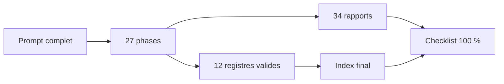

# 00 — Progression

<!-- current-state-2026-07-13:start -->

## Mise à jour code courant — 13 juillet 2026

- L’état courant ajoute [PAGE-049](<../Dashboard Admin/docs/codex/Post-audit 2026-07-13/PAGE-049-ma-collection-pokemon-go.md>), [COMP-137](<../Dashboard Admin/docs/codex/Post-audit 2026-07-13/COMP-137-trainer-pokemon-collection-panel.md>), [DATASET-020](<../Dashboard Admin/docs/codex/Post-audit 2026-07-13/DATASET-020-collection-personnelle-pokemon-go.md>) et [WORKFLOW-016](<../Dashboard Admin/docs/codex/Post-audit 2026-07-13/WORKFLOW-016-import-collection-pokemon-go.md>).
- Les volumes courants sont 49 pages/sections, 137 composants, 160 routes, 32 collections, 20 datasets et 16 workflows.
- La synthèse de l’écart est [34-post-audit-changes.md](./34-post-audit-changes.md).

<!-- current-state-2026-07-13:end -->

## 1. Objectif

Enregistrer l'état de progression, les contrôles de clôture et les limites du méga-audit.

## 2. Portée

Les 27 phases demandées, les rapports 00–33, les douze registres JSON et les cinq dépôts actifs.

## 3. Méthode

Progression par checkpoints, lecture statique, registres normalisés, rapports sectoriels, génération reproductible des dépendances/mapping/index et validation finale automatisée.

## 4. Résultats

| Champ | Valeur |
|---|---|
| Statut global | Terminé code-only |
| Pourcentage | **100 %** |
| Début audit | 2026-07-12 |
| Clôture technique | 2026-07-13 00:25 CEST |
| Dernière phase | Phase 27 — Index final |
| Repositories | 5/5 analysés |
| Rapports | 34/34 (`00` à `33`) après création de la checklist finale |
| Registres JSON | 12/12 valides |
| Blocage | Aucun |

Inventaires finaux: 48 pages/sections, 136 composants, 3 hooks, 1 contexte, 4 services, 18 providers, 19 datasets, 156 routes, 29 collections, 17 familles d'assets, 854 dépendances et 555 documents futurs.

## 5. Tableaux

### Phases

| Plage | Sujet | État |
|---|---|---|
| 1–5 | repositories, architecture, dossiers, pages, design | terminé |
| 6–10 | composants, hooks/services, providers, datasets, pipelines | terminé |
| 11–16 | API, Mongo, assets, cache, sécurité, public/privé | terminé |
| 17–23 | responsive, a11y, performance, erreurs/logs, tests, versions, déploiement | terminé |
| 24–27 | dépendances, mapping, dette, index | terminé |

### Registres

| Registre | Entrées |
|---|---:|
| pages | 48 |
| components | 136 |
| hooks / contexts / services | 3 / 1 / 4 |
| providers / datasets | 18 / 19 |
| api-routes | 156 |
| mongodb-collections | 29 |
| assets | 17 |
| dependencies | 854 arêtes |
| documentation-map | 555 |

## 6. Diagrammes Mermaid

## 7. Fichiers sources

- Prompt: `/Users/matthieuvachet/Desktop/MEGA-AUDIT-DOCUMENTATION-COMPLET.txt`.
- Rapports: `audit-documentation/00-progress.md` à `33-final-checklist.md`.
- Registres: `audit-documentation/registries/*.json`.
- Générateurs reproductibles: dependencies, documentation map et final index.

## 8. Incohérences

Les informations runtime/plateforme non accessibles ne bloquent pas la complétude code-only; elles restent explicitement marquées comme manquantes. Les trois `.DS_Store` sales préexistaient dans API/Data/Assets et n'ont pas été modifiés par l'audit.

## 9. Informations manquantes

Accès Mongo/Vercel/logs, métriques runtime, captures exhaustives, licences providers, backups et tests d'intrusion n'étaient pas disponibles ou autorisés dans ce périmètre. Ils sont listés dans le rapport 31.

## 10. Risques

Les cinq risques critiques sont conservés dans `31-gaps-and-technical-debt.md`. Aucun correctif n'a été appliqué, conformément à l'interdiction de modifier le produit pendant l'audit.

## 11. Mapping documentaire

`30-documentation-mapping.md` et `registries/documentation-map.json` transforment l'audit en 555 cibles documentaires; `32-final-index.md` est le point d'entrée exhaustif.

## 12. État de progression

**100 % — audit terminé.** Dernière action: validation finale et création de `33-final-checklist.md`.
