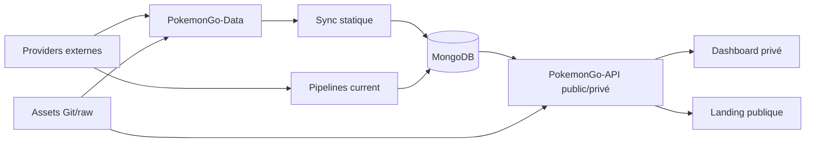

# 01 — Synthèse exécutive finale

<!-- current-state-2026-07-13:start -->

## Mise à jour code courant — 13 juillet 2026

- Le Dashboard contient maintenant la section privée [PAGE-049](<../Dashboard Admin/docs/codex/Post-audit 2026-07-13/PAGE-049-ma-collection-pokemon-go.md>).
- La fonctionnalité relie [COMP-137](<../Dashboard Admin/docs/codex/Post-audit 2026-07-13/COMP-137-trainer-pokemon-collection-panel.md>), [API-157](<../Dashboard Admin/docs/codex/Post-audit 2026-07-13/API-157-get-trainer-pokemon.md>), [API-158](<../Dashboard Admin/docs/codex/Post-audit 2026-07-13/API-158-post-trainer-pokemon-import.md>), [API-159](<../Dashboard Admin/docs/codex/Post-audit 2026-07-13/API-159-get-trainer-pokemon-imports.md>), [API-160](<../Dashboard Admin/docs/codex/Post-audit 2026-07-13/API-160-post-trainer-pokemon-rollback.md>), [COL-030](<../Dashboard Admin/docs/codex/Post-audit 2026-07-13/COL-030-trainer-pokemon-owners.md>), [COL-031](<../Dashboard Admin/docs/codex/Post-audit 2026-07-13/COL-031-trainer-pokemon-snapshots.md>), [COL-032](<../Dashboard Admin/docs/codex/Post-audit 2026-07-13/COL-032-trainer-pokemon-entries.md>), [DATASET-020](<../Dashboard Admin/docs/codex/Post-audit 2026-07-13/DATASET-020-collection-personnelle-pokemon-go.md>) et [WORKFLOW-016](<../Dashboard Admin/docs/codex/Post-audit 2026-07-13/WORKFLOW-016-import-collection-pokemon-go.md>).
- Aucune route publique, dépendance npm ou famille d’assets n’a été ajoutée.

<!-- current-state-2026-07-13:end -->

## 1. Objectif

Présenter les conclusions consolidées du méga-audit documentaire code-only des cinq dépôts, avec périmètre, architecture, inventaires, risques et niveau de confiance.

## 2. Portée

L'audit couvre Dashboard Admin, Landing-Page-PogoApi, PokemonGo-API-, PokemonGo-Data et PokemonGo-Assets-API, ainsi que leurs relations GitHub/Vercel/MongoDB visibles dans le code.

Inventaire final:

- 5 repositories;
- 4 layouts;
- 20 pages Dashboard routées + 23 sections Pokémon + 5 pages publiques Landing/API, soit 48 entrées PAGE;
- 136 composants, dont 45 façades classées Compatibility et une façade supplémentaire;
- 3 hooks custom, 1 contexte externe et 4 services;
- 18 providers et 19 datasets;
- 156 routes: 122 PokemonGo-API et 34 Dashboard;
- 29 collections MongoDB déclarées;
- 17 familles d'assets;
- 854 dépendances inter-couches;
- 555 cibles documentaires futures;
- 105 tests `node:test`, un E2E Learning et un script responsive actif.

## 3. Méthode

Lecture statique exhaustive, introspection locale des modèles sans connexion, analyse des imports/routes/configurations/workflows et génération de registres JSON. Aucun secret n'a été lu, aucun appel réseau ni accès MongoDB n'a été réalisé, et aucun build/test/import/sync/déploiement n'a été lancé lorsqu'il pouvait écrire hors du dossier d'audit.

## 4. Résultats

### Architecture et vérités

- `PokemonGo-Data` est la source canonique des référentiels statiques.
- MongoDB est la source runtime des sept datasets current et des données Dashboard.
- `.data/PokemonGo-Data` est un clone/snapshot de build, jamais une vérité canonique.
- PokemonGo-API combine Next public, Express et fonctions Vercel.
- Dashboard est une application privée mono-admin, avec domaines Events/Learning/Backlog propres et proxy serveur vers l'API.
- Assets est un dépôt Git/raw plutôt qu'une API serveur; Landing est une vitrine Next distincte.

### Public / privé

Le Shiny Tracker est confirmé privé de bout en bout: providers/adapter, collections, routes avec secret, absence d'OpenAPI et UI Dashboard avec session. Six autres datasets current et les référentiels statiques ont une lecture publique sélective. Le segment `/admin` de certaines routes GET ne garantit pas leur confidentialité; le contrôle réel a été vérifié handler par handler.

### Qualité

Les pipelines current possèdent validation, hash/diff, garde dataset vide et read-back Mongo. L'API Express a des erreurs structurées et un request ID. Les fondations responsive, les alt d'images et les tests du cœur API/Data sont solides. Le Dashboard a un E2E Learning riche.

Les dettes principales concernent la mutation production sans gate CI, le risque de token Git dans les artefacts `.data`, l'absence de rollback/alerting, les composants clients monolithiques, l'accessibilité des dialogues et la divergence versions/docs.

## 5. Tableaux

### Évaluation par domaine

| Domaine | État | Confiance |
|---|---|---:|
| Architecture et repositories | cartographiés | élevée |
| Pages/components/routes | inventaire exhaustif code | élevée |
| Datasets/providers/assets | cartographiés, licences partielles | élevée sur code, moyenne sur provenance |
| MongoDB | 29 collections code-only | élevée sur schémas, inconnue sur runtime |
| Public/privé | contrôles actuels vérifiés | élevée |
| Responsive | fondations présentes | moyenne sans rendu exhaustif |
| Accessibilité | conformité partielle, AA non démontré | moyenne |
| Performance | risques statiques identifiés | moyenne sans métriques |
| Tests | inventaire exhaustif, non exécuté | élevée sur présence |
| Déploiement/CI | configurations locales vérifiées | élevée sur code, inconnue sur plateforme |

### Risques critiques consolidés

| ID | Risque |
|---|---|
| DEBT-001 | token GitHub potentiellement conservé dans `.git/config` et inclus par `.data/**` |
| DEBT-002 | sync Mongo production sans tests/build/dry-run |
| DEBT-003 | sync statique multi-collections/stale delete sans rollback global |
| DEBT-004 | providers externes vers production sans gate contractuelle commune |
| DEBT-005 | confidentialité Shiny dépendant de plusieurs frontières à tester en non-régression |

## 6. Diagrammes Mermaid

## 7. Fichiers sources

- `02-repository-map.md` — cinq dépôts.
- `14-api-registry.md` — 156 routes.
- `15-mongodb-registry.md` — 29 collections.
- `18-authentication-and-security.md` — frontières d'accès.
- `26-deployment-and-ci.md` — Vercel/Actions.
- `31-gaps-and-technical-debt.md` — 64 dettes/informations.
- `32-final-index.md` — index exhaustif.

## 8. Incohérences

- OpenAPI 1.4.1, package API 1.7.0, changelog 1.6.1 et route v1 divergent.
- Design cible dark-only/no hardcodes versus UI dark/light à huit palettes.
- Mongo-only current versus Events avec fallback seeds et anciennes docs fichier.
- `protectedApiPaths` désigne des routes exemptées du proxy global.
- Provider contract formel uniquement pour Shiny/PvP; cinq générateurs directs coexistent.

## 9. Informations manquantes

Volumes/index réels Mongo, backups/PITR, paramètres Vercel, scopes secrets, logs/alertes production, Web Vitals, plans `explain`, licences providers/assets, tests lecteurs d'écran, releases distantes et ownership documentaire restent non trouvés ou non vérifiés.

## 10. Risques

La priorité n'est pas cosmétique: sécuriser le build credentialisé et la sync production, ajouter gates/rollback/alerting, puis renforcer sécurité de session/CSP, accessibilité des overlays, couverture Dashboard et découpage des payloads/bundles.

## 11. Mapping documentaire

Le plan de 555 documents est dans `registries/documentation-map.json`. DOC-001–010 existent et doivent être réconciliés; DOC-011–035, fiches unitaires et familles transverses peuvent être générés par vagues depuis les rapports.

## 12. État de progression

Audit documentaire terminé à 100 % en code-only. Les limites runtime sont explicitement marquées « INFORMATION NON TROUVÉE »; aucun problème n'a été corrigé conformément au prompt.
