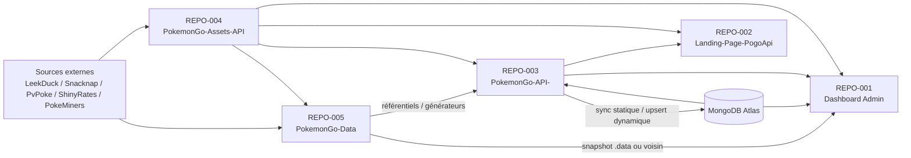
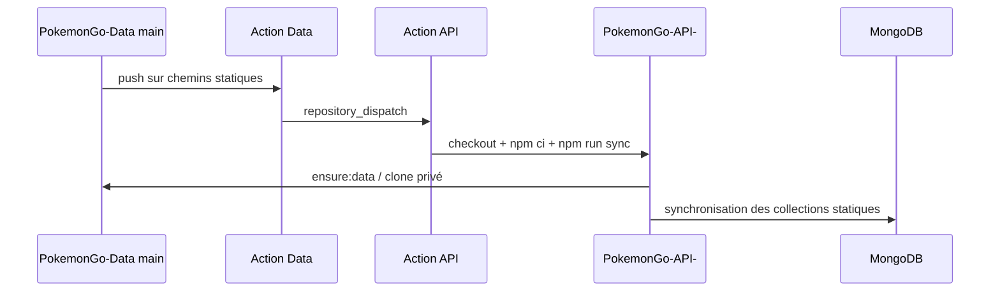
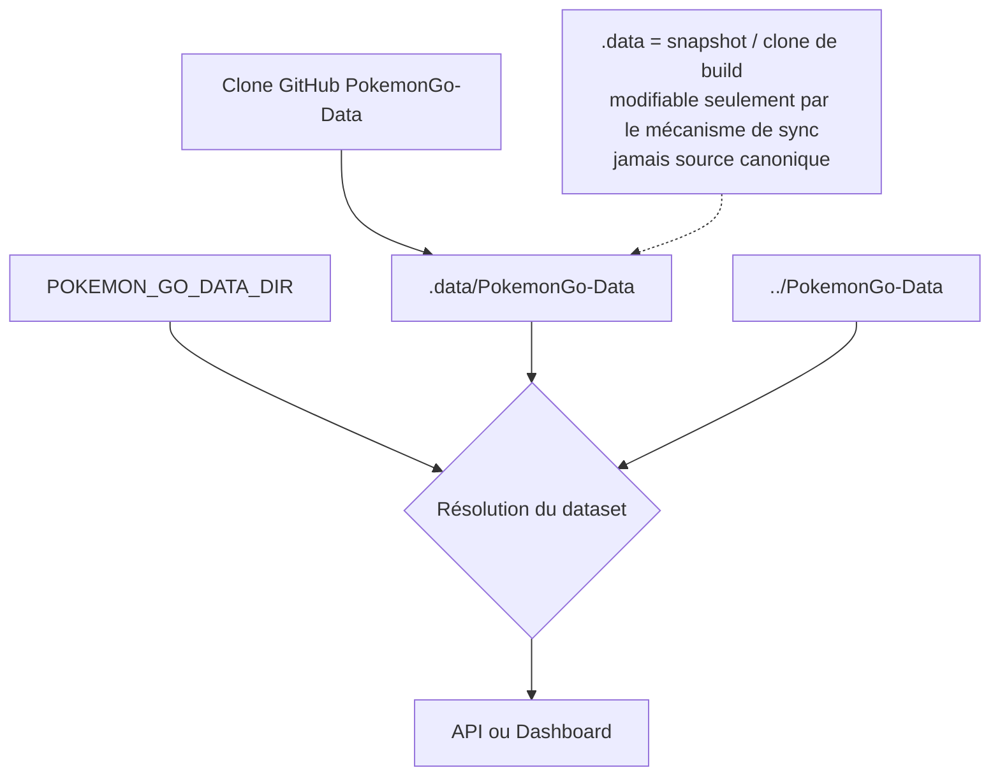

# 02 — Cartographie des repositories

<!-- current-state-2026-07-13:start -->

## Mise à jour code courant — 13 juillet 2026

- Dashboard Admin déclare désormais la version 1.21.0 dans package.json et V1.21.0 dans app-version.ts.
- Le dépôt Dashboard ajoute les fichiers trainer-pokemon, quatre handlers App Router et une suite node:test ciblée.
- Les quatre autres dépôts ne reçoivent aucun changement de code pour cette fonctionnalité.

<!-- current-state-2026-07-13:end -->

## 1. Objectif

Identifier les repositories actifs du workspace, leur rôle réel, leurs technologies, leurs entrées/sorties et leurs dépendances inter-repositories. Les archives et sauvegardes sont inventoriées séparément et ne sont pas assimilées aux sources actives.

## 2. Portée

La portée couvre les cinq racines contenant un dossier `.git` directement sous `/Users/matthieuvachet/Desktop/Workflow`. Les dossiers `.backup/`, `archives/` et `archive JSON/` sont des zones d’archives, pas des repositories actifs. Le dossier racine `docs/` contient de la documentation transverse et sera analysé pendant la phase Design System.

## 3. Méthode

- Détection des racines Git et lecture de leur branche, dernier commit, remote et état de travail.
- Lecture des manifests, scripts de build/test, configurations Next/Vercel, workflows GitHub Actions et scripts de résolution de données.
- Comptage des fichiers suivis avec `git ls-files`; les nombres excluent donc les dépendances installées et les artefacts non suivis.
- Recherche des références croisées aux noms de repositories, URLs GitHub raw et endpoint de production.
- Les fichiers `.env` réels n’ont pas été lus; seules les clés de `.env.example` ont été inventoriées.

## 4. Résultats

### 4.1 Tableau global

| ID | Repository et chemin exact | Branche auditée | Version déclarée | Fichiers suivis | Rôle confirmé | Stack / langage | Package / build / test | Déploiement confirmé |
|---|---|---:|---:|---:|---|---|---|---|
| REPO-001 | `Dashboard Admin` — `/Users/matthieuvachet/Desktop/Workflow/Dashboard Admin` | `main` | `1.20.0` | 652 | Dashboard personnel et administration Pokémon GO | Next.js App Router, React, TypeScript/JS, Tailwind 4 | npm; `next build`; ESLint, TypeScript, tests Node ciblés | Vercel présent; configuration `.vercel/` locale, mécanisme de redéploiement dans le code |
| REPO-002 | `Landing-Page-PogoApi` — `/Users/matthieuvachet/Desktop/Workflow/Landing-Page-PogoApi` | `develop` | `1.0.0` | 13 | Landing publique de présentation de l’API, bibliothèque et documentation | Next.js 15 App Router, React 19, JavaScript/JSX, Tailwind 4, GSAP | npm; `next build`; script `next lint` déclaré | Vercel explicite dans `vercel.json` |
| REPO-003 | `PokemonGo-API-` — `/Users/matthieuvachet/Desktop/Workflow/PokemonGo-API-` | `main` | `1.7.0` | 1 187 | API REST, UI publique Next.js, synchronisation MongoDB et outils checklist | Architecture hybride Next.js 15 + Express 5, JavaScript, Mongoose | npm; `next build`; `node --test`; dry-run sync | Vercel + GitHub Actions |
| REPO-004 | `PokemonGo-Assets-API` — `/Users/matthieuvachet/Desktop/Workflow/PokemonGo-Assets-API` | `main` | INFORMATION NON TROUVÉE | 22 634 | Bibliothèque de médias publiée via GitHub raw; miroir partiel de PokeMiners | Assets binaires et script Node.js; aucun manifest npm | Aucun package manager/build/test déclaré | Publication par Git/GitHub raw; aucun workflow ni Vercel trouvé |
| REPO-005 | `PokemonGo-Data` — `/Users/matthieuvachet/Desktop/Workflow/PokemonGo-Data` | `main` | `1.8.0` | 3 782 | Source privée des référentiels JSON et générateurs de datasets | JSON + scripts Node.js CommonJS | npm pour scripts; pas de dépendances déclarées; tests Node ciblés | GitHub Actions dispatch vers l’API |

### 4.2 États Git observés

| Repository | État au démarrage de l’audit |
|---|---|
| Dashboard Admin | Propre |
| Landing-Page-PogoApi | Propre |
| PokemonGo-API- | `.DS_Store` modifié avant l’audit |
| PokemonGo-Assets-API | `.DS_Store` modifié avant l’audit |
| PokemonGo-Data | `.DS_Store` non suivi avant l’audit |

Ces changements appartiennent à l’utilisateur et n’ont pas été modifiés.

### 4.3 Entrées, sorties et sources de vérité

| Repository | Consomme | Produit / expose | Source de vérité possédée |
|---|---|---|---|
| Dashboard Admin | API publique/privée, MongoDB Dashboard, clone ou voisin `PokemonGo-Data`, GitHub raw Assets | UI admin, données d’apprentissage, calendrier Events, backlog, historique de redéploiement | Données propres du Dashboard dans MongoDB; pas les référentiels Pokémon |
| Landing-Page-PogoApi | URL de production de l’API et GitHub raw Assets | Présentation publique statique/interactive | Contenu éditorial de la landing uniquement |
| PokemonGo-API- | `PokemonGo-Data`, sources externes via générateurs, MongoDB, Assets pour imports/docs | REST `/api/v1`, `/health`, OpenAPI/Redoc/Swagger, pages publiques | Contrat et comportement de l’API; MongoDB pour les datasets dynamiques courants |
| PokemonGo-Assets-API | Archive upstream `PokeMiners/pogo_assets` et assets ajoutés localement | URLs GitHub raw et familles d’images | Fichiers médias publiés; le miroir PokeMiners reste dérivé de l’upstream |
| PokemonGo-Data | LeekDuck, Snacknap, PvPoke, ShinyRates et PokeMiners selon les générateurs; Assets raw pour enrichissements | Référentiels JSON, schémas, rapports, fixtures/exports dynamiques | Référentiels statiques; pas les cinq datasets dynamiques historiques, ni les datasets ranked récents sans vérification détaillée |

### 4.4 Variables d’environnement attendues

| Repository | Clés confirmées par `.env.example` ou code |
|---|---|
| Dashboard Admin | `ADMIN_EMAIL`, `ADMIN_PASSWORD`, `SESSION_SECRET`, `MONGODB_URI`, `DASHBOARD_MONGODB_URI`, `DASHBOARD_MONGODB_DB`, `POKEMON_API_URL`, `POKEMON_API_PUBLIC_URL`, `POKEMON_API_ADMIN_SECRET`, `POKEMON_GO_DATA_DIR`, `POKEMON_GO_DATA_REPO`, `POKEMON_GO_DATA_REF`, `POKEMON_GO_DATA_TOKEN`; le code mentionne aussi `DATA_REPOSITORY_DIR`, `GH_TOKEN`, `GITHUB_TOKEN` |
| Landing-Page-PogoApi | Aucune variable obligatoire trouvée; URLs codées en dur dans le composant landing et la config image |
| PokemonGo-API- | `NODE_ENV`, `PORT`, `MONGODB_URI`, `POKEMON_GO_DATA_DIR`, `POKEMON_GO_DATA_REPO`, `POKEMON_GO_DATA_REF`, `POKEMON_GO_DATA_TOKEN`, `API_BASE_PATH`, `API_PUBLIC_URL`, `API_ADMIN_SECRET`, `CORS_ORIGINS`, `RATE_LIMIT_WINDOW_MS`, `RATE_LIMIT_MAX`, `CACHE_TTL_SECONDS`, `CACHE_MAX_ENTRIES`, `TRUST_PROXY`, `SYNC_DELETE_STALE` |
| PokemonGo-Assets-API | `POKEMINERS_POGO_ASSETS_ZIP_URL` optionnelle dans le script de synchronisation |
| PokemonGo-Data | Aucun `.env.example`; les scripts Mongo et providers lisent des variables qui seront recensées dans les phases Provider/MongoDB |

### 4.5 Frontières confirmées

1. `PokemonGo-Data` est la source de vérité déclarée des référentiels statiques. Son workflow notifie `PokemonGo-API-` sur modification de chemins statiques, puis l’API lance `npm run sync` vers MongoDB.
2. Les dossiers dynamiques `raids`, `eggs`, `max-battles`, `rocket` et `research` sont explicitement exclus du dispatch statique. Le guide du dépôt Data affirme que MongoDB est leur source de production et que les `current*.json` sont des références, fixtures ou exports.
3. Le Dashboard et l’API possèdent chacun un mécanisme `ensure-data.js` qui peut cloner `PokemonGo-Data` dans leur propre `.data/PokemonGo-Data`.
4. `PokemonGo-Assets-API` est consommé directement par URL GitHub raw depuis la landing, le Dashboard, la documentation OpenAPI et les scripts d’enrichissement de l’API.
5. Le Dashboard appelle l’API de production via `POKEMON_API_PUBLIC_URL` ou le fallback codé en dur `https://pokemon-go-api.vercel.app`.

## 5. Tableaux

### 5.1 Matrice producteur / consommateur

| Producteur | Artefact / service | Consommateurs confirmés | Criticité |
|---|---|---|---|
| PokemonGo-Data | Référentiels Pokémon, formes, moves, types, météo, générations, stickers | PokemonGo-API-, Dashboard Admin via snapshot/voisin | Critique |
| PokemonGo-Data | `repository_dispatch` `pokemon-go-data-updated` | Workflow PokemonGo-API- | Élevée |
| PokemonGo-API- | REST publique et privée | Dashboard Admin, Landing-Page-PogoApi, utilisateurs externes | Critique |
| PokemonGo-API- | Collections MongoDB synchronisées | API elle-même, Dashboard via routes | Critique |
| PokemonGo-Assets-API | URLs GitHub raw | Landing, Dashboard, API docs/imports, Data enrichi | Élevée |
| PokeMiners upstream | Archive `pogo_assets` | PokemonGo-Assets-API (miroir `PokeMiners-pogo_assets`) | Moyenne à élevée |
| Dashboard Admin | Routes Dashboard, calendrier Events, apprentissage, backlog | UI Dashboard | Élevée pour l’administration |

### 5.2 Dépendances fortes

| Source | Cible | Nature | Preuve principale |
|---|---|---|---|
| PokemonGo-API- | PokemonGo-Data | Clone/lecture au prebuild, presync et pretest | `PokemonGo-API-/package.json:9-19,62-64` |
| Dashboard Admin | PokemonGo-Data | Clone au prebuild, lecture `.data` prioritaire | `Dashboard Admin/package.json:8-9`; `src/server/pokemon-go/src/lib/data-repository.js:23-48` |
| PokemonGo-Data | PokemonGo-API- | Dispatch GitHub Actions vers l’API | `PokemonGo-Data/.github/workflows/dispatch-api-sync.yml:1-39` |
| Dashboard Admin | PokemonGo-API- | Proxy, santé et opérations admin protégées | `Dashboard Admin/src/app/api/pokemon-api-proxy/route.ts:6`; `pokemon-admin/route.ts:29` |
| Landing-Page-PogoApi | PokemonGo-API- | Lien/API de production codé en dur | `Landing-Page-PogoApi/components/landing-experience.jsx:9` |
| Multiples | PokemonGo-Assets-API | URLs raw liées à la branche `main` | `Landing-Page-PogoApi/components/landing-experience.jsx:11`; `PokemonGo-API-/scripts/import/visual-assets.js:15-17`; `Dashboard Admin/src/components/admin/pokemon/admin-app.jsx:83-84` |

### 5.3 Couplages cachés ou fragiles

| Couplage | Constat | Risque |
|---|---|---|
| Nom de dossier voisin | Les résolveurs cherchent précisément `../PokemonGo-Data` | Renommage ou disposition différente casse le fallback local |
| Branche `main` codée dans les URLs raw | Plusieurs consommateurs référencent directement `refs/heads/main` | Aucun pin de commit; une modification d’asset est immédiatement visible |
| API production codée en dur | Landing et plusieurs fallbacks Dashboard ciblent le domaine Vercel | Environnement de preview pouvant appeler la production |
| Token partagé Dashboard/API | Les appels admin exigent une égalité entre `POKEMON_API_ADMIN_SECRET` et `API_ADMIN_SECRET` | Rotation coordonnée nécessaire; diagnostic difficile en cas de divergence |
| Double clone `.data` | Dashboard et API implémentent séparément `ensure-data.js` | Divergence possible des règles de validation et de fallback |
| Dépendance Mongo non déclarée dans Data | `PokemonGo-Data/scripts/lib/mongo-refactor-utils.js` demande `mongodb` installé ailleurs ou localement | Reproductibilité insuffisante du dépôt Data seul |
| Repository nommé `PokemonGo-API-` | Tiret final présent dans chemin et remote | Scripts/automatisations sensibles au nom exact |

## 6. Diagrammes Mermaid

### 6.1 Architecture inter-repositories

### 6.2 Flux CI statique confirmé

### 6.3 Statut de `.data`

## 7. Fichiers sources

- `Dashboard Admin/package.json:1-48` — version, scripts et stack.
- `Dashboard Admin/scripts/data/ensure-data.js:5-140` — clone `.data`, ordre des fallbacks et snapshot de commit.
- `Dashboard Admin/src/server/pokemon-go/src/lib/data-repository.js:23-48` — `.data` prioritaire sur le voisin dans le runtime Dashboard.
- `Dashboard Admin/next.config.ts:3-22` — traçage de `.data` pour la route admin et domaines images.
- `Landing-Page-PogoApi/package.json:1-20` et `vercel.json:1-5` — stack et build.
- `Landing-Page-PogoApi/next.config.mjs:1-17` — domaines images GitHub raw et API.
- `PokemonGo-API-/package.json:1-102` — architecture hybride, scripts et dépendances.
- `PokemonGo-API-/src/config/env.js:17-36` — configuration runtime et fallbacks.
- `PokemonGo-API-/.github/workflows/sync-mongodb.yml:1-40` — synchronisation MongoDB.
- `PokemonGo-Data/package.json:1-75` — générateurs, tests, imports Mongo et contenu publié.
- `PokemonGo-Data/.github/workflows/dispatch-api-sync.yml:1-39` — notification de l’API, chemins dynamiques exclus.
- `PokemonGo-Data/GUIDE_WORKFLOW_MONGO.md:3-45` — distinction statique/dynamique et pipeline de production déclaré.
- `PokemonGo-Assets-API/scripts/sync-pokeminers-pogo-assets.js:8-15,52-87,132-147` — origine et remplacement du miroir PokeMiners.

## 8. Incohérences

1. Le README du Dashboard décrit plusieurs pages comme lisant les fichiers dynamiques depuis le snapshot Data, tandis que `PokemonGo-Data/GUIDE_WORKFLOW_MONGO.md:5-13,39-45` affirme qu’ils ne sont ni source de production ni fallback et que le Dashboard lit MongoDB. Les deux déclarations seront confrontées aux handlers et composants pendant les phases Pages/Pipelines.
2. `Dashboard Admin` et `PokemonGo-API-` utilisent `next: latest` contre une version fixée `^15.5.19` côté API; le lockfile est nécessaire pour connaître la version installée réelle.
3. Le script `lint` de la landing utilise `next lint`, commande susceptible de ne pas correspondre au comportement des versions Next récentes; aucune exécution n’a été faite à ce stade.
4. `PokemonGo-Assets-API` porte “API” dans son nom mais aucun serveur ou contrat API n’a été trouvé; l’interface réelle observée est GitHub raw.
5. L’API contient simultanément Next.js, Express, fonctions `api/*.js` et un `app.js` racine; l’autorité exacte de chaque entrée sera documentée en phase Architecture/Déploiement.

## 9. Informations manquantes

- Licence et version de `PokemonGo-Assets-API`: INFORMATION NON TROUVÉE.
- Tests automatisés et build de `PokemonGo-Assets-API`: INFORMATION NON TROUVÉE.
- Workflow CI de Dashboard Admin et Landing: INFORMATION NON TROUVÉE dans `.github/workflows`.
- Politique formelle de compatibilité entre versions des cinq repositories: INFORMATION NON TROUVÉE.
- Propriétaire opérationnel et SLA de chaque déploiement: INFORMATION NON TROUVÉE.
- État réel des secrets GitHub/Vercel: non vérifiable par lecture du code et volontairement non consulté.

## 10. Risques

| Sévérité | Risque | Impact potentiel |
|---|---|---|
| Critique | Confusion de source de vérité entre JSON dynamiques et MongoDB | Affichage ou publication de données obsolètes |
| Élevée | URLs raw et branche `main` non épinglées | Changement instantané sans version de consommateur |
| Élevée | Architecture API multi-entry | Divergence entre serveur local, fonctions Vercel et UI Next |
| Élevée | Dépendance au secret de dispatch avec échec volontairement silencieux | Push Data sans synchronisation MongoDB |
| Moyenne | Deux implémentations `ensure-data` | Règles de snapshot divergentes |
| Moyenne | Dépôt Assets massif sans manifest/version | Traçabilité et validation limitées |

## 11. Mapping documentaire

| Audit | Documents futurs directement alimentés |
|---|---|
| Tableau global | `DOC-005-repositories`, `ARCH-xxx`, `WORKFLOW-xxx` |
| Matrice producteur/consommateur | `ARCH-xxx`, `DATASET-xxx`, `API-xxx` |
| Frontières de vérité | `DOC-006-architecture-overview`, `DATASET-xxx`, `MONGO-xxx`, `ADR-xxx` |
| Variables et déploiement | `SEC-xxx`, `WORKFLOW-xxx`, `DOC-007-versioning` |
| Couplages cachés | `ROADMAP-xxx`, `ADR-xxx`, `31-gaps-and-technical-debt.md` |

## 12. État de progression

Phase 1 terminée pour l’inventaire des repositories actifs. Les zones d’archives sont identifiées mais leur contenu détaillé sera traité uniquement lorsqu’une phase exige de comparer un snapshot ou un audit historique. Prochaine phase: architecture logique/physique et structure des dossiers.
