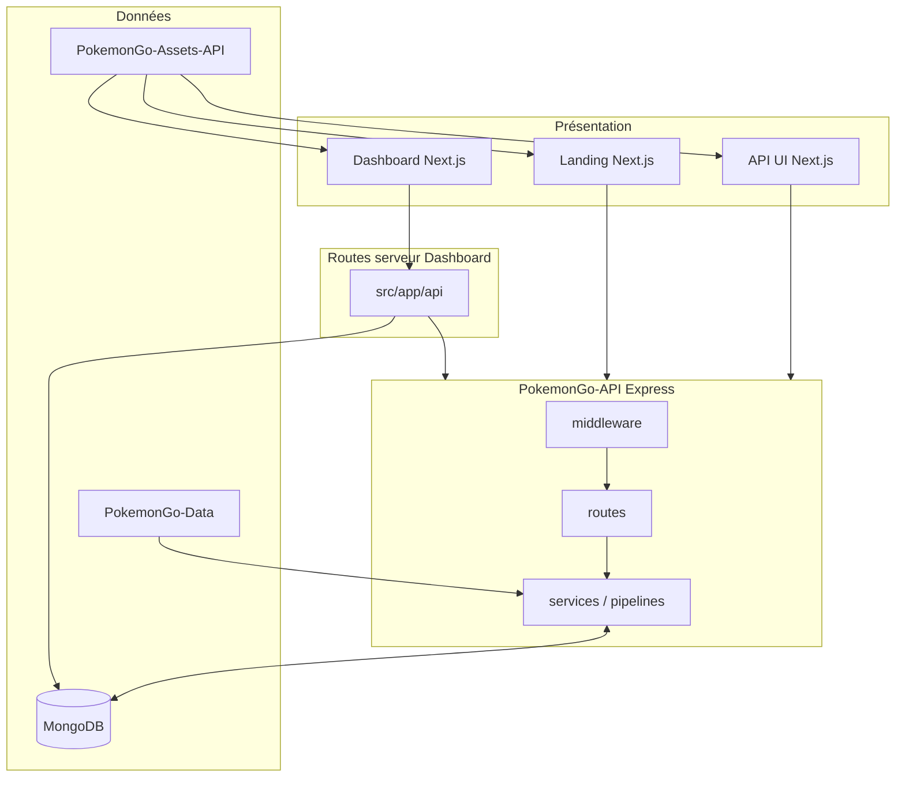
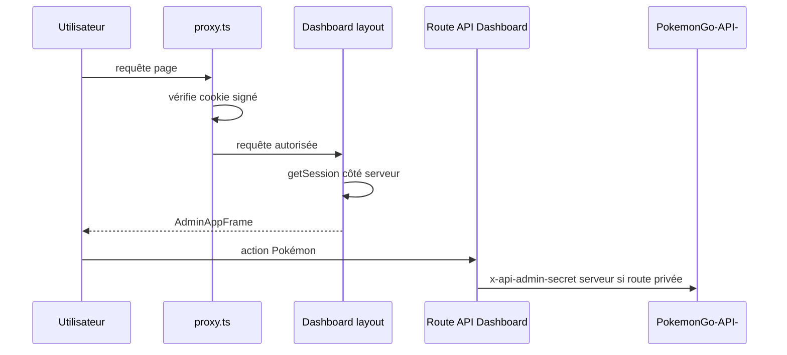
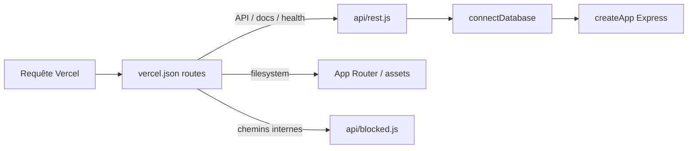

# 03 — Architecture globale

<!-- current-state-2026-07-13:start -->

## Mise à jour code courant — 13 juillet 2026

- L’architecture courante compte 49 pages/sections, 137 composants, 160 routes, 32 collections, 20 datasets et 16 workflows.
- [WORKFLOW-016](<../Dashboard Admin/docs/codex/Post-audit 2026-07-13/WORKFLOW-016-import-collection-pokemon-go.md>) reste dans le Dashboard et lit les référentiels publics PokemonGo-API avant d’écrire MongoDB Dashboard.
- Le pointeur activeSnapshotId sépare l’activation du stockage des entrées.

<!-- current-state-2026-07-13:end -->

## 1. Objectif

Décrire l’architecture logique et physique réelle, les points d’entrée, les frontières de données et les pipelines principaux avant les registres détaillés.

## 2. Portée

Architecture des cinq repositories actifs, avec un focus initial sur Dashboard Admin, PokemonGo-API-, PokemonGo-Data, MongoDB et les assets.

## 3. Méthode

Lecture des layouts et du proxy Next.js du Dashboard, des entrées Express/Vercel/Next de l’API, des modèles et services de synchronisation, des adapters de datasets courants et des scripts Data. Les comportements runtime non démontrables par le code sont marqués comme non vérifiés.

## 4. Résultats

### 4.1 Architecture logique

| Couche | Responsabilité confirmée | Implémentations principales |
|---|---|---|
| Présentation admin | Navigation, pages personnelles, outils et administration Pokémon | Dashboard Next.js App Router, `src/app`, `src/components/admin` |
| Présentation publique | Landing et pages API/bibliothèque/checklist | Landing Next.js; `PokemonGo-API-/app` |
| BFF Dashboard | Sessions, proxy API Pokémon, Events, apprentissage, backlog, stats | `Dashboard Admin/src/app/api` |
| API métier | REST versionnée, validation, présentation, auth admin, cache, erreurs | Express `PokemonGo-API-/src/app.js`, `src/routes`, `src/services`, `src/middleware` |
| Pipelines courants | Génération externe, validation, hash/diff, upsert, read-back | `src/current-datasets`, `src/lib/current-dataset-*`, générateurs Data |
| Synchronisation statique | Lecture JSON Data et bulk upsert MongoDB | `src/sync/source-reader.js`, `src/sync/sync-service.js` |
| Référentiels | JSON Pokémon, formes, moves, types, assets liés, schémas | `PokemonGo-Data` |
| Médias | Fichiers GitHub raw et miroir upstream | `PokemonGo-Assets-API` |
| Persistance | Collections API et collections propres Dashboard | MongoDB via Mongoose côté API, driver `mongodb` côté Dashboard |

### 4.2 Entrées runtime

| Système | Entrée | Usage confirmé |
|---|---|---|
| Dashboard | `src/app/layout.tsx` | Root layout, thème/providers et toaster |
| Dashboard | `src/app/(dashboard)/layout.tsx` | Contrôle de session serveur et frame admin |
| Dashboard | `src/proxy.ts` | Redirection des pages non publiques; headers de sécurité |
| API locale Express | `src/server.js` | Connexion MongoDB puis `listen` |
| API Vercel | `api/rest.js` | Connexion MongoDB puis délégation à l’app Express |
| API UI Next.js | `app/layout.js` et pages `app/*` | Landing API, bibliothèque, checklist, assets |
| API racine legacy | `app.js` | Simple `require("./src/server")`; compatibilité Node |
| Landing | `app/layout.jsx`, `app/page.jsx` | App Router public |

### 4.3 Pipeline statique confirmé

Le synchroniseur statique collecte neuf familles: `pokemon`, `pokemonAssets`, `items`, `rocketTexts`, `moves`, `types`, `weather`, `regions`, `generations`. Il compare `sourceHash` et empreinte, effectue des `bulkWrite` en upsert, peut supprimer les documents absents si `SYNC_DELETE_STALE` reste vrai, reconstruit les index, écrit les statistiques globales et un `syncRun`, puis vide le cache. Sources: `PokemonGo-API-/src/sync/sync-service.js:18-43,83-127,173-228`.

### 4.4 Pipeline courant partagé confirmé

Sept adapters sont déclarés:

| Domaine | Visibilité | Provider | Source |
|---|---|---|---|
| shiny | privée | Snacknap | `https://www.snacknap.com/pokemon/shiny` |
| pvp-rankings | publique | dépôt officiel PvPoke | `https://github.com/pvpoke/pvpoke` |
| raids | publique | LeekDuck | `/raid-bosses/` |
| eggs | publique | LeekDuck | `/eggs/` |
| max-battles | publique | Snacknap | `/max-battles` |
| research | publique | LeekDuck | `/research/` |
| rocket | publique | LeekDuck | `/rocket-lineups/` |

Le routeur commun lit uniquement MongoDB, impose le secret admin pour un adapter privé, exige un payload explicite sur `/import` et protège `/regenerate`. Le pipeline valide, calcule le hash/diff, upsert `{key: "current"}`, crée éventuellement un snapshot, invalide le cache et vérifie hash + nombre après relecture. Sources: `current-datasets/router.js:65-150`; `current-dataset-pipeline.js:101-203,206-247`.

### 4.5 Architecture Dashboard

- Root layout global: langue française, robots `noindex/nofollow`, providers de thème et notifications.
- Groupe `(dashboard)`: session serveur obligatoire puis `AdminAppFrame`.
- Frame: sidebar desktop à partir de `lg`, drawer mobile, topbar, lien d’évitement, contenu principal et historique de versions.
- Dossier canonique déclaré: `src/components/admin`. Les anciens dossiers `dashboard`, `pokemon-admin`, `checklist` sont documentés comme façades, mais la présence de gros fichiers JSX exige une vérification fichier par fichier avant de les considérer tous comme de simples exports.
- Le ThemeProvider autorise réellement `dark` et `light`, avec dark par défaut; le projet n’est donc pas confirmé “dark only”.

### 4.6 Frontières et responsabilités

| Frontière | Contrat réel observé |
|---|---|
| Dashboard → API | HTTP serveur via routes proxy/admin; secret ajouté seulement côté serveur |
| API → MongoDB | Mongoose; connexion avant handler Vercel/serveur local |
| Data → API | Fichiers JSON statiques + modules générateurs chargés depuis le repository Data |
| Data → MongoDB | Indirect via API sync ou scripts Data d’import ciblés |
| Assets → consommateurs | URLs raw GitHub; imports Data/API; médias publics |
| `.data` → runtime | Copie dérivée de build/déploiement, sélectionnée par résolveur; non canonique |

## 5. Tableaux

### 5.1 Fichiers critiques initiaux

| Fichier | Pourquoi critique |
|---|---|
| `Dashboard Admin/src/proxy.ts` | Frontière d’accès globale du Dashboard |
| `Dashboard Admin/src/app/api/pokemon-admin/route.ts` | BFF Pokémon monolithique et opérations privées |
| `Dashboard Admin/src/components/admin/pokemon/admin-app.jsx` | Composition principale de l’admin Pokémon |
| `PokemonGo-API-/src/app.js` | Middleware et montage REST global |
| `PokemonGo-API-/src/routes/index.js` | Ordre et visibilité de toutes les familles REST |
| `PokemonGo-API-/src/current-datasets/adapters.js` | Contrats, visibilité, providers et modèles des datasets courants |
| `PokemonGo-API-/src/lib/current-dataset-pipeline.js` | Persistance atomique logique et vérification read-back |
| `PokemonGo-API-/src/sync/sync-service.js` | Synchronisation des référentiels et suppression stale |
| `Dashboard Admin/scripts/data/ensure-data.js` | Recréation destructive contrôlée du snapshot `.data` pendant build |

### 5.2 Architectures concurrentes ou dupliquées

| Zone | Implémentations | Statut initial |
|---|---|---|
| Serveur API | Express local, Express sous fonction Vercel, UI Next.js, wrappers `api/checklist-v3.js` | Coexistence confirmée, responsabilités à détailler |
| Composants Dashboard | `components/admin` + anciens chemins | Migration/facades déclarées; duplication réelle à mesurer |
| Accès Data | variable explicite, `.data`, dépôt voisin, dossier `data`, parfois package | Fallbacks multiples confirmés |
| Datasets courants | JSON dans Data + MongoDB current | JSON dérivé/fixture selon guide; contradictions documentaires en cours |
| Styles | tokens CSS globaux + Tailwind + hardcodes locaux | À auditer en phase Design System |

## 6. Diagrammes Mermaid

### 6.1 Architecture physique

### 6.2 Flux Dataset courant

```mermaid
flowchart LR
  EXT["Provider externe"] --> GEN["Générateur PokemonGo-Data"]
  GEN --> PARSE["Parse + normalise + enrichit"]
  PARSE --> VALID["Adapter validate"]
  VALID --> HASH["Hash + diff"]
  HASH --> UPSERT["MongoDB upsert current"]
  UPSERT --> SNAP["Snapshot optionnel"]
  SNAP --> CACHE["Invalidation cache"]
  CACHE --> READ["Read-back hash + count"]
  READ --> API["GET API"]
  API --> DASH["Dashboard"]
```

### 6.3 Flux authentification Dashboard

### 6.4 Flux déploiement API

## 7. Fichiers sources

- `Dashboard Admin/src/app/layout.tsx:1-28`
- `Dashboard Admin/src/app/(dashboard)/layout.tsx:1-17`
- `Dashboard Admin/src/proxy.ts:1-42`
- `Dashboard Admin/src/components/admin/layout/admin-app-frame.tsx:17-138`
- `Dashboard Admin/src/components/admin/layout/admin-providers.tsx:1-18`
- `Dashboard Admin/docs/ADMIN-ARCHITECTURE.md:1-40`
- `PokemonGo-API-/vercel.json:1-21`
- `PokemonGo-API-/api/rest.js:1-9`
- `PokemonGo-API-/src/server.js:1-29`
- `PokemonGo-API-/src/app.js:19-110`
- `PokemonGo-API-/src/routes/index.js:28-109`
- `PokemonGo-API-/src/current-datasets/adapters.js:389-551`
- `PokemonGo-API-/src/current-datasets/router.js:65-150`
- `PokemonGo-API-/src/lib/current-dataset-pipeline.js:101-256`
- `PokemonGo-API-/src/sync/sync-service.js:18-236`

## 8. Incohérences

- `protectedApiPaths` dans `src/proxy.ts` sont exemptés de la vérification globale du cookie; leur sécurité dépend donc de chaque handler. Le nom de la constante peut laisser croire l’inverse. Analyse détaillée en phase Sécurité.
- Le guide d’architecture affirme que les anciens dossiers sont des façades, mais des fichiers métier volumineux y existent encore; statut à confirmer import par import.
- Les cinq datasets historiques sont exclus du sync statique, mais shiny et PvP Rankings suivent désormais le pipeline courant sans apparaître dans cette liste d’exclusion; ce n’est pas nécessairement un bug car ils n’appartiennent pas aux cibles statiques, mais la documentation doit expliquer les sept domaines.
- Une route publique et une route `/admin/*` montent le même routeur courant; la protection est effectuée au niveau de l’action et de la visibilité de l’adapter, pas seulement du préfixe.

## 9. Informations manquantes

- Transactions MongoDB multi-documents: INFORMATION NON TROUVÉE dans le pipeline courant; l’upsert, le snapshot et le read-back ne sont pas enveloppés dans une transaction visible.
- Job planifié/cron pour les datasets courants: INFORMATION NON TROUVÉE à ce stade.
- Traçage distribué entre Dashboard et API: INFORMATION NON TROUVÉE.
- Dépendances circulaires au niveau des imports: non encore calculées.
- Autorité réelle de `api/checklist-v3.js`: à analyser.

## 10. Risques

| Sévérité | Risque |
|---|---|
| Élevée | Sécurité des routes Dashboard exemptées reposant sur chaque handler |
| Élevée | Pipeline courant sans transaction visible entre current et snapshot |
| Élevée | Architecture API multi-runtime pouvant diverger |
| Moyenne | Façades legacy encore susceptibles de contenir de la logique |
| Moyenne | Fallbacks Data multiples et snapshot potentiellement décalé |

## 11. Mapping documentaire

Alimente `DOC-006-architecture-overview`, `ARCH-001` à `ARCH-006`, les fiches `WORKFLOW`, `DATASET`, `API`, `MONGO`, `SEC` et les ADR portant sur l’architecture hybride et la source de vérité.

## 12. État de progression

Architecture globale initiale terminée. Les détails sont répartis dans les phases Routing, Pipelines, API, MongoDB, Cache, Sécurité et Déploiement.
