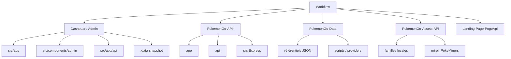

# 04 — Structure des dossiers

<!-- current-state-2026-07-13:start -->

## Mise à jour code courant — 13 juillet 2026

- Dashboard Admin contient 29 fichiers route.ts et 38 méthodes HTTP exportées.
- src/lib/trainer-pokemon contient atomic.ts, http.ts, normalize.ts, references.ts, repository.ts et schema.ts.
- Le nouveau composant est [COMP-137](<../Dashboard Admin/docs/codex/Post-audit 2026-07-13/COMP-137-trainer-pokemon-collection-panel.md>); les quatre handlers sont documentés par [API-157](<../Dashboard Admin/docs/codex/Post-audit 2026-07-13/API-157-get-trainer-pokemon.md>), [API-158](<../Dashboard Admin/docs/codex/Post-audit 2026-07-13/API-158-post-trainer-pokemon-import.md>), [API-159](<../Dashboard Admin/docs/codex/Post-audit 2026-07-13/API-159-get-trainer-pokemon-imports.md>), [API-160](<../Dashboard Admin/docs/codex/Post-audit 2026-07-13/API-160-post-trainer-pokemon-rollback.md>).

<!-- current-state-2026-07-13:end -->

## 1. Objectif

Cartographier la structure physique utile au développement sans confondre code, données, médias, caches, builds et archives.

## 2. Portée

Racines actives et dossiers fonctionnels. Les contenus de `.git`, `node_modules`, `.next`, `.vercel`, `.backup` et archives ne sont pas développés comme code source.

## 3. Méthode

Inventaire des fichiers suivis Git, arborescences ciblées et comptages par dossier/type. Les 22 634 fichiers suivis du dépôt Assets sont regroupés par famille plutôt que répétés individuellement dans ce rapport.

## 4. Résultats

### Dashboard Admin

| Dossier | Rôle réel initial |
|---|---|
| `src/app` | App Router: 20 pages confirmées, 2 layouts, 25 fichiers `route.ts` |
| `src/components/admin` | Dossier canonique; layout, navigation, dashboard, Pokémon, Events, learning, forms, stats, tables, shared, cards |
| `src/components/dashboard` | Façades de compatibilité déclarées; 28 fichiers TSX recensés |
| `src/components/pokemon-admin` | Ancien chemin; logique/facades à distinguer |
| `src/components/checklist` | Composants checklist legacy |
| `src/components/ui` | Primitives locales: badge, button, card, input, modal |
| `src/hooks/admin` | Trois hooks admin recensés |
| `src/services/admin` | Quatre services d’accès API/store recensés |
| `src/lib` | Auth, session, sécurité, Mongo/store, learning, scraping Events |
| `src/server/pokemon-go` | Copie/embarquement de logique checklist/API Pokémon; origine à comparer avec API |
| `src/data` | Contenu Dashboard, learning JSON, docs Pokémon embarquées, Events seeds |
| `public` | 385 fichiers hors artefacts; principalement médias UI |
| `.data/PokemonGo-Data` | 3 782 fichiers dérivés; clone/snapshot, non canonique |

### PokemonGo-API-

| Dossier | Rôle réel initial |
|---|---|
| `app` | App Router public: accueil, assets, bibliothèque, checklist |
| `api` | Fonctions Vercel: REST, checklist v3, blocage de chemins |
| `src/routes` | 28 modules de routes Express |
| `src/models` | 19 modèles/exportations Mongoose recensés |
| `src/current-datasets` | Adapters et routeur partagé des datasets courants |
| `src/sync` | Collecte Data et synchronisation statique |
| `src/services` | Présentation et logique Pokémon/évolution |
| `src/lib` | Auth admin, erreurs, cache, pipelines, hash, read-back, résolution Data |
| `src/middleware` | request ID, read-only, erreurs |
| `src/docs` | OpenAPI généré et pages Redoc/Swagger |
| `scripts` | ensure-data, audits, migrations, imports et sync |
| `test` | 10 fichiers recensés hors dépendances |
| `asset` | 13 763 fichiers locaux dans l’arbre de travail; volume distinct des 1 187 fichiers suivis globaux, indiquant des contenus non suivis/ignorés à classifier |
| `archive` | 13 fichiers; non actifs par défaut |

### PokemonGo-Data

| Famille | Fichiers suivis observés |
|---|---:|
| `pokemon` | 1 024 |
| `pokemon-forms` | 580 |
| `pokemon-assets` | 1 604 |
| `moves` | 468 |
| `generations` | 10 |
| `types` | 19 |
| `weather` | 8 |
| `scripts` | 36 |
| `items` | 2 |
| `rocket` | 2 |
| `eggs`, `max-battles`, `pvp-rankings`, `raids`, `research`, `shiny-tracker`, `source-watch`, `stickers` | 1 chacun |
| `schemas` | 2 |
| `test` | 3 |

Les sous-dossiers de formes/assets sont alignés sur `normal`, `alola`, `galar`, `hisui`, `paldea`, `mega`, `mega-x`, `mega-y`, `primal`, `dynamax`, `gigantamax`.

### PokemonGo-Assets-API

| Famille suivie | Nombre observé |
|---|---:|
| `PokeMiners-pogo_assets` | environ 42 398 fichiers dans l’arbre complet; seule une partie est suivie selon le total Git |
| `pokemonShuffle` | 10 319 |
| `Pokemon` | 3 538 |
| `PokemonHd` | 3 054 |
| `divers` | 2 932 |
| `Stickers` | 1 667 |
| `candy` | 549 |
| `LocationCards` | 234 |
| `MegaPortraits` | 170 |
| `items` | 129 |
| `Types` / `TypeBackgrounds` | 19 chacun |
| `weather` | 8 |

L’arbre complet contient environ 65 041 fichiers contre 22 634 suivis Git. Le manifeste `.gitignore` et le statut des familles upstream devront expliquer l’écart dans l’audit Assets/Cache.

### Landing-Page-PogoApi

Structure minimale: `app` (layout, page, CSS), `components/landing-experience.jsx`, configurations Next/PostCSS/Vercel et manifests npm. Aucun dossier de tests ou route serveur n’a été trouvé.

## 5. Tableaux

### Zones à exclure des analyses de code par défaut

| Zone | Classification |
|---|---|
| `*/node_modules` | Dépendances installées |
| `*/.next` | Build/cache Next.js |
| `*/.vercel` | Métadonnées locales de lien Vercel |
| `.backup`, `archives`, `archive JSON` | Sauvegardes/archives utilisateur |
| `Dashboard Admin/.data` | Snapshot Data de build/déploiement |
| `PokemonGo-Assets-API/.pokeminers-cache` | Cache de téléchargement/extraction |
| `PokemonGo-API-/archive` | Code/contenu archivé |

## 6. Diagrammes Mermaid

## 7. Fichiers sources

- `Dashboard Admin/docs/ADMIN-ARCHITECTURE.md:1-40`
- `Dashboard Admin/src/app`, `src/components`, `src/hooks`, `src/services`, `src/server`
- `PokemonGo-API-/src`, `api`, `app`, `scripts`, `test`
- `PokemonGo-Data/package.json:52-73` et arborescence suivie
- `PokemonGo-Assets-API/scripts/sync-pokeminers-pogo-assets.js:8-15,80-87,132-147`

## 8. Incohérences

- L’inventaire par arborescence contient nettement plus de fichiers que Git dans API Assets; les fichiers non suivis/ignorés ne doivent pas être présentés comme artefacts versionnés.
- Des dossiers de routes Dashboard existent sans `page.tsx` (`assistant`, `notion`, anciennes racines hors groupe); leur statut sera traité dans le registre Pages.
- `src/server/pokemon-go` embarque du code ressemblant au repository API/checklist et constitue un risque de duplication.

## 9. Informations manquantes

- Origine exacte et statut de chaque fichier non suivi du dossier `PokemonGo-API-/asset`: INFORMATION NON TROUVÉE.
- Politique de conservation des archives racine: INFORMATION NON TROUVÉE.
- Génération automatique des facades Dashboard: INFORMATION NON TROUVÉE.

## 10. Risques

- Analyse ou modification accidentelle de snapshots/caches si les frontières ne sont pas respectées.
- Duplication de logique entre Dashboard embarqué et API.
- Très grand volume d’assets sans registre/version de famille explicite.
- Dossiers vides/legacy pouvant être pris pour des routes actives.

## 11. Mapping documentaire

Alimente `DOC-005-repositories`, `DOC-006-architecture-overview`, `ARCH-xxx`, `ASSET-xxx`, `DATASET-xxx`, `COMP-xxx` et les templates de navigation du code.

## 12. État de progression

Structure physique initiale terminée. Les registres détaillés utiliseront exclusivement les fichiers actifs et marqueront explicitement les caches, snapshots, facades et archives.
