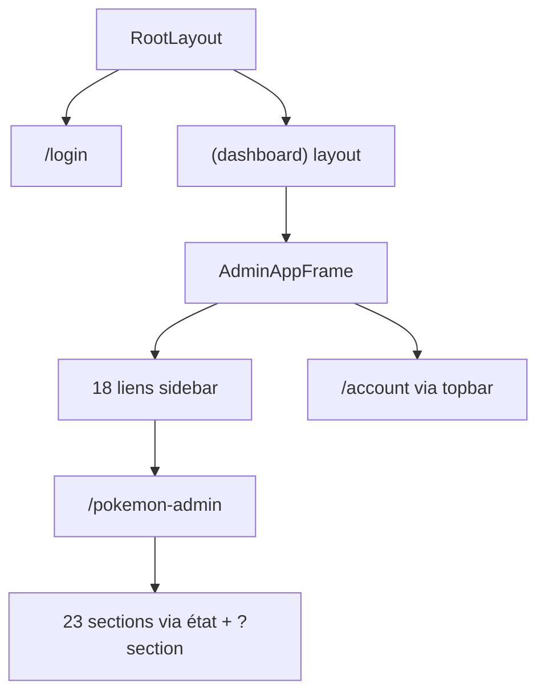

# 05 — Routage et layouts

<!-- current-state-2026-07-13:start -->

## Mise à jour code courant — 13 juillet 2026

- [PAGE-049](<../Dashboard Admin/docs/codex/Post-audit 2026-07-13/PAGE-049-ma-collection-pokemon-go.md>) est une section client de /pokemon-admin identifiée par section=my-collection; elle ne crée pas un fichier page.tsx supplémentaire.
- Quatre fichiers route.ts privés servent lecture, preview/commit, historique et rollback.
- Le nombre de pages routées Dashboard reste 20; le nombre de sections Admin Pokémon passe à 24.

<!-- current-state-2026-07-13:end -->

## 1. Objectif

Documenter les routes de pages, layouts, protections, navigation globale et navigation interne du studio Pokémon.

## 2. Portée

Dashboard Admin en détail, plus les cinq pages publiques Landing/API et leurs layouts.

## 3. Méthode

Inventaire des fichiers `page.tsx`, `layout.tsx`, des déclarations de navigation et des conditions de rendu par section. Les dossiers sans fichier page ne sont pas considérés comme routes actives.

## 4. Résultats

### 4.1 Layouts Dashboard

| Layout | Portée | Responsabilités |
|---|---|---|
| `src/app/layout.tsx` | Toutes les routes | Métadonnées, langue `fr`, `noindex/nofollow`, ThemeProvider, Toaster |
| `src/app/(dashboard)/layout.tsx` | Toutes les pages du groupe dashboard | `getSession`, redirect `/login`, `AdminAppFrame` |
| `AdminAppFrame` | UI protégée | sidebar, drawer mobile, topbar, skip-link, main, footer, modal historique |
| Login | Hors groupe dashboard | Page publique autonome avec formulaire POST `/api/session` |

### 4.2 Routes de pages confirmées

Le Dashboard contient 20 pages actives: `/login` et 19 pages protégées (`/`, `/account`, `/analytics`, `/calendar`, `/database`, `/exercices-javascript`, `/js-progress`, `/kanban`, `/notes`, `/palette`, `/pokemon-admin`, `/pokemon-docs`, `/pomodoro`, `/projects`, `/snippets`, `/todo`, `/tools`, `/tools/dashboard-backlog`, `/writer`).

Les dossiers `src/app/(dashboard)/assistant`, `notion`, `tools/workspace-scripts` et plusieurs anciennes racines sous `src/app` ne contiennent pas de `page.tsx`; ils ne constituent pas des pages actives observées.

### 4.3 Navigation globale

La sidebar expose 18 liens répartis en cinq groupes:

| Groupe | Liens |
|---|---|
| Dashboard | Accueil, Analytics, Outils, Dashboard Backlog |
| Pokémon Data | Admin Pokémon, Docs JSON |
| Organisation | Notes, Kanban, Projets, Calendrier, Todo, Texte |
| Studio JS | JS Progress, Pomodoro, Exercices JS, Snippets, Couleurs |
| Système | Mongo DB |

`/account` est une route active non présente dans `navGroups`; elle est accessible depuis les contrôles de compte/topbar. `/login` n’appartient naturellement pas à la sidebar.

### 4.4 Navigation studio Pokémon

`/pokemon-admin` est une seule route qui rend 23 sections client via l’état `active` et le paramètre de requête `?section=`. Les sections sont: Accueil, Fiches, Candies, Background, Collections, Assets, Catalogues, Raids, Max Battles, Rocket, PvP Rankings, Œufs, Research, Calendrier Events, Shiny Tracker, Contrôles, Veille, Comparaison, Todo-list, Logs & MAJ, Règles JSON, Corrections, Export. Le code source liste exactement ces 23 entrées entre les lignes 85 et 108. Aucun onglet “Settings” ou “Éditeur” autonome n’est présent dans cette navigation; des éditeurs existent à l’intérieur des fiches/règles/modales.

Le paramètre `section` est lu une fois au montage et accepté seulement s’il correspond à un identifiant de `navItems` (`admin-app.jsx:983-986`). Un changement d’onglet ne crée pas une route Next distincte.

### 4.5 Responsive de navigation confirmé par le code

- Sidebar desktop masquée avant `lg`; largeur 236 px ou 286 px à `2xl`, réductible à 84 px.
- Drawer mobile largeur fixe 286 px, overlay et animation Framer Motion; fermeture sur overlay.
- Padding du contenu synchronisé avec la largeur de sidebar.
- Groupes ouverts persistés sous `matweb.dashboard.sidebarGroups`.
- Lien d’évitement vers `#dashboard-content`; `main` reçoit `tabIndex=-1`.
- L’état actif global exige une égalité exacte entre `pathname` et `href`.

### 4.6 Protection

Le proxy protège les pages hors chemins publics et redirige vers `/login?next=...`; le layout dashboard revérifie la session côté serveur. Certaines routes API sont volontairement exemptées du proxy global, leur protection étant déléguée aux handlers. Cette délégation sera auditée route par route dans les rapports API/Sécurité.

### 4.7 Pages publiques confirmées

| Projet | Route | Page | Layout |
|---|---|---|---|
| Landing-Page-PogoApi | `/` | `app/page.jsx` | `app/layout.jsx` |
| PokemonGo-API- | `/` | `app/page.js` | `app/layout.js` |
| PokemonGo-API- | `/assets` | `app/assets/page.js` | `app/layout.js` |
| PokemonGo-API- | `/bibliotheque` | re-export de checklist | `app/layout.js` |
| PokemonGo-API- | `/checklist` | `app/checklist/page.js` | `app/layout.js` |

Les pages Redoc et Swagger sont des routes Express HTML, recensées comme API-003/API-005 et non comme fichiers App Router.

## 5. Tableaux

### Matrice route / navigation / auth

| Catégorie | Nombre | Sidebar | Session |
|---|---:|---|---|
| Pages protégées visibles dans sidebar | 18 | Oui | Proxy + layout |
| Page compte | 1 | Non, via topbar | Proxy + layout |
| Login | 1 | Non | Publique |
| Sections internes Pokémon | 23 | Navigation locale | Héritent de `/pokemon-admin`; actions serveur selon handler |
| Pages publiques Landing/API | 5 | Navigation publique | Aucune session |

## 6. Diagrammes Mermaid

## 7. Fichiers sources

- `Dashboard Admin/src/app/layout.tsx:1-28`
- `Dashboard Admin/src/app/(dashboard)/layout.tsx:1-17`
- `Dashboard Admin/src/proxy.ts:6-42`
- `Dashboard Admin/src/data/dashboard.ts:34-87`
- `Dashboard Admin/src/components/admin/layout/admin-app-frame.tsx:17-138`
- `Dashboard Admin/src/components/admin/pokemon/admin-app.jsx:85-108,983-986,1929-2395`

## 8. Incohérences

- La route `/account` n’est pas dans le registre central `navItems`, donc le titre actif de la topbar retombe sur “Accueil” si aucune logique spéciale n’existe ailleurs.
- Plusieurs dossiers de routes vides/legacy peuvent induire en erreur pendant un inventaire basé uniquement sur les dossiers.
- La navigation interne Pokémon ne synchronise pas visiblement chaque changement d’onglet dans l’URL; reprise, partage et historique navigateur peuvent donc rester limités.
- Le terme `protectedApiPaths` dans le proxy désigne en pratique des chemins exemptés de vérification globale.

## 9. Informations manquantes

- Breadcrumbs globaux: INFORMATION NON TROUVÉE.
- Matrice de rôles multiples: INFORMATION NON TROUVÉE; le Dashboard semble mono-admin.
- Test automatisé clavier/drawer/navigation: INFORMATION NON TROUVÉE.

## 10. Risques

- Titre actif incorrect pour routes non déclarées dans la sidebar.
- Sections Pokémon non adressables de manière durable si l’état n’est pas réécrit dans l’URL.
- Sécurité API fragmentée entre proxy et handlers.
- Drawer sans verrouillage de focus confirmé par le code inspecté.

## 11. Mapping documentaire

Alimente `PAGE-xxx`, `TEMPLATE-xxx`, `RESP-xxx`, `SEC-xxx`, la documentation Navigation et les composants `AdminAppFrame`, `AdminSidebar`, `AdminTopbar`, `AdminSectionNavigation`.

## 12. État de progression

Routage et layouts recensés. Les états, données et risques détaillés par page sont poursuivis dans `07-pages-registry.md`.
