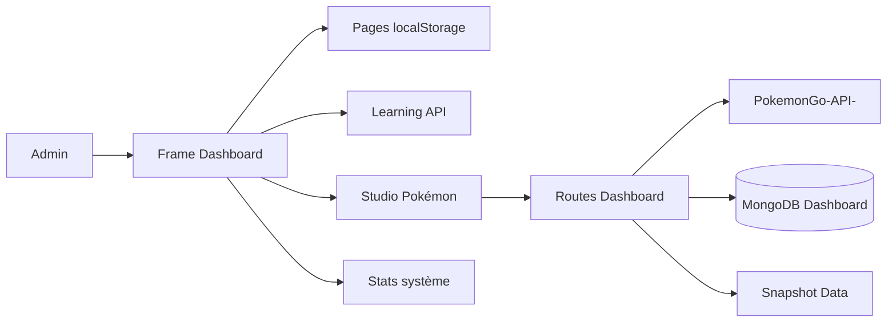

# 06 — Vue d’ensemble du Dashboard

<!-- current-state-2026-07-13:start -->

## Mise à jour code courant — 13 juillet 2026

- AdminApp expose 24 sections et charge [COMP-137](<../Dashboard Admin/docs/codex/Post-audit 2026-07-13/COMP-137-trainer-pokemon-collection-panel.md>) avec next/dynamic.
- La section Ma collection utilise les primitives Badge, Button, Card, Input et Modal.
- Les opérations passent exclusivement par les quatre handlers privés du Dashboard.

<!-- current-state-2026-07-13:end -->

## 1. Objectif

Décrire le produit Dashboard réel, ses domaines fonctionnels, stockages et principaux états avant les fiches page par page.

## 2. Portée

Toutes les routes UI actives et le studio Pokémon embarqué.

## 3. Méthode

Lecture des pages, composants racines, appels `fetch`, usages de `usePersistentState`, navigation et handlers correspondants.

## 4. Résultats

### Domaines fonctionnels

| Domaine | Pages / sections | Stockage ou source principale confirmée |
|---|---|---|
| Cockpit | Accueil, Analytics | localStorage agrégé + `/api/pokemon-stats` |
| Outils | Outils, Backlog | localStorage pour outils; MongoDB/seeds via API pour backlog |
| Pokémon Data | Admin Pokémon, Docs JSON | BFF `/api/pokemon-admin`, API Pokémon, MongoDB, snapshot Data, Markdown embarqué |
| Organisation | Notes, Kanban, Projets, Calendrier, Todo, Writer | `usePersistentState` / localStorage |
| Apprentissage | JS Progress, Exercices JS, analytics | API learning/MongoDB avec contenu JSON embarqué; certains outils locaux |
| Studio personnel | Pomodoro, Snippets, Couleurs | état client persistant/local |
| Système | Mongo DB | `/api/database-stats` |
| Compte | Account/Login | cookie de session signé, variables serveur |
| Events Pokémon | Calendrier interne du studio | `/api/events` public + CRUD `/api/admin/events`; MongoDB ou seeds selon disponibilité |

### Composition UI globale

- Sidebar de groupes, topbar, titre actif, contrôles de palette/compte/version.
- Contenu centré à 1680 px, espacements responsives et footer par page.
- Primitives locales `Badge`, `Button`, `Card`, `Input`, `Modal` et composants spécialisés.
- Notifications Sonner, animations Framer Motion, graphiques Recharts, tri dnd-kit.
- Dark par défaut mais thème light réellement configuré.

### États transverses observés

| État | Implémentation observée |
|---|---|
| Loading | composants `DashboardLoadingState`, flags spécifiques par dataset, bootstrap studio |
| Error | messages inline et toasts; états d’erreur du bootstrap/datasets |
| Empty | nombreuses listes conditionnelles; couverture détaillée page par page en cours |
| Refreshing/regenerating | flags distincts pour raids, eggs, max, rocket, research, shiny, PvP |
| Success | toasts et données rendues |
| Disabled | boutons sans URL, actions pendant chargement selon composant |
| Readonly | Corrections/Export en textarea readonly; docs viewer |
| Stale | `cache: no-store` sur données courantes; localStorage sans version globale uniforme |

### Studio Pokémon

Le studio est un composant client monolithique qui bootstrap en parallèle fiches, catalogue, assets, historique Git, règles, historique sources et redéploiement, puis charge paresseusement les datasets courants lorsqu’une section devient active. Il combine:

- registre de fiches, filtres génération/qualité et modale détail;
- datasets courants avec refresh, téléchargement et régénération;
- audit d’assets et bibliothèques GitHub raw;
- calendrier Events CRUD/scrape/import;
- règles JSON, contrôles, brouillons de corrections et export;
- veille, historiques source/Git/déploiement et redéploiement Data.

## 5. Tableaux

### Stockage local confirmé

| Clé/famille | Consommateurs |
|---|---|
| `matweb.notes` | Notes, Accueil |
| `matweb.todos` | Todo, Accueil, Analytics |
| `matweb.kanban` | Kanban, Accueil |
| `matweb.projects` | Projets, Accueil, Analytics |
| `matweb.calendar` | Calendrier personnel, Accueil |
| `matweb.tools.*` | Outils, Snippets, Accueil |
| `matweb.palette.swatches` | Couleurs |
| `matweb.dashboard.sidebarGroups` | Layout/navigation |
| `matweb.pokemonAdmin.widgetOrder` | Widgets overview Pokémon |
| collections/todo legacy Pokémon | Sections Collections/Todo; clés exactes à détailler en phase Cache |

## 6. Diagrammes Mermaid

## 7. Fichiers sources

- `Dashboard Admin/src/data/dashboard.ts:34-87`
- `Dashboard Admin/src/components/admin/layout/admin-app-frame.tsx:17-138`
- `Dashboard Admin/src/components/admin/dashboard/dashboard-home-live.tsx:97-112`
- `Dashboard Admin/src/components/admin/pokemon/admin-app.jsx:1006-1838,1929-2395`
- `Dashboard Admin/src/components/admin/events/events-calendar-panel.jsx:416-625`
- `Dashboard Admin/src/app/(dashboard)/projects/page.tsx:51-108`

## 8. Incohérences

- Produit personnel généraliste et console Pokémon complexe partagent le même shell, mais leurs modèles de persistance diffèrent fortement.
- Certaines pages sont de minces wrappers; `ProjectsPage` conserve au contraire toute sa logique dans le fichier route.
- Architecture canonique `components/admin` mais présence de chemins legacy et code serveur Pokémon embarqué.

## 9. Informations manquantes

- Priorités produit et utilisateurs autres que l’admin unique: INFORMATION NON TROUVÉE.
- Télémétrie d’usage par page: INFORMATION NON TROUVÉE.
- Contrats de sauvegarde/export des données localStorage: partiels.

## 10. Risques

- Perte de données personnelles stockées uniquement dans le navigateur.
- Complexité et rerenders potentiels du monolithe `admin-app.jsx`.
- Modèles d’erreur et de persistance hétérogènes entre domaines.
- Duplication entre données docs embarquées et documentation API source.

## 11. Mapping documentaire

Alimente les fiches `PAGE`, `COMP`, `ARCH`, `DATASET`, `RESP`, `PERF`, `SEC`, `WORKFLOW` et les templates de page Dashboard.

## 12. État de progression

Vue produit initiale terminée. La granularité par page et section est enregistrée dans `07-pages-registry.md` et `registries/pages.json`.
