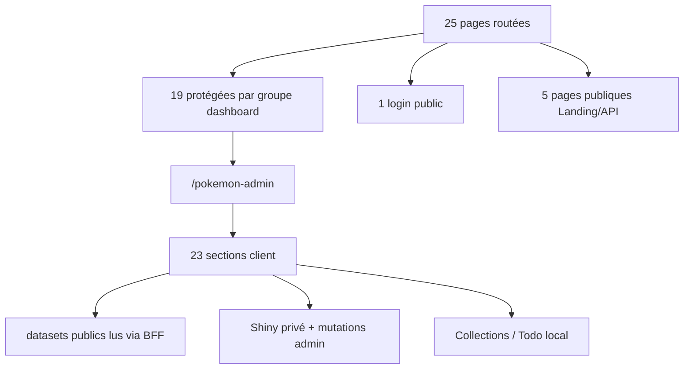

# 07 — Registre des pages et sections

<!-- current-state-2026-07-13:start -->

## Mise à jour code courant — 13 juillet 2026

- Le registre courant contient 49 entrées: 25 pages routées publiques/privées et 24 sections Admin Pokémon.
- [PAGE-049](<../Dashboard Admin/docs/codex/Post-audit 2026-07-13/PAGE-049-ma-collection-pokemon-go.md>) rend [COMP-137](<../Dashboard Admin/docs/codex/Post-audit 2026-07-13/COMP-137-trainer-pokemon-collection-panel.md>) et consomme [DATASET-020](<../Dashboard Admin/docs/codex/Post-audit 2026-07-13/DATASET-020-collection-personnelle-pokemon-go.md>).
- La section exige la session admin et ne possède aucune route publique.

<!-- current-state-2026-07-13:end -->

## 1. Objectif

Recenser toutes les pages applicatives actives des trois interfaces et toutes les sections fonctionnelles du studio Pokémon, avec IDs documentaires stables proposés sans modifier le code.

## 2. Portée

20 pages App Router Dashboard, 23 sections internes de `/pokemon-admin` et 5 pages publiques Landing/API, soit 48 entrées.

## 3. Méthode

Une page routée exige un fichier `page.tsx`. Une section Pokémon exige une entrée `navItems` et une condition de rendu `active === id`. Les composants, stockages et API sont tirés des imports et appels visibles; “à détailler” signifie qu’un audit approfondi du composant reste nécessaire.

## 4. Résultats

### 4.1 Pages routées

| ID | Nom | Route | Fichier / composant racine | Auth / visibilité | Données et actions principales |
|---|---|---|---|---|---|
| PAGE-001 | Connexion | `/login` | `src/app/login/page.tsx` | Publique | POST `/api/session`; erreur d’identifiants; redirect `next` |
| PAGE-002 | Accueil | `/` | `DashboardHomeLive` | Session | Agrège localStorage et `/api/pokemon-stats`; widgets triables |
| PAGE-003 | Analytics | `/analytics` | `LearningAnalytics` | Session | localStorage todos/projets et analytics learning |
| PAGE-004 | Outils | `/tools` | `DailyTools` | Session | liens, snippets, abonnements, contacts, journal, focus en localStorage |
| PAGE-005 | Dashboard Backlog | `/tools/dashboard-backlog` | `DashboardBacklog` | Session + handler | GET/POST/PATCH/DELETE `/api/dashboard-backlog`; MongoDB/fallback à confirmer |
| PAGE-006 | Admin Pokémon | `/pokemon-admin` | `PokemonAdminStudio` → `AdminApp` | Session; actions privées serveur | 23 sections; BFF `/api/pokemon-admin`; API, MongoDB, Data, Assets |
| PAGE-007 | Docs JSON | `/pokemon-docs` | Status + Explorer + Viewer | Session | Lit 10 Markdown embarqués; santé API; proxy OpenAPI et tests de routes |
| PAGE-008 | Notes | `/notes` | `NotesBoard` | Session | CRUD local `matweb.notes` |
| PAGE-009 | Kanban | `/kanban` | `KanbanBoard` | Session | Tableau local `matweb.kanban`, drag/drop |
| PAGE-010 | Projets | `/projects` | Logique inline `ProjectsPage` | Session | CRUD local `matweb.projects`, projets JS guidés, liens externes |
| PAGE-011 | Calendrier | `/calendar` | `CalendarPlanner` | Session | Événements personnels `matweb.calendar` |
| PAGE-012 | Todo | `/todo` | `TodoList` | Session | Todo personnelle `matweb.todos` |
| PAGE-013 | Texte | `/writer` | `WriterStudio` | Session | Documents locaux, édition texte |
| PAGE-014 | JS Progress | `/js-progress` | `JsProgress` | Session + API handlers | Learning repository/API, import/export/rollback, progression |
| PAGE-015 | Pomodoro | `/pomodoro` | `Pomodoro` | Session | Timer et focus local à détailler |
| PAGE-016 | Exercices JS | `/exercices-javascript` | `JavaScriptExercises` | Session | Exercices et données learning embarquées/locales |
| PAGE-017 | Snippets | `/snippets` | `SnippetVault` | Session | CRUD `matweb.tools.snippets` |
| PAGE-018 | Couleurs | `/palette` | `ColorLab` | Session | Swatches `matweb.palette.swatches` |
| PAGE-019 | Mongo DB | `/database` | `DatabaseStats` | Session + handler | GET `/api/database-stats`, refresh, état erreur/chargement |
| PAGE-020 | Compte | `/account` | `AccountPage` | Session | Email de session, statut, préférences locales; lecture seule |

### 4.2 Sections du studio Pokémon

Toutes héritent de `/pokemon-admin`, du layout protégé et de `AdminApp`. La route logique partage `?section=<id>` mais les changements de section restent un état client.

| ID | Section / identifiant | Composant ou rendu | Données / actions confirmées | Visibilité dataset |
|---|---|---|---|---|
| PAGE-021 | Accueil / `overview` | KPI + `SortableWidgetGrid` | bootstrap fiches/catalogues/assets/historiques; ordre local | Admin |
| PAGE-022 | Fiches / `pokedex` | filtres + `PokemonCard` + détail | référentiels Data via BFF; pagination “load more”; contrôles assets | Admin |
| PAGE-023 | Candies / `candies` | `CandyPanel` | fiches + assets candy | Admin |
| PAGE-024 | Background / `backgrounds` | `BackgroundPanel` | LocationCards Assets + liens des fiches | Admin |
| PAGE-025 | Collections / `collections` | `CollectionsPanel` | collections locales + fiches | Admin/local |
| PAGE-026 | Assets / `assets` | rendu inline + `AssetStatCard` | audit GO/HOME/portraits/shuffle/background/candy; copie URL | Admin; assets publics |
| PAGE-027 | Catalogues / `catalogs` | `CatalogPanel` | types, météo, moves, générations, régions à confirmer | Admin |
| PAGE-028 | Raids / `raids` | `RaidsPanel` | GET current, refresh, download, regenerate | Dataset public; mutation privée |
| PAGE-029 | Max Battles / `max-battles` | `MaxBattlesPanel` | GET current, refresh, download, regenerate | Dataset public; mutation privée |
| PAGE-030 | Rocket / `rocket` | `RocketPanel` | current Rocket + rocket texts, download/regenerate | Dataset public; mutation privée |
| PAGE-031 | PvP Rankings / `pvp-rankings` | `PvpRankingsPanel` | GET filtré, download, regenerate PvPoke | Dataset public; mutation privée |
| PAGE-032 | Œufs / `eggs` | `EggsPanel` | GET current, refresh, download, regenerate | Dataset public; mutation privée |
| PAGE-033 | Research / `research` | `ResearchPanel` | current Research + items, download/regenerate | Dataset public; mutation privée |
| PAGE-034 | Calendrier Events / `events` | `EventsCalendarPanel` | public GET + CRUD/scrape/import admin | Page admin; lecture API Events publique |
| PAGE-035 | Shiny Tracker / `shiny` | `ShinyTrackerPanel` | GET privé, historique, filtres, download, regenerate | Privée confirmée |
| PAGE-036 | Contrôles / `checks` | `ControlCardsPanel` | fiches à problèmes + règles custom | Admin |
| PAGE-037 | Veille / `sources` | `SourceRows` | source-watch, historique, vérification immédiate | Admin |
| PAGE-038 | Comparaison / `compare` | rendu inline + 2 `PokemonCard` | compare deux fiches chargées | Admin |
| PAGE-039 | Todo-list / `todo` | `AdminTodoPanel` | tâches admin Pokémon, stockage local/legacy | Admin/local |
| PAGE-040 | Logs & MAJ / `logs` | `UpdateLogPanel` | Git, historique sources, déploiements | Admin |
| PAGE-041 | Règles JSON / `rules` | `RulesPanel` | preview/save/toggle/delete règles; sync GitHub | Admin; mutations BFF |
| PAGE-042 | Corrections / `bulk` | textarea readonly | brouillon JSON groupé, aucune écriture source | Admin/readonly |
| PAGE-043 | Export / `export` | textarea readonly + clipboard | export du filtre courant | Admin/readonly |

### 4.3 Pages publiques Landing/API

| ID | Projet | Route | Fichier / composant | Données |
|---|---|---|---|---|
| PAGE-044 | Landing | `/` | `LandingExperience` | API publique + assets raw |
| PAGE-045 | PokemonGo-API | `/` | `HomePage` serveur | `loadSiteDashboard`, snapshot Data |
| PAGE-046 | PokemonGo-API | `/assets` | `AssetsApp` | catalog + audit checklist public |
| PAGE-047 | PokemonGo-API | `/bibliotheque` | re-export `ChecklistPage` | alias public de checklist |
| PAGE-048 | PokemonGo-API | `/checklist` | `ChecklistApp` | bootstrap/catalog/détail publics |

### 4.4 Structure UI et états

- En-tête global/topbar et navigation sont fournis par le layout à toutes les pages protégées.
- Les pages wrappers délèguent leur structure au composant racine; `ProjectsPage`, `AccountPage`, `LoginPage`, `PokemonDocsPage` gardent une composition dans le fichier route.
- Le studio expose loading/error bootstrap, chargements et régénérations indépendants, toasts success/error, listes paginées par “load more”, modales et historiques.
- Aucun `loading.tsx` ou `error.tsx` Dashboard n’a été trouvé dans l’inventaire initial; les états sont locaux aux composants.

### 4.5 Responsive, accessibilité et performance

| Axe | Confirmé | À approfondir |
|---|---|---|
| Responsive | grilles `sm/md/lg/xl/2xl`, sidebar/drawer, max-width 1680 | tableaux, modales, calendriers, scrolls imbriqués |
| Accessibilité | skip-link, `main`, labels login, boutons typés, alt présent dans les éléments recensés | focus trap modales/drawer, ARIA, contrastes, titres par page |
| Performance | lazy image sur filtres, load-more fiches/assets, fetch paresseux datasets | monolithe AdminApp, rerenders, absence de virtualisation visible |

## 5. Tableaux

Le registre machine `registries/pages.json` contient 48 entrées avec type, projet/route, composant, auth, visibilité, source de données et preuve principale.

## 6. Diagrammes Mermaid

## 7. Fichiers sources

- Tous les `Dashboard Admin/src/app/**/page.tsx` actifs.
- `Dashboard Admin/src/data/dashboard.ts:34-87`.
- `Dashboard Admin/src/components/admin/pokemon/admin-app.jsx:85-108,983-1134,1929-2395`.
- Appels API/storage sous `Dashboard Admin/src/components/admin` recensés par recherche `fetch`, `/api/`, `usePersistentState`, `localStorage`.
- `Landing-Page-PogoApi/app/page.jsx`.
- `PokemonGo-API-/app/page.js`, `app/assets/page.js`, `app/bibliotheque/page.js`, `app/checklist/page.js`.

## 8. Incohérences

- Le prompt attendait notamment Settings et Éditeur: aucune section autonome correspondante n’est confirmée.
- `Account` est une page réelle absente de la sidebar centrale.
- Le calendrier personnel `/calendar` et le Calendrier Events Pokémon sont deux fonctionnalités distinctes.
- La Todo personnelle `/todo` et la Todo-list Pokémon interne sont distinctes.

## 9. Informations manquantes

- Tests et couverture exacts par page: à compléter dans `24-testing-strategy.md`.
- États empty/error et accessibilité détaillés de chaque composant: audit dédié en attente.
- Captures actuelles par page: inventaire disponible dans `docs/design-audit`, fraîcheur non vérifiée.

## 10. Risques

- Confusion documentaire entre route et section interne.
- `AdminApp` concentre 23 vues et un grand nombre d’états/requêtes.
- Pages localStorage sans sauvegarde serveur uniforme.
- Absence de boundaries Next globales observées pour loading/error.

## 11. Mapping documentaire

Chaque ID `PAGE-001` à `PAGE-048` peut générer une fiche. Les pages Pokémon liées aux datasets doivent référencer leurs futurs documents `DATASET`, `API`, `COL`, `PROVIDER`, `RESP`, `PERF`, `SEC` et `COMP`.

## 12. État de progression

Inventaire des 25 pages routées et 23 sections terminé; les IDs PAGE-001 à PAGE-043 restent inchangés et les pages publiques utilisent PAGE-044 à PAGE-048.
