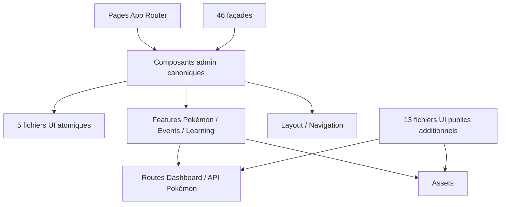

# 08 — Registre des composants React

<!-- current-state-2026-07-13:start -->

## Mise à jour code courant — 13 juillet 2026

- Le registre courant contient 137 fichiers de composants; la catégorie Feature contient 42 entrées.
- [COMP-137](<../Dashboard Admin/docs/codex/Post-audit 2026-07-13/COMP-137-trainer-pokemon-collection-panel.md>) compte 365 lignes, utilise cinq primitives UI et appelle les quatre routes privées trainer-pokemon.
- AdminApp charge ce composant dynamiquement; les autres panneaux historiques restent importés statiquement.

<!-- current-state-2026-07-13:end -->

## 1. Objectif

Inventorier tous les fichiers de composants React des trois interfaces, leurs exports, catégories, dépendances directes, pages, hooks, services, routes, assets, signaux responsive/accessibilité, tests et dette visible.

## 2. Portée

Tous les fichiers `.js/.jsx/.ts/.tsx` sous `Dashboard Admin/src/components`, `Landing-Page-PogoApi/components` et `PokemonGo-API-/components`, hors déclarations `.d.ts`. Le registre contient 136 fichiers. Les fonctions internes exportées d’un même fichier restent rattachées à l’ID du fichier pour éviter de prétendre qu’elles forment toutes un composant autonome.

## 3. Méthode

Analyse statique déterministe triée par chemin et projet. Les IDs `COMP-001` à `COMP-136` sont proposés sans renommer le code. Les relations sont des imports textuels directs; une absence de relation n’est pas la preuve d’une absence transitive. Les occurrences de hardcodes sont un indicateur heuristique.

## 4. Résultats

### 4.1 Synthèse

| Catégorie | Fichiers |
|---|---:|
| Atomic | 5 |
| Composite | 2 |
| Complex | 20 |
| Feature | 41 |
| Layout | 7 |
| Utility UI | 4 |
| Public UI | 12 |
| Compatibility | 45 |
| Total | 136 |

- 109 fichiers portent directement `use client`.
- 46 fichiers sont identifiés comme façades de compatibilité courtes; 45 sont classés Compatibility et une façade se trouve dans une autre catégorie.
- Aucun test n’importe directement un composant par alias/nom selon la recherche automatisée; les tests existants peuvent tester des flux via scripts sans import direct.
- 561 occurrences visuelles potentiellement hardcodées ont été détectées dans les fichiers composants.
- Les fichiers canoniques sont sous `src/components/admin`; les anciens chemins `dashboard`, `pokemon-admin` et `checklist` sont presque entièrement des réexports courts.

### 4.2 Composants les plus volumineux

| ID | Fichier | Lignes | Risque principal |
|---|---|---:|---|
| COMP-031 | `admin/pokemon/admin-app.jsx` | 2 494 | 23 sections, bootstrap et actions dans un monolithe |
| COMP-009 | `admin/events/events-calendar-panel.jsx` | 1 630 | calendrier, CRUD, filtres, modales et responsive |
| COMP-044 | `admin/pokemon/detail-modal.jsx` | 1 389 | espace d’inspection profond, nombreux sous-rendus |
| COMP-070 | `admin/tables/dashboard-backlog.tsx` | 856 | table/cartes, CRUD et modales |
| COMP-127 | `PokemonGo-API-/components/checklist/detail-modal.jsx` | 825 | modale publique très profonde et nombreux sous-rendus internes |
| COMP-039 | `admin/pokemon/collections-panel.jsx` | 795 | collections, sélection, édition et modale locale |
| COMP-013 | `admin/forms/kanban-board.tsx` | 773 | drag/drop, persistance et responsive |
| COMP-010 | `admin/forms/calendar-planner.tsx` | 705 | calendrier personnel complet |
| COMP-005 | `admin/dashboard/dashboard-home-live.tsx` | 658 | agrégation de nombreux domaines |
| COMP-125 | `PokemonGo-API-/components/assets/assets-app.jsx` | 568 | catalogue, audit, filtres et appels API dans un composant client |

### 4.3 Registre exhaustif

| ID | Exports principaux | Chemin | Catégorie | Statut | Lignes | Parents directs | Tests directs |
|---|---|---|---|---|---:|---:|---:|
| COMP-001 | PokemonWidget | `src/components/admin/cards/pokemon-widget.tsx` | Composite | active | 100 | 1 | 0 |
| COMP-002 | StatCard | `src/components/admin/cards/stat-card.tsx` | Composite | active | 60 | 1 | 0 |
| COMP-003 | ColorLab | `src/components/admin/dashboard/color-lab.tsx` | Complex | active | 229 | 2 | 0 |
| COMP-004 | DailyTools | `src/components/admin/dashboard/daily-tools.tsx` | Complex | active | 475 | 2 | 0 |
| COMP-005 | DashboardHomeLive | `src/components/admin/dashboard/dashboard-home-live.tsx` | Complex | active | 658 | 2 | 0 |
| COMP-006 | Pomodoro | `src/components/admin/dashboard/pomodoro.tsx` | Complex | active | 183 | 2 | 0 |
| COMP-007 | SnippetVault | `src/components/admin/dashboard/snippet-vault.tsx` | Complex | active | 214 | 2 | 0 |
| COMP-008 | EventEditorModal, ImportModal | `src/components/admin/events/event-editor-modal.jsx` | Feature | active | 115 | 1 | 0 |
| COMP-009 | EventsCalendarPanel | `src/components/admin/events/events-calendar-panel.jsx` | Feature | active | 1630 | 2 | 0 |
| COMP-010 | CalendarPlanner | `src/components/admin/forms/calendar-planner.tsx` | Complex | active | 705 | 2 | 0 |
| COMP-011 | JavaScriptExercises | `src/components/admin/forms/javascript-exercises.tsx` | Complex | active | 221 | 2 | 0 |
| COMP-012 | JsProgress | `src/components/admin/forms/js-progress.tsx` | Complex | active | 101 | 2 | 0 |
| COMP-013 | KanbanBoard | `src/components/admin/forms/kanban-board.tsx` | Complex | active | 773 | 2 | 0 |
| COMP-014 | NotesBoard | `src/components/admin/forms/notes-board.tsx` | Complex | active | 400 | 2 | 0 |
| COMP-015 | TodoList | `src/components/admin/forms/todo-list.tsx` | Complex | active | 179 | 2 | 0 |
| COMP-016 | WriterStudio | `src/components/admin/forms/writer-studio.tsx` | Complex | active | 325 | 2 | 0 |
| COMP-017 | AdminAppFrame | `src/components/admin/layout/admin-app-frame.tsx` | Layout | active | 139 | 2 | 0 |
| COMP-018 | Providers | `src/components/admin/layout/admin-providers.tsx` | Layout | active | 19 | 2 | 0 |
| COMP-019 | AdminVersionHistoryDialog | `src/components/admin/layout/admin-version-history-dialog.tsx` | Layout | active | 95 | 1 | 0 |
| COMP-020 | LearningAchievementGrid | `src/components/admin/learning/learning-achievement-grid.tsx` | Feature | active | 51 | 1 | 0 |
| COMP-021 | LearningActivityTimeline | `src/components/admin/learning/learning-activity.tsx` | Feature | active | 60 | 1 | 0 |
| COMP-022 | LearningAdvancedStats | `src/components/admin/learning/learning-advanced-stats.tsx` | Feature | active | 50 | 1 | 0 |
| COMP-023 | LearningDetailModal | `src/components/admin/learning/learning-detail-modal.tsx` | Feature | active | 373 | 1 | 0 |
| COMP-024 | LearningImportModal | `src/components/admin/learning/learning-import-modal.tsx` | Feature | active | 210 | 1 | 0 |
| COMP-025 | LearningProgressBar | `src/components/admin/learning/learning-progress-bar.tsx` | Feature | active | 22 | 3 | 0 |
| COMP-026 | LearningSummary | `src/components/admin/learning/learning-summary.tsx` | Feature | active | 72 | 1 | 0 |
| COMP-027 | LearningTopicCard | `src/components/admin/learning/learning-topic-card.tsx` | Feature | active | 100 | 1 | 0 |
| COMP-028 | AdminPaletteSelector | `src/components/admin/navigation/admin-palette-selector.tsx` | Layout | active | 110 | 1 | 0 |
| COMP-029 | AdminSidebar | `src/components/admin/navigation/admin-sidebar.tsx` | Layout | active | 255 | 1 | 0 |
| COMP-030 | AdminTopbar | `src/components/admin/navigation/admin-topbar.tsx` | Layout | active | 92 | 1 | 0 |
| COMP-031 | AdminApp | `src/components/admin/pokemon/admin-app.jsx` | Feature | active | 2494 | 2 | 0 |
| COMP-032 | AdminSectionNavigation | `src/components/admin/pokemon/admin-section-navigation.jsx` | Feature | active | 105 | 0 | 0 |
| COMP-033 | AdminTodoPanel | `src/components/admin/pokemon/admin-todo-panel.jsx` | Feature | active | 162 | 0 | 0 |
| COMP-034 | Panel, BarList, AssetStatCard, GenerationFilterBar, CompletionList, HistoryList, MiniCardList, ControlCardsPanel, JsonIssueList | `src/components/admin/pokemon/admin-ui.jsx` | Feature | active | 360 | 3 | 0 |
| COMP-035 | TypeIcons, WeatherIcons | `src/components/admin/pokemon/asset-icons.jsx` | Feature | active | 113 | 1 | 0 |
| COMP-036 | BackgroundPanel | `src/components/admin/pokemon/background-panel.jsx` | Feature | active | 196 | 0 | 0 |
| COMP-037 | CandyPanel | `src/components/admin/pokemon/candy-panel.jsx` | Feature | active | 202 | 1 | 0 |
| COMP-038 | CatalogPanel | `src/components/admin/pokemon/catalog-panel.jsx` | Feature | active | 407 | 1 | 0 |
| COMP-039 | CollectionsPanel | `src/components/admin/pokemon/collections-panel.jsx` | Feature | active | 795 | 1 | 0 |
| COMP-040 | DatasetSourceHeader, CurrentDatasetDiagnostics | `src/components/admin/pokemon/current-dataset-diagnostics.jsx` | Feature | active | 171 | 0 | 0 |
| COMP-041 | DatasetEventBanner | `src/components/admin/pokemon/dataset-event-banner.jsx` | Feature | active | 126 | 0 | 0 |
| COMP-042 | DatasetFilterBar | `src/components/admin/pokemon/dataset-filter-bar.jsx` | Feature | active | 51 | 0 | 0 |
| COMP-043 | DatasetSourceHeader | `src/components/admin/pokemon/dataset-source-header.jsx` | Feature | active | 2 | 1 | 0 |
| COMP-044 | DetailModal | `src/components/admin/pokemon/detail-modal.jsx` | Feature | active | 1389 | 2 | 0 |
| COMP-045 | EggsPanel | `src/components/admin/pokemon/eggs-panel.jsx` | Feature | active | 251 | 1 | 0 |
| COMP-046 | EventsCalendarPanel | `src/components/admin/pokemon/events-calendar-panel.jsx` | Feature | facade | 4 | 0 | 0 |
| COMP-047 | LoginCard | `src/components/admin/pokemon/login-card.jsx` | Feature | active | 38 | 1 | 0 |
| COMP-048 | MaxBattlesPanel | `src/components/admin/pokemon/max-battles-panel.jsx` | Feature | active | 218 | 1 | 0 |
| COMP-049 | PokemonAdminStudio | `src/components/admin/pokemon/pokemon-admin-studio.tsx` | Feature | active | 8 | 2 | 0 |
| COMP-050 | PokemonApiExplorer | `src/components/admin/pokemon/pokemon-api-explorer.tsx` | Feature | active | 134 | 2 | 0 |
| COMP-051 | PokemonApiStatus | `src/components/admin/pokemon/pokemon-api-status.tsx` | Feature | active | 135 | 3 | 0 |
| COMP-052 | PokemonCard | `src/components/admin/pokemon/pokemon-card.jsx` | Feature | active | 248 | 2 | 0 |
| COMP-053 | PokemonDocsViewer | `src/components/admin/pokemon/pokemon-docs-viewer.tsx` | Feature | active | 292 | 2 | 0 |
| COMP-054 | PvpRankingsPanel | `src/components/admin/pokemon/pvp-rankings-panel.jsx` | Feature | active | 138 | 0 | 0 |
| COMP-055 | RaidsPanel | `src/components/admin/pokemon/raids-panel.jsx` | Feature | active | 289 | 1 | 0 |
| COMP-056 | ResearchPanel | `src/components/admin/pokemon/research-panel.jsx` | Feature | active | 396 | 1 | 0 |
| COMP-057 | RocketPanel | `src/components/admin/pokemon/rocket-panel.jsx` | Feature | active | 466 | 1 | 0 |
| COMP-058 | ShinyTrackerPanel | `src/components/admin/pokemon/shiny-tracker-panel.jsx` | Feature | active | 221 | 0 | 0 |
| COMP-059 | SourceHistoryModal, DataDeployHistoryModal, SourceRows | `src/components/admin/pokemon/source-watch-panel.tsx` | Feature | active | 487 | 1 | 0 |
| COMP-060 | TierSection | `src/components/admin/pokemon/tier-section.jsx` | Feature | active | 108 | 0 | 0 |
| COMP-061 | UpdateLogPanel | `src/components/admin/pokemon/update-log-panel.jsx` | Feature | active | 170 | 1 | 0 |
| COMP-062 | DashboardFooter | `src/components/admin/shared/dashboard-footer.tsx` | Utility UI | active | 53 | 2 | 0 |
| COMP-063 | DashboardLoadingState | `src/components/admin/shared/loading-state.tsx` | Utility UI | active | 34 | 7 | 0 |
| COMP-064 | ModalPortal | `src/components/admin/shared/modal-portal.jsx` | Utility UI | active | 9 | 2 | 0 |
| COMP-065 | SortableWidgetGrid | `src/components/admin/shared/sortable-widget-grid.tsx` | Utility UI | active | 239 | 6 | 0 |
| COMP-066 | DashboardCharts | `src/components/admin/stats/dashboard-charts.tsx` | Complex | active | 112 | 1 | 0 |
| COMP-067 | DatabaseStats | `src/components/admin/stats/database-stats.tsx` | Complex | active | 335 | 2 | 0 |
| COMP-068 | LearningAnalytics | `src/components/admin/stats/learning-analytics.tsx` | Complex | active | 210 | 2 | 0 |
| COMP-069 | PokemonAnalytics | `src/components/admin/stats/pokemon-analytics.tsx` | Complex | active | 236 | 1 | 0 |
| COMP-070 | DashboardBacklog | `src/components/admin/tables/dashboard-backlog.tsx` | Complex | active | 856 | 2 | 0 |
| COMP-071 | DetailModal | `src/components/checklist/detail-modal.jsx` | Compatibility | facade | 4 | 0 | 0 |
| COMP-072 | PokemonCard | `src/components/checklist/pokemon-card.jsx` | Compatibility | facade | 4 | 0 | 0 |
| COMP-073 | AppFrame | `src/components/dashboard/app-frame.tsx` | Compatibility | facade | 4 | 0 | 0 |
| COMP-074 | CalendarPlanner | `src/components/dashboard/calendar-planner.tsx` | Compatibility | facade | 4 | 0 | 0 |
| COMP-075 | ColorLab | `src/components/dashboard/color-lab.tsx` | Compatibility | facade | 4 | 0 | 0 |
| COMP-076 | DailyTools | `src/components/dashboard/daily-tools.tsx` | Compatibility | facade | 4 | 0 | 0 |
| COMP-077 | DashboardBacklog | `src/components/dashboard/dashboard-backlog.tsx` | Compatibility | facade | 4 | 0 | 0 |
| COMP-078 | DashboardCharts | `src/components/dashboard/dashboard-charts.tsx` | Compatibility | facade | 4 | 0 | 0 |
| COMP-079 | DashboardFooter | `src/components/dashboard/dashboard-footer.tsx` | Compatibility | facade | 2 | 0 | 0 |
| COMP-080 | DashboardHomeLive | `src/components/dashboard/dashboard-home-live.tsx` | Compatibility | facade | 4 | 0 | 0 |
| COMP-081 | DatabaseStats | `src/components/dashboard/database-stats.tsx` | Compatibility | facade | 4 | 0 | 0 |
| COMP-082 | JavaScriptExercises | `src/components/dashboard/javascript-exercises.tsx` | Compatibility | facade | 4 | 0 | 0 |
| COMP-083 | JsProgress | `src/components/dashboard/js-progress.tsx` | Compatibility | facade | 4 | 0 | 0 |
| COMP-084 | KanbanBoard | `src/components/dashboard/kanban-board.tsx` | Compatibility | facade | 4 | 0 | 0 |
| COMP-085 | LearningAnalytics | `src/components/dashboard/learning-analytics.tsx` | Compatibility | facade | 4 | 0 | 0 |
| COMP-086 | DashboardLoadingState | `src/components/dashboard/loading-state.tsx` | Compatibility | facade | 2 | 0 | 0 |
| COMP-087 | NotesBoard | `src/components/dashboard/notes-board.tsx` | Compatibility | facade | 4 | 0 | 0 |
| COMP-088 | PokemonAnalytics | `src/components/dashboard/pokemon-analytics.tsx` | Compatibility | facade | 4 | 0 | 0 |
| COMP-089 | PokemonApiExplorer | `src/components/dashboard/pokemon-api-explorer.tsx` | Compatibility | facade | 4 | 0 | 0 |
| COMP-090 | PokemonApiStatus | `src/components/dashboard/pokemon-api-status.tsx` | Compatibility | facade | 4 | 0 | 0 |
| COMP-091 | PokemonDocsViewer | `src/components/dashboard/pokemon-docs-viewer.tsx` | Compatibility | facade | 7 | 0 | 0 |
| COMP-092 | PokemonWidget | `src/components/dashboard/pokemon-widget.tsx` | Compatibility | facade | 2 | 0 | 0 |
| COMP-093 | Pomodoro | `src/components/dashboard/pomodoro.tsx` | Compatibility | facade | 4 | 0 | 0 |
| COMP-094 | Providers | `src/components/dashboard/providers.tsx` | Compatibility | facade | 4 | 0 | 0 |
| COMP-095 | SnippetVault | `src/components/dashboard/snippet-vault.tsx` | Compatibility | facade | 4 | 0 | 0 |
| COMP-096 | SortableWidgetGrid | `src/components/dashboard/sortable-widget-grid.tsx` | Compatibility | facade | 7 | 0 | 0 |
| COMP-097 | StatCard | `src/components/dashboard/stat-card.tsx` | Compatibility | facade | 2 | 0 | 0 |
| COMP-098 | TodoList | `src/components/dashboard/todo-list.tsx` | Compatibility | facade | 4 | 0 | 0 |
| COMP-099 | WriterStudio | `src/components/dashboard/writer-studio.tsx` | Compatibility | facade | 4 | 0 | 0 |
| COMP-100 | AdminApp | `src/components/pokemon-admin/admin-app.jsx` | Compatibility | facade | 4 | 0 | 0 |
| COMP-101 | AdminUi | `src/components/pokemon-admin/admin-ui.jsx` | Compatibility | facade | 4 | 0 | 0 |
| COMP-102 | AssetIcons | `src/components/pokemon-admin/asset-icons.jsx` | Compatibility | facade | 4 | 0 | 0 |
| COMP-103 | CandyPanel | `src/components/pokemon-admin/candy-panel.jsx` | Compatibility | facade | 4 | 0 | 0 |
| COMP-104 | CatalogPanel | `src/components/pokemon-admin/catalog-panel.jsx` | Compatibility | facade | 4 | 0 | 0 |
| COMP-105 | CollectionsPanel | `src/components/pokemon-admin/collections-panel.jsx` | Compatibility | facade | 4 | 0 | 0 |
| COMP-106 | EggsPanel | `src/components/pokemon-admin/eggs-panel.jsx` | Compatibility | facade | 4 | 0 | 0 |
| COMP-107 | EventsCalendarPanel | `src/components/pokemon-admin/events-calendar-panel.jsx` | Compatibility | facade | 4 | 0 | 0 |
| COMP-108 | LoginCard | `src/components/pokemon-admin/login-card.jsx` | Compatibility | facade | 4 | 0 | 0 |
| COMP-109 | MaxBattlesPanel | `src/components/pokemon-admin/max-battles-panel.jsx` | Compatibility | facade | 4 | 0 | 0 |
| COMP-110 | PokemonAdminStudio | `src/components/pokemon-admin/pokemon-admin-studio.tsx` | Compatibility | facade | 4 | 0 | 0 |
| COMP-111 | RaidsPanel | `src/components/pokemon-admin/raids-panel.jsx` | Compatibility | facade | 4 | 0 | 0 |
| COMP-112 | ResearchPanel | `src/components/pokemon-admin/research-panel.jsx` | Compatibility | facade | 4 | 0 | 0 |
| COMP-113 | RocketPanel | `src/components/pokemon-admin/rocket-panel.jsx` | Compatibility | facade | 4 | 0 | 0 |
| COMP-114 | SourceWatchPanel | `src/components/pokemon-admin/source-watch-panel.tsx` | Compatibility | facade | 4 | 0 | 0 |
| COMP-115 | UpdateLogPanel | `src/components/pokemon-admin/update-log-panel.jsx` | Compatibility | facade | 4 | 0 | 0 |
| COMP-116 | MetricCard | `src/components/site/metric-card.jsx` | Public UI | active | 36 | 1 | 0 |
| COMP-117 | PokemonStyle | `src/components/site/pokemon-style.js` | Public UI | active | 194 | 9 | 0 |
| COMP-118 | UiAssets | `src/components/site/ui-assets.js` | Public UI | active | 81 | 10 | 0 |
| COMP-119 | Badge | `src/components/ui/badge.tsx` | Atomic | active | 31 | 25 | 0 |
| COMP-120 | Button | `src/components/ui/button.tsx` | Atomic | active | 67 | 23 | 0 |
| COMP-121 | CardHeader, CardTitle, CardDescription, Card | `src/components/ui/card.tsx` | Atomic | active | 69 | 30 | 0 |
| COMP-122 | Input, Textarea | `src/components/ui/input.tsx` | Atomic | active | 34 | 13 | 0 |
| COMP-123 | Modal | `src/components/ui/modal.tsx` | Atomic | active | 78 | 9 | 0 |
| COMP-124 | LandingExperience | `Landing-Page-PogoApi/components/landing-experience.jsx` | Public UI | active | 205 | 1 | 0 |
| COMP-125 | AssetsApp | `PokemonGo-API-/components/assets/assets-app.jsx` | Complex | active | 568 | 1 | 0 |
| COMP-126 | ChecklistApp | `PokemonGo-API-/components/checklist/checklist-app.jsx` | Complex | active | 355 | 2 | 0 |
| COMP-127 | DetailModal | `PokemonGo-API-/components/checklist/detail-modal.jsx` | Complex | active | 825 | 1 | 0 |
| COMP-128 | PokemonCard | `PokemonGo-API-/components/checklist/pokemon-card.jsx` | Public UI | active | 180 | 2 | 0 |
| COMP-129 | ApiStatusPill | `PokemonGo-API-/components/site/api-status-pill.jsx` | Public UI | active | 45 | 1 | 0 |
| COMP-130 | FeaturedRandom | `PokemonGo-API-/components/site/featured-random.jsx` | Public UI | active | 46 | 1 | 0 |
| COMP-131 | MetricCard | `PokemonGo-API-/components/site/metric-card.jsx` | Public UI | active | 36 | 3 | 0 |
| COMP-132 | catalogItem, typeName, typeIcon, typeBackground, preferredPokemonImage, pokemonVariantLabel, typeLabels, typeColors | `PokemonGo-API-/components/site/pokemon-style.js` | Public UI | active | 131 | 3 | 0 |
| COMP-133 | SectionCard | `PokemonGo-API-/components/site/section-card.jsx` | Public UI | unused | 17 | 0 | 0 |
| COMP-134 | SiteShell, PokeballMark | `PokemonGo-API-/components/site/shell.jsx` | Layout | active | 164 | 1 | 0 |
| COMP-135 | ThemeToggle | `PokemonGo-API-/components/site/theme-toggle.jsx` | Public UI | active | 56 | 1 | 0 |
| COMP-136 | uiAssets | `PokemonGo-API-/components/site/ui-assets.js` | Public UI | active | 80 | 6 | 0 |

Le détail machine ajoute, pour chaque entrée: props nommées détectées, enfants/parents, pages directes, hooks, services, chemins API, assets, tokens CSS explicites, breakpoints, nombres ARIA/rôles, tests, hardcodes et dette.

### 4.4 Matrice familles → pages

| Famille | Exemples canoniques | Pages principales |
|---|---|---|
| Layout/navigation | AdminAppFrame, AdminSidebar, AdminTopbar, Providers | Toutes les pages protégées |
| Dashboard/cards/stats | DashboardHomeLive, DailyTools, StatCard, charts | Accueil, Analytics, Outils |
| Forms | NotesBoard, KanbanBoard, CalendarPlanner, TodoList, WriterStudio | Organisation et Studio JS |
| Learning | JsProgress et composants learning | JS Progress, Analytics |
| Pokémon | AdminApp, panels, PokemonCard, DetailModal | Admin Pokémon |
| Events | EventsCalendarPanel, EventEditorModal | Calendrier Events |
| Tables | DashboardBacklog | Dashboard Backlog |
| UI | Badge, Button, Card, Input/Textarea, Modal | Plusieurs pages générales |
| Landing publique | LandingExperience | Landing publique |
| Site API public | SiteShell, AssetsApp, ChecklistApp, PokemonCard, DetailModal | Accueil, Assets, Bibliothèque, Checklist |

## 5. Tableaux

Le tableau exhaustif ci-dessus et `registries/components.json` sont les sources du registre. Les tableaux Design System complémentaires sont dans `09-design-system.md`.

## 6. Diagrammes Mermaid

## 7. Fichiers sources

- `Dashboard Admin/src/components/admin/**`
- `Dashboard Admin/src/components/ui/**`
- `Dashboard Admin/src/components/site/**`
- `Landing-Page-PogoApi/components/**`
- `PokemonGo-API-/components/**`
- Façades sous `src/components/dashboard`, `pokemon-admin`, `checklist`.
- `audit-documentation/registries/components.json` — inventaire automatisé validé par `JSON.parse`.

## 8. Incohérences

- L’architecture annonce des façades legacy, ce que confirme l’inventaire, mais ces 46 fichiers augmentent encore la surface de navigation et les chemins possibles.
- La couche “Atomic” cible compte 14 familles; le code n’a que cinq fichiers UI, dont Input et Textarea partagent un fichier.
- Plusieurs composants métier reconstruisent boutons, badges, cartes, modales, tabs et filtres au lieu d’importer les primitives.
- Des composants très volumineux contiennent plusieurs responsabilités et sous-composants internes sous un seul ID de fichier.
- Le mélange TSX/JSX limite la disponibilité uniforme des types de props.
- `COMP-133 SectionCard` n'a aucun importeur actif détecté.

## 9. Informations manquantes

- Couverture runtime et snapshots visuels par composant: INFORMATION NON TROUVÉE.
- Storybook ou catalogue exécutable: INFORMATION NON TROUVÉE.
- Props de composants JSX non typés: INFORMATION NON TROUVÉE sous forme de contrat statique.
- Relations transitives page → sous-composants: à calculer dans `27-dependencies-map.md`.
- Variantes/états formels de chaque composant métier: implicites dans les classes/props recensées, non déclarés comme contrat.

## 10. Risques

| Sévérité | Risque |
|---|---|
| Élevée | Monolithes AdminApp, EventsCalendarPanel et DetailModal |
| Élevée | Absence de tests directs détectés pour 136 fichiers |
| Élevée | Reconstruction locale des primitives et styles |
| Moyenne | 46 façades à maintenir |
| Moyenne | Mélange JSX/TSX et contrats de props incomplets |
| Moyenne | 109 composants client, avec coût potentiel bundle/hydration |

## 11. Mapping documentaire

- Un document `COMP-xxx` peut être généré pour chaque entrée.
- Les façades doivent pointer vers le COMP canonique, pas recevoir une documentation fonctionnelle indépendante.
- Les composants Feature lient les documents `PAGE`, `DATASET`, `API`, `PROVIDER`, `ASSET`, `RESP`, `PERF`, `SEC` et `TEST`.
- Les composants UI alimentent `DS-007` et les futurs documents Atomic réels.

## 12. État de progression

Phase 6 terminée. Prochaine phase: hooks, contexts, services et utilitaires.
