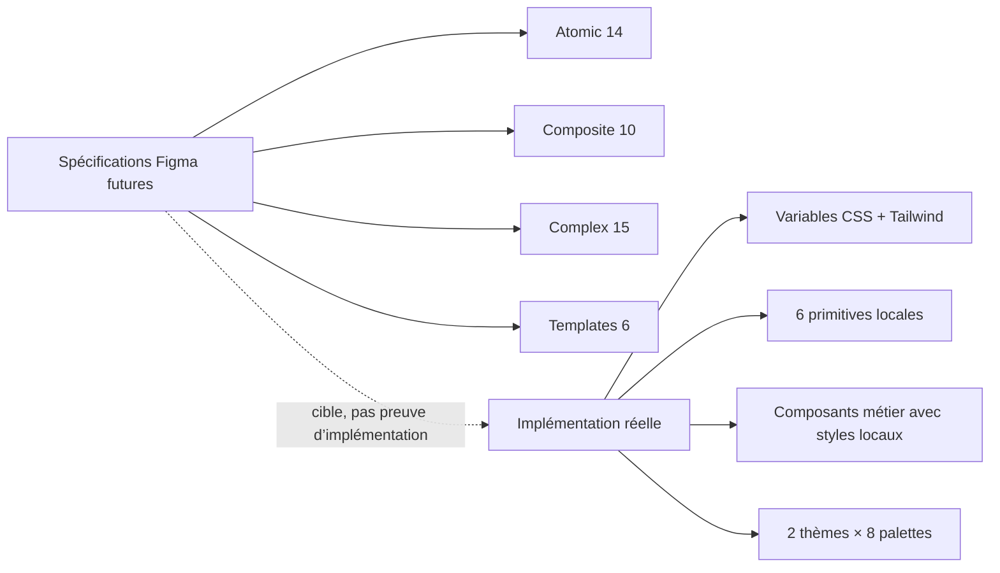

# 09 — Audit du Design System

<!-- current-state-2026-07-13:start -->

## Mise à jour code courant — 13 juillet 2026

- [COMP-137](<../Dashboard Admin/docs/codex/Post-audit 2026-07-13/COMP-137-trainer-pokemon-collection-panel.md>) réutilise Badge, Button, Card, Input et Modal sans nouvelle primitive.
- src/components/ui/modal.tsx contient désormais focus initial, boucle Tab, fermeture Escape et restauration du focus.
- Les images de la collection utilisent next/image et un placeholder local lorsque l’URL canonique est absente.

<!-- current-state-2026-07-13:end -->

## 1. Objectif

Décrire le Design System réellement implémenté, puis le distinguer des spécifications Figma futures Atomic, Composite, Complex et Template.

## 2. Portée

Tokens CSS et Tailwind, modes, palettes, typographie, rayons, surfaces, motion, primitives UI locales, styles métier et quatre documents préparatoires. Les copies sous `Dashboard Admin/docs/audits` ont le même SHA-256 que les fichiers `docs/design-system` et ne constituent pas une seconde source indépendante.

## 3. Méthode

- Lecture des quatre spécifications et comparaison avec le code.
- Lecture complète de `globals.css`, des cinq fichiers `components/ui` et des palettes.
- Recherche des tokens Figma nommés, hardcodes visuels, contrôles HTML directs, breakpoints, rayons et animations.
- Comptages heuristiques: un résultat de recherche signale une occurrence potentielle, pas nécessairement un défaut.

## 4. Résultats

### 4.1 Statut des documents existants

| Document | Contenu | Statut réel |
|---|---|---|
| Phase 3C | 14 familles atomiques, 401 variantes futures | Spécification seulement; génération Figma bloquée au moment de rédaction |
| Phase 3D | 10 familles composites, 520 variantes futures | Spécification seulement; aucune obligation d’existence dans React |
| Phase 3E | 15 familles complexes, 895 variantes futures | Spécification seulement; composants P0 conceptuels |
| Phase 4A | 6 templates, règles de densité/scroll/responsive | Architecture cible pour Phase 4B, pas templates React formalisés |

Les documents disent explicitement “No code implementation”, “future Figma generation” et “DARK MODE ONLY”. Ils sont utiles comme cible documentaire, mais ne peuvent pas servir de preuve que 401 + 520 + 895 variantes existent dans Figma ou React.

### 4.2 Modes et palettes réels

- Deux modes existent: `.dark` et `.light`. `ThemeProvider` expose les deux, dark par défaut, sans suivi système.
- Huit palettes existent: `sapphire`, `ruby`, `fire-red`, `violet`, `leaf-green`, `pink`, `gold`, `electric`.
- Chaque palette fournit 12 variables d’accent pour dark et light.
- La conclusion “dark only” des specs est donc fausse pour le produit actuel.

### 4.3 Tokens CSS réellement globaux

| Groupe | Tokens confirmés | Valeurs / statut |
|---|---|---|
| Fond | `--background`, `--foreground`, `--muted` | Valeurs dark dans `:root`, remplacées en `.light` |
| Surfaces | `--panel`, `--panel-strong` | rgba avec transparence; classes `glass-panel*` |
| Bordures | `--line`, `--line-strong` | Deux niveaux globaux |
| Marque | `--brand`, `--brand-2`, `--brand-3` | Réassignés par palette et mode |
| Accents | `--accent-primary`, `secondary`, `tertiary`, `muted`, `glow`, `border`, `text`, `bg`, `rgb` | Système de palette fonctionnel |
| États | `--warning`, `--danger` | Pas de token global `success`; le vert de marque sert aussi de succès |
| Rayon | `--radius` et Tailwind `--radius-sm` à `--radius-2xl` | 6 px pour `sm`, 8 px pour les autres tailles |
| Typographie | `--font-sans`, `--font-mono` | Geist/Inter déclarés en chaînes; chargement web explicite non trouvé dans root layout |

Les noms documentaires `semantic.color.*`, `component.button.*`, `primitive.spacing.*` ne sont pas présents dans `src`. Le mapping Figma → CSS n’est donc pas implémenté avec la nomenclature proposée.

### 4.4 Primitives React réelles

| ID proposé | Famille réelle | Fichier | API / variantes | Fichiers consommateurs estimés |
|---|---|---|---|---:|
| COMP-001 | Badge | `components/ui/badge.tsx` | 6 tons: cyan, violet, green, amber, red, neutral | 28 |
| COMP-002 | Button | `components/ui/button.tsx` | 4 variantes × 4 tailles, `asChild`, icône | 25 |
| COMP-003 | Card | `components/ui/card.tsx` | soft/strong + Header/Title/Description | 33 |
| COMP-004 | Input | `components/ui/input.tsx` | input générique, focus/placeholder | 13 |
| COMP-005 | Textarea | `components/ui/input.tsx` | textarea générique, resize désactivé par défaut | 10 |
| COMP-006 | Modal | `components/ui/modal.tsx` | overlay, header, body scroll, footer, Escape | 10 |

La bibliothèque locale ne contient pas de fichiers atomiques partagés pour IconButton, Select, Checkbox, Switch, Chip, Label, Divider, ProgressBar, Tooltip ou Tabs. Ces concepts sont reconstruits avec HTML/Tailwind ou composants métier. La recherche relève environ 230 balises de contrôles HTML directs sous `components/admin`.

### 4.5 Surfaces et effets réels

- `glass-panel` et `glass-panel-strong` centralisent bordure, surface, shadow et blur.
- `dashboard-primary-button`, `dashboard-accent-glow`, `widget-glow-frame`, `motion-border`, `animated-sheen`, `studio-grid`, `scanline-overlay`, `energy-scan` sont des utilitaires globaux propres au produit.
- Le mode light repose en partie sur des sélecteurs correctifs très larges ciblant des fragments de classes Tailwind (`[class*="bg-slate-950/"]`, `[class*="text-white"]`) et `!important`.
- La surface Pokémon conserve des couleurs dark codées localement puis est “repeinte” par les correctifs light.

### 4.6 Couleurs, rayons et hardcodes concurrents

Une recherche combinée des couleurs hex/rgba, valeurs arbitraires Tailwind, shadows/z-index/rayons arbitraires trouve environ 617 lignes potentielles sous `src` hors docs/build. Les exemples confirmés incluent:

- `rounded-2xl`, `rounded-3xl` et `rounded-[2rem]` massivement utilisés alors que les tokens Tailwind globaux `lg` à `2xl` valent 8 px;
- fonds `bg-slate-950/*`, textes `text-cyan-100`, bordures `border-white/*` et shadows arbitraires dans les composants Pokémon;
- styles inline dépendant des couleurs de types Pokémon;
- valeurs de z-index 1100/1120 dans modales locales.

Ce n’est pas une absence totale de Design System: le shell et les primitives utilisent des tokens. La couverture est toutefois partielle et les composants métier ont leur propre vocabulaire visuel.

### 4.7 Typographie

- Font sans: Geist, puis Inter et system UI; mono: Geist Mono puis SFMono.
- Graisses fréquentes: `font-black`, `font-bold`, `font-semibold`.
- Eyebrows en uppercase avec tracking arbitraire `0.16em`, `0.18em`, `0.22em`.
- Les échelles de texte proviennent surtout de Tailwind; aucune collection typographique React dédiée.
- Le chargement de fichiers Geist ou `next/font` n’a pas été trouvé dans le root layout inspecté; le navigateur peut donc utiliser un fallback si Geist n’est pas disponible localement.

### 4.8 Spacing, breakpoints et layout

- Espacements Tailwind standard + nombreuses valeurs arbitraires.
- Breakpoints effectivement utilisés: `sm`, `md`, `lg`, `xl`, `2xl`; aucune config Tailwind personnalisée trouvée.
- Les valeurs conceptuelles 360/768/1024/1440/1680/1920 du template ne sont pas toutes les seuils Tailwind réels. 1680 est aussi un max-width de contenu, pas un breakpoint déclaré.
- Shell: sidebar 84/236/286 px, contenu max 1680 px, gutters 16/24 px selon classes observées.

### 4.9 Motion

| Mécanisme | Usage |
|---|---|
| CSS `energy-scan` | scan continu 5,5 s; neutralisé par `prefers-reduced-motion` |
| CSS `sheen` | sheen 6 s; aucune neutralisation spécifique trouvée |
| Tailwind transitions | hover/focus/transform nombreuses |
| Framer Motion | drawer/sidebar, widgets et UI spécialisée |
| GSAP | dépendance présente; usages à détailler dans registre composants |

Il n’existe pas de tokens de durée `primitive.motion.fast/normal` dans le code. Les durées 200/220/300 ms, 5,5 s et 6 s coexistent.

### 4.10 Couverture par couche cible

| Couche cible | Familles spécifiées | Familles React partagées confirmées | Couverture qualitative |
|---|---:|---:|---|
| Atomic | 14 | 6 approximatives | Faible à moyenne |
| Composite | 10 | Plusieurs composants métier, pas une couche canonique complète | Partielle |
| Complex | 15 | Sidebar, widgets, cartes, modales, panels existent sous noms métier | Partielle et non normalisée |
| Template | 6 | Un shell global; pages composées ad hoc | Faible comme abstraction codée |

## 5. Tableaux

### Matrice composant → tokens → pages

| Composant | Tokens/classes centrales | Pages principales |
|---|---|---|
| Button | brand, line, danger, foreground, muted | Login, Account, Projects, learning, outils, docs |
| Badge | brand 1/2/3, warning, danger, line | Presque tous domaines Dashboard |
| Card | glass-panel, panel, line, shadows | Pages générales hors plusieurs panneaux Pokémon |
| Input/Textarea | line, foreground, muted, brand-2 | Login, Projects, forms, modales |
| Modal | panel-strong, line, z-index/shadow arbitraire | Projets, composants généraux; modales Pokémon/Events ont aussi des implémentations locales |
| AdminAppFrame | background, line, accent, sidebar classes | Toutes les pages protégées |

## 6. Diagrammes Mermaid

## 7. Fichiers sources

- `Dashboard Admin/src/app/globals.css:3-73` — tokens dark/light et mapping Tailwind.
- `Dashboard Admin/src/app/globals.css:128-292` — effets, sidebar et surfaces.
- `Dashboard Admin/src/app/globals.css:294-434,604-628` — correctifs light et `!important`.
- `Dashboard Admin/src/app/globals.css:436-669` — widgets, motion, palettes UI et reduced motion.
- `Dashboard Admin/src/components/ui/badge.tsx:4-30`.
- `Dashboard Admin/src/components/ui/button.tsx:5-66`.
- `Dashboard Admin/src/components/ui/card.tsx:4-68`.
- `Dashboard Admin/src/components/ui/input.tsx:1-33`.
- `Dashboard Admin/src/components/ui/modal.tsx:8-77`.
- `Dashboard Admin/src/components/admin/layout/admin-providers.tsx:3-17`.
- `Dashboard Admin/src/data/dashboard-palettes.ts:1-320` et suite — huit palettes dark/light.
- Spécifications Design System, lignes 1 à fin de chacun des quatre fichiers.

## 8. Incohérences

1. Specs “DARK MODE ONLY” contre implémentation dark/light complète.
2. Nomenclature de tokens Figma absente du code.
3. Règle “No hardcoded visual colors” contre centaines d’occurrences locales potentielles.
4. Specs listant un onglet Éditeur dans le résumé Template, absent des 23 sections actuelles.
5. Largeurs cibles (sidebar 280 px) contre code 236/286 px selon breakpoint.
6. Variantes Figma annoncées comme “future”; elles ne doivent pas être comptées comme composants réalisés.
7. Rayon global de 8 px contre usage massif de `rounded-2xl/3xl/[2rem]` dans le métier Pokémon.

## 9. Informations manquantes

- Fichier exporté de variables Figma Phase 3A/3B: INFORMATION NON TROUVÉE dans le workspace inspecté.
- Preuve que les pages Figma 03 à 06 existent: INFORMATION NON TROUVÉE localement.
- Tests visuels de thème light: INFORMATION NON TROUVÉE.
- Mesures de contraste par palette: INFORMATION NON TROUVÉE.
- Chargement réel de Geist: INFORMATION NON TROUVÉE dans les layouts/configurations inspectés.
- Token z-index formel: INFORMATION NON TROUVÉE.

## 10. Risques

| Sévérité | Risque |
|---|---|
| Élevée | Documentation cible prise pour état réel |
| Élevée | Mode light maintenu par sélecteurs globaux fragiles et `!important` |
| Élevée | Composants métier contournant les primitives partagées |
| Moyenne | Palettes sans validation automatique de contraste |
| Moyenne | Motion non uniformément couverte par reduced-motion |
| Moyenne | Divergence de rayons/spacing/shadows |

## 11. Mapping documentaire

- `DS-001`: fondations réelles CSS/Tailwind.
- `DS-002`: thèmes dark/light.
- `DS-003`: huit palettes.
- `DS-004`: typographie.
- `DS-005`: spacing/radius/shadows.
- `DS-006`: motion et reduced motion.
- `DS-007`: primitives React réelles.
- `DS-008`: cible Atomic/Composite/Complex/Template.
- `ADR-xxx`: stratégie de convergence Figma ↔ code.
- `ROADMAP-xxx`: réduction des hardcodes et primitives manquantes.

## 12. État de progression

Phase Design System terminée en lecture seule. Les IDs COMP définitifs et les relations de consommation sont poursuivis dans `08-components-registry.md` et `registries/components.json`.
