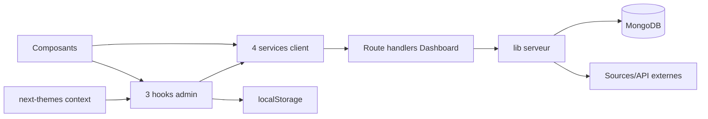

# 10 — Hooks, contexts, services et utilitaires

<!-- current-state-2026-07-13:start -->

## Mise à jour code courant — 13 juillet 2026

- Le registre Services contient maintenant cinq entrées.
- SERVICE-005 centralise les appels de [COMP-137](<../Dashboard Admin/docs/codex/Post-audit 2026-07-13/COMP-137-trainer-pokemon-collection-panel.md>) vers [API-157](<../Dashboard Admin/docs/codex/Post-audit 2026-07-13/API-157-get-trainer-pokemon.md>), [API-158](<../Dashboard Admin/docs/codex/Post-audit 2026-07-13/API-158-post-trainer-pokemon-import.md>), [API-159](<../Dashboard Admin/docs/codex/Post-audit 2026-07-13/API-159-get-trainer-pokemon-imports.md>), [API-160](<../Dashboard Admin/docs/codex/Post-audit 2026-07-13/API-160-post-trainer-pokemon-rollback.md>).
- Aucun hook ou contexte global n’a été ajouté; les totaux restent trois hooks et un contexte externe.

<!-- current-state-2026-07-13:end -->

## 1. Objectif

Inventorier les abstractions non visuelles du Dashboard et documenter leurs responsabilités, consommateurs, persistance, erreurs, cache et risques.

## 2. Portée

Trois hooks admin, quatre services client, le provider externe next-themes, douze fichiers `lib` et deux fichiers `utils/admin`.

## 3. Méthode

Lecture intégrale des hooks/services, inventaire des exports des utilitaires, recherche des consommateurs par alias et recherche `createContext/useContext`.

## 4. Résultats

### 4.1 Hooks

| ID | Hook | Responsabilité | Consommateurs | Persistance / risque |
|---|---|---|---|---|
| HOOK-001 | `useDashboardPalette` | Applique palette × thème aux variables CSS racine | Sélecteur de palette | localStorage; effet DOM global |
| HOOK-002 | `useDashboardVersionHistory` | Fusionne historique embarqué et persistant | App frame | localStorage; fusion par version |
| HOOK-003 | `useJavascriptLearning` | Catalogue, progression, activité, stats, migration et fallback | JS Progress, Learning Analytics | 291 lignes; Mongo/localStorage; nombreux états |

### 4.2 Contexts

Aucun contexte React local n’est déclaré. `AdminProviders` enveloppe toute l’application dans le `ThemeProvider` externe de `next-themes`. La palette n’est pas un contexte: elle est consommée par hook puis matérialisée en variables CSS sur `documentElement`.

### 4.3 Services client

| ID | Service | Nature | Erreurs / retries |
|---|---|---|---|
| SERVICE-001 | dashboard-store | Client GET/PUT + fallback local | Erreurs silencieusement converties; aucun retry |
| SERVICE-002 | events-api | Trois constantes de chemins | Aucune logique |
| SERVICE-003 | learning-api | Client typé de sept opérations | Error enrichie status/issues; aucun retry |
| SERVICE-004 | pokemon-admin-api | Deux constantes de chemins | Aucune logique |

### 4.4 Utilitaires et bibliothèques serveur/client

| Fichier | Lignes | Exports / responsabilité principale | Statut |
|---|---:|---|---|
| `lib/auth.ts` | 25 | session et validation credentials | Serveur, critique sécurité |
| `lib/cn.ts` | 7 | fusion `clsx` + `tailwind-merge` | Pur partagé |
| `lib/dashboard-store.ts` | 1 098 | store Mongo, métriques API, Events, Backlog | Monolithe serveur critique |
| `lib/learning/http.ts` | 19 | réponses JSON/erreurs learning | Serveur |
| `lib/learning/javascript.ts` | 277 | calculs curriculum/progression/achievements | Majoritairement pur |
| `lib/learning/repository.ts` | 908 | persistance learning Mongo, imports, rollback | Monolithe serveur critique |
| `lib/learning/schema.ts` | 475 | schémas Zod et validation learning | Validation partagée |
| `lib/leekduck-events-scraper.ts` | 924 | scraping/enrichissement Events | Pipeline serveur critique |
| `lib/pokemon.ts` | 215 | métriques API Pokémon | Accès distant/fallback à détailler |
| `lib/security.ts` | 119 | headers, same-origin, rate limit, taille JSON | Sécurité transverse |
| `lib/session-token.ts` | 57 | création/vérification token session | Sécurité critique |
| `lib/use-persistent-state.ts` | 150 | état React synchronisé localStorage | Client transverse |
| `utils/admin/pokemon-entries.js` | 42 | filtre et tri de fiches | Pur |
| `utils/admin/source-watch.js` | 50 | persistance signatures source | Dépend du service dashboard-store |

### 4.5 Frontières observées

- `services/admin` correspond au client navigateur/BFF.
- `lib/dashboard-store`, `learning/repository`, scraper et auth sont des modules serveur appelés par les route handlers.
- `lib/use-persistent-state` est un hook générique rangé dans `lib` plutôt que `hooks`, créant deux emplacements de hooks.
- Aucun système central de retry/backoff client n’a été trouvé.
- `dashboard-store` client masque les erreurs, alors que `learning-api` les propage avec statut: comportements concurrents.

## 5. Tableaux

### Matrice couche → API/Mongo/cache

| Couche | API | MongoDB | Cache/local |
|---|---|---|---|
| Hooks palette/version | Non | Non | localStorage |
| Hook learning | via service | indirect | fallback localStorage |
| Services client | Routes Dashboard | indirect | no-store ou fallback local |
| Dashboard store serveur | Route handlers | direct driver MongoDB | seeds/fallbacks selon domaine |
| Learning repository | Route handlers | direct | contenu local en fallback |
| Scraper Events | Source LeekDuck/ScrapedDuck | indirect via store | diagnostics locaux à l’appel |

## 6. Diagrammes Mermaid

## 7. Fichiers sources

- Tous les fichiers sous `Dashboard Admin/src/hooks/admin` et `src/services/admin`.
- `Dashboard Admin/src/components/admin/layout/admin-providers.tsx:1-18`.
- Les quatorze fichiers listés sous `src/lib` et `src/utils/admin`.
- Registres JSON associés, validés lors du checkpoint.

## 8. Incohérences

- Hook générique `usePersistentState` sous `lib`, hooks métier sous `hooks`.
- Gestion d’erreurs silencieuse du store contre erreurs typées du learning.
- Trois modules serveur dépassent 900 lignes, avec responsabilités multiples.
- Les “services” Events/Pokémon ne sont que des constantes de chemin tandis que d’autres services implémentent un vrai client.
- Aucun Context local malgré plusieurs états transverses; ce n’est pas automatiquement un défaut, mais le terme Providers doit rester réservé au wrapper externe réel.

## 9. Informations manquantes

- Tests unitaires directs de hooks/services/utils: INFORMATION NON TROUVÉE.
- Contrat de retry/backoff client: INFORMATION NON TROUVÉE.
- Métriques de rerender du hook learning: INFORMATION NON TROUVÉE.
- Documentation de pureté formelle des utilitaires: INFORMATION NON TROUVÉE.

## 10. Risques

| Sévérité | Risque |
|---|---|
| Élevée | `dashboard-store.ts`, `learning/repository.ts`, scraper Events monolithiques |
| Élevée | Erreurs du dashboard-store client avalées sans diagnostic utilisateur |
| Moyenne | Hook learning combinant domaine, réseau, migration, cache et présentation d’erreur |
| Moyenne | Absence de retries sur opérations réseau |
| Faible | Nommage/rangement hétérogène des hooks et services |

## 11. Mapping documentaire

Alimente `HOOK-001` à `HOOK-003`, `SERVICE-001` à `SERVICE-004`, `CTX-001`, documents `ARCH`, `API`, `MONGO`, `SEC`, `PERF`, `TEST` et `WORKFLOW`.

## 12. État de progression

Phase 7 terminée. Prochaine phase: Providers externes et implémentations de scraping/génération.
