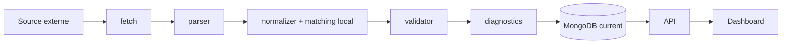

# 11 — Registre des Providers

<!-- current-state-2026-07-13:start -->

## Mise à jour code courant — 13 juillet 2026

- Aucun provider n’est ajouté; le total reste 18.
- references.ts lit les routes publiques Pokémon, moves et types de PokemonGo-API avec timeout 20 secondes et cache mémoire 10 minutes.
- Le JSON utilisateur est une entrée privée d’import, pas un provider externe.

<!-- current-state-2026-07-13:end -->

## 1. Objectif

Recenser les providers formels, scrapers directs, références d’enrichissement, sources d’assets et cibles de veille sans confondre une URL surveillée avec un producteur de dataset.

## 2. Portée

18 providers actifs, manuels, legacy ou de test, plus les 21 entrées du catalogue de veille.

## 3. Méthode

Recherche des URLs, appels fetch/curl, User-Agent, timeout, retry/backoff, parseurs, normalizers et validators dans Data, API et Dashboard. Les droits sont rapportés uniquement lorsqu’ils sont documentés dans le projet.

## 4. Résultats

### 4.1 Providers formels

Seuls trois objets utilisent réellement `defineProvider`:

| ID | Provider | Domaine | Visibilité | Interface |
|---|---|---|---|---|
| PROVIDER-006 | Snacknap | Shiny | privée | `defineProvider` + `runDatasetPipeline` |
| PROVIDER-007 | Fixture Snacknap | Shiny test | privée | `defineProvider` |
| PROVIDER-008 | PvPoke repository | PvP Rankings | publique | `defineProvider` + `runDatasetPipeline` |

L’interface formelle valide `id`, `domain`, `visibility`, `fetch`, `enabled`, `status` et `sourceUrl`, puis le pipeline exécute fetch → normalizer → validator → diagnostics. Elle ne définit pas timeout, retry, backoff, cache, version ou licence.

### 4.2 Générateurs directs courants

| ID | Domaine | Source | Structure |
|---|---|---|---|
| PROVIDER-001 | Raids | LeekDuck page + manifest + pages détail | Générateur inline complexe |
| PROVIDER-002 | Eggs | LeekDuck | Générateur inline |
| PROVIDER-003 | Max Battles | Snacknap | Générateur inline |
| PROVIDER-004 | Rocket | LeekDuck | Générateur inline |
| PROVIDER-005 | Research | LeekDuck | Générateur inline |

Ces cinq domaines partagent `fetchHtml`, le chargement des fiches locales et des helpers de matching, mais ne sont pas encapsulés dans l’interface Provider. `fetchHtml` vérifie HTTP, content-type et corps non vide, sans timeout ni retry.

### 4.3 Events

Le Dashboard combine LeekDuck Events feed/page et ScrapedDuck. Les appels ont des timeouts explicites de 18 s JSON et 22 s HTML, un User-Agent et un parsing Cheerio/JSON. Aucun retry/backoff n’a été trouvé. Les données sont ensuite enrichies par les fiches locales et upsertées dans la collection Events via une route admin.

### 4.4 Références et imports

PokeMiners, Margxt, pogoapi.net, PokeAPI, Bulbapedia, Serebii et le repository Assets interviennent dans des scripts manuels d’import, migration ou génération. Ils ne sont pas nécessairement appelés au runtime de production. Le registre JSON distingue `manual-script`, `manual-import`, `legacy/import-*` et `active-internal-dependency`.

### 4.5 Catalogue de veille

`source-watch/sources.json` contient 21 sources. Certaines produisent des datasets; d’autres sont uniquement surveillées: Pokémon GO Live, Pokémon GO Hub, pages news Margxt, Serebii GO, GoDex, PkmnShuffleMap et pages PokeMiners. Elles ne doivent pas recevoir artificiellement le statut de Provider productif.

### 4.6 Matching et aliases

- Les générateurs dynamiques conservent les entrées non matchées avec diagnostics plutôt que de bloquer systématiquement.
- PvPoke possède des aliases Pokémon et attaques explicites; une forme locale absente reste non matchée.
- Research utilise `itemAliases.json` pour relier les libellés LeekDuck aux items canoniques.
- Shiny enrichit les identités Snacknap avec les fiches locales.
- Events rapproche les références du calendrier et des fiches locales.

## 5. Tableaux

### Matrice Provider → dataset → route/page

| Provider | Dataset | Route API | Page Dashboard |
|---|---|---|---|
| LeekDuck Raids | raids current | `/api/v1/raids`, admin regenerate | PAGE-028 |
| LeekDuck Eggs | eggs current | `/api/v1/eggs` | PAGE-032 |
| Snacknap Max | max-battles current | `/api/v1/max-battles` | PAGE-029 |
| LeekDuck Rocket | rocket current | `/api/v1/rocket` | PAGE-030 |
| LeekDuck Research | research current | `/api/v1/research` | PAGE-033 |
| Snacknap Shiny | shiny rankings/snapshots | route privée `/api/v1/shiny` | PAGE-035 |
| PvPoke | pvp rankings | `/api/v1/pvp-rankings` | PAGE-031 |
| LeekDuck + ScrapedDuck | events | Dashboard `/api/events` + admin | PAGE-034 |

### Robustesse d’accès

| Famille | Timeout | Retry/backoff | Cache |
|---|---|---|---|
| Générateurs current historiques | Aucun | Aucun | `no-store` fetch |
| Snacknap Shiny | Aucun visible | Aucun | `no-store` via helper |
| PvPoke | Aucun visible | Aucun; concurrence 6 | `no-store` |
| Events Dashboard | 18/22 s | Aucun | no-store côté appels |
| Source Watch | 12 s | fallback HEAD→GET pour certains échecs, pas retry général | historique persistant |
| Imports API | 20/30 s sur certains scripts; variable | Aucun général | Manuel |

## 6. Diagrammes Mermaid

## 7. Fichiers sources

- `PokemonGo-Data/scripts/lib/dataset-provider.js:1-74`.
- `PokemonGo-Data/scripts/lib/current-event-utils.js:311-329`.
- `PokemonGo-Data/scripts/providers/pvp/pvpoke-provider.js:7-154`.
- `PokemonGo-Data/scripts/providers/shiny/snacknap-provider.js:1-20`.
- `PokemonGo-Data/scripts/providers/shiny/fixture-provider.js:1-19`.
- Générateurs Data raids, eggs, max battles, rocket, research, shiny, PvP Rankings.
- `Dashboard Admin/src/lib/leekduck-events-scraper.ts:16-18,151-167`.
- `PokemonGo-Data/source-watch/sources.json:1-196`.
- Scripts d’import/migration API listés dans `registries/providers.json`.

## 8. Incohérences

- Cinq providers courants n’utilisent pas l’interface formelle créée pour Shiny/PvP.
- Timeout présent pour Events/source-watch/imports, absent du helper `fetchHtml` partagé des datasets courants.
- “Snacknap” désigne deux domaines mais une seule implémentation est formalisée.
- Le catalogue source-watch mélange actualité, référence UX, asset upstream et provider productif.
- La preuve d’autorisation Snacknap Shiny est une phrase dans le projet; aucun document de licence/conditions n’est inclus.

## 9. Informations manquantes

- Retry/backoff formel: INFORMATION NON TROUVÉE.
- Fréquence planifiée de chaque provider: INFORMATION NON TROUVÉE; régénération manuelle confirmée, cron non trouvé.
- Version de provider persistée: INFORMATION NON TROUVÉE comme champ distinct.
- Droits/licences LeekDuck, Snacknap, Margxt, Serebii, Bulbapedia, PokeMiners: INFORMATION NON TROUVÉE.
- Dernière version valide par provider: non persistée uniformément.

## 10. Risques

| Sévérité | Risque |
|---|---|
| Élevée | Appels sans timeout sur les générateurs de production |
| Élevée | Aucun retry/backoff sur sources externes |
| Élevée | Conditions d’usage/licences non documentées |
| Moyenne | Interface Provider adoptée seulement par deux domaines productifs |
| Moyenne | Parsers HTML fragiles aux changements de markup |
| Moyenne | Dépendance aux branches `master/main` non épinglées |

## 11. Mapping documentaire

Les 18 entrées alimentent `PROVIDER-001` à `PROVIDER-018`, les fiches `DATASET`, `API`, `WORKFLOW`, `SEC`, `TEST`, `PERF`, `ADR` et la matrice public/private.

## 12. État de progression

Phase 8 terminée. Prochaine phase: registre exhaustif des datasets statiques et dynamiques.
