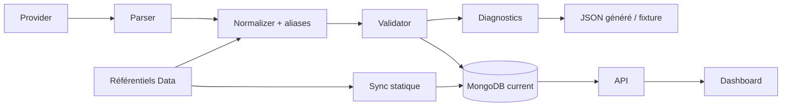

# 12 — Registre des datasets

<!-- current-state-2026-07-13:start -->

## Mise à jour code courant — 13 juillet 2026

- Le registre courant contient 20 datasets avec [DATASET-020](<../Dashboard Admin/docs/codex/Post-audit 2026-07-13/DATASET-020-collection-personnelle-pokemon-go.md>) en private-dashboard.
- La source est un JSON choisi par l’administrateur; aucun export personnel n’est conservé dans Git ou localStorage.
- Le snapshot actif est stocké dans [COL-030](<../Dashboard Admin/docs/codex/Post-audit 2026-07-13/COL-030-trainer-pokemon-owners.md>), [COL-031](<../Dashboard Admin/docs/codex/Post-audit 2026-07-13/COL-031-trainer-pokemon-snapshots.md>), [COL-032](<../Dashboard Admin/docs/codex/Post-audit 2026-07-13/COL-032-trainer-pokemon-entries.md>).

<!-- current-state-2026-07-13:end -->

## 1. Objectif

Recenser les datasets statiques et dynamiques, leurs volumes, schémas, visibilité, providers, pipelines, MongoDB, routes et pages.

## 2. Portée

19 familles normalisées. Les fichiers Pokémon individuels restent exhaustivement couverts par leurs dossiers et schémas plutôt que répétés 3 208 fois dans ce Markdown.

## 3. Méthode

Parsing JSON en lecture seule, comptage de fichiers/octets, extraction des clés/meta, lecture des schémas et confrontation au sync statique et aux adapters courants.

## 4. Résultats

### 4.1 Référentiels statiques

| ID | Dataset | Volume local | Cible Mongo/API |
|---|---|---:|---|
| DATASET-001 | Pokémon principaux | 1 024 fichiers, 3,95 Mo | `pokemon` |
| DATASET-002 | Formes | 580 fichiers, 2,13 Mo | fusion `pokemon` |
| DATASET-003 | Références assets lourds | 1 604 fichiers, 6,52 Mo | `pokemonassets` |
| DATASET-004 | Attaques | 468 fichiers | `moves` |
| DATASET-005 | Types | 19 fichiers | `types` |
| DATASET-006 | Météos | 8 fichiers | `weather` |
| DATASET-007 | Générations/régions | 10 fichiers | `generations`, `regions` |
| DATASET-008 | Items/aliases | 93 items, 23 aliases | `items`; aliases génération |
| DATASET-009 | Textes Rocket | 25 entrées | `rockettexts` |
| DATASET-010 | Stickers | 1 667 entrées | route stickers; modèle dédié non trouvé |
| DATASET-011 | Couleurs/bonbons | fichier 180 Ko | route candy / données dérivées |

`pokemon.schema.json` exige 42 champs de premier niveau; `pokemon-assets.schema.json` exige huit champs. Les autres familles n’ont pas de JSON Schema dédié trouvé.

### 4.2 Datasets courants

| ID | Dataset | Visibilité | Fichier Data | Source production | Volume observé |
|---|---|---|---|---|---:|
| DATASET-012 | Raids | public | 13 Ko, fixture/export | MongoDB `raids` | fichier sans meta |
| DATASET-013 | Eggs | public | 60 Ko | MongoDB `eggs` | fichier sans meta |
| DATASET-014 | Max Battles | public | 2,5 Ko | MongoDB `maxbattles` | fichier sans meta |
| DATASET-015 | Rocket | public | 367 Ko | MongoDB `rockets` | fichier sans meta |
| DATASET-016 | Research | public | 489 Ko | MongoDB `researches` | fichier sans meta |
| DATASET-017 | Shiny | **privé** | 4,07 Mo, schema v2 | MongoDB + snapshots | 1 201 total |
| DATASET-018 | PvP Rankings | public | 81,93 Mo, schema v2 | MongoDB compressé | 19 272, 34 formats |

Les cinq anciens JSON `current*.json` n’embarquent ni `generatedAt`, ni hash, ni version. Le guide Data les classe comme fixtures/références/exports, jamais fallback de production. Shiny/PvP ont au contraire un bloc meta v2 dans `current.json`, mais le runtime API lit le document MongoDB current.

### 4.3 Metadata et versioning

- Shiny: `schemaVersion: 2`, privé, source Snacknap, timestamps source/génération, statut success.
- PvP: `schemaVersion: 2`, public, source PvPoke/MIT, timestamp, statut success.
- Les autres datasets courants persistent `sourceHash`, `generatedAt`, `savedAt`, count et diagnostics dans MongoDB, pas dans les JSON locaux observés.
- Aucun `datasetVersion` SemVer uniforme n’est présent dans les fichiers.

### 4.4 Relations

- Pokémon/formes référencent moves, types, météo, générations, assets et évolutions.
- Datasets courants enrichissent les identités externes avec Pokémon/formes et assets locaux.
- Research relie les rewards aux items/aliases.
- PvP relie Pokémon, moves et types avec aliases.
- Shiny relie rankings, assets et identité Pokémon; snapshots permettent l’historique.

## 5. Tableaux

### Matrice source de vérité

| Classe | Source canonique |
|---|---|
| Référentiels statiques | PokemonGo-Data |
| Cinq datasets current historiques | MongoDB production |
| Shiny/PvP current | MongoDB production; JSON généré/versionné comme artefact |
| Assets binaires | PokemonGo-Assets-API/upstream selon famille; Data ne stocke que les références |
| Source Watch | `source-watch/sources.json` pour configuration; historique ailleurs |

## 6. Diagrammes Mermaid

## 7. Fichiers sources

- `PokemonGo-Data/schemas/pokemon.schema.json` et `pokemon-assets.schema.json`.
- Dossiers/fichiers listés dans `registries/datasets.json`.
- `PokemonGo-API-/src/sync/sync-service.js:18-43,181-228`.
- `PokemonGo-API-/src/current-datasets/adapters.js:389-551`.
- `PokemonGo-API-/src/lib/current-dataset-pipeline.js:135-203`.
- `PokemonGo-Data/GUIDE_WORKFLOW_MONGO.md:3-45`.

## 8. Incohérences

- Metadata riche seulement dans Shiny/PvP JSON, absente des cinq JSON historiques.
- Noms de fichier historiques non uniformes: `currentsMaxBattle.json` contre `current*.json`.
- Noms Mongo pluriels/concaténés non uniformes (`maxbattles`, `researches`, `rockettexts`).
- Stickers et candy sont exposés mais ne suivent pas clairement les neuf cibles statiques Mongo.
- 81,9 Mo pour PvP JSON peut peser lourd dans clone/build/snapshot.

## 9. Informations manquantes

- DatasetVersion/providerVersion uniformes: INFORMATION NON TROUVÉE.
- Hash stocké dans les JSON locaux: INFORMATION NON TROUVÉE sauf calcul runtime Mongo.
- Historique/archives uniformes pour chaque dataset: INFORMATION NON TROUVÉE.
- Schémas JSON dédiés pour moves/types/weather/current datasets: INFORMATION NON TROUVÉE.
- Volumes Mongo réels: non consultés; audit code-only.

## 10. Risques

| Sévérité | Risque |
|---|---|
| Élevée | Confusion JSON current versus Mongo source de vérité |
| Élevée | Dataset PvP de 81,9 Mo dans les clones/builds |
| Moyenne | Schémas et versions non uniformes |
| Moyenne | Fichiers historiques sans timestamps/hash |
| Moyenne | Nommage fichiers/collections divergent |

## 11. Mapping documentaire

Les 19 entrées alimentent `DATASET-001` à `DATASET-019`, ainsi que `MONGO`, `COL`, `API`, `PROVIDER`, `ASSET`, `PERF`, `SEC`, `TEST`, `WORKFLOW` et `ADR`.

## 12. État de progression

Phase 9 terminée. Prochaine phase: pipelines de génération, sync, import, publication, cache, rollback et déploiement.
