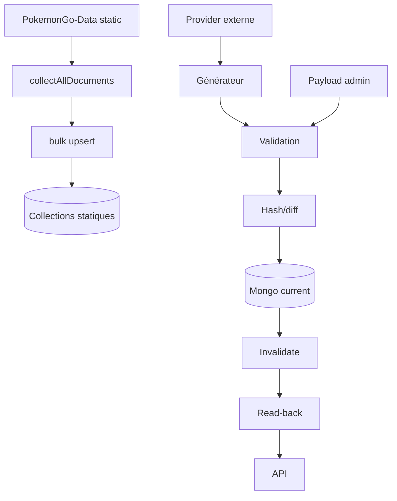

# 13 — Pipelines de données

<!-- current-state-2026-07-13:start -->

## Mise à jour code courant — 13 juillet 2026

- [WORKFLOW-016](<../Dashboard Admin/docs/codex/Post-audit 2026-07-13/WORKFLOW-016-import-collection-pokemon-go.md>) ajoute validation complète, normalisation canonique, preview sans écriture, snapshot staging, read-back, activation du pointeur et archivage de l’ancien actif.
- Le rollback revalide owner, statut et nombre d’entrées avant la même bascule activeSnapshotId.
- Le code n’appelle pas deleteMany sur les collections trainer-pokemon.

<!-- current-state-2026-07-13:end -->

## 1. Objectif

Décrire les pipelines réels de collecte, génération, validation, synchronisation, import, cache, read-back, historique et déploiement.

## 2. Portée

Sync statique, sept datasets courants, Events Dashboard, learning, snapshots `.data`, assets/imports manuels et CI Data → API.

## 3. Méthode

Lecture des orchestrateurs et scripts; aucune génération, écriture Mongo, import ou workflow n’a été exécuté.

## 4. Résultats

### 4.1 Sync statique

Entrée: référentiels PokemonGo-Data. Étapes: collectAllDocuments → stats → syncIndexes → comparaison sourceHash/empreinte → bulk upsert → suppression stale optionnelle → nettoyage assets lourds Pokémon → global stats → cache clear → syncRun success/failure. Sorties: neuf collections statiques + globalstats/syncruns.

Rollback automatique: INFORMATION NON TROUVÉE. Une suppression stale peut être destructive lorsque `SYNC_DELETE_STALE=true`.

### 4.2 Pipeline courant partagé

Entrée: adapter de domaine + générateur Data ou payload manuel explicite. Étapes:

1. fetch provider/générateur;
2. parse/normalise/enrichit;
3. validate dataset non vide/forme attendue;
4. hash canonique et diff;
5. upsert `{key:"current"}`;
6. snapshot optionnel (Shiny);
7. invalidation cache;
8. read-back Mongo;
9. vérification hash + count;
10. réponse diagnostics/diff.

Échec avant upsert: ancien current préservé. Échec après upsert ou création snapshot: aucune transaction/rollback visible; le read-back détecte mais n’annule pas l’écriture.

### 4.3 Import maintenance

`POST /import` exige un payload contenant la rootKey du domaine. L’absence de payload ne déclenche jamais la lecture du disque. Auth admin obligatoire. Le payload suit validation/hash/diff/upsert/read-back.

### 4.4 Events Dashboard

Le bouton scrape récupère feed/page LeekDuck et référence ScrapedDuck, normalise/enrichit, puis upsert Events. La route publique peut renvoyer des seeds si MongoDB manque; les mutations nécessitent MongoDB. Cette politique diffère volontairement des datasets current Mongo-only.

### 4.5 Learning

Contenu local + progression locale au départ; si Mongo est configuré, migration browser, lecture catalogue/progression, activité, import avec stratégies, historique et rollback d’import. La logique est dans `learning/repository.ts` et le hook.

### 4.6 Snapshots Data

Au prebuild Dashboard/API, `ensure-data.js` résout une source explicite ou clone/fetch/reset hard/clean dans `.data/PokemonGo-Data`. Le Dashboard écrit `.dashboard-data-snapshot.json` avec commit/branche/timestamp. Ce pipeline modifie uniquement le cache dérivé pendant un vrai build; il n’a pas été exécuté par l’audit.

### 4.7 Assets et imports historiques

Les scripts API d’enrichissement ont un mode par défaut dry dans les scripts recensés et un suffixe `:write` explicite. Ils collectent Assets/PokeMiners/PogoAPI/PokeAPI/Serebii/Bulbapedia puis écrivent dans Data seulement avec l’option prévue. Aucun de ces scripts n’a été lancé.

## 5. Tableaux

| Pipeline | Validation | Hash/diff | Read-back | Rollback | Logs |
|---|---|---|---|---|---|
| Sync statique | source reader + modèles | sourceHash/empreinte | Non explicite global | Non | syncRuns |
| Current shared | adapter validate | Oui | Oui hash/count | Non transactionnel | console + diagnostics document |
| Events | validations store/scraper | INFORMATION NON TROUVÉE | INFORMATION NON TROUVÉE | Non | rapports réponse/store |
| Learning import | Zod/issues | stratégie ajout/remplacement | lecture repository | Oui, import ciblé | imports/activity |
| `.data` | `hasDataShape` | commit snapshot | structure | reset/reclone | console/build |
| Assets/imports | contrôles script/report | variable | rapports JSON | backups manuels | `*-report.json` |

## 6. Diagrammes Mermaid

## 7. Fichiers sources

- `PokemonGo-API-/src/sync/sync-service.js:18-236`.
- `PokemonGo-API-/src/lib/current-dataset-pipeline.js:20-256`.
- `PokemonGo-API-/src/current-datasets/router.js:65-150`.
- `PokemonGo-Data/scripts/lib/dataset-provider.js:16-66`.
- `Dashboard Admin/scripts/data/ensure-data.js:5-140`.
- `Dashboard Admin/src/lib/leekduck-events-scraper.ts`.
- `Dashboard Admin/src/lib/learning/repository.ts`.

## 8. Incohérences

- Deux pipelines de source de vérité: statique Data et current Mongo, plus Events avec fallback seeds.
- Pipeline formal Provider utilisé seulement par Shiny/PvP; cinq générateurs directs restent parallèles.
- Sync statique a un historique syncRun, current a diagnostics/snapshots seulement selon adapter.
- Read-back robuste du current mais absent du sync statique global.

## 9. Informations manquantes

- Transaction Mongo pour current + snapshot: INFORMATION NON TROUVÉE.
- Rollback current automatique: INFORMATION NON TROUVÉE.
- Cron planifié: INFORMATION NON TROUVÉE.
- Archive systématique avant chaque régénération: INFORMATION NON TROUVÉE.
- Corrélation request/job ID du générateur jusqu’au Dashboard: INFORMATION NON TROUVÉE.

## 10. Risques

| Sévérité | Risque |
|---|---|
| Critique | Suppression stale statique sans rollback intégré si source collectée incorrecte |
| Élevée | Upsert/snapshot current non transactionnels |
| Élevée | Sources externes sans retry/timeout uniforme |
| Moyenne | Politiques de fallback différentes et peu visibles |
| Moyenne | Deux implémentations ensure-data à maintenir |

## 11. Mapping documentaire

Alimente `WORKFLOW`, `ARCH`, `DATASET`, `PROVIDER`, `MONGO`, `API`, `CACHE`, `TEST`, `SEC`, `ADR` et `ROADMAP`.

## 12. État de progression

Phase 10 terminée. Prochaine phase: registre exhaustif des routes API Dashboard et PokemonGo-API-.
