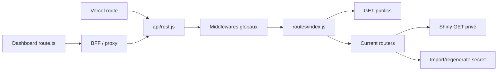

# 14 — Registre API complet

<!-- current-state-2026-07-13:start -->

## Mise à jour code courant — 13 juillet 2026

- Le registre courant contient 160 routes: 122 dans PokemonGo-API- et 38 dans Dashboard Admin.
- Les nouvelles entrées sont [API-157](<../Dashboard Admin/docs/codex/Post-audit 2026-07-13/API-157-get-trainer-pokemon.md>), [API-158](<../Dashboard Admin/docs/codex/Post-audit 2026-07-13/API-158-post-trainer-pokemon-import.md>), [API-159](<../Dashboard Admin/docs/codex/Post-audit 2026-07-13/API-159-get-trainer-pokemon-imports.md>), [API-160](<../Dashboard Admin/docs/codex/Post-audit 2026-07-13/API-160-post-trainer-pokemon-rollback.md>).
- Les quatre handlers exigent session admin; les deux mutations ajoutent same-origin. Ils restent absents d’OpenAPI.

<!-- current-state-2026-07-13:end -->

## 1. Objectif

Recenser les routes publiques, privées, admin, internes et BFF, leur méthode, fichier, auth et visibilité.

## 2. Portée

122 opérations/entrées PokemonGo-API- et 34 handlers Dashboard, soit 156 entrées statiques. Les montages du routeur current sous préfixes public et admin sont comptés séparément car les deux URLs existent réellement.

## 3. Méthode

Extraction des déclarations Express, montages `router.use`, routes générées par `createCurrentDatasetRouter`, configuration Vercel et exports de méthodes des `route.ts` Dashboard. Les paramètres/réponses détaillés restent dans le code/OpenAPI et le registre machine.

## 4. Résultats

### 4.1 Totaux

| Projet | Entrées | GET | POST | PUT | PATCH | DELETE | ANY |
|---|---:|---:|---:|---:|---:|---:|---:|
| Total | 156 | 107 | 40 | 3 | 2 | 3 | 1 |
| PokemonGo-API- | 122 | majorité GET + 28 mutations current |  |  |  |  |  |
| Dashboard Admin | 34 | routes BFF/CRUD |  |  |  |  |  |

### 4.2 API Express publique

Les familles publiques incluent Pokémon, backgrounds, shadow, stickers, shuffle, weather, candy, raids, eggs, max battles, items, rocket, rocket texts, research, PvP Rankings, search, moves, PvP historique, compare, stats, meta, smart routes, mega/dynamax/gigantamax/regional, types, regions et generations.

Les middlewares globaux appliquent request ID, Helmet, CORS GET/HEAD/OPTIONS, compression, JSON 1 Mo, Morgan, rate-limit global, cache GET, notFound et error handler.

### 4.3 Routes current dupliquées par montage

Chaque domaine current est monté sous `/api/v1/<domain>` et `/api/v1/admin/<domain>`. Les deux montages exposent techniquement GET, POST `/import` et POST `/regenerate`.

- Les mutations sous préfixe public passent d’abord par `publicReadOnly`: le secret est vérifié puis une réponse 405 READ_ONLY_API est renvoyée; elles ne réalisent donc pas la mutation.
- Les mutations sous `/admin/` passent le middleware read-only puis `requireAdminSecret` dans le routeur.
- Les GET publics d’un dataset public restent accessibles même sous le préfixe `/admin/` car le routeur ne demande pas le secret pour ces adapters.
- Shiny exige le secret même en GET, sous les deux montages; son historique aussi.

Cette structure fonctionne, mais crée des URLs déclarées dont certaines sont volontairement bloquées ou moins privées que leur nom ne le suggère.

### 4.4 OpenAPI

75 chemins publics sont construits dans `openapi.js`. Shiny est volontairement absent. Les routes admin/import/regenerate et les routes Dashboard ne font pas partie du contrat public. L’API Explorer Dashboard charge `/api-docs.json` puis ajoute manuellement les mutations admin current.

Écarts confirmés ou probables:

- `/api/v1/backgrounds/pokemon/:identifier` n’apparaît pas dans les 75 chemins extraits;
- `/api/v1` racine n’est pas un chemin métier documenté dans la liste;
- les variantes `/admin/*` GET ne sont pas documentées;
- Shiny privé est absent par choix explicite;
- `/api/checklist-v3` est une fonction distincte hors OpenAPI REST v1.

### 4.5 Dashboard BFF

Les 34 handlers couvrent session/logout, Pokémon proxy/admin/health/stats, store, redeploy, database stats, backlog, Events et learning. Les mutations majeures utilisent same-origin pour les mutations recensées, rate-limit et taille JSON. Les chemins exemptés par le proxy global doivent s’authentifier eux-mêmes; le registre marque `session/handler-specific` lorsqu’une preuve route par route reste nécessaire.

## 5. Tableaux

### Matrice auth principale

| Surface | Auth |
|---|---|
| GET REST public | Aucune; rate limit global |
| GET Shiny/history | `x-api-admin-secret` |
| POST `/api/v1/admin/*` current | secret admin |
| POST sous préfixe current public | secret exigé puis 405 read-only |
| Dashboard pages/BFF privés | cookie session ou contrôle handler |
| Login/Events GET | entrée publique; protections spécifiques |
| Dashboard mutations | same-origin fréquent + rate-limit; session à confirmer par handler/proxy |

### Ordre critique

`/pokemon/random`, routes slug/id/dex/form et sous-ressources sont déclarées avant `/:identifier`, évitant leur capture. Les routes smart sont montées sur `/` avant les familles forms/catalogues, mais leurs chemins sont spécifiques et aucun conflit évident n’a été observé.

## 6. Diagrammes Mermaid

## 7. Fichiers sources

- `audit-documentation/registries/api-routes.json` — 156 entrées, JSON validé.
- `PokemonGo-API-/src/app.js:19-110`.
- `PokemonGo-API-/src/routes/index.js:28-109`.
- Tous les modules `src/routes/*.js`.
- `PokemonGo-API-/src/current-datasets/router.js:65-158`.
- `PokemonGo-API-/src/middleware/read-only.js:1-23`.
- `PokemonGo-API-/src/lib/admin-auth.js:1-46`.
- `PokemonGo-API-/src/docs/openapi.js` — 75 chemins construits.
- Tous les `Dashboard Admin/src/app/api/**/route.ts`.

## 8. Incohérences

- Même routeur current monté public/admin, produisant des URLs bloquées et des GET `/admin` publics pour domaines publics.
- Nom `protectedApiPaths` Dashboard pour des chemins exemptés du proxy.
- Shiny privé absent d’OpenAPI mais ajouté manuellement à certaines interfaces admin.
- Architecture Functions Vercel + Express + App Router.
- Méthodes CORS globales configurées GET/HEAD/OPTIONS alors que les mutations admin existent; comportement navigateur cross-origin volontairement restrictif.

## 9. Informations manquantes

- Couverture OpenAPI exacte des schémas réponse de chaque route: audit détaillé non automatisé.
- Consommateurs externes réels: INFORMATION NON TROUVÉE.
- Version legacy/deprecation formelle par route: INFORMATION NON TROUVÉE.
- Pagination uniforme: non; paramètres à documenter route par route depuis OpenAPI/services.

## 10. Risques

| Sévérité | Risque |
|---|---|
| Élevée | Auth Dashboard fragmentée proxy/handler |
| Élevée | URLs current dupliquées et sémantique admin ambiguë |
| Moyenne | Écart OpenAPI/implémentation |
| Moyenne | Nombre élevé de routes BFF monolithiques par action query |
| Faible | Routes publiques multiples pour une même ressource pouvant compliquer SDK/cache |

## 11. Mapping documentaire

Chaque entrée `API-001` à `API-156` peut générer une fiche. Les routes se lient aux documents `PAGE`, `DATASET`, `COL`, `PROVIDER`, `SEC`, `PERF`, `TEST`, `WORKFLOW` et OpenAPI.

## 12. État de progression

Phase 11 inventaire statique terminée. Prochaine phase: collections MongoDB, schémas, index, lectures et écritures.
