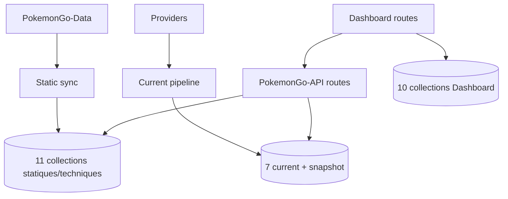

# 15 — Registre MongoDB

<!-- current-state-2026-07-13:start -->

## Mise à jour code courant — 13 juillet 2026

- Le registre courant contient 32 collections; les nouvelles collections sont [COL-030](<../Dashboard Admin/docs/codex/Post-audit 2026-07-13/COL-030-trainer-pokemon-owners.md>), [COL-031](<../Dashboard Admin/docs/codex/Post-audit 2026-07-13/COL-031-trainer-pokemon-snapshots.md>), [COL-032](<../Dashboard Admin/docs/codex/Post-audit 2026-07-13/COL-032-trainer-pokemon-entries.md>).
- trainer_pokemon_owners possède l’index unique owner; snapshots possède deux index; entries possède neuf index.
- Aucun TTL n’est déclaré sur ces trois collections.

<!-- current-state-2026-07-13:end -->

## 1. Objectif

Recenser les collections déclarées, schémas, index, clés uniques, versioning, lectures/écritures, visibilité et risques sans accéder aux données réelles.

## 2. Portée

19 collections Mongoose de PokemonGo-API- et 10 collections driver MongoDB du Dashboard, soit 29 collections déclarées dans le code.

## 3. Méthode

Introspection locale des modèles Mongoose (`Model.collection.name`, paths et indexes) sans connexion, plus lecture des `db.collection` et `createIndex` Dashboard. Les volumes réels, validateurs Atlas et index additionnels côté serveur ne sont pas déductibles.

## 4. Résultats

### 4.1 Collections API exactes

| ID | Collection | Modèle | Rôle / vérité |
|---|---|---|---|
| COL-001 | `eggs` | Egg | current Mongo |
| COL-002 | `generations` | Generation | statique Data synchronisé |
| COL-003 | `globalstats` | GlobalStat | stats du dernier sync |
| COL-004 | `items` | Item | statique Data |
| COL-005 | `maxbattles` | MaxBattle | current Mongo |
| COL-006 | `moves` | Move | statique Data |
| COL-007 | `pokemons` | Pokemon | Pokémon + formes synchronisés |
| COL-008 | `pokemonAssets` | PokemonAsset | références assets lourds |
| COL-009 | `pvp_rankings` | PvpRanking | current Mongo compressé |
| COL-010 | `raids` | Raid | current Mongo |
| COL-011 | `researches` | Research | current Mongo |
| COL-012 | `regions` | Region | statique dérivé |
| COL-013 | `rockets` | Rocket | current Mongo |
| COL-014 | `rocket_texts` | RocketText | statique Data |
| COL-015 | `shiny_rankings` | ShinyRanking | current privé |
| COL-016 | `shiny_snapshots` | ShinySnapshot | historique privé |
| COL-017 | `syncruns` | SyncRun | historique sync statique |
| COL-018 | `types` | Type | statique Data |
| COL-019 | `weathers` | Weather | statique Data |

### 4.2 Collections Dashboard

| ID | Collection | Rôle |
|---|---|---|
| COL-020 | `dashboard_store` | clé/valeur par owner |
| COL-021 | `dashboard_api_metrics` | compteurs endpoint/jour |
| COL-022 | `dashboard_backlog` | tickets backlog |
| COL-023 | `events` | calendrier Pokémon GO |
| COL-024 | `learning_topics` | sujets learning |
| COL-025 | `learning_curricula` | curriculum |
| COL-026 | `learning_progress` | progression owner/item |
| COL-027 | `learning_activity` | journal learning |
| COL-028 | `learning_imports` | historique imports |
| COL-029 | `learning_topic_versions` | versions/rollback sujets |

### 4.3 Schéma current partagé

Les sept collections current utilisent `key` unique, domain enum, visibility public/private, source Mixed, generatedAt/savedAt, count, sourceHash, status, data, compressedData optionnel, diagnostics et timestamps. `strict:false` facilite l’évolution mais réduit la contrainte de schéma.

### 4.4 Index et unicité

- Current: index unique implicite sur `key`.
- Shiny snapshots: indexes domain, visibility, snapshotAt, sourceHash et composite domain/snapshotAt.
- Pokémon: clé unique, nombreux indexes simples et sept indexes composés/textuels.
- Assets: `key` et `formId` uniques.
- Items/moves/types/weather/rocket texts: identité unique et recherche textuelle selon modèle.
- Dashboard store: owner+key unique.
- Events: id unique, status/date, type/date, updatedAt.
- Learning: identités uniques, owner/item, activity eventKey sparse unique et historiques datés.
- Aucun index TTL n’est déclaré dans les 29 entrées.

### 4.5 Lectures/écritures

- Statique: bulkWrite upsert, suppression stale optionnelle, syncIndexes.
- Current: findOne/update current, snapshot create, read-back.
- Dashboard: driver MongoDB avec connexion promise cachée, timeout sélection serveur 7 s, indexes créés paresseusement une fois par instance.
- Events/Backlog/Learning: CRUD via routes Dashboard; seeds/fallback local selon domaine.
- Métriques: erreurs volontairement avalées pour ne pas bloquer le métier.

## 5. Tableaux

### Public/private

| Groupe | Visibilité |
|---|---|
| Shiny rankings/snapshots | Privée confirmée |
| Current raids/eggs/max/rocket/research/PvP | Exposés en lecture publique via API |
| Référentiels statiques | Exposés sélectivement via routes publiques |
| SyncRuns/globalstats | Interne, stats exposées sélectivement |
| Collections Dashboard/Learning/Events admin | Privées; Events possède GET public avec projection métier |

## 6. Diagrammes Mermaid

## 7. Fichiers sources

- Tous les modèles sous `PokemonGo-API-/src/models`.
- `PokemonGo-API-/src/models/current-dataset.js:3-50`.
- `PokemonGo-API-/src/models/dataset-snapshot.js:3-24`.
- `PokemonGo-API-/src/sync/sync-service.js`.
- `Dashboard Admin/src/lib/dashboard-store.ts:109-220`.
- `Dashboard Admin/src/lib/learning/repository.ts:90-139`.
- `registries/mongodb-collections.json` — 29 entrées.

## 8. Incohérences

- Nommage mixte camelCase, snake_case et pluriels Mongoose (`pokemonAssets`, `pvp_rankings`, `weathers`).
- `strict:false` sur tous les modèles API observés.
- Index créés au runtime de manière paresseuse côté Dashboard, `syncIndexes` côté API.
- Events public avec fallback seeds, current API sans fallback.
- `dashboard_store` sert aussi de source legacy pour migration learning.

## 9. Informations manquantes

- Volumes réels, storageSize, cardinalités: INFORMATION NON TROUVÉE sans accès DB.
- Index Atlas additionnels/Search: configuration partielle seulement; état déployé non vérifié.
- MongoDB validators côté collection: INFORMATION NON TROUVÉE.
- Sauvegardes Atlas, PITR et rétention: INFORMATION NON TROUVÉE.
- Migrations formelles versionnées: INFORMATION NON TROUVÉE.

## 10. Risques

| Sévérité | Risque |
|---|---|
| Élevée | `strict:false` accepte des divergences de documents |
| Élevée | Suppression stale statique activée par défaut |
| Élevée | Aucun TTL/rétention pour snapshots, logs et activités |
| Moyenne | Index runtime pouvant diverger de production |
| Moyenne | Nommage de collections hétérogène |

## 11. Mapping documentaire

Les 29 entrées alimentent `COL-001` à `COL-029`, documents `MONGO`, `DATASET`, `API`, `SEC`, `PERF`, `TEST`, `WORKFLOW` et `ADR`.

## 12. État de progression

Phase 12 terminée en code-only. Prochaine phase: familles d’assets, règles de nommage, dimensions, consommateurs et déduplication.
