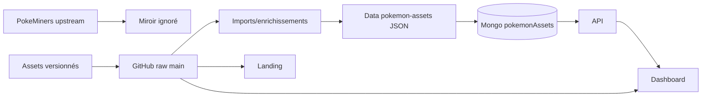

# 16 — Registre des assets

<!-- current-state-2026-07-13:start -->

## Mise à jour code courant — 13 juillet 2026

- Aucune famille d’assets n’est ajoutée; le registre reste à 17 entrées.
- La normalisation sélectionne uniquement l’image normale ou shiny exacte issue des référentiels API.
- Une correspondance absente conserve image=null et produit un diagnostic MISSING_ASSET; aucun URL d’asset n’est fabriqué.

<!-- current-state-2026-07-13:end -->

## 1. Objectif

Cartographier les familles d’assets, origines, nommages, formats, dimensions représentatives, consommateurs, fallbacks, déduplication et statut public/cache.

## 2. Portée

17 familles couvrant repository Assets, miroir PokeMiners, Dashboard public, arbre API local et références JSON Data.

## 3. Méthode

Comptage Git et arbre de travail, extensions, lecture du sync PokeMiners, échantillon de dimensions par famille avec métadonnées système et recherche des règles de déduplication. Les dimensions indiquées sont représentatives, pas une garantie pour tous les fichiers.

## 4. Résultats

### 4.1 Repository Assets versionné

| ID | Famille | Fichiers suivis | Dimension échantillon |
|---|---|---:|---|
| ASSET-011 | Pokémon Shuffle | 10 319 | 128×128 |
| ASSET-003 | Pokémon GO icons | 3 538 | 256×256 |
| ASSET-004 | Pokémon HOME HD | 3 054 | 512×512 |
| ASSET-009 | Divers/UI | 2 925 | variable |
| ASSET-005 | Stickers | 1 667 | 512×512 |
| ASSET-008 | Candy | 549 | 256×256 |
| ASSET-001 | LocationCards | 233 | 512×512 |
| ASSET-002 | MegaPortraits | 170 | env. 483×511 |
| ASSET-010 | Items | 128 | 256×256 |
| ASSET-006/007 | Types backgrounds/icons | 19 + 19 | 128×128 / 64×64 |
| ASSET-012 | Weather | 8 | 64×64 |

Total Git observé: 22 634 fichiers, dont quelques fichiers racine/scripts. Les URLs raw utilisent la branche `main`, sans commit pin.

### 4.2 Miroir PokeMiners

`PokeMiners-pogo_assets` contient environ 42 398 fichiers dans l’arbre de travail mais est ignoré par Git. Le script télécharge l’archive `master.zip`, supprime/remplace le dossier cible, extrait aussi les RAR et écrit `.sync-manifest.json`. Il s’agit d’un miroir généré, non d’une source canonique du workspace. `.pokeminers-cache` est également ignoré et éphémère.

### 4.3 Références Data

Les 1 604 fichiers `pokemon-assets/**/*.assets.json` séparent les références lourdes des fiches Pokémon. Ils peuvent contenir HOME, portraits, shiny, assetForms, backgrounds et Shuffle. Le sync Mongo les place dans `pokemonAssets`, puis les services hydratent les réponses Pokémon.

### 4.4 Fallbacks

Les helpers Data choisissent `assets.image`, puis HOME, portrait ou Shuffle selon disponibilité. Les générateurs current conservent `unmatched:true` et peuvent laisser asset null plutôt que d’inventer. Le Dashboard affiche parfois icône/placeholder lorsqu’une image manque; couverture exacte par composant dans le registre COMP.

### 4.5 Déduplication

- Raids: `seenBosses` et compteur de doublons.
- Rocket: Set sur identités de profils/slots.
- Collections Dashboard: Set par clé d’asset.
- Shuffle import: détection `duplicateAssignments` et règles de terminal states.
- Location Cards: Jaccard/union de tokens et dex éligibles uniques.
- Dashboard Assets: “réutilisations” signifie même URL sur plusieurs fiches et n’est pas automatiquement une erreur.

## 5. Tableaux

### Source → consommateur

| Source | Consommateurs |
|---|---|
| GitHub raw Assets | Landing, Dashboard, API docs, imports |
| PokeMiners mirror | extraction/inspection/imports manuels |
| Data asset refs | Mongo `pokemonAssets`, routes, Dashboard |
| Dashboard public | shell et composants UI locaux |
| API asset tree | checklist/UI historique à confirmer |

## 6. Diagrammes Mermaid

## 7. Fichiers sources

- `PokemonGo-Assets-API/.gitignore:1-3`.
- `PokemonGo-Assets-API/scripts/sync-pokeminers-pogo-assets.js:8-15,52-147`.
- `PokemonGo-Data/pokemon-assets/**`.
- `PokemonGo-API-/scripts/import/visual-assets.js`, `location-cards.js`, `pokemon-shuffle.js`.
- `Dashboard Admin/src/components/admin/pokemon/admin-app.jsx:2161-2238`.

## 8. Incohérences

- Le nom “Assets API” désigne une bibliothèque GitHub raw, pas un service avec contrat/version.
- 65 041 fichiers dans l’arbre complet contre 22 634 suivis, principalement à cause du miroir ignoré.
- Formats/dimensions/naming très hétérogènes dans `divers`.
- URLs branchées sur `main` et `master` non versionnées.
- Arbre `PokemonGo-API-/asset` massif dont l’origine/versionnement exact reste ambigu.

## 9. Informations manquantes

- Dimensions exhaustives de chaque fichier: INFORMATION NON TROUVÉE; seuls échantillons relevés.
- Licence/droits par famille: INFORMATION NON TROUVÉE.
- CDN avec cache/version de release: INFORMATION NON TROUVÉE.
- Validation CI de liens cassés/dimensions: INFORMATION NON TROUVÉE.
- Origine exacte de chaque fichier `divers` et arbre API asset: INFORMATION NON TROUVÉE.

## 10. Risques

| Sévérité | Risque |
|---|---|
| Élevée | Droits/licences non documentés |
| Élevée | Assets raw non épinglés à un commit |
| Élevée | Miroir/sources locales pouvant être confondus |
| Moyenne | Très grand volume et clone/build coûteux |
| Moyenne | Nommage et dimensions hétérogènes |

## 11. Mapping documentaire

Alimente `ASSET-001` à `ASSET-017`, `DATASET`, `COMP`, `API`, `PERF`, `SEC`, `WORKFLOW`, `ADR` et `ROADMAP`.

## 12. État de progression

Phase 13 terminée au niveau des familles. Prochaine phase: caches, snapshots, localStorage, TTL et invalidation.
