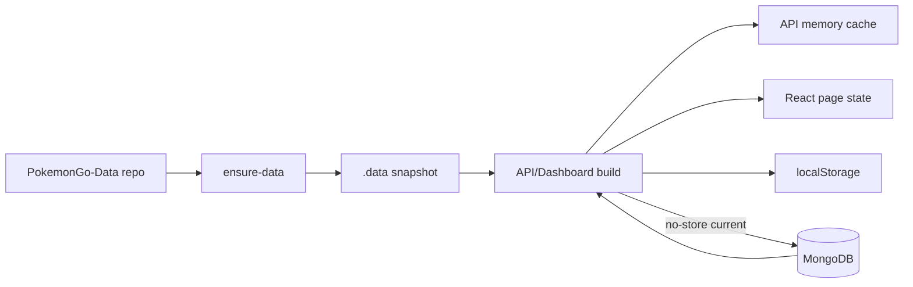

# 17 — Cache et données locales

<!-- current-state-2026-07-13:start -->

## Mise à jour code courant — 13 juillet 2026

- Les réponses trainer-pokemon utilisent Cache-Control private, no-store et Vary: Cookie.
- references.ts conserve une Promise de référentiels pendant 10 minutes et la réinitialise après erreur.
- La fonctionnalité ne crée aucune clé localStorage et ne stocke aucun payload utilisateur dans le navigateur après import.

<!-- current-state-2026-07-13:end -->

## 1. Objectif

Documenter snapshots `.data`, cache mémoire/HTTP, localStorage, caches d’assets, invalidation, TTL, fallback et risques de stale data.

## 2. Portée

Dashboard, API, Data snapshot, Assets mirror/cache et 28 clés localStorage applicatives détectées.

## 3. Méthode

Lecture des mécanismes de résolution/invalidation et recherche des clés/cache headers. Les caches de build `.next`, dépendances et navigateur externe sont classés mais non ouverts comme source.

## 4. Résultats

### 4.1 `.data/PokemonGo-Data`

- Origine: clone GitHub du repository PokemonGo-Data ou snapshot ciblé par `POKEMON_GO_DATA_DIR`.
- Générateur: `scripts/data/ensure-data.js` dans Dashboard et API.
- Rôle: données embarquées au build/runtime, checklist et code admin.
- Statut: clone/snapshot/cache de déploiement.
- Modifiable: seulement par le pipeline ensure-data/sync; ne jamais corriger à la main.
- Production: inclus dans le tracing Vercel de certaines fonctions/routes.
- Source canonique: non; repository Data ou Mongo current selon domaine.

### 4.2 Cache API mémoire

Map en mémoire par instance, TTL par défaut 60 s, maximum 5 000 entrées, GET seulement. `?fresh=true` contourne. Les réponses 2xx sans `no-store` sont stockées; `X-Cache` expose HIT/MISS/BYPASS. Le prune supprime expirés puis plus anciens par ordre d’insertion.

Les routeurs current imposent `no-store`; raids/eggs/max/research/rocket sont aussi bypassés par pattern. Shiny/PvP ne sont pas dans ce pattern/prefix map, mais le header `no-store` du routeur empêche leur insertion après réponse.

Invalidation:

- sync statique: `clearCache()` total;
- current historique: `invalidateDatasetCache(domain)` par préfixes;
- Shiny/PvP: pas de préfixe, mais non cacheables par header.

### 4.3 Cache HTTP Dashboard

Les routes privées/store/learning/admin observées utilisent `private, no-store`. Les clients current et docs utilisent largement `cache:"no-store"`. Aucun SWR/React Query n’est installé; l’état React local joue le rôle de cache de session de page.

### 4.4 localStorage

28 clés `matweb.*` ont été détectées, couvrant notes, todos, kanban, projets, calendrier, writer, outils, palette, widgets, Pomodoro, exercices, progression learning, règles/assetChecks/sourceHistory/todos Pokémon et historique de déploiement/version.

`usePersistentState` tente une lecture/écriture du Dashboard store selon son comportement interne et maintient un fallback navigateur. Certaines fonctions métier accèdent aussi directement à localStorage, créant plusieurs mécanismes.

### 4.5 Assets/cache

- `.pokeminers-cache`: archive ZIP et extraction temporaire, ignorée Git.
- `PokeMiners-pogo_assets`: miroir dérivé ignoré, remplacé en bloc par le script.
- `.next`: build/cache Next.
- `node_modules`: dépendances installées, jamais données métier.
- Archives racine: sauvegardes explicites, non fallback automatique confirmé.

## 5. Tableaux

| Cache | Propriétaire | Durée | Invalidation | Risque |
|---|---|---|---|---|
| API Map | instance Express | 60 s défaut | TTL, max, clear/prefix | instances non partagées |
| Current React state | AdminApp | durée page | refresh/section/reload | stale jusqu’au refresh |
| localStorage | navigateur/admin | sans TTL | utilisateur/migrations | données anciennes/perte locale |
| `.data` | build API/Dashboard | jusqu’au prochain ensure | reset/reclone | snapshot décalé |
| PokeMiners cache/mirror | Assets repo local | jusqu’au prochain sync | suppression/remplacement | gros volume dérivé |
| Events seeds | Dashboard code | fallback Mongo absent | déploiement code | divergence du réel |

## 6. Diagrammes Mermaid

## 7. Fichiers sources

- `Dashboard Admin/scripts/data/ensure-data.js:5-140`.
- `Dashboard Admin/src/server/pokemon-go/src/lib/data-repository.js:23-48`.
- `PokemonGo-API-/src/lib/cache.js:1-90`.
- `PokemonGo-API-/src/current-datasets/router.js:15-19`.
- `Dashboard Admin/src/lib/use-persistent-state.ts`.
- `PokemonGo-Assets-API/.gitignore:1-3`.

## 8. Incohérences

- Persistance Dashboard partagée entre store Mongo et accès localStorage directs.
- Aucun TTL localStorage ou migration globale de schéma.
- Invalidation current prefix ne liste que cinq domaines, alors que sept existent; header no-store compense actuellement.
- `.data` peut être prioritaire dans le résolveur Dashboard malgré la présence du repo voisin.
- Historique documentaire mentionne d’anciens fallbacks fichier pour current, alors que le code actuel vise Mongo-only.

## 9. Informations manquantes

- Taille réelle localStorage par clé: INFORMATION NON TROUVÉE.
- TTL/revalidation Vercel/CDN: INFORMATION NON TROUVÉE.
- Politique de purge snapshots/archives: INFORMATION NON TROUVÉE.
- Cache distribué: INFORMATION NON TROUVÉE.
- Service worker Dashboard: INFORMATION NON TROUVÉE.

## 10. Risques

| Sévérité | Risque |
|---|---|
| Élevée | Snapshot `.data` décalé pris pour état courant |
| Élevée | Données localStorage sans TTL/sauvegarde uniforme |
| Moyenne | Cache mémoire non partagé entre instances |
| Moyenne | Invalidation codée par liste de domaines |
| Moyenne | Accès local direct et hook persistant concurrents |

## 11. Mapping documentaire

Alimente `ARCH`, `DATASET`, `PERF`, `SEC`, `WORKFLOW`, `ADR`, `ROADMAP` et documents Cache/local persistence.

## 12. État de progression

Phase 14 terminée. Prochaine phase: authentification, sessions, secrets, permissions, CORS/CSRF/rate-limit et routes destructrices.
