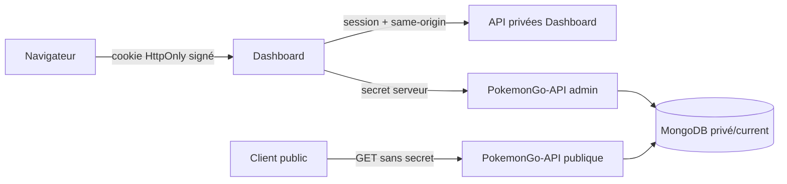

# 18 — Authentification et sécurité

<!-- current-state-2026-07-13:start -->

## Mise à jour code courant — 13 juillet 2026

- Le Dashboard contient désormais 38 méthodes API enregistrées.
- Le préfixe /api/trainer-pokemon traverse proxy.ts puis chacun des quatre handlers vérifie getSession et role=admin.
- Preview/commit est limité à 12 Mo et 20 000 entrées; import et rollback appliquent same-origin et des rate limits dédiés.

<!-- current-state-2026-07-13:end -->

## 1. Objectif

Documenter les frontières d'authentification, autorisations, secrets, sessions, protections HTTP et risques observables dans le code, sans lire les valeurs des fichiers d'environnement ni tester les systèmes déployés.

## 2. Portée

Le Dashboard Next.js, ses 34 handlers API, son proxy d'accès, le proxy vers PokemonGo-API, l'API Express/Next, l'application checklist locale et les fichiers de configuration associés.

## 3. Méthode

Lecture statique des middlewares, handlers, helpers cryptographiques, headers, variables d'environnement référencées et tests. Les fichiers `.env`, bien que présents localement, n'ont pas été ouverts; seules leur présence et leur exclusion Git ont été vérifiées.

## 4. Résultats

### 4.1 Session Dashboard

- Authentification mono-compte par `ADMIN_EMAIL` et `ADMIN_PASSWORD`.
- En production, l'absence de `ADMIN_EMAIL`, `ADMIN_PASSWORD` ou `SESSION_SECRET` fait échouer toute connexion.
- En local seulement, les valeurs de repli sont `matthieu@example.com`, `change-moi` et `local-dashboard-secret`.
- Le jeton est un payload JSON base64url signé par HMAC-SHA256. Il contient email, rôle `admin` et date d'émission.
- Vérification de signature en temps constant et expiration à 14 jours.
- Cookie `HttpOnly`, `SameSite=Lax`, `Secure` en production, portée `/`, durée 14 jours.
- Le modèle ne prévoit ni révocation serveur, ni rotation, ni rôles multiples, ni MFA, ni invalidation sur changement de mot de passe.
- La comparaison du mot de passe est une égalité en clair avec la variable d'environnement; aucun hash de mot de passe n'est stocké par l'application.

### 4.2 Frontières Dashboard

| Surface | Accès | Contrôle effectif |
|---|---|---|
| `/login`, `/api/session`, `/api/logout` | Public technique | origine commune pour POST, rate limit au login |
| `/api/events` GET | Public métier | rate limit; projection événements; cache public |
| Pages Dashboard hors login | Privé | session vérifiée dans `proxy.ts` |
| `/api/dashboard-store*` | Privé | `getSession()` dans chaque handler |
| `/api/dashboard-backlog*` | Privé | session + same-origin sur mutations |
| `/api/admin/events*` | Privé | session + same-origin sur mutations |
| `/api/learning*` | Privé | session; same-origin sur mutations |
| `/api/pokemon-admin` | Privé | session; same-origin sur POST |
| `/api/pokemon-api-proxy` | Privé | session; allowlist dynamique et statique |
| Autres API Dashboard | Privé | session globale du proxy et, contrôle handler vérifié pour les routes recensées |

Les cinq familles privées listées dans `protectedApiPaths` sont volontairement laissées passer par le proxy global, puis authentifiées dans leurs handlers. Le code audité applique bien `getSession()` aux routes présentes. Cette architecture reste sujette à régression: une nouvelle sous-route héritera de l'exemption sans recevoir automatiquement l'authentification.

### 4.3 Autorisations

Le Dashboard n'a qu'un rôle (`admin`). Les données Dashboard sont isolées par `session.email` lorsque les repositories utilisent un owner. Il n'existe ni RBAC granulaire, ni permission par action, ni distinction lecture/écriture entre administrateurs.

PokemonGo-API distingue:

- lecture publique GET/HEAD;
- endpoints Shiny privés et mutations admin protégés par `x-api-admin-secret`;
- anciennes mutations publiques: le middleware vérifie d'abord le secret puis renvoie `405`, car le dépôt API est read-only;
- routes `/admin`: le middleware read-only laisse passer, puis le handler exige le secret pour les mutations;
- actions checklist internes (`source-watch`, historique, audit URL): secret requis.

Le secret Dashboard → API reste côté serveur et n'est pas exposé par une variable `NEXT_PUBLIC_*`.

### 4.4 Proxy vers PokemonGo-API

Le proxy exige une session Dashboard. Il ne prend pas une URL arbitraire: le chemin demandé doit appartenir aux routes système, à une allowlist admin ou aux chemins récupérés depuis OpenAPI, avec validation des paramètres de route. La base vient toutefois de `POKEMON_API_PUBLIC_URL`: une mauvaise configuration serveur peut rediriger les appels et le secret admin vers un hôte non prévu. C'est un risque de configuration/SSRF interne, pas une injection directe par l'utilisateur.

### 4.5 Protections HTTP

| Protection | Dashboard | PokemonGo-API |
|---|---|---|
| CSP | Oui | Oui via Next config/Helmet |
| Anti-frame | `DENY` + `frame-ancestors none` | Helmet/headers |
| MIME sniffing | `nosniff` | Helmet/headers |
| Referrer policy | strict-origin-when-cross-origin | configurée |
| Same-origin mutations | helper explicite | CORS + secret/read-only |
| Rate limiting | mémoire, par instance/IP/label | `express-rate-limit`, global |
| Taille JSON | helper, 250 Ko défaut/1 Mo admin Pokémon | limite Express/configuration |
| CORS | même origine navigateur | configurable, `*` par défaut |
| TLS/HSTS | dépend du déploiement | HSTS déclaré côté Next/Helmet |

La CSP Dashboard conserve `script-src 'unsafe-inline' 'unsafe-eval'` même en production et `style-src 'unsafe-inline'`. Elle réduit certaines classes d'attaque mais ne constitue donc pas une barrière XSS forte.

### 4.6 Secrets et données sensibles

Variables sensibles repérées par nom: `ADMIN_PASSWORD`, `SESSION_SECRET`, `DASHBOARD_MONGODB_URI`, `MONGODB_URI`, `POKEMON_API_ADMIN_SECRET`, `API_ADMIN_SECRET`, `POKEMON_GO_DATA_TOKEN`, `GH_TOKEN`, `GITHUB_TOKEN`, hook Vercel et `CHECKLIST_PASSWORD`. Les `.gitignore` couvrent les fichiers `.env` et `.vercel` des projets principaux. Aucun secret réel n'a été collecté ni reproduit dans cet audit.

L'application checklist locale mémorise son mot de passe dans `localStorage` puis l'envoie via `x-checklist-password`; ce mécanisme est acceptable seulement pour un outil local de confiance. Son serveur écoute par défaut sur `0.0.0.0`, ce qui augmente l'exposition au réseau local.

## 5. Tableaux

### Données et visibilité

| Donnée | Visibilité | Barrière |
|---|---|---|
| Référentiels Pokémon et current non-Shiny | Publique | GET API, rate limit/cache |
| Shiny current + snapshots | Privée | secret API, relayé serveur par Dashboard |
| Dashboard store/backlog/métriques | Privée | cookie signé + owner email |
| Learning/progression/imports | Privée | cookie signé + owner email |
| Événements publiés | Publique via `/api/events` | projection métier + rate limit |
| Administration événements | Privée | session + contrôle d'origine |
| Tokens GitHub/Mongo/hook/API | Secrets serveur | variables d'environnement |

## 6. Diagrammes Mermaid

## 7. Fichiers sources

- `Dashboard Admin/src/lib/auth.ts:4-24` — identifiants et garde production.
- `Dashboard Admin/src/lib/session-token.ts:3-52` — création et validation de session.
- `Dashboard Admin/src/lib/security.ts:3-116` — CSP, origine, rate limit et taille.
- `Dashboard Admin/src/proxy.ts:6-44` — frontières globales.
- `Dashboard Admin/src/app/api/pokemon-api-proxy/route.ts:6-113` — allowlist et secret serveur.
- `PokemonGo-API-/src/app.js:20-70` — Helmet, CORS, compression et limiteur.
- `PokemonGo-API-/src/lib/admin-auth.js:1-39` — secret admin en temps constant.
- `PokemonGo-API-/src/middleware/read-only.js` — politique lecture seule.

## 8. Incohérences

- Le nom `protectedApiPaths` désigne des chemins exemptés du contrôle global, pas protégés par celui-ci.
- La CSP Dashboard autorise `unsafe-eval` en production alors que la CSP API ne l'ajoute qu'en développement.
- CORS API vaut `*` par défaut tandis que la documentation insiste sur des opérations privées par secret.
- Le Dashboard a deux couches de login historiques: la session principale et des actions `login/logout` internes de l'admin Pokémon qui ne créent plus de session propre.
- Les erreurs de rate limit mémoire sont locales à chaque instance serverless et ne donnent pas de `Retry-After` visible dans le helper.

## 9. Informations manquantes

- Valeurs et rotation réelles des secrets: NON LUES volontairement.
- Configuration effective Vercel, domaines, WAF et protection DDoS: INFORMATION NON TROUVÉE dans le code local.
- Règles réseau Atlas/IP allowlist: INFORMATION NON TROUVÉE.
- Journal d'accès, alertes de sécurité et procédure d'incident: INFORMATION NON TROUVÉE.
- Scan SAST/DAST, secret scanning et dépendances en production: à confirmer dans les phases CI/dépendances.
- Tests d'intrusion et vérification du déploiement: NON RÉALISÉS, audit code-only.

## 10. Risques

| Sévérité | Risque | Recommandation |
|---|---|---|
| Élevée | CSP Dashboard affaiblie par `unsafe-inline` et `unsafe-eval` | supprimer progressivement ces sources, ajouter nonce/hash |
| Élevée | Exemption par préfixe des API privées: oubli d'auth possible lors d'une future route | authentifier globalement puis ne déroger qu'aux vrais endpoints publics |
| Élevée | Secret API envoyé à l'hôte défini par `POKEMON_API_PUBLIC_URL` | valider l'origine contre une allowlist serveur stricte |
| Élevée | Session valide 14 jours sans révocation ni rotation | ajouter version/session store, rotation et invalidation |
| Moyenne | Rate limits mémoire non partagés et IP issue de headers proxy | utiliser un store distribué et une politique proxy fiable |
| Moyenne | CORS API `*` par défaut | définir explicitement les origines attendues en production |
| Moyenne | Mot de passe checklist dans `localStorage`, serveur sur `0.0.0.0` | limiter à loopback par défaut, éviter le stockage persistant |
| Moyenne | Identifiant/mot de passe local par défaut documentables | afficher un avertissement et empêcher l'exposition réseau en mode local |
| Faible | Pas de MFA/RBAC | pertinent si le Dashboard devient multi-utilisateur ou critique |

## 11. Mapping documentaire

Ce rapport alimente `SEC-AUTH`, `SEC-SECRETS`, `SEC-HEADERS`, `SEC-CORS`, `SEC-RATE`, `API`, `DEPLOY`, `TEST`, `PUBLIC-PRIVATE` et les ADR relatifs aux sessions et aux frontières d'accès.

## 12. État de progression

Phase 15 terminée en code-only. Aucun secret réel n'a été lu. Les contrôles privés actuels ont été vérifiés dans les handlers; la dette principale est leur exemption fragile au niveau du proxy.
