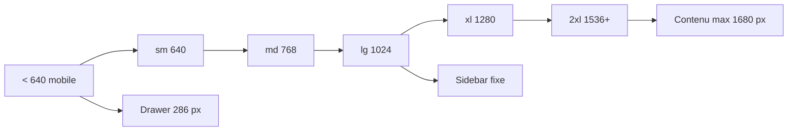

# 19 — Audit responsive

<!-- current-state-2026-07-13:start -->

## Mise à jour code courant — 13 juillet 2026

- [PAGE-049](<../Dashboard Admin/docs/codex/Post-audit 2026-07-13/PAGE-049-ma-collection-pokemon-go.md>) rend des cartes sous lg et une table scrollable min-width 1540 px à partir de lg.
- Les viewports 1440×1000, 820×1180 et 390×844 ont été contrôlés pendant la livraison post-audit.
- La recherche, les filtres, les statistiques et les actions passent de grilles empilées à des groupes desktop.

<!-- current-state-2026-07-13:end -->

## 1. Objectif

Évaluer depuis le code les adaptations mobile, tablette, laptop, desktop et écrans larges de toutes les familles de pages et composants. Aucun navigateur ni appareil réel n'a été utilisé dans cette phase code-only.

## 2. Portée

20 routes Dashboard, 23 sections Pokémon embarquées, les pages publiques PokemonGo-API, les cinq pages publiques API/Landing, la checklist React, l'asset browser, Redoc/Swagger et la checklist HTML locale.

## 3. Méthode

Inventaire des classes responsive, media queries, tailles fixes, grilles, scrolls, tables, overlays, modales, images, navigation et capteurs drag-and-drop. Les comptages excluent `node_modules`, `.next` et archives.

## 4. Résultats

### 4.1 Breakpoints réels

| Niveau | Seuil effectif | Usage |
|---|---:|---|
| Petit mobile personnalisé | 480 px | quelques grilles admin Pokémon (`min-[480px]`) |
| Mobile → `sm` | 640 px | 321 occurrences Dashboard, 49 API app/components |
| Tablette → `md` | 768 px | 41 Dashboard, 7 API components |
| Laptop → `lg` | 1024 px | 67 Dashboard, 33 API app/components; sidebar desktop |
| Desktop → `xl` | 1280 px | 81 Dashboard, 10 API app/components |
| Wide → `2xl` | 1536 px | 32 Dashboard, 3 API components |
| Ultra | non dédié | max-width 1680 px et règles `2xl`, aucun seuil ultra distinct |
| Checklist HTML legacy | 760 px | media query mobile unique |
| Redoc custom | 980 / 680 px | hero, navigation et documentation |
| Landing | `sm` 640, `md` 768, `lg` 1024 | hero, nav, stats et deux colonnes |

Les seuils Tailwind correspondent aux valeurs par défaut. Aucun thème de breakpoints personnalisé n'a été trouvé.

### 4.2 Shell et navigation

- Dashboard: sidebar fixe 236 px, 286 px en `2xl`, repli 84 px à partir de `lg`; drawer mobile 286 px sous `lg`.
- Le contenu compense exactement la largeur de sidebar et reste plafonné à 1680 px.
- Topbar: recherche masquée sous `md`, bouton sidebar mobile sous `lg`, titre tronqué.
- À 320 px, le drawer 286 px tient encore mais laisse une marge étroite; aucun `max-width:100vw` explicite sur le drawer.
- Checklist HTML: toolbar repliable et navigation fixe à six colonnes sous 760 px avec safe-area bottom.
- Site API React: navigation et sections utilisent principalement `sm`, `lg`, `xl` et des grilles auto-fit.

### 4.3 Pages et composants

| Famille | Adaptation observée | Risque principal |
|---|---|---|
| Dashboard accueil/stats | colonnes 1 → 2/3/6, widgets réordonnables | plusieurs sous-grilles restent 2 ou 3 colonnes dès mobile |
| Formulaires notes/todo/writer | largeur fluide, inputs pleine largeur | hauteurs mini 420–520 px et scroll interne |
| Kanban | colonnes/cards DnD, PointerSensor seulement | interaction tactile non explicitement prise en charge |
| Widgets triables | Pointer + TouchSensor avec délai/tolérance | poignées 36 px sous cible tactile recommandée |
| Documentation JSON | table min-width 620 px dans overflow auto | scroll horizontal prévu mais dense sur mobile |
| Admin Pokémon | usage massif `min-w-0`, grilles progressives, cartes | volume et scrolls imbriqués importants |
| Current panels | filtres empilés puis colonnes | contenus denses, badges et stats à 2/3 colonnes mobile |
| PvP | accordéons responsive, détails 1 → 2 colonnes | nombreuses données compactes et textes longs |
| Calendrier Events | modales `dvh`, grilles adaptatives | calendrier complet non vérifié tactilement |
| Checklist API | grille 1 → 2 → 3 → 4 | cartes longues; modal à scroll interne |
| Assets API | grilles responsives et preview `dvh` | volume d'images et overlay à vérifier sur petits écrans |
| Redoc/Swagger | CSS custom Redoc responsive | Swagger dépend du composant tiers et peut garder de larges tableaux |
| Landing | hero 1 → 2 colonnes, stats 1 → 2 → 4 | nav masquée sous `md`; cartes Pokémon gardent des colonnes fixes 96/80 px |

### 4.4 Modales et drawers

Le composant `Modal` commun utilise `w-full`, `max-h:92dvh`, padding mobile et corps scrollable. Les détails Pokémon sont bottom-sheet sur mobile (`items-end`, coins supérieurs) puis centrés sur `sm`. Les modales Event, Collections, Source Watch et Version utilisent `dvh` et overflow interne.

Risques:

- en-tête + corps + footer peuvent créer deux zones de scroll;
- plusieurs modales métier n'utilisent pas toutes le composant commun;
- tailles calculées comme `100vh - 310px` dans Notes restent moins robustes que `dvh` avec clavier virtuel;
- textarea d'export à 520 px minimum allonge fortement les petits écrans.

### 4.5 Tables, listes, charts et calendriers

- Une table JSX explicite a été trouvée dans le viewer documentaire; son conteneur est scrollable horizontalement.
- Le reste des données denses est principalement rendu en cards/grilles, ce qui évite plusieurs tables impossibles à réduire.
- Les charts Recharts sont dans des conteneurs responsifs, mais leurs labels ne peuvent pas être validés sans rendu.
- Les grandes listes Pokémon utilisent pagination/limites selon les panneaux, mais aucune virtualisation UI générale.
- Les calendars et Kanban reposent sur interactions complexes; aucun mode mobile simplifié séparé n'est déclaré.

### 4.6 Images, textes et cibles tactiles

- Images majoritairement `object-contain`, `max-width`, tailles responsives et `loading=lazy` sur les longues listes.
- `truncate`, `min-w-0` et `overflow-wrap:anywhere` sont largement employés contre les débordements.
- Nombreuses actions utilisent 40–44 px de hauteur, mais plusieurs icônes/actions restent à 32, 36 ou 40 px; elles sont inférieures à une cible tactile confortable de 44 px.
- Aucun utilitaire `touch-manipulation` global. `touch-none` est appliqué aux poignées DnD.
- Landing: les CTA atteignent 48 px et Next Image dimensionne les médias, mais le titre reste `text-5xl` sous 640 px et la carte Pokémon peut réduire sa colonne texte presque à zéro sur 320 px.

## 5. Tableaux

### Indicateurs statiques

| Indicateur | Dashboard | API app + components |
|---|---:|---:|
| Fichiers TS/JS/CSS inspectés | 215 | 22 |
| `overflow-x-auto` | 5 | 0 |
| `overflow-auto` | 17 | 5 |
| `overflow-hidden` | 101 | 17 |
| `min-w-*` | 201 | 19 |
| tailles arbitraires `w-[…]` | 133 | 48 |
| overlays `fixed inset` | 16 | 3 |

Ces nombres sont des signaux de complexité, pas des défauts automatiques.

## 6. Diagrammes Mermaid

## 7. Fichiers sources

- `Dashboard Admin/src/components/admin/layout/admin-app-frame.tsx:63-124` — shell/sidebar/drawer.
- `Dashboard Admin/src/components/admin/navigation/admin-topbar.tsx:29-85` — topbar adaptative.
- `Dashboard Admin/src/components/ui/modal.tsx:42-73` — modal commune.
- `Dashboard Admin/src/components/admin/pokemon/pokemon-docs-viewer.tsx:152-170` — table scrollable.
- `Dashboard Admin/src/components/admin/shared/sortable-widget-grid.tsx:57-59` — capteurs touch.
- `Dashboard Admin/src/components/admin/forms/kanban-board.tsx:133` — PointerSensor seul.
- `PokemonGo-API-/components/checklist/detail-modal.jsx:580-632` — bottom-sheet mobile.
- `PokemonGo-API-/apps/checklist/index.html:1322-1475` — media query 760 px.
- `PokemonGo-API-/src/docs/redoc-page.js:172-199` — seuils 980/680 px.
- `Landing-Page-PogoApi/components/landing-experience.jsx:97-205` — responsive Landing.

## 8. Incohérences

- Mélange des seuils Tailwind 640/768 et legacy 760/680/980.
- `vh` et `dvh` coexistent.
- Le Kanban n'a pas le TouchSensor déjà utilisé par les widgets triables.
- Les cibles d'action oscillent entre 32 et 44 px.
- Le terme « ultra » n'a pas de breakpoint propre malgré une largeur maximale 1680 px.
- Certaines interfaces métier dupliquées Dashboard/API ont des règles responsive proches mais indépendantes.
- La navigation Landing disparaît sous `md` sans menu mobile; seuls les CTA du hero restent accessibles.

## 9. Informations manquantes

- Captures aux largeurs 320, 375, 768, 1024, 1440, 1920: NON RÉALISÉES.
- Tests iOS Safari, Android Chrome, zoom 200/400 %, clavier virtuel et orientation paysage: INFORMATION NON TROUVÉE.
- Matrice appareils/navigateurs supportés: INFORMATION NON TROUVÉE.
- Mesure réelle des débordements et scrolls imbriqués: non mesurable de façon fiable par lecture seule du code.

## 10. Risques

| Sévérité | Risque | Zones |
|---|---|---|
| Élevée | Kanban possiblement difficile/inutilisable au tactile | PAGE-009 |
| Élevée | Interfaces très denses sans test viewport automatisé | admin Pokémon, Events, PvP |
| Élevée | Carte hero Landing à colonnes fixes et titre 5xl sur très petit écran | PAGE-044 |
| Moyenne | Sous-grilles 2/3 colonnes dès mobile | accueil, stats, badges |
| Moyenne | Cibles 32–40 px | navigation secondaire, cartes, DnD |
| Moyenne | Scrolls imbriqués et hauteurs fixes | modales, Notes, exports, previews |
| Faible | Absence de breakpoint ultra dédié | écrans > 1680 px |

## 11. Mapping documentaire

Ce rapport alimente `RESPONSIVE`, `COMPONENT`, `PAGE`, `DESIGN-SYSTEM`, `A11Y`, `PERF`, `TEST-E2E` et les critères d'acceptation par viewport.

## 12. État de progression

Phase 17 terminée en code-only. L'architecture mobile existe et est largement appliquée; les principaux besoins sont des tests rendus systématiques, un traitement tactile du Kanban, la navigation/cartes Landing mobile et l'unification des tailles/cibles.
