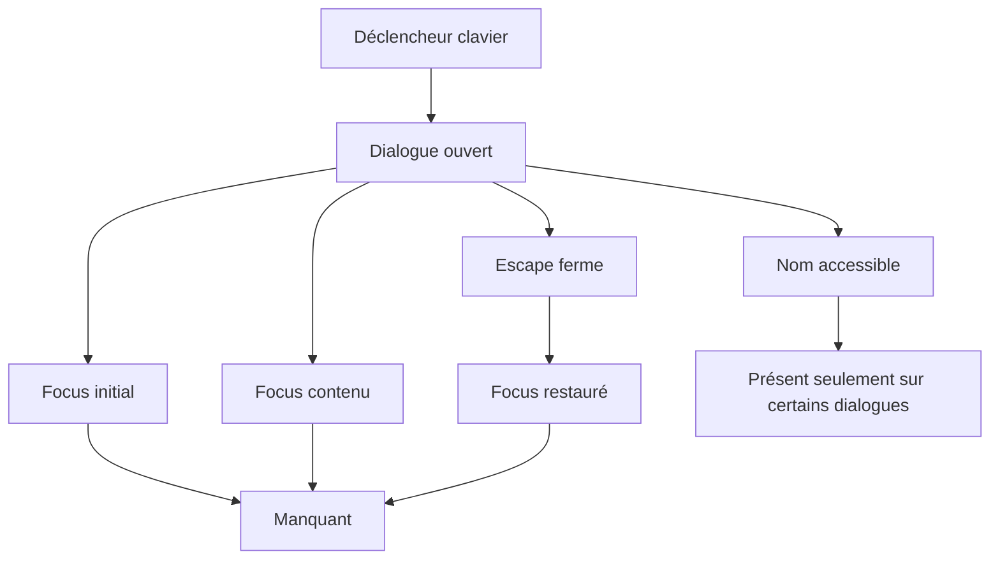

# 20 — Audit accessibilité

<!-- current-state-2026-07-13:start -->

## Mise à jour code courant — 13 juillet 2026

- La page ajoute une live region polite, des labels de champs, un role=alert et un tableau nommé.
- La Modal commune piège Tab, ferme sur Escape et restaure le focus à l’élément déclencheur.
- Les images exposent un alt métier ou le texte Image indisponible avec le nom français.

<!-- current-state-2026-07-13:end -->

## 1. Objectif

Évaluer la conformité potentielle aux WCAG 2.2 niveau AA à partir du code: structure, clavier, focus, formulaires, ARIA, modales, images, mouvement, annonces et zones tactiles.

## 2. Portée

Toutes les pages et familles de composants Dashboard, site API et Landing. Swagger/Redoc tiers et la checklist HTML legacy sont couverts au niveau intégration/CSS mais pas audités composant par composant.

## 3. Méthode

Recherche statique exhaustive des éléments sémantiques, contrôles, attributs ARIA, focus, images, champs et animations, puis inspection des composants centraux et overlays. Aucun lecteur d'écran, axe, Lighthouse ni calcul automatisé de contraste n'a été exécuté.

## 4. Résultats

### 4.1 Niveau estimé

**Conformité partielle; niveau AA non démontré.** Les fondations sont meilleures que la moyenne (skip links, landmarks, vrais boutons, textes alternatifs, labels fréquents, focus visible du composant Button), mais les dialogues sans gestion complète du focus, certains champs sans nom accessible, le mouvement réduit incomplet et les petites cibles empêchent de conclure à WCAG 2.2 AA.

### 4.2 Sémantique et titres

- Dashboard: `main`, `nav`, `aside`, `header`, `footer`, sections et articles sont utilisés; un skip link cible le `main` focusable.
- Site API: skip link, header, plusieurs navigations nommées, contenu focusable et footer.
- Le topbar Dashboard fournit un `h1` global; certains contenus ajoutent aussi leur propre `h1`, ce qui peut produire plusieurs titres de niveau 1 sans stratégie documentaire explicite.
- Landing utilise un `main` unique avec header/nav, un h1 et deux h2; aucun skip link ni label de navigation n'est présent.
- Plusieurs sections utilisent `aria-labelledby` avec IDs stables dans le module Learning.
- Les composants complexes en cards réduisent l'usage des tableaux de données; aucun caption/thead n'est nécessaire pour la table documentaire de structure brute, mais cette table n'a pas d'intitulé accessible propre.

### 4.3 Navigation clavier et focus

Protections présentes:

- skip links Dashboard et site public;
- contrôles interactifs principalement natifs (`button`, `a`, `input`, `select`);
- touche Escape dans la modale UI commune;
- focus ring explicite dans `Button` et plusieurs champs;
- `aria-expanded`, `aria-controls` et `aria-current` sur la navigation API.

Lacunes:

- aucune focus trap/FocusScope détectée;
- aucune restauration systématique du focus à l'élément déclencheur;
- seule la modale commune gère Escape; plusieurs modales métier ne le font pas;
- les dialogues n'acquièrent pas explicitement le focus à l'ouverture;
- plusieurs champs appliquent `outline-none` avec seulement un changement de bordure, parfois subtil;
- DnD Kanban n'a pas de KeyboardSensor détecté; les widgets triables n'en déclarent pas non plus.

### 4.4 Dialogues, drawers et overlays

| Composant | Rôle/nom | Escape | Focus trap/restore | État |
|---|---|---|---|---|
| `components/ui/modal.tsx` | dialog, aria-label | oui | non | partiel |
| Historique versions | dialog nommé | non détecté | non | partiel |
| Détail Pokémon Dashboard/API | dialog sans nom explicite | non détecté | non | insuffisant |
| Détail Event | dialog avec aria-label | non détecté | non | partiel |
| Event editor/import | article visuel, pas dialog | non | non | insuffisant |
| Collections/Source Watch | dialog/aria-modal | non détecté | non | partiel |
| Preview images | `role=presentation` + clic overlay | non détecté | non | insuffisant |

Le scroll du body est verrouillé seulement dans la modale commune. Les autres implémentations sont indépendantes, ce qui rend le comportement clavier incohérent.

### 4.5 Formulaires et erreurs

- 63 éléments `label` ont été comptés dans le Dashboard, avec un champ imbriqué dans les occurrences recensées, donc sans besoin de `htmlFor`.
- Les composants Input/Textarea acceptent les attributs natifs et les pages de login utilisent nom, type et autocomplete corrects.
- Des noms accessibles sont confirmés sur l'API Explorer et les filtres Shiny.
- Champs sans label/ARIA visibles dans le code: filtres type/statut/date Events, filtres principaux de la checklist API, certains selects Calendar/Todo/Subscriptions, textarea Import Events et plusieurs inputs admin historiques. Un placeholder ou la première option ne remplace pas un label.
- Deux zones `aria-live` et un `role=status` existent dans JS Progress; un `role=alert` existe dans diagnostics current.
- La majorité des erreurs réseau, confirmations de sauvegarde et états loading sont du texte conditionnel sans live region; un lecteur d'écran peut ne pas être informé.

### 4.6 Images et alternatives

Le scan des balises JSX n'a trouvé aucune balise `img`/`Image` sans attribut `alt`. Les images décoratives emploient `alt=""` dans les occurrences décoratives recensées; les images métier utilisent le nom du Pokémon/asset. Quelques icônes Lucide reçoivent `aria-label` directement alors que le support ARIA d'un SVG décoratif doit être uniformisé via le bouton ou un texte adjacent.

### 4.7 Couleurs, contraste et information

- Les états importants combinent couleur, texte, icône ou libellé (`success`, warning, privé, rang, statut).
- Le système propose dark/light et huit palettes, avec nombreux mélanges alpha et couleurs locales. Le contraste ne peut pas être garanti par inspection seule pour toutes les combinaisons.
- Des textes `text-slate-500`, `text-[9px]`, `text-[10px]` et opacités faibles apparaissent dans des cartes sombres; risque de contraste/lisibilité.
- Les focus basés uniquement sur une variation de bordure cyan peuvent être trop discrets selon palette.

### 4.8 Mouvement réduit

Une media query `prefers-reduced-motion` désactive uniquement `.energy-scan`. Elle ne couvre pas `.animated-sheen`, les loaders pulse/spin, les transitions, les dix fichiers Framer Motion ni les animations DnD. Aucun `useReducedMotion` ni utilitaire `motion-reduce` n'a été trouvé.

La Landing ajoute trois animations GSAP, dont un flottement infini `repeat:-1`, sans consultation de `prefers-reduced-motion`; c'est un gap confirmé supplémentaire.

### 4.9 Zones tactiles

Beaucoup de contrôles principaux atteignent 40–48 px, mais des actions et poignées mesurent 32, 36 ou 40 px. Cela ne satisfait pas systématiquement la cible WCAG 2.2 de 24×24 CSS px avec espacement, et reste sous la recommandation ergonomique 44×44.

## 5. Tableaux

### Indicateurs statiques JSX

| Indicateur | Dashboard | API public components/app |
|---|---:|---:|
| boutons natifs | 185 | 16 |
| images `img`/`Image` | 79 | 28 |
| images sans attribut alt | 0 détectée | 0 détectée |
| `aria-label` | 79 | 11 |
| `aria-live` | 2 | 0 |
| dialogues déclarés | 7 | 1 |
| labels | 63 | 1 |
| `focus-visible` | 4 | 0 |
| Framer Motion imports | 10 fichiers | 0 |

### Problèmes par sévérité

| Sévérité | Problème | Composants/pages |
|---|---|---|
| Critique AA | focus non piégé/restauré dans les modales | toutes les modales |
| Élevée | modales Event/preview sans sémantique/nom complet | Events, assets, détails |
| Élevée | champs sans nom accessible | Events, checklist API, Calendar, Todo, admin Pokémon |
| Élevée | DnD sans alternative clavier documentée | Kanban, widgets |
| Élevée | reduced motion très partiel | shell, Framer, loaders |
| Moyenne | focus indicator incohérent après `outline-none` | formulaires custom |
| Moyenne | live regions insuffisantes | erreurs/sauvegardes/chargements |
| Moyenne | cibles 32–40 px | icon buttons, poignées |
| À mesurer | contraste des huit palettes et overlays | ensemble Dashboard |
| Élevée | animation GSAP infinie sans reduced motion | PAGE-044 Landing |
| Moyenne | navigation Landing masquée mobile et sans `aria-label` | PAGE-044 |
| Moyenne | barres visuelles du hero sans rôle meter/progress | PAGE-044 |

## 6. Diagrammes Mermaid

## 7. Fichiers sources

- `Dashboard Admin/src/components/admin/layout/admin-app-frame.tsx:53-122` — skip link et main.
- `Dashboard Admin/src/components/ui/modal.tsx:22-73` — Escape, dialog, absence de focus trap.
- `Dashboard Admin/src/components/admin/events/event-editor-modal.jsx:8-84` — overlays non déclarés dialog.
- `Dashboard Admin/src/components/admin/events/events-calendar-panel.jsx:705-723` — filtres sans noms.
- `Dashboard Admin/src/components/admin/pokemon/detail-modal.jsx:1114-1168` — dialogue non nommé.
- `Dashboard Admin/src/app/globals.css:665-670` — reduced motion limité.
- `PokemonGo-API-/components/site/shell.jsx:29-124` — skip link/navigation.
- `PokemonGo-API-/components/checklist/checklist-app.jsx:256-274` — filtres sans labels.
- `Landing-Page-PogoApi/components/landing-experience.jsx:65-205` — GSAP, nav et barres visuelles.

## 8. Incohérences

- Certaines modales utilisent le composant commun, d'autres des overlays ad hoc.
- Certaines sélections ont `aria-label`, d'autres seulement une option lisible.
- Les boutons communs ont un focus visible fort, les champs custom non.
- La stratégie d'alt est bonne mais la stratégie d'annonce dynamique est rare.
- `prefers-reduced-motion` existe sans couvrir le système d'animation réel.

## 9. Informations manquantes

- Résultats axe/Lighthouse/WAVE: NON RÉALISÉS.
- Parcours VoiceOver/NVDA et clavier complet: NON RÉALISÉS.
- Ratios de contraste calculés pour les huit palettes: INFORMATION NON MESURÉE.
- Zoom/reflow 200 % et 400 %: NON TESTÉS.
- Accessibilité effective de Swagger UI et Redoc chargés depuis tiers: NON VÉRIFIÉE.
- Parcours Landing au clavier et effet reduced-motion réel: NON TESTÉS.

## 10. Risques

Le risque dominant est l'enfermement ou la perte de contexte clavier dans les overlays. Viennent ensuite les formulaires sans nom accessible et l'absence d'alternative clavier aux interactions drag-and-drop. La diversité des palettes rend indispensable une validation automatisée de contraste par thème.

## 11. Mapping documentaire

Ce rapport alimente `A11Y`, `COMPONENT-MODAL`, `FORM`, `NAV`, `DESIGN-SYSTEM`, `RESPONSIVE`, `TEST-A11Y` et les critères WCAG par composant.

## 12. État de progression

Phase 18 terminée en code-only. Estimation: conformité partielle, AA non démontré. Les images et landmarks sont globalement bien traités; focus des dialogues, labels, DnD clavier et reduced motion — notamment GSAP Landing — sont prioritaires.
