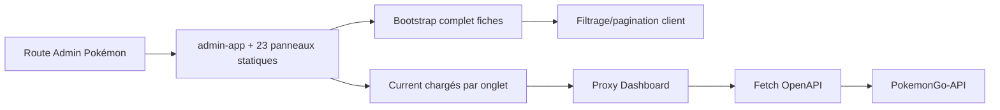

# 21 — Audit performance

<!-- current-state-2026-07-13:start -->

## Mise à jour code courant — 13 juillet 2026

- AdminApp contient désormais un import dynamique: TrainerPokemonCollectionPanel.
- La recherche trainer attend 300 ms; la route limite les réponses à 100 entrées et utilise pagination, projection et index MongoDB.
- Les référentiels Pokémon, moves et types sont chargés en parallèle puis partagés dix minutes côté serveur.

<!-- current-state-2026-07-13:end -->

## 1. Objectif

Identifier les coûts potentiels frontend, serveur, MongoDB, providers et build, ainsi que les optimisations déjà présentes. Les métriques réelles ne sont pas inventées.

## 2. Portée

Rendu Next/React, 113 fichiers clients, requêtes fetch, images, listes, bundles potentiels, API Express, caches, requêtes MongoDB, génération current et build data.

La Landing est ajoutée comme page cliente autonome de 10 Ko source utilisant GSAP et Next Image.

## 3. Méthode

Analyse statique des tailles de fichiers, frontières client/serveur, imports, hooks, pagination, projections Mongo, caches et timeouts. Aucun `next build` n'a été lancé car il écrirait `.next` dans les dépôts sources, hors de la zone d'écriture autorisée.

## 4. Résultats

### 4.1 Frontend Dashboard

- 113 fichiers `use client` sur le périmètre Dashboard + site API.
- `admin-app.jsx` pèse 103 Ko source et importe statiquement les 23 panneaux Pokémon, le détail modal, DnD, toasts et composants annexes.
- Aucun `next/dynamic`, `React.lazy` ou import dynamique n'a été trouvé dans les interfaces. Le code est découpé par route Next, mais la route Admin Pokémon embarque toute sa surface fonctionnelle dès le chargement.
- Autres gros composants clients: Events 67,7 Ko, détail Pokémon 63,3 Ko, Collections 36 Ko, Backlog 32,3 Ko, Kanban 29,2 Ko.
- Dépendances frontend lourdes potentielles: Framer Motion, Recharts, dnd-kit, GSAP, date-fns, Lucide et Sonner. L'impact exact du tree-shaking n'est pas mesuré.
- 130 occurrences de `useMemo`/`useCallback`/memo indiquent des optimisations sur filtrage, stats, calendriers et listes; les gros composants restent néanmoins des unités de rendu étendues.
- L'admin charge au démarrage le bootstrap complet des fiches/checks puis Source Watch. Les datasets current sont ensuite chargés à la demande par onglet, ce qui est positif.

### 4.2 Site public API

- Accueil rendu côté serveur avec `revalidate = 3600`, bon compromis pour les métriques statiques.
- Checklist et Assets sont des applications clientes complètes.
- Checklist effectue deux requêtes parallèles (`bootstrap` + `catalog`), reçoit toutes les entrées, filtre côté client et n'en rend initialement que 120. La pagination est donc visuelle, pas réseau.
- L'asset browser charge catalog + audit puis construit et filtre toutes les collections en mémoire; aucune pagination/virtualisation visible.
- Les pages n'utilisent pas de lazy loading de composants, même pour le détail modal volumineux.

### 4.3 Images

97 balises `img` brutes contre seulement trois fichiers important `next/image`. Une partie importante des URLs vient de `raw.githubusercontent.com` et des providers. Plusieurs listes ajoutent `loading="lazy"`, mais ce n'est pas systématique. Les images brutes ne bénéficient pas automatiquement de redimensionnement, WebP/AVIF, srcset ou cache de l'optimiseur Next.

La Landing fait exception positivement: ses six visuels utilisent `next/image`, dimensions fixes et priorité uniquement pour le premier Pokémon. En revanche, le composant entier devient client uniquement pour GSAP et embarque des statistiques/URLs hardcodées susceptibles de vieillir sans fetch/revalidation.

### 4.4 Listes et calculs

Optimisations existantes:

- `useMemo` sur filtres, groupements, statistiques et calendrier;
- limites progressives checklist (120) et collections;
- pagination serveur Shiny/PvP (`page`, `limit=50`);
- limitation Mongo des activités/imports/backlog/events;
- concurrence bornée dans le scraper Events et la synchro GitHub;
- `loading=lazy` sur plusieurs cartes Pokémon.

Manques:

- aucune virtualisation;
- bootstrap admin et public non paginé au transport;
- plusieurs listes Mongo restent non bornées (`find({owner}).toArray()`, catalogues complets) ou plafonnées très haut (events 2000, backlog 500);
- les calendriers recalculent/affichent de nombreuses cartes enrichies, quoique mémoïsées;
- un composant parent massif porte de nombreux états et peut rerendre de larges sous-arbres.

### 4.5 API et MongoDB

- Les listes principales Pokémon, moves, items, forms, PvP, shadow et rocket texts ont `skip/limit`, `countDocuments` et `.lean()`.
- Des projections réduisent certains endpoints smart/shadow/assets.
- Plusieurs endpoints catalogues/weather/backgrounds renvoient des ensembles complets sans pagination; leur taille dépend de la cardinalité réelle.
- Recherche regex `searchTerms` et plusieurs requêtes `$or` peuvent devenir coûteuses malgré les index déclarés; plans `explain()` non disponibles.
- Les lectures current sont une `findOne({key:"current"})`, mais le payload peut être compressé/décompressé et volumineux.
- Les indexes Dashboard sont créés paresseusement par instance; cela ajoute un coût au premier accès.
- Connexions Mongo utilisent une promise partagée par runtime, limitant les reconnexions dans une instance.

### 4.6 Cache et transport

- API Express: cache mémoire GET, TTL 60 s par défaut, maximum 5000 entrées, invalidation par préfixe; compression HTTP active.
- Current datasets: `no-store` et bypass cache pour préserver la fraîcheur.
- Events public Dashboard: `max-age=60, stale-while-revalidate=300`.
- Dashboard privé et proxy: majoritairement `private, no-store`.
- Cache mémoire non partagé entre instances serverless et réponses stockées comme objets complets, sans limite de poids.
- Le proxy API recharge OpenAPI en `no-store` à chaque requête pour recalculer l'allowlist, ajoutant une requête réseau et jusqu'à 8 s de latence avant l'appel cible.

### 4.7 Providers et pipelines

- Appels externes ont des timeouts explicites dans les adapters et relais recensés dans les adapters/relays; Dashboard utilise 8–12 s sur plusieurs proxys.
- MapLimit borne la concurrence Event/GitHub.
- Génération current effectue validation, hash, écriture puis read-back, coût justifié pour l'intégrité.
- Les providers sans retry centralisé peuvent échouer vite; ceux qui en ont peuvent allonger fortement un job. Durées réelles non instrumentées globalement.
- Le build exécute `ensure-data`; coût réseau/git et volume `.data` peuvent dominer le temps de build.

### 4.8 SSR, CSR et hydratation

Le site accueil profite du serveur/ISR. Les applications checklist/assets et la quasi-totalité du Dashboard sont hydratées côté client. Les pages Dashboard minces délèguent à de gros composants clients. Le layout vérifie la session côté serveur, mais le contenu métier n'utilise que peu les Server Components pour précharger ou réduire le JavaScript navigateur.

La Landing est également entièrement hydratée via `LandingExperience` pour trois timelines GSAP, alors que son contenu est statique; l'impact bundle exact de GSAP n'est pas mesuré.

## 5. Tableaux

### Signaux statiques

| Signal | Valeur |
|---|---:|
| Source JS/TS/CSS inspectée | ~1,79 Mo |
| Fichiers clients | 113 |
| Plus gros composant client | 103 055 octets |
| Imports dynamiques UI | 0 |
| Images brutes JSX | 97 |
| Fichiers utilisant Next Image | 3 |
| Signaux memo | 130 |
| Appels `fetch` code source | 99 |

### Risques par zone

| Sévérité | Zone | Risque |
|---|---|---|
| Élevée | Admin Pokémon | bundle et hydration de tous les panneaux |
| Élevée | Bootstrap checklist/admin | payload complet avant pagination visuelle |
| Élevée | Assets | chargement/filtrage de catalogues complets, pas de virtualisation |
| Élevée | Proxy API | OpenAPI rechargé avant chaque appel |
| Moyenne | Images | 97 images non optimisées par Next |
| Moyenne | Mongo | endpoints non paginés et regex/plans inconnus |
| Moyenne | Cache | mémoire par instance, poids non borné |
| Moyenne | Build | ensure-data réseau/volume avant chaque build |
| Moyenne | Landing | hydration + GSAP pour contenu statique; métriques codées en dur |

## 6. Diagrammes Mermaid

## 7. Fichiers sources

- `Dashboard Admin/src/components/admin/pokemon/admin-app.jsx:1-67` — imports statiques massifs.
- `Dashboard Admin/src/app/api/pokemon-admin/route.ts:543-563` — bootstrap complet.
- `Dashboard Admin/src/components/admin/pokemon/admin-app.jsx:1088-1133` — données à la demande par section.
- `PokemonGo-API-/components/checklist/checklist-app.jsx:11-42` — 120 rendus, payload complet.
- `PokemonGo-API-/components/assets/assets-app.jsx:418-452` — catalogues complets.
- `PokemonGo-API-/src/lib/cache.js:1-85` — cache mémoire.
- `PokemonGo-API-/src/services/pokemon-service.js:168-180` — pagination/projection.
- `Dashboard Admin/src/app/api/pokemon-api-proxy/route.ts:24-46` — OpenAPI par requête.
- `Landing-Page-PogoApi/components/landing-experience.jsx:1-92` — client GSAP et images.

## 8. Incohérences

- Pagination UI côté checklist mais transfert complet.
- Données current `no-store` cohérentes, alors que l'allowlist OpenAPI quasi statique est aussi `no-store`.
- Mélange `next/image` et images brutes sans politique par famille.
- Bon usage de `useMemo`, mais aucun découpage dynamique des plus gros composants.
- API publique compressée/cacheable, Dashboard privé volontairement no-store; les objectifs différents doivent être explicités.

## 9. Informations manquantes

- Taille réelle des chunks, First Load JS et temps de build: NON MESURÉS.
- Core Web Vitals, TTFB, LCP, INP, CLS: INFORMATION NON TROUVÉE.
- Poids du chunk GSAP Landing et bénéfice visuel mesuré: INFORMATION NON TROUVÉE.
- Volumes de réponse bootstrap/current/assets: NON MESURÉS en production.
- Plans Mongo `explain`, taux de cache, cardinalités et latences p95/p99: INFORMATION NON TROUVÉE.
- Durées réelles providers/builds: INFORMATION NON TROUVÉE.

## 10. Risques et recommandations documentaires

Priorités: découper les panneaux Admin avec `next/dynamic`, séparer bootstrap résumé/liste paginée/détail, mettre en cache court l'OpenAPI du proxy, paginer/virtualiser Assets, mesurer/réduire GSAP Landing, formaliser une politique d'images, puis instrumenter Web Vitals et latences API/Mongo. Toute optimisation doit être mesurée avant/après.

## 11. Mapping documentaire

Ce rapport alimente `PERF-FRONT`, `PERF-API`, `PERF-MONGO`, `CACHE`, `PROVIDER`, `BUILD`, `OBSERVABILITY` et les budgets de performance futurs.

## 12. État de progression

Phase 19 terminée en code-only. Les optimisations de requêtes et memo sont réelles; les deux dettes majeures sont les monolithes clients sans lazy loading et les gros payloads intégralement transférés.
