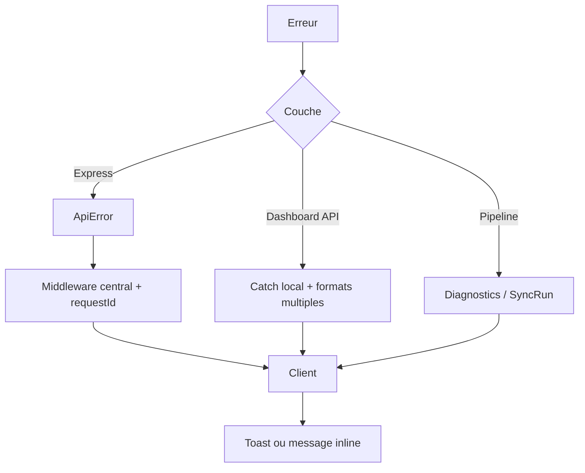

# 22 — Gestion des erreurs

<!-- current-state-2026-07-13:start -->

## Mise à jour code courant — 13 juillet 2026

- trainerPokemonServerError introduit un format success=false avec code, message et issues facultatives.
- Les messages 5xx sont masqués; les statuts 400, 403, 404, 409, 413, 429, 502 et 503 restent distingués par les helpers et guards.
- Un échec avant activation conserve le snapshot actif; un staging en échec reçoit status=failed et failureCode.

<!-- current-state-2026-07-13:end -->

## 1. Objectif

Décrire les erreurs UI, API, validation, MongoDB, providers et pipelines: propagation, format, exposition, reprise et silences.

## 2. Portée

Handlers Dashboard, composants clients, API Express, génération current, sync statique, scrapers/providers et scripts.

## 3. Méthode

Lecture des `try/catch`, `.catch`, helpers de réponse, erreurs typées, validations et retours UI. Les comportements de plateforme non présents dans le code ne sont pas supposés.

## 4. Résultats

### 4.1 API Express

- `ApiError` porte statut, code et détails.
- `asyncHandler` transmet les rejets au middleware central.
- Le format est stable: `{ error: { code, message, requestId, details? } }`.
- Les erreurs 500 sont masquées en production par « Erreur interne du serveur ».
- Les 5xx sont écrites sur stderr; 4xx ne le sont pas par ce middleware.
- 404 inclut méthode et URL dans le message hors masquage 500.

### 4.2 API Dashboard

Chaque famille possède son propre helper (`json`, `serverError`, `handleServerError`, `securityError`) ou son propre catch. Les statuts issus d'un champ `error.status` sont préservés dans les helpers recensés. En revanche:

- format hétérogène: `{error:string}`, `{success:false,error:string}`, `{data}`, redirection HTML;
- pas de code erreur commun ni request ID;
- plusieurs handlers renvoient directement `error.message`, y compris potentiellement en production;
- les JSON invalides deviennent `{}` dans plusieurs handlers puis déclenchent une validation métier, ce qui perd la cause syntaxique exacte;
- le proxy API renvoie contenu texte/JSON de la cible mais transforme ses propres erreurs en message simple.

### 4.3 Validation

- Zod valide le domaine Learning, avec paths et severities.
- Les datasets statiques ont JSON Schema et scripts de validation dédiés.
- Les current adapters ont validateurs, garde dataset vide, diagnostics, hash et read-back.
- Les formulaires historiques admin Pokémon restent partiellement validés manuellement.
- Payload size, origin et auth sont traités comme erreurs avec statuts explicites côté Dashboard.

### 4.4 MongoDB et fallback

- Dashboard Store/Learning détectent l'absence de configuration et utilisent selon le domaine defaults, seeds ou erreurs 503.
- Events publics peuvent lire des seeds; les mutations Mongo non configurées sont refusées.
- Les métriques Dashboard avalent volontairement toute erreur pour ne pas bloquer le métier.
- `collStats` échoue silencieusement vers zéros.
- Le reader current capture l'erreur Mongo pour tenter le fallback fichier selon sa politique; l'origine peut devenir moins visible au consommateur.

### 4.5 Providers et pipelines

- Pipeline current rejette dataset vide/non valide avant écriture, produit diagnostics puis vérifie le read-back.
- Sync statique crée un SyncRun `running`, puis `success` ou `failed` avec nom/message.
- Scraper Events journalise les échecs de détail et poursuit l'agrégation.
- Les proxys utilisent `AbortSignal.timeout` et messages dédiés.
- Les retries ne sont pas uniformes entre providers; certaines erreurs réseau sont terminales.

### 4.6 UI

Sonner affiche succès, erreur, warning, info et loading dans Events, Admin Pokémon, Collections, Todo et Snippets. D'autres pages utilisent du texte d'erreur inline. Les erreurs de fetch sont transformées dans les composants recensés en message utilisateur, mais:

- pas de Error Boundary applicative trouvée;
- pas de fichiers `error.tsx`/`global-error.tsx` détectés dans le registre routing;
- pas de stratégie retry UI partagée;
- toasts et erreurs inline n'exposent pas toujours un identifiant de corrélation;
- plusieurs erreurs automatiques sont volontairement non notifiées pour éviter le bruit.

## 5. Tableaux

### Matrice de comportement

| Domaine | Format | Reprise | Exposition utilisateur |
|---|---|---|---|
| Express API | code/message/requestId/details | middleware central | message masqué pour 500 prod |
| Dashboard API | formats par route | catch local | message brut fréquent |
| Current pipeline | Error + diagnostics | pas d'écriture si invalide | Dashboard toast/diagnostics |
| Sync statique | throw + SyncRun failed | relance manuelle/watch | CLI/logs |
| Events provider | warning + résultat partiel | poursuite limitée | toast + diagnostics |
| Mongo Dashboard absent | seed/default ou 503 | fallback selon domaine | bannière/message |
| UI | toast ou état inline | bouton actualiser variable | lisible, corrélation absente |

## 6. Diagrammes Mermaid

## 7. Fichiers sources

- `PokemonGo-API-/src/middleware/errors.js:3-30` — format central.
- `PokemonGo-API-/src/lib/api-error.js` — erreur typée.
- `PokemonGo-API-/src/sync/sync-service.js:187-227` — succès/échec SyncRun.
- `Dashboard Admin/src/lib/security.ts:108-116` — erreurs sécurité.
- `Dashboard Admin/src/app/api/pokemon-admin/route.ts:565-575` — message brut.
- `Dashboard Admin/src/lib/dashboard-store.ts:250-259` — métriques best-effort.
- `Dashboard Admin/src/components/admin/events/events-calendar-panel.jsx:410-635` — toasts.

## 8. Incohérences

- API Express structurée, API Dashboard non normalisée.
- Erreurs 500 masquées côté Express mais messages bruts côté Dashboard.
- JSON invalide requalifié dans plusieurs handlers en payload vide.
- Certains fallbacks sont explicites dans la réponse, d'autres seulement dans les logs/diagnostics.
- Les erreurs de métriques sont totalement silencieuses alors que leur absence fausse les analytics.

## 9. Informations manquantes

- Politique de messages destinée aux utilisateurs: INFORMATION NON TROUVÉE.
- Taxonomie commune de codes d'erreur: absente côté Dashboard.
- Error boundaries et page de panne globale: INFORMATION NON TROUVÉE.
- Tests de chaos/timeouts/réseau: non identifiés.

## 10. Risques

| Sévérité | Risque |
|---|---|
| Élevée | fuite de détails internes via `error.message` Dashboard |
| Élevée | absence d'Error Boundary pour gros composants clients |
| Élevée | formats incompatibles compliquant clients/tests |
| Moyenne | erreurs silencieuses metrics/collStats/fallbacks |
| Moyenne | JSON invalide confondu avec objet vide |
| Moyenne | retries et reprise provider non uniformes |

## 11. Mapping documentaire

Source pour `ERROR`, `API-CONTRACT`, `UI-FEEDBACK`, `PROVIDER`, `MONGO`, `SYNC`, `SEC` et tests négatifs.

## 12. État de progression

Phase 20a terminée. L'API Express a une gestion cohérente; la priorité est de normaliser les handlers Dashboard et masquer les détails 5xx en production.
