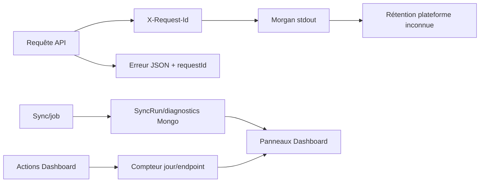

# 23 — Logs et monitoring

<!-- current-state-2026-07-13:start -->

## Mise à jour code courant — 13 juillet 2026

- Import, échec avant activation et rollback écrivent des logs structurés par préfixe trainer-pokemon.
- Les logs contiennent owner, snapshotId, count et préfixe de checksum, sans payload personnel.
- Aucun SDK d’alerte, TTL ou signal externe n’est ajouté.

<!-- current-state-2026-07-13:end -->

## 1. Objectif

Recenser qui journalise quoi, où, dans quel format, avec quelle corrélation, rétention, visibilité et capacité d'alerte.

## 2. Portée

Logs HTTP/process, scripts, SyncRuns, diagnostics current, Source Watch, métriques Dashboard, historiques métier, notifications UI et intégrations d'observabilité.

## 3. Méthode

Recherche des loggers/console, request IDs, collections historiques, métriques, alertes et SDK de monitoring. Les logs Vercel réels n'ont pas été consultés.

## 4. Résultats

### 4.1 Logs HTTP et process

- Express utilise Morgan: format `combined` en production, `dev` sinon, vers stdout.
- Un request ID reprend `x-request-id` fourni ou génère un UUID, puis renvoie `X-Request-Id`.
- Ce request ID figure dans chaque erreur JSON Express.
- Les erreurs 5xx sont écrites via `console.error(error)`; le log n'est pas structuré et Morgan n'est pas explicitement enrichi du request ID.
- Démarrage/arrêt du serveur utilisent `console.log`; crash de démarrage `console.error`.
- Dashboard Next n'a pas de middleware de request ID ni logger central détecté.

### 4.2 Pipelines et jobs

| Producteur | Stockage/format | Données |
|---|---|---|
| Sync statique | collection `syncruns` | statut, dates, durée, counts, changes, erreur |
| Current pipeline | Mongo current/snapshot diagnostics + console | source, hash, diff, compteurs, warnings, read-back |
| Sync watch | stdout texte + JSON counts | timestamp, résultat/erreur |
| Imports/migrations/audits | stdout JSON ou texte | rapport final, unmatched, erreurs |
| Events scraper | console info/warn | rapport global et détails échoués |
| Source Watch | `dashboard_store`, max 500 événements | signatures, changements, état sources |
| Shiny snapshots | collection privée | historique métier, pas log technique pur |

### 4.3 Dashboard metrics et historiques

- `dashboard_api_metrics` compte par owner/jour/endpoint/méthode.
- L'écriture est best-effort et avale les erreurs.
- Les analytics retournent total, série 14 jours et top 12 endpoints.
- Aucun statut HTTP, durée, taille, request ID ou erreur n'est enregistré.
- Backlog conserve un historique embedded créé/modifié.
- Learning conserve activité, imports et versions.
- Events a timestamps métier; Source Watch est plafonné à 500 éléments.

### 4.4 Monitoring et alertes

Surfaces existantes:

- `/health` API expose état DB, uptime et timestamp;
- Dashboard health proxy mesure durée et fournit liens docs;
- page Mongo affiche stats et usage;
- panneaux diagnostics current, logs & MAJ et Source Watch;
- toasts en session pour actions et anomalies;
- redéploiement/historique visible dans le Dashboard.

Aucun SDK Sentry, OpenTelemetry, Datadog, New Relic, Speed Insights, Web Analytics, drain structuré, webhook d'alerte, email/Slack/PagerDuty ou règle de seuil n'a été trouvé dans le code.

### 4.5 Rétention et corrélation

- `syncruns`, snapshots, activités et métriques n'ont pas de TTL déclaré.
- Source Watch est borné par nombre (500), Learning versions garde dix versions par topic par suppression applicative, imports 100 en lecture.
- Rétention stdout dépend de la plateforme: INFORMATION NON TROUVÉE.
- Corrélation solide uniquement dans les réponses Express; pas de propagation explicite vers Mongo/provider/Dashboard.
- Les jobs n'ont pas de `jobId` commun hors `_id` SyncRun et identités métier.

### 4.6 Console résiduelle

Les consoles de production sont peu nombreuses et intentionnelles: Morgan, pipeline, Events scraper, serveur. La majorité des `console.log` se trouve dans scripts CLI. Un `console.log` dans `personal-dashboard-defaults.ts` est un exemple de code affiché, pas exécuté. Deux catches vides existent dans le module custom-rules embarqué et une promesse Redoc ignore une erreur UI.

## 5. Tableaux

### Couverture par signal

| Signal | API Express | Dashboard | Pipelines |
|---|---|---|---|
| requêtes HTTP | Morgan | compteurs partiels | n/a |
| request ID | oui | non | non commun |
| durée | pas dans métrique métier | health seulement | SyncRun/current oui |
| statut/erreur | Morgan + 5xx stderr | UI/handler, non central | oui partiel |
| données structurées | réponse erreur | collections métier | SyncRun/diagnostics |
| alerte externe | non trouvée | non trouvée | non trouvée |
| rétention déclarée | non | partielle par nombre | pas de TTL |

## 6. Diagrammes Mermaid

## 7. Fichiers sources

- `PokemonGo-API-/src/app.js:23-69` — request ID, Morgan et rate limit.
- `PokemonGo-API-/src/middleware/request-id.js:1-9` — corrélation.
- `PokemonGo-API-/src/models/sync-run.js:3-22` — journal persistant.
- `PokemonGo-API-/src/sync/sync-service.js:187-227` — cycle job.
- `PokemonGo-API-/src/lib/current-dataset-pipeline.js:150-195` — diagnostics/read-back.
- `Dashboard Admin/src/lib/dashboard-store.ts:235-290` — métriques best-effort.
- `Dashboard Admin/src/app/api/pokemon-admin/route.ts:420-469` — Source Watch 500.

## 8. Incohérences

- Request ID présent dans l'erreur Express mais pas explicitement dans Morgan.
- Logs structurés JSON dans certains scripts, texte libre ailleurs.
- Métriques Dashboard comptent les appels mais pas succès, erreur ni latence.
- Diagnostics riches pour current, beaucoup moins pour routes Dashboard ordinaires.
- Historiques persistants sans politique uniforme de rétention.

## 9. Informations manquantes

- Destination/rétention des logs Vercel: INFORMATION NON TROUVÉE.
- Dashboards/alertes de production: INFORMATION NON TROUVÉE.
- SLO/SLI, seuils, astreinte et procédure incident: INFORMATION NON TROUVÉE.
- Traçage distribué Dashboard → API → Mongo/provider: absent/non trouvé.
- Budget de stockage des historiques: INFORMATION NON TROUVÉE.

## 10. Risques

| Sévérité | Risque |
|---|---|
| Élevée | aucune alerte externe sur panne, sync failed ou dataset vide |
| Élevée | pas de corrélation Dashboard → API → job/provider |
| Élevée | rétention non bornée de plusieurs collections historiques |
| Moyenne | métriques silencieusement perdues et trop peu dimensionnées |
| Moyenne | logs non structurés compliquant recherche/agrégation |
| Moyenne | request ID potentiellement fourni par client sans normalisation/longueur |

## 11. Mapping documentaire

Source pour `LOG`, `OBSERVABILITY`, `RUNBOOK`, `SYNC`, `API`, `MONGO`, `SEC-ACCESS-LOG` et politique de rétention.

## 12. État de progression

Phase 20b terminée. Des journaux métier utiles existent, mais le monitoring opérationnel reste local et passif: sans alertes, traçage distribué ni rétention formalisée.
