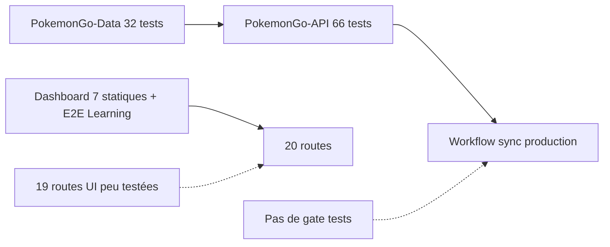

# 24 — Stratégie de tests

<!-- current-state-2026-07-13:start -->

## Mise à jour code courant — 13 juillet 2026

- Le total déclaré passe à 118 tests node:test: 66 API, 32 Data, 7 Dashboard structure et 13 trainer-pokemon.
- La suite trainer simule import initial, remplacement, échecs d’écriture/read-back, erreur après bascule, rollback valide et rollback refusé.
- Le test du fichier réel de 4 838 entrées s’exécute uniquement lorsque le fichier local attendu existe.

<!-- current-state-2026-07-13:end -->

## 1. Objectif

Cartographier les tests unitaires, intégration, API, providers, datasets, UI, E2E, responsive, accessibilité, performance et build, puis identifier leur exécution réelle et les trous critiques.

## 2. Portée

Tests actifs des cinq dépôts. Les copies `.data`, `.vercel`, backups et archives ont été exclues pour éviter de compter des snapshots clonés comme suites indépendantes.

## 3. Méthode

Inventaire statique des fichiers, déclarations `node:test`, scénarios Playwright, fixtures, scripts package et workflows. Les suites n'ont pas été exécutées: `pretest`/`prebuild` peuvent synchroniser `.data` et donc écrire hors du dossier d'audit.

## 4. Résultats

### 4.1 Vue d'ensemble

| Projet | Fichiers actifs | Scénarios déclarés | Framework | Commande |
|---|---:|---:|---|---|
| Dashboard Admin | 2 + 1 script responsive | 7 node:test + 1 grand scénario E2E | node:test, assert, Playwright | scripts séparés |
| PokemonGo-API- | 10 | 66 tests | node:test, Supertest, mocks manuels | `npm test` |
| PokemonGo-Data | 4 | 32 tests | node:test, fixtures HTML | 3 commandes séparées |
| Landing Page | 0 | 0 | aucun | aucune |
| Assets API | 0 | 0 | aucun package/test | aucune |

Total explicite: 105 tests `node:test`, plus le scénario E2E Learning séquentiel et le script responsive non branché à package.json.

### 4.2 PokemonGo-API

Couverture forte:

- routes racine/v1/docs/Swagger/health/404;
- sécurité read-only et secret Shiny;
- checklist publique et actions internes;
- normalisation données, formes, assets, catalogues;
- cache current et invalidation;
- contrat des sept adapters current;
- hash/diff/idempotence;
- modèles current et snapshots;
- import, compression, corruption hash/count et read-back;
- indisponibilité Mongo sans fallback.

Techniques: Supertest pour HTTP, stubs de modèles/Mongoose et fixtures locales. Les tests sont rapides et déterministes en majorité, mais ne couvrent pas les 156 routes une par une ni une vraie instance MongoDB.

### 4.3 PokemonGo-Data

- 11 tests raids détaillés: fuseaux, manifeste, rotations, événements, catégories inconnues, formes exactes et Content-Type.
- 7 tests générateurs Eggs/Max/Research/Rocket et garde dataset vide.
- 7 tests refactor/schema/assets/déduplication.
- 7 tests ranked: Shiny, PvP, visibilité, alias, GameMaster et résultat vide.
- Fixtures HTML raids régulières/événementielles et fixtures providers sous `scripts/fixtures`.

Les providers réels ne sont pas contactés dans la suite déterministe. Les générateurs Shiny/PvP ont tests de normalisation, mais la dérive HTML de toutes les sources n'est couverte que partiellement.

### 4.4 Dashboard Admin

`test-admin-pokemon-refactor.mjs` contient sept tests de structure source: navigation, accordéons, Background, Shiny, PvP, Explorer et secret serveur. Ces tests vérifient des regex sur fichiers; ils détectent certaines régressions architecturales mais pas le comportement rendu.

`test-learning-flow.mjs` est un E2E complet:

- démarre Next dev sur port dédié;
- crée une base Mongo temporaire horodatée;
- se connecte, importe un topic, vérifie UI/API/persistance;
- teste progression, correction, réponse, XP idempotente, activité, achievement;
- teste clavier/Escape, viewport mobile 390 px, merge et rollback;
- supprime la base en finally.

Le script responsive couvre seulement accueil, docs et admin Pokémon aux viewports 1440, 834 et 390, plus un thème clair. Il collecte overflow/console/screenshots dans `/tmp`, mais n'est exposé par aucun script package.

### 4.5 CI et build

- `PokemonGo-API- npm run check` inclut ensure-data, dry sync, tests et build.
- Le workflow GitHub `sync-mongodb.yml` exécute seulement `npm ci` puis `npm run sync`; ni tests ni build avant écriture production.
- `Dashboard Admin npm run check` exécute lint + build, pas ses tests ni `typecheck` explicitement.
- Aucun workflow GitHub Dashboard/Landing détecté.
- Le workflow Data ne teste rien avant de dispatcher la sync API.
- PokemonGo-Data n'a pas de commande `test` agrégée.

### 4.6 Couverture manquante par domaine

| Domaine | État | Trou critique |
|---|---|---|
| Unitaires métier API | bon | routes secondaires non systématiques |
| Intégration Mongo API | simulée | pas de vraie DB/transactions/indexes |
| Providers | fixtures ciblées | dérive de toutes les sources/licences |
| Datasets/schema | bon côté Data | couverture des 19 datasets non uniformisée |
| Dashboard API | faible hors Learning | auth/origin/CRUD backlog/events/store |
| UI Dashboard | un E2E Learning | 19 autres routes non parcourues |
| UI site API | absente | checklist/assets/modal/navigation |
| E2E public/private | partiel | matrice complète route/auth non automatisée |
| Responsive | script partiel | non CI, pages limitées |
| Accessibilité | absente | axe, clavier modales, contrastes |
| Performance | absente | budgets bundle/Web Vitals/API |
| Visuel | screenshots manuels script | pas de baseline/diff |
| Landing/Assets repo | absent | build/smoke/liens/assets |

## 5. Tableaux

### Fixtures et mocks

| Type | Présence |
|---|---|
| HTML raids | 2 fixtures actives |
| Fixtures generators/providers | dossier Data `scripts/fixtures` |
| Mocks Mongoose/models | dans tests API current/cache |
| Supertest | routes API sans serveur réseau |
| Mongo réel temporaire | E2E Learning seulement |
| Snapshot testing UI | absent |
| Mocks browser/API UI | absents |

### Criticité des tests manquants

| Priorité | Test à ajouter |
|---|---|
| P0 | matrice automatisée des 156 routes: méthode/auth/visibilité, surtout Shiny |
| P0 | tests auth/session/origin sur les 34 handlers Dashboard |
| P0 | gate tests avant `sync-mongodb` production |
| P1 | axe + clavier/focus de chaque modal/drawer |
| P1 | E2E checklist/assets et Admin current mutations |
| P1 | providers contract tests avec fixtures par source |
| P1 | intégration Mongo réelle pour indexes/read-back/rétention |
| P2 | budgets bundle, payload, Web Vitals et visuel multi-theme |

## 6. Diagrammes Mermaid

## 7. Fichiers sources

- `PokemonGo-API-/test/*.test.js` — 10 fichiers, 66 tests.
- `PokemonGo-Data/test/current-raids.test.js` — 11 tests raids.
- `PokemonGo-Data/scripts/test-*.js` — 21 tests.
- `Dashboard Admin/scripts/test-admin-pokemon-refactor.mjs` — 7 tests regex.
- `Dashboard Admin/scripts/test-learning-flow.mjs` — E2E Mongo/Playwright.
- `Dashboard Admin/scripts/verify-responsive.js` — 3 viewports.
- `PokemonGo-API-/.github/workflows/sync-mongodb.yml` — pas de tests.

## 8. Incohérences

- Tests Dashboard existent mais ne font pas partie de `check`.
- Playwright est installé sans config ni commande standard `test:e2e`.
- Responsive script lit directement `.env.local` et dépend d'un serveur externe sur 3020.
- API possède un `check` complet mais son workflow de sync ne l'utilise pas.
- Data fragmente trois suites sans agrégateur.
- Les tests structurels regex peuvent passer malgré un comportement cassé.

## 9. Informations manquantes

- Derniers résultats et durée des tests: INFORMATION NON TROUVÉE.
- Pourcentage de couverture: aucun outil/rapport trouvé.
- Flakiness E2E/providers: INFORMATION NON TROUVÉE.
- Politique de tests obligatoire avant merge: INFORMATION NON TROUVÉE.
- Navigateurs supportés: pas de config Playwright multi-projets.

## 10. Risques

Le risque principal est opérationnel: la sync Mongo production peut s'exécuter sans gate de tests. Le Dashboard a un E2E Learning riche mais une couverture très déséquilibrée; les frontières sécurité et les nombreuses modales ne sont pas testées automatiquement.

## 11. Mapping documentaire

Source pour `TEST-STRATEGY`, `TEST-API`, `TEST-DATA`, `TEST-E2E`, `TEST-A11Y`, `TEST-PERF`, `CI` et critères de qualité release.

## 12. État de progression

Phase 21 terminée en code-only. Les 98 tests API/Data protègent bien le cœur dataset; la priorité est d'en faire une gate de sync et d'étendre Dashboard sécurité/UI/a11y.
