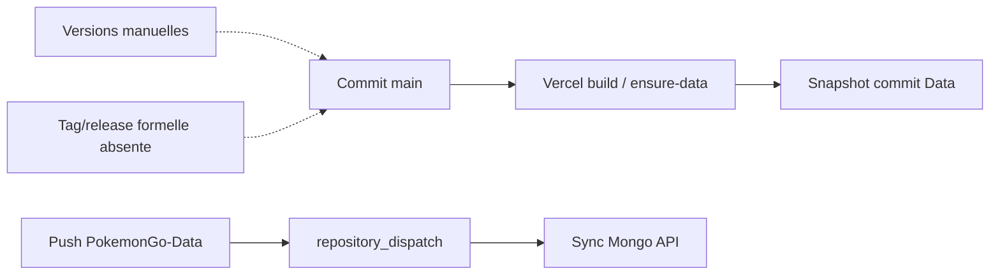

# 25 — Versioning et release

<!-- current-state-2026-07-13:start -->

## Mise à jour code courant — 13 juillet 2026

- Dashboard package.json, app-version.ts, dashboard-version-history.ts et CHANGELOG.md sont alignés sur 1.21.0/V1.21.0.
- Le changelog 1.21.0 décrit PAGE-049, le stockage snapshot, les quatre routes privées et la documentation post-audit.
- Aucun tag Git local ni outil automatique de release n’est ajouté.

<!-- current-state-2026-07-13:end -->

## 1. Objectif

Décrire le processus réel de version, publication, historique, schéma, snapshot, archive et rollback, puis mesurer les divergences entre marqueurs.

## 2. Portée

Les cinq dépôts, versions package/UI/OpenAPI, changelogs, tags locaux, branches, versions de schéma et mécanismes de retour arrière.

## 3. Méthode

Lecture des manifests, constantes, historiques et code; inspection Git locale des tags, branches et derniers commits. Aucune release distante ni déploiement n'a été modifié.

## 4. Résultats

### 4.1 Versions actuelles déclarées

| Projet | Package | UI/API visible | Changelog dernier | Tags locaux |
|---|---:|---|---:|---:|
| Dashboard Admin | 1.20.0 | `V1.20.0` | 1.19.0 | 0 |
| PokemonGo-API- | 1.7.0 | racine `v1`; OpenAPI `1.4.1` | 1.6.1 | 0 |
| PokemonGo-Data | 1.8.0 | aucune UI | 1.7.0 | 0 |
| Landing Page | 1.0.0 | non trouvée | aucun | 0 |
| Assets API | aucun package | aucune | aucun | 0 |

Les versions package Dashboard, constante UI et première entrée de l'historique embarqué sont alignées. Les changelogs des trois projets actifs ont chacun une version de retard sur leur package. L'OpenAPI API est particulièrement en retard (1.4.1 vs package 1.7.0).

### 4.2 SemVer réel

Les trois projets principaux utilisent visiblement SemVer dans `package.json` et changelog, avec major 1, mineures fonctionnelles et patches correctifs. Aucun script de release, Changesets, semantic-release, standard-version ou convention automatisée n'a été trouvé. Les versions semblent incrémentées manuellement dans plusieurs fichiers.

### 4.3 Historique et tags

- Aucun tag Git local dans les cinq dépôts.
- Les changelogs sont manuels et partiels.
- Dashboard embarque un historique UI très détaillé de V1.0.0 à V1.20.0.
- Les commits emploient des préfixes conventionnels dans l’historique recensé (`feat`, `docs`) mais aucune règle/enforcement n'est trouvée.
- Dashboard/API/Data/Assets sont sur `main`; Landing est sur `develop`, fait important pour le déploiement effectif.
- Aucune GitHub Release ou artefact de release n'est déductible de l'état local.

### 4.4 Versions de données et schémas

| Concept | Implémentation réelle |
|---|---|
| Learning schemaVersion | entier 1, validé par Zod literal |
| Learning migration | snapshot legacy `snapshotVersion:1` |
| Shiny/PvP schemaVersion | 2 dans les générateurs |
| Current compressé | reprend `data.meta.schemaVersion` ou 1 |
| Static Pokémon schema | JSON Schema sans version embarquée uniforme |
| Mongo Mongoose versionKey | désactivé sur les modèles observés |
| Dataset current | `generatedAt`, `savedAt`, `sourceHash`, diagnostics; pas de datasetVersion global |
| Source version | commit/tree SHA pour snapshot Data; ETag/Last-Modified/commit dans Source Watch |
| Provider version | pas de champ commun; versions parfois dans User-Agent |
| API version | chemin `/api/v1`, indépendant de SemVer package |

Il n'existe pas de contrat global `datasetVersion`, `providerVersion` ou `sourceVersion` partagé par les 19 datasets.

### 4.5 Processus de release observé

1. Modification et commit dans chaque dépôt.
2. Incrément manuel du package/changelog/constante selon projet.
3. Push `main` déclenchant Vercel implicitement pour les apps (configuration locale `.vercel`) ou GitHub Action pour la sync Data → API.
4. `prebuild` récupère le dépôt Data dans `.data` et écrit un snapshot de commit.
5. Le Dashboard peut déclencher un hook Vercel et afficher l'écart entre snapshot Data et dépôt distant.

Aucun fichier ne prouve un gate, tag, release GitHub, promotion preview → production ou génération automatique de notes.

### 4.6 Rollback et archives

- Git permet un revert manuel, mais aucun script produit ne l'encapsule.
- Vercel conserve probablement des déploiements, mais aucun workflow de rollback/promotion n'est codé.
- Learning a un rollback applicatif validé, avec versions Mongo et conservation de la progression.
- Shiny possède snapshots historiques; l'API sait lire l'historique mais ne fournit pas un rollback current explicite.
- `sync-shiny-release-data` archive les fichiers modifiés avant écriture sous `archive JSON/<timestamp>`.
- Current pipelines font read-back et diff, mais pas de restauration automatique de la version précédente.
- Sync statique écrit plusieurs collections en parallèle sans transaction globale; SyncRun décrit l'échec mais n'annule pas nécessairement les collections déjà écrites.
- Backups locaux du workspace existent hors dépôts, sans politique de restauration documentée.

## 5. Tableaux

### Divergences prioritaires

| Sévérité | Divergence |
|---|---|
| Élevée | OpenAPI 1.4.1 vs API package 1.7.0 |
| Élevée | zéro tag: impossible d'identifier formellement les releases |
| Moyenne | changelogs Dashboard/API/Data en retard d'une version |
| Moyenne | version API `v1` confondable avec SemVer 1.x |
| Moyenne | absence de version globale des datasets/providers |
| Moyenne | Assets et Landing sans historique release |

## 6. Diagrammes Mermaid

## 7. Fichiers sources

- `Dashboard Admin/package.json` et `src/data/app-version.ts:1`.
- `Dashboard Admin/src/data/dashboard-version-history.ts:9-425`.
- `Dashboard Admin/CHANGELOG.md`.
- `PokemonGo-API-/package.json`, `CHANGELOG.md` et `src/docs/openapi.js:300`.
- `PokemonGo-Data/package.json`, `CHANGELOG.md`.
- `PokemonGo-Data/scripts/generateShinyTracker.js:156`.
- `PokemonGo-Data/scripts/generatePvpRankings.js:231`.
- `Dashboard Admin/src/lib/learning/schema.ts:179-214`.

## 8. Incohérences

- Quatre marqueurs API distincts: package 1.7.0, changelog 1.6.1, OpenAPI 1.4.1, route v1.
- Dashboard maintient changelog et historique UI en parallèle; seul l'historique UI contient 1.20.0.
- Package versions avancent sans tags.
- Le champ Mongoose `versionKey` est désactivé, tandis que le versioning métier dépend de timestamps/hash/snapshots.
- Les versions provider dans User-Agent ne sont pas reliées aux versions de dataset.

## 9. Informations manquantes

- Releases GitHub distantes: NON VÉRIFIÉES; aucun tag local.
- Politique SemVer écrite: INFORMATION NON TROUVÉE.
- Responsable/approbation de release: INFORMATION NON TROUVÉE.
- Procédure de rollback Vercel/Atlas: INFORMATION NON TROUVÉE.
- Compatibilité/migrations entre versions de datasets: partielle seulement.

## 10. Risques

| Sévérité | Risque |
|---|---|
| Élevée | consommateurs OpenAPI ne savent pas quelle version décrit le runtime |
| Élevée | sync partielle sans rollback transactionnel |
| Élevée | absence de tag rend audit/reproduction d'une release fragile |
| Moyenne | incrément manuel multi-fichiers dérive régulièrement |
| Moyenne | schémas statiques sans version embarquée uniforme |
| Moyenne | rollback current autre que Shiny/Learning non formalisé |

## 11. Mapping documentaire

Source pour `VERSION`, `RELEASE`, `CHANGELOG`, `DATASET-VERSION`, `SCHEMA`, `PROVIDER`, `ROLLBACK`, `ADR` et runbooks.

## 12. État de progression

Phase 22 terminée. Le SemVer est utilisé mais non industrialisé; la correction prioritaire est d'unifier les marqueurs, taguer les releases et définir rollback/version de données.
