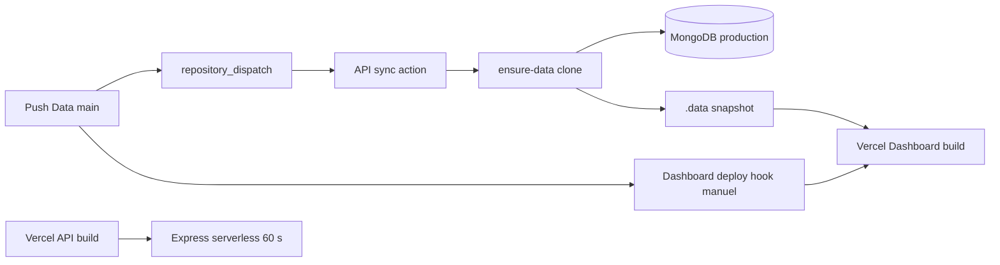

# 26 — Déploiement et CI

<!-- current-state-2026-07-13:start -->

## Mise à jour code courant — 13 juillet 2026

- La fonctionnalité ajoute quatre fonctions App Router au déploiement Dashboard existant.
- Aucune variable d’environnement nouvelle n’est requise; le code réutilise DASHBOARD_MONGODB_URI, MONGODB_URI, DASHBOARD_MONGODB_DB et POKEMON_API_PUBLIC_URL.
- Aucun workflow GitHub Dashboard n’est ajouté; test:trainer-pokemon reste une commande locale.

<!-- current-state-2026-07-13:end -->

## 1. Objectif

Documenter le déploiement réel, les builds, fonctions, environnements, secrets, synchronisations, CI, cron, monitoring et rollback à partir des fichiers locaux.

## 2. Portée

Dashboard, Landing, PokemonGo-API sur Vercel; Data et Assets sur GitHub; deux GitHub Actions; pipeline `.data`; hook de redéploiement Dashboard.

## 3. Méthode

Lecture des configurations et noms de variables uniquement. Les valeurs `.env` et les IDs de projet Vercel n'ont pas été reproduits. Aucun déploiement ni workflow n'a été déclenché.

## 4. Résultats

### 4.1 Cartographie des déploiements

| Projet | Cible observée | Build/runtime |
|---|---|---|
| Dashboard Admin | projet Vercel lié | Next build, fonctions App Router |
| Landing Page | projet Vercel lié | Next build, `npm install` explicite |
| PokemonGo-API- | projet Vercel lié | Next site + fonctions Node Express/checklist |
| PokemonGo-Data | GitHub + source de build/sync | pas d'app déployée |
| PokemonGo-Assets-API | GitHub/raw CDN de fait | pas de pipeline applicatif |

Dashboard/API/Data/Assets sont sur `main`; Landing localement sur `develop`. La branche production réellement configurée dans Vercel n'est pas contenue dans les fichiers projet.

### 4.2 PokemonGo-API sur Vercel

- `api/rest.js` encapsule Express et connecte Mongo avant chaque handler.
- `vercel.json` route `/api/v1`, docs, Swagger et health vers cette fonction.
- Fonction rest et checklist: durée maximale 60 s; blocked: 10 s.
- Des routes empêchent l'accès direct aux dossiers `data/config/docs/src/test/apps`.
- Next sert les pages publiques tandis que les fonctions CommonJS servent l'API.
- `.vercelignore` exclut env, logs, couverture, gros assets locaux et builds.

### 4.3 Pipeline `.data`

Dashboard et API ont un `prebuild` qui exécute `ensure-data`. Selon contexte, le script:

1. utilise un chemin explicite/local valide;
2. sinon clone en shallow le ref Data dans `.data/PokemonGo-Data`;
3. Dashboard écrit en plus un snapshot repo/ref/branch/commit/date;
4. les fonctions embarquent tout ou partie de `.data` via output tracing/includeFiles.

Risque critique à vérifier: le token GitHub est injecté dans l'URL HTTPS de clone. Git enregistre normalement cette URL comme remote dans `.data/PokemonGo-Data/.git/config`; les globs `./.data/PokemonGo-Data/**` et `{.data/PokemonGo-Data/**,…}` pourraient embarquer `.git` dans l'artefact serverless. L'inclusion effective des dotfiles n'a pas été vérifiée, mais la combinaison code/config impose de supprimer ce risque avant production.

### 4.4 GitHub Actions

#### Data → API

Un push `main` sur neuf familles statiques déclenche `dispatch-api-sync.yml`. Il appelle `repository_dispatch` sur PokemonGo-API. Les dossiers current sont volontairement exclus. Si le token manque, le workflow écrit un message puis sort avec succès (`exit 0`), donc la désynchronisation peut passer en vert.

#### API → MongoDB

`sync-mongodb.yml` se déclenche manuellement, par dispatch ou sur changements sync/models/packages de `main`. Il utilise Node 22, `npm ci`, timeout 15 min et concurrence non annulée, puis `npm run sync` avec Mongo/token. Ce job écrit la production MongoDB sans exécuter tests, dry-run ou build dans le workflow.

### 4.5 Dashboard et redéploiement

- Pas de workflow GitHub Dashboard détecté.
- `npm run check` = lint + build; tests et typecheck séparés.
- Une route privée peut appeler un Deploy Hook Vercel, limitée à 4 requêtes/10 min, avec same-origin/session.
- Le hook compare le snapshot commit Data au dépôt distant, stocke historique, déclenche seulement un rebuild Dashboard; il ne promeut ni ne rollback.
- Learning content peut être importé en Mongo sans redéploiement.

### 4.6 Landing et Assets

- Landing `vercel.json`: framework Next, build npm, install `npm install` plutôt que `npm ci`; versions transitoires peuvent évoluer dans les plages semver si le lock n'est pas strictement respecté par l'install.
- Son script lint `next lint` est incompatible avec les versions Next récentes à vérifier; aucun CI.
- Assets n'a ni package, validation, CI, publication versionnée ni vérification des liens Raw GitHub.

### 4.7 Environnements, secrets et previews

Les exemples déclarent les variables essentielles: auth/session, Mongo, URLs/secrets API, dépôt/ref/token Data, CORS, cache, rate limits, trust proxy et suppression stale. `.env`, `.env.*` et `.vercel` sont ignorés dans les projets principaux.

La distinction Preview/Production, scopes Vercel, rotation et ownership des secrets n'est pas codée. Aucun fichier ne prouve des checks de preview ou promotion contrôlée.

### 4.8 Cron, source maps, monitoring, rollback

- Aucun Vercel Cron ni schedule GitHub trouvé.
- `sync:watch` est un watcher local, pas une tâche planifiée de production.
- Aucune configuration explicite de source maps/Sentry upload.
- Health existe, sans alerte externe.
- Aucun workflow de rollback Vercel ou Mongo; rollback dépend des déploiements Vercel/Git manuels et des mécanismes métier décrits au rapport 25.

## 5. Tableaux

### Gates effectives

| Pipeline | Install | Lint | Tests | Build | Dry-run | Mutation prod |
|---|---|---|---|---|---|---|
| API workflow sync | npm ci | non | non | non | non | Mongo oui |
| Data dispatch | n/a | non | non | non | non | déclenche sync |
| Dashboard `check` local | existant | oui | non | oui | n/a | non |
| API `check` local | ensure-data | non explicite | oui | oui | oui | non attendu |
| Landing Vercel | npm install | non prouvé | non | oui | n/a | déploie |

### Variables par groupe

| Groupe | Noms principaux |
|---|---|
| Auth Dashboard | ADMIN_EMAIL, ADMIN_PASSWORD, SESSION_SECRET |
| Mongo | MONGODB_URI, DASHBOARD_MONGODB_URI, DASHBOARD_MONGODB_DB |
| API | POKEMON_API_PUBLIC_URL, POKEMON_API_ADMIN_SECRET, API_PUBLIC_URL, API_ADMIN_SECRET |
| Data | POKEMON_GO_DATA_DIR/REPO/REF/TOKEN |
| Runtime API | CORS_ORIGINS, RATE_LIMIT_*, CACHE_*, TRUST_PROXY, SYNC_DELETE_STALE |
| Déploiement | DASHBOARD_VERCEL_DEPLOY_HOOK_URL ou VERCEL_DEPLOY_HOOK_URL |

## 6. Diagrammes Mermaid

## 7. Fichiers sources

- `PokemonGo-API-/vercel.json` — fonctions/routes/includes.
- `PokemonGo-API-/api/rest.js` et `api/checklist-v3.js`.
- `PokemonGo-API-/.github/workflows/sync-mongodb.yml`.
- `PokemonGo-Data/.github/workflows/dispatch-api-sync.yml`.
- `Dashboard Admin/scripts/data/ensure-data.js`.
- `PokemonGo-API-/scripts/data/ensure-data.js`.
- `Dashboard Admin/src/app/api/dashboard-redeploy/route.ts:285-377`.
- `Landing-Page-PogoApi/vercel.json`.

## 8. Incohérences

- Le workflow le plus destructif ne réutilise pas `npm run check`.
- Token dispatch absent produit un succès vert.
- `npm ci` en Action API mais `npm install` en Landing Vercel.
- Documentation affirme main → production, mais Landing locale est sur develop.
- `.data` est ignoré par Git mais volontairement embarqué dans les fonctions.
- Deux systèmes de déploiement Data: dispatch Mongo automatique et rebuild Dashboard manuel.

## 9. Informations manquantes

- Domaines, branches production, régions et paramètres Vercel: INFORMATION NON TROUVÉE dans le code.
- Scopes Preview/Production des variables: INFORMATION NON TROUVÉE.
- Protection des environnements/approvals GitHub: non déclarée.
- Rétention/rollback Vercel et backups Atlas: INFORMATION NON TROUVÉE.
- Contenu final exact des bundles et présence de `.git/config`: NON VÉRIFIÉE.
- Source maps réellement publiées: INFORMATION NON TROUVÉE.

## 10. Risques

| Sévérité | Risque | Action |
|---|---|---|
| Critique | token GitHub potentiellement conservé dans `.git/config` et inclus dans bundle `.data/**` | authentifier sans URL credentialisée, supprimer `.git`, exclure dotfiles et inspecter artefact |
| Critique | sync Mongo production sans tests/dry-run | ajouter job validate/test/dry-run obligatoire |
| Élevée | dispatch sans token réussit silencieusement | échouer le workflow ou alerter explicitement |
| Élevée | aucun rollback/approval environnement | protéger production et documenter rollback |
| Élevée | aucun CI Dashboard/Landing/Assets | ajouter lint/typecheck/test/build/smoke |
| Moyenne | pas de cron/monitoring de fraîcheur | monitorer datasets et health |
| Moyenne | install Landing non déterministe | utiliser `npm ci` |

## 11. Mapping documentaire

Source pour `DEPLOY`, `CI`, `ENV`, `SECRETS`, `BUILD`, `DATA-SYNC`, `RUNBOOK`, `ROLLBACK` et `SEC-SUPPLY-CHAIN`.

## 12. État de progression

Phase 23 terminée. Deux urgences ressortent: sécuriser le clone `.data` credentialisé et mettre une gate de validation avant toute sync Mongo production.
