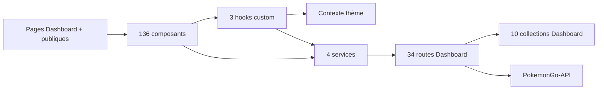
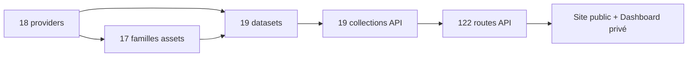
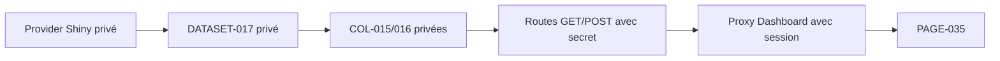

# 27 — Cartographie des dépendances globales

<!-- current-state-2026-07-13:start -->

## Mise à jour code courant — 13 juillet 2026

- Le graphe courant contient 890 arêtes après ajout des relations PAGE-049, COMP-137, SERVICE-005, API-157 à API-160, DATASET-020 et COL-030 à COL-032.
- Les relations couvrent rendu, appels service/API, lectures/écritures dataset et matérialisation MongoDB.
- La chaîne complète est [PAGE-049](<../Dashboard Admin/docs/codex/Post-audit 2026-07-13/PAGE-049-ma-collection-pokemon-go.md>) → [COMP-137](<../Dashboard Admin/docs/codex/Post-audit 2026-07-13/COMP-137-trainer-pokemon-collection-panel.md>) → SERVICE-005 → routes privées → [DATASET-020](<../Dashboard Admin/docs/codex/Post-audit 2026-07-13/DATASET-020-collection-personnelle-pokemon-go.md>) → collections privées.

<!-- current-state-2026-07-13:end -->

## 1. Objectif

Relier Pages → Components → Hooks → Contexts → Services → API Routes → MongoDB Collections → Providers → Datasets → Assets avec source, cible, type, fichier, criticité et visibilité.

## 2. Portée

48 pages/sections, 136 composants, 3 hooks custom, 1 contexte, 4 services, 156 routes, 29 collections, 18 providers, 19 datasets et 17 familles d'assets.

## 3. Méthode

Génération reproductible par `audit-documentation/generate-dependencies.mjs`: relations d'import/appel extraites des registres, puis mapping métier route/dataset/collection/provider/asset confirmé par les rapports précédents. Les composants inline utilisent des cibles synthétiques `INLINE-PAGE-*`; Events et le catalogue d'assets utilisent deux nœuds métier synthétiques car ils ne figurent pas parmi les 19 datasets normalisés.

## 4. Résultats

### 4.1 Registre

`registries/dependencies.json` contient **854 arêtes** et zéro relation API non résolue dans les sources déclarées.

| Type de relation | Nombre |
|---|---:|
| page rend composant/inline | 51 |
| composant importe composant | 205 |
| composant utilise hook | 4 |
| hook consomme contexte | 1 |
| composant/hook appelle service | 11 |
| page/composant/service appelle API | 31 |
| API lit dataset | 157 |
| API mute dataset | 28 |
| API lit collection | 151 |
| API écrit collection | 68 |
| dataset matérialisé en collection | 19 |
| page consomme dataset | 23 |
| provider produit/enrichit | 18 |
| dataset référence asset | 53 |
| provider fournit/publie asset | 34 |

### 4.2 Criticité

Les arêtes critiques sont les écritures API, matérialisations Mongo et productions provider → dataset. Les arêtes high couvrent lectures métier, appels réseau et assets; medium couvre composition page/hook; low couvre imports de présentation.

Le registre compte 133 relations critiques, 456 high, 45 medium et 220 low.

### 4.3 Hubs majeurs

- `DATASET-001` Pokémon principal et `COL-007 pokemons`: environ 65 routes/relations entrantes chacun.
- `DATASET-002` formes: 30 dépendances de routes smart/Pokémon.
- `DATASET-003` références assets: dépend des 17 familles d'assets et alimente les routes visuelles.
- `COMP-121 Card`: 27 importeurs; `COMP-119 Badge`: 22; `COMP-120 Button`: 21.
- `AdminApp` importe au moins sept dépendances enregistrées directes et agrège surtout les 23 panneaux via relations composant.
- `SERVICE-003 learning-api` porte sept appels API.
- `PROVIDER-012 PokeMiners` et `PROVIDER-018 Assets GitHub` touchent toutes les familles d'assets.

### 4.4 Matérialisation des datasets

19 relations de matérialisation couvrent 17 datasets ayant une collection directe ou multiple:

- Pokémon/forms partagent `pokemons`;
- générations/régions couvrent deux collections;
- Shiny couvre rankings + snapshots;
- current publics ont chacun leur collection;
- Source Watch est stocké dans `dashboard_store`.

Stickers et candy n'ont pas de collection dédiée: fichiers/valeurs dérivées seulement.

## 5. Tableaux

### Chaînes critiques représentatives

| Point d'entrée | Chaîne | Visibilité |
|---|---|---|
| PAGE-028 Raids | RaidsPanel → `/api/pokemon-admin` → API raids → DATASET-012 → COL-010 → PROVIDER-001 → assets | UI privée, données publiques, mutation privée |
| PAGE-035 Shiny | ShinyPanel → handler privé → routes Shiny secret → DATASET-017 → COL-015/016 → PROVIDER-006/007 | privée bout en bout |
| PAGE-014 Learning | JsProgress → HOOK-002 → SERVICE-003 → routes Learning → COL-024–029 | privée owner |
| Page API checklist | ChecklistApp → API-006 → DATASET-001–011 → collections/fichiers/assets | publique read-only |
| PAGE-034 Events | EventsPanel → public/admin Events → COL-023 → PROVIDER-009 | lecture publique, admin privé |

### Relations les plus sensibles

| Source | Cible | Pourquoi |
|---|---|---|
| routes mutation current | collections current | écritures production externes |
| providers HTML | datasets current | dérive de structure/licence |
| dataset Pokémon | collection pokemons | hub de presque toute l'API |
| Data assets refs | dépôt Assets/raw GitHub | liens croisés et disponibilité |
| services Dashboard | API privées | auth, owner, erreurs et no-store |

## 6. Diagrammes Mermaid

### Application Dashboard

### Données Pokémon

### Visibilité Shiny

## 7. Fichiers sources

- `audit-documentation/registries/dependencies.json` — 854 arêtes.
- `audit-documentation/generate-dependencies.mjs` — génération reproductible.
- Tous les autres registres JSON fournissent les nœuds et métadonnées.

## 8. Incohérences

- Les composants Dashboard utilisent des chemins relatifs `src/`, tandis que Landing/API sont préfixés projet; le générateur normalise les deux formes.
- Onze pages/sections sont inline et n'ont pas de `COMP-*` propre.
- Events n'est pas dans le registre des 19 datasets malgré une source/provider/collection dédiée.
- Le catalogue d'assets est un nœud logique, pas un dataset normalisé distinct.
- Les relations transverses Dashboard → PokemonGo-API passent par des proxys, donc une simple arête handler → collection ne représente pas toute la latence.

## 9. Informations manquantes

- Imports calculés dynamiquement à runtime: aucun trouvé, mais résolution exhaustive par bundler non exécutée.
- Dépendances conditionnelles selon environnement/provider: représentées au niveau famille, pas chaque branche.
- Cardinalités runtime et fréquence des arêtes: INFORMATION NON TROUVÉE.
- Graphe des packages npm: traité séparément comme dépendances externes, pas dupliqué dans les 854 arêtes produit.

## 10. Risques

| Sévérité | Risque |
|---|---|
| Critique | `COL-007`/DATASET-001 est un point de concentration majeur |
| Critique | chaîne provider → mutation → Mongo sans gate CI |
| Élevée | composants UI communs très centraux, régression large possible |
| Élevée | assets dépendent de Raw GitHub/PokeMiners et de mappings cross-repo |
| Élevée | chaîne Shiny doit rester privée à chaque couche |
| Moyenne | nœuds inline/synthétiques compliquent la traçabilité documentaire |

## 11. Mapping documentaire

Le registre est la base de tous les futurs documents `PAGE`, `COMPONENT`, `HOOK`, `SERVICE`, `API`, `MONGO`, `PROVIDER`, `DATASET`, `ASSET`, `PUBLIC-PRIVATE` et `ADR`.

## 12. État de progression

Phase 24 terminée. Le graphe inter-couches est généré, validé JSON et reproductible; il rend visibles les hubs Pokémon, UI commune, providers/assets et la chaîne privée Shiny.
