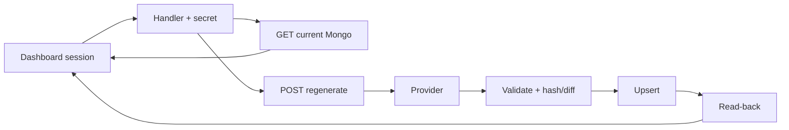
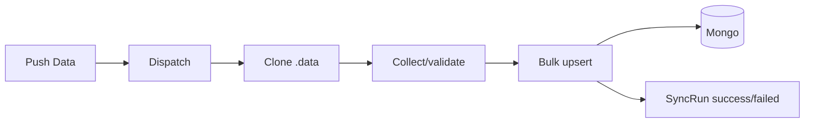
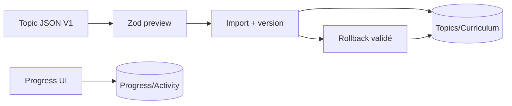

# 28 — Workflows applicatifs et opérationnels

<!-- current-state-2026-07-13:start -->

## Mise à jour code courant — 13 juillet 2026

- Le registre documentaire contient désormais [WORKFLOW-016](<../Dashboard Admin/docs/codex/Post-audit 2026-07-13/WORKFLOW-016-import-collection-pokemon-go.md>); le total passe à 16 workflows.
- Preview n’écrit rien; commit écrit staging et entries, vérifie volume et checksum des identifiants, puis bascule activeSnapshotId.
- Rollback répète la vérification de propriétaire et de volume avant activation.

<!-- current-state-2026-07-13:end -->

## 1. Objectif

Décrire les parcours réels de lecture, écriture, génération, validation, cache, import/export, rollback, archive, sync et déploiement avec leurs entrées, sorties, échecs, logs et dépendances.

## 2. Portée

Quinze workflows couvrant le navigateur, Dashboard, API, MongoDB, providers, Data, Assets, GitHub Actions et Vercel.

## 3. Méthode

Consolidation des pipelines et du graphe de dépendances. Aucun workflow mutable n'a été exécuté. Les étapes souhaitées uniquement documentaires sont exclues du processus « réel ».

## 4. Résultats

### WF-001 — Session Dashboard

Entrée: formulaire email/mot de passe + `next`. Étapes: rate limit → same-origin → validation env → chemin interne sûr → HMAC → cookie. Sortie: redirect 303 et session 14 jours. Échec: redirect login error. Rollback: logout supprime cookie. Log: aucun accès structuré Dashboard.

### WF-002 — Lecture API publique

Entrée: GET `/api/v1/*`. Étapes: request ID → headers/CORS/compression/rate limit → read-only → cache sauf current → route → Mongo/fichier → présentation. Sortie JSON publique. Échec: format ApiError avec requestId. Cache: 60 s statique, no-store current. Collection/dataset selon registre.

### WF-003 — Lecture privée Shiny

Entrée: GET Shiny avec secret serveur. Étapes: comparaison timing-safe → lecture `shiny_rankings`/snapshots → filtres/historique → no-store. Consommateur: proxy Dashboard session. Échec 401/403/503. Aucun accès public/OpenAPI.

### WF-004 — Lecture/écriture état Dashboard

Entrée: composants/hooks persistent state. Étapes: session → API store → owner email → upsert Mongo; fallback localStorage/default si non configuré ou lecture impossible selon service. Sortie état UI. Échec converti dans les services recensés en false/null. Rollback: valeur précédente non versionnée; localStorage manuel.

### WF-005 — Régénération current

Entrée: POST admin `regenerate` via Dashboard. Étapes: session/same-origin → secret API → provider/générateur → parse → normalise/enrichit → valide non vide → hash/diff → upsert current → snapshot Shiny éventuel → invalide cache → read-back hash/count → diagnostics. Sortie document Mongo confirmé. Échec pré-upsert conserve ancien; échec post-upsert sans rollback automatique.

### WF-006 — Import current maintenance

Entrée: POST `import` + payload explicite rootKey. Le disque n'est jamais fallback. Étapes identiques depuis validation/hash. Sortie current/import report. Échec payload absent/invalide. Rollback: non. Logs: diagnostics/console.

### WF-007 — Sync statique Data → Mongo

Entrée: `npm run sync`, déclenché manuellement/dispatch/push sync. Étapes: ensure-data → collect → stats → SyncRun running → syncIndexes → bulk upserts parallèles → stale delete optionnel → nettoyage heavy assets → GlobalStat → cache clear → SyncRun success. Échec: SyncRun failed; écritures déjà effectuées non annulées. Collections statiques + globalstats/syncruns.

### WF-008 — Dispatch GitHub Data → API

Entrée: push `main` sur familles statiques. Étapes: token → repository_dispatch → workflow API sous concurrency → npm ci → sync. Sortie Mongo actualisé. Échec token absent actuellement traité succès; timeout 15 min. Pas de gate tests/dry-run.

### WF-009 — Snapshot `.data` de build

Entrée: prebuild Dashboard/API. Étapes: source explicite ou clone shallow Data → validation `hasDataShape` → snapshot commit Dashboard → output tracing/includeFiles. Sortie `.data` embarqué. Échec: fallback repo voisin selon Dashboard, sinon build échoue. Rollback: reset/reclone. Risque token dans remote `.git/config`.

### WF-010 — Events public/admin

Entrées: GET public, CRUD/import/scrape admin. Étapes admin: session/origin → LeekDuck/ScrapedDuck → parse/enrichissement local → validation → upsert `events`. Sortie projection publique cache 60/300 ou vue admin. Mongo absent: seeds en lecture, 503 en mutation. Rollback: archive statut, pas version complète.

### WF-011 — Learning import/progression/rollback

Entrée: JSON schema V1 ou action de progression. Étapes: validation Zod → preview → stratégie import → version précédente → transaction logique collections → activité/progression → relecture. Rollback ciblé restaure contenu validé et préserve progression. Logs: learning_imports/activity/versions. E2E existant.

### WF-012 — Source Watch

Entrée: action privée Dashboard. Étapes: session → checks Git/HTTP → version ETag/commit/date → comparaison signatures → événements historique max 500 → UI/toasts. Sortie sources changed/blocked/unchanged. Échec partiel continué; alertes seulement en session.

### WF-013 — Redéploiement Dashboard

Entrée: bouton privé. Étapes: session/origin/rate limit → snapshot Data vs GitHub → POST Deploy Hook Vercel → enregistrement événement/history → Vercel prebuild `.data`. Sortie `requested`/`failed`. Rollback/promotion: absents du code.

### WF-014 — Assets et enrichissements

Entrée: scripts import/sync Assets/PokeMiners/PogoAPI/PokeAPI/Serebii/Bulbapedia. Étapes: download/mirror → matching identités → rapport dry-run → option `:write` explicite → commit Data/Assets → API sync/build. Sortie JSON références et fichiers assets. Archive/rollback selon script; pas de pipeline unique ni CI Assets.

### WF-015 — Export/téléchargement

Entrées: OpenAPI public, learning privé, datasets current/admin, corrections JSON. Étapes: sélection/projection → JSON → réponse ou Blob client. Visibilité contrôlée par route/page. Pas de chiffrement/signature ni registre central des exports. Shiny export reste dans UI privée après lecture secrète serveur.

## 5. Tableaux

### Matrice complète

| ID | Entrée | Validation | Sortie | Rollback | Logs/historique |
|---|---|---|---|---|---|
| WF-001 | credentials | env/origin/rate | cookie | logout | aucun central |
| WF-002 | GET public | params/models | JSON | n/a | Morgan/requestId |
| WF-003 | GET + secret | auth/params | Shiny | n/a | HTTP/diagnostics |
| WF-004 | état UI | owner/payload | Mongo/local | non | metrics partielles |
| WF-005 | regenerate | adapter/hash/read-back | current | non auto | diagnostics |
| WF-006 | payload import | rootKey/adapter | current | non | report |
| WF-007 | Data repo | schemas/indexes | collections | non global | SyncRun |
| WF-008 | push | path/token | dispatch/sync | non | Actions |
| WF-009 | prebuild | shape | `.data` | reclone | build snapshot |
| WF-010 | scrape/CRUD | auth/schema | events | archive partiel | Mongo/toasts |
| WF-011 | JSON/progress | Zod/références | learning | oui ciblé | 4 collections logs |
| WF-012 | sources | status/version | watch state | n/a | max 500 |
| WF-013 | deploy hook | auth/diff | rebuild | non | deploy history |
| WF-014 | providers assets | dry reports/matching | Data/assets | variable | rapports fichiers |
| WF-015 | action export | auth/projection | JSON | n/a | non central |

### Tâches planifiées

Aucun cron production n'est déclaré. Les workflows sont déclenchés par push, dispatch ou action manuelle; `sync:watch` est local. La fraîcheur des datasets current dépend donc d'une action admin/externe non planifiée dans le code audité.

## 6. Diagrammes Mermaid

### Lecture et mutation current

### Sync statique

### Learning

## 7. Fichiers sources

- `PokemonGo-API-/src/lib/current-dataset-pipeline.js`.
- `PokemonGo-API-/src/sync/sync-service.js`.
- `PokemonGo-API-/.github/workflows/sync-mongodb.yml`.
- `PokemonGo-Data/.github/workflows/dispatch-api-sync.yml`.
- `Dashboard Admin/src/lib/learning/repository.ts`.
- `Dashboard Admin/src/lib/leekduck-events-scraper.ts`.
- `Dashboard Admin/src/app/api/dashboard-redeploy/route.ts`.
- `Dashboard Admin/scripts/data/ensure-data.js`.

## 8. Incohérences

- Read-back robuste current, absent du sync statique global.
- Rollback riche Learning, quasi absent current/static/Events.
- Events accepte seeds, current refuse tout fallback.
- Formal Provider seulement Shiny/PvP; cinq générateurs directs.
- Deux `ensure-data` et deux chemins Data → production.
- Pas de schedule commun de fraîcheur.

## 9. Informations manquantes

- Fréquence attendue de chaque current: INFORMATION NON TROUVÉE.
- Responsable opératoire et approbation des mutations: INFORMATION NON TROUVÉE.
- RPO/RTO, sauvegardes Atlas et procédure incident: INFORMATION NON TROUVÉE.
- Corrélation workflow end-to-end: absente.
- SLA providers et politique retry: partielle.

## 10. Risques

| Sévérité | Risque |
|---|---|
| Critique | sync statique partielle/suppression stale sans rollback |
| Critique | mutation production sans gate CI |
| Critique | possible secret Git dans artefact `.data` |
| Élevée | current post-upsert non transactionnel |
| Élevée | absence de planification/alerting fraîcheur |
| Élevée | workflows provider concurrents et non uniformes |
| Moyenne | exports et historiques sans registre/rétention communs |

## 11. Mapping documentaire

Source pour `WORKFLOW-001` à `WORKFLOW-015`, `RUNBOOK`, `ARCH`, `DATASET`, `PROVIDER`, `MONGO`, `DEPLOY`, `ROLLBACK`, `SEC` et ADR.

## 12. État de progression

Rapport transverse terminé. Les quinze workflows réels sont documentés; aucun n'a été exécuté par l'audit.
