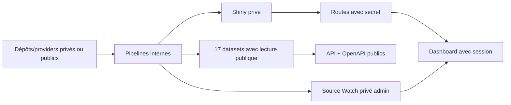

# 29 — Matrice public / privé

<!-- current-state-2026-07-13:start -->

## Mise à jour code courant — 13 juillet 2026

- L’état courant compte 160 routes: 92 publiques/techniques, 67 privées/admin et 1 interne bloquée.
- Les 20 datasets comprennent 17 sorties publiques et trois datasets privés: Shiny, Source Watch et collection du dresseur.
- Les 32 collections comprennent 16 exposées sélectivement, 15 privées et syncruns interne.

<!-- current-state-2026-07-13:end -->

## 1. Objectif

Établir la visibilité effective de chaque famille de routes, pages, datasets, collections, providers, imports, exports, journaux et outils de documentation. Les conclusions reposent sur les middlewares et handlers, jamais uniquement sur le nom.

## 2. Portée

156 routes enregistrées, 48 pages/sections, 19 datasets, 29 collections MongoDB et 18 providers actifs ou recensés. Les listes unitaires exhaustives et leurs preuves sont conservées dans les cinq registres JSON cités en sources.

## 3. Méthode

Croisement route → middleware/handler → dataset/collection → consommateur. Les catégories composites distinguent la confidentialité du dépôt source, des données exposées et de l'interface qui les consomme.

## 4. Résultats

### 4.1 Routes — matrice exhaustive par IDs

| Classe effective | Nombre | IDs / familles |
|---|---:|---|
| Publique GET | 89 | API-001–006, API-008–079 hors mutations, API-082, 085, 088, 091, 094, 097, 100, 103, 106, 117, 120 |
| Interne bloquée | 1 | API-007 `/api/blocked` |
| Mutation privée API | 28 | API-080–084, 086–090, 092–096, 098–102, 104–108, 111–112, 115–116, 118–119, 121–122 |
| Shiny privé lecture | 4 | API-109, 110, 113, 114 |
| Dashboard privé | 31 | API-123–136, 138–148, 150–155 |
| Entrées publiques Dashboard | 3 | API-137 events GET, API-149 logout POST, API-156 session POST |

La ligne publique inclut les GET montés sous `/api/v1/admin/{domaine}` pour les six datasets current publics: le préfixe `admin` ne les rend pas privés, car le routeur autorise effectivement ces lectures. À l'inverse, tous les endpoints Shiny GET exigent le secret, y compris sous le chemin non-admin.

Le détail endpoint par endpoint, méthode, fichier, ligne, auth et visibilité se trouve dans `registries/api-routes.json`; `14-api-registry.md` l'imprime sous forme tabulaire.

### 4.2 Datasets — 19/19

| Visibilité | IDs | Datasets |
|---|---|---|
| Source Git privée, exposition API publique | DATASET-001–007, 009–011 | Pokémon, forms, références assets, moves, types, weather, générations/régions, rocket texts, stickers, candies |
| Source privée, items publics sélectifs | DATASET-008 | Items et alias |
| Public current | DATASET-012–016, 018 | Raids, eggs, max battles, Rocket, Research, PvP rankings |
| Privé confirmé | DATASET-017 | **Shiny Tracker** current + historique |
| Privé admin | DATASET-019 | Source Watch catalog/historique |

Le Shiny Tracker est confirmé privé par quatre barrières concordantes: adapter `visibility: private`, collections dédiées privées, absence volontaire d'OpenAPI et `requireAdminSecret` sur les routes GET et POST.

### 4.3 MongoDB — 29/29

| Visibilité | IDs | Collections |
|---|---|---|
| Exposition publique sélective par routes | COL-001–014, 018–019 | eggs, generations, globalstats, items, maxbattles, moves, pokemons, pokemonAssets, pvp_rankings, raids, researches, regions, rockets, rocket_texts, types, weathers |
| Privée Shiny | COL-015–016 | shiny_rankings, shiny_snapshots |
| Interne opérationnelle | COL-017 | syncruns |
| Privée Dashboard | COL-020–029 | dashboard_store, métriques, backlog, events, learning et versions |

`events` est une collection privée dont une projection métier est publiée par API-137. La collection elle-même et les routes d'administration restent privées.

### 4.4 Pages — 48/48

| Classe | IDs | Interprétation |
|---|---|---|
| Entrée publique | PAGE-001 | login uniquement |
| Dashboard privé | PAGE-002–024, 027, 035–038, 040–041 | session obligatoire |
| Privé/local | PAGE-025, 039 | outils et état local dans interface privée |
| UI privée, assets publics | PAGE-026 | navigateur d'assets |
| UI privée, lecture dataset publique, mutation privée | PAGE-028–033 | six panneaux current |
| UI privée, lecture API événements publique | PAGE-034 | calendrier admin |
| Privé read-only/export | PAGE-042–043 | corrections et export |
| Pages publiques Landing/API | PAGE-044–048 | pages sans session; données API/assets publics |

Redoc et Swagger sont des routes Express HTML publiques (API-003/API-005), pas des fichiers App Router; les cinq fichiers de pages publiques sont PAGE-044–048.

### 4.5 Providers — 18/18

| Classe source | IDs | Usage |
|---|---|---|
| Source publiquement accessible | PROVIDER-001–005, 008 | génération de datasets current publics |
| Source privée | PROVIDER-006–007 | Shiny privé |
| Source publique, import privé | PROVIDER-009 | événements LeekDuck vers admin |
| Source publique de veille | PROVIDER-010 | ScrapedDuck |
| Génération interne | PROVIDER-011, 013 | game master et pages shiny release |
| Assets publics | PROVIDER-012, 018 | PokeMiners et dépôt assets |
| Imports internes | PROVIDER-014–017 | pogoapi, PokeAPI, Bulbapedia, Serebii |

La visibilité d'une URL provider n'implique pas automatiquement celle du dataset produit: LeekDuck Events est public en source mais son import et son stockage sont administratifs; Snacknap Shiny alimente un dataset privé.

### 4.6 Imports, exports, documentation et logs

| Surface | Visibilité effective | Preuve |
|---|---|---|
| OpenAPI JSON, Redoc, Swagger | Publique | API-003–005, sans session/secret |
| Routes Shiny dans OpenAPI | Absentes volontairement | commentaire routeur + génération OpenAPI |
| Mutations admin décrites dans OpenAPI | Métadonnées publiques, exécution privée | schéma security `x-api-admin-secret` |
| API Explorer Dashboard | Interface privée | page Dashboard + proxy avec session |
| Imports current API | Privés | POST + secret; payload explicite |
| Imports events/learning | Privés | session + same-origin |
| Export OpenAPI | Public | téléchargement `/api-docs.json` |
| Export learning/corrections | Privé | session Dashboard |
| Logs UI, historique source, sync/admin | Privés ou internes | Dashboard session / collections internes |
| Logs HTTP API | Internes plateforme/process | Morgan/stdout, non exposés par route |
| Métriques globales API | Publiques sélectives | endpoints stats, sans accès aux logs bruts |

## 5. Tableaux

### Résumé numérique

| Domaine | Public ou exposé sélectivement | Privé/admin | Interne/mixte |
|---|---:|---:|---:|
| Routes | 92 entrées publiques/techniques | 63 | 1 |
| Datasets | 17 avec sortie publique | 2 | sources privées pour les référentiels recensés |
| Collections | 16 exposées sélectivement | 12 | 1 |
| Pages/sections | 6 entrées publiques | 42 | plusieurs pages privées consomment des données publiques |
| Providers | 10 sources publiques/asset | 2 privés | 6 internes/mixtes |

## 6. Diagrammes Mermaid

## 7. Fichiers sources

- `audit-documentation/registries/api-routes.json` — 156 décisions route par route.
- `audit-documentation/registries/pages.json` — 48 pages/sections.
- `audit-documentation/registries/datasets.json` — 19 datasets.
- `audit-documentation/registries/mongodb-collections.json` — 29 collections.
- `audit-documentation/registries/providers.json` — 18 providers.
- `PokemonGo-API-/src/routes/index.js:88` — Shiny absent d'OpenAPI.
- `Dashboard Admin/src/proxy.ts` et handlers API — frontières Dashboard.

## 8. Incohérences

- Le segment `/admin` ne garantit pas la confidentialité des GET current.
- Des sources privées donnent des réponses API publiques: « privé » au niveau dépôt n'est pas « privé » au niveau produit.
- OpenAPI est public et révèle les formes des mutations privées, choix valide mais à documenter comme exposition de métadonnées.
- Le registre pages Dashboard n'inclut pas encore les pages marketing API sous des IDs PAGE; elles restent documentées dans les rapports routing/API.
- `events` combine collection admin privée et projection publique sous le même nom métier.

## 9. Informations manquantes

- ACL réelles des dépôts GitHub et buckets/CDN: INFORMATION NON TROUVÉE localement.
- Exposition réseau directe de MongoDB: INFORMATION NON TROUVÉE.
- Exports manuels hors application et partages de fichiers: INFORMATION NON TROUVÉE.
- Visibilité effective des logs Vercel selon les membres de l'équipe: INFORMATION NON TROUVÉE.

## 10. Risques

| Sévérité | Risque |
|---|---|
| Critique si régression | Une nouvelle route Shiny/current risque d’hériter du mauvais middleware; tester la visibilité explicitement |
| Élevée | Les préfixes `admin` et `protectedApiPaths` donnent une impression trompeuse de sécurité |
| Élevée | OpenAPI/Explorer peuvent diverger du routeur réel et masquer une exposition |
| Moyenne | Projection publique `events` doit exclure durablement tout champ administratif |
| Moyenne | La provenance/licence de plusieurs providers publics est non documentée |

## 11. Mapping documentaire

Cette matrice est la source de `PUBLIC-PRIVATE`, `SEC-AUTH`, `API`, `DATASET`, `MONGO`, `PROVIDER`, `IMPORT-EXPORT`, `LOGS` et des tests de non-régression d'accès.

## 12. État de progression

Phase 16 terminée en code-only. Le Shiny Tracker est privé de bout en bout dans le code actuel. Les catégories composites évitent de confondre source privée, interface privée et donnée publiquement exposée.
