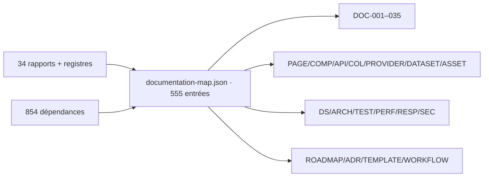

# 30 — Mapping documentaire

<!-- current-state-2026-07-13:start -->

## Mise à jour code courant — 13 juillet 2026

- documentation-map.json contient 567 entrées: 483 générables, 59 avec informations manquantes et 25 Foundation documentées dans l’état courant.
- Les nouvelles fiches spécialisées couvrent PAGE-049, COMP-137, API-157 à API-160, COL-030 à COL-032, DATASET-020 et WORKFLOW-016.
- DOC-011 à DOC-035 suivent maintenant les intitulés et fichiers Foundation réellement créés.

<!-- current-state-2026-07-13:end -->

## 1. Objectif

Transformer les inventaires normalisés en plan exact des futurs documents, avec ID, nom, sources d'audit, code, captures, statut et relations.

## 2. Portée

555 entrées documentaires: documents socle, pages, composants, hooks, contexte, services, providers, datasets, routes, collections, assets et familles transverses architecture/design/tests/performance/responsive/sécurité/roadmap/ADR/templates/workflows.

## 3. Méthode

Le générateur `audit-documentation/generate-documentation-map.mjs` lit les dix registres métier et les 854 dépendances, crée les fiches unitaires et rattache leurs voisins. Le JSON final est validé sans ID dupliqué.

## 4. Résultats

### 4.1 Volume

| Famille | Entrées |
|---|---:|
| DOC | 35 |
| PAGE | 48 |
| COMP | 136 |
| HOOK / CTX / SERVICE | 8 |
| PROVIDER | 18 |
| DATASET | 19 |
| API | 156 |
| COL / MONGO | 35 |
| ASSET | 17 |
| DS / ARCH | 20 |
| TEST / PERF / RESP / SEC | 29 |
| ROADMAP / ADR / TEMPLATE | 19 |
| WORKFLOW | 15 |
| **Total** | **555** |

498 entrées sont générables immédiatement depuis le code/audit. 57 sont marquées `informations-manquantes`: trois documents socle, quinze providers sans licence/provenance complète, les 29 collections sans preuve de rétention/TTL production, six documents Mongo opérationnels et quatre roadmaps nécessitant arbitrage.

### 4.2 DOC-001 à DOC-035

| Plage | Contenu |
|---|---|
| DOC-001–010 | règles, vision, objectifs, philosophie, repos, architecture, versions, changelog, roadmap, design system |
| DOC-011–017 | dossiers, routes/layouts, pages, composants, hooks/services, providers, datasets |
| DOC-018–024 | workflows, API, Mongo, assets, cache, sécurité, public/privé |
| DOC-025–031 | responsive, a11y, performance, erreurs, logs, tests, déploiement |
| DOC-032–035 | dépendances, runbooks, dette, index/gouvernance |

Les DOC-001 à DOC-010 existent déjà sous `Dashboard Admin/docs/codex/Tome 1 — Foundation (Fondations)`. Ils doivent être mis à jour/redlinés à partir de l'audit, pas remplacés aveuglément. DOC-011 à DOC-035 sont proposés comme suite cohérente.

### 4.3 Fiches unitaires

- PAGE-001–048: fichier source, capture 390/834/1440 et thèmes si pertinent.
- COMP-001–136: fichier, catégorie, états visuels, voisins du graphe; les 45 facades n'exigent pas de capture dans le mapping actuel.
- API-001–156: méthode/endpoint, code, auth, visibilité, collections/datasets liés.
- COL-001–029: schéma/indexes/code, sans capture de données réelles.
- PROVIDER/DATASET/ASSET: source, pipeline, sortie, visibilité et exemples anonymisés.

### 4.4 Documents transverses

- DS-001–010: fondations jusqu'à gouvernance tokens.
- ARCH-001–010: contexte, sous-systèmes, flux, Mongo, build, observabilité, sécurité.
- TEST-001–010, PERF-001–005, RESP-001–006, SEC-001–008.
- ADR-001–010 pour les décisions déjà observables: vérités statique/current, Mongo-only, Shiny privé, HMAC, proxies, provider contract, hash/read-back, fallback Events, Learning, assets.
- TEMPLATE-001–005 normalisent page, composant, API, dataset/provider et runbook/ADR.
- WORKFLOW-001–015 reprennent exactement le rapport 28.

## 5. Tableaux

### Priorité de génération

| Vague | Documents | Motif |
|---|---|---|
| 1 | DOC-001, 005, 006, 017–024, 031–035 | règles, architecture, données, sécurité, opérations |
| 2 | API/COL/PROVIDER/DATASET/WORKFLOW | contrats et exploitation |
| 3 | PAGE/COMP/DS/RESP/A11Y | produit et design system |
| 4 | TEST/PERF/ROADMAP/ADR/TEMPLATE | gouvernance et amélioration continue |

### Captures déjà présentes

`docs/design-audit` contient sept captures identifiées: logging, trois Home, menu fermé, historique versions, palette et compte. Elles constituent un point de départ, mais leur date/viewport/thème n'est pas encodé de façon normalisée et elles ne couvrent pas les 48 pages/sections.

### Statuts

| Statut | Nombre | Interprétation |
|---|---:|---|
| `generable-immediatement` | 498 | le code/audit suffit pour une première version vérifiable |
| `informations-manquantes` | 57 | un draft est possible, mais la fiche doit conserver des « INFORMATION NON TROUVÉE » |

## 6. Diagrammes Mermaid

## 7. Fichiers sources

- `audit-documentation/registries/documentation-map.json` — 555 fiches.
- `audit-documentation/generate-documentation-map.mjs` — génération.
- `audit-documentation/registries/dependencies.json` — documents liés.
- `Dashboard Admin/docs/codex/Tome 1 — Foundation (Fondations)` — DOC-001–010 existants.
- `docs/design-system` — quatre specs préparatoires.
- `docs/design-audit` — captures existantes.

## 8. Incohérences

- DOC-001–010 existent, DOC-011–035 non encore matérialisés.
- L'historique UI Dashboard et CHANGELOG font doublon sans source unique.
- Les specs design décrivent une cible future et ne doivent pas être présentées comme état implémenté.
- Les 45 facades de compatibilité ne méritent pas toutes une fiche visuelle autonome; elles restent néanmoins tracées.
- Events et Asset Catalog sont des nœuds métier synthétiques du graphe mais n'ont pas d'ID DATASET officiel.

## 9. Informations manquantes

- Audience, langue finale, propriétaire et cycle de revue par document: INFORMATION NON TROUVÉE.
- Emplacement définitif de DOC-011–035: à décider.
- Licences de quinze providers: INFORMATION NON TROUVÉE.
- Captures exhaustives et données de production: non collectées.
- Rétention, backups et volumes Mongo réels: INFORMATION NON TROUVÉE.

## 10. Risques

| Sévérité | Risque |
|---|---|
| Élevée | générer 555 fichiers sans hiérarchie créerait une documentation ingérable |
| Élevée | écraser les DOC existants au lieu de les réconcilier |
| Élevée | documenter la cible design comme implémentation |
| Moyenne | captures vite obsolètes sans métadonnées/version |
| Moyenne | fiches unitaires divergent sans génération automatisée |

## 11. Mapping documentaire

Ce rapport est le plan directeur de DOC-035. Le JSON doit rester la source structurée; les documents Markdown peuvent être générés par vagues et liés aux IDs des registres.

## 12. État de progression

Phase 25 terminée. Les familles minimales demandées sont toutes présentes, ainsi que les 48 pages/sections, 136 composants, 156 routes et 29 collections réelles.
