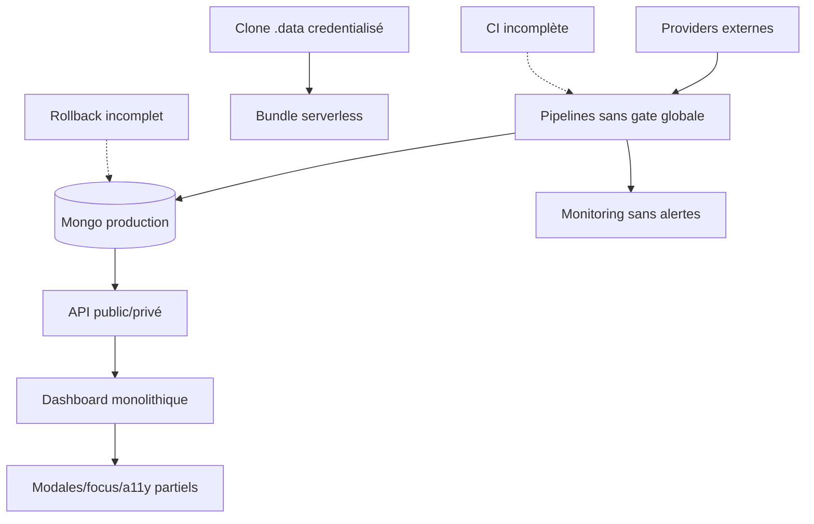

# 31 — Gaps et dette technique

<!-- current-state-2026-07-13:start -->

## Mise à jour code courant — 13 juillet 2026

- Les snapshots trainer-pokemon n’ont ni TTL ni politique de rétention codée.
- Aucun monitoring externe ne signale un import failed ou un pointeur actif manquant.
- Le commit et le rollback MongoDB nécessitent une base configurée; la livraison post-audit n’a exécuté aucune mutation de données personnelle.

<!-- current-state-2026-07-13:end -->

## 1. Objectif

Consolider les données manquantes, ambiguïtés, duplications, architectures concurrentes, défauts de documentation, sécurité, tests, performance et exploitation sans corriger le code.

## 2. Portée

Dette confirmée ou risque fondé des cinq dépôts. Chaque entrée reçoit un ID stable, une sévérité, une preuve et une zone.

## 3. Méthode

Déduplication des risques de tous les rapports. « Confirmé » signifie directement visible dans le code; « à vérifier » signifie combinaison risquée dont l'effet final dépend du build/déploiement; « information » signifie donnée non trouvée et non supposée.

## 4. Résultats

### 4.1 Critique

| ID | Statut | Dette / gap | Preuve |
|---|---|---|---|
| DEBT-001 | à vérifier immédiatement | Token GitHub injecté dans URL de clone, remote `.git/config` potentiellement inclus par `.data/**` dans bundle serverless | ensure-data + tracing/includeFiles |
| DEBT-002 | confirmé | Workflow sync Mongo production sans tests, build ni dry-run | `sync-mongodb.yml` |
| DEBT-003 | confirmé | Sync statique multi-collections et suppression stale optionnelle sans transaction/rollback global | sync-service |
| DEBT-004 | confirmé | Chaîne provider externe → mutation production dépend de parsers non uniformes et sans gate de contrat globale | generators/adapters/workflows |
| DEBT-005 | confirmé | Frontière Shiny privée dépend de plusieurs middlewares/relays; une régression de route présente un risque d’exposition du dataset | routeur, proxy, OpenAPI |

### 4.2 Élevée

| ID | Domaine | Dette / gap |
|---|---|---|
| DEBT-006 | sécurité | CSP Dashboard autorise `unsafe-inline` et `unsafe-eval` en production |
| DEBT-007 | sécurité | API privées exemptées par préfixe du proxy global puis sécurisées handler par handler |
| DEBT-008 | sécurité | session 14 jours sans révocation, rotation, store ni MFA |
| DEBT-009 | sécurité | base du proxy API configurable pouvant recevoir le secret admin si mal configurée |
| DEBT-010 | sécurité | CORS API `*` par défaut et rate limits mémoire par instance |
| DEBT-011 | erreurs | handlers Dashboard exposent `error.message` dans plusieurs handlers et n'ont ni format ni request ID commun |
| DEBT-012 | observabilité | aucune alerte externe, trace distribuée, SLO ou seuil de fraîcheur |
| DEBT-013 | données | upsert current + snapshot/read-back non transactionnel et sans rollback automatique |
| DEBT-014 | Mongo | aucune politique TTL/rétention sur snapshots, syncRuns, activités, métriques et historiques |
| DEBT-015 | Mongo | `strict:false` sur les modèles API réduit la validation persistée |
| DEBT-016 | providers | licences/provenances absentes pour quinze providers; cinq générateurs directs hors contrat formel |
| DEBT-017 | performance | Admin Pokémon monolithique importe statiquement 23 panneaux; aucun lazy loading |
| DEBT-018 | performance | bootstrap public/admin transfère toutes les fiches avant pagination visuelle |
| DEBT-019 | performance | asset browser complet sans pagination/virtualisation; images brutes dominantes |
| DEBT-020 | accessibilité | dialogues sans focus trap, focus initial/restauration et Escape uniforme |
| DEBT-021 | accessibilité | champs sans nom accessible et DnD sans alternative clavier documentée |
| DEBT-022 | accessibilité | reduced motion ne couvre qu'une animation malgré Framer/loaders/transitions |
| DEBT-023 | tests | mutations/auth des 34 handlers Dashboard peu testées; UI hors Learning quasi non couverte |
| DEBT-024 | tests | aucun test a11y, performance, couverture ou baseline visuelle en CI |
| DEBT-025 | CI | token dispatch manquant produit un workflow vert et aucune CI Dashboard/Landing/Assets |
| DEBT-026 | version | zéro tag Git; OpenAPI 1.4.1 vs package API 1.7.0; changelogs en retard |
| DEBT-027 | exploitation | aucun cron/schedule current ni rollback Vercel/Atlas codé |
| DEBT-028 | architecture | `.data`, Data statique, Mongo current, seeds Events et localStorage sont plusieurs vérités aux politiques différentes |

### 4.3 Moyenne

| ID | Domaine | Dette / gap |
|---|---|---|
| DEBT-029 | composants | 45 facades de compatibilité et duplications Dashboard/API des composants Pokémon |
| DEBT-030 | design | specs futures dark-only/no hardcodes divergent de l'implémentation dark/light + 8 palettes + 520 hardcodes heuristiques |
| DEBT-031 | responsive | Kanban PointerSensor seulement; petites cibles 32–40 px; scrolls imbriqués |
| DEBT-032 | responsive | aucun test automatisé de toutes les 48 pages/sections et pas de breakpoint ultra dédié |
| DEBT-033 | cache | cache API/localStorage par instance/client, sans TTL localStorage ni migration globale |
| DEBT-034 | cache | invalidation par liste ne couvre explicitement que cinq des sept current; no-store compense aujourd'hui |
| DEBT-035 | API | 75 chemins OpenAPI vs 122 routes API; Explorer ajoute manuellement des mutations |
| DEBT-036 | API | préfixe `/admin` trompeur: plusieurs GET restent publics |
| DEBT-037 | API | proxy recharge OpenAPI no-store avant chaque exécution |
| DEBT-038 | erreurs | JSON invalide converti dans plusieurs handlers en `{}`; métriques/collStats avalent les erreurs |
| DEBT-039 | Mongo | indexes Dashboard créés paresseusement, état Atlas réel inconnu |
| DEBT-040 | datasets | pas de `datasetVersion/providerVersion/sourceVersion` global; schemas statiques non versionnés uniformément |
| DEBT-041 | releases | incrément manuel de plusieurs marqueurs sans automatisation ni release notes générées |
| DEBT-042 | déploiement | Landing utilise `npm install`, branche locale develop, CI et branche production non prouvées |
| DEBT-043 | assets | 22 634 assets suivis + miroir PokeMiners massif; validation CI et licences absentes |
| DEBT-044 | logs | formats console mixtes, request ID absent du Dashboard et non propagé aux jobs |
| DEBT-045 | UI | majorité des messages dynamiques sans live region; contrastes des huit palettes non mesurés |
| DEBT-046 | documentation | DOC-011–035 absents; docs cibles/design et réalité code peuvent être confondues |

### 4.4 Faible

| ID | Dette / gap |
|---|---|
| DEBT-047 | nomenclature Mongo mixte camelCase/snake_case/pluriels |
| DEBT-048 | `vh`/`dvh` et breakpoints Tailwind/legacy hétérogènes |
| DEBT-049 | plusieurs cibles documentaires synthétiques/inline sans composant dédié |
| DEBT-050 | Landing et Assets n'ont ni changelog ni version visible structurée |
| DEBT-051 | API version de chemin `v1` et SemVer 1.x sont facilement confondus |
| DEBT-052 | absence de RBAC multi-rôle, acceptable tant que mono-admin |

### 4.5 Informations manquantes

| ID | Information non trouvée |
|---|---|
| INFO-001 | volumes, cardinalités, plans `explain`, index Atlas additionnels |
| INFO-002 | backups Atlas, PITR, RPO/RTO, règles réseau/IP |
| INFO-003 | domaines/régions/branches/scopes Preview-Production Vercel |
| INFO-004 | contenu exact des bundles et présence de `.git/config` |
| INFO-005 | logs Vercel, rétention, alertes et procédure incident |
| INFO-006 | métriques Web Vitals, p95/p99 API/provider/build |
| INFO-007 | tests d'intrusion, scans SAST/DAST/secrets/supply-chain |
| INFO-008 | matrice navigateurs/appareils, tests lecteurs d'écran/zoom |
| INFO-009 | responsables, fréquence et SLA des datasets/providers |
| INFO-010 | licences et droit de redistribution de la majorité des sources/assets |
| INFO-011 | releases GitHub distantes et politique SemVer approuvée |
| INFO-012 | audience, ownership, langue et cycle de revue des 555 documents futurs |

## 5. Tableaux

### Répartition

| Niveau | Nombre |
|---|---:|
| Critique | 5 |
| Élevé | 23 |
| Moyen | 18 |
| Faible | 6 |
| Information | 12 |
| **Total** | **64** |

### Top dépendances affectées

| Hub | Dettes liées |
|---|---|
| DATASET-001 / COL-007 | 003, 015, 018, 039, 040 |
| Admin Pokémon | 007, 011, 017, 018, 020, 023 |
| Providers current | 002, 004, 013, 016, 027 |
| `.data` / build | 001, 025, 028, 042 |
| Shiny privé | 005, 008, 009, 013 |

## 6. Diagrammes Mermaid

## 7. Fichiers sources

- `PokemonGo-API-/.github/workflows/sync-mongodb.yml`.
- `PokemonGo-Data/.github/workflows/dispatch-api-sync.yml`.
- `Dashboard Admin/scripts/data/ensure-data.js`.
- `PokemonGo-API-/vercel.json` et `Dashboard Admin/next.config.ts`.
- `Dashboard Admin/src/proxy.ts` et `src/lib/security.ts`.
- `PokemonGo-API-/src/sync/sync-service.js`.
- `Dashboard Admin/src/components/admin/pokemon/admin-app.jsx`.
- Tous les rapports 18–30 pour les preuves détaillées.

## 8. Incohérences

Les principales incohérences transverses sont: privé par nom vs contrôle réel, source statique vs current, fallback Events vs Mongo-only current, design cible vs UI actuelle, version package vs OpenAPI/changelog, tests locaux vs workflows réels et diagnostics riches sans alerting.

## 9. Informations manquantes

Les douze entrées INFO ci-dessus doivent rester explicitement « INFORMATION NON TROUVÉE » jusqu'à preuve externe. Aucune valeur de secret, donnée Mongo réelle ou configuration plateforme n'a été inférée.

## 10. Risques

Le risque systémique est la combinaison de mutations production automatisables, sources externes variables, absence de gate CI/rollback/alerting et concentration autour de `pokemons`. Les risques sécurité du build credentialisé et de la frontière privée doivent être vérifiés avant les optimisations UI.

## 11. Mapping documentaire

- DEBT-001–005 → ROADMAP-001, SEC, CI, ADR.
- DEBT-006–028 → ROADMAP-001/002.
- DEBT-029–046 → ROADMAP-002/003/004.
- DEBT-047–052 → backlog faible.
- INFO-001–012 → sections « Informations manquantes » des DOC-019–035.

## 12. État de progression

Phase 26 terminée. 52 dettes/risques et 12 informations manquantes sont classés sans modification du code source.
