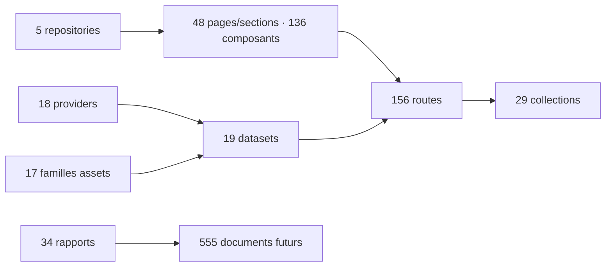

# 32 — Index final exhaustif

<!-- current-state-2026-07-13:start -->

## Mise à jour code courant — 13 juillet 2026

- L’index courant référence 49 pages/sections, 137 composants, 160 routes, 32 collections, 20 datasets et 16 workflows.
- Les onze fiches post-audit sont reliées depuis [34-post-audit-changes.md](./34-post-audit-changes.md) et depuis les Foundation concernées.
- documentation-map.json contient 567 entrées après réconciliation.

<!-- current-state-2026-07-13:end -->

## 1. Objectif

Fournir le point d’entrée unique vers tous les repositories, layouts, pages, composants, hooks, contextes, services, providers, datasets, routes, collections, assets, pipelines, caches, configurations, tests et documents futurs.

## 2. Portée

repositories: 5; layouts: 4; pages: 48; components: 136; hooks: 3; contexts: 1; services: 4; providers: 18; datasets: 19; routes: 156; collections: 29; assets: 17; workflows: 15; caches: 6; configs: 28; tests: 17; futureDocuments: 555.

## 3. Méthode

Index généré depuis les registres JSON validés et un scan local excluant dépendances, builds, caches, archives et backups. Les dépendances principales viennent du graphe de 854 arêtes.

## 4. Résultats

Toutes les catégories demandées sont présentes ci-dessous. Les statuts « code-only » signifient que la déclaration a été vérifiée dans le code mais pas dans le runtime déployé.

## 5. Tableaux

### Repositories

| ID | Nom | Chemin | Catégorie | Statut | Doc cible | Dépendances |
|---|---|---|---|---|---|---|
| REPO-001 | Dashboard Admin | Dashboard Admin | application Next privée | actif | DOC-005 | graphe inter-repos |
| REPO-002 | Landing-Page-PogoApi | Landing-Page-PogoApi | landing Next | actif/develop local | DOC-005 | graphe inter-repos |
| REPO-003 | PokemonGo-API- | PokemonGo-API- | site Next + API Express | actif | DOC-005 | graphe inter-repos |
| REPO-004 | PokemonGo-Data | PokemonGo-Data | source de données | actif | DOC-005 | graphe inter-repos |
| REPO-005 | PokemonGo-Assets-API | PokemonGo-Assets-API | assets Git/raw | actif | DOC-005 | graphe inter-repos |

### Layouts

| ID | Nom | Chemin | Catégorie | Statut | Doc cible | Dépendances |
|---|---|---|---|---|---|---|
| LAYOUT-001 | (dashboard) | Dashboard Admin/src/app/(dashboard)/layout.tsx | layout | actif | DOC-012 | CTX-001, auth/layout |
| LAYOUT-002 | app | Dashboard Admin/src/app/layout.tsx | layout | actif | DOC-012 | CTX-001, auth/layout |
| LAYOUT-003 | app | Landing-Page-PogoApi/app/layout.jsx | layout | actif | DOC-012 | site public |
| LAYOUT-004 | app | PokemonGo-API-/app/layout.js | layout | actif | DOC-012 | site public |

### Pages et sections

| ID | Nom | Chemin | Catégorie | Statut | Doc cible | Dépendances |
|---|---|---|---|---|---|---|
| PAGE-001 | Connexion | Dashboard Admin/src/app/login/page.tsx | route | active | PAGE-001 | INLINE-PAGE-001, API-156 |
| PAGE-002 | Accueil | Dashboard Admin/src/app/(dashboard)/page.tsx | route | active | PAGE-002 | COMP-080, API-155 |
| PAGE-003 | Analytics | Dashboard Admin/src/app/(dashboard)/analytics/page.tsx | route | active | PAGE-003 | COMP-085 |
| PAGE-004 | Outils | Dashboard Admin/src/app/(dashboard)/tools/page.tsx | route | active | PAGE-004 | COMP-076 |
| PAGE-005 | Dashboard Backlog | Dashboard Admin/src/app/(dashboard)/tools/dashboard-backlog/page.tsx | route | active | PAGE-005 | COMP-077 |
| PAGE-006 | Admin Pokémon | Dashboard Admin/src/app/(dashboard)/pokemon-admin/page.tsx | route | active | PAGE-006 | COMP-110 |
| PAGE-007 | Docs JSON | Dashboard Admin/src/app/(dashboard)/pokemon-docs/page.tsx | route | active | PAGE-007 | INLINE-PAGE-007 |
| PAGE-008 | Notes | Dashboard Admin/src/app/(dashboard)/notes/page.tsx | route | active | PAGE-008 | COMP-087 |
| PAGE-009 | Kanban | Dashboard Admin/src/app/(dashboard)/kanban/page.tsx | route | active | PAGE-009 | COMP-084 |
| PAGE-010 | Projets | Dashboard Admin/src/app/(dashboard)/projects/page.tsx | route | active | PAGE-010 | INLINE-PAGE-010 |
| PAGE-011 | Calendrier | Dashboard Admin/src/app/(dashboard)/calendar/page.tsx | route | active | PAGE-011 | COMP-074 |
| PAGE-012 | Todo | Dashboard Admin/src/app/(dashboard)/todo/page.tsx | route | active | PAGE-012 | COMP-098 |
| PAGE-013 | Texte | Dashboard Admin/src/app/(dashboard)/writer/page.tsx | route | active | PAGE-013 | COMP-099 |
| PAGE-014 | JS Progress | Dashboard Admin/src/app/(dashboard)/js-progress/page.tsx | route | active | PAGE-014 | COMP-083 |
| PAGE-015 | Pomodoro | Dashboard Admin/src/app/(dashboard)/pomodoro/page.tsx | route | active | PAGE-015 | COMP-093 |
| PAGE-016 | Exercices JS | Dashboard Admin/src/app/(dashboard)/exercices-javascript/page.tsx | route | active | PAGE-016 | COMP-082 |
| PAGE-017 | Snippets | Dashboard Admin/src/app/(dashboard)/snippets/page.tsx | route | active | PAGE-017 | COMP-095 |
| PAGE-018 | Couleurs | Dashboard Admin/src/app/(dashboard)/palette/page.tsx | route | active | PAGE-018 | COMP-075 |
| PAGE-019 | Mongo DB | Dashboard Admin/src/app/(dashboard)/database/page.tsx | route | active | PAGE-019 | COMP-081, API-136 |
| PAGE-020 | Compte | Dashboard Admin/src/app/(dashboard)/account/page.tsx | route | active-not-in-sidebar | PAGE-020 | INLINE-PAGE-020 |
| PAGE-021 | Accueil Pokémon | Dashboard Admin/src/components/admin/pokemon/admin-app.jsx | embedded-section | active | PAGE-021 | INLINE-PAGE-021 |
| PAGE-022 | Fiches Pokémon | Dashboard Admin/src/components/admin/pokemon/admin-app.jsx | embedded-section | active | PAGE-022 | INLINE-PAGE-022, DATASET-001, DATASET-002, DATASET-007 |
| PAGE-023 | Candies | Dashboard Admin/src/components/admin/pokemon/admin-app.jsx | embedded-section | active | PAGE-023 | COMP-103, DATASET-011 |
| PAGE-024 | Background | Dashboard Admin/src/components/admin/pokemon/admin-app.jsx | embedded-section | active | PAGE-024 | COMP-036, DATASET-003 |
| PAGE-025 | Collections | Dashboard Admin/src/components/admin/pokemon/admin-app.jsx | embedded-section | active | PAGE-025 | COMP-105 |
| PAGE-026 | Assets | Dashboard Admin/src/components/admin/pokemon/admin-app.jsx | embedded-section | active | PAGE-026 | INLINE-PAGE-026, DATASET-003, DATASET-010 |
| PAGE-027 | Catalogues | Dashboard Admin/src/components/admin/pokemon/admin-app.jsx | embedded-section | active | PAGE-027 | COMP-104, DATASET-004, DATASET-005, DATASET-006, DATASET-007 |
| PAGE-028 | Raids | Dashboard Admin/src/components/admin/pokemon/admin-app.jsx | embedded-section | active | PAGE-028 | COMP-111, DATASET-012 |
| PAGE-029 | Max Battles | Dashboard Admin/src/components/admin/pokemon/admin-app.jsx | embedded-section | active | PAGE-029 | COMP-109, DATASET-014 |
| PAGE-030 | Rocket | Dashboard Admin/src/components/admin/pokemon/admin-app.jsx | embedded-section | active | PAGE-030 | COMP-113, DATASET-009, DATASET-015 |
| PAGE-031 | PvP Rankings | Dashboard Admin/src/components/admin/pokemon/admin-app.jsx | embedded-section | active | PAGE-031 | COMP-054, DATASET-004, DATASET-018 |
| PAGE-032 | Œufs | Dashboard Admin/src/components/admin/pokemon/admin-app.jsx | embedded-section | active | PAGE-032 | COMP-106, DATASET-013 |
| PAGE-033 | Research | Dashboard Admin/src/components/admin/pokemon/admin-app.jsx | embedded-section | active | PAGE-033 | COMP-112, DATASET-008, DATASET-016 |
| PAGE-034 | Calendrier Events | Dashboard Admin/src/components/admin/pokemon/admin-app.jsx | embedded-section | active | PAGE-034 | COMP-107 |
| PAGE-035 | Shiny Tracker | Dashboard Admin/src/components/admin/pokemon/admin-app.jsx | embedded-section | active | PAGE-035 | COMP-058, DATASET-017 |
| PAGE-036 | Contrôles | Dashboard Admin/src/components/admin/pokemon/admin-app.jsx | embedded-section | active | PAGE-036 | COMP-034 |
| PAGE-037 | Veille | Dashboard Admin/src/components/admin/pokemon/admin-app.jsx | embedded-section | active | PAGE-037 | COMP-059, DATASET-019 |
| PAGE-038 | Comparaison | Dashboard Admin/src/components/admin/pokemon/admin-app.jsx | embedded-section | active | PAGE-038 | INLINE-PAGE-038 |
| PAGE-039 | Todo-list Pokémon | Dashboard Admin/src/components/admin/pokemon/admin-app.jsx | embedded-section | active | PAGE-039 | COMP-033 |
| PAGE-040 | Logs & MAJ | Dashboard Admin/src/components/admin/pokemon/admin-app.jsx | embedded-section | active | PAGE-040 | COMP-115, DATASET-019 |
| PAGE-041 | Règles JSON | Dashboard Admin/src/components/admin/pokemon/admin-app.jsx | embedded-section | active | PAGE-041 | INLINE-PAGE-041 |
| PAGE-042 | Corrections | Dashboard Admin/src/components/admin/pokemon/admin-app.jsx | embedded-section | active | PAGE-042 | INLINE-PAGE-042 |
| PAGE-043 | Export | Dashboard Admin/src/components/admin/pokemon/admin-app.jsx | embedded-section | active | PAGE-043 | INLINE-PAGE-043 |
| PAGE-044 | Landing publique | Landing-Page-PogoApi/app/page.jsx | public-route | active | PAGE-044 | COMP-124 |
| PAGE-045 | Accueil API public | PokemonGo-API-/app/page.js | public-route | active | PAGE-045 | INLINE-PAGE-045, COMP-131, COMP-130, COMP-136 |
| PAGE-046 | Bibliothèque d’assets publique | PokemonGo-API-/app/assets/page.js | public-route | active | PAGE-046 | COMP-125, API-006 |
| PAGE-047 | Bibliothèque API alias | PokemonGo-API-/app/bibliotheque/page.js | public-route | active-alias | PAGE-047 | COMP-126, API-006 |
| PAGE-048 | Checklist API publique | PokemonGo-API-/app/checklist/page.js | public-route | active | PAGE-048 | COMP-126, API-006 |

### Composants

| ID | Nom | Chemin | Catégorie | Statut | Doc cible | Dépendances |
|---|---|---|---|---|---|---|
| COMP-001 | PokemonWidget | Dashboard Admin/src/components/admin/cards/pokemon-widget.tsx | Composite | active | COMP-001 | COMP-119, COMP-121, API-155, COMP-092 |
| COMP-002 | StatCard | Dashboard Admin/src/components/admin/cards/stat-card.tsx | Composite | active | COMP-002 | COMP-121, COMP-097 |
| COMP-003 | ColorLab | Dashboard Admin/src/components/admin/dashboard/color-lab.tsx | Complex | active | COMP-003 | COMP-119, COMP-120, COMP-121, COMP-122, COMP-075 |
| COMP-004 | DailyTools | Dashboard Admin/src/components/admin/dashboard/daily-tools.tsx | Complex | active | COMP-004 | COMP-065, COMP-119, COMP-120, COMP-121, COMP-122, COMP-076 |
| COMP-005 | DashboardHomeLive | Dashboard Admin/src/components/admin/dashboard/dashboard-home-live.tsx | Complex | active | COMP-005 | COMP-051, COMP-065, COMP-119, COMP-120, COMP-121, API-155, COMP-080 |
| COMP-006 | Pomodoro | Dashboard Admin/src/components/admin/dashboard/pomodoro.tsx | Complex | active | COMP-006 | COMP-119, COMP-120, COMP-121, COMP-093 |
| COMP-007 | SnippetVault | Dashboard Admin/src/components/admin/dashboard/snippet-vault.tsx | Complex | active | COMP-007 | COMP-119, COMP-120, COMP-121, COMP-122, COMP-123, COMP-095 |
| COMP-008 | EventEditorModal / ImportModal | Dashboard Admin/src/components/admin/events/event-editor-modal.jsx | Feature | active | COMP-008 | COMP-034, COMP-064, COMP-009 |
| COMP-009 | EventsCalendarPanel | Dashboard Admin/src/components/admin/events/events-calendar-panel.jsx | Feature | active | COMP-009 | COMP-008, COMP-034, COMP-043, COMP-064, COMP-046, COMP-107, SERVICE-002 |
| COMP-010 | CalendarPlanner | Dashboard Admin/src/components/admin/forms/calendar-planner.tsx | Complex | active | COMP-010 | COMP-063, COMP-119, COMP-120, COMP-121, COMP-122, COMP-123, COMP-074 |
| COMP-011 | JavaScriptExercises | Dashboard Admin/src/components/admin/forms/javascript-exercises.tsx | Complex | active | COMP-011 | COMP-119, COMP-120, COMP-121, COMP-082 |
| COMP-012 | JsProgress | Dashboard Admin/src/components/admin/forms/js-progress.tsx | Complex | active | COMP-012 | COMP-020, COMP-021, COMP-022, COMP-023, COMP-024, COMP-026, COMP-027, COMP-119 |
| COMP-013 | KanbanBoard | Dashboard Admin/src/components/admin/forms/kanban-board.tsx | Complex | active | COMP-013 | COMP-063, COMP-119, COMP-120, COMP-121, COMP-122, COMP-123, COMP-084 |
| COMP-014 | NotesBoard | Dashboard Admin/src/components/admin/forms/notes-board.tsx | Complex | active | COMP-014 | COMP-063, COMP-119, COMP-120, COMP-121, COMP-122, COMP-087 |
| COMP-015 | TodoList | Dashboard Admin/src/components/admin/forms/todo-list.tsx | Complex | active | COMP-015 | COMP-063, COMP-119, COMP-120, COMP-121, COMP-122, COMP-098 |
| COMP-016 | WriterStudio | Dashboard Admin/src/components/admin/forms/writer-studio.tsx | Complex | active | COMP-016 | COMP-119, COMP-120, COMP-121, COMP-122, COMP-099 |
| COMP-017 | AdminAppFrame | Dashboard Admin/src/components/admin/layout/admin-app-frame.tsx | Layout | active | COMP-017 | COMP-019, COMP-029, COMP-030, COMP-062, HOOK-002, COMP-073 |
| COMP-018 | Providers | Dashboard Admin/src/components/admin/layout/admin-providers.tsx | Layout | active | COMP-018 | COMP-094 |
| COMP-019 | AdminVersionHistoryDialog | Dashboard Admin/src/components/admin/layout/admin-version-history-dialog.tsx | Layout | active | COMP-019 | COMP-017 |
| COMP-020 | LearningAchievementGrid | Dashboard Admin/src/components/admin/learning/learning-achievement-grid.tsx | Feature | active | COMP-020 | COMP-012, COMP-025, COMP-119, COMP-121 |
| COMP-021 | LearningActivityTimeline | Dashboard Admin/src/components/admin/learning/learning-activity.tsx | Feature | active | COMP-021 | COMP-012, COMP-121 |
| COMP-022 | LearningAdvancedStats | Dashboard Admin/src/components/admin/learning/learning-advanced-stats.tsx | Feature | active | COMP-022 | COMP-012, COMP-121 |
| COMP-023 | LearningDetailModal | Dashboard Admin/src/components/admin/learning/learning-detail-modal.tsx | Feature | active | COMP-023 | COMP-012, COMP-119, COMP-120, COMP-122, COMP-123 |
| COMP-024 | LearningImportModal | Dashboard Admin/src/components/admin/learning/learning-import-modal.tsx | Feature | active | COMP-024 | COMP-012, COMP-119, COMP-120, COMP-123, SERVICE-003 |
| COMP-025 | LearningProgressBar | Dashboard Admin/src/components/admin/learning/learning-progress-bar.tsx | Feature | active | COMP-025 | COMP-020, COMP-026, COMP-027 |
| COMP-026 | LearningSummary | Dashboard Admin/src/components/admin/learning/learning-summary.tsx | Feature | active | COMP-026 | COMP-012, COMP-025, COMP-121 |
| COMP-027 | LearningTopicCard | Dashboard Admin/src/components/admin/learning/learning-topic-card.tsx | Feature | active | COMP-027 | COMP-012, COMP-025, COMP-119, COMP-121 |
| COMP-028 | AdminPaletteSelector | Dashboard Admin/src/components/admin/navigation/admin-palette-selector.tsx | Layout | active | COMP-028 | COMP-120, HOOK-001, COMP-030 |
| COMP-029 | AdminSidebar | Dashboard Admin/src/components/admin/navigation/admin-sidebar.tsx | Layout | active | COMP-029 | COMP-017, COMP-119, COMP-120, API-149 |
| COMP-030 | AdminTopbar | Dashboard Admin/src/components/admin/navigation/admin-topbar.tsx | Layout | active | COMP-030 | COMP-017, COMP-028, COMP-120 |
| COMP-031 | AdminApp | Dashboard Admin/src/components/admin/pokemon/admin-app.jsx | Feature | active | COMP-031 | COMP-044, COMP-052, COMP-065, COMP-116, COMP-118, COMP-049, COMP-100, SERVICE-001 |
| COMP-032 | AdminSectionNavigation | Dashboard Admin/src/components/admin/pokemon/admin-section-navigation.jsx | Feature | active | COMP-032 | — |
| COMP-033 | AdminTodoPanel | Dashboard Admin/src/components/admin/pokemon/admin-todo-panel.jsx | Feature | active | COMP-033 | PAGE-039, SERVICE-001 |
| COMP-034 | Panel / BarList / AssetStatCard / GenerationFilterBar / CompletionList / HistoryList / MiniCardList / ControlCardsPanel / JsonIssueList | Dashboard Admin/src/components/admin/pokemon/admin-ui.jsx | Feature | active | COMP-034 | PAGE-036, COMP-008, COMP-009, COMP-117, COMP-101 |
| COMP-035 | TypeIcons / WeatherIcons | Dashboard Admin/src/components/admin/pokemon/asset-icons.jsx | Feature | active | COMP-035 | COMP-118, COMP-102 |
| COMP-036 | BackgroundPanel | Dashboard Admin/src/components/admin/pokemon/background-panel.jsx | Feature | active | COMP-036 | PAGE-024, COMP-117, COMP-123 |
| COMP-037 | CandyPanel | Dashboard Admin/src/components/admin/pokemon/candy-panel.jsx | Feature | active | COMP-037 | COMP-117, COMP-103 |
| COMP-038 | CatalogPanel | Dashboard Admin/src/components/admin/pokemon/catalog-panel.jsx | Feature | active | COMP-038 | COMP-117, COMP-104 |
| COMP-039 | CollectionsPanel | Dashboard Admin/src/components/admin/pokemon/collections-panel.jsx | Feature | active | COMP-039 | COMP-117, COMP-118, COMP-105 |
| COMP-040 | DatasetSourceHeader / CurrentDatasetDiagnostics | Dashboard Admin/src/components/admin/pokemon/current-dataset-diagnostics.jsx | Feature | active | COMP-040 | — |
| COMP-041 | DatasetEventBanner | Dashboard Admin/src/components/admin/pokemon/dataset-event-banner.jsx | Feature | active | COMP-041 | SERVICE-002 |
| COMP-042 | DatasetFilterBar | Dashboard Admin/src/components/admin/pokemon/dataset-filter-bar.jsx | Feature | active | COMP-042 | — |
| COMP-043 | DatasetSourceHeader | Dashboard Admin/src/components/admin/pokemon/dataset-source-header.jsx | Feature | active | COMP-043 | COMP-009 |
| COMP-044 | DetailModal | Dashboard Admin/src/components/admin/pokemon/detail-modal.jsx | Feature | active | COMP-044 | COMP-031, COMP-117, COMP-118, COMP-071 |
| COMP-045 | EggsPanel | Dashboard Admin/src/components/admin/pokemon/eggs-panel.jsx | Feature | active | COMP-045 | COMP-118, COMP-106 |
| COMP-046 | EventsCalendarPanel | Dashboard Admin/src/components/admin/pokemon/events-calendar-panel.jsx | Feature | facade | COMP-046 | COMP-009, SERVICE-002 |
| COMP-047 | LoginCard | Dashboard Admin/src/components/admin/pokemon/login-card.jsx | Feature | active | COMP-047 | COMP-108 |
| COMP-048 | MaxBattlesPanel | Dashboard Admin/src/components/admin/pokemon/max-battles-panel.jsx | Feature | active | COMP-048 | COMP-118, COMP-109 |
| COMP-049 | PokemonAdminStudio | Dashboard Admin/src/components/admin/pokemon/pokemon-admin-studio.tsx | Feature | active | COMP-049 | COMP-031, COMP-110 |
| COMP-050 | PokemonApiExplorer | Dashboard Admin/src/components/admin/pokemon/pokemon-api-explorer.tsx | Feature | active | COMP-050 | COMP-119, COMP-120, COMP-121, API-153, COMP-089 |
| COMP-051 | PokemonApiStatus | Dashboard Admin/src/components/admin/pokemon/pokemon-api-status.tsx | Feature | active | COMP-051 | COMP-005, COMP-120, API-152, COMP-090 |
| COMP-052 | PokemonCard | Dashboard Admin/src/components/admin/pokemon/pokemon-card.jsx | Feature | active | COMP-052 | COMP-031, COMP-117, COMP-118, COMP-072 |
| COMP-053 | PokemonDocsViewer | Dashboard Admin/src/components/admin/pokemon/pokemon-docs-viewer.tsx | Feature | active | COMP-053 | COMP-119, COMP-121, COMP-122, COMP-091 |
| COMP-054 | PvpRankingsPanel | Dashboard Admin/src/components/admin/pokemon/pvp-rankings-panel.jsx | Feature | active | COMP-054 | PAGE-031, COMP-117 |
| COMP-055 | RaidsPanel | Dashboard Admin/src/components/admin/pokemon/raids-panel.jsx | Feature | active | COMP-055 | COMP-118, COMP-111 |
| COMP-056 | ResearchPanel | Dashboard Admin/src/components/admin/pokemon/research-panel.jsx | Feature | active | COMP-056 | COMP-118, COMP-112 |
| COMP-057 | RocketPanel | Dashboard Admin/src/components/admin/pokemon/rocket-panel.jsx | Feature | active | COMP-057 | COMP-118, COMP-113 |
| COMP-058 | ShinyTrackerPanel | Dashboard Admin/src/components/admin/pokemon/shiny-tracker-panel.jsx | Feature | active | COMP-058 | PAGE-035, COMP-117, COMP-123 |
| COMP-059 | SourceHistoryModal / DataDeployHistoryModal / SourceRows | Dashboard Admin/src/components/admin/pokemon/source-watch-panel.tsx | Feature | active | COMP-059 | PAGE-037, COMP-114 |
| COMP-060 | TierSection | Dashboard Admin/src/components/admin/pokemon/tier-section.jsx | Feature | active | COMP-060 | — |
| COMP-061 | UpdateLogPanel | Dashboard Admin/src/components/admin/pokemon/update-log-panel.jsx | Feature | active | COMP-061 | COMP-115 |
| COMP-062 | DashboardFooter | Dashboard Admin/src/components/admin/shared/dashboard-footer.tsx | Utility UI | active | COMP-062 | COMP-017, COMP-079 |
| COMP-063 | DashboardLoadingState | Dashboard Admin/src/components/admin/shared/loading-state.tsx | Utility UI | active | COMP-063 | COMP-010, COMP-013, COMP-014, COMP-015, COMP-121, COMP-070, COMP-086 |
| COMP-064 | ModalPortal | Dashboard Admin/src/components/admin/shared/modal-portal.jsx | Utility UI | active | COMP-064 | COMP-008, COMP-009 |
| COMP-065 | SortableWidgetGrid | Dashboard Admin/src/components/admin/shared/sortable-widget-grid.tsx | Utility UI | active | COMP-065 | COMP-004, COMP-005, COMP-031, COMP-067, COMP-068, COMP-096 |
| COMP-066 | DashboardCharts | Dashboard Admin/src/components/admin/stats/dashboard-charts.tsx | Complex | active | COMP-066 | COMP-121, COMP-078 |
| COMP-067 | DatabaseStats | Dashboard Admin/src/components/admin/stats/database-stats.tsx | Complex | active | COMP-067 | COMP-065, COMP-120, COMP-121, API-136, COMP-081 |
| COMP-068 | LearningAnalytics | Dashboard Admin/src/components/admin/stats/learning-analytics.tsx | Complex | active | COMP-068 | COMP-065, COMP-121, HOOK-003, COMP-085 |
| COMP-069 | PokemonAnalytics | Dashboard Admin/src/components/admin/stats/pokemon-analytics.tsx | Complex | active | COMP-069 | COMP-119, COMP-121, API-155, COMP-088 |
| COMP-070 | DashboardBacklog | Dashboard Admin/src/components/admin/tables/dashboard-backlog.tsx | Complex | active | COMP-070 | COMP-063, COMP-119, COMP-120, COMP-121, COMP-122, COMP-123, API-130, COMP-077 |
| COMP-071 | DetailModal | Dashboard Admin/src/components/checklist/detail-modal.jsx | Compatibility | facade | COMP-071 | COMP-044 |
| COMP-072 | PokemonCard | Dashboard Admin/src/components/checklist/pokemon-card.jsx | Compatibility | facade | COMP-072 | COMP-052 |
| COMP-073 | AppFrame | Dashboard Admin/src/components/dashboard/app-frame.tsx | Compatibility | facade | COMP-073 | COMP-017 |
| COMP-074 | CalendarPlanner | Dashboard Admin/src/components/dashboard/calendar-planner.tsx | Compatibility | facade | COMP-074 | PAGE-011, COMP-010 |
| COMP-075 | ColorLab | Dashboard Admin/src/components/dashboard/color-lab.tsx | Compatibility | facade | COMP-075 | PAGE-018, COMP-003 |
| COMP-076 | DailyTools | Dashboard Admin/src/components/dashboard/daily-tools.tsx | Compatibility | facade | COMP-076 | PAGE-004, COMP-004 |
| COMP-077 | DashboardBacklog | Dashboard Admin/src/components/dashboard/dashboard-backlog.tsx | Compatibility | facade | COMP-077 | PAGE-005, COMP-070 |
| COMP-078 | DashboardCharts | Dashboard Admin/src/components/dashboard/dashboard-charts.tsx | Compatibility | facade | COMP-078 | COMP-066 |
| COMP-079 | DashboardFooter | Dashboard Admin/src/components/dashboard/dashboard-footer.tsx | Compatibility | facade | COMP-079 | COMP-062 |
| COMP-080 | DashboardHomeLive | Dashboard Admin/src/components/dashboard/dashboard-home-live.tsx | Compatibility | facade | COMP-080 | PAGE-002, COMP-005 |
| COMP-081 | DatabaseStats | Dashboard Admin/src/components/dashboard/database-stats.tsx | Compatibility | facade | COMP-081 | PAGE-019, COMP-067 |
| COMP-082 | JavaScriptExercises | Dashboard Admin/src/components/dashboard/javascript-exercises.tsx | Compatibility | facade | COMP-082 | PAGE-016, COMP-011 |
| COMP-083 | JsProgress | Dashboard Admin/src/components/dashboard/js-progress.tsx | Compatibility | facade | COMP-083 | PAGE-014, COMP-012 |
| COMP-084 | KanbanBoard | Dashboard Admin/src/components/dashboard/kanban-board.tsx | Compatibility | facade | COMP-084 | PAGE-009, COMP-013 |
| COMP-085 | LearningAnalytics | Dashboard Admin/src/components/dashboard/learning-analytics.tsx | Compatibility | facade | COMP-085 | PAGE-003, COMP-068 |
| COMP-086 | DashboardLoadingState | Dashboard Admin/src/components/dashboard/loading-state.tsx | Compatibility | facade | COMP-086 | COMP-063 |
| COMP-087 | NotesBoard | Dashboard Admin/src/components/dashboard/notes-board.tsx | Compatibility | facade | COMP-087 | PAGE-008, COMP-014 |
| COMP-088 | PokemonAnalytics | Dashboard Admin/src/components/dashboard/pokemon-analytics.tsx | Compatibility | facade | COMP-088 | COMP-069 |
| COMP-089 | PokemonApiExplorer | Dashboard Admin/src/components/dashboard/pokemon-api-explorer.tsx | Compatibility | facade | COMP-089 | COMP-050 |
| COMP-090 | PokemonApiStatus | Dashboard Admin/src/components/dashboard/pokemon-api-status.tsx | Compatibility | facade | COMP-090 | COMP-051 |
| COMP-091 | PokemonDocsViewer | Dashboard Admin/src/components/dashboard/pokemon-docs-viewer.tsx | Compatibility | facade | COMP-091 | COMP-053 |
| COMP-092 | PokemonWidget | Dashboard Admin/src/components/dashboard/pokemon-widget.tsx | Compatibility | facade | COMP-092 | COMP-001 |
| COMP-093 | Pomodoro | Dashboard Admin/src/components/dashboard/pomodoro.tsx | Compatibility | facade | COMP-093 | PAGE-015, COMP-006 |
| COMP-094 | Providers | Dashboard Admin/src/components/dashboard/providers.tsx | Compatibility | facade | COMP-094 | COMP-018 |
| COMP-095 | SnippetVault | Dashboard Admin/src/components/dashboard/snippet-vault.tsx | Compatibility | facade | COMP-095 | PAGE-017, COMP-007 |
| COMP-096 | SortableWidgetGrid | Dashboard Admin/src/components/dashboard/sortable-widget-grid.tsx | Compatibility | facade | COMP-096 | COMP-065 |
| COMP-097 | StatCard | Dashboard Admin/src/components/dashboard/stat-card.tsx | Compatibility | facade | COMP-097 | COMP-002 |
| COMP-098 | TodoList | Dashboard Admin/src/components/dashboard/todo-list.tsx | Compatibility | facade | COMP-098 | PAGE-012, COMP-015 |
| COMP-099 | WriterStudio | Dashboard Admin/src/components/dashboard/writer-studio.tsx | Compatibility | facade | COMP-099 | PAGE-013, COMP-016 |
| COMP-100 | AdminApp | Dashboard Admin/src/components/pokemon-admin/admin-app.jsx | Compatibility | facade | COMP-100 | COMP-031, SERVICE-001, SERVICE-004 |
| COMP-101 | AdminUi | Dashboard Admin/src/components/pokemon-admin/admin-ui.jsx | Compatibility | facade | COMP-101 | COMP-034 |
| COMP-102 | AssetIcons | Dashboard Admin/src/components/pokemon-admin/asset-icons.jsx | Compatibility | facade | COMP-102 | COMP-035 |
| COMP-103 | CandyPanel | Dashboard Admin/src/components/pokemon-admin/candy-panel.jsx | Compatibility | facade | COMP-103 | PAGE-023, COMP-037 |
| COMP-104 | CatalogPanel | Dashboard Admin/src/components/pokemon-admin/catalog-panel.jsx | Compatibility | facade | COMP-104 | PAGE-027, COMP-038 |
| COMP-105 | CollectionsPanel | Dashboard Admin/src/components/pokemon-admin/collections-panel.jsx | Compatibility | facade | COMP-105 | PAGE-025, COMP-039 |
| COMP-106 | EggsPanel | Dashboard Admin/src/components/pokemon-admin/eggs-panel.jsx | Compatibility | facade | COMP-106 | PAGE-032, COMP-045 |
| COMP-107 | EventsCalendarPanel | Dashboard Admin/src/components/pokemon-admin/events-calendar-panel.jsx | Compatibility | facade | COMP-107 | PAGE-034, COMP-009, SERVICE-002 |
| COMP-108 | LoginCard | Dashboard Admin/src/components/pokemon-admin/login-card.jsx | Compatibility | facade | COMP-108 | COMP-047 |
| COMP-109 | MaxBattlesPanel | Dashboard Admin/src/components/pokemon-admin/max-battles-panel.jsx | Compatibility | facade | COMP-109 | PAGE-029, COMP-048 |
| COMP-110 | PokemonAdminStudio | Dashboard Admin/src/components/pokemon-admin/pokemon-admin-studio.tsx | Compatibility | facade | COMP-110 | PAGE-006, COMP-049 |
| COMP-111 | RaidsPanel | Dashboard Admin/src/components/pokemon-admin/raids-panel.jsx | Compatibility | facade | COMP-111 | PAGE-028, COMP-055 |
| COMP-112 | ResearchPanel | Dashboard Admin/src/components/pokemon-admin/research-panel.jsx | Compatibility | facade | COMP-112 | PAGE-033, COMP-056 |
| COMP-113 | RocketPanel | Dashboard Admin/src/components/pokemon-admin/rocket-panel.jsx | Compatibility | facade | COMP-113 | PAGE-030, COMP-057 |
| COMP-114 | SourceWatchPanel | Dashboard Admin/src/components/pokemon-admin/source-watch-panel.tsx | Compatibility | facade | COMP-114 | COMP-059 |
| COMP-115 | UpdateLogPanel | Dashboard Admin/src/components/pokemon-admin/update-log-panel.jsx | Compatibility | facade | COMP-115 | PAGE-040, COMP-061 |
| COMP-116 | MetricCard | Dashboard Admin/src/components/site/metric-card.jsx | Public UI | active | COMP-116 | COMP-031 |
| COMP-117 | PokemonStyle | Dashboard Admin/src/components/site/pokemon-style.js | Public UI | active | COMP-117 | COMP-034, COMP-036, COMP-037, COMP-038, COMP-039, COMP-044, COMP-052, COMP-054 |
| COMP-118 | UiAssets | Dashboard Admin/src/components/site/ui-assets.js | Public UI | active | COMP-118 | COMP-031, COMP-035, COMP-039, COMP-044, COMP-045, COMP-048, COMP-052, COMP-055 |
| COMP-119 | Badge | Dashboard Admin/src/components/ui/badge.tsx | Atomic | active | COMP-119 | COMP-001, COMP-003, COMP-004, COMP-005, COMP-006, COMP-007, COMP-010, COMP-011 |
| COMP-120 | Button | Dashboard Admin/src/components/ui/button.tsx | Atomic | active | COMP-120 | COMP-003, COMP-004, COMP-005, COMP-006, COMP-007, COMP-010, COMP-011, COMP-012 |
| COMP-121 | CardHeader / CardTitle / CardDescription / Card | Dashboard Admin/src/components/ui/card.tsx | Atomic | active | COMP-121 | COMP-001, COMP-002, COMP-003, COMP-004, COMP-005, COMP-006, COMP-007, COMP-010 |
| COMP-122 | Input / Textarea | Dashboard Admin/src/components/ui/input.tsx | Atomic | active | COMP-122 | COMP-003, COMP-004, COMP-007, COMP-010, COMP-013, COMP-014, COMP-015, COMP-016 |
| COMP-123 | Modal | Dashboard Admin/src/components/ui/modal.tsx | Atomic | active | COMP-123 | COMP-007, COMP-010, COMP-013, COMP-023, COMP-024, COMP-036, COMP-058, COMP-070 |
| COMP-124 | LandingExperience | Landing-Page-PogoApi/components/landing-experience.jsx | Public UI | active | COMP-124 | PAGE-044 |
| COMP-125 | AssetsApp | PokemonGo-API-/components/assets/assets-app.jsx | Complex | active | COMP-125 | PAGE-046, COMP-131, COMP-136, COMP-132, API-006 |
| COMP-126 | ChecklistApp | PokemonGo-API-/components/checklist/checklist-app.jsx | Complex | active | COMP-126 | PAGE-047, PAGE-048, COMP-131, COMP-128, COMP-127, COMP-136, API-006 |
| COMP-127 | DetailModal | PokemonGo-API-/components/checklist/detail-modal.jsx | Complex | active | COMP-127 | COMP-126, COMP-132, COMP-136 |
| COMP-128 | PokemonCard | PokemonGo-API-/components/checklist/pokemon-card.jsx | Public UI | active | COMP-128 | COMP-126, COMP-132, COMP-136, COMP-130 |
| COMP-129 | ApiStatusPill | PokemonGo-API-/components/site/api-status-pill.jsx | Public UI | active | COMP-129 | API-002, COMP-134 |
| COMP-130 | FeaturedRandom | PokemonGo-API-/components/site/featured-random.jsx | Public UI | active | COMP-130 | PAGE-045, COMP-128 |
| COMP-131 | MetricCard | PokemonGo-API-/components/site/metric-card.jsx | Public UI | active | COMP-131 | PAGE-045, COMP-125, COMP-126 |
| COMP-132 | catalogItem / typeName / typeIcon / typeBackground / preferredPokemonImage / pokemonVariantLabel / typeLabels / typeColors | PokemonGo-API-/components/site/pokemon-style.js | Public UI | active | COMP-132 | COMP-125, COMP-127, COMP-128 |
| COMP-133 | SectionCard | PokemonGo-API-/components/site/section-card.jsx | Public UI | unused | COMP-133 | — |
| COMP-134 | SiteShell / PokeballMark | PokemonGo-API-/components/site/shell.jsx | Layout | active | COMP-134 | COMP-135, COMP-129, COMP-136 |
| COMP-135 | ThemeToggle | PokemonGo-API-/components/site/theme-toggle.jsx | Public UI | active | COMP-135 | COMP-134 |
| COMP-136 | uiAssets | PokemonGo-API-/components/site/ui-assets.js | Public UI | active | COMP-136 | PAGE-045, COMP-125, COMP-126, COMP-127, COMP-128, COMP-134 |

### Hooks, contexte et services

| ID | Nom | Chemin | Catégorie | Statut | Doc cible | Dépendances |
|---|---|---|---|---|---|---|
| HOOK-001 | useDashboardPalette | Dashboard Admin/src/hooks/admin/use-dashboard-palette.ts | hook | actif | HOOK-001 | COMP-028, CTX-001 |
| HOOK-002 | useDashboardVersionHistory | Dashboard Admin/src/hooks/admin/use-dashboard-version-history.ts | hook | actif | HOOK-002 | COMP-017, SERVICE-003 |
| HOOK-003 | useJavascriptLearning | Dashboard Admin/src/hooks/admin/use-javascript-learning.ts | hook | actif | HOOK-003 | COMP-012, COMP-068 |
| CTX-001 | next-themes ThemeProvider | Dashboard Admin/src/components/admin/layout/admin-providers.tsx | context | externe | CTX-001 | HOOK-001 |
| SERVICE-001 | dashboard-store service | Dashboard Admin/src/services/admin/dashboard-store.js | service | actif | SERVICE-001 | API-134, API-135, COMP-031, COMP-100, COMP-033 |
| SERVICE-002 | events API paths | Dashboard Admin/src/services/admin/events-api.js | service | actif | SERVICE-002 | API-137, API-126, API-127, COMP-009, COMP-046, COMP-107, COMP-041 |
| SERVICE-003 | learning API | Dashboard Admin/src/services/admin/learning-api.ts | service | actif | SERVICE-003 | HOOK-002, API-148, API-144, API-143, API-138, API-140, API-142, API-141 |
| SERVICE-004 | pokemon admin API paths | Dashboard Admin/src/services/admin/pokemon-admin-api.js | service | actif | SERVICE-004 | API-150, API-132, COMP-031, COMP-100 |

### Providers

| ID | Nom | Chemin | Catégorie | Statut | Doc cible | Dépendances |
|---|---|---|---|---|---|---|
| PROVIDER-001 | LeekDuck Raids | PokemonGo-Data/scripts/generateCurrentRaids.js | direct-generator | active | PROVIDER-001 | DATASET-012 |
| PROVIDER-002 | LeekDuck Eggs | PokemonGo-Data/scripts/generateCurrentEggs.js | direct-generator | active | PROVIDER-002 | DATASET-013 |
| PROVIDER-003 | Snacknap Max Battles | PokemonGo-Data/scripts/generateCurrentMaxBattles.js | direct-generator | active | PROVIDER-003 | DATASET-014 |
| PROVIDER-004 | LeekDuck Rocket | PokemonGo-Data/scripts/generateCurrentRocket.js | direct-generator | active | PROVIDER-004 | DATASET-015 |
| PROVIDER-005 | LeekDuck Research | PokemonGo-Data/scripts/generateCurrentResearch.js | direct-generator | active | PROVIDER-005 | DATASET-016 |
| PROVIDER-006 | Snacknap Shiny | PokemonGo-Data/scripts/providers/shiny/snacknap-provider.js | formal-provider | active/authorized per project text | PROVIDER-006 | DATASET-017 |
| PROVIDER-007 | Shiny Fixture | PokemonGo-Data/scripts/providers/shiny/fixture-provider.js | fixture-provider | test-only | PROVIDER-007 | DATASET-017 |
| PROVIDER-008 | PvPoke official repository | PokemonGo-Data/scripts/providers/pvp/pvpoke-provider.js | formal-provider | active | PROVIDER-008 | DATASET-018 |
| PROVIDER-009 | LeekDuck Events | Dashboard Admin/src/lib/leekduck-events-scraper.ts | dashboard-scraper | active | PROVIDER-009 | EVENTS-DATASET |
| PROVIDER-010 | ScrapedDuck | Dashboard Admin/src/lib/leekduck-events-scraper.ts | events-reference/enrichment | active-reference | PROVIDER-010 | DATASET-019 |
| PROVIDER-011 | PokeMiners game_masters | PokemonGo-Data/scripts/generateGameMasterReferences.js | reference-generator | active/manual-script | PROVIDER-011 | DATASET-004 |
| PROVIDER-012 | PokeMiners pogo_assets | PokemonGo-Assets-API/scripts/sync-pokeminers-pogo-assets.js | asset-upstream | active/manual-sync | PROVIDER-012 | ASSET-CATALOG, ASSET-001, ASSET-002, ASSET-003, ASSET-004, ASSET-005, ASSET-006, ASSET-007 |
| PROVIDER-013 | Margxt shiny release pages | PokemonGo-Data/scripts/sync-shiny-release-data.js | direct-sync-script | manual-script | PROVIDER-013 | DATASET-001 |
| PROVIDER-014 | pogoapi.net | PokemonGo-API-/scripts/import/enrich-pokemon.js | legacy/import-enrichment | manual-import | PROVIDER-014 | DATASET-008 |
| PROVIDER-015 | PokeAPI | PokemonGo-API-/scripts/import/enrich-mega.js | legacy/import-enrichment | manual-import | PROVIDER-015 | DATASET-001 |
| PROVIDER-016 | Bulbapedia Shadow list | PokemonGo-API-/scripts/import/shadow-pokemon.js | legacy/import-scraper | manual-import | PROVIDER-016 | DATASET-001 |
| PROVIDER-017 | Serebii backgrounds | PokemonGo-API-/scripts/import/location-cards.js | legacy/import-scraper | manual-import | PROVIDER-017 | DATASET-003 |
| PROVIDER-018 | PokemonGo-Assets-API GitHub | PokemonGo-API-/scripts/import/visual-assets.js | internal-asset-provider | active-internal-dependency | PROVIDER-018 | ASSET-CATALOG, ASSET-001, ASSET-002, ASSET-003, ASSET-004, ASSET-005, ASSET-006, ASSET-007 |

### Datasets

| ID | Nom | Chemin/source | Catégorie | Statut | Doc cible | Dépendances |
|---|---|---|---|---|---|---|
| DATASET-001 | Pokemon principal | pokemon/*.json | private-source/public-api | actif | DATASET-001 | API-006, API-008, API-009, API-010, API-011, API-012, API-013, API-014 |
| DATASET-002 | Pokemon forms | pokemon-forms/**/*.json | private-source/public-api | actif | DATASET-002 | API-006, API-008, API-009, API-010, API-011, API-012, API-013, API-014 |
| DATASET-003 | Pokemon heavy assets references | pokemon-assets/**/*.assets.json | private-source/public-api | actif | DATASET-003 | API-006, API-019, API-020, API-023, API-024, API-025, API-044, API-045 |
| DATASET-004 | Moves | moves/**/*.json | private-source/public-api | actif | DATASET-004 | API-006, API-021, API-033, API-034, API-035, API-056, API-057, API-059 |
| DATASET-005 | Types | types/*.json | private-source/public-api | actif | DATASET-005 | API-006, API-056, API-057, API-058, API-060, API-061, API-062, API-063 |
| DATASET-006 | Weather | weather/*.json | private-source/public-api | actif | DATASET-006 | API-006, API-056, API-057, API-060, COL-019, PAGE-027, ASSET-012 |
| DATASET-007 | Generations and regions | generations/*.json | private-source/public-api | actif | DATASET-007 | API-006, API-064, API-065, API-066, API-067, API-068, API-069, COL-002 |
| DATASET-008 | Items and aliases | items/items.json, items/itemAliases.json | private-source/public-api-items | actif | DATASET-008 | API-006, API-030, API-031, COL-004, PAGE-033, PROVIDER-014 |
| DATASET-009 | Rocket texts | rocket/rocketTexts.json | private-source/public-api | actif | DATASET-009 | API-006, API-039, API-040, COL-014, PAGE-030 |
| DATASET-010 | Stickers | stickers/stickers.json | private-source/public-api | actif | DATASET-010 | API-006, API-054, API-055, PAGE-026, ASSET-014 |
| DATASET-011 | Candy colors/assets | PokemonCandyColorData.json | private-source/public-api | actif | DATASET-011 | API-006, API-026, API-027, API-028, PAGE-023, ASSET-013 |
| DATASET-012 | Current raids | raids/currentRaids.json (fixture/export only) | public | actif | DATASET-012 | API-079, API-080, API-081, API-082, API-083, API-084, COL-010, PAGE-028 |
| DATASET-013 | Current eggs | eggs/currentEggs.json (fixture/export only) | public | actif | DATASET-013 | API-085, API-086, API-087, API-088, API-089, API-090, COL-001, PAGE-032 |
| DATASET-014 | Current max battles | max-battles/currentsMaxBattle.json (fixture/export only) | public | actif | DATASET-014 | API-091, API-092, API-093, API-094, API-095, API-096, COL-005, PAGE-029 |
| DATASET-015 | Current Rocket | rocket/currentRocket.json (fixture/export only) | public | actif | DATASET-015 | API-097, API-098, API-099, API-100, API-101, API-102, COL-013, PAGE-030 |
| DATASET-016 | Current Research | research/currentResearch.json (fixture/export only) | public | actif | DATASET-016 | API-103, API-104, API-105, API-106, API-107, API-108, COL-011, PAGE-033 |
| DATASET-017 | Shiny Tracker | shiny-tracker/current.json | private | actif | DATASET-017 | API-109, API-110, API-111, API-112, API-113, API-114, API-115, API-116 |
| DATASET-018 | PvP Rankings | pvp-rankings/current.json | public | actif | DATASET-018 | API-117, API-118, API-119, API-120, API-121, API-122, COL-009, PAGE-031 |
| DATASET-019 | Source Watch catalog | source-watch/sources.json | private-admin | actif | DATASET-019 | COL-020, PAGE-037, PAGE-040, PROVIDER-010 |

### Routes API

| ID | Nom | Chemin | Catégorie | Statut | Doc cible | Dépendances |
|---|---|---|---|---|---|---|
| API-001 | GET / | PokemonGo-API-/src/app.js | public | actif | API-001 | — |
| API-002 | GET /health | PokemonGo-API-/src/app.js | public | actif | API-002 | COMP-129 |
| API-003 | GET /api-docs | PokemonGo-API-/src/app.js | public | actif | API-003 | — |
| API-004 | GET /api-docs.json | PokemonGo-API-/src/app.js | public | actif | API-004 | — |
| API-005 | GET /swagger | PokemonGo-API-/src/app.js | public | actif | API-005 | — |
| API-006 | GET /api/checklist-v3 | PokemonGo-API-/api/checklist-v3.js | public | actif | API-006 | PAGE-046, PAGE-047, PAGE-048, COMP-125, COMP-126, DATASET-001, DATASET-002, DATASET-003 |
| API-007 | ANY /api/blocked | PokemonGo-API-/api/blocked.js | internal | actif | API-007 | — |
| API-008 | GET /api/v1/pokemon | PokemonGo-API-/src/routes/pokemon.js | public | actif | API-008 | COL-007, DATASET-001, DATASET-002 |
| API-009 | GET /api/v1/pokemon/random | PokemonGo-API-/src/routes/pokemon.js | public | actif | API-009 | COL-007, DATASET-001, DATASET-002 |
| API-010 | GET /api/v1/pokemon/slug/:value | PokemonGo-API-/src/routes/pokemon.js | public | actif | API-010 | COL-007, DATASET-001, DATASET-002 |
| API-011 | GET /api/v1/pokemon/id/:value | PokemonGo-API-/src/routes/pokemon.js | public | actif | API-011 | COL-007, DATASET-001, DATASET-002 |
| API-012 | GET /api/v1/pokemon/dex/:value | PokemonGo-API-/src/routes/pokemon.js | public | actif | API-012 | COL-007, DATASET-001, DATASET-002 |
| API-013 | GET /api/v1/pokemon/form-id/:value | PokemonGo-API-/src/routes/pokemon.js | public | actif | API-013 | COL-007, DATASET-001, DATASET-002 |
| API-014 | GET /api/v1/pokemon/:identifier/forms | PokemonGo-API-/src/routes/pokemon.js | public | actif | API-014 | COL-007, DATASET-001, DATASET-002 |
| API-015 | GET /api/v1/pokemon/:identifier/evolutions | PokemonGo-API-/src/routes/pokemon.js | public | actif | API-015 | COL-007, DATASET-001, DATASET-002 |
| API-016 | GET /api/v1/pokemon/:identifier/evolution-chain | PokemonGo-API-/src/routes/pokemon.js | public | actif | API-016 | COL-007, DATASET-001, DATASET-002 |
| API-017 | GET /api/v1/pokemon/:identifier/cp | PokemonGo-API-/src/routes/pokemon.js | public | actif | API-017 | COL-007, DATASET-001, DATASET-002 |
| API-018 | GET /api/v1/pokemon/:identifier/shadow | PokemonGo-API-/src/routes/pokemon.js | public | actif | API-018 | COL-007, DATASET-001, DATASET-002 |
| API-019 | GET /api/v1/pokemon/:identifier/backgrounds | PokemonGo-API-/src/routes/pokemon.js | public | actif | API-019 | COL-008, COL-007, DATASET-003, DATASET-001 |
| API-020 | GET /api/v1/pokemon/:identifier/assets | PokemonGo-API-/src/routes/pokemon.js | public | actif | API-020 | COL-008, COL-007, DATASET-003, DATASET-001 |
| API-021 | GET /api/v1/pokemon/:identifier/moves | PokemonGo-API-/src/routes/pokemon.js | public | actif | API-021 | COL-006, COL-007, DATASET-004, DATASET-001 |
| API-022 | GET /api/v1/pokemon/:identifier | PokemonGo-API-/src/routes/pokemon.js | public | actif | API-022 | COL-007, DATASET-001, DATASET-002 |
| API-023 | GET /api/v1/backgrounds | PokemonGo-API-/src/routes/backgrounds.js | public | actif | API-023 | COL-008, COL-007, DATASET-003, DATASET-001 |
| API-024 | GET /api/v1/backgrounds/:id/pokemon | PokemonGo-API-/src/routes/backgrounds.js | public | actif | API-024 | COL-008, COL-007, DATASET-003, DATASET-001 |
| API-025 | GET /api/v1/backgrounds/pokemon/:identifier | PokemonGo-API-/src/routes/backgrounds.js | public | actif | API-025 | COL-008, COL-007, DATASET-003, DATASET-001 |
| API-026 | GET /api/v1/candy | PokemonGo-API-/src/routes/candy.js | public | actif | API-026 | COL-007, DATASET-011 |
| API-027 | GET /api/v1/candy/:familyId | PokemonGo-API-/src/routes/candy.js | public | actif | API-027 | COL-007, DATASET-011 |
| API-028 | GET /api/v1/candy/:familyId/pokemon | PokemonGo-API-/src/routes/candy.js | public | actif | API-028 | COL-007, DATASET-011 |
| API-029 | GET /api/v1/compare/pokemon | PokemonGo-API-/src/routes/compare.js | public | actif | API-029 | COL-007, DATASET-001, DATASET-002 |
| API-030 | GET /api/v1/items | PokemonGo-API-/src/routes/items.js | public | actif | API-030 | COL-004, DATASET-008 |
| API-031 | GET /api/v1/items/:identifier | PokemonGo-API-/src/routes/items.js | public | actif | API-031 | COL-004, DATASET-008 |
| API-032 | GET /api/v1/meta/filters | PokemonGo-API-/src/routes/meta.js | public | actif | API-032 | — |
| API-033 | GET /api/v1/moves | PokemonGo-API-/src/routes/moves.js | public | actif | API-033 | COL-006, COL-007, DATASET-004, DATASET-001 |
| API-034 | GET /api/v1/moves/:identifier/pokemon | PokemonGo-API-/src/routes/moves.js | public | actif | API-034 | COL-006, COL-007, DATASET-004, DATASET-001 |
| API-035 | GET /api/v1/moves/:identifier | PokemonGo-API-/src/routes/moves.js | public | actif | API-035 | COL-006, COL-007, DATASET-004, DATASET-001 |
| API-036 | GET /api/v1/pvp/:league/rankings | PokemonGo-API-/src/routes/pvp.js | public | actif | API-036 | COL-007, DATASET-001 |
| API-037 | GET /api/v1/pvp/:league/top | PokemonGo-API-/src/routes/pvp.js | public | actif | API-037 | COL-007, DATASET-001 |
| API-038 | GET /api/v1/pvp/:league/:identifier | PokemonGo-API-/src/routes/pvp.js | public | actif | API-038 | COL-007, DATASET-001 |
| API-039 | GET /api/v1/rocket-texts | PokemonGo-API-/src/routes/rocket-texts.js | public | actif | API-039 | COL-014, DATASET-009 |
| API-040 | GET /api/v1/rocket-texts/:identifier | PokemonGo-API-/src/routes/rocket-texts.js | public | actif | API-040 | COL-014, DATASET-009 |
| API-041 | GET /api/v1/search | PokemonGo-API-/src/routes/search.js | public | actif | API-041 | COL-007, DATASET-001, DATASET-002 |
| API-042 | GET /api/v1/shadow | PokemonGo-API-/src/routes/shadow.js | public | actif | API-042 | COL-007, DATASET-001, DATASET-002 |
| API-043 | GET /api/v1/shadow/:identifier | PokemonGo-API-/src/routes/shadow.js | public | actif | API-043 | COL-007, DATASET-001, DATASET-002 |
| API-044 | GET /api/v1/shuffle | PokemonGo-API-/src/routes/shuffle.js | public | actif | API-044 | COL-008, COL-007, DATASET-003, DATASET-001 |
| API-045 | GET /api/v1/shuffle/:identifier | PokemonGo-API-/src/routes/shuffle.js | public | actif | API-045 | COL-008, COL-007, DATASET-003, DATASET-001 |
| API-046 | GET /api/v1/availability/:flag | PokemonGo-API-/src/routes/smart.js | public | actif | API-046 | COL-007, DATASET-001, DATASET-002 |
| API-047 | GET /api/v1/assets/:identifier | PokemonGo-API-/src/routes/smart.js | public | actif | API-047 | COL-008, COL-007, DATASET-003, DATASET-001 |
| API-048 | GET /api/v1/pokemon/:identifier/shuffle | PokemonGo-API-/src/routes/smart.js | public | actif | API-048 | COL-008, COL-007, DATASET-003, DATASET-001 |
| API-049 | GET /api/v1/collection/checklist | PokemonGo-API-/src/routes/smart.js | public | actif | API-049 | COL-007, DATASET-001, DATASET-002 |
| API-050 | GET /api/v1/evolutions/special | PokemonGo-API-/src/routes/smart.js | public | actif | API-050 | COL-007, DATASET-001, DATASET-002 |
| API-051 | GET /api/v1/raid/counters/:defenderType | PokemonGo-API-/src/routes/smart.js | public | actif | API-051 | COL-007, DATASET-001, DATASET-002 |
| API-052 | GET /api/v1/stats/global | PokemonGo-API-/src/routes/stats.js | public | actif | API-052 | COL-003, COL-007, DATASET-001 |
| API-053 | GET /api/v1/stats/top/:metric | PokemonGo-API-/src/routes/stats.js | public | actif | API-053 | COL-003, COL-007, DATASET-001 |
| API-054 | GET /api/v1/stickers | PokemonGo-API-/src/routes/stickers.js | public | actif | API-054 | DATASET-010 |
| API-055 | GET /api/v1/stickers/:id | PokemonGo-API-/src/routes/stickers.js | public | actif | API-055 | DATASET-010 |
| API-056 | GET /api/v1/weather | PokemonGo-API-/src/routes/weather.js | public | actif | API-056 | COL-019, COL-018, COL-006, COL-007, DATASET-006, DATASET-005, DATASET-004, DATASET-001 |
| API-057 | GET /api/v1/weather/:identifier/pokemon | PokemonGo-API-/src/routes/weather.js | public | actif | API-057 | COL-019, COL-018, COL-006, COL-007, DATASET-006, DATASET-005, DATASET-004, DATASET-001 |
| API-058 | GET /api/v1/weather/:identifier/types | PokemonGo-API-/src/routes/weather.js | public | actif | API-058 | COL-018, COL-007, DATASET-005, DATASET-001 |
| API-059 | GET /api/v1/weather/:identifier/moves | PokemonGo-API-/src/routes/weather.js | public | actif | API-059 | COL-006, COL-007, DATASET-004, DATASET-001 |
| API-060 | GET /api/v1/weather/:identifier | PokemonGo-API-/src/routes/weather.js | public | actif | API-060 | COL-019, COL-018, COL-006, COL-007, DATASET-006, DATASET-005, DATASET-004, DATASET-001 |
| API-061 | GET /api/v1/types | PokemonGo-API-/src/routes/catalogs.js | public | actif | API-061 | COL-018, COL-007, DATASET-005, DATASET-001 |
| API-062 | GET /api/v1/types/:identifier/pokemon | PokemonGo-API-/src/routes/catalogs.js | public | actif | API-062 | COL-018, COL-007, DATASET-005, DATASET-001 |
| API-063 | GET /api/v1/types/:identifier | PokemonGo-API-/src/routes/catalogs.js | public | actif | API-063 | COL-018, COL-007, DATASET-005, DATASET-001 |
| API-064 | GET /api/v1/regions | PokemonGo-API-/src/routes/catalogs.js | public | actif | API-064 | COL-012, COL-007, DATASET-007, DATASET-001 |
| API-065 | GET /api/v1/regions/:identifier/pokemon | PokemonGo-API-/src/routes/catalogs.js | public | actif | API-065 | COL-012, COL-007, DATASET-007, DATASET-001 |
| API-066 | GET /api/v1/regions/:identifier | PokemonGo-API-/src/routes/catalogs.js | public | actif | API-066 | COL-012, COL-007, DATASET-007, DATASET-001 |
| API-067 | GET /api/v1/generations | PokemonGo-API-/src/routes/catalogs.js | public | actif | API-067 | COL-002, COL-007, DATASET-007, DATASET-001 |
| API-068 | GET /api/v1/generations/:identifier/pokemon | PokemonGo-API-/src/routes/catalogs.js | public | actif | API-068 | COL-002, COL-007, DATASET-007, DATASET-001 |
| API-069 | GET /api/v1/generations/:identifier | PokemonGo-API-/src/routes/catalogs.js | public | actif | API-069 | COL-002, COL-007, DATASET-007, DATASET-001 |
| API-070 | GET /api/v1/mega | PokemonGo-API-/src/routes/forms.js | public | actif | API-070 | COL-007, DATASET-001, DATASET-002 |
| API-071 | GET /api/v1/mega/:identifier | PokemonGo-API-/src/routes/forms.js | public | actif | API-071 | COL-007, DATASET-001, DATASET-002 |
| API-072 | GET /api/v1/dynamax | PokemonGo-API-/src/routes/forms.js | public | actif | API-072 | COL-007, DATASET-001, DATASET-002 |
| API-073 | GET /api/v1/dynamax/:identifier | PokemonGo-API-/src/routes/forms.js | public | actif | API-073 | COL-007, DATASET-001, DATASET-002 |
| API-074 | GET /api/v1/gigantamax | PokemonGo-API-/src/routes/forms.js | public | actif | API-074 | COL-007, DATASET-001, DATASET-002 |
| API-075 | GET /api/v1/gigantamax/:identifier | PokemonGo-API-/src/routes/forms.js | public | actif | API-075 | COL-007, DATASET-001, DATASET-002 |
| API-076 | GET /api/v1/regional | PokemonGo-API-/src/routes/forms.js | public | actif | API-076 | COL-007, DATASET-001, DATASET-002 |
| API-077 | GET /api/v1/regional/:identifier | PokemonGo-API-/src/routes/forms.js | public | actif | API-077 | COL-007, DATASET-001, DATASET-002 |
| API-078 | GET /api/v1 | PokemonGo-API-/src/routes/index.js | public | actif | API-078 | — |
| API-079 | GET /api/v1/raids | PokemonGo-API-/src/current-datasets/router.js | public | actif | API-079 | COL-010, DATASET-012 |
| API-080 | POST /api/v1/raids/import | PokemonGo-API-/src/current-datasets/router.js | private-mutation | actif | API-080 | COL-010, DATASET-012 |
| API-081 | POST /api/v1/raids/regenerate | PokemonGo-API-/src/current-datasets/router.js | private-mutation | actif | API-081 | COL-010, DATASET-012 |
| API-082 | GET /api/v1/admin/raids | PokemonGo-API-/src/current-datasets/router.js | public | actif | API-082 | COL-010, DATASET-012 |
| API-083 | POST /api/v1/admin/raids/import | PokemonGo-API-/src/current-datasets/router.js | private-mutation | actif | API-083 | COL-010, DATASET-012 |
| API-084 | POST /api/v1/admin/raids/regenerate | PokemonGo-API-/src/current-datasets/router.js | private-mutation | actif | API-084 | COL-010, DATASET-012 |
| API-085 | GET /api/v1/eggs | PokemonGo-API-/src/current-datasets/router.js | public | actif | API-085 | COL-001, DATASET-013 |
| API-086 | POST /api/v1/eggs/import | PokemonGo-API-/src/current-datasets/router.js | private-mutation | actif | API-086 | COL-001, DATASET-013 |
| API-087 | POST /api/v1/eggs/regenerate | PokemonGo-API-/src/current-datasets/router.js | private-mutation | actif | API-087 | COL-001, DATASET-013 |
| API-088 | GET /api/v1/admin/eggs | PokemonGo-API-/src/current-datasets/router.js | public | actif | API-088 | COL-001, DATASET-013 |
| API-089 | POST /api/v1/admin/eggs/import | PokemonGo-API-/src/current-datasets/router.js | private-mutation | actif | API-089 | COL-001, DATASET-013 |
| API-090 | POST /api/v1/admin/eggs/regenerate | PokemonGo-API-/src/current-datasets/router.js | private-mutation | actif | API-090 | COL-001, DATASET-013 |
| API-091 | GET /api/v1/max-battles | PokemonGo-API-/src/current-datasets/router.js | public | actif | API-091 | COL-005, DATASET-014 |
| API-092 | POST /api/v1/max-battles/import | PokemonGo-API-/src/current-datasets/router.js | private-mutation | actif | API-092 | COL-005, DATASET-014 |
| API-093 | POST /api/v1/max-battles/regenerate | PokemonGo-API-/src/current-datasets/router.js | private-mutation | actif | API-093 | COL-005, DATASET-014 |
| API-094 | GET /api/v1/admin/max-battles | PokemonGo-API-/src/current-datasets/router.js | public | actif | API-094 | COL-005, DATASET-014 |
| API-095 | POST /api/v1/admin/max-battles/import | PokemonGo-API-/src/current-datasets/router.js | private-mutation | actif | API-095 | COL-005, DATASET-014 |
| API-096 | POST /api/v1/admin/max-battles/regenerate | PokemonGo-API-/src/current-datasets/router.js | private-mutation | actif | API-096 | COL-005, DATASET-014 |
| API-097 | GET /api/v1/rocket | PokemonGo-API-/src/current-datasets/router.js | public | actif | API-097 | COL-013, DATASET-015 |
| API-098 | POST /api/v1/rocket/import | PokemonGo-API-/src/current-datasets/router.js | private-mutation | actif | API-098 | COL-013, DATASET-015 |
| API-099 | POST /api/v1/rocket/regenerate | PokemonGo-API-/src/current-datasets/router.js | private-mutation | actif | API-099 | COL-013, DATASET-015 |
| API-100 | GET /api/v1/admin/rocket | PokemonGo-API-/src/current-datasets/router.js | public | actif | API-100 | COL-013, DATASET-015 |
| API-101 | POST /api/v1/admin/rocket/import | PokemonGo-API-/src/current-datasets/router.js | private-mutation | actif | API-101 | COL-013, DATASET-015 |
| API-102 | POST /api/v1/admin/rocket/regenerate | PokemonGo-API-/src/current-datasets/router.js | private-mutation | actif | API-102 | COL-013, DATASET-015 |
| API-103 | GET /api/v1/research | PokemonGo-API-/src/current-datasets/router.js | public | actif | API-103 | COL-011, DATASET-016 |
| API-104 | POST /api/v1/research/import | PokemonGo-API-/src/current-datasets/router.js | private-mutation | actif | API-104 | COL-011, DATASET-016 |
| API-105 | POST /api/v1/research/regenerate | PokemonGo-API-/src/current-datasets/router.js | private-mutation | actif | API-105 | COL-011, DATASET-016 |
| API-106 | GET /api/v1/admin/research | PokemonGo-API-/src/current-datasets/router.js | public | actif | API-106 | COL-011, DATASET-016 |
| API-107 | POST /api/v1/admin/research/import | PokemonGo-API-/src/current-datasets/router.js | private-mutation | actif | API-107 | COL-011, DATASET-016 |
| API-108 | POST /api/v1/admin/research/regenerate | PokemonGo-API-/src/current-datasets/router.js | private-mutation | actif | API-108 | COL-011, DATASET-016 |
| API-109 | GET /api/v1/shiny | PokemonGo-API-/src/current-datasets/router.js | private | actif | API-109 | COL-015, COL-016, DATASET-017 |
| API-110 | GET /api/v1/shiny/:identity/history | PokemonGo-API-/src/current-datasets/router.js | private | actif | API-110 | COL-015, COL-016, DATASET-017 |
| API-111 | POST /api/v1/shiny/import | PokemonGo-API-/src/current-datasets/router.js | private-mutation | actif | API-111 | COL-015, COL-016, DATASET-017 |
| API-112 | POST /api/v1/shiny/regenerate | PokemonGo-API-/src/current-datasets/router.js | private-mutation | actif | API-112 | COL-015, COL-016, DATASET-017 |
| API-113 | GET /api/v1/admin/shiny | PokemonGo-API-/src/current-datasets/router.js | private | actif | API-113 | COL-015, COL-016, DATASET-017 |
| API-114 | GET /api/v1/admin/shiny/:identity/history | PokemonGo-API-/src/current-datasets/router.js | private | actif | API-114 | COL-015, COL-016, DATASET-017 |
| API-115 | POST /api/v1/admin/shiny/import | PokemonGo-API-/src/current-datasets/router.js | private-mutation | actif | API-115 | COL-015, COL-016, DATASET-017 |
| API-116 | POST /api/v1/admin/shiny/regenerate | PokemonGo-API-/src/current-datasets/router.js | private-mutation | actif | API-116 | COL-015, COL-016, DATASET-017 |
| API-117 | GET /api/v1/pvp-rankings | PokemonGo-API-/src/current-datasets/router.js | public | actif | API-117 | COL-009, DATASET-018 |
| API-118 | POST /api/v1/pvp-rankings/import | PokemonGo-API-/src/current-datasets/router.js | private-mutation | actif | API-118 | COL-009, DATASET-018 |
| API-119 | POST /api/v1/pvp-rankings/regenerate | PokemonGo-API-/src/current-datasets/router.js | private-mutation | actif | API-119 | COL-009, DATASET-018 |
| API-120 | GET /api/v1/admin/pvp-rankings | PokemonGo-API-/src/current-datasets/router.js | public | actif | API-120 | COL-009, DATASET-018 |
| API-121 | POST /api/v1/admin/pvp-rankings/import | PokemonGo-API-/src/current-datasets/router.js | private-mutation | actif | API-121 | COL-009, DATASET-018 |
| API-122 | POST /api/v1/admin/pvp-rankings/regenerate | PokemonGo-API-/src/current-datasets/router.js | private-mutation | actif | API-122 | COL-009, DATASET-018 |
| API-123 | PATCH /api/admin/events/:id | Dashboard Admin/src/app/api/admin/events/[id]/route.ts | private-dashboard | actif | API-123 | COL-023 |
| API-124 | DELETE /api/admin/events/:id | Dashboard Admin/src/app/api/admin/events/[id]/route.ts | private-dashboard | actif | API-124 | COL-023 |
| API-125 | POST /api/admin/events/import | Dashboard Admin/src/app/api/admin/events/import/route.ts | private-dashboard | actif | API-125 | COL-023 |
| API-126 | POST /api/admin/events | Dashboard Admin/src/app/api/admin/events/route.ts | private-dashboard | actif | API-126 | SERVICE-002, COL-023 |
| API-127 | POST /api/admin/events/scrape | Dashboard Admin/src/app/api/admin/events/scrape/route.ts | private-dashboard | actif | API-127 | SERVICE-002, COL-023 |
| API-128 | PATCH /api/dashboard-backlog/:id | Dashboard Admin/src/app/api/dashboard-backlog/[id]/route.ts | private-dashboard | actif | API-128 | COL-022 |
| API-129 | DELETE /api/dashboard-backlog/:id | Dashboard Admin/src/app/api/dashboard-backlog/[id]/route.ts | private-dashboard | actif | API-129 | COL-022 |
| API-130 | GET /api/dashboard-backlog | Dashboard Admin/src/app/api/dashboard-backlog/route.ts | private-dashboard | actif | API-130 | COMP-070, COL-022 |
| API-131 | POST /api/dashboard-backlog | Dashboard Admin/src/app/api/dashboard-backlog/route.ts | private-dashboard | actif | API-131 | COL-022 |
| API-132 | GET /api/dashboard-redeploy | Dashboard Admin/src/app/api/dashboard-redeploy/route.ts | private-dashboard | actif | API-132 | SERVICE-004, COL-020, COL-021 |
| API-133 | POST /api/dashboard-redeploy | Dashboard Admin/src/app/api/dashboard-redeploy/route.ts | private-dashboard | actif | API-133 | COL-020, COL-021 |
| API-134 | GET /api/dashboard-store | Dashboard Admin/src/app/api/dashboard-store/route.ts | private-dashboard | actif | API-134 | SERVICE-001, COL-020 |
| API-135 | PUT /api/dashboard-store | Dashboard Admin/src/app/api/dashboard-store/route.ts | private-dashboard | actif | API-135 | SERVICE-001, COL-020 |
| API-136 | GET /api/database-stats | Dashboard Admin/src/app/api/database-stats/route.ts | private-dashboard | actif | API-136 | PAGE-019, COMP-067, COL-020, COL-021 |
| API-137 | GET /api/events | Dashboard Admin/src/app/api/events/route.ts | public-entry | actif | API-137 | SERVICE-002, COL-023 |
| API-138 | GET /api/learning/activity | Dashboard Admin/src/app/api/learning/activity/route.ts | private-dashboard | actif | API-138 | SERVICE-003, COL-027 |
| API-139 | GET /api/learning/export | Dashboard Admin/src/app/api/learning/export/route.ts | private-dashboard | actif | API-139 | COL-024, COL-025 |
| API-140 | POST /api/learning/import | Dashboard Admin/src/app/api/learning/import/route.ts | private-dashboard | actif | API-140 | SERVICE-003, COL-028, COL-024, COL-025, COL-029 |
| API-141 | POST /api/learning/imports/:id/rollback | Dashboard Admin/src/app/api/learning/imports/[id]/rollback/route.ts | private-dashboard | actif | API-141 | SERVICE-003, COL-028, COL-024, COL-025, COL-029 |
| API-142 | GET /api/learning/imports | Dashboard Admin/src/app/api/learning/imports/route.ts | private-dashboard | actif | API-142 | SERVICE-003, COL-028, COL-024, COL-025, COL-029 |
| API-143 | POST /api/learning/progress/migrate | Dashboard Admin/src/app/api/learning/progress/migrate/route.ts | private-dashboard | actif | API-143 | SERVICE-003, COL-026, COL-027 |
| API-144 | PUT /api/learning/progress | Dashboard Admin/src/app/api/learning/progress/route.ts | private-dashboard | actif | API-144 | SERVICE-003, COL-026, COL-027 |
| API-145 | GET /api/learning/topics/:id | Dashboard Admin/src/app/api/learning/topics/[id]/route.ts | private-dashboard | actif | API-145 | COL-024, COL-025, COL-026, COL-027, COL-029 |
| API-146 | PUT /api/learning/topics/:id | Dashboard Admin/src/app/api/learning/topics/[id]/route.ts | private-dashboard | actif | API-146 | COL-024, COL-025, COL-026, COL-027, COL-029 |
| API-147 | DELETE /api/learning/topics/:id | Dashboard Admin/src/app/api/learning/topics/[id]/route.ts | private-dashboard | actif | API-147 | COL-024, COL-025, COL-026, COL-027, COL-029 |
| API-148 | GET /api/learning/topics | Dashboard Admin/src/app/api/learning/topics/route.ts | private-dashboard | actif | API-148 | SERVICE-003, COL-024, COL-025, COL-026, COL-027, COL-029 |
| API-149 | POST /api/logout | Dashboard Admin/src/app/api/logout/route.ts | public-entry | actif | API-149 | COMP-029 |
| API-150 | GET /api/pokemon-admin | Dashboard Admin/src/app/api/pokemon-admin/route.ts | private-dashboard | actif | API-150 | SERVICE-004, COL-020, COL-021 |
| API-151 | POST /api/pokemon-admin | Dashboard Admin/src/app/api/pokemon-admin/route.ts | private-dashboard | actif | API-151 | COL-020, COL-021 |
| API-152 | GET /api/pokemon-api-health | Dashboard Admin/src/app/api/pokemon-api-health/route.ts | private-dashboard | actif | API-152 | COMP-051, COL-021 |
| API-153 | GET /api/pokemon-api-proxy | Dashboard Admin/src/app/api/pokemon-api-proxy/route.ts | private-dashboard | actif | API-153 | COMP-050, COL-021 |
| API-154 | POST /api/pokemon-api-proxy | Dashboard Admin/src/app/api/pokemon-api-proxy/route.ts | private-dashboard | actif | API-154 | COL-021 |
| API-155 | GET /api/pokemon-stats | Dashboard Admin/src/app/api/pokemon-stats/route.ts | private-dashboard | actif | API-155 | PAGE-002, COMP-001, COMP-005, COMP-069, COL-021 |
| API-156 | POST /api/session | Dashboard Admin/src/app/api/session/route.ts | public-entry | actif | API-156 | PAGE-001 |

### Collections MongoDB

| ID | Nom | Chemin | Catégorie | Statut | Doc cible | Dépendances |
|---|---|---|---|---|---|---|
| COL-001 | eggs | PokemonGo-API-/src/models/egg.js | public-through-selected-routes | déclarée code-only | COL-001 | API-085, API-086, API-087, API-088, API-089, API-090, DATASET-013 |
| COL-002 | generations | PokemonGo-API-/src/models/generation.js | public-through-selected-routes | déclarée code-only | COL-002 | API-067, API-068, API-069, DATASET-007 |
| COL-003 | globalstats | PokemonGo-API-/src/models/global-stat.js | public-through-selected-routes | déclarée code-only | COL-003 | API-052, API-053 |
| COL-004 | items | PokemonGo-API-/src/models/item.js | public-through-selected-routes | déclarée code-only | COL-004 | API-030, API-031, DATASET-008 |
| COL-005 | maxbattles | PokemonGo-API-/src/models/max-battle.js | public-through-selected-routes | déclarée code-only | COL-005 | API-091, API-092, API-093, API-094, API-095, API-096, DATASET-014 |
| COL-006 | moves | PokemonGo-API-/src/models/move.js | public-through-selected-routes | déclarée code-only | COL-006 | API-021, API-033, API-034, API-035, API-056, API-057, API-059, API-060 |
| COL-007 | pokemons | PokemonGo-API-/src/models/pokemon.js | public-through-selected-routes | déclarée code-only | COL-007 | API-008, API-009, API-010, API-011, API-012, API-013, API-014, API-015 |
| COL-008 | pokemonAssets | PokemonGo-API-/src/models/pokemon-asset.js | public-through-selected-routes | déclarée code-only | COL-008 | API-019, API-020, API-023, API-024, API-025, API-044, API-045, API-047 |
| COL-009 | pvp_rankings | PokemonGo-API-/src/models/pvp-ranking.js | public-through-selected-routes | déclarée code-only | COL-009 | API-117, API-118, API-119, API-120, API-121, API-122, DATASET-018 |
| COL-010 | raids | PokemonGo-API-/src/models/raid.js | public-through-selected-routes | déclarée code-only | COL-010 | API-079, API-080, API-081, API-082, API-083, API-084, DATASET-012 |
| COL-011 | researches | PokemonGo-API-/src/models/research.js | public-through-selected-routes | déclarée code-only | COL-011 | API-103, API-104, API-105, API-106, API-107, API-108, DATASET-016 |
| COL-012 | regions | PokemonGo-API-/src/models/region.js | public-through-selected-routes | déclarée code-only | COL-012 | API-064, API-065, API-066, DATASET-007 |
| COL-013 | rockets | PokemonGo-API-/src/models/rocket.js | public-through-selected-routes | déclarée code-only | COL-013 | API-097, API-098, API-099, API-100, API-101, API-102, DATASET-015 |
| COL-014 | rocket_texts | PokemonGo-API-/src/models/rocket-text.js | public-through-selected-routes | déclarée code-only | COL-014 | API-039, API-040, DATASET-009 |
| COL-015 | shiny_rankings | PokemonGo-API-/src/models/shiny-ranking.js | private | déclarée code-only | COL-015 | API-109, API-110, API-111, API-112, API-113, API-114, API-115, API-116 |
| COL-016 | shiny_snapshots | PokemonGo-API-/src/models/shiny-snapshot.js | private | déclarée code-only | COL-016 | API-109, API-110, API-111, API-112, API-113, API-114, API-115, API-116 |
| COL-017 | syncruns | PokemonGo-API-/src/models/sync-run.js | internal | déclarée code-only | COL-017 | — |
| COL-018 | types | PokemonGo-API-/src/models/type.js | public-through-selected-routes | déclarée code-only | COL-018 | API-056, API-057, API-058, API-060, API-061, API-062, API-063, DATASET-005 |
| COL-019 | weathers | PokemonGo-API-/src/models/weather.js | public-through-selected-routes | déclarée code-only | COL-019 | API-056, API-057, API-060, DATASET-006 |
| COL-020 | dashboard_store | Dashboard Admin | private-dashboard | déclarée code-only | COL-020 | API-132, API-133, API-134, API-135, API-136, API-150, API-151, DATASET-019 |
| COL-021 | dashboard_api_metrics | Dashboard Admin | private-dashboard | déclarée code-only | COL-021 | API-132, API-133, API-136, API-150, API-151, API-152, API-153, API-154 |
| COL-022 | dashboard_backlog | Dashboard Admin | private-dashboard | déclarée code-only | COL-022 | API-128, API-129, API-130, API-131 |
| COL-023 | events | Dashboard Admin | private-dashboard | déclarée code-only | COL-023 | API-123, API-124, API-125, API-126, API-127, API-137 |
| COL-024 | learning_topics | Dashboard Admin | private-dashboard | déclarée code-only | COL-024 | API-139, API-140, API-141, API-142, API-145, API-146, API-147, API-148 |
| COL-025 | learning_curricula | Dashboard Admin | private-dashboard | déclarée code-only | COL-025 | API-139, API-140, API-141, API-142, API-145, API-146, API-147, API-148 |
| COL-026 | learning_progress | Dashboard Admin | private-dashboard | déclarée code-only | COL-026 | API-143, API-144, API-145, API-146, API-147, API-148 |
| COL-027 | learning_activity | Dashboard Admin | private-dashboard | déclarée code-only | COL-027 | API-138, API-143, API-144, API-145, API-146, API-147, API-148 |
| COL-028 | learning_imports | Dashboard Admin | private-dashboard | déclarée code-only | COL-028 | API-140, API-141, API-142 |
| COL-029 | learning_topic_versions | Dashboard Admin | private-dashboard | déclarée code-only | COL-029 | API-140, API-141, API-142, API-145, API-146, API-147, API-148 |

### Familles d’assets

| ID | Nom | Chemin | Catégorie | Statut | Doc cible | Dépendances |
|---|---|---|---|---|---|---|
| ASSET-001 | LocationCards | PokemonGo-Assets-API/LocationCards | png | actif | ASSET-001 | DATASET-003, PROVIDER-012, PROVIDER-018 |
| ASSET-002 | MegaPortraits | PokemonGo-Assets-API/MegaPortraits | png | actif | ASSET-002 | DATASET-001, DATASET-002, DATASET-003, DATASET-012, DATASET-013, DATASET-015, DATASET-016, DATASET-018 |
| ASSET-003 | Pokemon GO icons | PokemonGo-Assets-API/Pokemon | png | actif | ASSET-003 | DATASET-001, DATASET-002, DATASET-003, DATASET-017, PROVIDER-012, PROVIDER-018 |
| ASSET-004 | Pokemon HOME HD | PokemonGo-Assets-API/PokemonHd | png | actif | ASSET-004 | DATASET-001, DATASET-002, DATASET-003, DATASET-015, PROVIDER-012, PROVIDER-018 |
| ASSET-005 | Stickers | PokemonGo-Assets-API/Stickers | png | actif | ASSET-005 | DATASET-001, DATASET-002, DATASET-003, PROVIDER-012, PROVIDER-018 |
| ASSET-006 | Type backgrounds | PokemonGo-Assets-API/TypeBackgrounds | png | actif | ASSET-006 | DATASET-001, DATASET-002, DATASET-003, PROVIDER-012, PROVIDER-018 |
| ASSET-007 | Type icons | PokemonGo-Assets-API/Types | png | actif | ASSET-007 | DATASET-001, DATASET-002, DATASET-003, DATASET-014, PROVIDER-012, PROVIDER-018 |
| ASSET-008 | Candy | PokemonGo-Assets-API/candy | png | actif | ASSET-008 | DATASET-001, DATASET-002, DATASET-003, DATASET-014, PROVIDER-012, PROVIDER-018 |
| ASSET-009 | Divers/UI/filters/trainers | PokemonGo-Assets-API/divers | png/jpg/webp/svg | actif | ASSET-009 | DATASET-001, DATASET-003, PROVIDER-012, PROVIDER-018 |
| ASSET-010 | Items | PokemonGo-Assets-API/items | png | actif | ASSET-010 | DATASET-003, DATASET-004, DATASET-005, PROVIDER-012, PROVIDER-018 |
| ASSET-011 | Pokemon Shuffle | PokemonGo-Assets-API/pokemonShuffle | png | actif | ASSET-011 | DATASET-003, DATASET-005, DATASET-012, DATASET-013, DATASET-014, DATASET-015, DATASET-018, PROVIDER-012 |
| ASSET-012 | Weather | PokemonGo-Assets-API/weather | png | actif | ASSET-012 | DATASET-003, DATASET-006, PROVIDER-012, PROVIDER-018 |
| ASSET-013 | PokeMiners mirror | PokemonGo-Assets-API/PokeMiners-pogo_assets | png/fbx/wav/bundle/obj/json | actif | ASSET-013 | DATASET-003, DATASET-011, DATASET-016, PROVIDER-012, PROVIDER-018 |
| ASSET-014 | PokeMiners cache | PokemonGo-Assets-API/.pokeminers-cache | multiple | actif | ASSET-014 | DATASET-003, DATASET-010, PROVIDER-012, PROVIDER-018 |
| ASSET-015 | Dashboard UI assets | Dashboard Admin/public | png/svg/webp | actif | ASSET-015 | DATASET-003, PROVIDER-012, PROVIDER-018 |
| ASSET-016 | API local asset tree | PokemonGo-API-/asset | png | actif | ASSET-016 | DATASET-003, PROVIDER-012, PROVIDER-018 |
| ASSET-017 | PokemonGo-Data asset references | PokemonGo-Data/pokemon-assets | json references | actif | ASSET-017 | DATASET-003, PROVIDER-012, PROVIDER-018 |

### Pipelines et workflows

| ID | Nom | Chemin/source | Catégorie | Statut | Doc cible | Dépendances |
|---|---|---|---|---|---|---|
| WORKFLOW-001 | Workflow 01 | audit-documentation/28-workflows.md | workflow | documenté code-only | WORKFLOW-001 | routes/datasets/collections associés |
| WORKFLOW-002 | Workflow 02 | audit-documentation/28-workflows.md | workflow | documenté code-only | WORKFLOW-002 | routes/datasets/collections associés |
| WORKFLOW-003 | Workflow 03 | audit-documentation/28-workflows.md | workflow | documenté code-only | WORKFLOW-003 | routes/datasets/collections associés |
| WORKFLOW-004 | Workflow 04 | audit-documentation/28-workflows.md | workflow | documenté code-only | WORKFLOW-004 | routes/datasets/collections associés |
| WORKFLOW-005 | Workflow 05 | audit-documentation/28-workflows.md | workflow | documenté code-only | WORKFLOW-005 | routes/datasets/collections associés |
| WORKFLOW-006 | Workflow 06 | audit-documentation/28-workflows.md | workflow | documenté code-only | WORKFLOW-006 | routes/datasets/collections associés |
| WORKFLOW-007 | Workflow 07 | audit-documentation/28-workflows.md | workflow | documenté code-only | WORKFLOW-007 | routes/datasets/collections associés |
| WORKFLOW-008 | Workflow 08 | audit-documentation/28-workflows.md | workflow | documenté code-only | WORKFLOW-008 | routes/datasets/collections associés |
| WORKFLOW-009 | Workflow 09 | audit-documentation/28-workflows.md | workflow | documenté code-only | WORKFLOW-009 | routes/datasets/collections associés |
| WORKFLOW-010 | Workflow 10 | audit-documentation/28-workflows.md | workflow | documenté code-only | WORKFLOW-010 | routes/datasets/collections associés |
| WORKFLOW-011 | Workflow 11 | audit-documentation/28-workflows.md | workflow | documenté code-only | WORKFLOW-011 | routes/datasets/collections associés |
| WORKFLOW-012 | Workflow 12 | audit-documentation/28-workflows.md | workflow | documenté code-only | WORKFLOW-012 | routes/datasets/collections associés |
| WORKFLOW-013 | Workflow 13 | audit-documentation/28-workflows.md | workflow | documenté code-only | WORKFLOW-013 | routes/datasets/collections associés |
| WORKFLOW-014 | Workflow 14 | audit-documentation/28-workflows.md | workflow | documenté code-only | WORKFLOW-014 | routes/datasets/collections associés |
| WORKFLOW-015 | Workflow 15 | audit-documentation/28-workflows.md | workflow | documenté code-only | WORKFLOW-015 | routes/datasets/collections associés |

### Caches et données locales

| ID | Nom | Chemin | Catégorie | Statut | Doc cible | Dépendances |
|---|---|---|---|---|---|---|
| CACHE-001 | Cache API mémoire | PokemonGo-API-/src/lib/cache.js | cache | 60 s / 5000 entrées | DOC-022 | API GET, invalidation sync |
| CACHE-002 | Snapshot .data Dashboard | Dashboard Admin/.data/PokemonGo-Data | cache | jusqu'au prochain build | DOC-022 | REPO-004, WF-009 |
| CACHE-003 | Snapshot .data API | PokemonGo-API-/.data/PokemonGo-Data | cache | jusqu'au prochain build | DOC-022 | REPO-004, WF-009 |
| CACHE-004 | localStorage Dashboard | Dashboard Admin/src/lib/use-persistent-state.ts | cache | sans TTL | DOC-022 | 28 clés, SERVICE-001 |
| CACHE-005 | Cache PokeMiners | PokemonGo-Assets-API/.pokeminers-cache | cache | jusqu'à resync | DOC-022 | PROVIDER-012 |
| CACHE-006 | État React current | Dashboard Admin/src/components/admin/pokemon/admin-app.jsx | cache | durée de page | DOC-022 | PAGE-028–035 |

### Fichiers de configuration

| ID | Nom | Chemin | Catégorie | Statut | Doc cible | Dépendances |
|---|---|---|---|---|---|---|
| CONFIG-001 | .env.example | Dashboard Admin/.env.example | configuration | présent | DOC-031 | Dashboard Admin |
| CONFIG-002 | .gitignore | Dashboard Admin/.gitignore | configuration | présent | DOC-031 | Dashboard Admin |
| CONFIG-003 | eslint.config.mjs | Dashboard Admin/eslint.config.mjs | configuration | présent | DOC-031 | Dashboard Admin |
| CONFIG-004 | next.config.ts | Dashboard Admin/next.config.ts | configuration | présent | DOC-031 | Dashboard Admin |
| CONFIG-005 | package-lock.json | Dashboard Admin/package-lock.json | configuration | présent | DOC-031 | Dashboard Admin |
| CONFIG-006 | package.json | Dashboard Admin/package.json | configuration | présent | DOC-031 | Dashboard Admin |
| CONFIG-007 | postcss.config.mjs | Dashboard Admin/postcss.config.mjs | configuration | présent | DOC-031 | Dashboard Admin |
| CONFIG-008 | tsconfig.json | Dashboard Admin/tsconfig.json | configuration | présent | DOC-031 | Dashboard Admin |
| CONFIG-009 | .gitignore | Landing-Page-PogoApi/.gitignore | configuration | présent | DOC-031 | Landing-Page-PogoApi |
| CONFIG-010 | jsconfig.json | Landing-Page-PogoApi/jsconfig.json | configuration | présent | DOC-031 | Landing-Page-PogoApi |
| CONFIG-011 | next.config.mjs | Landing-Page-PogoApi/next.config.mjs | configuration | présent | DOC-031 | Landing-Page-PogoApi |
| CONFIG-012 | package-lock.json | Landing-Page-PogoApi/package-lock.json | configuration | présent | DOC-031 | Landing-Page-PogoApi |
| CONFIG-013 | package.json | Landing-Page-PogoApi/package.json | configuration | présent | DOC-031 | Landing-Page-PogoApi |
| CONFIG-014 | postcss.config.mjs | Landing-Page-PogoApi/postcss.config.mjs | configuration | présent | DOC-031 | Landing-Page-PogoApi |
| CONFIG-015 | vercel.json | Landing-Page-PogoApi/vercel.json | configuration | présent | DOC-031 | Landing-Page-PogoApi |
| CONFIG-016 | .env.example | PokemonGo-API-/.env.example | configuration | présent | DOC-031 | PokemonGo-API- |
| CONFIG-017 | sync-mongodb.yml | PokemonGo-API-/.github/workflows/sync-mongodb.yml | configuration | présent | DOC-031 | PokemonGo-API- |
| CONFIG-018 | .gitignore | PokemonGo-API-/.gitignore | configuration | présent | DOC-031 | PokemonGo-API- |
| CONFIG-019 | .vercelignore | PokemonGo-API-/.vercelignore | configuration | présent | DOC-031 | PokemonGo-API- |
| CONFIG-020 | next.config.mjs | PokemonGo-API-/next.config.mjs | configuration | présent | DOC-031 | PokemonGo-API- |
| CONFIG-021 | package-lock.json | PokemonGo-API-/package-lock.json | configuration | présent | DOC-031 | PokemonGo-API- |
| CONFIG-022 | package.json | PokemonGo-API-/package.json | configuration | présent | DOC-031 | PokemonGo-API- |
| CONFIG-023 | postcss.config.mjs | PokemonGo-API-/postcss.config.mjs | configuration | présent | DOC-031 | PokemonGo-API- |
| CONFIG-024 | vercel.json | PokemonGo-API-/vercel.json | configuration | présent | DOC-031 | PokemonGo-API- |
| CONFIG-025 | .gitignore | PokemonGo-Assets-API/.gitignore | configuration | présent | DOC-031 | PokemonGo-Assets-API |
| CONFIG-026 | .gitignore | PokemonGo-Assets-API/PokeMiners-pogo_assets/.gitignore | configuration | présent | DOC-031 | PokemonGo-Assets-API |
| CONFIG-027 | dispatch-api-sync.yml | PokemonGo-Data/.github/workflows/dispatch-api-sync.yml | configuration | présent | DOC-031 | PokemonGo-Data |
| CONFIG-028 | package.json | PokemonGo-Data/package.json | configuration | présent | DOC-031 | PokemonGo-Data |

### Tests actifs

| ID | Nom | Chemin | Catégorie | Statut | Doc cible | Dépendances |
|---|---|---|---|---|---|---|
| TESTFILE-001 | test-admin-pokemon-refactor.mjs | Dashboard Admin/scripts/test-admin-pokemon-refactor.mjs | test | non exécuté par audit | DOC-030 | Dashboard Admin |
| TESTFILE-002 | test-learning-flow.mjs | Dashboard Admin/scripts/test-learning-flow.mjs | E2E | non exécuté par audit | DOC-030 | Dashboard Admin |
| TESTFILE-003 | verify-responsive.js | Dashboard Admin/scripts/verify-responsive.js | responsive | non exécuté par audit | DOC-030 | Dashboard Admin |
| TESTFILE-004 | api.test.js | PokemonGo-API-/test/api.test.js | test | non exécuté par audit | DOC-030 | PokemonGo-API- |
| TESTFILE-005 | cache.test.js | PokemonGo-API-/test/cache.test.js | test | non exécuté par audit | DOC-030 | PokemonGo-API- |
| TESTFILE-006 | checklist-api-rules.test.js | PokemonGo-API-/test/checklist-api-rules.test.js | test | non exécuté par audit | DOC-030 | PokemonGo-API- |
| TESTFILE-007 | checklist-custom-rules.test.js | PokemonGo-API-/test/checklist-custom-rules.test.js | test | non exécuté par audit | DOC-030 | PokemonGo-API- |
| TESTFILE-008 | current-dataset-adapters.test.js | PokemonGo-API-/test/current-dataset-adapters.test.js | test | non exécuté par audit | DOC-030 | PokemonGo-API- |
| TESTFILE-009 | current-dataset-hash.test.js | PokemonGo-API-/test/current-dataset-hash.test.js | test | non exécuté par audit | DOC-030 | PokemonGo-API- |
| TESTFILE-010 | current-dataset-models.test.js | PokemonGo-API-/test/current-dataset-models.test.js | test | non exécuté par audit | DOC-030 | PokemonGo-API- |
| TESTFILE-011 | current-dataset-pipeline.test.js | PokemonGo-API-/test/current-dataset-pipeline.test.js | test | non exécuté par audit | DOC-030 | PokemonGo-API- |
| TESTFILE-012 | current-dataset-reader.test.js | PokemonGo-API-/test/current-dataset-reader.test.js | test | non exécuté par audit | DOC-030 | PokemonGo-API- |
| TESTFILE-013 | dataset-snapshot-model.test.js | PokemonGo-API-/test/dataset-snapshot-model.test.js | test | non exécuté par audit | DOC-030 | PokemonGo-API- |
| TESTFILE-014 | test-current-generators.js | PokemonGo-Data/scripts/test-current-generators.js | test | non exécuté par audit | DOC-030 | PokemonGo-Data |
| TESTFILE-015 | test-pokemon-refactor.js | PokemonGo-Data/scripts/test-pokemon-refactor.js | test | non exécuté par audit | DOC-030 | PokemonGo-Data |
| TESTFILE-016 | test-ranked-datasets.js | PokemonGo-Data/scripts/test-ranked-datasets.js | test | non exécuté par audit | DOC-030 | PokemonGo-Data |
| TESTFILE-017 | current-raids.test.js | PokemonGo-Data/test/current-raids.test.js | test | non exécuté par audit | DOC-030 | PokemonGo-Data |

### Documents futurs

| ID | Nom exact | Chemin proposé | Catégorie | Statut | Doc cible | Dépendances principales |
|---|---|---|---|---|---|---|
| DOC-001 | Règles du projet | documentation-future/DOC-001.md | core-document | generable-immediatement | DOC-001 | DOC-006 |
| DOC-002 | Vision du projet | documentation-future/DOC-002.md | core-document | generable-immediatement | DOC-002 | DOC-006 |
| DOC-003 | Objectifs du projet | documentation-future/DOC-003.md | core-document | generable-immediatement | DOC-003 | DOC-006 |
| DOC-004 | Philosophie produit et données | documentation-future/DOC-004.md | core-document | generable-immediatement | DOC-004 | DOC-006 |
| DOC-005 | Référentiels et responsabilités | documentation-future/DOC-005.md | core-document | generable-immediatement | DOC-005 | DOC-006 |
| DOC-006 | Architecture globale | documentation-future/DOC-006.md | core-document | generable-immediatement | DOC-006 | DOC-006 |
| DOC-007 | Versioning | documentation-future/DOC-007.md | core-document | generable-immediatement | DOC-007 | DOC-006 |
| DOC-008 | Changelog | documentation-future/DOC-008.md | core-document | informations-manquantes | DOC-008 | DOC-006 |
| DOC-009 | Roadmap | documentation-future/DOC-009.md | core-document | informations-manquantes | DOC-009 | DOC-006 |
| DOC-010 | Vue d’ensemble du design system | documentation-future/DOC-010.md | core-document | generable-immediatement | DOC-010 | DOC-006 |
| DOC-011 | Structure des dossiers | documentation-future/DOC-011.md | core-document | generable-immediatement | DOC-011 | DOC-006 |
| DOC-012 | Routing et layouts | documentation-future/DOC-012.md | core-document | generable-immediatement | DOC-012 | DOC-006 |
| DOC-013 | Catalogue des pages | documentation-future/DOC-013.md | core-document | generable-immediatement | DOC-013 | DOC-006 |
| DOC-014 | Catalogue des composants | documentation-future/DOC-014.md | core-document | generable-immediatement | DOC-014 | DOC-006 |
| DOC-015 | Hooks, contextes et services | documentation-future/DOC-015.md | core-document | generable-immediatement | DOC-015 | DOC-006 |
| DOC-016 | Providers externes | documentation-future/DOC-016.md | core-document | generable-immediatement | DOC-016 | DOC-006 |
| DOC-017 | Datasets et vérités | documentation-future/DOC-017.md | core-document | generable-immediatement | DOC-017 | DOC-006 |
| DOC-018 | Pipelines et workflows | documentation-future/DOC-018.md | core-document | generable-immediatement | DOC-018 | DOC-006 |
| DOC-019 | Référence API | documentation-future/DOC-019.md | core-document | generable-immediatement | DOC-019 | DOC-006 |
| DOC-020 | MongoDB et collections | documentation-future/DOC-020.md | core-document | generable-immediatement | DOC-020 | DOC-006 |
| DOC-021 | Assets et conventions | documentation-future/DOC-021.md | core-document | generable-immediatement | DOC-021 | DOC-006 |
| DOC-022 | Cache et persistance locale | documentation-future/DOC-022.md | core-document | generable-immediatement | DOC-022 | DOC-006 |
| DOC-023 | Authentification et sécurité | documentation-future/DOC-023.md | core-document | generable-immediatement | DOC-023 | DOC-006 |
| DOC-024 | Matrice public / privé | documentation-future/DOC-024.md | core-document | generable-immediatement | DOC-024 | DOC-006 |
| DOC-025 | Responsive | documentation-future/DOC-025.md | core-document | generable-immediatement | DOC-025 | DOC-006 |
| DOC-026 | Accessibilité | documentation-future/DOC-026.md | core-document | generable-immediatement | DOC-026 | DOC-006 |
| DOC-027 | Performance | documentation-future/DOC-027.md | core-document | generable-immediatement | DOC-027 | DOC-006 |
| DOC-028 | Gestion des erreurs | documentation-future/DOC-028.md | core-document | generable-immediatement | DOC-028 | DOC-006 |
| DOC-029 | Logs et monitoring | documentation-future/DOC-029.md | core-document | generable-immediatement | DOC-029 | DOC-006 |
| DOC-030 | Stratégie de tests | documentation-future/DOC-030.md | core-document | generable-immediatement | DOC-030 | DOC-006 |
| DOC-031 | Déploiement et CI | documentation-future/DOC-031.md | core-document | generable-immediatement | DOC-031 | DOC-006 |
| DOC-032 | Carte des dépendances | documentation-future/DOC-032.md | core-document | generable-immediatement | DOC-032 | DOC-006 |
| DOC-033 | Runbooks opérationnels | documentation-future/DOC-033.md | core-document | informations-manquantes | DOC-033 | DOC-006 |
| DOC-034 | Gaps et dette technique | documentation-future/DOC-034.md | core-document | generable-immediatement | DOC-034 | DOC-006 |
| DOC-035 | Index et gouvernance documentaire | documentation-future/DOC-035.md | core-document | generable-immediatement | DOC-035 | DOC-001, DOC-006, DOC-034 |
| PAGE-001 | Page — Connexion | documentation-future/PAGE-001.md | page-route | generable-immediatement | PAGE-001 | API-156 |
| PAGE-002 | Page — Accueil | documentation-future/PAGE-002.md | page-route | generable-immediatement | PAGE-002 | COMP-080, API-155 |
| PAGE-003 | Page — Analytics | documentation-future/PAGE-003.md | page-route | generable-immediatement | PAGE-003 | COMP-085 |
| PAGE-004 | Page — Outils | documentation-future/PAGE-004.md | page-route | generable-immediatement | PAGE-004 | COMP-076 |
| PAGE-005 | Page — Dashboard Backlog | documentation-future/PAGE-005.md | page-route | generable-immediatement | PAGE-005 | COMP-077 |
| PAGE-006 | Page — Admin Pokémon | documentation-future/PAGE-006.md | page-route | generable-immediatement | PAGE-006 | COMP-110 |
| PAGE-007 | Page — Docs JSON | documentation-future/PAGE-007.md | page-route | generable-immediatement | PAGE-007 | — |
| PAGE-008 | Page — Notes | documentation-future/PAGE-008.md | page-route | generable-immediatement | PAGE-008 | COMP-087 |
| PAGE-009 | Page — Kanban | documentation-future/PAGE-009.md | page-route | generable-immediatement | PAGE-009 | COMP-084 |
| PAGE-010 | Page — Projets | documentation-future/PAGE-010.md | page-route | generable-immediatement | PAGE-010 | — |
| PAGE-011 | Page — Calendrier | documentation-future/PAGE-011.md | page-route | generable-immediatement | PAGE-011 | COMP-074 |
| PAGE-012 | Page — Todo | documentation-future/PAGE-012.md | page-route | generable-immediatement | PAGE-012 | COMP-098 |
| PAGE-013 | Page — Texte | documentation-future/PAGE-013.md | page-route | generable-immediatement | PAGE-013 | COMP-099 |
| PAGE-014 | Page — JS Progress | documentation-future/PAGE-014.md | page-route | generable-immediatement | PAGE-014 | COMP-083 |
| PAGE-015 | Page — Pomodoro | documentation-future/PAGE-015.md | page-route | generable-immediatement | PAGE-015 | COMP-093 |
| PAGE-016 | Page — Exercices JS | documentation-future/PAGE-016.md | page-route | generable-immediatement | PAGE-016 | COMP-082 |
| PAGE-017 | Page — Snippets | documentation-future/PAGE-017.md | page-route | generable-immediatement | PAGE-017 | COMP-095 |
| PAGE-018 | Page — Couleurs | documentation-future/PAGE-018.md | page-route | generable-immediatement | PAGE-018 | COMP-075 |
| PAGE-019 | Page — Mongo DB | documentation-future/PAGE-019.md | page-route | generable-immediatement | PAGE-019 | COMP-081, API-136 |
| PAGE-020 | Page — Compte | documentation-future/PAGE-020.md | page-route | generable-immediatement | PAGE-020 | — |
| PAGE-021 | Page — Accueil Pokémon | documentation-future/PAGE-021.md | page-section | generable-immediatement | PAGE-021 | — |
| PAGE-022 | Page — Fiches Pokémon | documentation-future/PAGE-022.md | page-section | generable-immediatement | PAGE-022 | DATASET-001, DATASET-002, DATASET-007 |
| PAGE-023 | Page — Candies | documentation-future/PAGE-023.md | page-section | generable-immediatement | PAGE-023 | COMP-103, DATASET-011 |
| PAGE-024 | Page — Background | documentation-future/PAGE-024.md | page-section | generable-immediatement | PAGE-024 | COMP-036, DATASET-003 |
| PAGE-025 | Page — Collections | documentation-future/PAGE-025.md | page-section | generable-immediatement | PAGE-025 | COMP-105 |
| PAGE-026 | Page — Assets | documentation-future/PAGE-026.md | page-section | generable-immediatement | PAGE-026 | DATASET-003, DATASET-010 |
| PAGE-027 | Page — Catalogues | documentation-future/PAGE-027.md | page-section | generable-immediatement | PAGE-027 | COMP-104, DATASET-004, DATASET-005, DATASET-006, DATASET-007 |
| PAGE-028 | Page — Raids | documentation-future/PAGE-028.md | page-section | generable-immediatement | PAGE-028 | COMP-111, DATASET-012 |
| PAGE-029 | Page — Max Battles | documentation-future/PAGE-029.md | page-section | generable-immediatement | PAGE-029 | COMP-109, DATASET-014 |
| PAGE-030 | Page — Rocket | documentation-future/PAGE-030.md | page-section | generable-immediatement | PAGE-030 | COMP-113, DATASET-009, DATASET-015 |
| PAGE-031 | Page — PvP Rankings | documentation-future/PAGE-031.md | page-section | generable-immediatement | PAGE-031 | COMP-054, DATASET-004, DATASET-018 |
| PAGE-032 | Page — Œufs | documentation-future/PAGE-032.md | page-section | generable-immediatement | PAGE-032 | COMP-106, DATASET-013 |
| PAGE-033 | Page — Research | documentation-future/PAGE-033.md | page-section | generable-immediatement | PAGE-033 | COMP-112, DATASET-008, DATASET-016 |
| PAGE-034 | Page — Calendrier Events | documentation-future/PAGE-034.md | page-section | generable-immediatement | PAGE-034 | COMP-107 |
| PAGE-035 | Page — Shiny Tracker | documentation-future/PAGE-035.md | page-section | generable-immediatement | PAGE-035 | COMP-058, DATASET-017 |
| PAGE-036 | Page — Contrôles | documentation-future/PAGE-036.md | page-section | generable-immediatement | PAGE-036 | COMP-034 |
| PAGE-037 | Page — Veille | documentation-future/PAGE-037.md | page-section | generable-immediatement | PAGE-037 | COMP-059, DATASET-019 |
| PAGE-038 | Page — Comparaison | documentation-future/PAGE-038.md | page-section | generable-immediatement | PAGE-038 | — |
| PAGE-039 | Page — Todo-list Pokémon | documentation-future/PAGE-039.md | page-section | generable-immediatement | PAGE-039 | COMP-033 |
| PAGE-040 | Page — Logs & MAJ | documentation-future/PAGE-040.md | page-section | generable-immediatement | PAGE-040 | COMP-115, DATASET-019 |
| PAGE-041 | Page — Règles JSON | documentation-future/PAGE-041.md | page-section | generable-immediatement | PAGE-041 | — |
| PAGE-042 | Page — Corrections | documentation-future/PAGE-042.md | page-section | generable-immediatement | PAGE-042 | — |
| PAGE-043 | Page — Export | documentation-future/PAGE-043.md | page-section | generable-immediatement | PAGE-043 | — |
| PAGE-044 | Page — Landing publique | documentation-future/PAGE-044.md | page-route | generable-immediatement | PAGE-044 | COMP-124 |
| PAGE-045 | Page — Accueil API public | documentation-future/PAGE-045.md | page-route | generable-immediatement | PAGE-045 | COMP-131, COMP-130, COMP-136 |
| PAGE-046 | Page — Bibliothèque d’assets publique | documentation-future/PAGE-046.md | page-route | generable-immediatement | PAGE-046 | COMP-125, API-006 |
| PAGE-047 | Page — Bibliothèque API alias | documentation-future/PAGE-047.md | page-route | generable-immediatement | PAGE-047 | COMP-126, API-006 |
| PAGE-048 | Page — Checklist API publique | documentation-future/PAGE-048.md | page-route | generable-immediatement | PAGE-048 | COMP-126, API-006 |
| COMP-001 | Composant — PokemonWidget | documentation-future/COMP-001.md | component-composite | generable-immediatement | COMP-001 | COMP-119, COMP-121, API-155, COMP-092 |
| COMP-002 | Composant — StatCard | documentation-future/COMP-002.md | component-composite | generable-immediatement | COMP-002 | COMP-121, COMP-097 |
| COMP-003 | Composant — ColorLab | documentation-future/COMP-003.md | component-complex | generable-immediatement | COMP-003 | COMP-119, COMP-120, COMP-121, COMP-122, COMP-075 |
| COMP-004 | Composant — DailyTools | documentation-future/COMP-004.md | component-complex | generable-immediatement | COMP-004 | COMP-065, COMP-119, COMP-120, COMP-121, COMP-122, COMP-076 |
| COMP-005 | Composant — DashboardHomeLive | documentation-future/COMP-005.md | component-complex | generable-immediatement | COMP-005 | COMP-051, COMP-065, COMP-119, COMP-120, COMP-121, API-155, COMP-080 |
| COMP-006 | Composant — Pomodoro | documentation-future/COMP-006.md | component-complex | generable-immediatement | COMP-006 | COMP-119, COMP-120, COMP-121, COMP-093 |
| COMP-007 | Composant — SnippetVault | documentation-future/COMP-007.md | component-complex | generable-immediatement | COMP-007 | COMP-119, COMP-120, COMP-121, COMP-122, COMP-123, COMP-095 |
| COMP-008 | Composant — EventEditorModal / ImportModal | documentation-future/COMP-008.md | component-feature | generable-immediatement | COMP-008 | COMP-034, COMP-064, COMP-009 |
| COMP-009 | Composant — EventsCalendarPanel | documentation-future/COMP-009.md | component-feature | generable-immediatement | COMP-009 | COMP-008, COMP-034, COMP-043, COMP-064, COMP-046, COMP-107, SERVICE-002 |
| COMP-010 | Composant — CalendarPlanner | documentation-future/COMP-010.md | component-complex | generable-immediatement | COMP-010 | COMP-063, COMP-119, COMP-120, COMP-121, COMP-122, COMP-123, COMP-074 |
| COMP-011 | Composant — JavaScriptExercises | documentation-future/COMP-011.md | component-complex | generable-immediatement | COMP-011 | COMP-119, COMP-120, COMP-121, COMP-082 |
| COMP-012 | Composant — JsProgress | documentation-future/COMP-012.md | component-complex | generable-immediatement | COMP-012 | COMP-020, COMP-021, COMP-022, COMP-023, COMP-024, COMP-026, COMP-027, COMP-119, COMP-120, COMP-121, HOOK-003, COMP-083 |
| COMP-013 | Composant — KanbanBoard | documentation-future/COMP-013.md | component-complex | generable-immediatement | COMP-013 | COMP-063, COMP-119, COMP-120, COMP-121, COMP-122, COMP-123, COMP-084 |
| COMP-014 | Composant — NotesBoard | documentation-future/COMP-014.md | component-complex | generable-immediatement | COMP-014 | COMP-063, COMP-119, COMP-120, COMP-121, COMP-122, COMP-087 |
| COMP-015 | Composant — TodoList | documentation-future/COMP-015.md | component-complex | generable-immediatement | COMP-015 | COMP-063, COMP-119, COMP-120, COMP-121, COMP-122, COMP-098 |
| COMP-016 | Composant — WriterStudio | documentation-future/COMP-016.md | component-complex | generable-immediatement | COMP-016 | COMP-119, COMP-120, COMP-121, COMP-122, COMP-099 |
| COMP-017 | Composant — AdminAppFrame | documentation-future/COMP-017.md | component-layout | generable-immediatement | COMP-017 | COMP-019, COMP-029, COMP-030, COMP-062, HOOK-002, COMP-073 |
| COMP-018 | Composant — Providers | documentation-future/COMP-018.md | component-layout | generable-immediatement | COMP-018 | COMP-094 |
| COMP-019 | Composant — AdminVersionHistoryDialog | documentation-future/COMP-019.md | component-layout | generable-immediatement | COMP-019 | COMP-017 |
| COMP-020 | Composant — LearningAchievementGrid | documentation-future/COMP-020.md | component-feature | generable-immediatement | COMP-020 | COMP-012, COMP-025, COMP-119, COMP-121 |
| COMP-021 | Composant — LearningActivityTimeline | documentation-future/COMP-021.md | component-feature | generable-immediatement | COMP-021 | COMP-012, COMP-121 |
| COMP-022 | Composant — LearningAdvancedStats | documentation-future/COMP-022.md | component-feature | generable-immediatement | COMP-022 | COMP-012, COMP-121 |
| COMP-023 | Composant — LearningDetailModal | documentation-future/COMP-023.md | component-feature | generable-immediatement | COMP-023 | COMP-012, COMP-119, COMP-120, COMP-122, COMP-123 |
| COMP-024 | Composant — LearningImportModal | documentation-future/COMP-024.md | component-feature | generable-immediatement | COMP-024 | COMP-012, COMP-119, COMP-120, COMP-123, SERVICE-003 |
| COMP-025 | Composant — LearningProgressBar | documentation-future/COMP-025.md | component-feature | generable-immediatement | COMP-025 | COMP-020, COMP-026, COMP-027 |
| COMP-026 | Composant — LearningSummary | documentation-future/COMP-026.md | component-feature | generable-immediatement | COMP-026 | COMP-012, COMP-025, COMP-121 |
| COMP-027 | Composant — LearningTopicCard | documentation-future/COMP-027.md | component-feature | generable-immediatement | COMP-027 | COMP-012, COMP-025, COMP-119, COMP-121 |
| COMP-028 | Composant — AdminPaletteSelector | documentation-future/COMP-028.md | component-layout | generable-immediatement | COMP-028 | COMP-120, HOOK-001, COMP-030 |
| COMP-029 | Composant — AdminSidebar | documentation-future/COMP-029.md | component-layout | generable-immediatement | COMP-029 | COMP-017, COMP-119, COMP-120, API-149 |
| COMP-030 | Composant — AdminTopbar | documentation-future/COMP-030.md | component-layout | generable-immediatement | COMP-030 | COMP-017, COMP-028, COMP-120 |
| COMP-031 | Composant — AdminApp | documentation-future/COMP-031.md | component-feature | generable-immediatement | COMP-031 | COMP-044, COMP-052, COMP-065, COMP-116, COMP-118, COMP-049, COMP-100, SERVICE-001, SERVICE-004 |
| COMP-032 | Composant — AdminSectionNavigation | documentation-future/COMP-032.md | component-feature | generable-immediatement | COMP-032 | — |
| COMP-033 | Composant — AdminTodoPanel | documentation-future/COMP-033.md | component-feature | generable-immediatement | COMP-033 | PAGE-039, SERVICE-001 |
| COMP-034 | Composant — Panel / BarList / AssetStatCard / GenerationFilterBar / CompletionList / HistoryList / MiniCardList / ControlCardsPanel / JsonIssueList | documentation-future/COMP-034.md | component-feature | generable-immediatement | COMP-034 | PAGE-036, COMP-008, COMP-009, COMP-117, COMP-101 |
| COMP-035 | Composant — TypeIcons / WeatherIcons | documentation-future/COMP-035.md | component-feature | generable-immediatement | COMP-035 | COMP-118, COMP-102 |
| COMP-036 | Composant — BackgroundPanel | documentation-future/COMP-036.md | component-feature | generable-immediatement | COMP-036 | PAGE-024, COMP-117, COMP-123 |
| COMP-037 | Composant — CandyPanel | documentation-future/COMP-037.md | component-feature | generable-immediatement | COMP-037 | COMP-117, COMP-103 |
| COMP-038 | Composant — CatalogPanel | documentation-future/COMP-038.md | component-feature | generable-immediatement | COMP-038 | COMP-117, COMP-104 |
| COMP-039 | Composant — CollectionsPanel | documentation-future/COMP-039.md | component-feature | generable-immediatement | COMP-039 | COMP-117, COMP-118, COMP-105 |
| COMP-040 | Composant — DatasetSourceHeader / CurrentDatasetDiagnostics | documentation-future/COMP-040.md | component-feature | generable-immediatement | COMP-040 | — |
| COMP-041 | Composant — DatasetEventBanner | documentation-future/COMP-041.md | component-feature | generable-immediatement | COMP-041 | SERVICE-002 |
| COMP-042 | Composant — DatasetFilterBar | documentation-future/COMP-042.md | component-feature | generable-immediatement | COMP-042 | — |
| COMP-043 | Composant — DatasetSourceHeader | documentation-future/COMP-043.md | component-feature | generable-immediatement | COMP-043 | COMP-009 |
| COMP-044 | Composant — DetailModal | documentation-future/COMP-044.md | component-feature | generable-immediatement | COMP-044 | COMP-031, COMP-117, COMP-118, COMP-071 |
| COMP-045 | Composant — EggsPanel | documentation-future/COMP-045.md | component-feature | generable-immediatement | COMP-045 | COMP-118, COMP-106 |
| COMP-046 | Composant — EventsCalendarPanel | documentation-future/COMP-046.md | component-feature | generable-immediatement | COMP-046 | COMP-009, SERVICE-002 |
| COMP-047 | Composant — LoginCard | documentation-future/COMP-047.md | component-feature | generable-immediatement | COMP-047 | COMP-108 |
| COMP-048 | Composant — MaxBattlesPanel | documentation-future/COMP-048.md | component-feature | generable-immediatement | COMP-048 | COMP-118, COMP-109 |
| COMP-049 | Composant — PokemonAdminStudio | documentation-future/COMP-049.md | component-feature | generable-immediatement | COMP-049 | COMP-031, COMP-110 |
| COMP-050 | Composant — PokemonApiExplorer | documentation-future/COMP-050.md | component-feature | generable-immediatement | COMP-050 | COMP-119, COMP-120, COMP-121, API-153, COMP-089 |
| COMP-051 | Composant — PokemonApiStatus | documentation-future/COMP-051.md | component-feature | generable-immediatement | COMP-051 | COMP-005, COMP-120, API-152, COMP-090 |
| COMP-052 | Composant — PokemonCard | documentation-future/COMP-052.md | component-feature | generable-immediatement | COMP-052 | COMP-031, COMP-117, COMP-118, COMP-072 |
| COMP-053 | Composant — PokemonDocsViewer | documentation-future/COMP-053.md | component-feature | generable-immediatement | COMP-053 | COMP-119, COMP-121, COMP-122, COMP-091 |
| COMP-054 | Composant — PvpRankingsPanel | documentation-future/COMP-054.md | component-feature | generable-immediatement | COMP-054 | PAGE-031, COMP-117 |
| COMP-055 | Composant — RaidsPanel | documentation-future/COMP-055.md | component-feature | generable-immediatement | COMP-055 | COMP-118, COMP-111 |
| COMP-056 | Composant — ResearchPanel | documentation-future/COMP-056.md | component-feature | generable-immediatement | COMP-056 | COMP-118, COMP-112 |
| COMP-057 | Composant — RocketPanel | documentation-future/COMP-057.md | component-feature | generable-immediatement | COMP-057 | COMP-118, COMP-113 |
| COMP-058 | Composant — ShinyTrackerPanel | documentation-future/COMP-058.md | component-feature | generable-immediatement | COMP-058 | PAGE-035, COMP-117, COMP-123 |
| COMP-059 | Composant — SourceHistoryModal / DataDeployHistoryModal / SourceRows | documentation-future/COMP-059.md | component-feature | generable-immediatement | COMP-059 | PAGE-037, COMP-114 |
| COMP-060 | Composant — TierSection | documentation-future/COMP-060.md | component-feature | generable-immediatement | COMP-060 | — |
| COMP-061 | Composant — UpdateLogPanel | documentation-future/COMP-061.md | component-feature | generable-immediatement | COMP-061 | COMP-115 |
| COMP-062 | Composant — DashboardFooter | documentation-future/COMP-062.md | component-utility ui | generable-immediatement | COMP-062 | COMP-017, COMP-079 |
| COMP-063 | Composant — DashboardLoadingState | documentation-future/COMP-063.md | component-utility ui | generable-immediatement | COMP-063 | COMP-010, COMP-013, COMP-014, COMP-015, COMP-121, COMP-070, COMP-086 |
| COMP-064 | Composant — ModalPortal | documentation-future/COMP-064.md | component-utility ui | generable-immediatement | COMP-064 | COMP-008, COMP-009 |
| COMP-065 | Composant — SortableWidgetGrid | documentation-future/COMP-065.md | component-utility ui | generable-immediatement | COMP-065 | COMP-004, COMP-005, COMP-031, COMP-067, COMP-068, COMP-096 |
| COMP-066 | Composant — DashboardCharts | documentation-future/COMP-066.md | component-complex | generable-immediatement | COMP-066 | COMP-121, COMP-078 |
| COMP-067 | Composant — DatabaseStats | documentation-future/COMP-067.md | component-complex | generable-immediatement | COMP-067 | COMP-065, COMP-120, COMP-121, API-136, COMP-081 |
| COMP-068 | Composant — LearningAnalytics | documentation-future/COMP-068.md | component-complex | generable-immediatement | COMP-068 | COMP-065, COMP-121, HOOK-003, COMP-085 |
| COMP-069 | Composant — PokemonAnalytics | documentation-future/COMP-069.md | component-complex | generable-immediatement | COMP-069 | COMP-119, COMP-121, API-155, COMP-088 |
| COMP-070 | Composant — DashboardBacklog | documentation-future/COMP-070.md | component-complex | generable-immediatement | COMP-070 | COMP-063, COMP-119, COMP-120, COMP-121, COMP-122, COMP-123, API-130, COMP-077 |
| COMP-071 | Composant — DetailModal | documentation-future/COMP-071.md | component-compatibility | generable-immediatement | COMP-071 | COMP-044 |
| COMP-072 | Composant — PokemonCard | documentation-future/COMP-072.md | component-compatibility | generable-immediatement | COMP-072 | COMP-052 |
| COMP-073 | Composant — AppFrame | documentation-future/COMP-073.md | component-compatibility | generable-immediatement | COMP-073 | COMP-017 |
| COMP-074 | Composant — CalendarPlanner | documentation-future/COMP-074.md | component-compatibility | generable-immediatement | COMP-074 | PAGE-011, COMP-010 |
| COMP-075 | Composant — ColorLab | documentation-future/COMP-075.md | component-compatibility | generable-immediatement | COMP-075 | PAGE-018, COMP-003 |
| COMP-076 | Composant — DailyTools | documentation-future/COMP-076.md | component-compatibility | generable-immediatement | COMP-076 | PAGE-004, COMP-004 |
| COMP-077 | Composant — DashboardBacklog | documentation-future/COMP-077.md | component-compatibility | generable-immediatement | COMP-077 | PAGE-005, COMP-070 |
| COMP-078 | Composant — DashboardCharts | documentation-future/COMP-078.md | component-compatibility | generable-immediatement | COMP-078 | COMP-066 |
| COMP-079 | Composant — DashboardFooter | documentation-future/COMP-079.md | component-compatibility | generable-immediatement | COMP-079 | COMP-062 |
| COMP-080 | Composant — DashboardHomeLive | documentation-future/COMP-080.md | component-compatibility | generable-immediatement | COMP-080 | PAGE-002, COMP-005 |
| COMP-081 | Composant — DatabaseStats | documentation-future/COMP-081.md | component-compatibility | generable-immediatement | COMP-081 | PAGE-019, COMP-067 |
| COMP-082 | Composant — JavaScriptExercises | documentation-future/COMP-082.md | component-compatibility | generable-immediatement | COMP-082 | PAGE-016, COMP-011 |
| COMP-083 | Composant — JsProgress | documentation-future/COMP-083.md | component-compatibility | generable-immediatement | COMP-083 | PAGE-014, COMP-012 |
| COMP-084 | Composant — KanbanBoard | documentation-future/COMP-084.md | component-compatibility | generable-immediatement | COMP-084 | PAGE-009, COMP-013 |
| COMP-085 | Composant — LearningAnalytics | documentation-future/COMP-085.md | component-compatibility | generable-immediatement | COMP-085 | PAGE-003, COMP-068 |
| COMP-086 | Composant — DashboardLoadingState | documentation-future/COMP-086.md | component-compatibility | generable-immediatement | COMP-086 | COMP-063 |
| COMP-087 | Composant — NotesBoard | documentation-future/COMP-087.md | component-compatibility | generable-immediatement | COMP-087 | PAGE-008, COMP-014 |
| COMP-088 | Composant — PokemonAnalytics | documentation-future/COMP-088.md | component-compatibility | generable-immediatement | COMP-088 | COMP-069 |
| COMP-089 | Composant — PokemonApiExplorer | documentation-future/COMP-089.md | component-compatibility | generable-immediatement | COMP-089 | COMP-050 |
| COMP-090 | Composant — PokemonApiStatus | documentation-future/COMP-090.md | component-compatibility | generable-immediatement | COMP-090 | COMP-051 |
| COMP-091 | Composant — PokemonDocsViewer | documentation-future/COMP-091.md | component-compatibility | generable-immediatement | COMP-091 | COMP-053 |
| COMP-092 | Composant — PokemonWidget | documentation-future/COMP-092.md | component-compatibility | generable-immediatement | COMP-092 | COMP-001 |
| COMP-093 | Composant — Pomodoro | documentation-future/COMP-093.md | component-compatibility | generable-immediatement | COMP-093 | PAGE-015, COMP-006 |
| COMP-094 | Composant — Providers | documentation-future/COMP-094.md | component-compatibility | generable-immediatement | COMP-094 | COMP-018 |
| COMP-095 | Composant — SnippetVault | documentation-future/COMP-095.md | component-compatibility | generable-immediatement | COMP-095 | PAGE-017, COMP-007 |
| COMP-096 | Composant — SortableWidgetGrid | documentation-future/COMP-096.md | component-compatibility | generable-immediatement | COMP-096 | COMP-065 |
| COMP-097 | Composant — StatCard | documentation-future/COMP-097.md | component-compatibility | generable-immediatement | COMP-097 | COMP-002 |
| COMP-098 | Composant — TodoList | documentation-future/COMP-098.md | component-compatibility | generable-immediatement | COMP-098 | PAGE-012, COMP-015 |
| COMP-099 | Composant — WriterStudio | documentation-future/COMP-099.md | component-compatibility | generable-immediatement | COMP-099 | PAGE-013, COMP-016 |
| COMP-100 | Composant — AdminApp | documentation-future/COMP-100.md | component-compatibility | generable-immediatement | COMP-100 | COMP-031, SERVICE-001, SERVICE-004 |
| COMP-101 | Composant — AdminUi | documentation-future/COMP-101.md | component-compatibility | generable-immediatement | COMP-101 | COMP-034 |
| COMP-102 | Composant — AssetIcons | documentation-future/COMP-102.md | component-compatibility | generable-immediatement | COMP-102 | COMP-035 |
| COMP-103 | Composant — CandyPanel | documentation-future/COMP-103.md | component-compatibility | generable-immediatement | COMP-103 | PAGE-023, COMP-037 |
| COMP-104 | Composant — CatalogPanel | documentation-future/COMP-104.md | component-compatibility | generable-immediatement | COMP-104 | PAGE-027, COMP-038 |
| COMP-105 | Composant — CollectionsPanel | documentation-future/COMP-105.md | component-compatibility | generable-immediatement | COMP-105 | PAGE-025, COMP-039 |
| COMP-106 | Composant — EggsPanel | documentation-future/COMP-106.md | component-compatibility | generable-immediatement | COMP-106 | PAGE-032, COMP-045 |
| COMP-107 | Composant — EventsCalendarPanel | documentation-future/COMP-107.md | component-compatibility | generable-immediatement | COMP-107 | PAGE-034, COMP-009, SERVICE-002 |
| COMP-108 | Composant — LoginCard | documentation-future/COMP-108.md | component-compatibility | generable-immediatement | COMP-108 | COMP-047 |
| COMP-109 | Composant — MaxBattlesPanel | documentation-future/COMP-109.md | component-compatibility | generable-immediatement | COMP-109 | PAGE-029, COMP-048 |
| COMP-110 | Composant — PokemonAdminStudio | documentation-future/COMP-110.md | component-compatibility | generable-immediatement | COMP-110 | PAGE-006, COMP-049 |
| COMP-111 | Composant — RaidsPanel | documentation-future/COMP-111.md | component-compatibility | generable-immediatement | COMP-111 | PAGE-028, COMP-055 |
| COMP-112 | Composant — ResearchPanel | documentation-future/COMP-112.md | component-compatibility | generable-immediatement | COMP-112 | PAGE-033, COMP-056 |
| COMP-113 | Composant — RocketPanel | documentation-future/COMP-113.md | component-compatibility | generable-immediatement | COMP-113 | PAGE-030, COMP-057 |
| COMP-114 | Composant — SourceWatchPanel | documentation-future/COMP-114.md | component-compatibility | generable-immediatement | COMP-114 | COMP-059 |
| COMP-115 | Composant — UpdateLogPanel | documentation-future/COMP-115.md | component-compatibility | generable-immediatement | COMP-115 | PAGE-040, COMP-061 |
| COMP-116 | Composant — MetricCard | documentation-future/COMP-116.md | component-public ui | generable-immediatement | COMP-116 | COMP-031 |
| COMP-117 | Composant — PokemonStyle | documentation-future/COMP-117.md | component-public ui | generable-immediatement | COMP-117 | COMP-034, COMP-036, COMP-037, COMP-038, COMP-039, COMP-044, COMP-052, COMP-054, COMP-058 |
| COMP-118 | Composant — UiAssets | documentation-future/COMP-118.md | component-public ui | generable-immediatement | COMP-118 | COMP-031, COMP-035, COMP-039, COMP-044, COMP-045, COMP-048, COMP-052, COMP-055, COMP-056, COMP-057 |
| COMP-119 | Composant — Badge | documentation-future/COMP-119.md | component-atomic | generable-immediatement | COMP-119 | COMP-001, COMP-003, COMP-004, COMP-005, COMP-006, COMP-007, COMP-010, COMP-011, COMP-012, COMP-013, COMP-014, COMP-015 |
| COMP-120 | Composant — Button | documentation-future/COMP-120.md | component-atomic | generable-immediatement | COMP-120 | COMP-003, COMP-004, COMP-005, COMP-006, COMP-007, COMP-010, COMP-011, COMP-012, COMP-013, COMP-014, COMP-015, COMP-016 |
| COMP-121 | Composant — CardHeader / CardTitle / CardDescription / Card | documentation-future/COMP-121.md | component-atomic | generable-immediatement | COMP-121 | COMP-001, COMP-002, COMP-003, COMP-004, COMP-005, COMP-006, COMP-007, COMP-010, COMP-011, COMP-012, COMP-013, COMP-014 |
| COMP-122 | Composant — Input / Textarea | documentation-future/COMP-122.md | component-atomic | generable-immediatement | COMP-122 | COMP-003, COMP-004, COMP-007, COMP-010, COMP-013, COMP-014, COMP-015, COMP-016, COMP-023, COMP-053, COMP-070 |
| COMP-123 | Composant — Modal | documentation-future/COMP-123.md | component-atomic | generable-immediatement | COMP-123 | COMP-007, COMP-010, COMP-013, COMP-023, COMP-024, COMP-036, COMP-058, COMP-070 |
| COMP-124 | Composant — LandingExperience | documentation-future/COMP-124.md | component-public ui | generable-immediatement | COMP-124 | PAGE-044 |
| COMP-125 | Composant — AssetsApp | documentation-future/COMP-125.md | component-complex | generable-immediatement | COMP-125 | PAGE-046, COMP-131, COMP-136, COMP-132, API-006 |
| COMP-126 | Composant — ChecklistApp | documentation-future/COMP-126.md | component-complex | generable-immediatement | COMP-126 | PAGE-047, PAGE-048, COMP-131, COMP-128, COMP-127, COMP-136, API-006 |
| COMP-127 | Composant — DetailModal | documentation-future/COMP-127.md | component-complex | generable-immediatement | COMP-127 | COMP-126, COMP-132, COMP-136 |
| COMP-128 | Composant — PokemonCard | documentation-future/COMP-128.md | component-public ui | generable-immediatement | COMP-128 | COMP-126, COMP-132, COMP-136, COMP-130 |
| COMP-129 | Composant — ApiStatusPill | documentation-future/COMP-129.md | component-public ui | generable-immediatement | COMP-129 | API-002, COMP-134 |
| COMP-130 | Composant — FeaturedRandom | documentation-future/COMP-130.md | component-public ui | generable-immediatement | COMP-130 | PAGE-045, COMP-128 |
| COMP-131 | Composant — MetricCard | documentation-future/COMP-131.md | component-public ui | generable-immediatement | COMP-131 | PAGE-045, COMP-125, COMP-126 |
| COMP-132 | Composant — catalogItem / typeName / typeIcon / typeBackground / preferredPokemonImage / pokemonVariantLabel / typeLabels / typeColors | documentation-future/COMP-132.md | component-public ui | generable-immediatement | COMP-132 | COMP-125, COMP-127, COMP-128 |
| COMP-133 | Composant — SectionCard | documentation-future/COMP-133.md | component-public ui | generable-immediatement | COMP-133 | — |
| COMP-134 | Composant — SiteShell / PokeballMark | documentation-future/COMP-134.md | component-layout | generable-immediatement | COMP-134 | COMP-135, COMP-129, COMP-136 |
| COMP-135 | Composant — ThemeToggle | documentation-future/COMP-135.md | component-public ui | generable-immediatement | COMP-135 | COMP-134 |
| COMP-136 | Composant — uiAssets | documentation-future/COMP-136.md | component-public ui | generable-immediatement | COMP-136 | PAGE-045, COMP-125, COMP-126, COMP-127, COMP-128, COMP-134 |
| HOOK-001 | Hook — useDashboardPalette | documentation-future/HOOK-001.md | hook | generable-immediatement | HOOK-001 | COMP-028, CTX-001 |
| HOOK-002 | Hook — useDashboardVersionHistory | documentation-future/HOOK-002.md | hook | generable-immediatement | HOOK-002 | COMP-017, SERVICE-003 |
| HOOK-003 | Hook — useJavascriptLearning | documentation-future/HOOK-003.md | hook | generable-immediatement | HOOK-003 | COMP-012, COMP-068 |
| CTX-001 | Contexte — next-themes ThemeProvider | documentation-future/CTX-001.md | context | generable-immediatement | CTX-001 | HOOK-001 |
| SERVICE-001 | Service — dashboard-store service | documentation-future/SERVICE-001.md | service | generable-immediatement | SERVICE-001 | API-134, API-135, COMP-031, COMP-100, COMP-033 |
| SERVICE-002 | Service — events API paths | documentation-future/SERVICE-002.md | service | generable-immediatement | SERVICE-002 | API-137, API-126, API-127, COMP-009, COMP-046, COMP-107, COMP-041 |
| SERVICE-003 | Service — learning API | documentation-future/SERVICE-003.md | service | generable-immediatement | SERVICE-003 | HOOK-002, API-148, API-144, API-143, API-138, API-140, API-142, API-141, COMP-024 |
| SERVICE-004 | Service — pokemon admin API paths | documentation-future/SERVICE-004.md | service | generable-immediatement | SERVICE-004 | API-150, API-132, COMP-031, COMP-100 |
| PROVIDER-001 | Provider — LeekDuck Raids | documentation-future/PROVIDER-001.md | provider | informations-manquantes | PROVIDER-001 | DATASET-012 |
| PROVIDER-002 | Provider — LeekDuck Eggs | documentation-future/PROVIDER-002.md | provider | informations-manquantes | PROVIDER-002 | DATASET-013 |
| PROVIDER-003 | Provider — Snacknap Max Battles | documentation-future/PROVIDER-003.md | provider | informations-manquantes | PROVIDER-003 | DATASET-014 |
| PROVIDER-004 | Provider — LeekDuck Rocket | documentation-future/PROVIDER-004.md | provider | informations-manquantes | PROVIDER-004 | DATASET-015 |
| PROVIDER-005 | Provider — LeekDuck Research | documentation-future/PROVIDER-005.md | provider | informations-manquantes | PROVIDER-005 | DATASET-016 |
| PROVIDER-006 | Provider — Snacknap Shiny | documentation-future/PROVIDER-006.md | provider | generable-immediatement | PROVIDER-006 | DATASET-017 |
| PROVIDER-007 | Provider — Shiny Fixture | documentation-future/PROVIDER-007.md | provider | generable-immediatement | PROVIDER-007 | DATASET-017 |
| PROVIDER-008 | Provider — PvPoke official repository | documentation-future/PROVIDER-008.md | provider | generable-immediatement | PROVIDER-008 | DATASET-018 |
| PROVIDER-009 | Provider — LeekDuck Events | documentation-future/PROVIDER-009.md | provider | informations-manquantes | PROVIDER-009 | — |
| PROVIDER-010 | Provider — ScrapedDuck | documentation-future/PROVIDER-010.md | provider | informations-manquantes | PROVIDER-010 | DATASET-019 |
| PROVIDER-011 | Provider — PokeMiners game_masters | documentation-future/PROVIDER-011.md | provider | informations-manquantes | PROVIDER-011 | DATASET-004 |
| PROVIDER-012 | Provider — PokeMiners pogo_assets | documentation-future/PROVIDER-012.md | provider | informations-manquantes | PROVIDER-012 | ASSET-CATALOG, ASSET-001, ASSET-002, ASSET-003, ASSET-004, ASSET-005, ASSET-006, ASSET-007, ASSET-008, ASSET-009, ASSET-010, ASSET-011 |
| PROVIDER-013 | Provider — Margxt shiny release pages | documentation-future/PROVIDER-013.md | provider | informations-manquantes | PROVIDER-013 | DATASET-001 |
| PROVIDER-014 | Provider — pogoapi.net | documentation-future/PROVIDER-014.md | provider | informations-manquantes | PROVIDER-014 | DATASET-008 |
| PROVIDER-015 | Provider — PokeAPI | documentation-future/PROVIDER-015.md | provider | informations-manquantes | PROVIDER-015 | DATASET-001 |
| PROVIDER-016 | Provider — Bulbapedia Shadow list | documentation-future/PROVIDER-016.md | provider | informations-manquantes | PROVIDER-016 | DATASET-001 |
| PROVIDER-017 | Provider — Serebii backgrounds | documentation-future/PROVIDER-017.md | provider | informations-manquantes | PROVIDER-017 | DATASET-003 |
| PROVIDER-018 | Provider — PokemonGo-Assets-API GitHub | documentation-future/PROVIDER-018.md | provider | informations-manquantes | PROVIDER-018 | ASSET-CATALOG, ASSET-001, ASSET-002, ASSET-003, ASSET-004, ASSET-005, ASSET-006, ASSET-007, ASSET-008, ASSET-009, ASSET-010, ASSET-011 |
| DATASET-001 | Dataset — Pokemon principal | documentation-future/DATASET-001.md | dataset | generable-immediatement | DATASET-001 | API-006, API-008, API-009, API-010, API-011, API-012, API-013, API-014, API-015, API-016, API-017, API-018 |
| DATASET-002 | Dataset — Pokemon forms | documentation-future/DATASET-002.md | dataset | generable-immediatement | DATASET-002 | API-006, API-008, API-009, API-010, API-011, API-012, API-013, API-014, API-015, API-016, API-017, API-018 |
| DATASET-003 | Dataset — Pokemon heavy assets references | documentation-future/DATASET-003.md | dataset | generable-immediatement | DATASET-003 | API-006, API-019, API-020, API-023, API-024, API-025, API-044, API-045, API-047, API-048, COL-008, PAGE-024 |
| DATASET-004 | Dataset — Moves | documentation-future/DATASET-004.md | dataset | generable-immediatement | DATASET-004 | API-006, API-021, API-033, API-034, API-035, API-056, API-057, API-059, API-060, COL-006, PAGE-027, PAGE-031 |
| DATASET-005 | Dataset — Types | documentation-future/DATASET-005.md | dataset | generable-immediatement | DATASET-005 | API-006, API-056, API-057, API-058, API-060, API-061, API-062, API-063, COL-018, PAGE-027, ASSET-010, ASSET-011 |
| DATASET-006 | Dataset — Weather | documentation-future/DATASET-006.md | dataset | generable-immediatement | DATASET-006 | API-006, API-056, API-057, API-060, COL-019, PAGE-027, ASSET-012 |
| DATASET-007 | Dataset — Generations and regions | documentation-future/DATASET-007.md | dataset | generable-immediatement | DATASET-007 | API-006, API-064, API-065, API-066, API-067, API-068, API-069, COL-002, COL-012, PAGE-022, PAGE-027 |
| DATASET-008 | Dataset — Items and aliases | documentation-future/DATASET-008.md | dataset | generable-immediatement | DATASET-008 | API-006, API-030, API-031, COL-004, PAGE-033, PROVIDER-014 |
| DATASET-009 | Dataset — Rocket texts | documentation-future/DATASET-009.md | dataset | generable-immediatement | DATASET-009 | API-006, API-039, API-040, COL-014, PAGE-030 |
| DATASET-010 | Dataset — Stickers | documentation-future/DATASET-010.md | dataset | generable-immediatement | DATASET-010 | API-006, API-054, API-055, PAGE-026, ASSET-014 |
| DATASET-011 | Dataset — Candy colors/assets | documentation-future/DATASET-011.md | dataset | generable-immediatement | DATASET-011 | API-006, API-026, API-027, API-028, PAGE-023, ASSET-013 |
| DATASET-012 | Dataset — Current raids | documentation-future/DATASET-012.md | dataset | generable-immediatement | DATASET-012 | API-079, API-080, API-081, API-082, API-083, API-084, COL-010, PAGE-028, PROVIDER-001, ASSET-002, ASSET-011 |
| DATASET-013 | Dataset — Current eggs | documentation-future/DATASET-013.md | dataset | generable-immediatement | DATASET-013 | API-085, API-086, API-087, API-088, API-089, API-090, COL-001, PAGE-032, PROVIDER-002, ASSET-002, ASSET-011 |
| DATASET-014 | Dataset — Current max battles | documentation-future/DATASET-014.md | dataset | generable-immediatement | DATASET-014 | API-091, API-092, API-093, API-094, API-095, API-096, COL-005, PAGE-029, PROVIDER-003, ASSET-007, ASSET-008, ASSET-011 |
| DATASET-015 | Dataset — Current Rocket | documentation-future/DATASET-015.md | dataset | generable-immediatement | DATASET-015 | API-097, API-098, API-099, API-100, API-101, API-102, COL-013, PAGE-030, PROVIDER-004, ASSET-002, ASSET-004, ASSET-011 |
| DATASET-016 | Dataset — Current Research | documentation-future/DATASET-016.md | dataset | generable-immediatement | DATASET-016 | API-103, API-104, API-105, API-106, API-107, API-108, COL-011, PAGE-033, PROVIDER-005, ASSET-002, ASSET-013 |
| DATASET-017 | Dataset — Shiny Tracker | documentation-future/DATASET-017.md | dataset | generable-immediatement | DATASET-017 | API-109, API-110, API-111, API-112, API-113, API-114, API-115, API-116, COL-015, COL-016, PAGE-035, PROVIDER-006 |
| DATASET-018 | Dataset — PvP Rankings | documentation-future/DATASET-018.md | dataset | generable-immediatement | DATASET-018 | API-117, API-118, API-119, API-120, API-121, API-122, COL-009, PAGE-031, PROVIDER-008, ASSET-002, ASSET-011 |
| DATASET-019 | Dataset — Source Watch catalog | documentation-future/DATASET-019.md | dataset | generable-immediatement | DATASET-019 | COL-020, PAGE-037, PAGE-040, PROVIDER-010 |
| API-001 | API — GET / | documentation-future/API-001.md | api-route | generable-immediatement | API-001 | — |
| API-002 | API — GET /health | documentation-future/API-002.md | api-route | generable-immediatement | API-002 | COMP-129 |
| API-003 | API — GET /api-docs | documentation-future/API-003.md | api-route | generable-immediatement | API-003 | — |
| API-004 | API — GET /api-docs.json | documentation-future/API-004.md | api-route | generable-immediatement | API-004 | — |
| API-005 | API — GET /swagger | documentation-future/API-005.md | api-route | generable-immediatement | API-005 | — |
| API-006 | API — GET /api/checklist-v3 | documentation-future/API-006.md | api-route | generable-immediatement | API-006 | PAGE-046, PAGE-047, PAGE-048, COMP-125, COMP-126, DATASET-001, DATASET-002, DATASET-003, DATASET-004, DATASET-005, DATASET-006, DATASET-007 |
| API-007 | API — ANY /api/blocked | documentation-future/API-007.md | api-route | generable-immediatement | API-007 | — |
| API-008 | API — GET /api/v1/pokemon | documentation-future/API-008.md | api-route | generable-immediatement | API-008 | COL-007, DATASET-001, DATASET-002 |
| API-009 | API — GET /api/v1/pokemon/random | documentation-future/API-009.md | api-route | generable-immediatement | API-009 | COL-007, DATASET-001, DATASET-002 |
| API-010 | API — GET /api/v1/pokemon/slug/:value | documentation-future/API-010.md | api-route | generable-immediatement | API-010 | COL-007, DATASET-001, DATASET-002 |
| API-011 | API — GET /api/v1/pokemon/id/:value | documentation-future/API-011.md | api-route | generable-immediatement | API-011 | COL-007, DATASET-001, DATASET-002 |
| API-012 | API — GET /api/v1/pokemon/dex/:value | documentation-future/API-012.md | api-route | generable-immediatement | API-012 | COL-007, DATASET-001, DATASET-002 |
| API-013 | API — GET /api/v1/pokemon/form-id/:value | documentation-future/API-013.md | api-route | generable-immediatement | API-013 | COL-007, DATASET-001, DATASET-002 |
| API-014 | API — GET /api/v1/pokemon/:identifier/forms | documentation-future/API-014.md | api-route | generable-immediatement | API-014 | COL-007, DATASET-001, DATASET-002 |
| API-015 | API — GET /api/v1/pokemon/:identifier/evolutions | documentation-future/API-015.md | api-route | generable-immediatement | API-015 | COL-007, DATASET-001, DATASET-002 |
| API-016 | API — GET /api/v1/pokemon/:identifier/evolution-chain | documentation-future/API-016.md | api-route | generable-immediatement | API-016 | COL-007, DATASET-001, DATASET-002 |
| API-017 | API — GET /api/v1/pokemon/:identifier/cp | documentation-future/API-017.md | api-route | generable-immediatement | API-017 | COL-007, DATASET-001, DATASET-002 |
| API-018 | API — GET /api/v1/pokemon/:identifier/shadow | documentation-future/API-018.md | api-route | generable-immediatement | API-018 | COL-007, DATASET-001, DATASET-002 |
| API-019 | API — GET /api/v1/pokemon/:identifier/backgrounds | documentation-future/API-019.md | api-route | generable-immediatement | API-019 | COL-008, COL-007, DATASET-003, DATASET-001 |
| API-020 | API — GET /api/v1/pokemon/:identifier/assets | documentation-future/API-020.md | api-route | generable-immediatement | API-020 | COL-008, COL-007, DATASET-003, DATASET-001 |
| API-021 | API — GET /api/v1/pokemon/:identifier/moves | documentation-future/API-021.md | api-route | generable-immediatement | API-021 | COL-006, COL-007, DATASET-004, DATASET-001 |
| API-022 | API — GET /api/v1/pokemon/:identifier | documentation-future/API-022.md | api-route | generable-immediatement | API-022 | COL-007, DATASET-001, DATASET-002 |
| API-023 | API — GET /api/v1/backgrounds | documentation-future/API-023.md | api-route | generable-immediatement | API-023 | COL-008, COL-007, DATASET-003, DATASET-001 |
| API-024 | API — GET /api/v1/backgrounds/:id/pokemon | documentation-future/API-024.md | api-route | generable-immediatement | API-024 | COL-008, COL-007, DATASET-003, DATASET-001 |
| API-025 | API — GET /api/v1/backgrounds/pokemon/:identifier | documentation-future/API-025.md | api-route | generable-immediatement | API-025 | COL-008, COL-007, DATASET-003, DATASET-001 |
| API-026 | API — GET /api/v1/candy | documentation-future/API-026.md | api-route | generable-immediatement | API-026 | COL-007, DATASET-011 |
| API-027 | API — GET /api/v1/candy/:familyId | documentation-future/API-027.md | api-route | generable-immediatement | API-027 | COL-007, DATASET-011 |
| API-028 | API — GET /api/v1/candy/:familyId/pokemon | documentation-future/API-028.md | api-route | generable-immediatement | API-028 | COL-007, DATASET-011 |
| API-029 | API — GET /api/v1/compare/pokemon | documentation-future/API-029.md | api-route | generable-immediatement | API-029 | COL-007, DATASET-001, DATASET-002 |
| API-030 | API — GET /api/v1/items | documentation-future/API-030.md | api-route | generable-immediatement | API-030 | COL-004, DATASET-008 |
| API-031 | API — GET /api/v1/items/:identifier | documentation-future/API-031.md | api-route | generable-immediatement | API-031 | COL-004, DATASET-008 |
| API-032 | API — GET /api/v1/meta/filters | documentation-future/API-032.md | api-route | generable-immediatement | API-032 | — |
| API-033 | API — GET /api/v1/moves | documentation-future/API-033.md | api-route | generable-immediatement | API-033 | COL-006, COL-007, DATASET-004, DATASET-001 |
| API-034 | API — GET /api/v1/moves/:identifier/pokemon | documentation-future/API-034.md | api-route | generable-immediatement | API-034 | COL-006, COL-007, DATASET-004, DATASET-001 |
| API-035 | API — GET /api/v1/moves/:identifier | documentation-future/API-035.md | api-route | generable-immediatement | API-035 | COL-006, COL-007, DATASET-004, DATASET-001 |
| API-036 | API — GET /api/v1/pvp/:league/rankings | documentation-future/API-036.md | api-route | generable-immediatement | API-036 | COL-007, DATASET-001 |
| API-037 | API — GET /api/v1/pvp/:league/top | documentation-future/API-037.md | api-route | generable-immediatement | API-037 | COL-007, DATASET-001 |
| API-038 | API — GET /api/v1/pvp/:league/:identifier | documentation-future/API-038.md | api-route | generable-immediatement | API-038 | COL-007, DATASET-001 |
| API-039 | API — GET /api/v1/rocket-texts | documentation-future/API-039.md | api-route | generable-immediatement | API-039 | COL-014, DATASET-009 |
| API-040 | API — GET /api/v1/rocket-texts/:identifier | documentation-future/API-040.md | api-route | generable-immediatement | API-040 | COL-014, DATASET-009 |
| API-041 | API — GET /api/v1/search | documentation-future/API-041.md | api-route | generable-immediatement | API-041 | COL-007, DATASET-001, DATASET-002 |
| API-042 | API — GET /api/v1/shadow | documentation-future/API-042.md | api-route | generable-immediatement | API-042 | COL-007, DATASET-001, DATASET-002 |
| API-043 | API — GET /api/v1/shadow/:identifier | documentation-future/API-043.md | api-route | generable-immediatement | API-043 | COL-007, DATASET-001, DATASET-002 |
| API-044 | API — GET /api/v1/shuffle | documentation-future/API-044.md | api-route | generable-immediatement | API-044 | COL-008, COL-007, DATASET-003, DATASET-001 |
| API-045 | API — GET /api/v1/shuffle/:identifier | documentation-future/API-045.md | api-route | generable-immediatement | API-045 | COL-008, COL-007, DATASET-003, DATASET-001 |
| API-046 | API — GET /api/v1/availability/:flag | documentation-future/API-046.md | api-route | generable-immediatement | API-046 | COL-007, DATASET-001, DATASET-002 |
| API-047 | API — GET /api/v1/assets/:identifier | documentation-future/API-047.md | api-route | generable-immediatement | API-047 | COL-008, COL-007, DATASET-003, DATASET-001 |
| API-048 | API — GET /api/v1/pokemon/:identifier/shuffle | documentation-future/API-048.md | api-route | generable-immediatement | API-048 | COL-008, COL-007, DATASET-003, DATASET-001 |
| API-049 | API — GET /api/v1/collection/checklist | documentation-future/API-049.md | api-route | generable-immediatement | API-049 | COL-007, DATASET-001, DATASET-002 |
| API-050 | API — GET /api/v1/evolutions/special | documentation-future/API-050.md | api-route | generable-immediatement | API-050 | COL-007, DATASET-001, DATASET-002 |
| API-051 | API — GET /api/v1/raid/counters/:defenderType | documentation-future/API-051.md | api-route | generable-immediatement | API-051 | COL-007, DATASET-001, DATASET-002 |
| API-052 | API — GET /api/v1/stats/global | documentation-future/API-052.md | api-route | generable-immediatement | API-052 | COL-003, COL-007, DATASET-001 |
| API-053 | API — GET /api/v1/stats/top/:metric | documentation-future/API-053.md | api-route | generable-immediatement | API-053 | COL-003, COL-007, DATASET-001 |
| API-054 | API — GET /api/v1/stickers | documentation-future/API-054.md | api-route | generable-immediatement | API-054 | DATASET-010 |
| API-055 | API — GET /api/v1/stickers/:id | documentation-future/API-055.md | api-route | generable-immediatement | API-055 | DATASET-010 |
| API-056 | API — GET /api/v1/weather | documentation-future/API-056.md | api-route | generable-immediatement | API-056 | COL-019, COL-018, COL-006, COL-007, DATASET-006, DATASET-005, DATASET-004, DATASET-001 |
| API-057 | API — GET /api/v1/weather/:identifier/pokemon | documentation-future/API-057.md | api-route | generable-immediatement | API-057 | COL-019, COL-018, COL-006, COL-007, DATASET-006, DATASET-005, DATASET-004, DATASET-001 |
| API-058 | API — GET /api/v1/weather/:identifier/types | documentation-future/API-058.md | api-route | generable-immediatement | API-058 | COL-018, COL-007, DATASET-005, DATASET-001 |
| API-059 | API — GET /api/v1/weather/:identifier/moves | documentation-future/API-059.md | api-route | generable-immediatement | API-059 | COL-006, COL-007, DATASET-004, DATASET-001 |
| API-060 | API — GET /api/v1/weather/:identifier | documentation-future/API-060.md | api-route | generable-immediatement | API-060 | COL-019, COL-018, COL-006, COL-007, DATASET-006, DATASET-005, DATASET-004, DATASET-001 |
| API-061 | API — GET /api/v1/types | documentation-future/API-061.md | api-route | generable-immediatement | API-061 | COL-018, COL-007, DATASET-005, DATASET-001 |
| API-062 | API — GET /api/v1/types/:identifier/pokemon | documentation-future/API-062.md | api-route | generable-immediatement | API-062 | COL-018, COL-007, DATASET-005, DATASET-001 |
| API-063 | API — GET /api/v1/types/:identifier | documentation-future/API-063.md | api-route | generable-immediatement | API-063 | COL-018, COL-007, DATASET-005, DATASET-001 |
| API-064 | API — GET /api/v1/regions | documentation-future/API-064.md | api-route | generable-immediatement | API-064 | COL-012, COL-007, DATASET-007, DATASET-001 |
| API-065 | API — GET /api/v1/regions/:identifier/pokemon | documentation-future/API-065.md | api-route | generable-immediatement | API-065 | COL-012, COL-007, DATASET-007, DATASET-001 |
| API-066 | API — GET /api/v1/regions/:identifier | documentation-future/API-066.md | api-route | generable-immediatement | API-066 | COL-012, COL-007, DATASET-007, DATASET-001 |
| API-067 | API — GET /api/v1/generations | documentation-future/API-067.md | api-route | generable-immediatement | API-067 | COL-002, COL-007, DATASET-007, DATASET-001 |
| API-068 | API — GET /api/v1/generations/:identifier/pokemon | documentation-future/API-068.md | api-route | generable-immediatement | API-068 | COL-002, COL-007, DATASET-007, DATASET-001 |
| API-069 | API — GET /api/v1/generations/:identifier | documentation-future/API-069.md | api-route | generable-immediatement | API-069 | COL-002, COL-007, DATASET-007, DATASET-001 |
| API-070 | API — GET /api/v1/mega | documentation-future/API-070.md | api-route | generable-immediatement | API-070 | COL-007, DATASET-001, DATASET-002 |
| API-071 | API — GET /api/v1/mega/:identifier | documentation-future/API-071.md | api-route | generable-immediatement | API-071 | COL-007, DATASET-001, DATASET-002 |
| API-072 | API — GET /api/v1/dynamax | documentation-future/API-072.md | api-route | generable-immediatement | API-072 | COL-007, DATASET-001, DATASET-002 |
| API-073 | API — GET /api/v1/dynamax/:identifier | documentation-future/API-073.md | api-route | generable-immediatement | API-073 | COL-007, DATASET-001, DATASET-002 |
| API-074 | API — GET /api/v1/gigantamax | documentation-future/API-074.md | api-route | generable-immediatement | API-074 | COL-007, DATASET-001, DATASET-002 |
| API-075 | API — GET /api/v1/gigantamax/:identifier | documentation-future/API-075.md | api-route | generable-immediatement | API-075 | COL-007, DATASET-001, DATASET-002 |
| API-076 | API — GET /api/v1/regional | documentation-future/API-076.md | api-route | generable-immediatement | API-076 | COL-007, DATASET-001, DATASET-002 |
| API-077 | API — GET /api/v1/regional/:identifier | documentation-future/API-077.md | api-route | generable-immediatement | API-077 | COL-007, DATASET-001, DATASET-002 |
| API-078 | API — GET /api/v1 | documentation-future/API-078.md | api-route | generable-immediatement | API-078 | — |
| API-079 | API — GET /api/v1/raids | documentation-future/API-079.md | api-route | generable-immediatement | API-079 | COL-010, DATASET-012 |
| API-080 | API — POST /api/v1/raids/import | documentation-future/API-080.md | api-route | generable-immediatement | API-080 | COL-010, DATASET-012 |
| API-081 | API — POST /api/v1/raids/regenerate | documentation-future/API-081.md | api-route | generable-immediatement | API-081 | COL-010, DATASET-012 |
| API-082 | API — GET /api/v1/admin/raids | documentation-future/API-082.md | api-route | generable-immediatement | API-082 | COL-010, DATASET-012 |
| API-083 | API — POST /api/v1/admin/raids/import | documentation-future/API-083.md | api-route | generable-immediatement | API-083 | COL-010, DATASET-012 |
| API-084 | API — POST /api/v1/admin/raids/regenerate | documentation-future/API-084.md | api-route | generable-immediatement | API-084 | COL-010, DATASET-012 |
| API-085 | API — GET /api/v1/eggs | documentation-future/API-085.md | api-route | generable-immediatement | API-085 | COL-001, DATASET-013 |
| API-086 | API — POST /api/v1/eggs/import | documentation-future/API-086.md | api-route | generable-immediatement | API-086 | COL-001, DATASET-013 |
| API-087 | API — POST /api/v1/eggs/regenerate | documentation-future/API-087.md | api-route | generable-immediatement | API-087 | COL-001, DATASET-013 |
| API-088 | API — GET /api/v1/admin/eggs | documentation-future/API-088.md | api-route | generable-immediatement | API-088 | COL-001, DATASET-013 |
| API-089 | API — POST /api/v1/admin/eggs/import | documentation-future/API-089.md | api-route | generable-immediatement | API-089 | COL-001, DATASET-013 |
| API-090 | API — POST /api/v1/admin/eggs/regenerate | documentation-future/API-090.md | api-route | generable-immediatement | API-090 | COL-001, DATASET-013 |
| API-091 | API — GET /api/v1/max-battles | documentation-future/API-091.md | api-route | generable-immediatement | API-091 | COL-005, DATASET-014 |
| API-092 | API — POST /api/v1/max-battles/import | documentation-future/API-092.md | api-route | generable-immediatement | API-092 | COL-005, DATASET-014 |
| API-093 | API — POST /api/v1/max-battles/regenerate | documentation-future/API-093.md | api-route | generable-immediatement | API-093 | COL-005, DATASET-014 |
| API-094 | API — GET /api/v1/admin/max-battles | documentation-future/API-094.md | api-route | generable-immediatement | API-094 | COL-005, DATASET-014 |
| API-095 | API — POST /api/v1/admin/max-battles/import | documentation-future/API-095.md | api-route | generable-immediatement | API-095 | COL-005, DATASET-014 |
| API-096 | API — POST /api/v1/admin/max-battles/regenerate | documentation-future/API-096.md | api-route | generable-immediatement | API-096 | COL-005, DATASET-014 |
| API-097 | API — GET /api/v1/rocket | documentation-future/API-097.md | api-route | generable-immediatement | API-097 | COL-013, DATASET-015 |
| API-098 | API — POST /api/v1/rocket/import | documentation-future/API-098.md | api-route | generable-immediatement | API-098 | COL-013, DATASET-015 |
| API-099 | API — POST /api/v1/rocket/regenerate | documentation-future/API-099.md | api-route | generable-immediatement | API-099 | COL-013, DATASET-015 |
| API-100 | API — GET /api/v1/admin/rocket | documentation-future/API-100.md | api-route | generable-immediatement | API-100 | COL-013, DATASET-015 |
| API-101 | API — POST /api/v1/admin/rocket/import | documentation-future/API-101.md | api-route | generable-immediatement | API-101 | COL-013, DATASET-015 |
| API-102 | API — POST /api/v1/admin/rocket/regenerate | documentation-future/API-102.md | api-route | generable-immediatement | API-102 | COL-013, DATASET-015 |
| API-103 | API — GET /api/v1/research | documentation-future/API-103.md | api-route | generable-immediatement | API-103 | COL-011, DATASET-016 |
| API-104 | API — POST /api/v1/research/import | documentation-future/API-104.md | api-route | generable-immediatement | API-104 | COL-011, DATASET-016 |
| API-105 | API — POST /api/v1/research/regenerate | documentation-future/API-105.md | api-route | generable-immediatement | API-105 | COL-011, DATASET-016 |
| API-106 | API — GET /api/v1/admin/research | documentation-future/API-106.md | api-route | generable-immediatement | API-106 | COL-011, DATASET-016 |
| API-107 | API — POST /api/v1/admin/research/import | documentation-future/API-107.md | api-route | generable-immediatement | API-107 | COL-011, DATASET-016 |
| API-108 | API — POST /api/v1/admin/research/regenerate | documentation-future/API-108.md | api-route | generable-immediatement | API-108 | COL-011, DATASET-016 |
| API-109 | API — GET /api/v1/shiny | documentation-future/API-109.md | api-route | generable-immediatement | API-109 | COL-015, COL-016, DATASET-017 |
| API-110 | API — GET /api/v1/shiny/:identity/history | documentation-future/API-110.md | api-route | generable-immediatement | API-110 | COL-015, COL-016, DATASET-017 |
| API-111 | API — POST /api/v1/shiny/import | documentation-future/API-111.md | api-route | generable-immediatement | API-111 | COL-015, COL-016, DATASET-017 |
| API-112 | API — POST /api/v1/shiny/regenerate | documentation-future/API-112.md | api-route | generable-immediatement | API-112 | COL-015, COL-016, DATASET-017 |
| API-113 | API — GET /api/v1/admin/shiny | documentation-future/API-113.md | api-route | generable-immediatement | API-113 | COL-015, COL-016, DATASET-017 |
| API-114 | API — GET /api/v1/admin/shiny/:identity/history | documentation-future/API-114.md | api-route | generable-immediatement | API-114 | COL-015, COL-016, DATASET-017 |
| API-115 | API — POST /api/v1/admin/shiny/import | documentation-future/API-115.md | api-route | generable-immediatement | API-115 | COL-015, COL-016, DATASET-017 |
| API-116 | API — POST /api/v1/admin/shiny/regenerate | documentation-future/API-116.md | api-route | generable-immediatement | API-116 | COL-015, COL-016, DATASET-017 |
| API-117 | API — GET /api/v1/pvp-rankings | documentation-future/API-117.md | api-route | generable-immediatement | API-117 | COL-009, DATASET-018 |
| API-118 | API — POST /api/v1/pvp-rankings/import | documentation-future/API-118.md | api-route | generable-immediatement | API-118 | COL-009, DATASET-018 |
| API-119 | API — POST /api/v1/pvp-rankings/regenerate | documentation-future/API-119.md | api-route | generable-immediatement | API-119 | COL-009, DATASET-018 |
| API-120 | API — GET /api/v1/admin/pvp-rankings | documentation-future/API-120.md | api-route | generable-immediatement | API-120 | COL-009, DATASET-018 |
| API-121 | API — POST /api/v1/admin/pvp-rankings/import | documentation-future/API-121.md | api-route | generable-immediatement | API-121 | COL-009, DATASET-018 |
| API-122 | API — POST /api/v1/admin/pvp-rankings/regenerate | documentation-future/API-122.md | api-route | generable-immediatement | API-122 | COL-009, DATASET-018 |
| API-123 | API — PATCH /api/admin/events/:id | documentation-future/API-123.md | api-route | generable-immediatement | API-123 | COL-023 |
| API-124 | API — DELETE /api/admin/events/:id | documentation-future/API-124.md | api-route | generable-immediatement | API-124 | COL-023 |
| API-125 | API — POST /api/admin/events/import | documentation-future/API-125.md | api-route | generable-immediatement | API-125 | COL-023 |
| API-126 | API — POST /api/admin/events | documentation-future/API-126.md | api-route | generable-immediatement | API-126 | SERVICE-002, COL-023 |
| API-127 | API — POST /api/admin/events/scrape | documentation-future/API-127.md | api-route | generable-immediatement | API-127 | SERVICE-002, COL-023 |
| API-128 | API — PATCH /api/dashboard-backlog/:id | documentation-future/API-128.md | api-route | generable-immediatement | API-128 | COL-022 |
| API-129 | API — DELETE /api/dashboard-backlog/:id | documentation-future/API-129.md | api-route | generable-immediatement | API-129 | COL-022 |
| API-130 | API — GET /api/dashboard-backlog | documentation-future/API-130.md | api-route | generable-immediatement | API-130 | COMP-070, COL-022 |
| API-131 | API — POST /api/dashboard-backlog | documentation-future/API-131.md | api-route | generable-immediatement | API-131 | COL-022 |
| API-132 | API — GET /api/dashboard-redeploy | documentation-future/API-132.md | api-route | generable-immediatement | API-132 | SERVICE-004, COL-020, COL-021 |
| API-133 | API — POST /api/dashboard-redeploy | documentation-future/API-133.md | api-route | generable-immediatement | API-133 | COL-020, COL-021 |
| API-134 | API — GET /api/dashboard-store | documentation-future/API-134.md | api-route | generable-immediatement | API-134 | SERVICE-001, COL-020 |
| API-135 | API — PUT /api/dashboard-store | documentation-future/API-135.md | api-route | generable-immediatement | API-135 | SERVICE-001, COL-020 |
| API-136 | API — GET /api/database-stats | documentation-future/API-136.md | api-route | generable-immediatement | API-136 | PAGE-019, COMP-067, COL-020, COL-021 |
| API-137 | API — GET /api/events | documentation-future/API-137.md | api-route | generable-immediatement | API-137 | SERVICE-002, COL-023 |
| API-138 | API — GET /api/learning/activity | documentation-future/API-138.md | api-route | generable-immediatement | API-138 | SERVICE-003, COL-027 |
| API-139 | API — GET /api/learning/export | documentation-future/API-139.md | api-route | generable-immediatement | API-139 | COL-024, COL-025 |
| API-140 | API — POST /api/learning/import | documentation-future/API-140.md | api-route | generable-immediatement | API-140 | SERVICE-003, COL-028, COL-024, COL-025, COL-029 |
| API-141 | API — POST /api/learning/imports/:id/rollback | documentation-future/API-141.md | api-route | generable-immediatement | API-141 | SERVICE-003, COL-028, COL-024, COL-025, COL-029 |
| API-142 | API — GET /api/learning/imports | documentation-future/API-142.md | api-route | generable-immediatement | API-142 | SERVICE-003, COL-028, COL-024, COL-025, COL-029 |
| API-143 | API — POST /api/learning/progress/migrate | documentation-future/API-143.md | api-route | generable-immediatement | API-143 | SERVICE-003, COL-026, COL-027 |
| API-144 | API — PUT /api/learning/progress | documentation-future/API-144.md | api-route | generable-immediatement | API-144 | SERVICE-003, COL-026, COL-027 |
| API-145 | API — GET /api/learning/topics/:id | documentation-future/API-145.md | api-route | generable-immediatement | API-145 | COL-024, COL-025, COL-026, COL-027, COL-029 |
| API-146 | API — PUT /api/learning/topics/:id | documentation-future/API-146.md | api-route | generable-immediatement | API-146 | COL-024, COL-025, COL-026, COL-027, COL-029 |
| API-147 | API — DELETE /api/learning/topics/:id | documentation-future/API-147.md | api-route | generable-immediatement | API-147 | COL-024, COL-025, COL-026, COL-027, COL-029 |
| API-148 | API — GET /api/learning/topics | documentation-future/API-148.md | api-route | generable-immediatement | API-148 | SERVICE-003, COL-024, COL-025, COL-026, COL-027, COL-029 |
| API-149 | API — POST /api/logout | documentation-future/API-149.md | api-route | generable-immediatement | API-149 | COMP-029 |
| API-150 | API — GET /api/pokemon-admin | documentation-future/API-150.md | api-route | generable-immediatement | API-150 | SERVICE-004, COL-020, COL-021 |
| API-151 | API — POST /api/pokemon-admin | documentation-future/API-151.md | api-route | generable-immediatement | API-151 | COL-020, COL-021 |
| API-152 | API — GET /api/pokemon-api-health | documentation-future/API-152.md | api-route | generable-immediatement | API-152 | COMP-051, COL-021 |
| API-153 | API — GET /api/pokemon-api-proxy | documentation-future/API-153.md | api-route | generable-immediatement | API-153 | COMP-050, COL-021 |
| API-154 | API — POST /api/pokemon-api-proxy | documentation-future/API-154.md | api-route | generable-immediatement | API-154 | COL-021 |
| API-155 | API — GET /api/pokemon-stats | documentation-future/API-155.md | api-route | generable-immediatement | API-155 | PAGE-002, COMP-001, COMP-005, COMP-069, COL-021 |
| API-156 | API — POST /api/session | documentation-future/API-156.md | api-route | generable-immediatement | API-156 | PAGE-001 |
| COL-001 | Collection — eggs | documentation-future/COL-001.md | mongodb-collection | informations-manquantes | COL-001 | API-085, API-086, API-087, API-088, API-089, API-090, DATASET-013 |
| COL-002 | Collection — generations | documentation-future/COL-002.md | mongodb-collection | informations-manquantes | COL-002 | API-067, API-068, API-069, DATASET-007 |
| COL-003 | Collection — globalstats | documentation-future/COL-003.md | mongodb-collection | informations-manquantes | COL-003 | API-052, API-053 |
| COL-004 | Collection — items | documentation-future/COL-004.md | mongodb-collection | informations-manquantes | COL-004 | API-030, API-031, DATASET-008 |
| COL-005 | Collection — maxbattles | documentation-future/COL-005.md | mongodb-collection | informations-manquantes | COL-005 | API-091, API-092, API-093, API-094, API-095, API-096, DATASET-014 |
| COL-006 | Collection — moves | documentation-future/COL-006.md | mongodb-collection | informations-manquantes | COL-006 | API-021, API-033, API-034, API-035, API-056, API-057, API-059, API-060, DATASET-004 |
| COL-007 | Collection — pokemons | documentation-future/COL-007.md | mongodb-collection | informations-manquantes | COL-007 | API-008, API-009, API-010, API-011, API-012, API-013, API-014, API-015, API-016, API-017, API-018, API-019 |
| COL-008 | Collection — pokemonAssets | documentation-future/COL-008.md | mongodb-collection | informations-manquantes | COL-008 | API-019, API-020, API-023, API-024, API-025, API-044, API-045, API-047, API-048, DATASET-003 |
| COL-009 | Collection — pvp_rankings | documentation-future/COL-009.md | mongodb-collection | informations-manquantes | COL-009 | API-117, API-118, API-119, API-120, API-121, API-122, DATASET-018 |
| COL-010 | Collection — raids | documentation-future/COL-010.md | mongodb-collection | informations-manquantes | COL-010 | API-079, API-080, API-081, API-082, API-083, API-084, DATASET-012 |
| COL-011 | Collection — researches | documentation-future/COL-011.md | mongodb-collection | informations-manquantes | COL-011 | API-103, API-104, API-105, API-106, API-107, API-108, DATASET-016 |
| COL-012 | Collection — regions | documentation-future/COL-012.md | mongodb-collection | informations-manquantes | COL-012 | API-064, API-065, API-066, DATASET-007 |
| COL-013 | Collection — rockets | documentation-future/COL-013.md | mongodb-collection | informations-manquantes | COL-013 | API-097, API-098, API-099, API-100, API-101, API-102, DATASET-015 |
| COL-014 | Collection — rocket_texts | documentation-future/COL-014.md | mongodb-collection | informations-manquantes | COL-014 | API-039, API-040, DATASET-009 |
| COL-015 | Collection — shiny_rankings | documentation-future/COL-015.md | mongodb-collection | informations-manquantes | COL-015 | API-109, API-110, API-111, API-112, API-113, API-114, API-115, API-116, DATASET-017 |
| COL-016 | Collection — shiny_snapshots | documentation-future/COL-016.md | mongodb-collection | informations-manquantes | COL-016 | API-109, API-110, API-111, API-112, API-113, API-114, API-115, API-116, DATASET-017 |
| COL-017 | Collection — syncruns | documentation-future/COL-017.md | mongodb-collection | informations-manquantes | COL-017 | — |
| COL-018 | Collection — types | documentation-future/COL-018.md | mongodb-collection | informations-manquantes | COL-018 | API-056, API-057, API-058, API-060, API-061, API-062, API-063, DATASET-005 |
| COL-019 | Collection — weathers | documentation-future/COL-019.md | mongodb-collection | informations-manquantes | COL-019 | API-056, API-057, API-060, DATASET-006 |
| COL-020 | Collection — dashboard_store | documentation-future/COL-020.md | mongodb-collection | informations-manquantes | COL-020 | API-132, API-133, API-134, API-135, API-136, API-150, API-151, DATASET-019 |
| COL-021 | Collection — dashboard_api_metrics | documentation-future/COL-021.md | mongodb-collection | informations-manquantes | COL-021 | API-132, API-133, API-136, API-150, API-151, API-152, API-153, API-154, API-155 |
| COL-022 | Collection — dashboard_backlog | documentation-future/COL-022.md | mongodb-collection | informations-manquantes | COL-022 | API-128, API-129, API-130, API-131 |
| COL-023 | Collection — events | documentation-future/COL-023.md | mongodb-collection | informations-manquantes | COL-023 | API-123, API-124, API-125, API-126, API-127, API-137 |
| COL-024 | Collection — learning_topics | documentation-future/COL-024.md | mongodb-collection | informations-manquantes | COL-024 | API-139, API-140, API-141, API-142, API-145, API-146, API-147, API-148 |
| COL-025 | Collection — learning_curricula | documentation-future/COL-025.md | mongodb-collection | informations-manquantes | COL-025 | API-139, API-140, API-141, API-142, API-145, API-146, API-147, API-148 |
| COL-026 | Collection — learning_progress | documentation-future/COL-026.md | mongodb-collection | informations-manquantes | COL-026 | API-143, API-144, API-145, API-146, API-147, API-148 |
| COL-027 | Collection — learning_activity | documentation-future/COL-027.md | mongodb-collection | informations-manquantes | COL-027 | API-138, API-143, API-144, API-145, API-146, API-147, API-148 |
| COL-028 | Collection — learning_imports | documentation-future/COL-028.md | mongodb-collection | informations-manquantes | COL-028 | API-140, API-141, API-142 |
| COL-029 | Collection — learning_topic_versions | documentation-future/COL-029.md | mongodb-collection | informations-manquantes | COL-029 | API-140, API-141, API-142, API-145, API-146, API-147, API-148 |
| ASSET-001 | Asset — LocationCards | documentation-future/ASSET-001.md | asset-family | generable-immediatement | ASSET-001 | DATASET-003, PROVIDER-012, PROVIDER-018 |
| ASSET-002 | Asset — MegaPortraits | documentation-future/ASSET-002.md | asset-family | generable-immediatement | ASSET-002 | DATASET-001, DATASET-002, DATASET-003, DATASET-012, DATASET-013, DATASET-015, DATASET-016, DATASET-018, PROVIDER-012, PROVIDER-018 |
| ASSET-003 | Asset — Pokemon GO icons | documentation-future/ASSET-003.md | asset-family | generable-immediatement | ASSET-003 | DATASET-001, DATASET-002, DATASET-003, DATASET-017, PROVIDER-012, PROVIDER-018 |
| ASSET-004 | Asset — Pokemon HOME HD | documentation-future/ASSET-004.md | asset-family | generable-immediatement | ASSET-004 | DATASET-001, DATASET-002, DATASET-003, DATASET-015, PROVIDER-012, PROVIDER-018 |
| ASSET-005 | Asset — Stickers | documentation-future/ASSET-005.md | asset-family | generable-immediatement | ASSET-005 | DATASET-001, DATASET-002, DATASET-003, PROVIDER-012, PROVIDER-018 |
| ASSET-006 | Asset — Type backgrounds | documentation-future/ASSET-006.md | asset-family | generable-immediatement | ASSET-006 | DATASET-001, DATASET-002, DATASET-003, PROVIDER-012, PROVIDER-018 |
| ASSET-007 | Asset — Type icons | documentation-future/ASSET-007.md | asset-family | generable-immediatement | ASSET-007 | DATASET-001, DATASET-002, DATASET-003, DATASET-014, PROVIDER-012, PROVIDER-018 |
| ASSET-008 | Asset — Candy | documentation-future/ASSET-008.md | asset-family | generable-immediatement | ASSET-008 | DATASET-001, DATASET-002, DATASET-003, DATASET-014, PROVIDER-012, PROVIDER-018 |
| ASSET-009 | Asset — Divers/UI/filters/trainers | documentation-future/ASSET-009.md | asset-family | generable-immediatement | ASSET-009 | DATASET-001, DATASET-003, PROVIDER-012, PROVIDER-018 |
| ASSET-010 | Asset — Items | documentation-future/ASSET-010.md | asset-family | generable-immediatement | ASSET-010 | DATASET-003, DATASET-004, DATASET-005, PROVIDER-012, PROVIDER-018 |
| ASSET-011 | Asset — Pokemon Shuffle | documentation-future/ASSET-011.md | asset-family | generable-immediatement | ASSET-011 | DATASET-003, DATASET-005, DATASET-012, DATASET-013, DATASET-014, DATASET-015, DATASET-018, PROVIDER-012, PROVIDER-018 |
| ASSET-012 | Asset — Weather | documentation-future/ASSET-012.md | asset-family | generable-immediatement | ASSET-012 | DATASET-003, DATASET-006, PROVIDER-012, PROVIDER-018 |
| ASSET-013 | Asset — PokeMiners mirror | documentation-future/ASSET-013.md | asset-family | generable-immediatement | ASSET-013 | DATASET-003, DATASET-011, DATASET-016, PROVIDER-012, PROVIDER-018 |
| ASSET-014 | Asset — PokeMiners cache | documentation-future/ASSET-014.md | asset-family | generable-immediatement | ASSET-014 | DATASET-003, DATASET-010, PROVIDER-012, PROVIDER-018 |
| ASSET-015 | Asset — Dashboard UI assets | documentation-future/ASSET-015.md | asset-family | generable-immediatement | ASSET-015 | DATASET-003, PROVIDER-012, PROVIDER-018 |
| ASSET-016 | Asset — API local asset tree | documentation-future/ASSET-016.md | asset-family | generable-immediatement | ASSET-016 | DATASET-003, PROVIDER-012, PROVIDER-018 |
| ASSET-017 | Asset — PokemonGo-Data asset references | documentation-future/ASSET-017.md | asset-family | generable-immediatement | ASSET-017 | DATASET-003, PROVIDER-012, PROVIDER-018 |
| DS-001 | DS — Fondations couleurs | documentation-future/DS-001.md | ds-document | generable-immediatement | DS-001 | DOC-006 |
| DS-002 | DS — Typographie | documentation-future/DS-002.md | ds-document | generable-immediatement | DS-002 | DOC-006 |
| DS-003 | DS — Espacement et layout | documentation-future/DS-003.md | ds-document | generable-immediatement | DS-003 | DOC-006 |
| DS-004 | DS — Icônes et images | documentation-future/DS-004.md | ds-document | generable-immediatement | DS-004 | DOC-006 |
| DS-005 | DS — États interactifs | documentation-future/DS-005.md | ds-document | generable-immediatement | DS-005 | DOC-006 |
| DS-006 | DS — Formulaires | documentation-future/DS-006.md | ds-document | generable-immediatement | DS-006 | DOC-006 |
| DS-007 | DS — Data display | documentation-future/DS-007.md | ds-document | generable-immediatement | DS-007 | DOC-006 |
| DS-008 | DS — Modales et overlays | documentation-future/DS-008.md | ds-document | generable-immediatement | DS-008 | DOC-006 |
| DS-009 | DS — Thèmes et palettes | documentation-future/DS-009.md | ds-document | generable-immediatement | DS-009 | DOC-006 |
| DS-010 | DS — Tokens et gouvernance | documentation-future/DS-010.md | ds-document | generable-immediatement | DS-010 | DOC-006 |
| ARCH-001 | ARCH — Contexte système | documentation-future/ARCH-001.md | arch-document | generable-immediatement | ARCH-001 | DOC-006 |
| ARCH-002 | ARCH — Architecture Dashboard | documentation-future/ARCH-002.md | arch-document | generable-immediatement | ARCH-002 | DOC-006 |
| ARCH-003 | ARCH — Architecture API | documentation-future/ARCH-003.md | arch-document | generable-immediatement | ARCH-003 | DOC-006 |
| ARCH-004 | ARCH — Architecture Data | documentation-future/ARCH-004.md | arch-document | generable-immediatement | ARCH-004 | DOC-006 |
| ARCH-005 | ARCH — Architecture Assets | documentation-future/ARCH-005.md | arch-document | generable-immediatement | ARCH-005 | DOC-006 |
| ARCH-006 | ARCH — Flux public/privé | documentation-future/ARCH-006.md | arch-document | generable-immediatement | ARCH-006 | DOC-006 |
| ARCH-007 | ARCH — Architecture Mongo | documentation-future/ARCH-007.md | arch-document | generable-immediatement | ARCH-007 | DOC-006 |
| ARCH-008 | ARCH — Pipelines de build | documentation-future/ARCH-008.md | arch-document | generable-immediatement | ARCH-008 | DOC-006 |
| ARCH-009 | ARCH — Observabilité | documentation-future/ARCH-009.md | arch-document | generable-immediatement | ARCH-009 | DOC-006 |
| ARCH-010 | ARCH — Sécurité | documentation-future/ARCH-010.md | arch-document | generable-immediatement | ARCH-010 | DOC-006 |
| MONGO-001 | MONGO — Connexion et bases | documentation-future/MONGO-001.md | mongo-document | informations-manquantes | MONGO-001 | DOC-006 |
| MONGO-002 | MONGO — Schémas et conventions | documentation-future/MONGO-002.md | mongo-document | informations-manquantes | MONGO-002 | DOC-006 |
| MONGO-003 | MONGO — Indexes | documentation-future/MONGO-003.md | mongo-document | informations-manquantes | MONGO-003 | DOC-006 |
| MONGO-004 | MONGO — Migrations | documentation-future/MONGO-004.md | mongo-document | informations-manquantes | MONGO-004 | DOC-006 |
| MONGO-005 | MONGO — Sauvegarde et rollback | documentation-future/MONGO-005.md | mongo-document | informations-manquantes | MONGO-005 | DOC-006 |
| MONGO-006 | MONGO — Rétention et TTL | documentation-future/MONGO-006.md | mongo-document | informations-manquantes | MONGO-006 | DOC-006 |
| TEST-001 | TEST — Pyramide de tests | documentation-future/TEST-001.md | test-document | generable-immediatement | TEST-001 | DOC-006 |
| TEST-002 | TEST — Tests API | documentation-future/TEST-002.md | test-document | generable-immediatement | TEST-002 | DOC-006 |
| TEST-003 | TEST — Tests datasets | documentation-future/TEST-003.md | test-document | generable-immediatement | TEST-003 | DOC-006 |
| TEST-004 | TEST — Tests providers | documentation-future/TEST-004.md | test-document | generable-immediatement | TEST-004 | DOC-006 |
| TEST-005 | TEST — Tests Dashboard | documentation-future/TEST-005.md | test-document | generable-immediatement | TEST-005 | DOC-006 |
| TEST-006 | TEST — Tests E2E | documentation-future/TEST-006.md | test-document | generable-immediatement | TEST-006 | DOC-006 |
| TEST-007 | TEST — Tests accessibilité | documentation-future/TEST-007.md | test-document | generable-immediatement | TEST-007 | DOC-006 |
| TEST-008 | TEST — Tests responsive | documentation-future/TEST-008.md | test-document | generable-immediatement | TEST-008 | DOC-006 |
| TEST-009 | TEST — Tests performance | documentation-future/TEST-009.md | test-document | generable-immediatement | TEST-009 | DOC-006 |
| TEST-010 | TEST — Gates CI | documentation-future/TEST-010.md | test-document | generable-immediatement | TEST-010 | DOC-006 |
| PERF-001 | PERF — Budgets frontend | documentation-future/PERF-001.md | perf-document | generable-immediatement | PERF-001 | DOC-006 |
| PERF-002 | PERF — Performance API | documentation-future/PERF-002.md | perf-document | generable-immediatement | PERF-002 | DOC-006 |
| PERF-003 | PERF — Performance MongoDB | documentation-future/PERF-003.md | perf-document | generable-immediatement | PERF-003 | DOC-006 |
| PERF-004 | PERF — Providers et jobs | documentation-future/PERF-004.md | perf-document | generable-immediatement | PERF-004 | DOC-006 |
| PERF-005 | PERF — Mesure Web Vitals | documentation-future/PERF-005.md | perf-document | generable-immediatement | PERF-005 | DOC-006 |
| RESP-001 | RESP — Breakpoints | documentation-future/RESP-001.md | resp-document | generable-immediatement | RESP-001 | DOC-006 |
| RESP-002 | RESP — Navigation | documentation-future/RESP-002.md | resp-document | generable-immediatement | RESP-002 | DOC-006 |
| RESP-003 | RESP — Data dense | documentation-future/RESP-003.md | resp-document | generable-immediatement | RESP-003 | DOC-006 |
| RESP-004 | RESP — Modales | documentation-future/RESP-004.md | resp-document | generable-immediatement | RESP-004 | DOC-006 |
| RESP-005 | RESP — Touch et DnD | documentation-future/RESP-005.md | resp-document | generable-immediatement | RESP-005 | DOC-006 |
| RESP-006 | RESP — Matrice viewports | documentation-future/RESP-006.md | resp-document | generable-immediatement | RESP-006 | DOC-006 |
| SEC-001 | SEC — Modèle de menace | documentation-future/SEC-001.md | sec-document | generable-immediatement | SEC-001 | DOC-006 |
| SEC-002 | SEC — Sessions | documentation-future/SEC-002.md | sec-document | generable-immediatement | SEC-002 | DOC-006 |
| SEC-003 | SEC — Secrets | documentation-future/SEC-003.md | sec-document | generable-immediatement | SEC-003 | DOC-006 |
| SEC-004 | SEC — Autorisations | documentation-future/SEC-004.md | sec-document | generable-immediatement | SEC-004 | DOC-006 |
| SEC-005 | SEC — Headers et CSP | documentation-future/SEC-005.md | sec-document | generable-immediatement | SEC-005 | DOC-006 |
| SEC-006 | SEC — CORS/CSRF | documentation-future/SEC-006.md | sec-document | generable-immediatement | SEC-006 | DOC-006 |
| SEC-007 | SEC — Rate limiting | documentation-future/SEC-007.md | sec-document | generable-immediatement | SEC-007 | DOC-006 |
| SEC-008 | SEC — Données privées | documentation-future/SEC-008.md | sec-document | generable-immediatement | SEC-008 | DOC-006 |
| ROADMAP-001 | ROADMAP — P0 sécurité et production | documentation-future/ROADMAP-001.md | roadmap-document | informations-manquantes | ROADMAP-001 | DOC-006 |
| ROADMAP-002 | ROADMAP — P1 qualité et tests | documentation-future/ROADMAP-002.md | roadmap-document | informations-manquantes | ROADMAP-002 | DOC-006 |
| ROADMAP-003 | ROADMAP — P2 architecture et performance | documentation-future/ROADMAP-003.md | roadmap-document | informations-manquantes | ROADMAP-003 | DOC-006 |
| ROADMAP-004 | ROADMAP — P3 documentation et gouvernance | documentation-future/ROADMAP-004.md | roadmap-document | informations-manquantes | ROADMAP-004 | DOC-006 |
| ADR-001 | ADR — Source de vérité statique/current | documentation-future/ADR-001.md | adr-document | generable-immediatement | ADR-001 | DOC-006 |
| ADR-002 | ADR — Mongo-only current | documentation-future/ADR-002.md | adr-document | generable-immediatement | ADR-002 | DOC-006 |
| ADR-003 | ADR — Shiny privé | documentation-future/ADR-003.md | adr-document | generable-immediatement | ADR-003 | DOC-006 |
| ADR-004 | ADR — Session HMAC | documentation-future/ADR-004.md | adr-document | generable-immediatement | ADR-004 | DOC-006 |
| ADR-005 | ADR — Proxies Dashboard | documentation-future/ADR-005.md | adr-document | generable-immediatement | ADR-005 | DOC-006 |
| ADR-006 | ADR — Provider contract | documentation-future/ADR-006.md | adr-document | generable-immediatement | ADR-006 | DOC-006 |
| ADR-007 | ADR — Read-back et hash | documentation-future/ADR-007.md | adr-document | generable-immediatement | ADR-007 | DOC-006 |
| ADR-008 | ADR — Fallback Events | documentation-future/ADR-008.md | adr-document | generable-immediatement | ADR-008 | DOC-006 |
| ADR-009 | ADR — Persistance Learning | documentation-future/ADR-009.md | adr-document | generable-immediatement | ADR-009 | DOC-006 |
| ADR-010 | ADR — Distribution assets | documentation-future/ADR-010.md | adr-document | generable-immediatement | ADR-010 | DOC-006 |
| TEMPLATE-001 | TEMPLATE — Template page | documentation-future/TEMPLATE-001.md | template-document | generable-immediatement | TEMPLATE-001 | DOC-006 |
| TEMPLATE-002 | TEMPLATE — Template composant | documentation-future/TEMPLATE-002.md | template-document | generable-immediatement | TEMPLATE-002 | DOC-006 |
| TEMPLATE-003 | TEMPLATE — Template route API | documentation-future/TEMPLATE-003.md | template-document | generable-immediatement | TEMPLATE-003 | DOC-006 |
| TEMPLATE-004 | TEMPLATE — Template dataset/provider | documentation-future/TEMPLATE-004.md | template-document | generable-immediatement | TEMPLATE-004 | DOC-006 |
| TEMPLATE-005 | TEMPLATE — Template runbook/ADR | documentation-future/TEMPLATE-005.md | template-document | generable-immediatement | TEMPLATE-005 | DOC-006 |
| WORKFLOW-001 | WORKFLOW — Workflow 01 | documentation-future/WORKFLOW-001.md | workflow-document | generable-immediatement | WORKFLOW-001 | DOC-018, DOC-033 |
| WORKFLOW-002 | WORKFLOW — Workflow 02 | documentation-future/WORKFLOW-002.md | workflow-document | generable-immediatement | WORKFLOW-002 | DOC-018, DOC-033 |
| WORKFLOW-003 | WORKFLOW — Workflow 03 | documentation-future/WORKFLOW-003.md | workflow-document | generable-immediatement | WORKFLOW-003 | DOC-018, DOC-033 |
| WORKFLOW-004 | WORKFLOW — Workflow 04 | documentation-future/WORKFLOW-004.md | workflow-document | generable-immediatement | WORKFLOW-004 | DOC-018, DOC-033 |
| WORKFLOW-005 | WORKFLOW — Workflow 05 | documentation-future/WORKFLOW-005.md | workflow-document | generable-immediatement | WORKFLOW-005 | DOC-018, DOC-033 |
| WORKFLOW-006 | WORKFLOW — Workflow 06 | documentation-future/WORKFLOW-006.md | workflow-document | generable-immediatement | WORKFLOW-006 | DOC-018, DOC-033 |
| WORKFLOW-007 | WORKFLOW — Workflow 07 | documentation-future/WORKFLOW-007.md | workflow-document | generable-immediatement | WORKFLOW-007 | DOC-018, DOC-033 |
| WORKFLOW-008 | WORKFLOW — Workflow 08 | documentation-future/WORKFLOW-008.md | workflow-document | generable-immediatement | WORKFLOW-008 | DOC-018, DOC-033 |
| WORKFLOW-009 | WORKFLOW — Workflow 09 | documentation-future/WORKFLOW-009.md | workflow-document | generable-immediatement | WORKFLOW-009 | DOC-018, DOC-033 |
| WORKFLOW-010 | WORKFLOW — Workflow 10 | documentation-future/WORKFLOW-010.md | workflow-document | generable-immediatement | WORKFLOW-010 | DOC-018, DOC-033 |
| WORKFLOW-011 | WORKFLOW — Workflow 11 | documentation-future/WORKFLOW-011.md | workflow-document | generable-immediatement | WORKFLOW-011 | DOC-018, DOC-033 |
| WORKFLOW-012 | WORKFLOW — Workflow 12 | documentation-future/WORKFLOW-012.md | workflow-document | generable-immediatement | WORKFLOW-012 | DOC-018, DOC-033 |
| WORKFLOW-013 | WORKFLOW — Workflow 13 | documentation-future/WORKFLOW-013.md | workflow-document | generable-immediatement | WORKFLOW-013 | DOC-018, DOC-033 |
| WORKFLOW-014 | WORKFLOW — Workflow 14 | documentation-future/WORKFLOW-014.md | workflow-document | generable-immediatement | WORKFLOW-014 | DOC-018, DOC-033 |
| WORKFLOW-015 | WORKFLOW — Workflow 15 | documentation-future/WORKFLOW-015.md | workflow-document | generable-immediatement | WORKFLOW-015 | DOC-018, DOC-033 |

## 6. Diagrammes Mermaid

## 7. Fichiers sources

- `audit-documentation/registries/*.json`.
- `audit-documentation/generate-final-index.mjs`.
- Fichiers de configuration et tests listés dans les tables.

## 8. Incohérences

Les IDs PAGE/COMP/API/COL/etc. servent à la fois d'identité de code et de cible documentaire; ils apparaissent donc aussi dans la section Documents futurs. Onze sections inline ont une dépendance synthétique plutôt qu'un composant autonome.

## 9. Informations manquantes

L'état runtime déployé, les volumes Mongo, les captures exhaustives, les licences providers et les paramètres plateforme restent marqués dans les rapports sectoriels et le mapping documentaire.

## 10. Risques

Cet index est généré: une modification manuelle serait écrasée. Les sources de vérité sont les registres; toute nouvelle route/page/collection doit d'abord y être ajoutée puis l'index régénéré.

## 11. Mapping documentaire

Ce fichier est DOC-035 et pointe vers chaque future fiche. `registries/documentation-map.json` conserve les métadonnées plus riches de génération.

## 12. État de progression

Phase 27 terminée. Index exhaustif généré depuis les registres au 2026-07-12.
