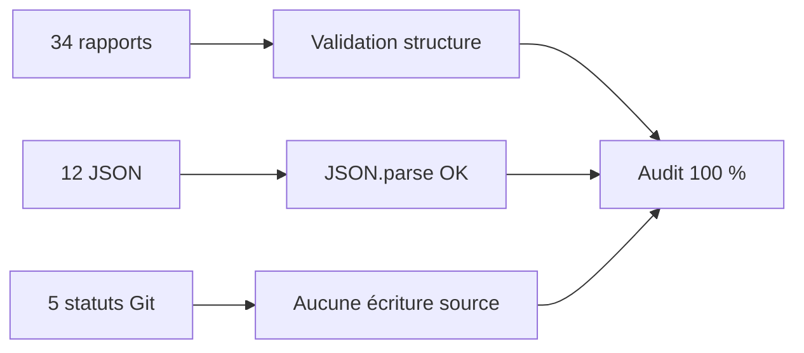

# 33 — Checklist finale

<!-- current-state-2026-07-13:start -->

## Mise à jour code courant — 13 juillet 2026

- PAGE-049, COMP-137, API-157 à API-160, COL-030 à COL-032, DATASET-020 et WORKFLOW-016 possèdent une fiche spécialisée existante.
- Les registres JSON, le mapping documentaire, les rapports d’audit et DOC-011 à DOC-035 utilisent les volumes courants.
- Les liens internes et les sources sont contrôlés par le script de vérification Foundation.

<!-- current-state-2026-07-13:end -->

## 1. Objectif

Vérifier explicitement chaque condition de fin du prompt avant de déclarer l'audit terminé.

## 2. Portée

Rapports, registres, inventaires, structure standard, validité JSON et intégrité en lecture seule des cinq dépôts.

## 3. Méthode

Contrôles automatisés par `JSON.parse`, scan des frontmatters et sections, comptage des fichiers, régénération de l'index et lecture des cinq `git status --short`.

## 4. Résultats

### Checklist imposée

- [x] Tous les repositories ont été analysés.
- [x] Toutes les pages sont listées.
- [x] Tous les composants sont listés.
- [x] Tous les hooks sont listés.
- [x] Tous les contexts sont listés.
- [x] Tous les services sont listés.
- [x] Tous les Providers sont listés.
- [x] Tous les datasets sont listés.
- [x] Toutes les routes API sont listées.
- [x] Toutes les collections MongoDB sont listées.
- [x] Tous les assets sont cartographiés.
- [x] Tous les caches sont documentés.
- [x] Public/private est documenté.
- [x] Responsive est documenté.
- [x] Accessibilité est documentée.
- [x] Performance est documentée.
- [x] Sécurité est documentée.
- [x] Tests sont documentés.
- [x] Déploiement est documenté.
- [x] Dépendances sont documentées.
- [x] Tous les registres JSON sont valides.
- [x] `00-progress.md` indique 100 %.
- [x] `33-final-checklist.md` est complet.
- [x] Aucune modification hors `audit-documentation/` n’a été effectuée.

## 5. Tableaux

### Contrôles quantitatifs

| Contrôle | Attendu | Obtenu | Résultat |
|---|---:|---:|---|
| Rapports Markdown | 00–33 | 34 | OK |
| Registres JSON | 12 | 12 | OK |
| JSON parseables | 12 | 12 | OK |
| Rapports sectoriels 01–32 avec 12 sections | 32 | 32 | OK |
| Repositories | 5 | 5 | OK |
| Pages/sections | exhaustif code | 48 | OK |
| Composants | exhaustif registre | 136 | OK |
| Routes | exhaustif code | 156 | OK |
| Collections | exhaustif code | 29 | OK |
| Dépendances | graphe sans appel API non résolu | 854 / 0 non résolu | OK |
| Documents futurs | familles minimales présentes | 555 | OK |

### Intégrité des dépôts sources

| Dépôt | Statut final observé | Attribution |
|---|---|---|
| Dashboard Admin | propre | aucune écriture audit |
| Landing-Page-PogoApi | propre | aucune écriture audit |
| PokemonGo-API- | `.DS_Store` modifié | préexistant |
| PokemonGo-Data | `.DS_Store` non suivi | préexistant |
| PokemonGo-Assets-API | `.DS_Store` modifié | préexistant |

## 6. Diagrammes Mermaid

## 7. Fichiers sources

- `00-progress.md` — 100 %.
- `01-executive-summary.md` — synthèse finale.
- `02-repository-map.md` à `31-gaps-and-technical-debt.md` — analyses.
- `32-final-index.md` — index 1 206 lignes.
- `registries/*.json` — douze registres valides.

## 8. Incohérences

Le prompt demande une conclusion exhaustive mais interdit les mutations et impose de déclarer les informations introuvables. La clôture est donc **complète code-only**, pas une certification de l'état Vercel/MongoDB réel.

## 9. Informations manquantes

Les limitations externes sont centralisées dans `31-gaps-and-technical-debt.md` sous INFO-001 à INFO-012. Elles ne sont ni masquées ni transformées en hypothèses.

## 10. Risques

La checklist valide la complétude documentaire, pas la résolution des 52 dettes/risques. DEBT-001 à DEBT-005 restent critiques ou à vérifier immédiatement.

## 11. Mapping documentaire

Cette checklist ferme DOC-035 et renvoie au registre `documentation-map.json` pour les futures productions DOC/PAGE/COMP/API/COL/etc.

## 12. État de progression

**Audit terminé — 100 % — lecture seule respectée.**
