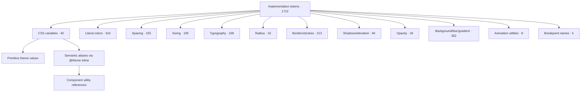

# MatWeb Innovation — Dashboard Admin Design System Audit

Official reverse-engineered technical specification of the current Dashboard Admin implementation. No source code was modified; no redesign, optimization, refactor or simplification is proposed.

## Audit summary

| Metric | Total | Definition |
|---|---|---|
| Components | 325 | Distinct AST component definitions plus compatibility component paths |
| Implementation component definitions | 267 | Uppercase React definitions containing JSX |
| Compatibility component paths | 58 | Callable re-export identities linked to canonical definitions |
| Variants | 90 | Explicit prop/value variant pairs statically detected |
| States | 1492 | Detected component-state pairs from the standard state vocabulary |
| Design tokens | 1712 | Unique implementation token records across CSS variables, literals and utility families |
| CSS variables | 40 | Unique custom property names |
| Tailwind utilities | 1542 | Unique Tailwind-style class tokens after custom-class separation |
| Icons | 212 | Unique Lucide imports plus icon-like public asset files |
| Animations | 13 | Unique keyframe, CSS declaration and utility animation patterns |
| Pages | 20 | App Router page files |
| Layouts | 2 | App Router layout files |
| Reusable patterns | 497 | Repeated exact className combinations plus lowercase JSX render helpers |
| Public assets | 385 | All files under public, including non-visual files |
| Component dependency edges | 570 | Statically resolved local render/re-export relations |

Counts are exact for the stated extraction definitions. Runtime-only variants or states: Not found.

## Table of contents

### Foundations

1. [Project architecture](./foundations/01-project-architecture.md)
2. [Folder structure, routing and layouts](./foundations/02-folder-routing-layouts.md)
3. [Color and theme tokens](./foundations/03-color-and-theme-tokens.md)
4. [Typography](./foundations/04-typography.md)
5. [Spacing, sizing and grid](./foundations/05-spacing-sizing-grid.md)
6. [Radius, borders and opacity](./foundations/06-radius-border-opacity.md)
7. [Elevation and effects](./foundations/07-elevation-effects-backgrounds.md)
8. [Motion and transitions](./foundations/08-motion-transitions.md)
9. [Responsive system](./foundations/09-responsive-system.md)
10. [Icons and complete assets](./foundations/10-icons-images-assets.md)
11. [Component hierarchy and full dependencies](./foundations/11-component-hierarchy-dependencies.md)
12. [Interaction state model](./foundations/12-interaction-state-model.md)
13. [Accessibility, keyboard and focus](./foundations/13-accessibility-keyboard-focus.md)
14. [Tailwind and CSS system](./foundations/14-tailwind-css-system.md)
15. [Reusable patterns](./foundations/15-reusable-patterns.md)
16. [Layering, overflow and scrollbars](./foundations/16-layering-overflow-scrollbars.md)
17. [Figma reconstruction plan](./foundations/17-figma-reconstruction-plan.md)
18. [Global CSS verbatim](./foundations/18-global-css-verbatim.md)
19. [State management and data interactions](./foundations/19-state-management-data-interactions.md)
20. [Methodology and unknowns](./foundations/20-audit-methodology-and-unknowns.md)
21. [Component family coverage and explicit absences](./foundations/21-component-family-coverage.md)

### Operational indexes

- [Master screenshot checklist](./screenshots/master-component-screenshot-checklist.md)
- [Component registry](./registries/components.json)
- [Token registry](./registries/tokens.json)
- [Tailwind utility registry](./registries/tailwind-utilities.json)
- [Assets registry](./registries/assets.json)
- [Icons registry](./registries/icons.json)
- [Animations registry](./registries/animations.json)
- [Reusable patterns registry](./registries/reusable-patterns.json)
- [Pages/layouts registry](./registries/pages.json)
- [Dependency registry](./registries/dependencies.json)
- [Lowercase JSX render helpers](./appendices/jsx-render-helpers.md)

## Component dependency graph

The graph below emphasizes pages, layouts, primitives and high-reuse nodes. The [full graph and adjacency matrix](./foundations/11-component-hierarchy-dependencies.md) contains every resolved edge.

```mermaid
flowchart LR
  MWI_COMP_001["MWI-COMP-001"] --> MWI_COMP_317["MWI-COMP-317"]
  MWI_COMP_001["MWI-COMP-001"] --> MWI_COMP_319["MWI-COMP-319"]
  MWI_COMP_001["MWI-COMP-001"] --> MWI_COMP_320["MWI-COMP-320"]
  MWI_COMP_001["MWI-COMP-001"] --> MWI_COMP_321["MWI-COMP-321"]
  MWI_COMP_001["MWI-COMP-001"] --> MWI_COMP_322["MWI-COMP-322"]
  MWI_COMP_002["MWI-COMP-002"] --> MWI_COMP_246["MWI-COMP-246"]
  MWI_COMP_003["MWI-COMP-003"] --> MWI_COMP_073["MWI-COMP-073"]
  MWI_COMP_004["MWI-COMP-004"] --> MWI_COMP_241["MWI-COMP-241"]
  MWI_COMP_005["MWI-COMP-005"] --> MWI_COMP_079["MWI-COMP-079"]
  MWI_COMP_006["MWI-COMP-006"] --> MWI_COMP_081["MWI-COMP-081"]
  MWI_COMP_007["MWI-COMP-007"] --> MWI_COMP_082["MWI-COMP-082"]
  MWI_COMP_008["MWI-COMP-008"] --> MWI_COMP_092["MWI-COMP-092"]
  MWI_COMP_009["MWI-COMP-009"] --> MWI_COMP_086["MWI-COMP-086"]
  MWI_COMP_010["MWI-COMP-010"] --> MWI_COMP_030["MWI-COMP-030"]
  MWI_COMP_011["MWI-COMP-011"] --> MWI_COMP_026["MWI-COMP-026"]
  MWI_COMP_012["MWI-COMP-012"] --> MWI_COMP_190["MWI-COMP-190"]
  MWI_COMP_013["MWI-COMP-013"] --> MWI_COMP_191["MWI-COMP-191"]
  MWI_COMP_013["MWI-COMP-013"] --> MWI_COMP_193["MWI-COMP-193"]
  MWI_COMP_013["MWI-COMP-013"] --> MWI_COMP_199["MWI-COMP-199"]
  MWI_COMP_014["MWI-COMP-014"] --> MWI_COMP_041["MWI-COMP-041"]
  MWI_COMP_015["MWI-COMP-015"] --> MWI_COMP_237["MWI-COMP-237"]
  MWI_COMP_015["MWI-COMP-015"] --> MWI_COMP_317["MWI-COMP-317"]
  MWI_COMP_015["MWI-COMP-015"] --> MWI_COMP_318["MWI-COMP-318"]
  MWI_COMP_015["MWI-COMP-015"] --> MWI_COMP_319["MWI-COMP-319"]
  MWI_COMP_015["MWI-COMP-015"] --> MWI_COMP_323["MWI-COMP-323"]
  MWI_COMP_015["MWI-COMP-015"] --> MWI_COMP_324["MWI-COMP-324"]
  MWI_COMP_015["MWI-COMP-015"] --> MWI_COMP_325["MWI-COMP-325"]
  MWI_COMP_016["MWI-COMP-016"] --> MWI_COMP_043["MWI-COMP-043"]
  MWI_COMP_017["MWI-COMP-017"] --> MWI_COMP_087["MWI-COMP-087"]
  MWI_COMP_018["MWI-COMP-018"] --> MWI_COMP_252["MWI-COMP-252"]
  MWI_COMP_019["MWI-COMP-019"] --> MWI_COMP_028["MWI-COMP-028"]
  MWI_COMP_020["MWI-COMP-020"] --> MWI_COMP_088["MWI-COMP-088"]
  MWI_COMP_021["MWI-COMP-021"] --> MWI_COMP_093["MWI-COMP-093"]
  MWI_COMP_022["MWI-COMP-022"] --> MWI_COMP_317["MWI-COMP-317"]
  MWI_COMP_022["MWI-COMP-022"] --> MWI_COMP_318["MWI-COMP-318"]
  MWI_COMP_022["MWI-COMP-022"] --> MWI_COMP_319["MWI-COMP-319"]
  MWI_COMP_022["MWI-COMP-022"] --> MWI_COMP_323["MWI-COMP-323"]
  MWI_COMP_023["MWI-COMP-023"] --> MWI_COMP_317["MWI-COMP-317"]
  MWI_COMP_023["MWI-COMP-023"] --> MWI_COMP_319["MWI-COMP-319"]
  MWI_COMP_023["MWI-COMP-023"] --> MWI_COMP_320["MWI-COMP-320"]
  MWI_COMP_023["MWI-COMP-023"] --> MWI_COMP_321["MWI-COMP-321"]
  MWI_COMP_023["MWI-COMP-023"] --> MWI_COMP_322["MWI-COMP-322"]
  MWI_COMP_025["MWI-COMP-025"] --> MWI_COMP_319["MWI-COMP-319"]
  MWI_COMP_026["MWI-COMP-026"] --> MWI_COMP_317["MWI-COMP-317"]
  MWI_COMP_026["MWI-COMP-026"] --> MWI_COMP_318["MWI-COMP-318"]
  MWI_COMP_026["MWI-COMP-026"] --> MWI_COMP_319["MWI-COMP-319"]
  MWI_COMP_026["MWI-COMP-026"] --> MWI_COMP_323["MWI-COMP-323"]
  MWI_COMP_028["MWI-COMP-028"] --> MWI_COMP_238["MWI-COMP-238"]
  MWI_COMP_028["MWI-COMP-028"] --> MWI_COMP_317["MWI-COMP-317"]
  MWI_COMP_028["MWI-COMP-028"] --> MWI_COMP_318["MWI-COMP-318"]
  MWI_COMP_028["MWI-COMP-028"] --> MWI_COMP_319["MWI-COMP-319"]
  MWI_COMP_028["MWI-COMP-028"] --> MWI_COMP_323["MWI-COMP-323"]
  MWI_COMP_028["MWI-COMP-028"] --> MWI_COMP_324["MWI-COMP-324"]
  MWI_COMP_030["MWI-COMP-030"] --> MWI_COMP_238["MWI-COMP-238"]
  MWI_COMP_030["MWI-COMP-030"] --> MWI_COMP_317["MWI-COMP-317"]
  MWI_COMP_030["MWI-COMP-030"] --> MWI_COMP_318["MWI-COMP-318"]
  MWI_COMP_030["MWI-COMP-030"] --> MWI_COMP_319["MWI-COMP-319"]
  MWI_COMP_033["MWI-COMP-033"] --> MWI_COMP_319["MWI-COMP-319"]
  MWI_COMP_041["MWI-COMP-041"] --> MWI_COMP_317["MWI-COMP-317"]
  MWI_COMP_041["MWI-COMP-041"] --> MWI_COMP_318["MWI-COMP-318"]
  MWI_COMP_041["MWI-COMP-041"] --> MWI_COMP_319["MWI-COMP-319"]
  MWI_COMP_041["MWI-COMP-041"] --> MWI_COMP_320["MWI-COMP-320"]
  MWI_COMP_041["MWI-COMP-041"] --> MWI_COMP_321["MWI-COMP-321"]
  MWI_COMP_041["MWI-COMP-041"] --> MWI_COMP_322["MWI-COMP-322"]
  MWI_COMP_043["MWI-COMP-043"] --> MWI_COMP_317["MWI-COMP-317"]
  MWI_COMP_043["MWI-COMP-043"] --> MWI_COMP_318["MWI-COMP-318"]
  MWI_COMP_043["MWI-COMP-043"] --> MWI_COMP_319["MWI-COMP-319"]
  MWI_COMP_043["MWI-COMP-043"] --> MWI_COMP_323["MWI-COMP-323"]
  MWI_COMP_044["MWI-COMP-044"] --> MWI_COMP_318["MWI-COMP-318"]
  MWI_COMP_044["MWI-COMP-044"] --> MWI_COMP_323["MWI-COMP-323"]
  MWI_COMP_044["MWI-COMP-044"] --> MWI_COMP_324["MWI-COMP-324"]
  MWI_COMP_044["MWI-COMP-044"] --> MWI_COMP_325["MWI-COMP-325"]
  MWI_COMP_051["MWI-COMP-051"] --> MWI_COMP_131["MWI-COMP-131"]
  MWI_COMP_051["MWI-COMP-051"] --> MWI_COMP_155["MWI-COMP-155"]
  MWI_COMP_064["MWI-COMP-064"] --> MWI_COMP_063["MWI-COMP-063"]
  MWI_COMP_066["MWI-COMP-066"] --> MWI_COMP_063["MWI-COMP-063"]
  MWI_COMP_068["MWI-COMP-068"] --> MWI_COMP_063["MWI-COMP-063"]
  MWI_COMP_070["MWI-COMP-070"] --> MWI_COMP_063["MWI-COMP-063"]
  MWI_COMP_071["MWI-COMP-071"] --> MWI_COMP_063["MWI-COMP-063"]
  MWI_COMP_072["MWI-COMP-072"] --> MWI_COMP_063["MWI-COMP-063"]
  MWI_COMP_073["MWI-COMP-073"] --> MWI_COMP_237["MWI-COMP-237"]
  MWI_COMP_073["MWI-COMP-073"] --> MWI_COMP_317["MWI-COMP-317"]
  MWI_COMP_073["MWI-COMP-073"] --> MWI_COMP_318["MWI-COMP-318"]
  MWI_COMP_073["MWI-COMP-073"] --> MWI_COMP_319["MWI-COMP-319"]
  MWI_COMP_073["MWI-COMP-073"] --> MWI_COMP_323["MWI-COMP-323"]
  MWI_COMP_073["MWI-COMP-073"] --> MWI_COMP_324["MWI-COMP-324"]
  MWI_COMP_073["MWI-COMP-073"] --> MWI_COMP_325["MWI-COMP-325"]
  MWI_COMP_077["MWI-COMP-077"] --> MWI_COMP_317["MWI-COMP-317"]
  MWI_COMP_077["MWI-COMP-077"] --> MWI_COMP_319["MWI-COMP-319"]
  MWI_COMP_078["MWI-COMP-078"] --> MWI_COMP_317["MWI-COMP-317"]
  MWI_COMP_079["MWI-COMP-079"] --> MWI_COMP_317["MWI-COMP-317"]
  MWI_COMP_079["MWI-COMP-079"] --> MWI_COMP_318["MWI-COMP-318"]
  MWI_COMP_079["MWI-COMP-079"] --> MWI_COMP_319["MWI-COMP-319"]
  MWI_COMP_079["MWI-COMP-079"] --> MWI_COMP_320["MWI-COMP-320"]
  MWI_COMP_079["MWI-COMP-079"] --> MWI_COMP_321["MWI-COMP-321"]
  MWI_COMP_079["MWI-COMP-079"] --> MWI_COMP_322["MWI-COMP-322"]
  MWI_COMP_080["MWI-COMP-080"] --> MWI_COMP_319["MWI-COMP-319"]
  MWI_COMP_081["MWI-COMP-081"] --> MWI_COMP_317["MWI-COMP-317"]
  MWI_COMP_081["MWI-COMP-081"] --> MWI_COMP_318["MWI-COMP-318"]
  MWI_COMP_081["MWI-COMP-081"] --> MWI_COMP_319["MWI-COMP-319"]
  MWI_COMP_081["MWI-COMP-081"] --> MWI_COMP_320["MWI-COMP-320"]
  MWI_COMP_081["MWI-COMP-081"] --> MWI_COMP_321["MWI-COMP-321"]
  MWI_COMP_081["MWI-COMP-081"] --> MWI_COMP_322["MWI-COMP-322"]
  MWI_COMP_082["MWI-COMP-082"] --> MWI_COMP_237["MWI-COMP-237"]
  MWI_COMP_082["MWI-COMP-082"] --> MWI_COMP_317["MWI-COMP-317"]
  MWI_COMP_082["MWI-COMP-082"] --> MWI_COMP_318["MWI-COMP-318"]
  MWI_COMP_082["MWI-COMP-082"] --> MWI_COMP_319["MWI-COMP-319"]
  MWI_COMP_082["MWI-COMP-082"] --> MWI_COMP_323["MWI-COMP-323"]
  MWI_COMP_082["MWI-COMP-082"] --> MWI_COMP_324["MWI-COMP-324"]
  MWI_COMP_082["MWI-COMP-082"] --> MWI_COMP_325["MWI-COMP-325"]
  MWI_COMP_083["MWI-COMP-083"] --> MWI_COMP_317["MWI-COMP-317"]
  MWI_COMP_083["MWI-COMP-083"] --> MWI_COMP_319["MWI-COMP-319"]
  MWI_COMP_086["MWI-COMP-086"] --> MWI_COMP_237["MWI-COMP-237"]
  MWI_COMP_086["MWI-COMP-086"] --> MWI_COMP_317["MWI-COMP-317"]
  MWI_COMP_086["MWI-COMP-086"] --> MWI_COMP_318["MWI-COMP-318"]
  MWI_COMP_086["MWI-COMP-086"] --> MWI_COMP_319["MWI-COMP-319"]
  MWI_COMP_086["MWI-COMP-086"] --> MWI_COMP_323["MWI-COMP-323"]
  MWI_COMP_086["MWI-COMP-086"] --> MWI_COMP_324["MWI-COMP-324"]
  MWI_COMP_087["MWI-COMP-087"] --> MWI_COMP_237["MWI-COMP-237"]
  MWI_COMP_087["MWI-COMP-087"] --> MWI_COMP_317["MWI-COMP-317"]
  MWI_COMP_087["MWI-COMP-087"] --> MWI_COMP_318["MWI-COMP-318"]
  MWI_COMP_087["MWI-COMP-087"] --> MWI_COMP_319["MWI-COMP-319"]
  MWI_COMP_087["MWI-COMP-087"] --> MWI_COMP_323["MWI-COMP-323"]
  MWI_COMP_088["MWI-COMP-088"] --> MWI_COMP_317["MWI-COMP-317"]
  MWI_COMP_088["MWI-COMP-088"] --> MWI_COMP_318["MWI-COMP-318"]
  MWI_COMP_088["MWI-COMP-088"] --> MWI_COMP_319["MWI-COMP-319"]
  MWI_COMP_088["MWI-COMP-088"] --> MWI_COMP_323["MWI-COMP-323"]
  MWI_COMP_088["MWI-COMP-088"] --> MWI_COMP_324["MWI-COMP-324"]
  MWI_COMP_089["MWI-COMP-089"] --> MWI_COMP_318["MWI-COMP-318"]
  MWI_COMP_092["MWI-COMP-092"] --> MWI_COMP_094["MWI-COMP-094"]
  MWI_COMP_092["MWI-COMP-092"] --> MWI_COMP_122["MWI-COMP-122"]
  MWI_COMP_092["MWI-COMP-092"] --> MWI_COMP_124["MWI-COMP-124"]
  MWI_COMP_092["MWI-COMP-092"] --> MWI_COMP_236["MWI-COMP-236"]
  MWI_COMP_095["MWI-COMP-095"] --> MWI_COMP_317["MWI-COMP-317"]
  MWI_COMP_095["MWI-COMP-095"] --> MWI_COMP_319["MWI-COMP-319"]
  MWI_COMP_096["MWI-COMP-096"] --> MWI_COMP_319["MWI-COMP-319"]
  MWI_COMP_097["MWI-COMP-097"] --> MWI_COMP_319["MWI-COMP-319"]
  MWI_COMP_098["MWI-COMP-098"] --> MWI_COMP_317["MWI-COMP-317"]
  MWI_COMP_098["MWI-COMP-098"] --> MWI_COMP_325["MWI-COMP-325"]
  MWI_COMP_099["MWI-COMP-099"] --> MWI_COMP_104["MWI-COMP-104"]
  MWI_COMP_099["MWI-COMP-099"] --> MWI_COMP_105["MWI-COMP-105"]
  MWI_COMP_100["MWI-COMP-100"] --> MWI_COMP_104["MWI-COMP-104"]
  MWI_COMP_100["MWI-COMP-100"] --> MWI_COMP_105["MWI-COMP-105"]
  MWI_COMP_101["MWI-COMP-101"] --> MWI_COMP_104["MWI-COMP-104"]
  MWI_COMP_101["MWI-COMP-101"] --> MWI_COMP_105["MWI-COMP-105"]
  MWI_COMP_101["MWI-COMP-101"] --> MWI_COMP_317["MWI-COMP-317"]
  MWI_COMP_101["MWI-COMP-101"] --> MWI_COMP_318["MWI-COMP-318"]
  MWI_COMP_101["MWI-COMP-101"] --> MWI_COMP_324["MWI-COMP-324"]
  MWI_COMP_102["MWI-COMP-102"] --> MWI_COMP_104["MWI-COMP-104"]
  MWI_COMP_102["MWI-COMP-102"] --> MWI_COMP_105["MWI-COMP-105"]
  MWI_COMP_103["MWI-COMP-103"] --> MWI_COMP_104["MWI-COMP-104"]
  MWI_COMP_103["MWI-COMP-103"] --> MWI_COMP_105["MWI-COMP-105"]
  MWI_COMP_104["MWI-COMP-104"] --> MWI_COMP_317["MWI-COMP-317"]
  MWI_COMP_105["MWI-COMP-105"] --> MWI_COMP_318["MWI-COMP-318"]
  MWI_COMP_111["MWI-COMP-111"] --> MWI_COMP_317["MWI-COMP-317"]
  MWI_COMP_115["MWI-COMP-115"] --> MWI_COMP_317["MWI-COMP-317"]
  MWI_COMP_115["MWI-COMP-115"] --> MWI_COMP_318["MWI-COMP-318"]
  MWI_COMP_115["MWI-COMP-115"] --> MWI_COMP_325["MWI-COMP-325"]
  MWI_COMP_118["MWI-COMP-118"] --> MWI_COMP_319["MWI-COMP-319"]
  MWI_COMP_119["MWI-COMP-119"] --> MWI_COMP_317["MWI-COMP-317"]
  MWI_COMP_119["MWI-COMP-119"] --> MWI_COMP_319["MWI-COMP-319"]
  MWI_COMP_121["MWI-COMP-121"] --> MWI_COMP_318["MWI-COMP-318"]
  MWI_COMP_122["MWI-COMP-122"] --> MWI_COMP_123["MWI-COMP-123"]
  MWI_COMP_122["MWI-COMP-122"] --> MWI_COMP_317["MWI-COMP-317"]
  MWI_COMP_122["MWI-COMP-122"] --> MWI_COMP_318["MWI-COMP-318"]
  MWI_COMP_124["MWI-COMP-124"] --> MWI_COMP_121["MWI-COMP-121"]
  MWI_COMP_124["MWI-COMP-124"] --> MWI_COMP_318["MWI-COMP-318"]
  MWI_COMP_126["MWI-COMP-126"] --> MWI_COMP_131["MWI-COMP-131"]
  MWI_COMP_127["MWI-COMP-127"] --> MWI_COMP_131["MWI-COMP-131"]
  MWI_COMP_127["MWI-COMP-127"] --> MWI_COMP_133["MWI-COMP-133"]
  MWI_COMP_127["MWI-COMP-127"] --> MWI_COMP_238["MWI-COMP-238"]
  MWI_COMP_130["MWI-COMP-130"] --> MWI_COMP_131["MWI-COMP-131"]
  MWI_COMP_138["MWI-COMP-138"] --> MWI_COMP_131["MWI-COMP-131"]
  MWI_COMP_143["MWI-COMP-143"] --> MWI_COMP_131["MWI-COMP-131"]
  MWI_COMP_143["MWI-COMP-143"] --> MWI_COMP_133["MWI-COMP-133"]
  MWI_COMP_143["MWI-COMP-143"] --> MWI_COMP_325["MWI-COMP-325"]
  MWI_COMP_144["MWI-COMP-144"] --> MWI_COMP_131["MWI-COMP-131"]
  MWI_COMP_148["MWI-COMP-148"] --> MWI_COMP_131["MWI-COMP-131"]
  MWI_COMP_160["MWI-COMP-160"] --> MWI_COMP_156["MWI-COMP-156"]
  MWI_COMP_166["MWI-COMP-166"] --> MWI_COMP_156["MWI-COMP-156"]
  MWI_COMP_167["MWI-COMP-167"] --> MWI_COMP_156["MWI-COMP-156"]
  MWI_COMP_167["MWI-COMP-167"] --> MWI_COMP_161["MWI-COMP-161"]
  MWI_COMP_169["MWI-COMP-169"] --> MWI_COMP_156["MWI-COMP-156"]
  MWI_COMP_169["MWI-COMP-169"] --> MWI_COMP_161["MWI-COMP-161"]
  MWI_COMP_170["MWI-COMP-170"] --> MWI_COMP_156["MWI-COMP-156"]
  MWI_COMP_170["MWI-COMP-170"] --> MWI_COMP_161["MWI-COMP-161"]
  MWI_COMP_172["MWI-COMP-172"] --> MWI_COMP_156["MWI-COMP-156"]
  MWI_COMP_172["MWI-COMP-172"] --> MWI_COMP_161["MWI-COMP-161"]
  MWI_COMP_174["MWI-COMP-174"] --> MWI_COMP_156["MWI-COMP-156"]
  MWI_COMP_174["MWI-COMP-174"] --> MWI_COMP_161["MWI-COMP-161"]
  MWI_COMP_175["MWI-COMP-175"] --> MWI_COMP_156["MWI-COMP-156"]
  MWI_COMP_177["MWI-COMP-177"] --> MWI_COMP_156["MWI-COMP-156"]
  MWI_COMP_178["MWI-COMP-178"] --> MWI_COMP_156["MWI-COMP-156"]
  MWI_COMP_178["MWI-COMP-178"] --> MWI_COMP_161["MWI-COMP-161"]
  MWI_COMP_181["MWI-COMP-181"] --> MWI_COMP_140["MWI-COMP-140"]
  MWI_COMP_183["MWI-COMP-183"] --> MWI_COMP_131["MWI-COMP-131"]
  MWI_COMP_183["MWI-COMP-183"] --> MWI_COMP_133["MWI-COMP-133"]
  MWI_COMP_183["MWI-COMP-183"] --> MWI_COMP_154["MWI-COMP-154"]
  MWI_COMP_183["MWI-COMP-183"] --> MWI_COMP_155["MWI-COMP-155"]
  MWI_COMP_187["MWI-COMP-187"] --> MWI_COMP_140["MWI-COMP-140"]
  MWI_COMP_189["MWI-COMP-189"] --> MWI_COMP_131["MWI-COMP-131"]
  MWI_COMP_189["MWI-COMP-189"] --> MWI_COMP_133["MWI-COMP-133"]
  MWI_COMP_189["MWI-COMP-189"] --> MWI_COMP_154["MWI-COMP-154"]
  MWI_COMP_189["MWI-COMP-189"] --> MWI_COMP_155["MWI-COMP-155"]
  MWI_COMP_191["MWI-COMP-191"] --> MWI_COMP_317["MWI-COMP-317"]
  MWI_COMP_191["MWI-COMP-191"] --> MWI_COMP_318["MWI-COMP-318"]
  MWI_COMP_191["MWI-COMP-191"] --> MWI_COMP_319["MWI-COMP-319"]
  MWI_COMP_191["MWI-COMP-191"] --> MWI_COMP_320["MWI-COMP-320"]
  MWI_COMP_191["MWI-COMP-191"] --> MWI_COMP_321["MWI-COMP-321"]
  MWI_COMP_191["MWI-COMP-191"] --> MWI_COMP_322["MWI-COMP-322"]
  MWI_COMP_193["MWI-COMP-193"] --> MWI_COMP_318["MWI-COMP-318"]
  MWI_COMP_199["MWI-COMP-199"] --> MWI_COMP_317["MWI-COMP-317"]
  MWI_COMP_199["MWI-COMP-199"] --> MWI_COMP_319["MWI-COMP-319"]
  MWI_COMP_199["MWI-COMP-199"] --> MWI_COMP_320["MWI-COMP-320"]
  MWI_COMP_199["MWI-COMP-199"] --> MWI_COMP_321["MWI-COMP-321"]
  MWI_COMP_199["MWI-COMP-199"] --> MWI_COMP_322["MWI-COMP-322"]
  MWI_COMP_199["MWI-COMP-199"] --> MWI_COMP_323["MWI-COMP-323"]
  MWI_COMP_201["MWI-COMP-201"] --> MWI_COMP_140["MWI-COMP-140"]
  MWI_COMP_202["MWI-COMP-202"] --> MWI_COMP_140["MWI-COMP-140"]
  MWI_COMP_204["MWI-COMP-204"] --> MWI_COMP_140["MWI-COMP-140"]
  MWI_COMP_206["MWI-COMP-206"] --> MWI_COMP_131["MWI-COMP-131"]
  MWI_COMP_206["MWI-COMP-206"] --> MWI_COMP_140["MWI-COMP-140"]
  MWI_COMP_206["MWI-COMP-206"] --> MWI_COMP_154["MWI-COMP-154"]
  MWI_COMP_206["MWI-COMP-206"] --> MWI_COMP_155["MWI-COMP-155"]
  MWI_COMP_208["MWI-COMP-208"] --> MWI_COMP_140["MWI-COMP-140"]
  MWI_COMP_210["MWI-COMP-210"] --> MWI_COMP_131["MWI-COMP-131"]
  MWI_COMP_210["MWI-COMP-210"] --> MWI_COMP_133["MWI-COMP-133"]
  MWI_COMP_210["MWI-COMP-210"] --> MWI_COMP_154["MWI-COMP-154"]
  MWI_COMP_210["MWI-COMP-210"] --> MWI_COMP_155["MWI-COMP-155"]
  MWI_COMP_218["MWI-COMP-218"] --> MWI_COMP_131["MWI-COMP-131"]
  MWI_COMP_218["MWI-COMP-218"] --> MWI_COMP_133["MWI-COMP-133"]
  MWI_COMP_218["MWI-COMP-218"] --> MWI_COMP_154["MWI-COMP-154"]
  MWI_COMP_218["MWI-COMP-218"] --> MWI_COMP_155["MWI-COMP-155"]
  MWI_COMP_224["MWI-COMP-224"] --> MWI_COMP_131["MWI-COMP-131"]
  MWI_COMP_224["MWI-COMP-224"] --> MWI_COMP_133["MWI-COMP-133"]
  MWI_COMP_224["MWI-COMP-224"] --> MWI_COMP_154["MWI-COMP-154"]
  MWI_COMP_224["MWI-COMP-224"] --> MWI_COMP_155["MWI-COMP-155"]
  MWI_COMP_227["MWI-COMP-227"] --> MWI_COMP_133["MWI-COMP-133"]
  MWI_COMP_227["MWI-COMP-227"] --> MWI_COMP_140["MWI-COMP-140"]
  MWI_COMP_229["MWI-COMP-229"] --> MWI_COMP_131["MWI-COMP-131"]
  MWI_COMP_229["MWI-COMP-229"] --> MWI_COMP_133["MWI-COMP-133"]
  MWI_COMP_229["MWI-COMP-229"] --> MWI_COMP_140["MWI-COMP-140"]
  MWI_COMP_229["MWI-COMP-229"] --> MWI_COMP_154["MWI-COMP-154"]
  MWI_COMP_229["MWI-COMP-229"] --> MWI_COMP_155["MWI-COMP-155"]
  MWI_COMP_229["MWI-COMP-229"] --> MWI_COMP_325["MWI-COMP-325"]
  MWI_COMP_237["MWI-COMP-237"] --> MWI_COMP_319["MWI-COMP-319"]
  MWI_COMP_240["MWI-COMP-240"] --> MWI_COMP_319["MWI-COMP-319"]
  MWI_COMP_240["MWI-COMP-240"] --> MWI_COMP_320["MWI-COMP-320"]
  MWI_COMP_240["MWI-COMP-240"] --> MWI_COMP_321["MWI-COMP-321"]
  MWI_COMP_240["MWI-COMP-240"] --> MWI_COMP_322["MWI-COMP-322"]
  MWI_COMP_241["MWI-COMP-241"] --> MWI_COMP_238["MWI-COMP-238"]
  MWI_COMP_241["MWI-COMP-241"] --> MWI_COMP_318["MWI-COMP-318"]
  MWI_COMP_241["MWI-COMP-241"] --> MWI_COMP_319["MWI-COMP-319"]
  MWI_COMP_241["MWI-COMP-241"] --> MWI_COMP_320["MWI-COMP-320"]
  MWI_COMP_241["MWI-COMP-241"] --> MWI_COMP_321["MWI-COMP-321"]
  MWI_COMP_241["MWI-COMP-241"] --> MWI_COMP_322["MWI-COMP-322"]
  MWI_COMP_242["MWI-COMP-242"] --> MWI_COMP_319["MWI-COMP-319"]
  MWI_COMP_246["MWI-COMP-246"] --> MWI_COMP_238["MWI-COMP-238"]
  MWI_COMP_246["MWI-COMP-246"] --> MWI_COMP_319["MWI-COMP-319"]
  MWI_COMP_246["MWI-COMP-246"] --> MWI_COMP_320["MWI-COMP-320"]
  MWI_COMP_246["MWI-COMP-246"] --> MWI_COMP_321["MWI-COMP-321"]
  MWI_COMP_246["MWI-COMP-246"] --> MWI_COMP_322["MWI-COMP-322"]
  MWI_COMP_249["MWI-COMP-249"] --> MWI_COMP_319["MWI-COMP-319"]
  MWI_COMP_250["MWI-COMP-250"] --> MWI_COMP_317["MWI-COMP-317"]
  MWI_COMP_250["MWI-COMP-250"] --> MWI_COMP_319["MWI-COMP-319"]
  MWI_COMP_250["MWI-COMP-250"] --> MWI_COMP_320["MWI-COMP-320"]
  MWI_COMP_250["MWI-COMP-250"] --> MWI_COMP_321["MWI-COMP-321"]
  MWI_COMP_250["MWI-COMP-250"] --> MWI_COMP_322["MWI-COMP-322"]
  MWI_COMP_251["MWI-COMP-251"] --> MWI_COMP_319["MWI-COMP-319"]
  MWI_COMP_252["MWI-COMP-252"] --> MWI_COMP_237["MWI-COMP-237"]
  MWI_COMP_252["MWI-COMP-252"] --> MWI_COMP_317["MWI-COMP-317"]
  MWI_COMP_252["MWI-COMP-252"] --> MWI_COMP_318["MWI-COMP-318"]
  MWI_COMP_252["MWI-COMP-252"] --> MWI_COMP_319["MWI-COMP-319"]
  MWI_COMP_252["MWI-COMP-252"] --> MWI_COMP_323["MWI-COMP-323"]
  MWI_COMP_252["MWI-COMP-252"] --> MWI_COMP_325["MWI-COMP-325"]
  MWI_COMP_253["MWI-COMP-253"] --> MWI_COMP_319["MWI-COMP-319"]
  MWI_COMP_255["MWI-COMP-255"] --> MWI_COMP_318["MWI-COMP-318"]
  MWI_COMP_255["MWI-COMP-255"] --> MWI_COMP_319["MWI-COMP-319"]
  MWI_COMP_256["MWI-COMP-256"] --> MWI_COMP_318["MWI-COMP-318"]
  MWI_COMP_256["MWI-COMP-256"] --> MWI_COMP_323["MWI-COMP-323"]
  MWI_COMP_258["MWI-COMP-258"] --> MWI_COMP_323["MWI-COMP-323"]
  MWI_COMP_259["MWI-COMP-259"] --> MWI_COMP_324["MWI-COMP-324"]
  MWI_COMP_275["MWI-COMP-275"] --> MWI_COMP_237["MWI-COMP-237"]
  MWI_COMP_285["MWI-COMP-285"] --> MWI_COMP_238["MWI-COMP-238"]
  MWI_COMP_290["MWI-COMP-290"] --> MWI_COMP_133["MWI-COMP-133"]
  MWI_COMP_298["MWI-COMP-298"] --> MWI_COMP_131["MWI-COMP-131"]
  MWI_COMP_299["MWI-COMP-299"] --> MWI_COMP_140["MWI-COMP-140"]
```

## Component hierarchy

| ID | Name | Category | Visibility | Parents | Children | Figma score | Document |
|---|---|---|---|---|---|---|---|
| MWI-COMP-001 | AccountPage | Page | exported | 0 | 5 | 40 | [spec](./components/app-dashboard-account-page-accountpage.md) |
| MWI-COMP-002 | AnalyticsPage | Page | exported | 0 | 1 | 40 | [spec](./components/app-dashboard-analytics-page-analyticspage.md) |
| MWI-COMP-003 | CalendarPage | Page | exported | 0 | 1 | 40 | [spec](./components/app-dashboard-calendar-page-calendarpage.md) |
| MWI-COMP-004 | DatabasePage | Page | exported | 0 | 1 | 40 | [spec](./components/app-dashboard-database-page-databasepage.md) |
| MWI-COMP-005 | JavaScriptExercisesPage | Page | exported | 0 | 1 | 40 | [spec](./components/app-dashboard-exercices-javascript-page-javascriptexercisespage.md) |
| MWI-COMP-006 | JsProgressPage | Page | exported | 0 | 1 | 40 | [spec](./components/app-dashboard-js-progress-page-jsprogresspage.md) |
| MWI-COMP-007 | KanbanPage | Page | exported | 0 | 1 | 40 | [spec](./components/app-dashboard-kanban-page-kanbanpage.md) |
| MWI-COMP-008 | DashboardLayout | Layout | exported | 0 | 1 | 46 | [spec](./components/app-dashboard-layout-dashboardlayout.md) |
| MWI-COMP-009 | NotesPage | Page | exported | 0 | 1 | 40 | [spec](./components/app-dashboard-notes-page-notespage.md) |
| MWI-COMP-010 | DashboardHome | Page | exported | 0 | 1 | 40 | [spec](./components/app-dashboard-page-dashboardhome.md) |
| MWI-COMP-011 | PalettePage | Page | exported | 0 | 1 | 40 | [spec](./components/app-dashboard-palette-page-palettepage.md) |
| MWI-COMP-012 | PokemonAdminPage | Page | exported | 0 | 1 | 40 | [spec](./components/app-dashboard-pokemon-admin-page-pokemonadminpage.md) |
| MWI-COMP-013 | PokemonDocsPage | Page | exported | 0 | 3 | 40 | [spec](./components/app-dashboard-pokemon-docs-page-pokemondocspage.md) |
| MWI-COMP-014 | PomodoroPage | Page | exported | 0 | 1 | 40 | [spec](./components/app-dashboard-pomodoro-page-pomodoropage.md) |
| MWI-COMP-015 | ProjectsPage | Page | exported | 0 | 7 | 40 | [spec](./components/app-dashboard-projects-page-projectspage.md) |
| MWI-COMP-016 | SnippetsPage | Page | exported | 0 | 1 | 40 | [spec](./components/app-dashboard-snippets-page-snippetspage.md) |
| MWI-COMP-017 | TodoPage | Page | exported | 0 | 1 | 40 | [spec](./components/app-dashboard-todo-page-todopage.md) |
| MWI-COMP-018 | DashboardBacklogPage | Page | exported | 0 | 1 | 40 | [spec](./components/app-dashboard-tools-dashboard-backlog-page-dashboardbacklogpage.md) |
| MWI-COMP-019 | ToolsPage | Page | exported | 0 | 1 | 40 | [spec](./components/app-dashboard-tools-page-toolspage.md) |
| MWI-COMP-020 | WriterPage | Page | exported | 0 | 1 | 40 | [spec](./components/app-dashboard-writer-page-writerpage.md) |
| MWI-COMP-021 | RootLayout | Layout | exported | 0 | 1 | 46 | [spec](./components/app-layout-rootlayout.md) |
| MWI-COMP-022 | LoginPage | Page | exported | 0 | 4 | 40 | [spec](./components/app-login-page-loginpage.md) |
| MWI-COMP-023 | PokemonWidget | Component | exported | 1 | 6 | 31 | [spec](./components/components-admin-cards-pokemon-widget-pokemonwidget.md) |
| MWI-COMP-024 | Metric | Internal component | internal | 1 | 0 | 23 | [spec](./components/components-admin-cards-pokemon-widget-metric.md) |
| MWI-COMP-025 | StatCard | Component | exported | 1 | 1 | 31 | [spec](./components/components-admin-cards-stat-card-statcard.md) |
| MWI-COMP-026 | ColorLab | Dashboard feature | exported | 2 | 5 | 34 | [spec](./components/components-admin-dashboard-color-lab-colorlab.md) |
| MWI-COMP-027 | ColorValue | Dashboard internal | internal | 1 | 0 | 18 | [spec](./components/components-admin-dashboard-color-lab-colorvalue.md) |
| MWI-COMP-028 | DailyTools | Dashboard feature | exported | 2 | 7 | 34 | [spec](./components/components-admin-dashboard-daily-tools-dailytools.md) |
| MWI-COMP-029 | ToolHeader | Dashboard internal | internal | 1 | 0 | 18 | [spec](./components/components-admin-dashboard-daily-tools-toolheader.md) |
| MWI-COMP-030 | DashboardHomeLive | Dashboard feature | exported | 2 | 15 | 34 | [spec](./components/components-admin-dashboard-dashboard-home-live-dashboardhomelive.md) |
| MWI-COMP-031 | DailyCodePost | Dashboard internal | internal | 1 | 0 | 18 | [spec](./components/components-admin-dashboard-dashboard-home-live-dailycodepost.md) |
| MWI-COMP-032 | WidgetContent | Dashboard internal | internal | 1 | 0 | 18 | [spec](./components/components-admin-dashboard-dashboard-home-live-widgetcontent.md) |
| MWI-COMP-033 | LiveStat | Dashboard internal | internal | 1 | 1 | 18 | [spec](./components/components-admin-dashboard-dashboard-home-live-livestat.md) |
| MWI-COMP-034 | SignalRow | Dashboard internal | internal | 1 | 0 | 18 | [spec](./components/components-admin-dashboard-dashboard-home-live-signalrow.md) |
| MWI-COMP-035 | MiniMetric | Dashboard internal | internal | 1 | 0 | 18 | [spec](./components/components-admin-dashboard-dashboard-home-live-minimetric.md) |
| MWI-COMP-036 | GenerationBars | Dashboard internal | internal | 1 | 0 | 18 | [spec](./components/components-admin-dashboard-dashboard-home-live-generationbars.md) |
| MWI-COMP-037 | KanbanBars | Dashboard internal | internal | 1 | 1 | 18 | [spec](./components/components-admin-dashboard-dashboard-home-live-kanbanbars.md) |
| MWI-COMP-038 | ActionLink | Dashboard internal | internal | 1 | 0 | 18 | [spec](./components/components-admin-dashboard-dashboard-home-live-actionlink.md) |
| MWI-COMP-039 | ExternalButton | Dashboard internal | internal | 1 | 0 | 18 | [spec](./components/components-admin-dashboard-dashboard-home-live-externalbutton.md) |
| MWI-COMP-040 | EmptyLine | Dashboard internal | internal | 2 | 0 | 21 | [spec](./components/components-admin-dashboard-dashboard-home-live-emptyline.md) |
| MWI-COMP-041 | Pomodoro | Dashboard feature | exported | 2 | 7 | 34 | [spec](./components/components-admin-dashboard-pomodoro-pomodoro.md) |
| MWI-COMP-042 | MiniStat | Dashboard internal | internal | 1 | 0 | 18 | [spec](./components/components-admin-dashboard-pomodoro-ministat.md) |
| MWI-COMP-043 | SnippetVault | Dashboard feature | exported | 2 | 5 | 34 | [spec](./components/components-admin-dashboard-snippet-vault-snippetvault.md) |
| MWI-COMP-044 | SnippetModal | Dashboard internal | internal | 1 | 4 | 18 | [spec](./components/components-admin-dashboard-snippet-vault-snippetmodal.md) |
| MWI-COMP-045 | EventEditorModal | Events feature | exported | 1 | 3 | 31 | [spec](./components/components-admin-events-event-editor-modal-eventeditormodal.md) |
| MWI-COMP-046 | ImportModal | Events feature | exported | 1 | 0 | 31 | [spec](./components/components-admin-events-event-editor-modal-importmodal.md) |
| MWI-COMP-047 | Field | Events internal | internal | 1 | 0 | 18 | [spec](./components/components-admin-events-event-editor-modal-field.md) |
| MWI-COMP-048 | SelectField | Events internal | internal | 1 | 0 | 18 | [spec](./components/components-admin-events-event-editor-modal-selectfield.md) |
| MWI-COMP-049 | Area | Events internal | internal | 1 | 0 | 18 | [spec](./components/components-admin-events-event-editor-modal-area.md) |
| MWI-COMP-050 | EventBannerImage | Events internal | internal | 3 | 0 | 24 | [spec](./components/components-admin-events-events-calendar-panel-eventbannerimage.md) |
| MWI-COMP-051 | EventsCalendarPanel | Events feature | exported | 2 | 9 | 34 | [spec](./components/components-admin-events-events-calendar-panel-eventscalendarpanel.md) |
| MWI-COMP-052 | StatTile | Events internal | internal | 1 | 0 | 18 | [spec](./components/components-admin-events-events-calendar-panel-stattile.md) |
| MWI-COMP-053 | CalendarWeek | Events internal | internal | 1 | 2 | 18 | [spec](./components/components-admin-events-events-calendar-panel-calendarweek.md) |
| MWI-COMP-054 | CalendarDayCell | Events internal | internal | 1 | 1 | 18 | [spec](./components/components-admin-events-events-calendar-panel-calendardaycell.md) |
| MWI-COMP-055 | MultiDaySegment | Events internal | internal | 1 | 0 | 18 | [spec](./components/components-admin-events-events-calendar-panel-multidaysegment.md) |
| MWI-COMP-056 | SingleDayEvent | Events internal | internal | 1 | 0 | 18 | [spec](./components/components-admin-events-events-calendar-panel-singledayevent.md) |
| MWI-COMP-057 | EventGroup | Events internal | internal | 1 | 1 | 18 | [spec](./components/components-admin-events-events-calendar-panel-eventgroup.md) |
| MWI-COMP-058 | TimelineSection | Events internal | internal | 1 | 1 | 18 | [spec](./components/components-admin-events-events-calendar-panel-timelinesection.md) |
| MWI-COMP-059 | TimelineCard | Events internal | internal | 1 | 1 | 18 | [spec](./components/components-admin-events-events-calendar-panel-timelinecard.md) |
| MWI-COMP-060 | EventRow | Events internal | internal | 1 | 0 | 18 | [spec](./components/components-admin-events-events-calendar-panel-eventrow.md) |
| MWI-COMP-061 | TypePills | Events internal | internal | 1 | 0 | 18 | [spec](./components/components-admin-events-events-calendar-panel-typepills.md) |
| MWI-COMP-062 | EventBadge | Events internal | internal | 1 | 0 | 18 | [spec](./components/components-admin-events-events-calendar-panel-eventbadge.md) |
| MWI-COMP-063 | DetailSection | Events internal | internal | 6 | 0 | 33 | [spec](./components/components-admin-events-events-calendar-panel-detailsection.md) |
| MWI-COMP-064 | EventDetailModal | Events internal | internal | 1 | 8 | 18 | [spec](./components/components-admin-events-events-calendar-panel-eventdetailmodal.md) |
| MWI-COMP-065 | InfoPill | Events internal | internal | 1 | 0 | 18 | [spec](./components/components-admin-events-events-calendar-panel-infopill.md) |
| MWI-COMP-066 | EventPokemonGroups | Events internal | internal | 1 | 2 | 18 | [spec](./components/components-admin-events-events-calendar-panel-eventpokemongroups.md) |
| MWI-COMP-067 | PokemonCardGrid | Events internal | internal | 2 | 1 | 21 | [spec](./components/components-admin-events-events-calendar-panel-pokemoncardgrid.md) |
| MWI-COMP-068 | EventScrapedSectionGroup | Events internal | internal | 1 | 2 | 18 | [spec](./components/components-admin-events-events-calendar-panel-eventscrapedsectiongroup.md) |
| MWI-COMP-069 | ScrapedSectionCard | Events internal | internal | 1 | 3 | 18 | [spec](./components/components-admin-events-events-calendar-panel-scrapedsectioncard.md) |
| MWI-COMP-070 | RewardGrid | Events internal | internal | 2 | 1 | 21 | [spec](./components/components-admin-events-events-calendar-panel-rewardgrid.md) |
| MWI-COMP-071 | RawEventInfo | Events internal | internal | 1 | 2 | 18 | [spec](./components/components-admin-events-events-calendar-panel-raweventinfo.md) |
| MWI-COMP-072 | DetailList | Events internal | internal | 1 | 1 | 18 | [spec](./components/components-admin-events-events-calendar-panel-detaillist.md) |
| MWI-COMP-073 | CalendarPlanner | Form feature | exported | 2 | 12 | 34 | [spec](./components/components-admin-forms-calendar-planner-calendarplanner.md) |
| MWI-COMP-074 | MonthGrid | Form internal | internal | 1 | 0 | 18 | [spec](./components/components-admin-forms-calendar-planner-monthgrid.md) |
| MWI-COMP-075 | MiniMonth | Form internal | internal | 1 | 0 | 18 | [spec](./components/components-admin-forms-calendar-planner-minimonth.md) |
| MWI-COMP-076 | DayView | Form internal | internal | 1 | 0 | 18 | [spec](./components/components-admin-forms-calendar-planner-dayview.md) |
| MWI-COMP-077 | EventList | Form internal | internal | 1 | 3 | 18 | [spec](./components/components-admin-forms-calendar-planner-eventlist.md) |
| MWI-COMP-078 | EventButton | Form internal | internal | 2 | 1 | 21 | [spec](./components/components-admin-forms-calendar-planner-eventbutton.md) |
| MWI-COMP-079 | JavaScriptExercises | Form feature | exported | 2 | 7 | 34 | [spec](./components/components-admin-forms-javascript-exercises-javascriptexercises.md) |
| MWI-COMP-080 | Stat | Form internal | internal | 1 | 1 | 18 | [spec](./components/components-admin-forms-javascript-exercises-stat.md) |
| MWI-COMP-081 | JsProgress | Form feature | exported | 2 | 13 | 34 | [spec](./components/components-admin-forms-js-progress-jsprogress.md) |
| MWI-COMP-082 | KanbanBoard | Form feature | exported | 2 | 9 | 34 | [spec](./components/components-admin-forms-kanban-board-kanbanboard.md) |
| MWI-COMP-083 | KanbanColumn | Form internal | internal | 1 | 3 | 18 | [spec](./components/components-admin-forms-kanban-board-kanbancolumn.md) |
| MWI-COMP-084 | KanbanTaskCard | Form internal | internal | 1 | 0 | 18 | [spec](./components/components-admin-forms-kanban-board-kanbantaskcard.md) |
| MWI-COMP-085 | KanbanTaskPreview | Form internal | internal | 1 | 0 | 18 | [spec](./components/components-admin-forms-kanban-board-kanbantaskpreview.md) |
| MWI-COMP-086 | NotesBoard | Form feature | exported | 2 | 6 | 34 | [spec](./components/components-admin-forms-notes-board-notesboard.md) |
| MWI-COMP-087 | TodoList | Form feature | exported | 2 | 5 | 34 | [spec](./components/components-admin-forms-todo-list-todolist.md) |
| MWI-COMP-088 | WriterStudio | Form feature | exported | 2 | 7 | 34 | [spec](./components/components-admin-forms-writer-studio-writerstudio.md) |
| MWI-COMP-089 | ToolbarButton | Form internal | internal | 1 | 1 | 18 | [spec](./components/components-admin-forms-writer-studio-toolbarbutton.md) |
| MWI-COMP-090 | DocumentPreview | Form internal | internal | 1 | 1 | 18 | [spec](./components/components-admin-forms-writer-studio-documentpreview.md) |
| MWI-COMP-091 | PreviewLine | Form internal | internal | 1 | 0 | 18 | [spec](./components/components-admin-forms-writer-studio-previewline.md) |
| MWI-COMP-092 | AdminAppFrame | Layout / navigation | exported | 2 | 4 | 52 | [spec](./components/components-admin-layout-admin-app-frame-adminappframe.md) |
| MWI-COMP-093 | Providers | Layout / navigation | exported | 2 | 0 | 52 | [spec](./components/components-admin-layout-admin-providers-providers.md) |
| MWI-COMP-094 | AdminVersionHistoryDialog | Layout / navigation | exported | 1 | 0 | 49 | [spec](./components/components-admin-layout-admin-version-history-dialog-adminversionhistorydialog.md) |
| MWI-COMP-095 | LearningAchievementGrid | Learning feature | exported | 1 | 3 | 31 | [spec](./components/components-admin-learning-learning-achievement-grid-learningachievementgrid.md) |
| MWI-COMP-096 | LearningActivityTimeline | Learning feature | exported | 1 | 1 | 31 | [spec](./components/components-admin-learning-learning-activity-learningactivitytimeline.md) |
| MWI-COMP-097 | LearningAdvancedStats | Learning feature | exported | 1 | 1 | 31 | [spec](./components/components-admin-learning-learning-advanced-stats-learningadvancedstats.md) |
| MWI-COMP-098 | LearningDetailModal | Learning feature | exported | 1 | 9 | 31 | [spec](./components/components-admin-learning-learning-detail-modal-learningdetailmodal.md) |
| MWI-COMP-099 | TheoryCard | Learning internal | internal | 1 | 4 | 18 | [spec](./components/components-admin-learning-learning-detail-modal-theorycard.md) |
| MWI-COMP-100 | ExerciseCard | Learning internal | internal | 1 | 6 | 18 | [spec](./components/components-admin-learning-learning-detail-modal-exercisecard.md) |
| MWI-COMP-101 | PseudocodeCard | Learning internal | internal | 1 | 8 | 18 | [spec](./components/components-admin-learning-learning-detail-modal-pseudocodecard.md) |
| MWI-COMP-102 | ChallengeCard | Learning internal | internal | 1 | 7 | 18 | [spec](./components/components-admin-learning-learning-detail-modal-challengecard.md) |
| MWI-COMP-103 | ProjectCard | Learning internal | internal | 1 | 7 | 18 | [spec](./components/components-admin-learning-learning-detail-modal-projectcard.md) |
| MWI-COMP-104 | CardHeader | Learning internal | internal | 5 | 1 | 30 | [spec](./components/components-admin-learning-learning-detail-modal-cardheader.md) |
| MWI-COMP-105 | ProgressButton | Learning internal | internal | 5 | 1 | 30 | [spec](./components/components-admin-learning-learning-detail-modal-progressbutton.md) |
| MWI-COMP-106 | TheorySections | Learning internal | internal | 1 | 2 | 18 | [spec](./components/components-admin-learning-learning-detail-modal-theorysections.md) |
| MWI-COMP-107 | LearningMarkdown | Learning internal | internal | 1 | 0 | 18 | [spec](./components/components-admin-learning-learning-detail-modal-learningmarkdown.md) |
| MWI-COMP-108 | UnitSection | Learning internal | internal | 1 | 0 | 18 | [spec](./components/components-admin-learning-learning-detail-modal-unitsection.md) |
| MWI-COMP-109 | UnitCard | Learning internal | internal | 4 | 0 | 27 | [spec](./components/components-admin-learning-learning-detail-modal-unitcard.md) |
| MWI-COMP-110 | MetaBlock | Learning internal | internal | 4 | 0 | 27 | [spec](./components/components-admin-learning-learning-detail-modal-metablock.md) |
| MWI-COMP-111 | TagRow | Learning internal | internal | 3 | 1 | 24 | [spec](./components/components-admin-learning-learning-detail-modal-tagrow.md) |
| MWI-COMP-112 | ListBlock | Learning internal | internal | 4 | 0 | 27 | [spec](./components/components-admin-learning-learning-detail-modal-listblock.md) |
| MWI-COMP-113 | Validation | Learning internal | internal | 4 | 0 | 27 | [spec](./components/components-admin-learning-learning-detail-modal-validation.md) |
| MWI-COMP-114 | Info | Learning internal | internal | 1 | 0 | 18 | [spec](./components/components-admin-learning-learning-detail-modal-info.md) |
| MWI-COMP-115 | LearningImportModal | Learning feature | exported | 1 | 4 | 31 | [spec](./components/components-admin-learning-learning-import-modal-learningimportmodal.md) |
| MWI-COMP-116 | Strategy | Learning internal | internal | 1 | 0 | 18 | [spec](./components/components-admin-learning-learning-import-modal-strategy.md) |
| MWI-COMP-117 | LearningProgressBar | Learning feature | exported | 3 | 0 | 37 | [spec](./components/components-admin-learning-learning-progress-bar-learningprogressbar.md) |
| MWI-COMP-118 | LearningSummary | Learning feature | exported | 1 | 2 | 31 | [spec](./components/components-admin-learning-learning-summary-learningsummary.md) |
| MWI-COMP-119 | LearningTopicCard | Learning feature | exported | 1 | 4 | 31 | [spec](./components/components-admin-learning-learning-topic-card-learningtopiccard.md) |
| MWI-COMP-120 | TopicMetric | Learning internal | internal | 1 | 0 | 18 | [spec](./components/components-admin-learning-learning-topic-card-topicmetric.md) |
| MWI-COMP-121 | AdminPaletteSelector | Layout / navigation | exported | 1 | 1 | 49 | [spec](./components/components-admin-navigation-admin-palette-selector-adminpaletteselector.md) |
| MWI-COMP-122 | AdminSidebar | Layout / navigation | exported | 1 | 3 | 49 | [spec](./components/components-admin-navigation-admin-sidebar-adminsidebar.md) |
| MWI-COMP-123 | AdminSidebarLink | Layout / navigation | internal | 1 | 0 | 41 | [spec](./components/components-admin-navigation-admin-sidebar-adminsidebarlink.md) |
| MWI-COMP-124 | AdminTopbar | Layout / navigation | exported | 1 | 2 | 49 | [spec](./components/components-admin-navigation-admin-topbar-admintopbar.md) |
| MWI-COMP-125 | LoadMoreButton | Pokémon internal | internal | 1 | 0 | 18 | [spec](./components/components-admin-pokemon-admin-app-loadmorebutton.md) |
| MWI-COMP-126 | RulesPanel | Pokémon internal | internal | 1 | 3 | 18 | [spec](./components/components-admin-pokemon-admin-app-rulespanel.md) |
| MWI-COMP-127 | AdminApp | Pokémon feature | exported | 2 | 33 | 34 | [spec](./components/components-admin-pokemon-admin-app-adminapp.md) |
| MWI-COMP-128 | SectionIcon | Pokémon internal | internal | 1 | 0 | 18 | [spec](./components/components-admin-pokemon-admin-section-navigation-sectionicon.md) |
| MWI-COMP-129 | AdminSectionNavigation | Pokémon feature | exported | 1 | 1 | 31 | [spec](./components/components-admin-pokemon-admin-section-navigation-adminsectionnavigation.md) |
| MWI-COMP-130 | AdminTodoPanel | Pokémon feature | exported | 1 | 1 | 31 | [spec](./components/components-admin-pokemon-admin-todo-panel-admintodopanel.md) |
| MWI-COMP-131 | Panel | Pokémon feature | exported | 16 | 0 | 58 | [spec](./components/components-admin-pokemon-admin-ui-panel.md) |
| MWI-COMP-132 | BarList | Pokémon feature | exported | 2 | 0 | 34 | [spec](./components/components-admin-pokemon-admin-ui-barlist.md) |
| MWI-COMP-133 | AssetStatCard | Pokémon feature | exported | 10 | 0 | 58 | [spec](./components/components-admin-pokemon-admin-ui-assetstatcard.md) |
| MWI-COMP-134 | GenerationFilterBar | Pokémon feature | exported | 2 | 0 | 34 | [spec](./components/components-admin-pokemon-admin-ui-generationfilterbar.md) |
| MWI-COMP-135 | CompletionList | Pokémon feature | exported | 2 | 0 | 34 | [spec](./components/components-admin-pokemon-admin-ui-completionlist.md) |
| MWI-COMP-136 | HistoryList | Pokémon feature | exported | 2 | 0 | 34 | [spec](./components/components-admin-pokemon-admin-ui-historylist.md) |
| MWI-COMP-137 | MiniCardList | Pokémon feature | exported | 4 | 0 | 40 | [spec](./components/components-admin-pokemon-admin-ui-minicardlist.md) |
| MWI-COMP-138 | ControlCardsPanel | Pokémon feature | exported | 2 | 2 | 34 | [spec](./components/components-admin-pokemon-admin-ui-controlcardspanel.md) |
| MWI-COMP-139 | JsonIssueList | Pokémon feature | exported | 2 | 0 | 34 | [spec](./components/components-admin-pokemon-admin-ui-jsonissuelist.md) |
| MWI-COMP-140 | TypeIcons | Pokémon feature | exported | 10 | 0 | 58 | [spec](./components/components-admin-pokemon-asset-icons-typeicons.md) |
| MWI-COMP-141 | WeatherIcons | Pokémon feature | exported | 2 | 0 | 34 | [spec](./components/components-admin-pokemon-asset-icons-weathericons.md) |
| MWI-COMP-142 | BackgroundPreview | Pokémon internal | internal | 1 | 0 | 18 | [spec](./components/components-admin-pokemon-background-panel-backgroundpreview.md) |
| MWI-COMP-143 | BackgroundPanel | Pokémon feature | exported | 1 | 4 | 31 | [spec](./components/components-admin-pokemon-background-panel-backgroundpanel.md) |
| MWI-COMP-144 | CandyPanel | Pokémon feature | exported | 2 | 1 | 34 | [spec](./components/components-admin-pokemon-candy-panel-candypanel.md) |
| MWI-COMP-145 | TypeChip | Pokémon internal | internal | 1 | 0 | 18 | [spec](./components/components-admin-pokemon-catalog-panel-typechip.md) |
| MWI-COMP-146 | TypeCatalogCard | Pokémon internal | internal | 1 | 1 | 18 | [spec](./components/components-admin-pokemon-catalog-panel-typecatalogcard.md) |
| MWI-COMP-147 | AdminMoveCard | Pokémon internal | internal | 1 | 0 | 18 | [spec](./components/components-admin-pokemon-catalog-panel-adminmovecard.md) |
| MWI-COMP-148 | CatalogPanel | Pokémon feature | exported | 2 | 3 | 34 | [spec](./components/components-admin-pokemon-catalog-panel-catalogpanel.md) |
| MWI-COMP-149 | CollectionStatCard | Pokémon internal | internal | 1 | 0 | 18 | [spec](./components/components-admin-pokemon-collections-panel-collectionstatcard.md) |
| MWI-COMP-150 | CollectionsPanel | Pokémon feature | exported | 2 | 1 | 34 | [spec](./components/components-admin-pokemon-collections-panel-collectionspanel.md) |
| MWI-COMP-151 | Metric | Pokémon internal | internal | 1 | 0 | 18 | [spec](./components/components-admin-pokemon-current-dataset-diagnostics-metric.md) |
| MWI-COMP-152 | DatasetSourceHeader | Pokémon feature | exported | 1 | 1 | 31 | [spec](./components/components-admin-pokemon-current-dataset-diagnostics-datasetsourceheader.md) |
| MWI-COMP-153 | DatasetEventBanner | Pokémon feature | exported | 2 | 0 | 34 | [spec](./components/components-admin-pokemon-dataset-event-banner-dataseteventbanner.md) |
| MWI-COMP-154 | DatasetFilterBar | Pokémon feature | exported | 7 | 0 | 49 | [spec](./components/components-admin-pokemon-dataset-filter-bar-datasetfilterbar.md) |
| MWI-COMP-155 | DatasetSourceHeader | Compatibility facade | facade | 8 | 1 | 32 | [spec](./components/components-admin-pokemon-dataset-source-header-datasetsourceheader.md) |
| MWI-COMP-156 | Section | Pokémon internal | internal | 10 | 0 | 45 | [spec](./components/components-admin-pokemon-detail-modal-section.md) |
| MWI-COMP-157 | TypeBadge | Pokémon internal | internal | 2 | 0 | 21 | [spec](./components/components-admin-pokemon-detail-modal-typebadge.md) |
| MWI-COMP-158 | TypeBadgeList | Pokémon internal | internal | 1 | 1 | 18 | [spec](./components/components-admin-pokemon-detail-modal-typebadgelist.md) |
| MWI-COMP-159 | DataGrid | Pokémon internal | internal | 1 | 0 | 18 | [spec](./components/components-admin-pokemon-detail-modal-datagrid.md) |
| MWI-COMP-160 | TranslationGrid | Pokémon internal | internal | 1 | 1 | 18 | [spec](./components/components-admin-pokemon-detail-modal-translationgrid.md) |
| MWI-COMP-161 | EmptyInline | Pokémon internal | internal | 6 | 0 | 33 | [spec](./components/components-admin-pokemon-detail-modal-emptyinline.md) |
| MWI-COMP-162 | CandyAmount | Pokémon internal | internal | 2 | 0 | 21 | [spec](./components/components-admin-pokemon-detail-modal-candyamount.md) |
| MWI-COMP-163 | RewardValue | Pokémon internal | internal | 1 | 1 | 18 | [spec](./components/components-admin-pokemon-detail-modal-rewardvalue.md) |
| MWI-COMP-164 | MoveTypePill | Pokémon internal | internal | 1 | 1 | 18 | [spec](./components/components-admin-pokemon-detail-modal-movetypepill.md) |
| MWI-COMP-165 | BuffGrid | Pokémon internal | internal | 1 | 0 | 18 | [spec](./components/components-admin-pokemon-detail-modal-buffgrid.md) |
| MWI-COMP-166 | ReleaseStatusGrid | Pokémon internal | internal | 1 | 1 | 18 | [spec](./components/components-admin-pokemon-detail-modal-releasestatusgrid.md) |
| MWI-COMP-167 | MoveList | Pokémon internal | internal | 1 | 4 | 18 | [spec](./components/components-admin-pokemon-detail-modal-movelist.md) |
| MWI-COMP-168 | PokemonMiniCard | Pokémon internal | internal | 3 | 0 | 24 | [spec](./components/components-admin-pokemon-detail-modal-pokemonminicard.md) |
| MWI-COMP-169 | CandyFamilyPanel | Pokémon internal | internal | 1 | 3 | 18 | [spec](./components/components-admin-pokemon-detail-modal-candyfamilypanel.md) |
| MWI-COMP-170 | EvolutionPanel | Pokémon internal | internal | 1 | 3 | 18 | [spec](./components/components-admin-pokemon-detail-modal-evolutionpanel.md) |
| MWI-COMP-171 | DetailNavigation | Pokémon internal | internal | 1 | 1 | 18 | [spec](./components/components-admin-pokemon-detail-modal-detailnavigation.md) |
| MWI-COMP-172 | AssetGallery | Pokémon internal | internal | 1 | 3 | 18 | [spec](./components/components-admin-pokemon-detail-modal-assetgallery.md) |
| MWI-COMP-173 | AssetBadges | Pokémon internal | internal | 1 | 0 | 18 | [spec](./components/components-admin-pokemon-detail-modal-assetbadges.md) |
| MWI-COMP-174 | IssuesPanel | Pokémon internal | internal | 1 | 2 | 18 | [spec](./components/components-admin-pokemon-detail-modal-issuespanel.md) |
| MWI-COMP-175 | PvpPanel | Pokémon internal | internal | 1 | 1 | 18 | [spec](./components/components-admin-pokemon-detail-modal-pvppanel.md) |
| MWI-COMP-176 | JsonBlock | Pokémon internal | internal | 1 | 0 | 18 | [spec](./components/components-admin-pokemon-detail-modal-jsonblock.md) |
| MWI-COMP-177 | AdminActions | Pokémon internal | internal | 1 | 1 | 18 | [spec](./components/components-admin-pokemon-detail-modal-adminactions.md) |
| MWI-COMP-178 | DetailModal | Pokémon feature | exported | 2 | 17 | 34 | [spec](./components/components-admin-pokemon-detail-modal-detailmodal.md) |
| MWI-COMP-179 | EggPill | Pokémon internal | internal | 1 | 0 | 18 | [spec](./components/components-admin-pokemon-eggs-panel-eggpill.md) |
| MWI-COMP-180 | Rarity | Pokémon internal | internal | 1 | 0 | 18 | [spec](./components/components-admin-pokemon-eggs-panel-rarity.md) |
| MWI-COMP-181 | EggCard | Pokémon internal | internal | 1 | 3 | 18 | [spec](./components/components-admin-pokemon-eggs-panel-eggcard.md) |
| MWI-COMP-182 | EggSection | Pokémon internal | internal | 1 | 2 | 18 | [spec](./components/components-admin-pokemon-eggs-panel-eggsection.md) |
| MWI-COMP-183 | EggsPanel | Pokémon feature | exported | 2 | 5 | 34 | [spec](./components/components-admin-pokemon-eggs-panel-eggspanel.md) |
| MWI-COMP-184 | EventsCalendarPanel | Compatibility facade | facade | 1 | 1 | 11 | [spec](./components/components-admin-pokemon-events-calendar-panel-eventscalendarpanel.md) |
| MWI-COMP-185 | LoginCard | Pokémon feature | exported | 2 | 0 | 34 | [spec](./components/components-admin-pokemon-login-card-logincard.md) |
| MWI-COMP-186 | MaxPill | Pokémon internal | internal | 1 | 0 | 18 | [spec](./components/components-admin-pokemon-max-battles-panel-maxpill.md) |
| MWI-COMP-187 | MaxBattleCard | Pokémon internal | internal | 1 | 2 | 18 | [spec](./components/components-admin-pokemon-max-battles-panel-maxbattlecard.md) |
| MWI-COMP-188 | MaxBattleSection | Pokémon internal | internal | 1 | 2 | 18 | [spec](./components/components-admin-pokemon-max-battles-panel-maxbattlesection.md) |
| MWI-COMP-189 | MaxBattlesPanel | Pokémon feature | exported | 2 | 5 | 34 | [spec](./components/components-admin-pokemon-max-battles-panel-maxbattlespanel.md) |
| MWI-COMP-190 | PokemonAdminStudio | Pokémon feature | exported | 2 | 1 | 34 | [spec](./components/components-admin-pokemon-pokemon-admin-studio-pokemonadminstudio.md) |
| MWI-COMP-191 | PokemonApiExplorer | Pokémon feature | exported | 2 | 7 | 34 | [spec](./components/components-admin-pokemon-pokemon-api-explorer-pokemonapiexplorer.md) |
| MWI-COMP-192 | StatusLine | Pokémon internal | internal | 1 | 0 | 18 | [spec](./components/components-admin-pokemon-pokemon-api-explorer-statusline.md) |
| MWI-COMP-193 | PokemonApiStatus | Pokémon feature | exported | 3 | 2 | 37 | [spec](./components/components-admin-pokemon-pokemon-api-status-pokemonapistatus.md) |
| MWI-COMP-194 | MiniStatus | Pokémon internal | internal | 1 | 0 | 18 | [spec](./components/components-admin-pokemon-pokemon-api-status-ministatus.md) |
| MWI-COMP-195 | TypeBadge | Pokémon internal | internal | 1 | 0 | 18 | [spec](./components/components-admin-pokemon-pokemon-card-typebadge.md) |
| MWI-COMP-196 | WeatherBadge | Pokémon internal | internal | 1 | 0 | 18 | [spec](./components/components-admin-pokemon-pokemon-card-weatherbadge.md) |
| MWI-COMP-197 | MiniInfo | Pokémon internal | internal | 1 | 0 | 18 | [spec](./components/components-admin-pokemon-pokemon-card-miniinfo.md) |
| MWI-COMP-198 | PokemonCard | Pokémon feature | exported | 2 | 3 | 34 | [spec](./components/components-admin-pokemon-pokemon-card-pokemoncard.md) |
| MWI-COMP-199 | PokemonDocsViewer | Pokémon feature | exported | 2 | 7 | 34 | [spec](./components/components-admin-pokemon-pokemon-docs-viewer-pokemondocsviewer.md) |
| MWI-COMP-200 | MarkdownBlocks | Pokémon internal | internal | 1 | 0 | 18 | [spec](./components/components-admin-pokemon-pokemon-docs-viewer-markdownblocks.md) |
| MWI-COMP-201 | MoveBadge | Pokémon internal | internal | 1 | 1 | 18 | [spec](./components/components-admin-pokemon-pvp-rankings-panel-movebadge.md) |
| MWI-COMP-202 | MatchupCard | Pokémon internal | internal | 1 | 1 | 18 | [spec](./components/components-admin-pokemon-pvp-rankings-panel-matchupcard.md) |
| MWI-COMP-203 | PerformanceBars | Pokémon internal | internal | 1 | 0 | 18 | [spec](./components/components-admin-pokemon-pvp-rankings-panel-performancebars.md) |
| MWI-COMP-204 | PvpDetail | Pokémon internal | internal | 1 | 4 | 18 | [spec](./components/components-admin-pokemon-pvp-rankings-panel-pvpdetail.md) |
| MWI-COMP-205 | FormatSelect | Pokémon internal | internal | 1 | 0 | 18 | [spec](./components/components-admin-pokemon-pvp-rankings-panel-formatselect.md) |
| MWI-COMP-206 | PvpRankingsPanel | Pokémon feature | exported | 1 | 6 | 31 | [spec](./components/components-admin-pokemon-pvp-rankings-panel-pvprankingspanel.md) |
| MWI-COMP-207 | RaidPill | Pokémon internal | internal | 1 | 0 | 18 | [spec](./components/components-admin-pokemon-raids-panel-raidpill.md) |
| MWI-COMP-208 | RaidCard | Pokémon internal | internal | 1 | 3 | 18 | [spec](./components/components-admin-pokemon-raids-panel-raidcard.md) |
| MWI-COMP-209 | RaidSection | Pokémon internal | internal | 1 | 2 | 18 | [spec](./components/components-admin-pokemon-raids-panel-raidsection.md) |
| MWI-COMP-210 | RaidsPanel | Pokémon feature | exported | 2 | 6 | 34 | [spec](./components/components-admin-pokemon-raids-panel-raidspanel.md) |
| MWI-COMP-211 | TypeIcons | Pokémon internal | internal | 1 | 0 | 18 | [spec](./components/components-admin-pokemon-research-panel-typeicons.md) |
| MWI-COMP-212 | Badge | Pokémon internal | internal | 3 | 0 | 24 | [spec](./components/components-admin-pokemon-research-panel-badge.md) |
| MWI-COMP-213 | PokemonReward | Pokémon internal | internal | 1 | 2 | 18 | [spec](./components/components-admin-pokemon-research-panel-pokemonreward.md) |
| MWI-COMP-214 | ItemReward | Pokémon internal | internal | 1 | 1 | 18 | [spec](./components/components-admin-pokemon-research-panel-itemreward.md) |
| MWI-COMP-215 | RewardCard | Pokémon internal | internal | 1 | 2 | 18 | [spec](./components/components-admin-pokemon-research-panel-rewardcard.md) |
| MWI-COMP-216 | ResearchTask | Pokémon internal | internal | 1 | 2 | 18 | [spec](./components/components-admin-pokemon-research-panel-researchtask.md) |
| MWI-COMP-217 | ResearchSection | Pokémon internal | internal | 1 | 1 | 18 | [spec](./components/components-admin-pokemon-research-panel-researchsection.md) |
| MWI-COMP-218 | ResearchPanel | Pokémon feature | exported | 2 | 6 | 34 | [spec](./components/components-admin-pokemon-research-panel-researchpanel.md) |
| MWI-COMP-219 | TypeIcons | Pokémon internal | internal | 2 | 0 | 21 | [spec](./components/components-admin-pokemon-rocket-panel-typeicons.md) |
| MWI-COMP-220 | StatusIcons | Pokémon internal | internal | 1 | 0 | 18 | [spec](./components/components-admin-pokemon-rocket-panel-statusicons.md) |
| MWI-COMP-221 | PokemonCard | Pokémon internal | internal | 2 | 2 | 21 | [spec](./components/components-admin-pokemon-rocket-panel-pokemoncard.md) |
| MWI-COMP-222 | SlotBlock | Pokémon internal | internal | 1 | 1 | 18 | [spec](./components/components-admin-pokemon-rocket-panel-slotblock.md) |
| MWI-COMP-223 | TrainerCard | Pokémon internal | internal | 1 | 3 | 18 | [spec](./components/components-admin-pokemon-rocket-panel-trainercard.md) |
| MWI-COMP-224 | RocketPanel | Pokémon feature | exported | 2 | 5 | 34 | [spec](./components/components-admin-pokemon-rocket-panel-rocketpanel.md) |
| MWI-COMP-225 | Trend | Pokémon internal | internal | 2 | 0 | 21 | [spec](./components/components-admin-pokemon-shiny-tracker-panel-trend.md) |
| MWI-COMP-226 | ActivityBar | Pokémon internal | internal | 1 | 0 | 18 | [spec](./components/components-admin-pokemon-shiny-tracker-panel-activitybar.md) |
| MWI-COMP-227 | ShinyDetail | Pokémon internal | internal | 1 | 4 | 18 | [spec](./components/components-admin-pokemon-shiny-tracker-panel-shinydetail.md) |
| MWI-COMP-228 | Podium | Pokémon internal | internal | 1 | 0 | 18 | [spec](./components/components-admin-pokemon-shiny-tracker-panel-podium.md) |
| MWI-COMP-229 | ShinyTrackerPanel | Pokémon feature | exported | 1 | 9 | 31 | [spec](./components/components-admin-pokemon-shiny-tracker-panel-shinytrackerpanel.md) |
| MWI-COMP-230 | SourceHistoryModal | Pokémon feature | exported | 2 | 0 | 34 | [spec](./components/components-admin-pokemon-source-watch-panel-sourcehistorymodal.md) |
| MWI-COMP-231 | DataDeployHistoryModal | Pokémon feature | exported | 2 | 0 | 34 | [spec](./components/components-admin-pokemon-source-watch-panel-datadeployhistorymodal.md) |
| MWI-COMP-232 | SourceRows | Pokémon feature | exported | 2 | 1 | 34 | [spec](./components/components-admin-pokemon-source-watch-panel-sourcerows.md) |
| MWI-COMP-233 | SourceStat | Pokémon internal | internal | 1 | 0 | 18 | [spec](./components/components-admin-pokemon-source-watch-panel-sourcestat.md) |
| MWI-COMP-234 | TierSection | Pokémon feature | exported | 3 | 0 | 37 | [spec](./components/components-admin-pokemon-tier-section-tiersection.md) |
| MWI-COMP-235 | UpdateLogPanel | Pokémon feature | exported | 2 | 0 | 34 | [spec](./components/components-admin-pokemon-update-log-panel-updatelogpanel.md) |
| MWI-COMP-236 | DashboardFooter | Shared pattern | exported | 2 | 0 | 34 | [spec](./components/components-admin-shared-dashboard-footer-dashboardfooter.md) |
| MWI-COMP-237 | DashboardLoadingState | Shared pattern | exported | 7 | 1 | 49 | [spec](./components/components-admin-shared-loading-state-dashboardloadingstate.md) |
| MWI-COMP-238 | SortableWidgetGrid | Shared pattern | exported | 6 | 1 | 46 | [spec](./components/components-admin-shared-sortable-widget-grid-sortablewidgetgrid.md) |
| MWI-COMP-239 | SortableWidgetFrame | Shared pattern | internal | 1 | 0 | 23 | [spec](./components/components-admin-shared-sortable-widget-grid-sortablewidgetframe.md) |
| MWI-COMP-240 | DashboardCharts | Analytics feature | exported | 1 | 4 | 31 | [spec](./components/components-admin-stats-dashboard-charts-dashboardcharts.md) |
| MWI-COMP-241 | DatabaseStats | Analytics feature | exported | 2 | 10 | 34 | [spec](./components/components-admin-stats-database-stats-databasestats.md) |
| MWI-COMP-242 | StatCard | Analytics internal | internal | 1 | 1 | 18 | [spec](./components/components-admin-stats-database-stats-statcard.md) |
| MWI-COMP-243 | ApiTimeline | Analytics internal | internal | 1 | 0 | 18 | [spec](./components/components-admin-stats-database-stats-apitimeline.md) |
| MWI-COMP-244 | EndpointBars | Analytics internal | internal | 1 | 0 | 18 | [spec](./components/components-admin-stats-database-stats-endpointbars.md) |
| MWI-COMP-245 | MiniRow | Analytics internal | internal | 1 | 0 | 18 | [spec](./components/components-admin-stats-database-stats-minirow.md) |
| MWI-COMP-246 | LearningAnalytics | Analytics feature | exported | 2 | 8 | 34 | [spec](./components/components-admin-stats-learning-analytics-learninganalytics.md) |
| MWI-COMP-247 | LevelProgressGrid | Analytics internal | internal | 1 | 0 | 18 | [spec](./components/components-admin-stats-learning-analytics-levelprogressgrid.md) |
| MWI-COMP-248 | StatusChart | Analytics internal | internal | 1 | 0 | 18 | [spec](./components/components-admin-stats-learning-analytics-statuschart.md) |
| MWI-COMP-249 | Metric | Analytics internal | internal | 1 | 1 | 18 | [spec](./components/components-admin-stats-learning-analytics-metric.md) |
| MWI-COMP-250 | PokemonAnalytics | Analytics feature | exported | 1 | 6 | 31 | [spec](./components/components-admin-stats-pokemon-analytics-pokemonanalytics.md) |
| MWI-COMP-251 | Metric | Analytics internal | internal | 1 | 1 | 18 | [spec](./components/components-admin-stats-pokemon-analytics-metric.md) |
| MWI-COMP-252 | DashboardBacklog | Component | exported | 2 | 10 | 34 | [spec](./components/components-admin-tables-dashboard-backlog-dashboardbacklog.md) |
| MWI-COMP-253 | BacklogStat | Internal component | internal | 1 | 1 | 23 | [spec](./components/components-admin-tables-dashboard-backlog-backlogstat.md) |
| MWI-COMP-254 | FilterSelect | Internal component | internal | 1 | 0 | 23 | [spec](./components/components-admin-tables-dashboard-backlog-filterselect.md) |
| MWI-COMP-255 | TicketCard | Internal component | internal | 1 | 2 | 23 | [spec](./components/components-admin-tables-dashboard-backlog-ticketcard.md) |
| MWI-COMP-256 | TicketForm | Internal component | internal | 1 | 5 | 23 | [spec](./components/components-admin-tables-dashboard-backlog-ticketform.md) |
| MWI-COMP-257 | SelectField | Internal component | internal | 1 | 0 | 23 | [spec](./components/components-admin-tables-dashboard-backlog-selectfield.md) |
| MWI-COMP-258 | Field | Internal component | internal | 1 | 1 | 23 | [spec](./components/components-admin-tables-dashboard-backlog-field.md) |
| MWI-COMP-259 | Area | Internal component | internal | 1 | 1 | 23 | [spec](./components/components-admin-tables-dashboard-backlog-area.md) |
| MWI-COMP-260 | DetailModal | Compatibility facade | facade | 0 | 1 | 8 | [spec](./components/components-checklist-detail-modal-detailmodal.md) |
| MWI-COMP-261 | PokemonCard | Compatibility facade | facade | 0 | 1 | 8 | [spec](./components/components-checklist-pokemon-card-pokemoncard.md) |
| MWI-COMP-262 | AppFrame | Compatibility facade | facade | 0 | 1 | 8 | [spec](./components/components-dashboard-app-frame-appframe.md) |
| MWI-COMP-263 | CalendarPlanner | Compatibility facade | facade | 0 | 1 | 8 | [spec](./components/components-dashboard-calendar-planner-calendarplanner.md) |
| MWI-COMP-264 | ColorLab | Compatibility facade | facade | 0 | 1 | 8 | [spec](./components/components-dashboard-color-lab-colorlab.md) |
| MWI-COMP-265 | DailyTools | Compatibility facade | facade | 0 | 1 | 8 | [spec](./components/components-dashboard-daily-tools-dailytools.md) |
| MWI-COMP-266 | DashboardBacklog | Compatibility facade | facade | 0 | 1 | 8 | [spec](./components/components-dashboard-dashboard-backlog-dashboardbacklog.md) |
| MWI-COMP-267 | DashboardCharts | Compatibility facade | facade | 0 | 1 | 8 | [spec](./components/components-dashboard-dashboard-charts-dashboardcharts.md) |
| MWI-COMP-268 | DashboardFooter | Compatibility facade | facade | 0 | 1 | 8 | [spec](./components/components-dashboard-dashboard-footer-dashboardfooter.md) |
| MWI-COMP-269 | DashboardHomeLive | Compatibility facade | facade | 0 | 1 | 8 | [spec](./components/components-dashboard-dashboard-home-live-dashboardhomelive.md) |
| MWI-COMP-270 | DatabaseStats | Compatibility facade | facade | 0 | 1 | 8 | [spec](./components/components-dashboard-database-stats-databasestats.md) |
| MWI-COMP-271 | JavaScriptExercises | Compatibility facade | facade | 0 | 1 | 8 | [spec](./components/components-dashboard-javascript-exercises-javascriptexercises.md) |
| MWI-COMP-272 | JsProgress | Compatibility facade | facade | 0 | 1 | 8 | [spec](./components/components-dashboard-js-progress-jsprogress.md) |
| MWI-COMP-273 | KanbanBoard | Compatibility facade | facade | 0 | 1 | 8 | [spec](./components/components-dashboard-kanban-board-kanbanboard.md) |
| MWI-COMP-274 | LearningAnalytics | Compatibility facade | facade | 0 | 1 | 8 | [spec](./components/components-dashboard-learning-analytics-learninganalytics.md) |
| MWI-COMP-275 | DashboardLoadingState | Compatibility facade | facade | 0 | 1 | 8 | [spec](./components/components-dashboard-loading-state-dashboardloadingstate.md) |
| MWI-COMP-276 | NotesBoard | Compatibility facade | facade | 0 | 1 | 8 | [spec](./components/components-dashboard-notes-board-notesboard.md) |
| MWI-COMP-277 | PokemonAnalytics | Compatibility facade | facade | 0 | 1 | 8 | [spec](./components/components-dashboard-pokemon-analytics-pokemonanalytics.md) |
| MWI-COMP-278 | PokemonApiExplorer | Compatibility facade | facade | 0 | 1 | 8 | [spec](./components/components-dashboard-pokemon-api-explorer-pokemonapiexplorer.md) |
| MWI-COMP-279 | PokemonApiStatus | Compatibility facade | facade | 0 | 1 | 8 | [spec](./components/components-dashboard-pokemon-api-status-pokemonapistatus.md) |
| MWI-COMP-280 | PokemonDocsViewer | Compatibility facade | facade | 0 | 1 | 8 | [spec](./components/components-dashboard-pokemon-docs-viewer-pokemondocsviewer.md) |
| MWI-COMP-281 | PokemonWidget | Compatibility facade | facade | 0 | 1 | 8 | [spec](./components/components-dashboard-pokemon-widget-pokemonwidget.md) |
| MWI-COMP-282 | Pomodoro | Compatibility facade | facade | 0 | 1 | 8 | [spec](./components/components-dashboard-pomodoro-pomodoro.md) |
| MWI-COMP-283 | Providers | Compatibility facade | facade | 0 | 1 | 8 | [spec](./components/components-dashboard-providers-providers.md) |
| MWI-COMP-284 | SnippetVault | Compatibility facade | facade | 0 | 1 | 8 | [spec](./components/components-dashboard-snippet-vault-snippetvault.md) |
| MWI-COMP-285 | SortableWidgetGrid | Compatibility facade | facade | 0 | 1 | 8 | [spec](./components/components-dashboard-sortable-widget-grid-sortablewidgetgrid.md) |
| MWI-COMP-286 | StatCard | Compatibility facade | facade | 0 | 1 | 8 | [spec](./components/components-dashboard-stat-card-statcard.md) |
| MWI-COMP-287 | TodoList | Compatibility facade | facade | 0 | 1 | 8 | [spec](./components/components-dashboard-todo-list-todolist.md) |
| MWI-COMP-288 | WriterStudio | Compatibility facade | facade | 0 | 1 | 8 | [spec](./components/components-dashboard-writer-studio-writerstudio.md) |
| MWI-COMP-289 | AdminApp | Compatibility facade | facade | 0 | 1 | 8 | [spec](./components/components-pokemon-admin-admin-app-adminapp.md) |
| MWI-COMP-290 | AssetStatCard | Compatibility facade | facade | 0 | 1 | 8 | [spec](./components/components-pokemon-admin-admin-ui-assetstatcard.md) |
| MWI-COMP-291 | BarList | Compatibility facade | facade | 0 | 1 | 8 | [spec](./components/components-pokemon-admin-admin-ui-barlist.md) |
| MWI-COMP-292 | CompletionList | Compatibility facade | facade | 0 | 1 | 8 | [spec](./components/components-pokemon-admin-admin-ui-completionlist.md) |
| MWI-COMP-293 | ControlCardsPanel | Compatibility facade | facade | 0 | 1 | 8 | [spec](./components/components-pokemon-admin-admin-ui-controlcardspanel.md) |
| MWI-COMP-294 | GenerationFilterBar | Compatibility facade | facade | 0 | 1 | 8 | [spec](./components/components-pokemon-admin-admin-ui-generationfilterbar.md) |
| MWI-COMP-295 | HistoryList | Compatibility facade | facade | 0 | 1 | 8 | [spec](./components/components-pokemon-admin-admin-ui-historylist.md) |
| MWI-COMP-296 | JsonIssueList | Compatibility facade | facade | 0 | 1 | 8 | [spec](./components/components-pokemon-admin-admin-ui-jsonissuelist.md) |
| MWI-COMP-297 | MiniCardList | Compatibility facade | facade | 0 | 1 | 8 | [spec](./components/components-pokemon-admin-admin-ui-minicardlist.md) |
| MWI-COMP-298 | Panel | Compatibility facade | facade | 0 | 1 | 8 | [spec](./components/components-pokemon-admin-admin-ui-panel.md) |
| MWI-COMP-299 | TypeIcons | Compatibility facade | facade | 0 | 1 | 8 | [spec](./components/components-pokemon-admin-asset-icons-typeicons.md) |
| MWI-COMP-300 | WeatherIcons | Compatibility facade | facade | 0 | 1 | 8 | [spec](./components/components-pokemon-admin-asset-icons-weathericons.md) |
| MWI-COMP-301 | CandyPanel | Compatibility facade | facade | 0 | 1 | 8 | [spec](./components/components-pokemon-admin-candy-panel-candypanel.md) |
| MWI-COMP-302 | CatalogPanel | Compatibility facade | facade | 0 | 1 | 8 | [spec](./components/components-pokemon-admin-catalog-panel-catalogpanel.md) |
| MWI-COMP-303 | CollectionsPanel | Compatibility facade | facade | 0 | 1 | 8 | [spec](./components/components-pokemon-admin-collections-panel-collectionspanel.md) |
| MWI-COMP-304 | EggsPanel | Compatibility facade | facade | 0 | 1 | 8 | [spec](./components/components-pokemon-admin-eggs-panel-eggspanel.md) |
| MWI-COMP-305 | EventsCalendarPanel | Compatibility facade | facade | 0 | 1 | 8 | [spec](./components/components-pokemon-admin-events-calendar-panel-eventscalendarpanel.md) |
| MWI-COMP-306 | LoginCard | Compatibility facade | facade | 0 | 1 | 8 | [spec](./components/components-pokemon-admin-login-card-logincard.md) |
| MWI-COMP-307 | MaxBattlesPanel | Compatibility facade | facade | 0 | 1 | 8 | [spec](./components/components-pokemon-admin-max-battles-panel-maxbattlespanel.md) |
| MWI-COMP-308 | PokemonAdminStudio | Compatibility facade | facade | 0 | 1 | 8 | [spec](./components/components-pokemon-admin-pokemon-admin-studio-pokemonadminstudio.md) |
| MWI-COMP-309 | RaidsPanel | Compatibility facade | facade | 0 | 1 | 8 | [spec](./components/components-pokemon-admin-raids-panel-raidspanel.md) |
| MWI-COMP-310 | ResearchPanel | Compatibility facade | facade | 0 | 1 | 8 | [spec](./components/components-pokemon-admin-research-panel-researchpanel.md) |
| MWI-COMP-311 | RocketPanel | Compatibility facade | facade | 0 | 1 | 8 | [spec](./components/components-pokemon-admin-rocket-panel-rocketpanel.md) |
| MWI-COMP-312 | DataDeployHistoryModal | Compatibility facade | facade | 0 | 1 | 8 | [spec](./components/components-pokemon-admin-source-watch-panel-datadeployhistorymodal.md) |
| MWI-COMP-313 | SourceHistoryModal | Compatibility facade | facade | 0 | 1 | 8 | [spec](./components/components-pokemon-admin-source-watch-panel-sourcehistorymodal.md) |
| MWI-COMP-314 | SourceRows | Compatibility facade | facade | 0 | 1 | 8 | [spec](./components/components-pokemon-admin-source-watch-panel-sourcerows.md) |
| MWI-COMP-315 | UpdateLogPanel | Compatibility facade | facade | 0 | 1 | 8 | [spec](./components/components-pokemon-admin-update-log-panel-updatelogpanel.md) |
| MWI-COMP-316 | MetricCard | Component | exported | 1 | 0 | 31 | [spec](./components/components-site-metric-card-metriccard.md) |
| MWI-COMP-317 | Badge | Primitive UI | exported | 31 | 0 | 88 | [spec](./components/components-ui-badge-badge.md) |
| MWI-COMP-318 | Button | Primitive UI | exported | 28 | 0 | 88 | [spec](./components/components-ui-button-button.md) |
| MWI-COMP-319 | Card | Primitive UI | exported | 39 | 0 | 88 | [spec](./components/components-ui-card-card.md) |
| MWI-COMP-320 | CardHeader | Primitive UI | exported | 11 | 0 | 88 | [spec](./components/components-ui-card-cardheader.md) |
| MWI-COMP-321 | CardTitle | Primitive UI | exported | 11 | 0 | 88 | [spec](./components/components-ui-card-cardtitle.md) |
| MWI-COMP-322 | CardDescription | Primitive UI | exported | 11 | 0 | 88 | [spec](./components/components-ui-card-carddescription.md) |
| MWI-COMP-323 | Input | Primitive UI | exported | 15 | 0 | 88 | [spec](./components/components-ui-input-input.md) |
| MWI-COMP-324 | Textarea | Primitive UI | exported | 9 | 0 | 85 | [spec](./components/components-ui-input-textarea.md) |
| MWI-COMP-325 | Modal | Primitive UI | exported | 9 | 0 | 85 | [spec](./components/components-ui-modal-modal.md) |

## Design token hierarchy



## Folder tree

The complete source tree is in [Folder structure, routing and layouts](./foundations/02-folder-routing-layouts.md). Core documentation structure:

```text
design-system-audit/
├── index.md
├── components/ (325 specifications)
├── foundations/ (21 system specifications)
├── pages/ (20 page reconstruction checklists)
├── screenshots/ (master capture checklist)
├── registries/ (10 machine-readable inventories)
└── generate-audit.mjs (reproducible read-only source scanner)
```

## Figma recreation priority

| Rank | ID | Component | Category | Score | Why first |
|---|---|---|---|---|---|
| 1 | MWI-COMP-319 | Card | Primitive UI | 88 | Primitive foundation |
| 2 | MWI-COMP-317 | Badge | Primitive UI | 88 | Primitive foundation |
| 3 | MWI-COMP-318 | Button | Primitive UI | 88 | Primitive foundation |
| 4 | MWI-COMP-323 | Input | Primitive UI | 88 | Primitive foundation |
| 5 | MWI-COMP-322 | CardDescription | Primitive UI | 88 | Primitive foundation |
| 6 | MWI-COMP-320 | CardHeader | Primitive UI | 88 | Primitive foundation |
| 7 | MWI-COMP-321 | CardTitle | Primitive UI | 88 | Primitive foundation |
| 8 | MWI-COMP-325 | Modal | Primitive UI | 85 | Primitive foundation |
| 9 | MWI-COMP-324 | Textarea | Primitive UI | 85 | Primitive foundation |
| 10 | MWI-COMP-131 | Panel | Pokémon feature | 58 | 16 parents |
| 11 | MWI-COMP-133 | AssetStatCard | Pokémon feature | 58 | 10 parents |
| 12 | MWI-COMP-140 | TypeIcons | Pokémon feature | 58 | 10 parents |
| 13 | MWI-COMP-092 | AdminAppFrame | Layout / navigation | 52 | Structural layout |
| 14 | MWI-COMP-093 | Providers | Layout / navigation | 52 | Structural layout |
| 15 | MWI-COMP-237 | DashboardLoadingState | Shared pattern | 49 | 7 parents |
| 16 | MWI-COMP-154 | DatasetFilterBar | Pokémon feature | 49 | 7 parents |
| 17 | MWI-COMP-121 | AdminPaletteSelector | Layout / navigation | 49 | Structural layout |
| 18 | MWI-COMP-122 | AdminSidebar | Layout / navigation | 49 | Structural layout |
| 19 | MWI-COMP-124 | AdminTopbar | Layout / navigation | 49 | Structural layout |
| 20 | MWI-COMP-094 | AdminVersionHistoryDialog | Layout / navigation | 49 | Structural layout |
| 21 | MWI-COMP-238 | SortableWidgetGrid | Shared pattern | 46 | 6 parents |
| 22 | MWI-COMP-008 | DashboardLayout | Layout | 46 | Structural layout |
| 23 | MWI-COMP-021 | RootLayout | Layout | 46 | Structural layout |
| 24 | MWI-COMP-156 | Section | Pokémon internal | 45 | 10 parents |
| 25 | MWI-COMP-123 | AdminSidebarLink | Layout / navigation | 41 | Structural layout |
| 26 | MWI-COMP-137 | MiniCardList | Pokémon feature | 40 | Feature assembly |
| 27 | MWI-COMP-001 | AccountPage | Page | 40 | Feature assembly |
| 28 | MWI-COMP-002 | AnalyticsPage | Page | 40 | Feature assembly |
| 29 | MWI-COMP-003 | CalendarPage | Page | 40 | Feature assembly |
| 30 | MWI-COMP-018 | DashboardBacklogPage | Page | 40 | Feature assembly |
| 31 | MWI-COMP-010 | DashboardHome | Page | 40 | Feature assembly |
| 32 | MWI-COMP-004 | DatabasePage | Page | 40 | Feature assembly |
| 33 | MWI-COMP-005 | JavaScriptExercisesPage | Page | 40 | Feature assembly |
| 34 | MWI-COMP-006 | JsProgressPage | Page | 40 | Feature assembly |
| 35 | MWI-COMP-007 | KanbanPage | Page | 40 | Feature assembly |
| 36 | MWI-COMP-022 | LoginPage | Page | 40 | Feature assembly |
| 37 | MWI-COMP-009 | NotesPage | Page | 40 | Feature assembly |
| 38 | MWI-COMP-011 | PalettePage | Page | 40 | Feature assembly |
| 39 | MWI-COMP-012 | PokemonAdminPage | Page | 40 | Feature assembly |
| 40 | MWI-COMP-013 | PokemonDocsPage | Page | 40 | Feature assembly |
| 41 | MWI-COMP-014 | PomodoroPage | Page | 40 | Feature assembly |
| 42 | MWI-COMP-015 | ProjectsPage | Page | 40 | Feature assembly |
| 43 | MWI-COMP-016 | SnippetsPage | Page | 40 | Feature assembly |
| 44 | MWI-COMP-017 | TodoPage | Page | 40 | Feature assembly |
| 45 | MWI-COMP-019 | ToolsPage | Page | 40 | Feature assembly |
| 46 | MWI-COMP-020 | WriterPage | Page | 40 | Feature assembly |
| 47 | MWI-COMP-117 | LearningProgressBar | Learning feature | 37 | Feature assembly |
| 48 | MWI-COMP-193 | PokemonApiStatus | Pokémon feature | 37 | Feature assembly |
| 49 | MWI-COMP-234 | TierSection | Pokémon feature | 37 | Feature assembly |
| 50 | MWI-COMP-127 | AdminApp | Pokémon feature | 34 | Feature assembly |
| 51 | MWI-COMP-132 | BarList | Pokémon feature | 34 | Feature assembly |
| 52 | MWI-COMP-073 | CalendarPlanner | Form feature | 34 | Feature assembly |
| 53 | MWI-COMP-144 | CandyPanel | Pokémon feature | 34 | Feature assembly |
| 54 | MWI-COMP-148 | CatalogPanel | Pokémon feature | 34 | Feature assembly |
| 55 | MWI-COMP-150 | CollectionsPanel | Pokémon feature | 34 | Feature assembly |
| 56 | MWI-COMP-026 | ColorLab | Dashboard feature | 34 | Feature assembly |
| 57 | MWI-COMP-135 | CompletionList | Pokémon feature | 34 | Feature assembly |
| 58 | MWI-COMP-138 | ControlCardsPanel | Pokémon feature | 34 | Feature assembly |
| 59 | MWI-COMP-028 | DailyTools | Dashboard feature | 34 | Feature assembly |
| 60 | MWI-COMP-252 | DashboardBacklog | Component | 34 | Feature assembly |
| 61 | MWI-COMP-236 | DashboardFooter | Shared pattern | 34 | Feature assembly |
| 62 | MWI-COMP-030 | DashboardHomeLive | Dashboard feature | 34 | Feature assembly |
| 63 | MWI-COMP-241 | DatabaseStats | Analytics feature | 34 | Feature assembly |
| 64 | MWI-COMP-231 | DataDeployHistoryModal | Pokémon feature | 34 | Feature assembly |
| 65 | MWI-COMP-153 | DatasetEventBanner | Pokémon feature | 34 | Feature assembly |
| 66 | MWI-COMP-178 | DetailModal | Pokémon feature | 34 | Feature assembly |
| 67 | MWI-COMP-183 | EggsPanel | Pokémon feature | 34 | Feature assembly |
| 68 | MWI-COMP-051 | EventsCalendarPanel | Events feature | 34 | Feature assembly |
| 69 | MWI-COMP-134 | GenerationFilterBar | Pokémon feature | 34 | Feature assembly |
| 70 | MWI-COMP-136 | HistoryList | Pokémon feature | 34 | Feature assembly |
| 71 | MWI-COMP-079 | JavaScriptExercises | Form feature | 34 | Feature assembly |
| 72 | MWI-COMP-139 | JsonIssueList | Pokémon feature | 34 | Feature assembly |
| 73 | MWI-COMP-081 | JsProgress | Form feature | 34 | Feature assembly |
| 74 | MWI-COMP-082 | KanbanBoard | Form feature | 34 | Feature assembly |
| 75 | MWI-COMP-246 | LearningAnalytics | Analytics feature | 34 | Feature assembly |
| 76 | MWI-COMP-185 | LoginCard | Pokémon feature | 34 | Feature assembly |
| 77 | MWI-COMP-189 | MaxBattlesPanel | Pokémon feature | 34 | Feature assembly |
| 78 | MWI-COMP-086 | NotesBoard | Form feature | 34 | Feature assembly |
| 79 | MWI-COMP-190 | PokemonAdminStudio | Pokémon feature | 34 | Feature assembly |
| 80 | MWI-COMP-191 | PokemonApiExplorer | Pokémon feature | 34 | Feature assembly |
| 81 | MWI-COMP-198 | PokemonCard | Pokémon feature | 34 | Feature assembly |
| 82 | MWI-COMP-199 | PokemonDocsViewer | Pokémon feature | 34 | Feature assembly |
| 83 | MWI-COMP-041 | Pomodoro | Dashboard feature | 34 | Feature assembly |
| 84 | MWI-COMP-210 | RaidsPanel | Pokémon feature | 34 | Feature assembly |
| 85 | MWI-COMP-218 | ResearchPanel | Pokémon feature | 34 | Feature assembly |
| 86 | MWI-COMP-224 | RocketPanel | Pokémon feature | 34 | Feature assembly |
| 87 | MWI-COMP-043 | SnippetVault | Dashboard feature | 34 | Feature assembly |
| 88 | MWI-COMP-230 | SourceHistoryModal | Pokémon feature | 34 | Feature assembly |
| 89 | MWI-COMP-232 | SourceRows | Pokémon feature | 34 | Feature assembly |
| 90 | MWI-COMP-087 | TodoList | Form feature | 34 | Feature assembly |
| 91 | MWI-COMP-235 | UpdateLogPanel | Pokémon feature | 34 | Feature assembly |
| 92 | MWI-COMP-141 | WeatherIcons | Pokémon feature | 34 | Feature assembly |
| 93 | MWI-COMP-088 | WriterStudio | Form feature | 34 | Feature assembly |
| 94 | MWI-COMP-063 | DetailSection | Events internal | 33 | 6 parents |
| 95 | MWI-COMP-161 | EmptyInline | Pokémon internal | 33 | 6 parents |
| 96 | MWI-COMP-155 | DatasetSourceHeader | Compatibility facade | 32 | 8 parents |
| 97 | MWI-COMP-129 | AdminSectionNavigation | Pokémon feature | 31 | Feature assembly |
| 98 | MWI-COMP-130 | AdminTodoPanel | Pokémon feature | 31 | Feature assembly |
| 99 | MWI-COMP-143 | BackgroundPanel | Pokémon feature | 31 | Feature assembly |
| 100 | MWI-COMP-240 | DashboardCharts | Analytics feature | 31 | Feature assembly |
| 101 | MWI-COMP-152 | DatasetSourceHeader | Pokémon feature | 31 | Feature assembly |
| 102 | MWI-COMP-045 | EventEditorModal | Events feature | 31 | Feature assembly |
| 103 | MWI-COMP-046 | ImportModal | Events feature | 31 | Feature assembly |
| 104 | MWI-COMP-095 | LearningAchievementGrid | Learning feature | 31 | Feature assembly |
| 105 | MWI-COMP-096 | LearningActivityTimeline | Learning feature | 31 | Feature assembly |
| 106 | MWI-COMP-097 | LearningAdvancedStats | Learning feature | 31 | Feature assembly |
| 107 | MWI-COMP-098 | LearningDetailModal | Learning feature | 31 | Feature assembly |
| 108 | MWI-COMP-115 | LearningImportModal | Learning feature | 31 | Feature assembly |
| 109 | MWI-COMP-118 | LearningSummary | Learning feature | 31 | Feature assembly |
| 110 | MWI-COMP-119 | LearningTopicCard | Learning feature | 31 | Feature assembly |
| 111 | MWI-COMP-316 | MetricCard | Component | 31 | Feature assembly |
| 112 | MWI-COMP-250 | PokemonAnalytics | Analytics feature | 31 | Feature assembly |
| 113 | MWI-COMP-023 | PokemonWidget | Component | 31 | Feature assembly |
| 114 | MWI-COMP-206 | PvpRankingsPanel | Pokémon feature | 31 | Feature assembly |
| 115 | MWI-COMP-229 | ShinyTrackerPanel | Pokémon feature | 31 | Feature assembly |
| 116 | MWI-COMP-025 | StatCard | Component | 31 | Feature assembly |
| 117 | MWI-COMP-104 | CardHeader | Learning internal | 30 | 5 parents |
| 118 | MWI-COMP-105 | ProgressButton | Learning internal | 30 | 5 parents |
| 119 | MWI-COMP-112 | ListBlock | Learning internal | 27 | Feature assembly |
| 120 | MWI-COMP-110 | MetaBlock | Learning internal | 27 | Feature assembly |
| 121 | MWI-COMP-109 | UnitCard | Learning internal | 27 | Feature assembly |
| 122 | MWI-COMP-113 | Validation | Learning internal | 27 | Feature assembly |
| 123 | MWI-COMP-212 | Badge | Pokémon internal | 24 | Feature assembly |
| 124 | MWI-COMP-050 | EventBannerImage | Events internal | 24 | Feature assembly |
| 125 | MWI-COMP-168 | PokemonMiniCard | Pokémon internal | 24 | Feature assembly |
| 126 | MWI-COMP-111 | TagRow | Learning internal | 24 | Feature assembly |
| 127 | MWI-COMP-259 | Area | Internal component | 23 | Feature assembly |
| 128 | MWI-COMP-253 | BacklogStat | Internal component | 23 | Feature assembly |
| 129 | MWI-COMP-258 | Field | Internal component | 23 | Feature assembly |
| 130 | MWI-COMP-254 | FilterSelect | Internal component | 23 | Feature assembly |
| 131 | MWI-COMP-024 | Metric | Internal component | 23 | Feature assembly |
| 132 | MWI-COMP-257 | SelectField | Internal component | 23 | Feature assembly |
| 133 | MWI-COMP-239 | SortableWidgetFrame | Shared pattern | 23 | Feature assembly |
| 134 | MWI-COMP-255 | TicketCard | Internal component | 23 | Feature assembly |
| 135 | MWI-COMP-256 | TicketForm | Internal component | 23 | Feature assembly |
| 136 | MWI-COMP-162 | CandyAmount | Pokémon internal | 21 | Feature assembly |
| 137 | MWI-COMP-040 | EmptyLine | Dashboard internal | 21 | Feature assembly |
| 138 | MWI-COMP-078 | EventButton | Form internal | 21 | Feature assembly |
| 139 | MWI-COMP-221 | PokemonCard | Pokémon internal | 21 | Feature assembly |
| 140 | MWI-COMP-067 | PokemonCardGrid | Events internal | 21 | Feature assembly |
| 141 | MWI-COMP-070 | RewardGrid | Events internal | 21 | Feature assembly |
| 142 | MWI-COMP-225 | Trend | Pokémon internal | 21 | Feature assembly |
| 143 | MWI-COMP-157 | TypeBadge | Pokémon internal | 21 | Feature assembly |
| 144 | MWI-COMP-219 | TypeIcons | Pokémon internal | 21 | Feature assembly |
| 145 | MWI-COMP-038 | ActionLink | Dashboard internal | 18 | Feature assembly |
| 146 | MWI-COMP-226 | ActivityBar | Pokémon internal | 18 | Feature assembly |
| 147 | MWI-COMP-177 | AdminActions | Pokémon internal | 18 | Feature assembly |
| 148 | MWI-COMP-147 | AdminMoveCard | Pokémon internal | 18 | Feature assembly |
| 149 | MWI-COMP-243 | ApiTimeline | Analytics internal | 18 | Feature assembly |
| 150 | MWI-COMP-049 | Area | Events internal | 18 | Feature assembly |
| 151 | MWI-COMP-173 | AssetBadges | Pokémon internal | 18 | Feature assembly |
| 152 | MWI-COMP-172 | AssetGallery | Pokémon internal | 18 | Feature assembly |
| 153 | MWI-COMP-142 | BackgroundPreview | Pokémon internal | 18 | Feature assembly |
| 154 | MWI-COMP-165 | BuffGrid | Pokémon internal | 18 | Feature assembly |
| 155 | MWI-COMP-054 | CalendarDayCell | Events internal | 18 | Feature assembly |
| 156 | MWI-COMP-053 | CalendarWeek | Events internal | 18 | Feature assembly |
| 157 | MWI-COMP-169 | CandyFamilyPanel | Pokémon internal | 18 | Feature assembly |
| 158 | MWI-COMP-102 | ChallengeCard | Learning internal | 18 | Feature assembly |
| 159 | MWI-COMP-149 | CollectionStatCard | Pokémon internal | 18 | Feature assembly |
| 160 | MWI-COMP-027 | ColorValue | Dashboard internal | 18 | Feature assembly |
| 161 | MWI-COMP-031 | DailyCodePost | Dashboard internal | 18 | Feature assembly |
| 162 | MWI-COMP-159 | DataGrid | Pokémon internal | 18 | Feature assembly |
| 163 | MWI-COMP-076 | DayView | Form internal | 18 | Feature assembly |
| 164 | MWI-COMP-072 | DetailList | Events internal | 18 | Feature assembly |
| 165 | MWI-COMP-171 | DetailNavigation | Pokémon internal | 18 | Feature assembly |
| 166 | MWI-COMP-090 | DocumentPreview | Form internal | 18 | Feature assembly |
| 167 | MWI-COMP-181 | EggCard | Pokémon internal | 18 | Feature assembly |
| 168 | MWI-COMP-179 | EggPill | Pokémon internal | 18 | Feature assembly |
| 169 | MWI-COMP-182 | EggSection | Pokémon internal | 18 | Feature assembly |
| 170 | MWI-COMP-244 | EndpointBars | Analytics internal | 18 | Feature assembly |
| 171 | MWI-COMP-062 | EventBadge | Events internal | 18 | Feature assembly |
| 172 | MWI-COMP-064 | EventDetailModal | Events internal | 18 | Feature assembly |
| 173 | MWI-COMP-057 | EventGroup | Events internal | 18 | Feature assembly |
| 174 | MWI-COMP-077 | EventList | Form internal | 18 | Feature assembly |
| 175 | MWI-COMP-066 | EventPokemonGroups | Events internal | 18 | Feature assembly |
| 176 | MWI-COMP-060 | EventRow | Events internal | 18 | Feature assembly |
| 177 | MWI-COMP-068 | EventScrapedSectionGroup | Events internal | 18 | Feature assembly |
| 178 | MWI-COMP-170 | EvolutionPanel | Pokémon internal | 18 | Feature assembly |
| 179 | MWI-COMP-100 | ExerciseCard | Learning internal | 18 | Feature assembly |
| 180 | MWI-COMP-039 | ExternalButton | Dashboard internal | 18 | Feature assembly |
| 181 | MWI-COMP-047 | Field | Events internal | 18 | Feature assembly |
| 182 | MWI-COMP-205 | FormatSelect | Pokémon internal | 18 | Feature assembly |
| 183 | MWI-COMP-036 | GenerationBars | Dashboard internal | 18 | Feature assembly |
| 184 | MWI-COMP-114 | Info | Learning internal | 18 | Feature assembly |
| 185 | MWI-COMP-065 | InfoPill | Events internal | 18 | Feature assembly |
| 186 | MWI-COMP-174 | IssuesPanel | Pokémon internal | 18 | Feature assembly |
| 187 | MWI-COMP-214 | ItemReward | Pokémon internal | 18 | Feature assembly |
| 188 | MWI-COMP-176 | JsonBlock | Pokémon internal | 18 | Feature assembly |
| 189 | MWI-COMP-037 | KanbanBars | Dashboard internal | 18 | Feature assembly |
| 190 | MWI-COMP-083 | KanbanColumn | Form internal | 18 | Feature assembly |
| 191 | MWI-COMP-084 | KanbanTaskCard | Form internal | 18 | Feature assembly |
| 192 | MWI-COMP-085 | KanbanTaskPreview | Form internal | 18 | Feature assembly |
| 193 | MWI-COMP-107 | LearningMarkdown | Learning internal | 18 | Feature assembly |
| 194 | MWI-COMP-247 | LevelProgressGrid | Analytics internal | 18 | Feature assembly |
| 195 | MWI-COMP-033 | LiveStat | Dashboard internal | 18 | Feature assembly |
| 196 | MWI-COMP-125 | LoadMoreButton | Pokémon internal | 18 | Feature assembly |
| 197 | MWI-COMP-200 | MarkdownBlocks | Pokémon internal | 18 | Feature assembly |
| 198 | MWI-COMP-202 | MatchupCard | Pokémon internal | 18 | Feature assembly |
| 199 | MWI-COMP-187 | MaxBattleCard | Pokémon internal | 18 | Feature assembly |
| 200 | MWI-COMP-188 | MaxBattleSection | Pokémon internal | 18 | Feature assembly |
| 201 | MWI-COMP-186 | MaxPill | Pokémon internal | 18 | Feature assembly |
| 202 | MWI-COMP-151 | Metric | Pokémon internal | 18 | Feature assembly |
| 203 | MWI-COMP-249 | Metric | Analytics internal | 18 | Feature assembly |
| 204 | MWI-COMP-251 | Metric | Analytics internal | 18 | Feature assembly |
| 205 | MWI-COMP-197 | MiniInfo | Pokémon internal | 18 | Feature assembly |
| 206 | MWI-COMP-035 | MiniMetric | Dashboard internal | 18 | Feature assembly |
| 207 | MWI-COMP-075 | MiniMonth | Form internal | 18 | Feature assembly |
| 208 | MWI-COMP-245 | MiniRow | Analytics internal | 18 | Feature assembly |
| 209 | MWI-COMP-042 | MiniStat | Dashboard internal | 18 | Feature assembly |
| 210 | MWI-COMP-194 | MiniStatus | Pokémon internal | 18 | Feature assembly |
| 211 | MWI-COMP-074 | MonthGrid | Form internal | 18 | Feature assembly |
| 212 | MWI-COMP-201 | MoveBadge | Pokémon internal | 18 | Feature assembly |
| 213 | MWI-COMP-167 | MoveList | Pokémon internal | 18 | Feature assembly |
| 214 | MWI-COMP-164 | MoveTypePill | Pokémon internal | 18 | Feature assembly |
| 215 | MWI-COMP-055 | MultiDaySegment | Events internal | 18 | Feature assembly |
| 216 | MWI-COMP-203 | PerformanceBars | Pokémon internal | 18 | Feature assembly |
| 217 | MWI-COMP-228 | Podium | Pokémon internal | 18 | Feature assembly |
| 218 | MWI-COMP-213 | PokemonReward | Pokémon internal | 18 | Feature assembly |
| 219 | MWI-COMP-091 | PreviewLine | Form internal | 18 | Feature assembly |
| 220 | MWI-COMP-103 | ProjectCard | Learning internal | 18 | Feature assembly |
| 221 | MWI-COMP-101 | PseudocodeCard | Learning internal | 18 | Feature assembly |
| 222 | MWI-COMP-204 | PvpDetail | Pokémon internal | 18 | Feature assembly |
| 223 | MWI-COMP-175 | PvpPanel | Pokémon internal | 18 | Feature assembly |
| 224 | MWI-COMP-208 | RaidCard | Pokémon internal | 18 | Feature assembly |
| 225 | MWI-COMP-207 | RaidPill | Pokémon internal | 18 | Feature assembly |
| 226 | MWI-COMP-209 | RaidSection | Pokémon internal | 18 | Feature assembly |
| 227 | MWI-COMP-180 | Rarity | Pokémon internal | 18 | Feature assembly |
| 228 | MWI-COMP-071 | RawEventInfo | Events internal | 18 | Feature assembly |
| 229 | MWI-COMP-166 | ReleaseStatusGrid | Pokémon internal | 18 | Feature assembly |
| 230 | MWI-COMP-217 | ResearchSection | Pokémon internal | 18 | Feature assembly |
| 231 | MWI-COMP-216 | ResearchTask | Pokémon internal | 18 | Feature assembly |
| 232 | MWI-COMP-215 | RewardCard | Pokémon internal | 18 | Feature assembly |
| 233 | MWI-COMP-163 | RewardValue | Pokémon internal | 18 | Feature assembly |
| 234 | MWI-COMP-126 | RulesPanel | Pokémon internal | 18 | Feature assembly |
| 235 | MWI-COMP-069 | ScrapedSectionCard | Events internal | 18 | Feature assembly |
| 236 | MWI-COMP-128 | SectionIcon | Pokémon internal | 18 | Feature assembly |
| 237 | MWI-COMP-048 | SelectField | Events internal | 18 | Feature assembly |
| 238 | MWI-COMP-227 | ShinyDetail | Pokémon internal | 18 | Feature assembly |
| 239 | MWI-COMP-034 | SignalRow | Dashboard internal | 18 | Feature assembly |
| 240 | MWI-COMP-056 | SingleDayEvent | Events internal | 18 | Feature assembly |
| 241 | MWI-COMP-222 | SlotBlock | Pokémon internal | 18 | Feature assembly |
| 242 | MWI-COMP-044 | SnippetModal | Dashboard internal | 18 | Feature assembly |
| 243 | MWI-COMP-233 | SourceStat | Pokémon internal | 18 | Feature assembly |
| 244 | MWI-COMP-080 | Stat | Form internal | 18 | Feature assembly |
| 245 | MWI-COMP-242 | StatCard | Analytics internal | 18 | Feature assembly |
| 246 | MWI-COMP-052 | StatTile | Events internal | 18 | Feature assembly |
| 247 | MWI-COMP-248 | StatusChart | Analytics internal | 18 | Feature assembly |
| 248 | MWI-COMP-220 | StatusIcons | Pokémon internal | 18 | Feature assembly |
| 249 | MWI-COMP-192 | StatusLine | Pokémon internal | 18 | Feature assembly |
| 250 | MWI-COMP-116 | Strategy | Learning internal | 18 | Feature assembly |
| 251 | MWI-COMP-099 | TheoryCard | Learning internal | 18 | Feature assembly |
| 252 | MWI-COMP-106 | TheorySections | Learning internal | 18 | Feature assembly |
| 253 | MWI-COMP-059 | TimelineCard | Events internal | 18 | Feature assembly |
| 254 | MWI-COMP-058 | TimelineSection | Events internal | 18 | Feature assembly |
| 255 | MWI-COMP-089 | ToolbarButton | Form internal | 18 | Feature assembly |
| 256 | MWI-COMP-029 | ToolHeader | Dashboard internal | 18 | Feature assembly |
| 257 | MWI-COMP-120 | TopicMetric | Learning internal | 18 | Feature assembly |
| 258 | MWI-COMP-223 | TrainerCard | Pokémon internal | 18 | Feature assembly |
| 259 | MWI-COMP-160 | TranslationGrid | Pokémon internal | 18 | Feature assembly |
| 260 | MWI-COMP-195 | TypeBadge | Pokémon internal | 18 | Feature assembly |
| 261 | MWI-COMP-158 | TypeBadgeList | Pokémon internal | 18 | Feature assembly |
| 262 | MWI-COMP-146 | TypeCatalogCard | Pokémon internal | 18 | Feature assembly |
| 263 | MWI-COMP-145 | TypeChip | Pokémon internal | 18 | Feature assembly |
| 264 | MWI-COMP-211 | TypeIcons | Pokémon internal | 18 | Feature assembly |
| 265 | MWI-COMP-061 | TypePills | Events internal | 18 | Feature assembly |
| 266 | MWI-COMP-108 | UnitSection | Learning internal | 18 | Feature assembly |
| 267 | MWI-COMP-196 | WeatherBadge | Pokémon internal | 18 | Feature assembly |
| 268 | MWI-COMP-032 | WidgetContent | Dashboard internal | 18 | Feature assembly |
| 269 | MWI-COMP-184 | EventsCalendarPanel | Compatibility facade | 11 | Compatibility path; recreate after target |
| 270 | MWI-COMP-289 | AdminApp | Compatibility facade | 8 | Compatibility path; recreate after target |
| 271 | MWI-COMP-262 | AppFrame | Compatibility facade | 8 | Compatibility path; recreate after target |
| 272 | MWI-COMP-290 | AssetStatCard | Compatibility facade | 8 | Compatibility path; recreate after target |
| 273 | MWI-COMP-291 | BarList | Compatibility facade | 8 | Compatibility path; recreate after target |
| 274 | MWI-COMP-263 | CalendarPlanner | Compatibility facade | 8 | Compatibility path; recreate after target |
| 275 | MWI-COMP-301 | CandyPanel | Compatibility facade | 8 | Compatibility path; recreate after target |
| 276 | MWI-COMP-302 | CatalogPanel | Compatibility facade | 8 | Compatibility path; recreate after target |
| 277 | MWI-COMP-303 | CollectionsPanel | Compatibility facade | 8 | Compatibility path; recreate after target |
| 278 | MWI-COMP-264 | ColorLab | Compatibility facade | 8 | Compatibility path; recreate after target |
| 279 | MWI-COMP-292 | CompletionList | Compatibility facade | 8 | Compatibility path; recreate after target |
| 280 | MWI-COMP-293 | ControlCardsPanel | Compatibility facade | 8 | Compatibility path; recreate after target |
| 281 | MWI-COMP-265 | DailyTools | Compatibility facade | 8 | Compatibility path; recreate after target |
| 282 | MWI-COMP-266 | DashboardBacklog | Compatibility facade | 8 | Compatibility path; recreate after target |
| 283 | MWI-COMP-267 | DashboardCharts | Compatibility facade | 8 | Compatibility path; recreate after target |
| 284 | MWI-COMP-268 | DashboardFooter | Compatibility facade | 8 | Compatibility path; recreate after target |
| 285 | MWI-COMP-269 | DashboardHomeLive | Compatibility facade | 8 | Compatibility path; recreate after target |
| 286 | MWI-COMP-275 | DashboardLoadingState | Compatibility facade | 8 | Compatibility path; recreate after target |
| 287 | MWI-COMP-270 | DatabaseStats | Compatibility facade | 8 | Compatibility path; recreate after target |
| 288 | MWI-COMP-312 | DataDeployHistoryModal | Compatibility facade | 8 | Compatibility path; recreate after target |
| 289 | MWI-COMP-260 | DetailModal | Compatibility facade | 8 | Compatibility path; recreate after target |
| 290 | MWI-COMP-304 | EggsPanel | Compatibility facade | 8 | Compatibility path; recreate after target |
| 291 | MWI-COMP-305 | EventsCalendarPanel | Compatibility facade | 8 | Compatibility path; recreate after target |
| 292 | MWI-COMP-294 | GenerationFilterBar | Compatibility facade | 8 | Compatibility path; recreate after target |
| 293 | MWI-COMP-295 | HistoryList | Compatibility facade | 8 | Compatibility path; recreate after target |
| 294 | MWI-COMP-271 | JavaScriptExercises | Compatibility facade | 8 | Compatibility path; recreate after target |
| 295 | MWI-COMP-296 | JsonIssueList | Compatibility facade | 8 | Compatibility path; recreate after target |
| 296 | MWI-COMP-272 | JsProgress | Compatibility facade | 8 | Compatibility path; recreate after target |
| 297 | MWI-COMP-273 | KanbanBoard | Compatibility facade | 8 | Compatibility path; recreate after target |
| 298 | MWI-COMP-274 | LearningAnalytics | Compatibility facade | 8 | Compatibility path; recreate after target |
| 299 | MWI-COMP-306 | LoginCard | Compatibility facade | 8 | Compatibility path; recreate after target |
| 300 | MWI-COMP-307 | MaxBattlesPanel | Compatibility facade | 8 | Compatibility path; recreate after target |
| 301 | MWI-COMP-297 | MiniCardList | Compatibility facade | 8 | Compatibility path; recreate after target |
| 302 | MWI-COMP-276 | NotesBoard | Compatibility facade | 8 | Compatibility path; recreate after target |
| 303 | MWI-COMP-298 | Panel | Compatibility facade | 8 | Compatibility path; recreate after target |
| 304 | MWI-COMP-308 | PokemonAdminStudio | Compatibility facade | 8 | Compatibility path; recreate after target |
| 305 | MWI-COMP-277 | PokemonAnalytics | Compatibility facade | 8 | Compatibility path; recreate after target |
| 306 | MWI-COMP-278 | PokemonApiExplorer | Compatibility facade | 8 | Compatibility path; recreate after target |
| 307 | MWI-COMP-279 | PokemonApiStatus | Compatibility facade | 8 | Compatibility path; recreate after target |
| 308 | MWI-COMP-261 | PokemonCard | Compatibility facade | 8 | Compatibility path; recreate after target |
| 309 | MWI-COMP-280 | PokemonDocsViewer | Compatibility facade | 8 | Compatibility path; recreate after target |
| 310 | MWI-COMP-281 | PokemonWidget | Compatibility facade | 8 | Compatibility path; recreate after target |
| 311 | MWI-COMP-282 | Pomodoro | Compatibility facade | 8 | Compatibility path; recreate after target |
| 312 | MWI-COMP-283 | Providers | Compatibility facade | 8 | Compatibility path; recreate after target |
| 313 | MWI-COMP-309 | RaidsPanel | Compatibility facade | 8 | Compatibility path; recreate after target |
| 314 | MWI-COMP-310 | ResearchPanel | Compatibility facade | 8 | Compatibility path; recreate after target |
| 315 | MWI-COMP-311 | RocketPanel | Compatibility facade | 8 | Compatibility path; recreate after target |
| 316 | MWI-COMP-284 | SnippetVault | Compatibility facade | 8 | Compatibility path; recreate after target |
| 317 | MWI-COMP-285 | SortableWidgetGrid | Compatibility facade | 8 | Compatibility path; recreate after target |
| 318 | MWI-COMP-313 | SourceHistoryModal | Compatibility facade | 8 | Compatibility path; recreate after target |
| 319 | MWI-COMP-314 | SourceRows | Compatibility facade | 8 | Compatibility path; recreate after target |
| 320 | MWI-COMP-286 | StatCard | Compatibility facade | 8 | Compatibility path; recreate after target |
| 321 | MWI-COMP-287 | TodoList | Compatibility facade | 8 | Compatibility path; recreate after target |
| 322 | MWI-COMP-299 | TypeIcons | Compatibility facade | 8 | Compatibility path; recreate after target |
| 323 | MWI-COMP-315 | UpdateLogPanel | Compatibility facade | 8 | Compatibility path; recreate after target |
| 324 | MWI-COMP-300 | WeatherIcons | Compatibility facade | 8 | Compatibility path; recreate after target |
| 325 | MWI-COMP-288 | WriterStudio | Compatibility facade | 8 | Compatibility path; recreate after target |

## Completion statement

Every statically detected React component identity has a dedicated Markdown specification containing purpose, location, dependencies, hierarchy, props, defaults, variants, states, interactions, layout, exact class utilities, conditional classes, CSS variables, styles, responsive behavior, motion, accessibility, icons/assets, Figma translation and screenshot checklist. Unknown runtime evidence is explicitly marked Not found or Estimated from implementation.
