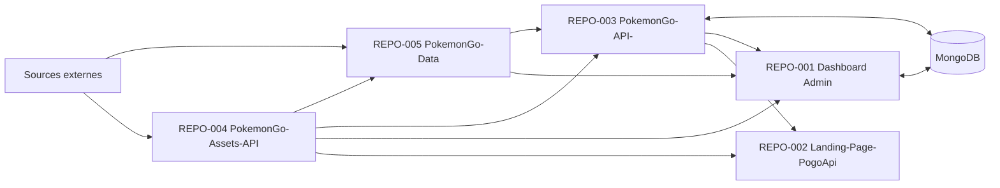

# Référentiels (Repositories)

> Ce document présente les différents dépôts constituant l'écosystème de la plateforme Pokémon GO, leurs responsabilités et leurs interactions.

## Vue d'ensemble

L'architecture repose sur plusieurs dépôts indépendants afin de séparer les responsabilités et de faciliter la maintenance.

L'audit confirme cinq repositories actifs. `PokemonGo-API-` est une application hybride Express/Vercel/Next.js ; `PokemonGo-Assets-API` est un dépôt de fichiers consommés via GitHub raw et non un serveur API autonome.

## REPO-001 — Dashboard Admin

### Rôle

Interface privée d'administration et de supervision.

### Responsabilités

- Gestion des datasets
- Diagnostics
- Publication MongoDB
- API Explorer
- Veille des sources
- Tests visuels
- Modules privés (Shiny Tracker, etc.)
- Outils personnels et Learning
- Routes BFF Next.js, sessions et proxies serveur

### Dépendances

- PokemonGo-API-
- PokemonGo-Assets-API
- MongoDB pour les domaines propres au Dashboard

---

## REPO-003 — PokemonGo-API-

### Rôle

Expose les données publiques et privées via Express et des fonctions Vercel, tout en hébergeant des pages publiques Next.js pour l'accueil, les assets et la checklist.

### Responsabilités

- API REST
- Authentification
- Documentation OpenAPI
- Cache
- MongoDB
- Versionnement des routes
- Synchronisation statique et pipelines courants

### Dépendances

- MongoDB
- Datasets générés par PokemonGo-Data

L'audit recense 122 routes API et 19 collections MongoDB côté API. Les entrées Express locale, Vercel et UI Next.js coexistent et doivent rester distinguées.

---

## REPO-005 — PokemonGo-Data

### Rôle

Maintient les référentiels statiques et les générateurs/provider modules de données Pokémon GO.

### Responsabilités

- Scraping
- Providers
- Validation
- Normalisation
- Génération JSON
- Hash et diagnostics

Ce dépôt est une porte d'entrée majeure des données externes. En production, les datasets courants sont lus depuis MongoDB après synchronisation ; les fichiers `.data` du Dashboard et de l'API restent des snapshots dérivés.

---

## REPO-004 — PokemonGo-Assets-API

### Rôle

Centraliser toutes les ressources graphiques.

### Contenu

- Assets GO
- Assets HOME
- Icônes
- Types
- Backgrounds
- Location Cards
- Filtres
- Illustrations

Tous les projets utilisent ce dépôt comme référence graphique.

Interface observée : arborescence Git et URLs GitHub raw. Licence, version package, serveur HTTP propre et contrat d'API : non trouvés dans le dépôt audité.

---

## REPO-002 — Landing-Page-PogoApi

### Rôle

Présenter publiquement l'écosystème et orienter vers le site/API public.

### Objectifs

- Présentation de l'API
- Présentation marketing de l'API
- Liens vers le site public
- Mise en avant de statistiques et d'assets actuellement codés dans le composant Landing

---

# Flux entre les dépôts

1. `PokemonGo-Data` maintient les référentiels et exécute les générateurs/provider modules.
2. Le push de certaines familles statiques déclenche un `repository_dispatch` vers `PokemonGo-API-`, qui synchronise MongoDB.
3. Les pipelines courants valident, calculent hash/diff, upsertent la version `current`, invalident le cache et effectuent un read-back, sans transaction globale confirmée.
4. `PokemonGo-API-` expose les routes REST et les pages publiques.
5. `Dashboard Admin` consomme l'API, MongoDB et son snapshot Data via des routes serveur privées.
6. `Landing-Page-PogoApi` consomme l'URL publique et les assets raw.
7. `PokemonGo-Assets-API` fournit les fichiers graphiques aux consommateurs.

---

# Principes

- Un dépôt = une responsabilité principale.
- Pas de duplication de logique métier.
- Les dépendances doivent être clairement identifiées.
- Les échanges passent par des interfaces définies (API, datasets, providers).

---

# Conformité

Ce document applique notamment :

- RULE-003 — Auditer avant de développer.
- RULE-006 — Réutiliser avant de créer.
- RULE-007 — Responsabilité unique.
- RULE-008 — Architecture orientée Providers.
- RULE-009 — Aucune architecture concurrente.

---

# Documents associés

- DOC-001 — Règles générales
- DOC-002 — Vision
- DOC-004 — Philosophie
- DOC-006 — Architecture générale

---

# Historique

## Version 1.1.0 — 2026-07-13

- Alignement des IDs et noms exacts des cinq repositories.
- Remplacement du schéma supposé par les flux inter-repositories observés.
- Ajout des responsabilités hybrides de l'API, du statut réel des assets et de `.data`.

## Version 1.0.0 — 2026-07-12

- Création du document.
- Documentation des dépôts et de leurs responsabilités.
