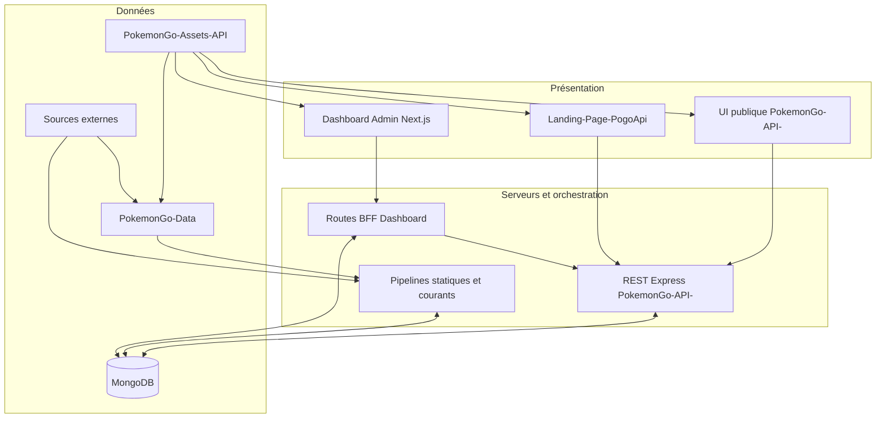
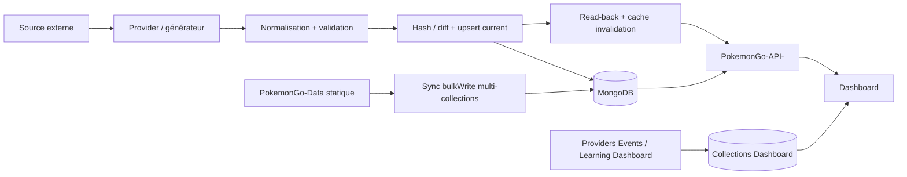

# Vue d'ensemble de l'architecture

> Ce document présente l'architecture globale de la plateforme et les relations entre les différents projets.

## Objectifs de l'architecture

- Séparer clairement les responsabilités.
- Garantir une source de vérité unique.
- Permettre l'ajout de nouveaux Providers et datasets sans réécriture.
- Assurer une publication fiable et atomique des données.
- Offrir une API stable et un Dashboard d'administration complet.

---

# Vision globale



---

# Les cinq piliers

## 1. Sources externes

Les sites externes (LeekDuck, PvPoke, Pokémon GO Live, etc.) fournissent uniquement les informations propres à leur domaine.

Ils ne constituent jamais la source de vérité.

---

## 2. PokemonGo-Data

Responsable de :

- récupération des données ;
- Providers ;
- normalisation ;
- validation ;
- génération JSON ;
- diagnostics ;
- hash ;
- version des datasets.

Aucune interface utilisateur n'y est développée.

---

## 3. MongoDB

MongoDB stocke les datasets API ainsi que les collections propres au Dashboard (Events, Learning, backlog et stores/metrics).

Les pipelines courants effectuent validation, hash/diff, upsert, cache invalidation et read-back. Aucune transaction globale ni restauration automatique n'est confirmée ; la synchronisation statique multi-collections peut être partiellement appliquée avant un échec.

---

## 4. PokemonGo-API-

Expose :

- les datasets publics ;
- les datasets privés authentifiés ;
- les routes d'administration ;
- la documentation OpenAPI.

L'architecture combine Express local, Express sous fonction Vercel, wrappers `api/*.js` et une UI Next.js publique. Les handlers s'appuient sur des services et générateurs ; certaines régénérations exécutent des provider modules qui contactent les sources externes.

---

## 5. Dashboard Admin

Le Dashboard est le poste de contrôle de la plateforme.

Il permet notamment :

- superviser les datasets ;
- lancer les régénérations ;
- publier ;
- consulter les diagnostics ;
- surveiller les Providers ;
- tester les endpoints ;
- administrer les modules privés.

Le Dashboard possède aussi un BFF Next.js, des collections MongoDB dédiées, des outils personnels/learning et une session serveur obligatoire pour le groupe `(dashboard)`. L'audit recense 20 pages routées et 23 sections Pokémon intégrées.

---

# Pipeline principal



Ce schéma représente les trois familles réellement observées. Il n'existe pas un pipeline unique appliqué uniformément à tous les domaines.

---

# Architecture orientée Providers

Chaque nouvelle source suit la même logique :

```text
Source externe
 ↓
Provider ou générateur
 ↓
Adapter courant lorsque le domaine l'utilise
 ↓
Validation + hash/diff
 ↓
MongoDB current + read-back
 ↓
API
 ↓
Dashboard
```

Sept adapters courants partagent ce contrat : Shiny privé, PvP Rankings, Raids, Eggs, Max Battles, Research et Rocket. La synchronisation statique et les domaines Dashboard restent des architectures distinctes documentées, et non des implémentations du même adapter.

---

# Source de vérité

La plateforme distingue :

| Élément | Source officielle |
|---------|------------------|
| Référentiels Pokémon, formes, types, attaques | `PokemonGo-Data`, puis collections MongoDB synchronisées |
| Assets | `PokemonGo-Assets-API` via GitHub raw |
| PvP Rankings current | MongoDB, produit depuis PvPoke |
| Raids / Eggs / Research / Rocket current | MongoDB, produits depuis LeekDuck |
| Max Battles current | MongoDB, produit depuis Snacknap |
| Shiny Tracker | MongoDB privé, produit depuis les Providers Shiny autorisés |
| Événements | Collection `events` Dashboard, alimentée notamment depuis LeekDuck |
| Learning | Collections Learning Dashboard |

Les données externes complètent la plateforme mais ne remplacent jamais les informations locales.

---

# Communication entre les projets

| Projet | Produit | Consommateurs |
|--------|---------|---------------|
| PokemonGo-Data | Référentiels, générateurs et snapshots dérivés | API, Dashboard |
| PokemonGo-API- | REST Express, fonctions Vercel et pages publiques Next.js | Dashboard, Landing, public |
| PokemonGo-Assets-API | Assets | Tous les projets |
| Dashboard Admin | Administration, BFF, outils privés et collections propres | Utilisateur authentifié |
| Landing-Page-PogoApi | Présentation publique | Public |

---

# Principes d'architecture

- Une responsabilité par dépôt.
- Une responsabilité par Provider.
- Un pipeline commun.
- Aucune duplication métier.
- Validation avant publication.
- Documentation avant livraison.

L'audit relève cependant une architecture API multi-runtime, deux implémentations `ensure-data`, des fallbacks de résolution Data et plusieurs pipelines spécialisés. Ces coexistences doivent rester explicites ; elles ne doivent pas être masquées derrière l'affirmation d'un pipeline commun unique.

---

# Évolutivité

L'architecture est conçue pour accueillir :

- de nouveaux Providers ;
- de nouveaux datasets ;
- de nouvelles pages Dashboard ;
- de nouvelles routes API ;
- de nouvelles collections MongoDB ;

sans remettre en cause les composants existants.

---

# Conformité

Ce document applique notamment :

- RULE-001 — Préserver l'existant.
- RULE-007 — Responsabilité unique.
- RULE-008 — Architecture orientée Providers.
- RULE-009 — Aucune architecture concurrente.
- RULE-012 — Source de vérité unique.
- RULE-015 — Publication atomique.
- RULE-039 — Identifiants permanents.

---

# Documents associés

- DOC-001 — Règles générales
- DOC-005 — Référentiels
- ARCH-001 — Architecture Providers
- PROVIDER-001 à PROVIDER-018
- DATASET-001 à DATASET-019

---

# Historique

## Version 1.1.0 — 2026-07-13

- Remplacement de l'architecture théorique linéaire par l'architecture logique et physique observée.
- Distinction des pipelines statiques, courants et propres au Dashboard.
- Mise à jour des sources de vérité, responsabilités, IDs Providers/Datasets et limites d'atomicité.

## Version 1.0.0 — 2026-07-12

- Création du document.
- Ajout des schémas d'architecture globale.
- Documentation du pipeline principal.
- Définition des responsabilités des projets.
