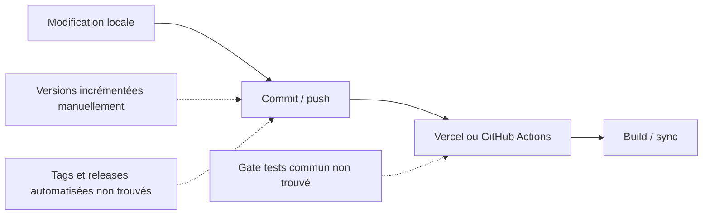

# Versionnage

> Ce document définit la stratégie de versionnage commune visée pour l'ensemble de la plateforme. L'audit montre que les applications utilisent plusieurs marqueurs SemVer, tandis que les datasets, schémas et Providers ne suivent pas encore un contrat homogène.

## Objectifs

- Identifier précisément chaque version.
- Garantir la compatibilité entre les projets.
- Faciliter les retours arrière.
- Rendre les changements compréhensibles.
- Synchroniser le code, les données et la documentation.

---

# Semantic Versioning

La convention cible est :

```text
MAJOR.MINOR.PATCH
```

| Niveau | Signification | Exemple |
|--------|---------------|---------|
| MAJOR | Rupture de compatibilité | 2.0.0 |
| MINOR | Nouvelle fonctionnalité compatible | 1.5.0 |
| PATCH | Correction compatible | 1.5.3 |

État observé : Dashboard Admin, `PokemonGo-API-` et `PokemonGo-Data` utilisent des versions SemVer dans leur `package.json`. La Landing possède un package `1.0.0`. `PokemonGo-Assets-API` n'a pas de package ni de version applicative trouvée. Aucun outil de release automatisée ou règle SemVer exécutable n'a été trouvé.

---

# Éléments versionnés

## Application

```text
appVersion
```

Concerne :

- Dashboard Admin
- PokemonGo-API-
- PokemonGo-Data
- PokemonGo-Assets-API
- Landing-Page-PogoApi

| Projet | Package | Autre marqueur observé |
|--------|---------|-------------------------|
| Dashboard Admin | `1.21.1` | UI `V1.21.1`, changelog `1.21.1` |
| PokemonGo-API- | `1.7.0` | OpenAPI `1.4.1`, changelog `1.6.1`, chemin REST `/api/v1` |
| PokemonGo-Data | `1.8.0` | changelog `1.7.0` |
| Landing-Page-PogoApi | `1.0.0` | aucun changelog trouvé |
| PokemonGo-Assets-API | Non trouvé | aucun marqueur trouvé |

---

## Datasets

Les datasets peuvent porter des marqueurs de version, mais l'audit ne trouve pas de contrat global appliqué aux 19 datasets.

Exemples :

```text
datasetVersion
schemaVersion
generatedAt
sourceVersion
hash
```

Les datasets courants utilisent principalement `generatedAt`, `savedAt`, `sourceHash`, diagnostics et parfois `schemaVersion`. `datasetVersion` n'est pas uniformément présent.

---

## Providers

Les Providers évoluent indépendamment, mais aucun champ `providerVersion` commun n'est observé.

```text
providerVersion
```

Une modification d'un Provider n'entraîne pas automatiquement une nouvelle version majeure de l'application.

Les versions parfois présentes dans des User-Agent ne constituent pas un contrat partagé.

---

## Schémas

Le marqueur cible est :

```text
schemaVersion
```

État observé : Learning utilise `schemaVersion: 1`, Shiny/PvP utilisent `schemaVersion: 2` et plusieurs datasets reprennent une valeur de métadonnées ou `1`. Les JSON statiques ne portent pas tous un marqueur uniforme.

---

# Politique d'incrémentation

## PATCH

Utiliser PATCH pour :

- correction de bugs ;
- amélioration visuelle ;
- optimisation interne ;
- documentation.

## MINOR

Utiliser MINOR pour :

- nouvelle page ;
- nouveau dataset ;
- nouveau Provider ;
- nouveau composant ;
- nouvelle route API ;
- nouvelle fonctionnalité.

## MAJOR

Utiliser MAJOR lorsque :

- une compatibilité est rompue ;
- un schéma est profondément modifié ;
- une API change de comportement de manière incompatible.

---

# Changelog

Toute version publiée doit être accompagnée d'un changelog décrivant :

- les nouveautés ;
- les corrections ;
- les améliorations ;
- les ruptures éventuelles.

---

# Compatibilité

Avant toute publication, vérifier :

- compatibilité des datasets ;
- compatibilité API ;
- compatibilité Dashboard ;
- compatibilité MongoDB ;
- compatibilité documentation.

Ces vérifications sont des exigences. L'audit ne trouve pas de gate automatisé commun prouvant qu'elles sont toutes exécutées avant chaque release.

---

# Workflow de publication



Le workflow idéal Tests → Documentation → Version → Changelog → Publication reste la politique à atteindre. Le processus observé repose sur des incréments manuels, des changelogs partiels et des déclenchements Vercel/GitHub Actions sans tag local ni gate de promotion confirmé.

---

# Bonnes pratiques

- Incrémenter la version avant publication.
- Ne jamais réutiliser un numéro de version.
- Documenter toute rupture de compatibilité.
- Versionner les schémas indépendamment des applications.
- Conserver l'historique des versions.
- Aligner package, UI, OpenAPI et changelog avant publication.
- Créer des tags/releases formels si ce processus est adopté.

---

# Conformité

Ce document applique notamment :

- RULE-002 — Archivage.
- RULE-015 — Publication atomique.
- RULE-035 — Semantic Versioning.
- RULE-036 — Distinction des types de version.
- RULE-038 — Mise à jour documentaire.
- RULE-039 — Identifiants permanents.

---

# Documents associés

- DOC-001 — Règles générales
- DOC-006 — Architecture générale
- DOC-008 — Changelog

---

# Historique

## Version 1.1.0 — 2026-07-13

- Ajout des versions réellement déclarées dans les cinq repositories.
- Distinction entre politique SemVer et processus manuel observé.
- Retrait des contrats globaux supposés pour datasets, Providers et schémas.
- Mise à jour du workflow de publication et des divergences package/UI/OpenAPI/changelog.

## Version 1.0.0 — 2026-07-12

- Création du document.
- Définition de la stratégie de versionnage commune.
