# DOC-010 — Vue d'ensemble du Design System

> **Objectif :**
>
> Décrire l'architecture complète du Design System de la plateforme Pokémon GO, sa philosophie, son organisation, ses conventions et son rôle dans l'ensemble de l'écosystème.
>
> Ce document constitue la **porte d'entrée officielle** du Tome 3 — Design System.

> **État officiel après audit :**
>
> Les couches Atomic, Composite, Complex et Templates décrites dans ce document constituent la **cible de gouvernance et de reconstruction Figma**. Elles ne doivent pas être confondues avec l'implémentation React actuelle.
>
> L'implémentation confirmée du Dashboard repose sur les variables CSS/Tailwind, deux thèmes, huit palettes, six fichiers UI atomiques partagés et de nombreux composants métier avec styles locaux. Les documents Phase 3C/3D/3E/4A annoncent respectivement 401, 520, 895 variantes futures et six templates cibles ; aucune preuve locale ne confirme leur génération dans Figma ou leur réalisation complète dans React.

---

# Table des matières

1. Vision & Philosophie
2. Architecture générale
3. Foundations
4. Design Tokens
5. Atomic Components
6. Composite Components
7. Complex Components
8. Templates
9. Workflow Figma
10. Workflow React
11. Workflow Dashboard
12. Responsive Design
13. Dark / Light Theme
14. Pokémon Identity
15. Glass Effects
16. Animations
17. Accessibilité
18. Performance
19. Convention de nommage
20. Cycle de vie d'un composant
21. Évolution du Design System
22. Références

---

# 1. Vision & Philosophie

> Le Design System de la plateforme Pokémon GO constitue le langage visuel officiel de l'ensemble de l'écosystème. Il ne s'agit pas uniquement d'une bibliothèque de composants, mais d'un ensemble cohérent de règles, de conventions, de principes de conception et de décisions architecturales garantissant une expérience homogène sur l'ensemble des projets.

---

# Pourquoi un Design System ?

La plateforme Pokémon GO est composée de plusieurs projets indépendants :

- Dashboard Admin
- PokemonGo-API-
- PokemonGo-Data
- PokemonGo-Assets-API
- Landing-Page-PogoApi
- futurs outils internes

Tous ces projets évoluent continuellement.

Sans Design System, chaque évolution entraînerait :

- une incohérence visuelle ;
- une duplication des composants ;
- des comportements différents selon les pages ;
- une maintenance de plus en plus complexe.

Le Design System est donc la fondation graphique de toute la plateforme.

---

# Notre philosophie

Le Design System repose sur plusieurs principes fondamentaux.

## 1. Un composant n'existe qu'une seule fois

Un bouton, une Card, un Badge ou une Modal ne doivent jamais être recréés.

Ils sont conçus une seule fois puis réutilisés partout.

Ainsi :

```
Modifier le composant
        ↓
Toutes les pages sont automatiquement mises à jour.
```

Cela garantit :

- une cohérence parfaite ;
- une maintenance simplifiée ;
- une réduction du code.

État observé : ce principe n'est pas encore uniformément atteint. Le Dashboard contient actuellement 127 fichiers JSX/TSX sous `src/components` ; l’audit du 13 juillet avait identifié 46 façades de compatibilité courtes. Plusieurs familles de boutons, cartes, filtres et modales restent reconstruites dans les composants métier.

---

## 2. Les composants sont indépendants

Chaque composant possède :

- une responsabilité unique ;
- une API claire ;
- plusieurs variantes ;
- une documentation dédiée.

Un composant ne dépend jamais d'une page spécifique.

Il peut être utilisé dans n'importe quel projet.

État observé : les primitives sous `src/components/ui` sont génériques, mais la majorité des composants Pokémon, Events, Learning et outils sont liés à leur domaine ou à une page. L'indépendance totale décrite ici reste une règle cible.

---

## 3. Les composants racontent une histoire

Chaque composant possède une raison d'exister.

Un composant n'est jamais créé "au cas où".

Avant d'en créer un nouveau, il faut toujours se poser les questions suivantes :

- Existe-t-il déjà ?
- Peut-il être étendu ?
- Peut-il être composé à partir de composants existants ?

Créer un composant est toujours le dernier recours.

---

# Une identité Pokémon GO

Contrairement à un Dashboard classique, la plateforme possède une identité graphique forte.

Cette identité repose notamment sur :

- les couleurs des types Pokémon ;
- les assets officiels ;
- les illustrations GO ;
- les backgrounds ;
- les effets lumineux ;
- les halos ;
- les badges colorés ;
- les animations discrètes.

L'objectif n'est pas de copier Pokémon GO, mais de créer une interface moderne qui évoque immédiatement son univers.

---

# La lisibilité avant le spectacle

L'interface utilise :

- des effets de verre (Glassmorphism) ;
- des halos lumineux ;
- des animations ;
- des couleurs dynamiques.

Cependant, ces effets ne doivent jamais nuire :

- à la lisibilité ;
- aux performances ;
- à l'accessibilité.

Chaque effet visuel doit avoir une utilité.

---

# Une architecture avant un design

Le Design System n'est pas une collection d'éléments graphiques.

Il possède une véritable architecture.

```
Foundations
      ↓

Design Tokens
      ↓

Atomic Components
      ↓

Composite Components
      ↓

Complex Components
      ↓

Templates
      ↓

Pages
```

Chaque niveau possède une responsabilité précise.

Cette architecture permet de faire évoluer l'interface sans casser les composants existants.

---

# La cohérence avant tout

Deux composants ayant le même rôle doivent toujours :

- avoir la même apparence ;
- avoir les mêmes comportements ;
- utiliser les mêmes animations ;
- utiliser les mêmes couleurs ;
- partager les mêmes variantes.

L'utilisateur ne doit jamais se demander si deux boutons différents réalisent la même action.

---

# La performance fait partie du Design

Un composant beau mais lent est considéré comme un mauvais composant.

Chaque élément doit :

- limiter les rerenders ;
- éviter les calculs inutiles ;
- être facilement mémorisable (`React.memo` lorsque pertinent) ;
- charger rapidement.

Le Design System participe donc directement aux performances globales de la plateforme.

---

# Accessibilité

Le Design System est conçu pour être utilisable par tous.

Chaque composant doit respecter :

- une navigation clavier complète ;
- un focus visible ;
- des contrastes suffisants ;
- des zones de clic adaptées ;
- une hiérarchie visuelle claire.

L'accessibilité n'est pas une option ajoutée à la fin.

Elle fait partie de la conception.

---

# Une documentation vivante

Chaque composant possède :

- son document Markdown ;
- ses variantes ;
- ses règles d'utilisation ;
- ses bonnes pratiques ;
- ses limitations.

Le Design System évolue en même temps que le projet.

Une modification d'un composant entraîne automatiquement une mise à jour de sa documentation.

État observé : le méga-audit a créé le mapping de 555 documents futurs, mais il n'existe pas de mécanisme automatique reliant une modification React à la régénération de sa fiche documentaire.

---

# La vision à long terme

Le Design System a été pensé pour accompagner la plateforme pendant plusieurs années.

À terme, il devra permettre :

- d'ajouter rapidement de nouveaux modules ;
- de créer de nouvelles pages sans repartir de zéro ;
- de maintenir une cohérence parfaite entre tous les projets ;
- d'accélérer considérablement le développement.

Il constitue aujourd'hui l'une des pierres angulaires de toute la plateforme Pokémon GO.

---

# Résumé

Le Design System est bien plus qu'une bibliothèque de composants.

Il est :

- le langage visuel officiel ;
- le garant de la cohérence graphique ;
- le socle du Dashboard Admin ;
- le lien entre Figma et React ;
- un accélérateur de développement ;
- un outil de maintenance ;
- une documentation vivante.

Toutes les décisions visuelles doivent partir de lui.

Aucune interface ne doit être conçue en dehors de ce cadre.

L'audit constate une couverture partielle : les primitives et le shell utilisent les tokens globaux, tandis que les composants métier conservent un vocabulaire visuel local important. Les affirmations de cohérence parfaite dans ce document expriment donc la gouvernance attendue et non une certification de l'état actuel.

---

# 2. Architecture générale

L'architecture du Design System suit une approche **Component First**.

Chaque élément de l'interface est construit à partir d'éléments plus simples jusqu'à former des pages complètes.

L'objectif est double :

- garantir une cohérence graphique parfaite ;
- réduire drastiquement la duplication des composants.

L'ensemble du Design System repose sur une architecture hiérarchique permettant à chaque niveau d'avoir une responsabilité précise.

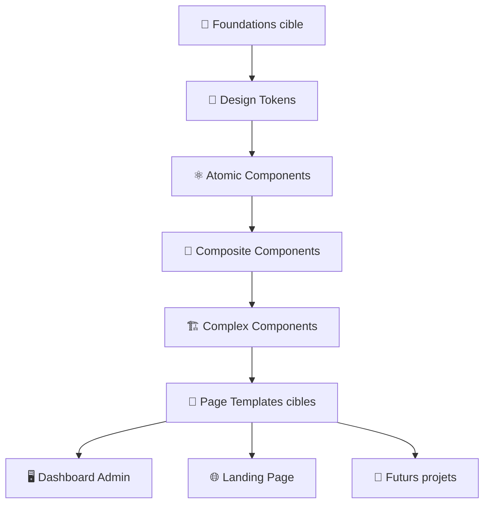

Chaque étage dépend uniquement de l'étage inférieur.

Dans l'implémentation observée, cette hiérarchie n'est pas matérialisée comme six packages/couches React distincts :

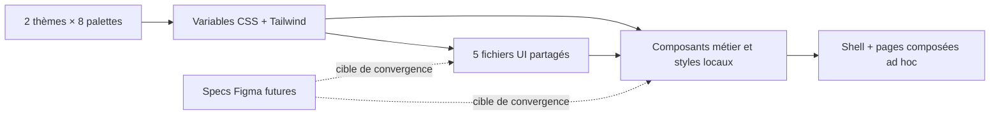

Aucun composant complexe ne doit définir lui-même :

- une couleur ;
- une taille ;
- une ombre ;
- un rayon ;
- une typographie.

Dans la cible, toutes ces informations proviennent des Foundations. Le code actuel contient aussi des couleurs, rayons, ombres, z-index et valeurs arbitraires locales ; l'audit relève environ 617 lignes visuelles potentiellement concurrentes sous `src`.

---

# 2.1 Foundations

Les Foundations représentent la couche la plus basse du Design System.

Elles définissent toutes les constantes graphiques utilisées par la plateforme.

On y retrouve notamment :

- palette de couleurs ;
- typographies ;
- espacements ;
- tailles ;
- rayons ;
- ombres ;
- effets de verre ;
- animations ;
- durées ;
- opacités ;
- breakpoints.

Les Foundations ne contiennent aucun composant.

Elles décrivent uniquement les règles graphiques.

---

# 2.2 Design Tokens

Les Design Tokens traduisent les Foundations en variables réutilisables.

Ils constituent la seule manière autorisée d'accéder aux propriétés graphiques.

Exemple :

```
Primitive
↓

Neutral-900

↓

Semantic

↓

Surface-Primary

↓

Card

↓

Pokemon Card
```

Cette approche permet :

- de changer tout un thème en une seule modification ;
- de supporter facilement plusieurs thèmes ;
- d'assurer une cohérence parfaite.

Les composants n'utilisent jamais directement les couleurs primitives.

Ils utilisent uniquement les Semantic Tokens.

---

# 2.3 Atomic Components

Les composants atomiques sont les briques élémentaires du Design System.

Ils ne possèdent qu'une seule responsabilité.

Exemples :

- Button
- Badge
- Chip
- Tag
- Icon
- Avatar
- Divider
- Tooltip
- Input
- Switch
- Checkbox
- Radio
- Progress Bar

Un composant atomique :

- ne contient pas de logique métier ;
- ne dépend d'aucune page ;
- est entièrement réutilisable.

La spécification Phase 3C décrit **401 variantes atomiques futures**. L'implémentation React confirmée contient six fichiers UI partagés : Badge, Button, Card, Field, Input/Textarea et Modal, soit sept familles de composants exportées. `Field` compose seulement un label et son enfant ; il n’expose ni description, ni erreur, ni validation. IconButton, Select, Checkbox, Switch, Chip, Label autonome, Divider, ProgressBar, Tooltip et Tabs ne possèdent pas de primitive partagée dédiée.

---

# 2.4 Composite Components

Les composants composites sont obtenus par l'assemblage de plusieurs composants atomiques.

Ils commencent à représenter une véritable fonctionnalité visuelle.

Exemples :

- Search Bar
- Dataset Filter
- Pokemon Header
- Stat Card
- Type Badge Group
- Source Header
- Empty State
- Pagination
- Notification

Ils restent totalement indépendants d'une page spécifique.

La spécification Phase 3D décrit **520 variantes composites futures**. Plusieurs composites métier existent dans React, mais aucune couche canonique de dix familles ni génération Figma n'est confirmée.

---

# 2.5 Complex Components

Les composants complexes représentent des modules complets.

Ils regroupent plusieurs composants composites afin de créer une véritable interface fonctionnelle.

Exemples :

- Pokemon Details Modal
- Raid Card
- PvP Ranking Row
- Shiny Details Modal
- Dataset Diagnostics
- API Explorer
- Source Watch Panel
- MongoDB Status
- Event Calendar

Ils constituent les principaux blocs utilisés dans les pages du Dashboard.

La spécification Phase 3E décrit **895 variantes complexes futures**. Les modules fonctionnels existent sous des noms métier, mais cette quantité ne doit pas être comptée comme variantes React ou Figma réalisées.

---

# 2.6 Page Templates

Les Templates représentent la dernière étape avant les pages réelles.

Ils définissent :

- la disposition générale ;
- les zones fonctionnelles ;
- les espacements ;
- la hiérarchie visuelle.

Ils ne contiennent aucune donnée.

Ils servent uniquement de structure.

La spécification Phase 4A propose six Templates. Le code confirmé possède un shell global et des pages composées ad hoc ; aucune couche React formalisée de six Templates n'est trouvée.

---

# 2.7 Pages

Une page est simplement l'assemblage de :

- Templates
- Complex Components
- Composite Components
- Atomic Components

Aucune page ne doit redéfinir un composant existant.

Une page orchestre les composants.

Elle ne constitue jamais un composant réutilisable.

---

# 2.8 Flux de conception

Le processus de création suit toujours le même cycle :

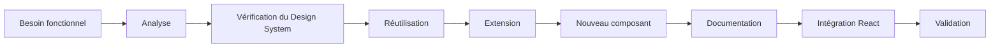

Créer un nouveau composant est toujours la dernière option.

La priorité est donnée à :

1. la réutilisation ;
2. l'extension ;
3. la composition.

---

# 2.9 Hiérarchie des responsabilités

| Niveau | Responsabilité |
|----------|----------------|
| Foundations | Définir les règles graphiques |
| Tokens | Exposer les variables de design |
| Atomic Components | Fournir les briques élémentaires |
| Composite Components | Assembler plusieurs briques |
| Complex Components | Construire des modules complets |
| Templates | Définir la structure des pages |
| Pages | Présenter les données et orchestrer les composants |

Chaque niveau possède un rôle précis.

Cette séparation permet :

- une maintenance simplifiée ;
- une meilleure évolutivité ;
- une forte réutilisation ;
- un développement plus rapide.

---

# 2.10 Principes d'évolution

Le Design System évolue selon plusieurs règles :

- aucun composant ne doit casser les composants existants ;
- toute nouvelle variante doit être documentée ;
- les Tokens restent la source de vérité graphique cible ;
- les composants doivent rester indépendants de l'application ;
- toute évolution importante doit être accompagnée d'une mise à jour des documents `COMP-xxx`, `DS-xxx` et des références concernées.

Ainsi, le Design System reste cohérent, évolutif et capable d'accompagner l'ensemble des projets de la plateforme sur le long terme.

L'audit montre que cette convergence n'est pas terminée : la nomenclature Figma `primitive.*`, `semantic.*` et `component.*` n'est pas présente dans le code, et les composants métier utilisent encore de nombreuses valeurs directes.

---

# 3. Foundations

Les **Foundations** représentent la couche la plus basse du Design System.

Elles définissent les règles fondamentales qui garantissent une identité visuelle cohérente sur l'ensemble de la plateforme.

Contrairement aux composants, les Foundations ne décrivent **aucun élément d'interface**.

Elles définissent uniquement les propriétés graphiques qui seront ensuite utilisées par les Design Tokens puis par tous les composants.

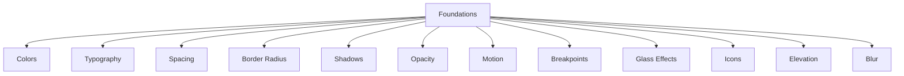

Dans l'architecture cible, les Foundations ne sont jamais utilisées directement et sont exposées via les **Design Tokens**. Dans le code actuel, les composants consomment à la fois des variables CSS/Tailwind, des utilitaires globaux et des valeurs locales.

---

# Pourquoi des Foundations ?

Sans Foundations, chaque développeur pourrait utiliser :

- une couleur différente ;
- un espacement différent ;
- une ombre différente ;
- une taille différente.

Cela conduirait rapidement à une interface incohérente.

Les Foundations imposent donc un langage graphique unique.

---

# Les différentes catégories

Le Design System repose sur plusieurs familles de Foundations.

| Fondation | Description |
|------------|-------------|
| Colors | Palette de couleurs |
| Typography | Typographies |
| Spacing | Espacements |
| Radius | Arrondis |
| Shadows | Ombres |
| Motion | Animations |
| Blur | Effets de flou |
| Opacity | Opacités |
| Elevation | Hiérarchie visuelle |
| Breakpoints | Responsive |
| Icons | Taille des icônes |
| Glass Effects | Effets de verre |

## Implémentation confirmée

| Groupe | Éléments observés |
|--------|-------------------|
| Couleurs | `--background`, `--foreground`, `--muted`, `--panel`, `--panel-strong`, `--line`, `--line-strong`, `--brand`, `--brand-2`, `--brand-3`, accents, `--warning`, `--danger` |
| Thèmes | `.dark` et `.light`, dark par défaut, huit palettes (`sapphire`, `ruby`, `fire-red`, `violet`, `leaf-green`, `pink`, `gold`, `electric`) |
| Typographie | `--font-sans` = Geist/Inter/system ; `--font-mono` = Geist Mono/SFMono ; chargement explicite de Geist non trouvé |
| Radius | `--radius: 8px`, Tailwind `sm: 6px`, `md` à `2xl: 8px`, plus rayons arbitraires fréquents |
| Effets | `glass-panel`, `glass-panel-strong`, glows, scanline, sheen, motion-border, widget glow |
| Breakpoints | préfixes Tailwind `sm`, `md`, `lg`, `xl`, `2xl` ; aucune configuration personnalisée trouvée |
| Motion | 200/220/300 ms, `energy-scan` 5,5 s, `sheen` 6 s, Framer Motion et transitions Tailwind |

Les noms conceptuels `Neutral-900`, `Surface Primary`, `primitive.spacing.*`, `semantic.color.*` et `component.*` ci-dessous décrivent la cible documentaire. Ils ne sont pas des identifiants présents dans `src`.

---

# 3.1 Colors

Les couleurs constituent l'une des Foundations les plus importantes.

Le Design System distingue deux niveaux.

## Primitive Colors

Les couleurs primitives représentent les vraies couleurs.

Exemples :

```
Neutral-0
Neutral-50
Neutral-100
...
Neutral-900

Blue-500

Purple-500

Green-500

Red-500
```

Ces couleurs ne doivent jamais être utilisées directement dans les composants.

---

## Semantic Colors

Les couleurs sémantiques décrivent une intention.

Exemples :

```
Surface Primary

Surface Secondary

Surface Elevated

Text Primary

Text Secondary

Border Default

Success

Warning

Danger

Info

Accent
```

Dans la cible, les composants utilisent exclusivement ces couleurs. L'implémentation actuelle comporte aussi des couleurs Tailwind et littérales locales, en particulier dans les surfaces Pokémon.

Ainsi, modifier un thème devient extrêmement simple.

---

# 3.2 Typography

Toutes les règles de texte sont centralisées.

Une hiérarchie claire est définie.

Exemple :

```
Display XL

Display L

Heading XL

Heading L

Heading M

Body L

Body M

Body S

Caption

Overline
```

Chaque style définit :

- taille
- graisse
- hauteur de ligne
- espacement

---

# 3.3 Spacing

Les espacements suivent une grille régulière.

Exemple :

```
2 px

4 px

8 px

12 px

16 px

20 px

24 px

32 px

40 px

48 px

64 px
```

Cette grille garantit une interface harmonieuse.

La cible limite les composants à ces valeurs. Le code utilise également des espacements et dimensions arbitraires.

---

# 3.4 Border Radius

Les arrondis sont normalisés.

Exemple :

```
None

XS

SM

MD

LG

XL

2XL

Full
```

Chaque Card, Badge, Button ou Input réutilise ces valeurs.

---

# 3.5 Shadows

Les ombres définissent la profondeur.

Exemple :

```
XS

SM

MD

LG

XL
```

Les ombres sont utilisées avec parcimonie.

L'objectif est de créer une hiérarchie visuelle et non des effets décoratifs.

---

# 3.6 Glass Effects

Le Dashboard utilise une esthétique inspirée du Glassmorphism.

Les Foundations définissent notamment :

- intensité du flou ;
- transparence ;
- opacité ;
- couleur de surface ;
- contour lumineux.

Toutes les Cards utilisant cet effet doivent partager les mêmes paramètres.

---

# 3.7 Motion

Les animations sont également considérées comme une Foundation.

Exemples :

```
Fast

Normal

Slow

Spring

Ease In

Ease Out
```

Ces noms sont la cible. Aucun token global `Fast/Normal/Slow` n'est trouvé dans le code ; plusieurs durées explicites coexistent.

---

# 3.8 Elevation

L'élévation définit la hiérarchie visuelle.

Elle combine :

- ombres ;
- transparence ;
- glow ;
- ordre d'affichage.

Exemple :

```
Surface

Card

Popover

Modal

Drawer

Overlay
```

---

# 3.9 Breakpoints

Le responsive repose sur une grille commune.

Exemple :

```
Mobile

Tablet

Laptop

Desktop

Ultra Wide
```

Les pages utilisent les préfixes Tailwind standards `sm`, `md`, `lg`, `xl` et `2xl`. Les catégories conceptuelles ne constituent pas des breakpoints personnalisés déclarés.

---

# 3.10 Icons

Les tailles d'icônes sont normalisées.

Exemple :

```
12

16

20

24

32

48

64
```

Cette normalisation est une règle cible. Les composants actuels passent plusieurs valeurs numériques directement aux icônes Lucide et utilisent aussi des assets d'icônes locaux.

---

# 3.11 Opacity

Les opacités sont centralisées.

Exemple :

```
5 %

10 %

20 %

40 %

60 %

80 %

100 %
```

Cela évite les différences visuelles entre composants.

---

# 3.12 Blur

Les effets de flou sont utilisés principalement pour :

- les modales ;
- les overlays ;
- les surfaces vitrées.

Ils sont définis une seule fois dans les Foundations.

---

# Relations avec les Design Tokens

Dans l'architecture cible, les Foundations ne sont jamais utilisées directement.

Le chemin est toujours le suivant :

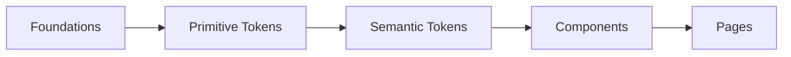

Cette séparation permet :

- un changement de thème rapide ;
- une maintenance simplifiée ;
- une meilleure cohérence.

---

# Règles

Les Foundations doivent respecter plusieurs principes.

✅ Une Foundation définit une règle graphique.

✅ Une Foundation n'implémente jamais un composant.

✅ Une Foundation ne dépend d'aucune page.

✅ Une Foundation peut être utilisée par plusieurs thèmes.

❌ Aucun composant ne doit contourner les Foundations.

❌ Aucune valeur "magique" ne doit apparaître dans un composant.

État observé : cette règle n'est pas uniformément respectée. Les hardcodes, rayons, shadows, z-index et sélecteurs correctifs du thème light sont inventoriés dans l'audit et doivent rester documentés comme dette existante, non comme tokens officiels réalisés.

---

# Bonnes pratiques

✔ Utiliser exclusivement les Tokens.

✔ Éviter les couleurs codées en dur.

✔ Réutiliser les espacements définis.

✔ Respecter la hiérarchie typographique.

✔ Utiliser les effets de verre uniquement lorsque cela apporte une réelle valeur.

✔ Conserver des animations discrètes.

---

# Documents liés

Cette section est détaillée dans :

- DS-002 — Token System
- DS-003 — Colors
- DS-004 — Typography
- DS-005 — Spacing
- DS-006 — Shadows
- DS-007 — Glass Effects
- DS-008 — Animation Guidelines
- DS-009 — Icons

---

# 4. Design Tokens

Les **Design Tokens** constituent le langage universel du Design System.

Ils représentent la couche intermédiaire entre les **Foundations** et les **Components**.

Autrement dit :

Les Foundations définissent les règles.

Les Tokens rendent ces règles exploitables.

Dans la cible, les composants utilisent exclusivement les Tokens et n'accèdent pas directement aux Foundations.

État observé : le code implémente des variables CSS sémantiques (`--background`, `--panel`, `--line`, `--brand`, accents, états), un mapping `@theme inline` vers Tailwind et huit palettes dark/light. Les collections Figma Primitive/Semantic/Component et leur export vers React ne sont pas trouvés dans le workspace.

---

# Pourquoi utiliser des Design Tokens ?

Les Design Tokens permettent de :

- centraliser toutes les valeurs du Design System ;
- supprimer les valeurs "magiques" dans le code ;
- simplifier les changements de thème ;
- maintenir une cohérence parfaite ;
- connecter Figma et React avec les mêmes valeurs.

Ce flux Figma → React décrit l'objectif. Aucun fichier exporté de variables Figma Phase 3A/3B ni synchronisation automatique n'est trouvé.

---

# Architecture des Tokens

Le Design System repose sur plusieurs niveaux.

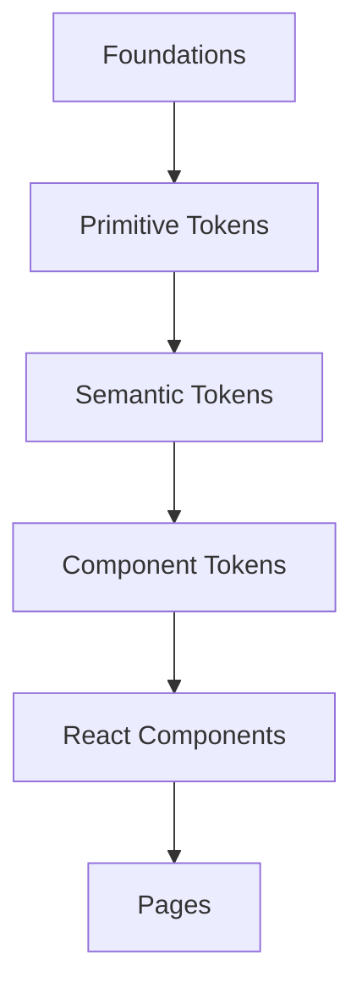

Chaque niveau possède une responsabilité différente.

---

# Les trois familles de Tokens

Le Design System distingue trois catégories principales.

| Niveau | Description |
|----------|-------------|
| Primitive Tokens | Valeurs brutes |
| Semantic Tokens | Signification métier |
| Component Tokens | Personnalisation d'un composant |

Ces trois catégories structurent la spécification cible. Dans le code, les niveaux confirmés sont les variables CSS racine/light, les alias `@theme inline`, les variables de palettes et les classes/utilitaires de composants. Aucun registre `component.button.*` n'est implémenté.

---

# 4.1 Primitive Tokens

Les Primitive Tokens représentent les vraies valeurs.

Ils ne possèdent aucune signification fonctionnelle.

Exemples :

```text
Blue-500

Blue-600

Purple-400

Neutral-900

Spacing-16

Radius-12

Shadow-LG

Font-Body-M
```

Ils ne doivent jamais être utilisés directement dans les composants React.

---

# 4.2 Semantic Tokens

Les Semantic Tokens représentent une intention.

Ils sont totalement indépendants des couleurs réelles.

Par exemple :

```
Surface Primary

Surface Secondary

Surface Elevated

Text Primary

Text Secondary

Border Default

Success

Warning

Danger

Info

Accent
```

Ainsi :

```
Surface Primary

↓

Neutral-900
```

Si un nouveau thème est créé, seul le Token est modifié.

Tous les composants continuent de fonctionner.

---

# 4.3 Component Tokens

Certains composants possèdent leurs propres Tokens.

Exemple :

```
Button

↓

Background

Border

Hover

Pressed

Disabled

Text

Icon
```

ou

```
Card

↓

Padding

Shadow

Border

Radius

Background
```

Ces Tokens restent liés au composant mais continuent d'utiliser les Semantic Tokens.

---

# Organisation des collections

Le Design System est organisé autour de plusieurs collections de Tokens.

Exemple :

```text
Primitive

Semantic

Spacing

Typography

Elevation

Motion

Radius

Opacity

Icons
```

Chaque collection possède ses propres conventions.

---

# Convention de nommage

Les Tokens suivent une nomenclature stricte.

Primitive :

```
Blue-500

Neutral-800

Spacing-24

Radius-LG
```

Semantic :

```
Surface Primary

Surface Elevated

Text Primary

Border Default

Accent
```

Component :

```
Button Background

Button Hover

Badge Border

Modal Overlay
```

Cette convention permet une lecture immédiate.

---

# Utilisation dans Figma

Dans Figma, les composants ne doivent utiliser que les Tokens.

Ils ne doivent jamais utiliser directement :

- une couleur hexadécimale ;
- une valeur d'espacement ;
- une taille arbitraire.

Toutes les propriétés proviennent des Variables.

Statut local : les preuves de collections/pages Figma et de variables exportées ne sont pas trouvées. Cette section reste le workflow requis pour leur future reconstruction.

---

# Utilisation dans React

Le principe est identique.

Un composant React ne connaît jamais :

- #FFFFFF
- #00BFFF
- 16px
- 32px

Il consomme uniquement les Tokens exportés.

Le composant d'exemple ci-dessous est conceptuel. Les composants réels consomment des classes Tailwind/CSS et, selon les domaines, des valeurs arbitraires ou littérales.

Exemple :

```typescript
<Card
surface="primary"
radius="lg"
shadow="md"
/>
```

Le composant décide ensuite quel Token appliquer.

---

# Cycle de vie d'un Token

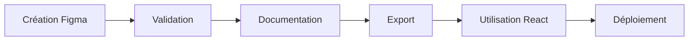

Chaque Token possède donc un véritable cycle de vie.

Ce cycle n'est pas automatisé dans l'état audité ; validation, export et déploiement des variables Figma restent non trouvés.

---

# Bonnes pratiques

Toujours utiliser un Token.

Créer un nouveau Token uniquement lorsqu'une nouvelle intention apparaît.

Documenter chaque nouveau Token.

Réutiliser les Semantic Tokens avant d'en créer un nouveau.

Conserver une hiérarchie simple.

---

# Mauvaises pratiques

❌ Utiliser directement une couleur HEX.

❌ Définir un padding dans un composant.

❌ Ajouter une nouvelle couleur sans passer par les Foundations.

❌ Utiliser un Primitive Token directement dans un composant React.

❌ Multiplier les Tokens ayant la même signification.

---

# Évolution des Tokens

Les Tokens doivent pouvoir évoluer sans casser les composants.

Une évolution peut concerner :

- un nouveau thème ;
- une nouvelle couleur ;
- une nouvelle taille ;
- un nouveau composant ;
- un nouveau mode d'affichage.

Le composant n'a alors besoin d'aucune modification.

---

# Impact sur les performances

La factorisation par Tokens peut réduire la duplication. Aucun benchmark ne démontre un gain de performance attribuable aux Tokens dans l'état audité.

Ils permettent :

- moins de duplication ;
- moins de CSS ;
- une meilleure factorisation ;
- une maintenance simplifiée.

---

# Diagramme complet

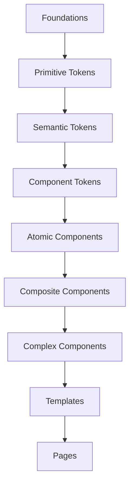

Les Tokens représentent donc le lien essentiel entre les règles graphiques et les composants.

Sans eux, le Design System ne pourrait pas évoluer proprement.

---

# Documents liés

Cette section est approfondie dans :

- DS-002 — Token System
- DS-003 — Colors
- DS-004 — Typography
- DS-005 — Spacing
- DS-006 — Shadows
- DS-007 — Glass Effects
- DS-008 — Animation Guidelines
- COMP-119 à COMP-123 — primitives UI confirmées par le registre audité

---

# 5. Atomic Components

Les **Atomic Components** représentent le premier niveau de composants réutilisables du Design System.

Ils constituent les briques élémentaires à partir desquelles toute l'interface est construite.

Ils sont volontairement simples.

Ils ne connaissent :

- aucune page ;
- aucun dataset ;
- aucune API ;
- aucune logique métier.

Ils possèdent une seule responsabilité.

---

# Philosophie

Un composant atomique répond à une seule question :

> **"Quel est le plus petit élément graphique réutilisable ?"**

Il ne cherche jamais à résoudre un cas métier.

Il représente uniquement une interaction ou une information simple.

Exemples :

- un bouton ;
- une icône ;
- un badge ;
- un champ texte ;
- une checkbox.

À eux seuls, ils ne permettent pas de construire une page.

Ils servent de fondation aux composants de niveaux supérieurs.

---

# Position dans l'architecture

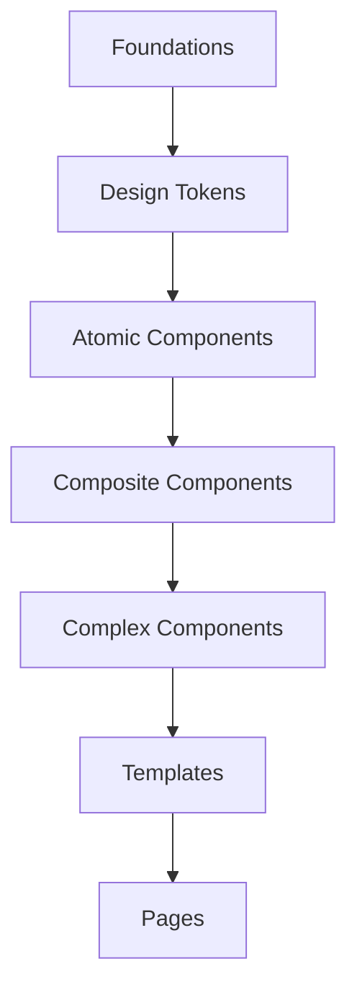

Les Atomic Components sont les premiers consommateurs des Design Tokens.

---

# Caractéristiques

Un Atomic Component doit toujours respecter les règles suivantes.

## Une seule responsabilité

Chaque composant ne fait qu'une chose.

Exemple :

```
Button

↓

Déclencher une action
```

```
Badge

↓

Afficher un statut
```

```
Chip

↓

Afficher une valeur sélectionnable
```

---

## Aucune logique métier

Un composant atomique ignore totalement :

- Pokémon ;
- Raids ;
- PvP ;
- Shiny ;
- MongoDB ;
- API ;
- Dashboard.

Il reçoit uniquement des propriétés.

Exemple :

```tsx
<Button
variant="primary"
size="lg"
loading
/>
```

Le bouton ne sait pas pourquoi il est affiché.

---

## Réutilisable partout

Un Atomic Component doit fonctionner :

- dans le Dashboard ;
- dans la Landing Page ;
- dans un futur projet.

Il ne dépend jamais d'une page spécifique.

---

## Utilisation exclusive des Tokens

Un Atomic Component ne contient jamais :

```css
#FFFFFF

#111827

16px

24px
```

Toutes les propriétés proviennent du Design System.

Exemple :

```
Button

↓

Surface Primary

↓

Spacing LG

↓

Radius MD

↓

Shadow SM
```

---

# Variantes

Chaque composant possède plusieurs variantes.

Exemple :

Button

```
Primary

Secondary

Ghost

Danger

Success

Warning

Info
```

Chaque variante reste documentée dans son document dédié.

---

# États

Tous les composants doivent gérer les mêmes états lorsque cela est pertinent.

| État | Description |
|--------|-------------|
| Default | État normal |
| Hover | Survol |
| Focus | Navigation clavier |
| Pressed | Appui |
| Active | Sélectionné |
| Disabled | Désactivé |
| Loading | Chargement |
| Error | Erreur |
| Success | Succès |

Cette homogénéité améliore l'expérience utilisateur.

---

# Les familles de composants

Le Design System regroupe les composants atomiques en plusieurs familles.

## Actions

- Button
- Icon Button
- Floating Action Button

---

## Affichage

- Badge
- Tag
- Chip
- Avatar
- Divider
- Spinner
- Progress

---

## Formulaires

- Input
- Textarea
- Select
- Checkbox
- Radio
- Switch
- Slider

---

## Navigation

- Icon
- Link
- Breadcrumb Item

---

## Feedback

- Tooltip
- Popover Trigger
- Notification Dot

---

# Cycle de vie

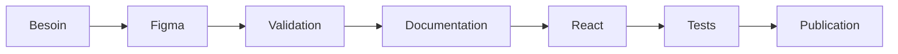

Chaque Atomic Component suit exactement ce cycle.

---

# Conventions

Tous les composants doivent respecter les conventions suivantes.

## Nommage

Les composants utilisent toujours :

```
Button

Badge

Input

IconButton
```

Jamais :

```
Btn

Button2

PrimaryButton

BigButton
```

Les variantes sont des propriétés.

---

## Structure

Chaque composant possède :

- une documentation ;
- des variantes ;
- des états ;
- une API claire ;
- des exemples ;
- des tests.

---

# Ce qu'un Atomic Component ne doit jamais faire

❌ Charger des données.

❌ Effectuer une requête API.

❌ Modifier MongoDB.

❌ Connaître un Pokémon.

❌ Connaître un Raid.

❌ Connaître une page.

❌ Définir des couleurs en dur.

❌ Utiliser des espacements arbitraires.

---

# Bonnes pratiques

✔ Utiliser les Tokens.

✔ Être le plus simple possible.

✔ Prévoir les variantes.

✔ Prévoir les états.

✔ Documenter systématiquement.

✔ Tester individuellement.

✔ Favoriser la réutilisation.

---

# Les Atomic Components dans le projet

D'après le code courant, la bibliothèque React partagée comporte sept familles de composants : Badge, Button, Card, Field, Input, Textarea et Modal. Les **401 variantes** de `phase-3c-prep-atomic-component-spec.md` sont une spécification future, pas un inventaire de variantes réalisées.

Ces composants servent de base à tous les composants composites et complexes.

Ils constituent donc le socle technique et graphique du Dashboard Admin.

---

# Documents liés

Chaque composant atomique possède son propre document.

Entrées réelles du registre :

- COMP-119 — Badge
- COMP-120 — Button
- COMP-121 — Card / CardHeader / CardTitle / CardDescription
- COMP-122 — Input / Textarea
- COMP-123 — Modal

Les détails d'implémentation, les variantes et les exemples sont décrits dans ces documents.

---

# 6. Composite Components

Les **Composite Components** représentent le deuxième niveau de construction du Design System.

Ils sont créés par l'assemblage de plusieurs **Atomic Components** afin de répondre à un besoin fonctionnel plus avancé.

Contrairement aux composants atomiques, ils commencent à représenter de véritables éléments d'interface, tout en restant totalement indépendants des pages et de la logique métier.

Ils constituent la couche intermédiaire entre les composants de base et les modules complexes.

---

# Philosophie

Un Composite Component répond à la question suivante :

> **"Comment assembler plusieurs composants simples pour créer une fonctionnalité réutilisable ?"**

Il ne connaît toujours pas le métier.

Il ne sait pas ce qu'est :

- un Pokémon ;
- un Raid ;
- un Shiny ;
- un classement PvP.

Il sait uniquement organiser plusieurs composants atomiques.

---

# Position dans l'architecture


Les Composite Components utilisent exclusivement :

- les Design Tokens ;
- les Atomic Components.

Ils ne doivent jamais dépendre d'un composant complexe.

---

# Objectif

Les composants composites permettent :

- d'éviter la duplication ;
- d'uniformiser l'interface ;
- d'accélérer le développement ;
- de faciliter la maintenance.

Ils représentent les éléments d'interface utilisés quotidiennement dans les différentes pages.

---

# Caractéristiques

Un Composite Component possède plusieurs propriétés.

## Assemblage de composants

Un composant composite est constitué de plusieurs composants atomiques.

Exemple :

```
Search Bar

↓

Input

+

Button

+

Icon
```

---

Autre exemple :

```
Dataset Filter

↓

Badge

+

Button

+

Dropdown

+

Chip
```

---

## Une responsabilité unique

Même s'il assemble plusieurs composants, un Composite Component ne possède qu'une seule responsabilité.

Exemples :

- filtrer une liste ;
- afficher un en-tête ;
- présenter un résumé ;
- construire une barre d'actions.

---

## Aucune logique métier

Le composant ignore totalement les données métier.

Il reçoit uniquement des propriétés.

Exemple :

```tsx
<DatasetFilterBar
    filters={filters}
    activeFilter={active}
    onChange={handleChange}
/>
```

Le composant ne connaît ni MongoDB, ni les Providers, ni les datasets.

---

# Les principales familles

Le Design System comporte plusieurs familles de composants composites.

## Navigation

- Sidebar Section
- Toolbar
- Navigation Group
- Breadcrumb

---

## Recherche

- Search Bar
- Dataset Filter Bar
- Advanced Filters

---

## Affichage

- Stat Card
- Information Card
- Source Header
- Empty State
- Skeleton Loader

---

## Organisation

- Accordion Header
- Collapsible Panel
- Tabs Header
- Section Divider

---

## Feedback

- Toast Container
- Alert Banner
- Confirmation Panel

---

## Pokémon

- Pokemon Header
- Pokemon Types
- Pokemon Stats Summary

Ces composants restent génériques.

Ils ne contiennent aucune logique liée à un dataset spécifique.

---

# Variantes

Chaque Composite Component peut posséder plusieurs variantes.

Exemple :

```
Dataset Filter Bar

↓

Compact

↓

Default

↓

Extended
```

Autre exemple :

```
Stat Card

↓

Primary

↓

Secondary

↓

Glass

↓

Transparent
```

Les variantes sont toujours documentées dans leur document dédié.

---

# États

Comme les Atomic Components, les composants composites doivent gérer des états homogènes.

| État | Description |
|--------|-------------|
| Default | État normal |
| Loading | Chargement |
| Empty | Aucune donnée |
| Error | Erreur |
| Disabled | Désactivé |
| Expanded | Développé |
| Collapsed | Replié |

Les comportements doivent rester cohérents sur l'ensemble du Dashboard.

---

# Cycle de vie

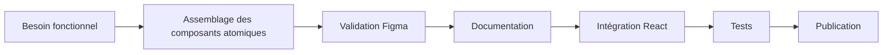

Un Composite Component est toujours conçu à partir de composants existants.

---

# Ce qu'un Composite Component ne doit jamais faire

❌ Effectuer une requête API.

❌ Lire MongoDB.

❌ Connaître un Provider.

❌ Générer un dataset.

❌ Contenir des données codées en dur.

❌ Définir ses propres couleurs.

❌ Contourner les Design Tokens.

---

# Bonnes pratiques

✔ Réutiliser les Atomic Components.

✔ Conserver une responsabilité unique.

✔ Prévoir plusieurs variantes.

✔ Documenter chaque propriété.

✔ Garder une API simple.

✔ Prévoir les états de chargement.

✔ Respecter les conventions du Design System.

---

# Impact sur le développement

Les Composite Components permettent de construire rapidement une nouvelle interface.

Exemple :

```
Dashboard

↓

Section

↓

Dataset Filter Bar

+

Stat Card

+

Toolbar

+

Search Bar

↓

Page prête
```

Le développeur assemble uniquement des composants existants.

---

# Les Composite Components dans le projet

`phase-3d-prep-composite-component-spec.md` spécifie **520 variantes composites futures**. Le code contient plusieurs composants métier composites, mais aucune bibliothèque canonique complète ni preuve de génération Figma correspondante.

Ils constituent la couche de réutilisation principale du Dashboard Admin.

---

# Documents liés

Les composants composites disposent chacun de leur documentation dédiée.

Exemples confirmés dans le registre :

- COMP-040 — DatasetSourceHeader / CurrentDatasetDiagnostics
- COMP-042 — DatasetFilterBar
- COMP-043 — DatasetSourceHeader (façade)
- COMP-063 — DashboardLoadingState
- COMP-116 — MetricCard

Search Bar, Pagination, Tabs et Accordion Header ne possèdent pas de famille partagée canonique confirmée.

Chaque document décrit :

- les variantes ;
- les propriétés ;
- les comportements ;
- les bonnes pratiques ;
- les captures Figma ;
- les exemples React.

---

# 7. Complex Components

Les **Complex Components** représentent le troisième niveau du Design System.

Ils sont constitués de plusieurs **Composite Components**, eux-mêmes composés d'Atomic Components.

À ce niveau, les composants deviennent de véritables **modules d'interface**.

Ils sont capables de présenter une fonctionnalité complète tout en restant totalement réutilisables.

Ils constituent le cœur du Dashboard Admin.

---

# Philosophie

Les Complex Components répondent à une question simple :

> **"Comment représenter une fonctionnalité complète sous la forme d'un composant unique ?"**

Contrairement aux composants composites, ils ne représentent plus uniquement une interaction.

Ils représentent un véritable module métier.

Exemples :

- une fiche Pokémon ;
- une carte Raid ;
- un panneau de diagnostics ;
- une modale Shiny Tracker ;
- un panneau PvP Ranking ;
- un calendrier d'événements.

Leur objectif est de regrouper toute la logique d'affichage d'une fonctionnalité.

---

# Position dans l'architecture


Les Complex Components utilisent exclusivement :

- les Design Tokens ;
- les Atomic Components ;
- les Composite Components.

Ils ne doivent jamais être utilisés directement par un autre Complex Component.

---

# Rôle

Un Complex Component permet de construire une fonctionnalité complète sans avoir à recréer son interface.

Exemple :

```
Pokemon Details Modal

↓

Header

↓

Stats

↓

Types

↓

Evolution

↓

Attacks

↓

Assets

↓

Actions
```

L'ensemble constitue un seul composant.

---

# Responsabilité

Chaque Complex Component possède une responsabilité unique.

Exemple :

```
PvP Ranking Card

↓

Afficher toutes les informations PvP d'un Pokémon.
```

```
Shiny Details Modal

↓

Afficher toutes les statistiques d'apparition Shiny.
```

```
Dataset Diagnostics

↓

Afficher l'état complet d'un dataset.
```

Même si ces composants deviennent très riches, ils restent spécialisés.

---

# Les grandes familles

Le Dashboard est composé de plusieurs catégories de composants complexes.

## Pokémon

- Pokemon Details
- Pokemon Header
- Pokemon Preview
- Pokemon Evolution
- Pokemon Assets Viewer

---

## Datasets

- Dataset Diagnostics
- Dataset Source Header
- Dataset Summary
- Dataset Status

---

## Raids

- Raid Card
- Raid Details
- Raid Tier Panel

---

## Eggs

- Egg Card
- Egg Details

---

## Max Battles

- Max Battle Card
- Max Battle Details

---

## Rocket

- Rocket Card
- Rocket Rotation

---

## Research

- Research Card
- Research Details

---

## PvP

- PvP Ranking Row
- PvP Details
- Matchups
- Counters
- Recommended Moves

---

## Shiny Tracker

- Shiny Card
- Shiny Details Modal
- Activity Graph
- Spawn Statistics
- Seen History

---

## API

- API Explorer
- Endpoint Viewer
- Request Builder

---

## Monitoring

- Source Watch
- Provider Status
- Mongo Status
- Sync History

---

# Architecture interne

Un composant complexe est constitué de plusieurs sous-composants.

Exemple :

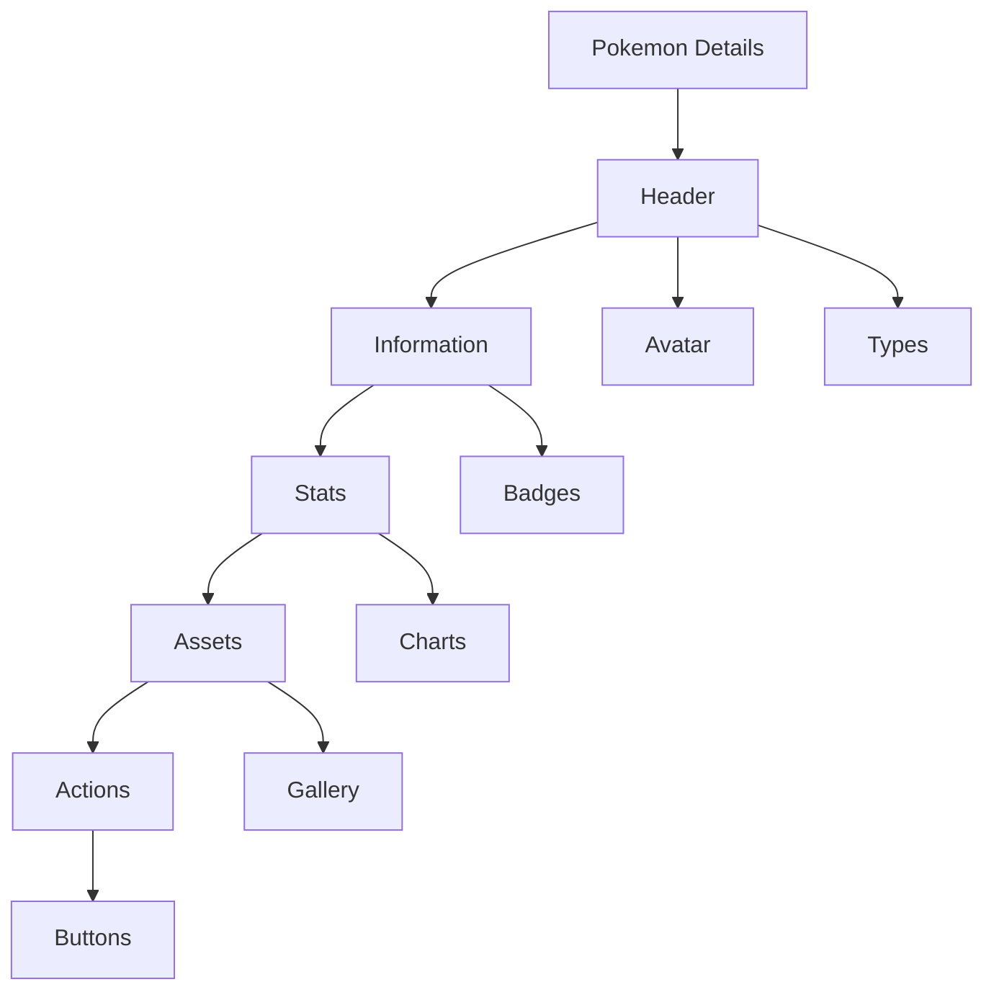

Chaque partie reste indépendante.

---

# Gestion des données

Les Complex Components peuvent recevoir :

- un Pokémon ;
- un Raid ;
- un Dataset ;
- un Provider ;
- une réponse API.

Mais ils ne doivent jamais effectuer eux-mêmes :

- un scraping ;
- une synchronisation ;
- une écriture MongoDB ;
- une génération JSON.

Ils affichent uniquement les données.

---

# Variantes

Un composant complexe peut proposer plusieurs modes d'affichage.

Exemple :

```
Pokemon Details

↓

Compact

↓

Default

↓

Extended

↓

Fullscreen
```

---

# États

Tous les composants complexes doivent gérer les états suivants.

| État | Description |
|--------|-------------|
| Loading | Chargement |
| Empty | Aucune donnée |
| Error | Erreur |
| Ready | Données disponibles |
| Refreshing | Mise à jour |
| Partial | Données incomplètes |

Les comportements doivent rester cohérents dans tout le Dashboard.

---

# Responsive

Les composants complexes sont conçus pour fonctionner sur :

- Desktop
- Laptop
- Tablet
- Mobile

Leur disposition peut évoluer sans modifier leur logique.

Exemple :

Desktop

```
Image | Informations | Statistiques
```

Mobile

```
Image

Informations

Statistiques
```

Le contenu reste identique.

---

# Cycle de vie

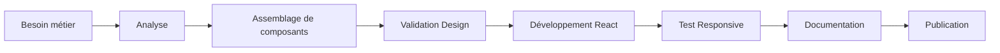

---

# Ce qu'un Complex Component ne doit jamais faire

❌ Définir ses propres couleurs.

❌ Contourner les Tokens.

❌ Créer des composants atomiques.

❌ Répliquer un composant existant.

❌ Contenir des valeurs codées en dur.

❌ Mélanger plusieurs responsabilités.

---

# Bonnes pratiques

✔ Découper les gros composants en sous-composants.

✔ Réutiliser les Composite Components.

✔ Documenter chaque propriété.

✔ Prévoir les états de chargement.

✔ Prévoir les variantes.

✔ Tester chaque scénario.

✔ Garder une API simple.

---

# Les Complex Components dans le projet

`phase-3e-prep-complex-component-spec.md` spécifie **895 variantes complexes futures**. Les modules Dashboard existent, mais ces variantes ne sont pas confirmées comme composants React/Figma réalisés.

Ils constituent la couche principale de l'expérience utilisateur.

Toutes les pages du Dashboard sont construites à partir de ces modules.

---

# Documents liés

Les composants complexes disposent chacun de leur documentation dédiée.

Exemples confirmés dans le registre :

- COMP-009 — EventsCalendarPanel
- COMP-031 — AdminApp
- COMP-044 — DetailModal
- COMP-050 — PokemonApiExplorer
- COMP-053 — PokemonDocsViewer
- COMP-058 — ShinyTrackerPanel
- COMP-059 — SourceHistoryModal / DataDeployHistoryModal / SourceRows
- COMP-070 — DashboardBacklog

Chaque document décrit :

- les variantes ;
- les sous-composants ;
- les propriétés ;
- les comportements ;
- les captures Figma ;
- les exemples React ;
- les contraintes techniques.

---

# 8. Templates

Les **Templates** représentent le plus haut niveau du Design System.

Ils définissent la **structure générale d'une interface**, sans contenir de données métier.

Un Template organise les différents modules de l'application afin de garantir une expérience utilisateur cohérente sur l'ensemble de la plateforme.

Contrairement aux Complex Components, les Templates ne cherchent pas à résoudre une fonctionnalité.

Ils décrivent uniquement **l'organisation de l'écran**.

---

# Philosophie

Un Template répond à une seule question :

> **"Comment organiser une page complète ?"**

Il ne connaît :

- aucun Pokémon ;
- aucun Raid ;
- aucune attaque ;
- aucune requête API ;
- aucune donnée MongoDB.

Il décrit uniquement :

- la disposition ;
- les zones ;
- les espacements ;
- la hiérarchie visuelle.

---

# Position dans l'architecture


Le Template constitue la dernière couche avant les pages réelles.

---

# Rôle

Le Template définit :

- la structure générale ;
- les colonnes ;
- les grilles ;
- les espacements ;
- les zones principales ;
- les comportements Responsive.

Il ne définit jamais :

- les données ;
- les appels API ;
- les Providers ;
- les composants métiers.

---

# Exemple

Une page Dashboard peut être décrite ainsi :

```text
┌────────────────────────────────────────────┐
│ Header                                     │
├────────────────────────────────────────────┤
│ Navigation                                 │
├────────────────────────────────────────────┤
│ Toolbar                                    │
├────────────────────────────────────────────┤
│ Filters                                    │
├────────────────────────────────────────────┤
│                                            │
│               Main Content                 │
│                                            │
├────────────────────────────────────────────┤
│ Footer                                     │
└────────────────────────────────────────────┘
```

Ce Template peut ensuite accueillir :

- les Raids ;
- les Eggs ;
- les Rockets ;
- les PvP Rankings ;
- les Shiny Tracker.

La structure reste identique.

---

# Les différents Templates

Le Dashboard utilise plusieurs familles de Templates.

## Dashboard Template

Structure principale utilisée par l'administration.

Contient :

- Sidebar
- Header
- Toolbar
- Zone principale
- Notifications

---

## Dataset Template

Utilisé pour :

- Raids
- Eggs
- Max Battles
- Rocket
- Research
- Events

Structure :

```
Header

↓

Source Header

↓

Toolbar

↓

Filters

↓

Statistics

↓

Dataset List

↓

Diagnostics
```

Tous les datasets suivent cette organisation.

---

## Collection Template

Utilisé pour :

- Candies
- Backgrounds
- Collections
- Assets

Structure :

```
Header

↓

Toolbar

↓

Filters

↓

Grid

↓

Preview

↓

Informations
```

---

## Pokémon Template

Utilisé pour :

- fiches Pokémon ;
- détails ;
- assets ;
- statistiques.

Structure :

```
Preview

↓

Informations

↓

Stats

↓

Assets

↓

Attacks

↓

Evolution
```

---

## Analytics Template

Utilisé pour :

- PvP Rankings ;
- Shiny Tracker.

Structure :

```
Toolbar

↓

League Selector

↓

Filters

↓

Statistics

↓

Ranking List

↓

Details
```

---

## Explorer Template

Utilisé par :

- API Explorer ;
- Source Watch.

Structure :

```
Header

↓

Endpoint Selector

↓

Request

↓

Response

↓

Diagnostics
```

---

# Responsive

Les Templates définissent également le comportement Responsive.

Exemple Desktop :

```
Sidebar | Content
```

Laptop :

```
Sidebar réduite

Content
```

Tablet :

```
Drawer

Content
```

Mobile :

```
Navigation mobile

Content vertical
```

La logique métier reste inchangée.

---

# Hiérarchie

Un Template contient plusieurs composants complexes.

Exemple :

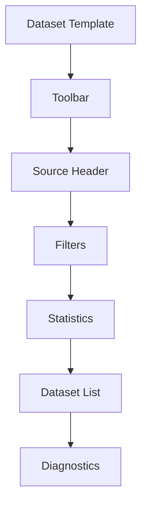

Chaque composant reste totalement indépendant.

---

# Ce qu'un Template ne doit jamais faire

❌ Contenir une requête API.

❌ Contenir une logique métier.

❌ Connaître MongoDB.

❌ Connaître les Providers.

❌ Définir les couleurs.

❌ Créer des composants.

❌ Charger des données.

Le Template organise uniquement les composants.

---

# Bonnes pratiques

✔ Réutiliser les mêmes structures.

✔ Limiter le nombre de Templates.

✔ Utiliser les grilles du Design System.

✔ Prévoir le Responsive dès la conception.

✔ Conserver une hiérarchie claire.

✔ Réutiliser les mêmes zones fonctionnelles.

---

# Les Templates dans le projet

`phase-4a-prep-template-architecture.md` décrit six Templates cibles (Dashboard, Datasets, Pokémon, Analytics, API, Monitoring). L'implémentation observée utilise un shell global et des pages composées ad hoc ; aucune couche React de Templates formalisés n'est trouvée.

Ils constituent le dernier niveau du Design System avant les pages React.

---

# Documents liés

Les Templates possèdent chacun leur documentation dédiée.

Documents cibles proposés par la spécification Phase 4A :

- TEMPLATE-001 — Dashboard Layout
- TEMPLATE-002 — Dataset Layout
- TEMPLATE-003 — Pokémon Layout
- TEMPLATE-004 — Analytics Layout
- TEMPLATE-005 — API Explorer Layout
- TEMPLATE-006 — Monitoring Layout

Chaque document décrit :

- la structure complète ;
- les variantes ;
- le responsive ;
- les composants utilisés ;
- les captures Figma ;
- les règles d'intégration React.

---

# 9. Workflow Figma

Le workflow cible pilote le Design System depuis **Figma** : aucune nouvelle interface ne devrait être développée dans React sans conception, validation et documentation.

État observé : aucun fichier de variables exportées ni preuve des pages/composants Figma attendus n'est présent dans le workspace. Pour l'état implémenté, le code React/CSS audité reste la preuve vérifiable ; Figma est la future source de vérité graphique à reconstruire et gouverner.

React est uniquement responsable de son implémentation.

---

# Philosophie

Chaque nouvelle interface suit toujours le même processus.

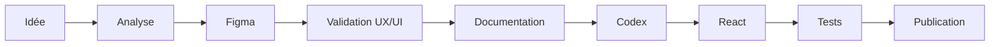

Le développement ne commence jamais directement dans VS Code.

---

# Pourquoi Figma ?

Figma permet de :

- concevoir rapidement ;
- tester plusieurs variantes ;
- maintenir une cohérence graphique ;
- documenter les composants ;
- partager facilement les maquettes ;
- préparer le travail de Codex.

Toutes les nouvelles décisions visuelles devraient être prises dans Figma une fois cette source reconstruite et reliée au code.

---

# Étape 1 — Analyse

Avant toute création, il faut répondre aux questions suivantes.

Quel problème souhaite-t-on résoudre ?

Existe-t-il déjà un composant similaire ?

Existe-t-il déjà une page équivalente ?

Peut-on réutiliser un Template existant ?

Peut-on étendre un composant existant ?

La création d'un nouveau composant reste toujours le dernier recours.

---

# Étape 2 — Conception

Une fois le besoin validé :

la nouvelle interface est créée dans Figma.

Elle doit utiliser exclusivement :

- les Variables ;
- les Design Tokens ;
- les composants du Design System.

Aucun élément ne doit être dessiné "à la main".

---

# Étape 3 — Validation

Avant toute intégration :

la maquette est vérifiée.

Les points contrôlés sont notamment :

- cohérence graphique ;
- responsive ;
- accessibilité ;
- hiérarchie visuelle ;
- respect du Design System.

---

# Étape 4 — Documentation

Une fois validée :

la fonctionnalité est documentée.

La documentation précise notamment :

- les composants utilisés ;
- les variantes ;
- les interactions ;
- les contraintes ;
- les règles d'utilisation.

Cette étape garantit la pérennité du Design System.

---

# Étape 5 — Intégration avec Codex

Une fois la documentation prête :

Codex reçoit :

- les captures Figma ;
- les règles du Design System ;
- les documents Markdown concernés ;
- les contraintes techniques.

Codex doit produire une implémentation fidèle.

Il ne doit jamais réinventer l'interface.

---

# Étape 6 — Développement React

L'intégration React consiste uniquement à reproduire fidèlement :

- la structure ;
- les espacements ;
- les animations ;
- les variantes ;
- les comportements.

Les composants React doivent correspondre au Design System.

---

# Étape 7 — Validation

Une fois le développement terminé :

plusieurs contrôles sont réalisés.

## Contrôle graphique

Comparer Figma et React.

Les deux doivent être identiques.

---

## Contrôle Responsive

Tester :

- Desktop
- Laptop
- Tablet
- Mobile

---

## Contrôle fonctionnel

Vérifier :

- les interactions ;
- les états ;
- les animations ;
- les performances.

---

# Utilisation de Codex

Codex intervient uniquement après la conception.

Son rôle est de :

- lire la documentation ;
- analyser les captures Figma ;
- comprendre les composants existants ;
- proposer une implémentation ;
- respecter l'architecture du projet.

Codex ne doit jamais :

- modifier le Design System sans validation ;
- créer de nouveaux composants inutilement ;
- contourner les Tokens ;
- casser la cohérence graphique.

---

# Évolution d'un composant

Modifier un composant suit toujours le même processus.

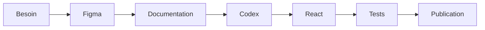

Toutes les évolutions suivent ce cycle.

---

# Les captures Figma

Les captures envoyées à Codex doivent toujours être :

- nettes ;
- complètes ;
- à l'échelle ;
- accompagnées d'explications.

Lorsqu'une fonctionnalité est complexe, plusieurs captures sont recommandées :

- vue générale ;
- variantes ;
- états ;
- responsive.

---

# Les prompts Codex

Chaque prompt destiné à Codex doit rappeler :

- les règles du projet ;
- les documents Markdown concernés ;
- les contraintes du Design System ;
- l'objectif de la fonctionnalité.

Plus le contexte est précis, meilleure sera l'implémentation.

---

# Les audits

Avant une évolution importante, un audit est fortement recommandé.

Il permet de :

- identifier les composants réutilisables ;
- repérer les duplications ;
- mesurer les impacts ;
- préparer la documentation.

L'audit précède toujours le développement.

---

# Règles

✔ Concevoir dans Figma avant React.

✔ Réutiliser les composants existants.

✔ Documenter avant d'implémenter.

✔ Utiliser les Tokens.

✔ Vérifier le Responsive.

✔ Comparer Figma et React.

✔ Mettre à jour la documentation après chaque évolution.

---

# Ce qu'il ne faut jamais faire

❌ Développer directement dans React.

❌ Modifier une page sans mettre à jour Figma.

❌ Contourner le Design System.

❌ Ajouter des couleurs en dur.

❌ Créer un composant sans documentation.

❌ Intégrer une maquette non validée.

---

# Résumé

Le workflow officiel de la plateforme est le suivant :

```text
Analyse
   ↓
Figma
   ↓
Validation
   ↓
Documentation
   ↓
Prompt Codex
   ↓
Développement React
   ↓
Tests
   ↓
Publication
```

Ce processus vise une cohérence entre la conception, le développement et la documentation. L'audit ne confirme pas encore cette synchronisation automatique.

---

# Documents liés

- DOC-001 — Règles du projet
- DOC-006 — Architecture générale
- DOC-010 — Design System Overview
- DOC-014 — Catalogue des composants
- PAGE-xxx — Pages du Dashboard
- COMP-xxx — Documentation des composants

---

# 10. Workflow React

Le Dashboard Admin est développé avec **React** et vise une architecture **Component First**. L'audit confirme un pilotage partiel par le Design System : primitives et shell partagés d'un côté, nombreux composants métier avec styles et responsabilités locales de l'autre.

React n'est pas utilisé pour créer librement des interfaces.

Son rôle est uniquement de transformer les spécifications du Design System en composants interactifs.

Autrement dit :

Le Design System décide.

React implémente.

---

# Philosophie

Chaque composant React doit répondre à une règle simple :

> **"Un composant React ne crée jamais son propre design."**

Le design provient exclusivement :

- du Design System ;
- des Design Tokens ;
- des composants documentés.

Ainsi, React reste une couche d'implémentation.

---

# Architecture React

L'architecture suit toujours la même hiérarchie.

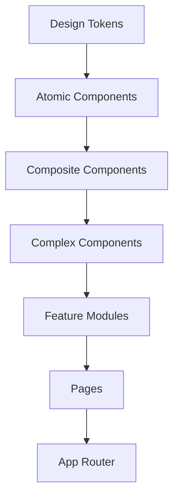

Chaque niveau possède une responsabilité unique.

---

# Cycle de développement

Toute nouvelle fonctionnalité suit le cycle suivant.

```mermaid
flowchart LR

A[Documentation]

-->B[Figma]

-->C[Audit]

-->D[Prompt Codex]

-->E[Développement React]

-->F[Tests]

-->G[Validation]

-->H[Publication]
```

Aucun développement ne doit commencer directement dans React.

---

# Principe de composition

Les composants React sont toujours composés.

Exemple :

```text
PokemonDetails

↓

PokemonHeader

↓

PokemonStats

↓

PokemonAssets

↓

PokemonAttacks

↓

PokemonEvolution
```

Chaque sous-composant reste totalement indépendant.

---

# Responsabilité unique

Chaque composant React doit avoir une responsabilité clairement définie.

Exemple :

```
PokemonHeader

↓

Afficher uniquement l'en-tête
```

```
PokemonStats

↓

Afficher uniquement les statistiques
```

```
PokemonAssets

↓

Afficher uniquement les assets
```

Il est interdit de mélanger plusieurs responsabilités dans un même composant.

---

# Les composants ne connaissent pas l'API

Un composant React reçoit des données.

Il ne sait jamais :

- comment elles sont obtenues ;
- si elles viennent de MongoDB ;
- si elles viennent d'un Provider ;
- si elles viennent d'un cache.

Exemple :

```tsx
<PokemonCard pokemon={pokemon} />
```

Le composant affiche simplement les données reçues.

---

# Séparation de la logique

La logique métier doit être séparée de l'affichage.

Architecture recommandée :

```text
React Component

↓

Custom Hook

↓

Service

↓

API

↓

MongoDB
```

Les composants ne doivent jamais contenir toute la logique métier.

---

# Hooks

Les Hooks sont utilisés pour :

- récupérer des données ;
- gérer les états ;
- encapsuler une logique réutilisable.

Ils ne doivent jamais gérer l'affichage.

Exemple :

```text
usePokemon()

useRaids()

usePvPRanking()

useShinyTracker()

useSourceWatch()
```

---

# Services

Les Services sont responsables de :

- communiquer avec l'API ;
- transformer les données ;
- centraliser les appels.

Ils évitent de dupliquer les requêtes dans plusieurs composants.

---

# Gestion des états

Chaque composant doit gérer explicitement :

| État | Description |
|--------|-------------|
| Loading | Chargement |
| Empty | Aucune donnée |
| Error | Erreur |
| Ready | Données disponibles |
| Refreshing | Actualisation |

Aucun état implicite ne doit exister.

---

# Gestion des propriétés

Les composants doivent recevoir des propriétés simples.

Exemple :

```tsx
<PokemonCard

pokemon={pokemon}

compact

showStats

showAssets

/>
```

Les composants ne doivent jamais recevoir des dizaines de propriétés inutiles.

Lorsque cela devient nécessaire, il faut revoir leur conception.

---

# Performance

Les composants React doivent limiter les rerenders.

Bonnes pratiques :

- React.memo lorsque pertinent ;
- useMemo uniquement si nécessaire ;
- useCallback uniquement lorsque cela apporte un bénéfice ;
- clés stables dans les listes ;
- composants les plus petits possibles.

La simplicité reste prioritaire.

---

# Responsive

Les composants doivent être conçus Mobile First.

Ils doivent fonctionner sur :

- Desktop
- Laptop
- Tablet
- Mobile

Le Responsive est intégré dès la conception.

---

# Gestion des erreurs

Chaque composant doit prévoir :

- les erreurs réseau ;
- les données manquantes ;
- les valeurs nulles ;
- les images absentes.

Aucun écran vide ne doit apparaître.

---

# Accessibilité

Tous les composants React doivent respecter :

- navigation clavier ;
- focus visible ;
- aria-label lorsque nécessaire ;
- contrastes suffisants ;
- tailles de clic adaptées.

---

# Ce qu'un composant React ne doit jamais faire

❌ Créer son propre style.

❌ Définir une couleur HEX.

❌ Modifier directement MongoDB.

❌ Scraper une source.

❌ Contenir plusieurs responsabilités.

❌ Répliquer un composant existant.

❌ Contourner les Design Tokens.

---

# Workflow officiel

Le développement React suit toujours cette séquence.

```text
Documentation

↓

Figma

↓

Audit

↓

Prompt Codex

↓

React

↓

Tests

↓

Responsive

↓

Validation

↓

Versionnage

↓

Publication
```

Chaque étape est obligatoire.

---

# Checklist avant validation

Avant qu'un composant soit considéré comme terminé :

✅ Documentation mise à jour

✅ Conforme au Design System

✅ Responsive

✅ Accessible

✅ Testé

✅ Performance vérifiée

✅ Aucun code dupliqué

✅ Aucun style codé en dur

✅ Versionnement effectué

---

# Documents liés

- DOC-001 — Project Rules
- DOC-006 — Architecture Overview
- DOC-010 — Design System Overview
- DOC-011 — Structure des dossiers
- DOC-014 — Catalogue des composants
- COMP-xxx — Documentation des composants
- PAGE-xxx — Documentation des pages

---

# 11. Workflow Dashboard

Le Dashboard Admin constitue le **centre de contrôle** de l'ensemble de la plateforme Pokémon GO.

Il ne se limite pas à afficher des données.

Il permet de :

- superviser les datasets ;
- contrôler les Providers ;
- générer de nouvelles données ;
- publier les datasets ;
- surveiller les sources ;
- tester l'API ;
- administrer l'ensemble de l'écosystème.

Le Dashboard est donc l'interface principale utilisée pour piloter toute la plateforme.

---

# Philosophie

Le principe cible du Dashboard est :

> **Une action utilisateur ne doit jamais modifier directement les données.**

Chaque action passe toujours par un workflow contrôlé.

Ainsi :

```
Utilisateur

↓

Dashboard

↓

API

↓

Service

↓

Pipeline

↓

MongoDB

↓

Validation

↓

Publication

↓

Retour Dashboard
```

Le client React reste une interface de pilotage. Les routes serveur Dashboard jouent aussi le rôle de BFF et accèdent directement à certaines collections MongoDB propres au Dashboard ; toutes les opérations ne transitent donc pas par `PokemonGo-API-`.

---

# Les grands workflows

Le Dashboard repose sur plusieurs workflows indépendants.

## 1. Consultation

Objectif :

Afficher des données existantes.

Exemple :

- Pokémon
- Candies
- Collections
- Backgrounds
- Raids
- PvP Rankings

Workflow :

```mermaid
flowchart LR

A[Dashboard]

-->B[API]

-->C[MongoDB]

-->D[Réponse]

-->E[Affichage]
```

Aucune modification n'est effectuée.

---

## 2. Régénération d'un dataset

Le Dashboard peut lancer la régénération complète d'un dataset.

Exemple :

- Raids
- Eggs
- Max Battles
- Research
- Rocket
- PvP Rankings
- Shiny Tracker (privé)

Workflow :

```mermaid
flowchart LR

A[Dashboard]

-->B[API]

-->C[Provider]

-->D[Normalizer]

-->E[Validator]

-->F[Diagnostics]

-->G[MongoDB]

-->H[Dashboard]
```

Le client Dashboard ne scrape pas directement une source. Les routes serveur/API peuvent orchestrer des Providers ou générateurs qui récupèrent les sources externes.

---

## 3. Publication

Une fois les données validées :

elles sont publiées.

Workflow :

```mermaid
flowchart LR

A[Payload validé]

-->B[Validation]

-->C[Hash / diff]

-->D[Upsert current]

-->E[Cache invalidation + read-back]

-->F[Dashboard]
```

Le pipeline courant vérifie hash et nombre après relecture. Aucune transaction globale ni restauration automatique n'est trouvée entre current, snapshot et collections liées ; la synchronisation statique multi-collections peut être partiellement appliquée avant un échec.

---

## 4. Consultation des diagnostics

Chaque génération produit :

- un hash ;
- des statistiques ;
- des avertissements ;
- des erreurs ;
- des temps d'exécution.

Le Dashboard affiche ces informations sans les modifier.

---

## 5. API Explorer

Le Dashboard fournit un Explorer basé sur l'OpenAPI/proxy. L'audit ne démontre pas qu'il couvre et teste automatiquement l'ensemble des 156 routes ni toutes les variantes privées.

Workflow :

```mermaid
flowchart LR

Dashboard

↓

Endpoint

↓

API

↓

Réponse

↓

Visualisation
```

Le Dashboard devient ainsi un outil de validation des routes API.

---

## 6. Source Watch

Le Dashboard surveille les Providers.

Exemple :

- LeekDuck
- PvPoke
- Pokémon GO Live
- Snacknap (privé)
- ShinyRates (si utilisé)

Le système vérifie notamment :

- disponibilité ;
- date de modification ;
- hash ;
- structure ;
- volume de données.

Une alerte est générée lorsqu'une anomalie est détectée.

---

## 7. Synchronisation MongoDB

Le client React ne modifie jamais directement MongoDB. Les routes serveur Dashboard utilisent toutefois le driver MongoDB pour les domaines Dashboard ; les opérations Pokémon distantes passent par les handlers/proxies vers `PokemonGo-API-`.

Exemple :

```mermaid
flowchart LR

Dashboard

↓

API

↓

Service

↓

MongoDB

↓

Validation

↓

Retour
```

Cette séparation garantit la sécurité des données.

---

# Les modules du Dashboard

Le Dashboard est organisé en plusieurs grands modules.

## Administration Pokémon

- Accueil
- Fiches
- Candies
- Backgrounds
- Collections

---

## Datasets

- Raids
- Eggs
- Max Battles
- Rockets
- Research
- Event Calendar

---

## Analytics

- Shiny Tracker
- PvP Rankings

---

## Infrastructure

- Assets
- API Explorer
- Source Watch
- Paramètres

L'inventaire complet comprend 23 sections Pokémon : overview, pokedex, candies, backgrounds, collections, assets, catalogs, raids, max-battles, rocket, pvp-rankings, eggs, research, events, shiny, checks, sources, compare, todo, logs, rules, bulk et export. Le Dashboard possède aussi 20 pages routées, dont les outils personnels et Learning.

Chaque module est indépendant.

---

# Les actions utilisateur

Une action suit toujours le même cycle.

```mermaid
flowchart TD

A[Clic utilisateur]

-->B[Confirmation]

-->C[API]

-->D[Traitement]

-->E[Validation]

-->F[Notification]

-->G[Mise à jour de l'interface]
```

La confirmation et la notification sont les comportements attendus. L'audit relève encore des actions/fallbacks dont la visibilité et la journalisation ne sont pas homogènes.

---

# Gestion des états

Les états ci-dessous constituent la nomenclature cible. Leur implémentation n'est pas homogène sur toutes les pages et tous les panneaux.

| État | Description |
|-------|-------------|
| Loading | Chargement |
| Refreshing | Actualisation |
| Ready | Données disponibles |
| Empty | Aucune donnée |
| Error | Erreur |
| Publishing | Publication en cours |
| Success | Opération terminée |

Cette homogénéité améliore l'expérience utilisateur.

---

# Notifications

Le Dashboard utilise notamment Sonner et des états locaux pour informer l'utilisateur, sans preuve d'une couverture systématique de chaque opération.

Exemples :

- génération terminée ;
- publication réussie ;
- erreur Provider ;
- erreur MongoDB ;
- nouvelle version disponible ;
- Provider indisponible.

Aucune opération importante ne doit rester silencieuse.

---

# Responsive

Le Dashboard doit fonctionner sur :

- Desktop
- Laptop
- Tablet
- Mobile

Certaines fonctionnalités peuvent être adaptées, mais jamais supprimées.

L'expérience utilisateur doit rester cohérente.

---

# Règles du Dashboard

Le Dashboard applique les principes suivants :

✔ Depuis React, toujours utiliser une route serveur ou un service explicite.

✔ Réserver l'accès MongoDB aux handlers/services serveur autorisés.

✔ Afficher les diagnostics.

✔ Journaliser les actions importantes.

✔ Utiliser les composants du Design System.

✔ Respecter les états communs.

✔ Utiliser les Providers existants.

✔ Documenter chaque nouveau module.

---

# Ce qu'il ne faut jamais faire

❌ Modifier MongoDB depuis React.

❌ Scraper une source depuis le Dashboard.

❌ Contourner l'API.

❌ Contourner les Providers.

❌ Publier un dataset sans validation.

❌ Créer une interface sans Design System.

❌ Ajouter une page sans documentation.

---

# Workflow global

Le fonctionnement complet du Dashboard peut être résumé ainsi.

```mermaid
flowchart TD

A[Utilisateur]

-->B[Dashboard]

-->C[API]

-->D[Service]

-->E[Provider]

-->F[Pipeline]

-->G[Validation]

-->H[MongoDB]

-->I[API]

-->J[Dashboard]

-->K[Utilisateur]
```

Ce workflow représente le chemin cible des mutations Pokémon. Events, Learning, backlog, stores Dashboard, référentiels statiques et datasets courants possèdent des variantes documentées dans l'audit.

---

# Évolutions futures

Le Dashboard a été conçu pour accueillir facilement de nouveaux modules.

Chaque nouvelle fonctionnalité devra respecter le même workflow.

Cela permettra notamment d'ajouter :

- de nouveaux Providers ;
- de nouveaux datasets ;
- de nouveaux outils internes ;
- de nouvelles interfaces d'administration.

Sans remettre en cause l'architecture existante.

---

# Documents liés

- DOC-006 — Architecture Overview
- DOC-013 — Catalogue des pages
- DOC-019 — Référence API
- DOC-016 — Providers externes
- DOC-017 — Datasets et vérités
- ARCH-001 — Provider Architecture
- ARCH-002 — Dataset Lifecycle
- PAGE-001 à PAGE-043 pour le Dashboard ; PAGE-044 à PAGE-048 pour les interfaces publiques

---

# 12. Responsive Design

Le Responsive Design est un pilier fondamental du Design System.

Chaque composant, chaque module et chaque page doivent fonctionner correctement sur l'ensemble des appareils pris en charge.

Le Responsive ne consiste pas uniquement à adapter une interface à une taille d'écran.

Il garantit une expérience cohérente quel que soit le support utilisé.

Le Responsive doit être pensé dès la conception. L'audit ne trouve pas de preuve locale que chaque interface a été conçue/validée dans Figma avant React.

---

# Philosophie

Le Responsive suit un principe simple :

> **Une fonctionnalité ne disparaît jamais.**

L'interface peut évoluer.

La disposition peut changer.

Les composants peuvent être réorganisés.

Mais une fonctionnalité ne doit jamais être supprimée uniquement parce que l'écran est plus petit.

---

# Objectifs

Le Responsive poursuit plusieurs objectifs.

- garantir une expérience homogène ;
- conserver toutes les fonctionnalités ;
- optimiser la lisibilité ;
- améliorer les performances ;
- éviter les doubles interfaces ;
- simplifier la maintenance.

---

# Les tailles d'écran

Le Dashboard distingue plusieurs catégories.

| Type observé | Largeur / seuil |
|--------------|-----------------|
| Petit mobile personnalisé | 480 px sur quelques grilles |
| `sm` | ≥ 640 px |
| `md` | ≥ 768 px |
| `lg` | ≥ 1024 px ; apparition de la sidebar desktop |
| `xl` | ≥ 1280 px |
| `2xl` | ≥ 1536 px |
| Ultra Wide | aucun breakpoint dédié ; contenu plafonné à 1680 px |

Toutes les interfaces doivent être testées sur ces formats.

---

# Mobile First

Les classes Tailwind suivent majoritairement une approche Mobile First. Plusieurs composants utilisent toutefois des dimensions, hauteurs minimales et grilles denses qui nécessitent une validation spécifique sur petits écrans.

Chaque nouvelle interface est pensée pour fonctionner sur un petit écran avant d'être enrichie pour les résolutions supérieures.

Cela permet :

- un code plus simple ;
- moins de CSS ;
- une meilleure évolutivité.

---

# Les règles du Responsive

## La hiérarchie reste identique

Changer de résolution ne doit jamais modifier la logique de l'application.

Seule la disposition évolue.

---

## Les composants restent identiques

Un composant conserve :

- ses couleurs ;
- ses comportements ;
- ses variantes ;
- ses états.

Seule sa taille peut évoluer.

---

## Les données restent identiques

Le Responsive ne doit jamais masquer une donnée importante.

Si nécessaire :

- utiliser un accordéon ;
- utiliser un Drawer ;
- utiliser une modale ;
- utiliser une section repliable.

---

# Sidebar

Desktop

```
┌────────────┬────────────────────┐
│ Sidebar    │ Content            │
│ permanente │                    │
└────────────┴────────────────────┘
```

Laptop

```
┌──────────┬──────────────────────┐
│ Sidebar  │ Content              │
│ réduite  │                      │
└──────────┴──────────────────────┘
```

Tablet

```
☰

Content
```

Mobile

```
☰ Drawer

Content
```

Implémentation observée : sidebar fixe 236 px, 286 px en `2xl`, repliée à 84 px à partir de `lg` ; drawer mobile 286 px sous `lg`. La navigation reste disponible, mais le drawer n'a pas de `max-width: 100vw` explicite.

---

# Grilles

Les grilles s'adaptent progressivement.

Exemple :

Desktop

```
4 colonnes
```

Laptop

```
3 colonnes
```

Tablet

```
2 colonnes
```

Mobile

```
1 colonne
```

Cette progression est une règle cible. Certaines sous-grilles restent à deux ou trois colonnes dès le mobile.

---

# Tableaux

Les tableaux sont l'un des éléments les plus sensibles.

Le Dashboard privilégie les cards/grilles pour la majorité des données. Une table JSX explicite est confirmée dans le viewer documentaire et utilise un conteneur horizontal scrollable.

Desktop

Tableau complet.

Tablet

Colonnes secondaires masquées.

Mobile

Transformation en Cards.

Aucune donnée n'est perdue.

---

# Modales

Les modales évoluent également.

Desktop

Fenêtre centrée.

Laptop

Fenêtre plus étroite.

Tablet

Largeur maximale.

Mobile

Plein écran ou bottom-sheet selon l'implémentation.

Le composant Modal commun est responsive, mais les modales Event, Collections, Source Watch et détails utilisent des implémentations indépendantes avec risques de scrolls imbriqués.

---

# Cartes Pokémon

Les Cards Pokémon conservent toujours :

- l'image ;
- le nom ;
- les types ;
- les badges principaux.

Les informations secondaires peuvent être déplacées dans une section repliable.

---

# Sections du Dashboard

Les modules suivent tous les mêmes règles.

Exemple :

Desktop

```
Toolbar

↓

Filters

↓

Stats

↓

Liste

↓

Diagnostics
```

Mobile

```
Toolbar

↓

Stats

↓

Filters

↓

Liste

↓

Diagnostics
```

L'ordre des informations est adapté afin de privilégier les éléments les plus importants.

---

# Responsive des composants

Chaque composant possède son propre comportement.

Exemple :

Button

Desktop

```
[ Icône ][ Texte ]
```

Mobile

```
[ Icône ]
```

Cette transformation n'est pas appliquée uniformément. Les Tooltips ne constituent pas une primitive partagée confirmée.

---

# Images

Les images utilisent majoritairement :

- object-fit ;
- lazy loading ;
- tailles adaptées.

Les images ne doivent jamais être étirées.

---

# Performances

Le Responsive ne doit pas dégrader les performances.

Les composants peuvent :

- être virtualisés ;
- être lazy-loadés ;
- réduire certaines animations.

Le contenu reste identique.

---

# Tests Responsive

Chaque page doit être validée sur :

✅ Mobile

✅ Tablet

✅ Laptop

✅ Desktop

✅ Ultra Wide

Les tests devraient vérifier :

- la navigation ;
- les modales ;
- les Drawers ;
- les filtres ;
- les tableaux ;
- les graphiques ;
- les formulaires.

---

# Checklist

Avant validation :

État de l'audit : les captures 320/375/768/1024/1440/1920, les tests iOS/Android, le zoom 200/400 %, le clavier virtuel et le parcours tactile complet ne sont pas trouvés. Les éléments ci-dessous restent donc une checklist à exécuter, pas des validations acquises.

✅ Aucun débordement horizontal

✅ Aucune Card cassée

✅ Aucun texte tronqué

✅ Tous les boutons accessibles

✅ Les modales fonctionnent

✅ Les Drawers fonctionnent

✅ Les tableaux restent lisibles

✅ Les graphiques restent utilisables

---

# Ce qu'il ne faut jamais faire

❌ Masquer une fonctionnalité.

❌ Créer deux interfaces différentes.

❌ Utiliser des tailles fixes.

❌ Déformer une image.

❌ Modifier la logique métier.

❌ Casser la hiérarchie visuelle.

---

# Workflow Responsive

```mermaid
flowchart LR

A[Figma]

-->B[Validation Responsive]

-->C[Intégration React]

-->D[Tests Desktop]

-->E[Tests Laptop]

-->F[Tests Tablet]

-->G[Tests Mobile]

-->H[Publication]
```

Ce workflow reste la cible. Aucun gate automatisé ne prouve une validation de tous ces viewports avant chaque mise en production.

---

# Résumé

Le Responsive du Dashboard vise à garantir que :

- toutes les fonctionnalités restent disponibles ;
- l'expérience utilisateur reste cohérente ;
- les composants conservent leurs comportements ;
- les performances restent optimales ;
- la maintenance est simplifiée.

Il constitue un élément central du Design System et doit être pris en compte dès les premières phases de conception.

---

# Documents liés

- DOC-010 — Design System Overview
- DOC-013 — Catalogue des pages
- DOC-025 — Responsive
- TEMPLATE-001 à TEMPLATE-006
- COMP-001 à COMP-136 dans le registre global audité

---

# 13. Dark / Light Theme

Le Dashboard Admin prend en charge deux thèmes officiels :

- 🌙 Dark Theme
- ☀️ Light Theme

Ces deux thèmes utilisent exactement les mêmes composants, la même architecture et les mêmes interactions.

Les variables CSS principales changent. Le mode light utilise aussi des sélecteurs correctifs globaux ciblant des fragments de classes Tailwind et plusieurs `!important`, car de nombreux composants métier conservent des couleurs dark locales.

---

# Philosophie

Le thème ne constitue pas une version différente du Dashboard.

Il représente uniquement une autre interprétation visuelle du même Design System.

Autrement dit :

```
Component

↓

Design Tokens

↓

Dark Theme

ou

Light Theme
```

Le composant reste identique.

---

# Objectifs

Le système de thèmes poursuit plusieurs objectifs.

- améliorer le confort visuel ;
- proposer une expérience adaptée à l'environnement de l'utilisateur ;
- garantir une cohérence graphique ;
- simplifier la maintenance ;
- préparer l'arrivée de futurs thèmes.

---

# Architecture

La cible repose exclusivement sur les **Semantic Tokens**. L'implémentation réelle combine variables CSS, classes Tailwind, huit palettes et couleurs littérales locales.

```mermaid
flowchart TD

A[Primitive Colors]

-->B[Semantic Tokens]

B --> C[Dark Theme]

B --> D[Light Theme]

C --> E[Components]

D --> E
```

Cette architecture décrit la direction cible. La couverture light actuelle dépend aussi de règles CSS correctives, donc une évolution de thème peut exiger une adaptation des styles métier.

---

# Dark Theme

Le thème sombre constitue le thème principal du Dashboard.

Il est optimisé pour :

- les longues sessions de travail ;
- les environnements peu lumineux ;
- les interfaces d'administration.

Il met en avant :

- les effets de verre ;
- les halos lumineux ;
- les couleurs Pokémon ;
- les cartes translucides.

Le Dark Theme représente l'identité visuelle principale du projet.

---

# Light Theme

Le thème clair reprend exactement la même architecture.

Il utilise :

- des surfaces lumineuses ;
- des contrastes adaptés ;
- des ombres plus marquées ;
- des effets de profondeur plus subtils.

L'objectif est de conserver la même expérience utilisateur.

---

# Les Tokens

Les primitives et le shell utilisent largement les Tokens. Les composants métier ne les utilisent pas exclusivement.

Exemple :

```
Surface Primary

↓

Dark

↓

Neutral-900
```

```
Surface Primary

↓

Light

↓

Neutral-50
```

Le composant ne connaît jamais la couleur réelle.

---

# Les couleurs Pokémon

Les couleurs liées aux types Pokémon restent identiques dans les deux thèmes.

Exemple :

- Feu
- Eau
- Plante
- Électrik
- Dragon
- Spectre

Ces couleurs représentent une donnée métier.

Elles ne changent donc pas lors du passage d'un thème à l'autre.

---

# Glassmorphism

Le Dashboard utilise des effets de verre.

Dark Theme

- flou plus marqué ;
- transparence élevée ;
- halo lumineux.

Light Theme

- transparence plus légère ;
- ombres douces ;
- contraste renforcé.

Les classes `glass-panel` et `glass-panel-strong` centralisent les paramètres principaux. D'autres surfaces utilisent des backgrounds, blurs et shadows locaux.

---

# Icônes

Les icônes changent automatiquement de couleur.

Exemple :

Dark

```
Text Primary
```

↓

Blanc

Light

```
Text Primary
```

↓

Noir

Les icônes Lucide héritent souvent de `currentColor`, mais des couleurs locales et des assets raster/SVG fixes existent également.

---

# Images

Les images Pokémon ne sont jamais modifiées.

Les Assets restent identiques.

Seules les surfaces du Dashboard changent.

---

# Comportement

Le changement de thème doit être instantané.

Aucune page ne doit être rechargée.

Le Dashboard applique simplement un nouvel ensemble de Tokens.

---

# Persistance

Le thème sélectionné est sauvegardé.

À la prochaine ouverture :

- le thème précédent est automatiquement restauré ;
- aucune action utilisateur n'est nécessaire.

---

# Détection système

Le mode système automatique n'est pas actif dans l'implémentation auditée : `enableSystem={false}`. `ThemeProvider` expose uniquement `dark` et `light`, utilise `dark` par défaut, applique le thème via la classe HTML et persiste le choix sous `matweb-theme`.

---

# Accessibilité

Les deux thèmes doivent respecter :

- un contraste suffisant ;
- une lisibilité optimale ;
- une hiérarchie identique ;
- les recommandations WCAG.

Le changement de thème ne doit jamais réduire l'accessibilité.

---

# Responsive

Le comportement Responsive est identique dans les deux thèmes.

Aucun composant ne change de taille.

Seuls les Tokens évoluent.

---

# Tests

Chaque nouvelle interface est testée dans :

✅ Dark Theme

✅ Light Theme

Les captures Figma doivent également être validées dans les deux thèmes.

État observé : tests visuels systématiques light/dark, contrastes automatisés des huit palettes et captures Figma exhaustives non trouvés.

---

# Bonnes pratiques

✔ Utiliser uniquement les Semantic Tokens.

✔ Prévoir les deux thèmes dès la conception.

✔ Tester les contrastes.

✔ Vérifier les illustrations.

✔ Vérifier les graphiques.

✔ Vérifier les cartes.

---

# Ce qu'il ne faut jamais faire

❌ Ajouter une nouvelle couleur HEX sans documenter la dette et son intention.

❌ Créer deux composants différents.

❌ Définir un style spécifique au thème dans React.

❌ Modifier les Assets Pokémon.

❌ Coder des conditions "if dark".

Les composants doivent rester totalement indépendants du thème.

---

# Workflow

```mermaid
flowchart LR

A[Design Tokens]

-->B[Dark]

A --> C[Light]

B --> D[React]

C --> D

D --> E[Dashboard]
```

Le changement de thème ne modifie pas la structure React, mais il active actuellement des variables et sélecteurs CSS correctifs en plus des tokens.

---

# Résumé

Le système Dark / Light repose sur un principe simple :

Les composants React restent identiques. Les variables CSS, palettes et règles light spécifiques changent leur rendu.

Cette approche garantit :

- une maintenance simplifiée ;
- une parfaite cohérence graphique ;
- une excellente évolutivité.

---

# Documents liés

- DOC-010 — Design System Overview
- DS-002 — Token System
- DS-003 — Colors
- DS-007 — Glass Effects
- DOC-025 — Responsive

---

# 14. Pokémon Identity

Le Dashboard Admin possède une identité graphique unique inspirée de l'univers officiel de **Pokémon GO**.

L'objectif n'est pas de reproduire l'interface du jeu.

L'objectif est de créer un environnement moderne qui évoque immédiatement Pokémon GO tout en restant parfaitement adapté à une utilisation professionnelle.

Cette identité graphique constitue l'un des piliers du Design System.

---

# Philosophie

Chaque écran doit permettre à l'utilisateur de reconnaître immédiatement l'univers Pokémon GO.

Cette identité repose sur plusieurs éléments :

- les couleurs des types ;
- les illustrations officielles ;
- les Assets Pokémon ;
- les badges ;
- les Backgrounds ;
- les effets lumineux ;
- les cartes translucides ;
- les icônes officielles.

Le Dashboard doit être identifiable même sans afficher le logo Pokémon GO.

---

# Les Pokémon avant tout

Les Pokémon représentent l'élément principal de l'application.

Ils doivent toujours être mis en valeur.

Chaque fiche Pokémon doit privilégier :

- les illustrations GO ;
- les Assets HOME lorsque nécessaire ;
- les formes ;
- les costumes ;
- les variantes régionales ;
- les Méga-évolutions ;
- les Gigamax ;
- les Dynamax ;
- les formes temporaires.

Les Pokémon constituent toujours l'élément visuel dominant.

---

# Les Types Pokémon

Les types représentent la principale identité colorimétrique du projet.

Ils ne sont jamais remplacés.

Chaque type possède une couleur officielle.

Exemple :

| Type | Couleur dominante |
|--------|-------------------|
| Plante | Vert |
| Feu | Orange |
| Eau | Bleu |
| Électrik | Jaune |
| Psy | Rose |
| Dragon | Indigo |
| Spectre | Violet |
| Roche | Marron |
| Acier | Gris |
| Fée | Rose clair |

Ces couleurs sont utilisées :

- dans les Badges ;
- dans les cartes ;
- dans les graphiques ;
- dans les statistiques ;
- dans les panneaux d'informations.

---

# Les couleurs des cartes

Les cartes Pokémon utilisent une couleur de fond dérivée du type principal.

Exemple :

```
Type Feu

↓

Fond orange à faible opacité

↓

Texte blanc

↓

Halo orange
```

Cette règle est utilisée dans plusieurs modules :

- PvP Rankings
- Shiny Tracker
- Fiches Pokémon
- Raids
- Max Battles

Elle améliore immédiatement la lecture.

---

# Les icônes officielles

Lorsque des icônes officielles existent, elles doivent être privilégiées.

Exemples :

- Candy
- Candy XL
- Raid
- Lucky Egg
- Team GO Rocket
- Research
- Event
- Battle
- Pokéball

Ces icônes renforcent immédiatement l'identité graphique.

---

# Les Assets

Le projet utilise plusieurs familles d'Assets.

- GO Assets
- HOME Assets
- Icônes
- Backgrounds
- Location Cards
- Images d'événements

Les Assets ne doivent jamais être modifiés.

Ils représentent la référence graphique officielle.

---

# Les Backgrounds

Les Backgrounds représentent une partie importante de l'identité du Dashboard.

Ils permettent :

- d'identifier les événements ;
- d'identifier certaines localisations ;
- de différencier plusieurs catégories.

Les images doivent conserver :

- leurs proportions ;
- leur cadrage ;
- leur qualité.

---

# Les Badges

Les Badges sont utilisés partout.

Ils mettent en avant :

- les Types ;
- les Formes ;
- les Costumes ;
- les Régions ;
- les Événements ;
- les Générations ;
- les Datasets ;
- les Providers.

Les Badges doivent toujours utiliser les couleurs du Design System.

---

# Les animations

Les animations doivent rappeler l'univers Pokémon GO.

Exemples :

- léger glow ;
- pulse discret ;
- apparition douce ;
- transitions fluides.

Les animations spectaculaires sont réservées aux éléments exceptionnels.

---

# Les effets lumineux

Le Dashboard utilise régulièrement :

- Glow
- Halo
- Blur
- Reflets

Ces effets servent uniquement à mettre en valeur certaines informations.

Ils ne doivent jamais gêner la lecture.

---

# Les illustrations

Les illustrations doivent respecter plusieurs principes.

Toujours privilégier :

- les Assets officiels ;
- les illustrations HD ;
- les images transparentes.

Éviter :

- les captures d'écran ;
- les images compressées ;
- les assets redimensionnés.

---

# Les graphiques

Les graphiques utilisent eux aussi les couleurs Pokémon.

Exemple :

PvP

↓

Type principal

↓

Couleur du graphique

Cette cohérence améliore la compréhension.

---

# Les statistiques

Les informations importantes doivent être immédiatement visibles.

Exemples :

- CP
- IV
- Rang PvP
- Spawn Rate
- Shiny Odds
- Attaque
- Défense
- Endurance

Les cartes utilisent :

- des couleurs ;
- des icônes ;
- des indicateurs visuels.

---

# Les Modules Pokémon

Chaque module possède sa propre identité.

## Pokémon

Accent sur les illustrations.

---

## PvP Rankings

Accent sur les Types et les statistiques.

---

## Shiny Tracker

Accent sur les couleurs rares et les probabilités.

---

## Raids

Accent sur les Tiers.

---

## Eggs

Accent sur les distances.

---

## Rocket

Accent sur Team GO Rocket.

---

## Research

Accent sur les tâches.

---

## Event Calendar

Accent sur les événements.

Chaque module conserve cependant une cohérence globale.

---

# Les émotions

Le Dashboard doit transmettre plusieurs sensations.

- moderne ;
- professionnel ;
- vivant ;
- dynamique ;
- technologique.

L'utilisateur doit ressentir qu'il utilise un véritable outil dédié à Pokémon GO.

---

# Ce qu'il faut éviter

❌ Interface générique.

❌ Couleurs sans signification.

❌ Icônes incohérentes.

❌ Mélange de styles.

❌ Illustrations de mauvaise qualité.

❌ Effets visuels excessifs.

---

# Résumé

L'identité Pokémon GO repose sur plusieurs piliers.

- les Pokémon ;
- les Types ;
- les Assets officiels ;
- les couleurs ;
- les Badges ;
- les icônes ;
- les effets lumineux ;
- les animations.

Tous ces éléments travaillent ensemble afin de créer une interface immédiatement reconnaissable.

Le Design System doit permettre de développer de nouveaux modules sans jamais perdre cette identité.

---

# Documents liés

- DOC-010 — Design System Overview
- DOC-021 — Assets et conventions
- DS-003 — Colors
- DS-007 — Glass Effects
- COMP-052 — PokemonCard, qui contient les badges de type observés
- COMP-117 — PokemonStyle, source des styles Pokémon partagés
- ASSET-001 — Asset Architecture

---

# 15. Glass Effects

Les **Glass Effects** (Glassmorphism) constituent l'un des éléments les plus caractéristiques du Design System.

Ils apportent une sensation de profondeur, de modernité et de légèreté tout en renforçant l'identité visuelle de la plateforme Pokémon GO.

Leur utilisation doit cependant rester maîtrisée.

L'objectif n'est jamais de créer un effet décoratif, mais de mettre en valeur les informations importantes.

---

# Philosophie

Le Glassmorphism ne doit jamais devenir un effet visuel gratuit.

Chaque effet de verre doit répondre à au moins un objectif :

- améliorer la hiérarchie visuelle ;
- mettre en avant un composant ;
- créer une séparation entre plusieurs zones ;
- renforcer l'identité graphique.

Si un Glass Effect n'apporte aucune valeur, il ne doit pas être utilisé.

---

# Principes

Le système repose sur plusieurs éléments combinés.

- transparence
- flou
- lumière
- ombre
- contour
- profondeur

Aucun de ces éléments ne doit être utilisé seul.

C'est leur combinaison qui crée l'effet de verre.

---

# Composition d'une Glass Card

Une Glass Card est généralement composée de :

```text
╔══════════════════════════════╗
║                              ║
║   Blur arrière-plan          ║
║                              ║
║   Surface translucide        ║
║                              ║
║   Bordure lumineuse          ║
║                              ║
║   Ombre douce                ║
║                              ║
╚══════════════════════════════╝
```

Chaque couche possède un rôle précis.

---

# Les composants concernés

Les effets de verre sont principalement utilisés sur :

- Cards
- Panels
- Modales
- Drawers
- Toolbars
- Sidebar
- Popovers
- Dialogs
- Floating Panels

Les composants de formulaire utilisent des effets plus discrets.

---

# Intensité

Le Design System définit plusieurs niveaux d'intensité.

| Niveau | Utilisation |
|---------|-------------|
| Glass XS | Informations secondaires |
| Glass SM | Cards simples |
| Glass MD | Panels |
| Glass LG | Modales |
| Glass XL | Hero / Pages spéciales |

Tous les composants utilisent l'un de ces niveaux.

---

# Transparence

La transparence est contrôlée exclusivement par les Design Tokens.

Les composants ne définissent jamais eux-mêmes leur opacité.

Exemple :

```
Surface Glass XS

↓

Surface Glass SM

↓

Surface Glass MD

↓

Surface Glass LG
```

---

# Blur

Le flou crée la sensation de profondeur.

Il est appliqué uniquement :

- derrière les surfaces vitrées ;
- jamais sur le contenu.

Le texte doit toujours rester parfaitement net.

---

# Bordures

Chaque Glass Component possède une bordure discrète.

Objectifs :

- délimiter la surface ;
- améliorer la lisibilité ;
- renforcer la sensation de verre.

Les bordures utilisent toujours les Semantic Tokens.

---

# Ombres

Les ombres restent volontairement douces.

Elles servent uniquement à créer une hiérarchie.

Une ombre trop forte casse immédiatement l'effet de verre.

---

# Glow

Certains composants utilisent également un halo lumineux.

Exemples :

- Pokémon légendaires
- Shiny
- Cartes importantes
- Notifications
- Événements

Le Glow doit rester subtil.

Il ne remplace jamais une couleur de fond.

---

# Couleurs

Les Glass Components utilisent :

- Surface Primary
- Surface Secondary
- Surface Elevated

Les couleurs Pokémon peuvent être utilisées en arrière-plan avec une faible opacité.

Exemple :

Carte Feu

↓

Fond orange translucide

↓

Glass Effect

↓

Halo orange léger

Cette approche conserve la lisibilité tout en rappelant le type du Pokémon.

---

# Responsive

Les effets de verre doivent fonctionner sur toutes les tailles d'écran.

Sur Mobile :

- réduire légèrement le Blur ;
- réduire les Ombres ;
- conserver la lisibilité.

Le Responsive ne doit jamais supprimer complètement les Glass Effects.

---

# Performance

Les effets de verre utilisent :

- backdrop-filter ;
- blur ;
- transparence.

Ces propriétés peuvent être coûteuses.

Leur utilisation doit rester limitée.

Bonnes pratiques :

✔ éviter plusieurs couches de Blur superposées ;

✔ limiter les grands panneaux translucides ;

✔ privilégier les surfaces statiques.

---

# Accessibilité

Les Glass Effects ne doivent jamais réduire :

- le contraste ;
- la lisibilité ;
- la navigation.

Le contenu reste prioritaire.

Le verre n'est qu'un support.

---

# Bonnes pratiques

✔ Utiliser les Glass Effects uniquement sur les surfaces importantes.

✔ Réutiliser les niveaux définis.

✔ Conserver une opacité homogène.

✔ Ajouter un léger Glow uniquement lorsque cela apporte une information.

✔ Tester les contrastes.

---

# Ce qu'il ne faut jamais faire

❌ Créer plusieurs styles de verre différents.

❌ Utiliser plusieurs Blur empilés.

❌ Ajouter des Glow excessifs.

❌ Diminuer le contraste du texte.

❌ Modifier les valeurs directement dans les composants React.

Toutes les propriétés doivent provenir des Design Tokens.

---

# Exemples d'utilisation

Les Glass Effects sont présents notamment dans :

- Dashboard principal
- Cartes Pokémon
- PvP Rankings
- Shiny Tracker
- API Explorer
- Source Watch
- Modales
- Paramètres

Ils participent à l'identité graphique de toute la plateforme.

---

# Workflow

```mermaid
flowchart LR

A[Design Tokens]

-->B[Glass Surface]

-->C[Blur]

-->D[Border]

-->E[Shadow]

-->F[Glow]

-->G[React Component]

-->H[Dashboard]
```

Chaque Glass Component est construit à partir de ces différentes couches.

---

# Résumé

Les Glass Effects constituent l'un des éléments visuels les plus reconnaissables du Dashboard.

Ils permettent de :

- renforcer l'identité graphique ;
- améliorer la hiérarchie visuelle ;
- mettre en valeur certaines informations ;
- créer une interface moderne et immersive.

Ils doivent cependant rester cohérents, performants et toujours au service de l'expérience utilisateur.

---

# Documents liés

- DOC-010 — Design System Overview
- DS-002 — Token System
- DS-003 — Colors
- DS-006 — Shadows
- DS-008 — Animations
- COMP-121 — Card / CardHeader / CardTitle / CardDescription
- COMP-034 — Panel et sous-composants d'administration Pokémon
- COMP-123 — Modal

---

# 16. Animations

Les animations constituent une partie intégrante du Design System.

Elles ne sont jamais utilisées comme un simple effet décoratif.

Chaque animation possède un objectif précis :

- guider l'utilisateur ;
- améliorer la compréhension de l'interface ;
- renforcer la hiérarchie visuelle ;
- rendre les interactions plus naturelles ;
- apporter une sensation de fluidité.

Une animation qui n'apporte aucune valeur doit être supprimée.

---

# Philosophie

Le Dashboard privilégie des animations :

- rapides ;
- discrètes ;
- fluides ;
- cohérentes ;
- performantes.

L'utilisateur ne doit jamais attendre une animation.

Au contraire, elle doit donner l'impression que l'interface réagit instantanément.

---

# Les rôles des animations

Les animations servent principalement à :

## Feedback utilisateur

Confirmer qu'une action a été prise en compte.

Exemples :

- clic sur un bouton ;
- ouverture d'une modale ;
- validation d'un formulaire ;
- suppression d'un élément.

---

## Transition

Accompagner le passage d'un état à un autre.

Exemples :

- changement d'onglet ;
- ouverture d'un accordéon ;
- changement de filtre ;
- changement de page.

---

## Orientation

Aider l'utilisateur à comprendre où se trouve un élément.

Exemples :

- apparition d'une notification ;
- ouverture d'un Drawer ;
- scroll automatique.

---

## Mise en valeur

Attirer discrètement l'attention.

Exemples :

- nouveau Pokémon ;
- nouveau Raid ;
- nouveau Dataset ;
- erreur critique.

---

# Les familles d'animations

Le Design System distingue plusieurs catégories.

| Catégorie | Utilisation |
|-----------|-------------|
| Fade | Apparition / disparition |
| Slide | Déplacement |
| Scale | Zoom léger |
| Pulse | Mise en valeur |
| Glow | Halo lumineux |
| Rotate | Rotation légère |
| Skeleton | Chargement |
| Progress | Avancement |
| Hover | Interaction souris |

Chaque catégorie possède ses propres règles.

État observé : CSS, Tailwind, Framer Motion et DnD coexistent. GSAP est déclaré dans les dépendances du Dashboard, tandis que l'audit Design System confirme surtout les animations CSS/Tailwind/Framer dans le Dashboard.

---

# Les durées

La nomenclature XS/SM/MD/LG/XL reste la cible ; aucun token de durée portant ces noms n'est trouvé dans le code.

| Durée observée | Utilisation confirmée |
|----------------|-----------------------|
| 200 ms | transitions de composants |
| 220 ms | opacités d'effets globaux |
| 300 ms | transitions de layout/navigation |
| 5,5 s linéaire infinie | `energy-scan` |
| 6 s ease-in-out infinie | `sheen` |

Les durées sont actuellement encodées dans les utilitaires/classes CSS ou composants.

---

# Les courbes d'animation

Le Dashboard privilégie des courbes naturelles.

Exemples :

- Ease
- Ease In
- Ease Out
- Ease In Out
- Spring

L'animation linéaire est notamment utilisée par `energy-scan`, pas uniquement par les barres de progression.

---

# Les animations d'apparition

Les éléments apparaissent progressivement.

Exemple :

```
Opacity

0 %

↓

100 %

+

Léger déplacement vertical
```

Cela améliore la perception de fluidité.

---

# Les animations de disparition

Les éléments disparaissent rapidement.

Une disparition ne doit jamais être plus lente qu'une apparition.

---

# Les Hover

Les Hover doivent rester subtils.

Ils peuvent modifier :

- la couleur ;
- la luminosité ;
- le Glow ;
- l'ombre ;
- l'élévation.

Ils ne doivent jamais provoquer de déplacement important.

---

# Les Cards

Les Cards peuvent utiliser :

- une légère élévation ;
- un Glow discret ;
- une ombre plus marquée.

L'objectif est de renforcer leur caractère interactif.

---

# Les boutons

Les boutons utilisent plusieurs animations.

Hover

↓

Légère élévation

↓

Accentuation du Glow

↓

Transition de couleur

Click

↓

Compression légère

↓

Retour à la position initiale

Le clic doit toujours fournir un retour visuel.

---

# Les accordéons

Les accordéons utilisent :

- une animation de hauteur ;
- une rotation de l'icône ;
- une transition d'opacité.

L'ouverture doit rester fluide.

---

# Les Drawers

Les Drawers apparaissent par glissement.

Ils ne doivent jamais apparaître instantanément.

L'Overlay utilise un Fade.

---

# Les modales

Les modales utilisent :

- Fade ;
- Scale légère ;
- Blur de l'arrière-plan.

La fermeture est plus rapide que l'ouverture.

---

# Les notifications

Les Toasts utilisent :

- Slide ;
- Fade.

Ils disparaissent automatiquement avec une transition douce.

---

# Les Skeletons

Les Skeletons remplacent les loaders classiques.

Ils permettent :

- d'occuper l'espace ;
- d'éviter les sauts de mise en page ;
- d'améliorer la perception des performances.

---

# Les graphiques

Les graphiques peuvent animer :

- les barres ;
- les courbes ;
- les jauges.

Les animations doivent rester courtes.

---

# Les listes

Lorsqu'un nouvel élément apparaît :

- Fade ;
- léger Slide.

Lorsqu'un élément disparaît :

- Fade rapide.

L'ordre de la liste ne doit jamais être perturbé.

---

# Les effets Pokémon

Certains éléments utilisent des animations spécifiques.

Exemples :

✨ Shiny

- Halo doré discret
- Léger Pulse

👑 Légendaire

- Glow plus important

⚡ Nouveau

- Apparition progressive

🎯 Sélection

- Accentuation du contour

Ces animations renforcent l'identité Pokémon GO.

---

# Accessibilité

Les animations doivent respecter les préférences système.

Si l'utilisateur active :

```
prefers-reduced-motion
```

Le Dashboard devrait réduire automatiquement :

- les déplacements ;
- les rotations ;
- les zooms.

État observé : la media query `prefers-reduced-motion` désactive `.energy-scan` uniquement. Elle ne couvre pas `animated-sheen`, loaders pulse/spin, Framer Motion, DnD ou l'ensemble des transitions.

---

# Performance

Les animations doivent utiliser prioritairement :

- transform
- opacity

Éviter :

- width
- height
- top
- left

Ces propriétés provoquent davantage de recalculs.

---

# Bonnes pratiques

✔ Utiliser les Tokens.

✔ Garder des animations courtes.

✔ Animer uniquement les éléments utiles.

✔ Tester sur Mobile.

✔ Tester les performances.

✔ Respecter les préférences utilisateur.

---

# Ce qu'il ne faut jamais faire

❌ Animations trop longues.

❌ Ajouter de nouvelles animations permanentes ; `energy-scan` et `sheen` sont des exceptions existantes à traiter explicitement.

❌ Clignotements.

❌ Rotations inutiles.

❌ Plusieurs animations simultanées.

❌ Déplacements excessifs.

❌ Couleurs changeant constamment.

Le Dashboard doit rester professionnel.

---

# Workflow

```mermaid
flowchart LR

A[Interaction]

-->B[Animation]

-->C[Retour visuel]

-->D[Nouvel état]
```

Une animation accompagne toujours une action utilisateur.

---

# Résumé

Les animations participent à l'expérience utilisateur.

Elles permettent :

- d'améliorer la compréhension ;
- de renforcer la fluidité ;
- de mettre en valeur certaines informations ;
- de créer une identité visuelle forte.

Elles doivent cependant rester discrètes, performantes et toujours au service de l'utilisateur.

---

# Documents liés

- DOC-010 — Design System Overview
- DS-002 — Token System
- DS-007 — Glass Effects
- COMP-120 — Button
- COMP-121 — Card / CardHeader / CardTitle / CardDescription
- COMP-123 — Modal

Le registre audité ne contient pas de primitive Accordion autonome.

---

# 17. Accessibilité

L'accessibilité constitue un principe fondamental du Design System.

Le Dashboard Admin doit être utilisable par le plus grand nombre, quelles que soient les capacités de l'utilisateur, son matériel ou son mode de navigation.

L'accessibilité n'est pas une fonctionnalité ajoutée en fin de développement.

Elle fait partie intégrante du processus de conception.

Chaque composant, chaque page et chaque interaction doivent être pensés dès leur création pour offrir une expérience claire, cohérente et inclusive.

**État observé : conformité partielle ; niveau WCAG 2.2 AA non démontré.** Les landmarks, skip link Dashboard, contrôles natifs, textes alternatifs, focus du Button commun et gestion du focus de la primitive Modal constituent des bases positives. Plusieurs modales métier, certains labels, les alternatives clavier au DnD, les live regions, les cibles tactiles, le contraste des huit palettes et le reduced-motion restent incomplets ou non testés.

---

# Philosophie

L'accessibilité repose sur une idée simple :

> **Une interface de qualité est une interface que tout le monde peut utiliser.**

L'objectif n'est pas uniquement de respecter des normes.

L'objectif est de créer une interface :

- compréhensible ;
- lisible ;
- prévisible ;
- confortable ;
- efficace.

Une bonne accessibilité améliore l'expérience de tous les utilisateurs.

---

# Les quatre piliers

Le Dashboard suit les quatre grands principes des recommandations WCAG.

| Principe | Description |
|----------|-------------|
| Perceptible | Les informations doivent être visibles et compréhensibles. |
| Utilisable | Toutes les fonctionnalités doivent être accessibles au clavier et à la souris. |
| Compréhensible | Les interactions doivent être prévisibles. |
| Robuste | L'interface doit fonctionner avec les technologies d'assistance. |

---

# Navigation clavier

Toutes les fonctionnalités du Dashboard doivent pouvoir être utilisées sans souris. L'audit ne confirme pas cette couverture pour Kanban, widgets triables et plusieurs overlays.

L'utilisateur doit pouvoir :

- parcourir tous les éléments avec `Tab` ;
- revenir en arrière avec `Shift + Tab` ;
- activer un bouton avec `Entrée` ou `Espace` ;
- fermer une modale avec `Échap` ;
- naviguer dans les menus avec les flèches lorsque cela est pertinent.

Aucun composant ne doit bloquer la navigation clavier.

État observé : aucun `KeyboardSensor` DnD n'est détecté et plusieurs modales métier ne gèrent ni Escape ni cycle de focus complet.

---

# Focus

Le focus clavier est obligatoire.

Chaque élément interactif doit afficher un indicateur visible lorsqu'il reçoit le focus.

Le focus ne doit jamais être supprimé avec :

```css
outline: none;
```

sans être remplacé par un indicateur équivalent.

---

# Hiérarchie visuelle

Les titres doivent respecter une hiérarchie logique.

Exemple :

```
H1

↓

H2

↓

H3

↓

H4
```

La taille du texte ne remplace jamais la structure HTML.

---

# Contraste

Le Dashboard doit garantir un contraste suffisant entre :

- le texte ;
- les arrière-plans ;
- les icônes ;
- les bordures.

Les deux thèmes (Dark et Light) doivent respecter les recommandations WCAG.

Les Glass Effects ne doivent jamais réduire la lisibilité.

Les ratios de contraste des huit palettes et overlays ne sont pas mesurés. Des textes 9/10 px, opacités faibles et `text-slate-500` constituent des risques confirmés.

---

# Taille des zones interactives

Les boutons, liens et contrôles doivent être suffisamment grands pour être facilement utilisés.

Les zones de clic doivent rester confortables sur :

- Desktop ;
- Tablet ;
- Mobile.

Les petites icônes doivent toujours posséder une zone interactive plus large que leur taille visuelle.

---

# Icônes

Une icône seule ne doit jamais transmettre une information essentielle.

Elle doit être accompagnée :

- d'un texte ;
- d'un Tooltip ;
- d'un label accessible (`aria-label`) lorsque nécessaire.

---

# Couleurs

La couleur ne doit jamais être le seul moyen de transmettre une information.

Exemple :

❌ Rouge = erreur

✔ Icône + texte + couleur = erreur

Cette règle est appliquée dans :

- les badges ;
- les notifications ;
- les graphiques ;
- les tableaux.

---

# Images

Toutes les images doivent posséder un texte alternatif lorsqu'elles apportent une information.

Les images purement décoratives doivent être ignorées par les lecteurs d'écran.

---

# Formulaires

Les formulaires doivent toujours comporter :

- un label ;
- un message d'erreur explicite ;
- une indication des champs obligatoires.

Les messages d'erreur doivent expliquer clairement comment corriger le problème.

L'audit relève des champs sans label/ARIA dans Events, Calendar, Todo et plusieurs zones admin, ainsi que des erreurs dynamiques rarement annoncées par `aria-live`.

---

# Modales

Une modale doit :

- déplacer automatiquement le focus à son ouverture ;
- empêcher la navigation derrière elle ;
- restituer le focus à sa fermeture.

L'utilisateur ne doit jamais "perdre" le focus.

État observé : la primitive Modal gère `role="dialog"`, `aria-modal`, Escape, focus initial, boucle Tab/Shift+Tab, retour du focus et scroll lock. Elle utilise `aria-label={title}` sans relier le titre ou la description visibles, et son bouton d’overlay focusable reste hors de la section dialog. Plusieurs modales métier possèdent encore une sémantique, un nom accessible ou un cycle de focus incomplet.

---

# Notifications

Les notifications importantes doivent être annoncées correctement aux technologies d'assistance.

Les notifications temporaires ne doivent jamais disparaître avant d'avoir pu être lues.

Deux zones `aria-live`, un `role=status` et un `role=alert` sont trouvés ; la majorité des retours réseau/sauvegarde restent du texte conditionnel sans annonce dynamique.

---

# Graphiques

Les graphiques doivent toujours être accompagnés d'une alternative textuelle.

Les informations importantes ne doivent jamais dépendre uniquement des couleurs.

---

# Responsive

L'accessibilité s'applique également au Responsive.

Les composants doivent rester :

- lisibles ;
- manipulables ;
- cohérents.

La réduction de la taille de l'écran ne doit jamais rendre une fonctionnalité inaccessible.

---

# Animations

Le Dashboard respecte les préférences système.

Lorsque l'utilisateur active :

```
prefers-reduced-motion
```

La règle cible est de réduire les animations non essentielles. L'implémentation actuelle ne désactive explicitement que `.energy-scan` et ne couvre pas uniformément sheen, loaders, Framer Motion ou DnD.

---

# Performances

Une interface lente nuit également à l'accessibilité.

Les composants doivent :

- charger rapidement ;
- éviter les blocages ;
- afficher des Skeletons plutôt que des écrans vides.

---

# Bonnes pratiques

✔ Utiliser un HTML sémantique.

✔ Prévoir une navigation clavier complète.

✔ Vérifier les contrastes.

✔ Ajouter des labels explicites.

✔ Tester avec un lecteur d'écran.

✔ Prévoir les messages d'erreur.

✔ Utiliser les rôles ARIA uniquement lorsqu'ils apportent une réelle valeur.

---

# Ce qu'il ne faut jamais faire

❌ Utiliser uniquement la couleur.

❌ Supprimer le focus clavier.

❌ Utiliser des textes trop petits.

❌ Créer des zones de clic minuscules.

❌ Afficher une erreur sans explication.

❌ Oublier les textes alternatifs.

❌ Bloquer la navigation clavier.

---

# Checklist d'accessibilité

Avant toute mise en production :

- [ ] Navigation clavier complète.
- [ ] Focus visible.
- [ ] Contrastes conformes.
- [ ] Labels présents.
- [ ] Messages d'erreur explicites.
- [ ] Images documentées.
- [ ] Modales accessibles.
- [ ] Responsive validé.
- [ ] `prefers-reduced-motion` respecté.
- [ ] Tests réalisés avec un lecteur d'écran.

---

# Workflow

```mermaid
flowchart LR

A[Conception Figma]

-->B[Vérification des contrastes]

-->C[Intégration React]

-->D[Navigation clavier]

-->E[Tests d'accessibilité]

-->F[Validation]

-->G[Publication]
```

Ce workflow reste requis. Aucun résultat axe/Lighthouse/WAVE, lecteur d'écran, clavier exhaustif, zoom 200/400 % ou contraste automatisé n'est trouvé dans l'audit.

---

# Résumé

L'accessibilité n'est pas une contrainte.

Elle constitue un indicateur de qualité du Dashboard.

Une interface accessible est :

- plus simple ;
- plus robuste ;
- plus agréable ;
- plus professionnelle.

Toutes les nouvelles fonctionnalités doivent respecter ces principes dès leur conception.

---

# Documents liés

- DOC-010 — Design System Overview
- DOC-025 — Responsive
- DOC-026 — Accessibilité
- DOC-023 — Authentification et sécurité
- DOC-027 — Performance
- COMP-001 à COMP-136 — Registre des composants audités et cibles documentaires

---

# 18. Performance

Les performances constituent un objectif permanent du Dashboard Admin.

Une interface performante améliore :

- l'expérience utilisateur ;
- la productivité ;
- la consommation mémoire ;
- la maintenabilité ;
- la stabilité de la plateforme.

Le Dashboard est conçu pour manipuler des milliers de données Pokémon tout en conservant une interface fluide.

Les performances sont donc intégrées dès la conception.

**État observé : performance non mesurée en runtime.** L'audit trouve 113 fichiers clients sur le périmètre Dashboard/site API, aucun import UI dynamique, un `admin-app.jsx` de 103 Ko important statiquement les 23 panneaux, 97 images JSX brutes contre trois fichiers utilisant `next/image`, et aucune virtualisation générale. Les tailles de chunks, Core Web Vitals, latences p95/p99 et volumes production ne sont pas trouvés.

---

# Philosophie

Le Dashboard applique une règle simple :

> **La meilleure optimisation est celle dont l'utilisateur ne se rend jamais compte.**

L'objectif n'est pas uniquement d'obtenir un bon score Lighthouse.

Le véritable objectif est de proposer une interface :

- rapide ;
- fluide ;
- réactive ;
- stable.

---

# Les piliers de la performance

Les performances reposent sur plusieurs axes.

| Domaine | Objectif |
|----------|----------|
| Rendering | Limiter les rerenders |
| Réseau | Réduire les requêtes |
| Images | Optimiser le chargement |
| JavaScript | Réduire le bundle |
| React | Optimiser les composants |
| MongoDB | Réduire les lectures |
| API | Réduire les temps de réponse |
| Cache | Réutiliser les données |
| Responsive | Adapter les ressources |

---

# Performance React

Les composants React doivent rester simples.

Les bonnes pratiques sont les suivantes :

- privilégier les petits composants ;
- limiter les rerenders ;
- éviter les calculs inutiles ;
- utiliser `React.memo` uniquement lorsqu'il apporte un bénéfice réel ;
- utiliser `useMemo` et `useCallback` uniquement lorsqu'ils améliorent réellement les performances.

La lisibilité du code reste prioritaire.

---

# Chargement des pages

Chaque page doit afficher rapidement son contenu principal.

La cible privilégie :

- Skeleton Loaders ;
- Lazy Loading ;
- Chargement progressif ;
- Streaming lorsque cela est pertinent.

Les écrans vides doivent être évités. Dans l'implémentation auditée, aucun `next/dynamic`, `React.lazy` ou import dynamique UI n'est trouvé.

---

# Images

Les images représentent une part importante du Dashboard.

Les images devraient :

- être optimisées ;
- être adaptées à leur affichage ;
- utiliser le Lazy Loading lorsque cela est pertinent ;
- conserver leur qualité.

Les images Pokémon ne doivent jamais être agrandies artificiellement.

État observé : plusieurs listes utilisent `loading="lazy"`, mais ce n'est pas systématique et la majorité des images brutes ne bénéficie pas automatiquement de l'optimiseur Next.

---

# Assets

Les Assets sont chargés de manière intelligente.

Objectifs :

- limiter les téléchargements ;
- éviter les doublons ;
- réutiliser les ressources déjà disponibles.

Les Assets constituent une ressource partagée entre plusieurs modules.

---

# Cache

Le Dashboard utilise plusieurs niveaux de cache.

Exemple :

```text
Navigateur

↓

localStorage / état React

↓

API

↓

MongoDB

↓

Providers / snapshots Data
```

Les caches confirmés sont notamment : cache mémoire GET API (TTL 60 s, 5000 entrées), cache navigateur/localStorage, snapshots `.data`, cache PokeMiners et réponses Events `max-age=60, stale-while-revalidate=300`. React Query n'est pas présent dans l'implémentation auditée.

---

# API

Les appels API doivent être optimisés.

Objectifs :

- limiter le nombre de requêtes ;
- éviter les appels identiques ;
- utiliser la pagination lorsque nécessaire ;
- renvoyer uniquement les données utiles.

Le Dashboard devrait éviter les données inutiles. Le bootstrap Admin reste complet, plusieurs catalogues sont non paginés et le proxy recharge l'OpenAPI en `no-store` avant chaque appel.

---

# MongoDB

Les requêtes MongoDB doivent être :

- ciblées ;
- indexées ;
- limitées aux champs nécessaires.

Les lectures complètes d'une collection doivent être exceptionnelles.

---

# Providers

Les Providers représentent les opérations les plus coûteuses.

Ils doivent :

- être mutualisés ;
- être exécutés uniquement lorsque nécessaire ;
- produire des données validées ;
- limiter les appels externes.

Le client Dashboard ne communique pas directement avec les Providers. Les routes serveur/API peuvent les orchestrer avec des timeouts variables et sans retry centralisé uniforme.

---

# Rendering

Les composants doivent limiter les recalculs.

Bonnes pratiques :

- composants spécialisés ;
- clés stables dans les listes ;
- découpage logique ;
- virtualisation des longues listes.

---

# Virtualisation

Les listes volumineuses devraient utiliser la virtualisation lorsque la mesure le justifie.

Exemples :

- liste Pokémon ;
- PvP Rankings ;
- Shiny Tracker ;
- Assets.

Aucune virtualisation générale n'est trouvée. Shiny/PvP disposent d'une pagination serveur, tandis que plusieurs autres listes filtrent ou limitent après un transfert complet.

---

# Pagination

Lorsque le volume de données devient important, le Dashboard privilégie :

- pagination ;
- chargement progressif ;
- recherche.

Les très longues listes doivent être évitées.

---

# Graphiques

Les graphiques doivent :

- limiter les animations ;
- éviter les recalculs ;
- mettre à jour uniquement les données modifiées.

---

# Responsive

Le Responsive participe également aux performances.

Sur Mobile :

- réduire les animations ;
- limiter les effets graphiques ;
- optimiser les images.

Les fonctionnalités restent identiques.

---

# Lazy Loading

Le Lazy Loading est recommandé pour :

- les pages secondaires ;
- les grosses modales ;
- les graphiques ;
- les composants rarement utilisés.

Il permet de réduire le temps de chargement initial.

État observé : les routes Next fractionnent une partie du code, mais les gros composants internes — notamment Admin Pokémon et ses panneaux — sont importés statiquement.

---

# Bundle

Le JavaScript doit rester aussi léger que possible.

Objectifs :

- éviter les dépendances inutiles ;
- supprimer le code mort ;
- fractionner les bundles.

---

# Animations

Les animations doivent utiliser principalement :

- `transform`
- `opacity`

Éviter :

- `width`
- `height`
- `top`
- `left`

Ces propriétés entraînent davantage de recalculs.

---

# Mesure des performances

Les performances doivent être mesurées régulièrement. Aucun tableau de bord Web Vitals, budget bundle ou instrumentation p95/p99 n'est trouvé.

Les indicateurs suivis sont notamment :

- temps de chargement ;
- temps de réponse API ;
- temps de génération des datasets ;
- durée des synchronisations ;
- taille des bundles ;
- consommation mémoire.

Les régressions doivent être détectées rapidement.

---

# Bonnes pratiques

✔ Réutiliser les composants.

✔ Limiter les rerenders.

✔ Optimiser les images.

✔ Utiliser le cache.

✔ Charger progressivement les données.

✔ Tester les performances régulièrement.

---

# Ce qu'il ne faut jamais faire

❌ Télécharger des données inutiles.

❌ Recalculer systématiquement les listes.

❌ Multiplier les appels API.

❌ Utiliser plusieurs états identiques.

❌ Charger toutes les images dès l'ouverture.

❌ Utiliser des animations coûteuses.

---

# Checklist Performance

Avant toute mise en production :

Cette checklist reste à exécuter : l'audit code-only n'a pas lancé Lighthouse, build de mesure, profilage React, `explain()` Mongo ni collecte de métriques production.

- [ ] Rerenders vérifiés.
- [ ] Bundle contrôlé.
- [ ] Images optimisées.
- [ ] Cache validé.
- [ ] Pagination fonctionnelle.
- [ ] Virtualisation testée.
- [ ] Lazy Loading en place.
- [ ] Temps de réponse API contrôlés.
- [ ] Responsive validé.
- [ ] Lighthouse vérifié lorsque pertinent.

---

# Workflow

```mermaid
flowchart LR

A[Conception]

-->B[Développement]

-->C[Optimisation]

-->D[Tests]

-->E[Mesures]

-->F[Publication]

-->G[Surveillance]
```

Les performances sont surveillées pendant tout le cycle de vie de la plateforme.

---

# Résumé

Les performances ne reposent pas sur une seule optimisation.

Elles résultent de l'ensemble des bonnes pratiques appliquées au projet :

- Design System ;
- React ;
- API ;
- MongoDB ;
- Providers ;
- Cache ;
- Images ;
- Responsive.

Chaque nouvelle fonctionnalité doit préserver cet équilibre afin de garantir un Dashboard rapide, stable et agréable à utiliser.

---

# Documents liés

- DOC-006 — Architecture Overview
- DOC-010 — Design System Overview
- DOC-013 — Catalogue des pages
- DOC-016 — Providers externes
- DOC-017 — Datasets et vérités
- DOC-022 — Cache et persistance locale
- DOC-030 — Stratégie de tests
- DOC-025 — Responsive

---

# 19. Convention de nommage

Le Dashboard Admin repose sur une convention de nommage stricte.

Cette convention garantit :

- une lecture immédiate du projet ;
- une recherche rapide ;
- une meilleure maintenabilité ;
- une documentation cohérente ;
- une architecture évolutive.

Tous les nouveaux éléments devraient respecter cette nomenclature. L'audit observe plusieurs conventions historiques coexistantes ; les exemples ci-dessous distinguent donc la règle cible des faits actuels.

---

# Philosophie

Chaque nom doit permettre de comprendre immédiatement :

- ce qu'est l'élément ;
- son rôle ;
- son emplacement ;
- son domaine fonctionnel.

Un développeur doit pouvoir identifier un fichier sans avoir besoin de l'ouvrir.

---

# Langue officielle

La langue officielle du code est **l'anglais**.

Tous les noms techniques doivent être rédigés en anglais.

Exemples :

✔ PokemonCard

✔ RaidProvider

✔ BackgroundDataset

✔ CurrentRaids

❌ CartePokemon

❌ GestionnaireRaid

❌ DonneesPokemon

---

# Documentation

La documentation officielle est rédigée en **français**.

Les fichiers Markdown utilisent cependant un identifiant anglais.

Exemple :

```
DOC-010-design-system-overview.md
```

Titre :

```
Vue d'ensemble du Design System
```

---

# Format général

Tous les noms doivent être :

- explicites ;
- courts ;
- cohérents ;
- sans abréviation inutile.

---

# Composants React

Les composants utilisent le **PascalCase**.

Exemples :

```text
PokemonCard

PokemonHeader

RaidDetailsModal

ShinyTrackerCard

PvPRankingRow
```

---

# Hooks

Les Hooks commencent toujours par **use**.

Exemples :

```text
usePokemon()

useRaids()

useCurrentEvents()

usePvPRankings()

useShinyTracker()
```

---

# Providers

Le suffixe **Provider** est la convention documentaire cible. Les 18 Providers audités sont implémentés selon les domaines comme scripts, adapters, clients, services ou sources nommées ; le suffixe n'est pas uniforme.

Exemples :

```text
LeekDuckProvider

PvPokeProvider

PokemonGoLiveProvider

SnacknapProvider

ShinyRatesProvider
```

---

# Services

Le suffixe **Service** est recommandé pour les objets/classes de service. Les quatre services Dashboard audités utilisent surtout des fichiers `*-api` ou utilitaires et ne suivent pas tous ce suffixe.

Exemples :

```text
PokemonService

AssetsService

ProviderService

SyncService
```

---

# Contexts

Le suffixe **Context** reste la convention cible. L'audit ne trouve pas de contexte React custom Dashboard ; le thème repose sur `ThemeProvider` de `next-themes`.

Exemples :

```text
ThemeContext

UserContext

DashboardContext
```

---

# Types

Les interfaces utilisent un nom explicite.

Exemples :

```text
Pokemon

Raid

Background

Provider

Dataset
```

Les types auxiliaires utilisent un suffixe.

```text
PokemonStats

PokemonMove

RaidBoss

ShinyStatistics
```

---

# Collections MongoDB

Le **snake_case** est la convention cible, mais les 29 collections déclarées ne sont pas uniformes (`pokemonAssets`, `globalstats`, `maxbattles`, `dashboard_store`, `shiny_rankings`, etc.). Les noms existants sont des contrats persistants et ne doivent pas être renommés sans migration.

Exemples :

```text
pokemon

current_raids

current_events

backgrounds

providers

sync_runs
```

---

# Variables

Les variables utilisent le **camelCase**.

Exemples :

```text
pokemonName

currentRaid

backgroundImage

selectedProvider
```

---

# Constantes

Le **SCREAMING_SNAKE_CASE** est recommandé pour les constantes globales. Le code actuel utilise aussi de nombreux `const` camelCase pour maps, styles et configurations locales.

Exemples :

```text
MAX_POKEMON

DEFAULT_LANGUAGE

CACHE_DURATION

API_TIMEOUT
```

---

# Fichiers React

Les fichiers React actuels utilisent majoritairement le **kebab-case** :

```text
pokemon-card.jsx

raids-panel.jsx

dataset-source-header.jsx
```

Les noms PascalCase suivants ne correspondent pas à la convention de fichiers réellement observée :

```text
PokemonCard.tsx

RaidCard.tsx

Pokemon_Card.tsx
```

---

# Dossiers

Les dossiers utilisent le **kebab-case**.

Exemples :

```text
pokemon

raid-cards

source-watch

design-system

current-datasets
```

---

# Pages

Les pages Dashboard utilisent :

```text
pokemon

raids

eggs

research

rocket

assets
```

Chaque dossier représente une fonctionnalité.

---

# Documents

Tous les documents utilisent un identifiant.

Exemples :

```text
DOC-001-project-rules.md

PAGE-003-candies.md

COMP-120-button.md

API-007-pokemon-routes.md

DATASET-004-current-raids.md

PROVIDER-003-pvpoke.md

ADR-005-dashboard-proxies.md
```

L'identifiant est obligatoire.

---

# Assets

Les Assets conservent leur nom officiel lorsqu'il provient d'une source externe.

Les nouveaux Assets créés pour le projet utilisent le **kebab-case**.

Exemples :

```text
pokemon-shadow.png

hero-background.webp

glass-overlay.png
```

---

# Icônes

Les nouvelles icônes devraient suivre une convention simple. Les assets existants conservent aussi des noms upstream/officiels hétérogènes (`ico_*`, `ic_*`, casse mixte et formats variés).

Exemples :

```text
icon-search

icon-filter

icon-settings

icon-provider
```

---

# Variables CSS

Les variables CSS utilisent le préfixe `--`.

Exemples :

```css
--surface-primary

--text-primary

--glass-opacity

--shadow-md
```

---

# Design Tokens

Les Tokens suivent leur propre convention.

Exemples :

```text
Surface Primary

Surface Elevated

Text Primary

Border Default

Glass MD
```

L'identité de nom Figma/React est une cible. Aucun export de variables Figma ni nomenclature identique vérifiable n'est trouvé.

---

# Branches Git

Le format suivant est recommandé. L'état local audité montre `main` pour Dashboard/API/Data/Assets et `develop` pour la Landing ; aucune politique de branches automatisée n'est trouvée.

```text
feature/pvp-ranking

feature/shiny-tracker

fix/background-images

docs/design-system

refactor/providers
```

---

# Commits

Les commits utilisent souvent des préfixes proches de **Conventional Commits**, sans règle ou enforcement trouvé.

Exemples :

```text
feat:

fix:

refactor:

docs:

perf:

style:

test:

build:

chore:
```

Exemple :

```text
feat(pvp): add ranking filters

fix(raids): correct mega boss parser

docs(design-system): update token documentation
```

---

# Versionnement

Le projet utilise **Semantic Versioning**.

Exemple :

```text
1.0.0

1.0.1

1.1.0

2.0.0
```

Le numéro de version est mis à jour après chaque évolution publiée.

---

# Ce qu'il ne faut jamais faire

❌ Mélanger le français et l'anglais dans le code.

❌ Utiliser des abréviations ambiguës.

❌ Nommer un composant selon son apparence.

❌ Utiliser plusieurs conventions dans le même dossier.

❌ Créer des noms génériques comme :

```text
Utils

Data

Manager

Test

Final

New

Component
```

---

# Bonnes pratiques

✔ Utiliser des noms explicites.

✔ Respecter la même convention partout.

✔ Préférer un nom légèrement plus long mais compréhensible.

✔ Garder une cohérence entre Figma, React, MongoDB et la documentation.

✔ Utiliser les identifiants documentaires (`DOC`, `PAGE`, `COMP`, `API`, `DATASET`, etc.).

---

# Résumé

Une convention de nommage stricte permet :

- une meilleure lisibilité ;
- une maintenance simplifiée ;
- une documentation cohérente ;
- une recherche rapide dans le projet ;
- une meilleure collaboration entre les développeurs et les outils d'IA.

Elle constitue l'un des fondements de la qualité du projet.

---

# Documents liés

- DOC-001 — Project Rules
- DOC-006 — Architecture Overview
- DOC-011 — Structure des dossiers
- DOC-014 — Catalogue des composants
- ARCH-001 — Provider Architecture

---

# 20. Cycle de vie d'un composant

Chaque composant du Dashboard suit un cycle de vie précis.

L'objectif est de garantir :

- une cohérence graphique ;
- une architecture évolutive ;
- une documentation toujours à jour ;
- une maintenance simplifiée.

Aucun composant ne doit être créé directement dans React sans avoir suivi ce processus.

---

# Philosophie

Le cycle de vie d'un composant suit une règle simple :

> **Un composant est conçu avant d'être développé.**

Le développement React constitue uniquement la dernière étape du processus.

Toutes les décisions fonctionnelles et graphiques sont prises en amont.

---

# Vue d'ensemble

```mermaid
flowchart TD

A[Besoin]

-->B[Analyse]

-->C[Recherche d'un composant existant]

-->D[Figma]

-->E[Documentation]

-->F[Audit]

-->G[Prompt Codex]

-->H[Développement React]

-->I[Tests]

-->J[Responsive]

-->K[Validation]

-->L[Versionnement]

-->M[Publication]

-->N[Maintenance]
```

Chaque étape est obligatoire.

---

# Étape 1 — Identification du besoin

Avant toute création, plusieurs questions doivent être posées.

Le composant est-il réellement nécessaire ?

Existe-t-il déjà ?

Peut-il être réutilisé ?

Peut-il être étendu ?

Peut-il être composé à partir de composants existants ?

Créer un nouveau composant reste toujours le dernier choix.

---

# Étape 2 — Analyse

Une fois le besoin validé :

on détermine :

- la responsabilité du composant ;
- son niveau (Atomic, Composite, Complex) ;
- les composants nécessaires ;
- les variantes ;
- les états ;
- les contraintes Responsive.

---

# Étape 3 — Vérification du Design System

Avant toute création :

le Design System est consulté.

Objectifs :

- éviter les doublons ;
- réutiliser les composants existants ;
- conserver une architecture homogène.

Aucun composant ne doit être créé sans cette vérification.

---

# Étape 4 — Conception Figma

Le composant est ensuite conçu dans Figma.

Il utilise exclusivement :

- les Variables ;
- les Design Tokens ;
- les composants existants.

Toutes les variantes sont créées à cette étape.

---

# Étape 5 — Documentation

Avant le développement :

la documentation est rédigée ou mise à jour.

Elle décrit notamment :

- l'objectif ;
- les variantes ;
- les états ;
- les propriétés ;
- les dépendances ;
- les contraintes Responsive.

La documentation devient la référence officielle.

---

# Étape 6 — Audit

Lorsque le composant est complexe :

un audit est réalisé.

Il permet notamment :

- d'identifier les impacts ;
- de vérifier les dépendances ;
- de détecter les duplications ;
- d'évaluer les performances.

---

# Étape 7 — Prompt Codex

Le prompt transmis à Codex contient :

- les captures Figma ;
- les documents Markdown concernés ;
- les contraintes du Design System ;
- les règles du projet.

Codex ne doit jamais improviser le design.

---

# Étape 8 — Développement React

Le composant est ensuite implémenté.

Le développement respecte :

- le Design System ;
- les Design Tokens ;
- l'architecture React ;
- les conventions du projet.

---

# Étape 9 — Tests

Le composant est testé.

Les vérifications portent notamment sur :

- les variantes ;
- les états ;
- les interactions ;
- les erreurs ;
- les performances.

---

# Étape 10 — Responsive

Le composant est validé sur :

- Desktop
- Laptop
- Tablet
- Mobile

Toutes les variantes doivent fonctionner correctement.

---

# Étape 11 — Validation

Avant publication :

une validation complète est réalisée.

Contrôles :

- conformité graphique ;
- accessibilité ;
- responsive ;
- performances ;
- documentation.

---

# Étape 12 — Versionnement

Toute évolution du composant entraîne :

- une mise à jour de sa documentation ;
- une mise à jour du changelog ;
- une nouvelle version si nécessaire.

Les modifications importantes sont historisées.

---

# Étape 13 — Publication

Une fois validé :

le composant devient disponible pour l'ensemble du projet.

Il peut être utilisé par :

- les nouvelles pages ;
- les nouveaux modules ;
- les futurs projets.

---

# Étape 14 — Maintenance

Le cycle ne s'arrête jamais.

Chaque composant peut évoluer.

Les évolutions suivent toujours exactement le même processus.

Aucune modification directe ne doit contourner ce cycle.

---

# Les états d'un composant

Chaque composant possède un statut.

| Statut | Description |
|---------|-------------|
| Draft | En cours de conception |
| In Review | En cours de validation |
| Ready | Prêt pour le développement |
| Implemented | Développé |
| Tested | Testé |
| Published | Disponible |
| Deprecated | Obsolète |
| Archived | Archivé |

Ces statuts facilitent le suivi de l'évolution du Design System.

---

# Les responsabilités

Le cycle de vie implique plusieurs acteurs.

| Acteur | Rôle |
|--------|------|
| Concepteur | Crée la maquette Figma |
| Documentation | Met à jour les documents Markdown |
| Codex | Génère l'implémentation |
| Développeur | Vérifie et adapte le code |
| Dashboard | Intègre le composant |
| Utilisateur | Utilise la fonctionnalité |

Chaque étape possède un responsable clairement identifié.

---

# Bonnes pratiques

✔ Concevoir avant de développer.

✔ Réutiliser les composants existants.

✔ Documenter avant l'implémentation.

✔ Tester toutes les variantes.

✔ Vérifier le Responsive.

✔ Mettre à jour la documentation.

✔ Respecter le versionnement.

---

# Ce qu'il ne faut jamais faire

❌ Développer directement dans React.

❌ Modifier un composant sans mettre à jour la documentation.

❌ Ajouter une variante sans la documenter.

❌ Créer un composant dupliqué.

❌ Contourner les Design Tokens.

❌ Ignorer les tests.

❌ Publier un composant non validé.

---

# Checklist

Avant qu'un composant soit considéré comme terminé :

- [ ] Besoin validé.
- [ ] Analyse réalisée.
- [ ] Vérification du Design System.
- [ ] Maquette Figma finalisée.
- [ ] Documentation mise à jour.
- [ ] Audit effectué (si nécessaire).
- [ ] Prompt Codex rédigé.
- [ ] Développement React terminé.
- [ ] Tests validés.
- [ ] Responsive validé.
- [ ] Accessibilité vérifiée.
- [ ] Performance contrôlée.
- [ ] Versionnement effectué.
- [ ] Publication réalisée.

---

# Résumé

Le cycle de vie d'un composant garantit que chaque élément du Dashboard est :

- conçu ;
- documenté ;
- testé ;
- validé ;
- maintenable.

Cette méthodologie permet de conserver un Design System cohérent malgré l'évolution constante de la plateforme.

---

# Documents liés

- DOC-001 — Project Rules
- DOC-010 — Design System Overview
- DOC-011 — Structure des dossiers
- DOC-014 — Catalogue des composants
- COMP-xxx — Documentation des composants

---

# 21. Évolution du Design System

Le Design System est un produit vivant.

Il évolue en même temps que :

- le Dashboard Admin ;
- les nouvelles fonctionnalités ;
- les nouveaux Providers ;
- les nouveaux Datasets ;
- les évolutions de Pokémon GO.

Son objectif est de devenir et rester la **source de vérité graphique** de l'ensemble de la plateforme. À la date de l'audit, l'implémentation React/CSS est la seule preuve locale complète du rendu.

Chaque évolution doit être maîtrisée, documentée et validée.

---

# Philosophie

Le Design System n'est jamais figé.

Cependant, il ne doit jamais évoluer de manière anarchique.

Chaque modification suit un processus précis.

> **Toute évolution doit améliorer le Design System sans remettre en cause sa cohérence.**

---

# Objectifs

L'évolution du Design System poursuit plusieurs objectifs :

- améliorer la cohérence ;
- enrichir les composants existants ;
- réduire la duplication ;
- faciliter la maintenance ;
- accompagner les nouvelles fonctionnalités ;
- préserver la compatibilité.

Chaque évolution doit avoir une justification claire.

---

# Les principes fondamentaux

Toute évolution doit respecter les principes suivants.

## Réutilisation avant création

Avant de créer un nouveau composant, il faut toujours vérifier si :

- un composant similaire existe déjà ;
- une variante est suffisante ;
- une composition permet de répondre au besoin.

Créer un nouveau composant est toujours la dernière solution.

---

## Compatibilité

Une évolution ne doit jamais casser les composants existants.

Les modifications incompatibles doivent :

- être versionnées ;
- être documentées ;
- prévoir une migration.

La rétrocompatibilité est privilégiée.

---

## Documentation obligatoire

Aucune évolution ne peut être validée sans mise à jour de la documentation.

Les documents concernés doivent être modifiés :

- DOC
- COMP
- PAGE
- TEMPLATE
- API
- DATASET
- ADR

Le code ne doit jamais devenir plus avancé que la documentation.

---

# Workflow d'évolution

Chaque évolution suit le processus officiel.

```mermaid
flowchart TD

A[Nouveau besoin]

-->B[Analyse]

-->C[Recherche d'un composant existant]

-->D[Conception Figma]

-->E[Mise à jour Documentation]

-->F[Audit]

-->G[Validation]

-->H[Développement React]

-->I[Tests]

-->J[Versionnement]

-->K[Publication]
```

Ce workflow est obligatoire.

---

# Types d'évolution

Le Design System distingue plusieurs catégories d'évolution.

## Corrective

Correction :

- bug graphique ;
- accessibilité ;
- responsive ;
- animation.

Ces évolutions sont généralement mineures.

---

## Évolutive

Ajout :

- nouvelle variante ;
- nouveau composant ;
- nouveau Template ;
- nouveau Token.

Le système est enrichi.

---

## Refactoring

Réorganisation interne.

Exemples :

- simplification ;
- mutualisation ;
- optimisation.

Le comportement utilisateur ne change pas.

---

## Majeure

Évolution importante impactant :

- plusieurs composants ;
- plusieurs pages ;
- plusieurs projets.

Une nouvelle version majeure peut être nécessaire.

---

# Les demandes d'évolution

Une évolution peut provenir de plusieurs sources.

- nouveau besoin fonctionnel ;
- évolution de Pokémon GO ;
- amélioration UX ;
- amélioration UI ;
- optimisation technique ;
- retour utilisateur ;
- audit Codex.

Chaque demande est analysée avant d'être acceptée.

---

# Les audits

Avant une évolution importante :

un audit est réalisé.

Il permet notamment de vérifier :

- les dépendances ;
- les composants impactés ;
- les risques ;
- les duplications ;
- les performances.

L'audit précède toujours le développement.

---

# Versionnement

Chaque évolution entraîne une mise à jour du numéro de version.

Le projet utilise **Semantic Versioning**.

Exemples :

```
1.2.0

↓

1.2.1
```

Correction.

```
1.2.0

↓

1.3.0
```

Nouvelle fonctionnalité.

```
1.2.0

↓

2.0.0
```

Modification incompatible.

---

# Changelog

Chaque évolution doit être ajoutée au Changelog.

Les informations minimales sont :

- date ;
- version ;
- auteur ;
- description ;
- documents mis à jour.

Le Changelog constitue l'historique officiel du Design System.

---

# Validation

Avant publication :

plusieurs contrôles sont réalisés.

- conformité graphique ;
- Design Tokens ;
- Responsive ;
- performances ;
- accessibilité ;
- documentation.

Une évolution incomplète ne doit jamais être publiée.

---

# Dépréciation

Un composant peut devenir obsolète.

Dans ce cas :

il passe par les états suivants.

```text
Published

↓

Deprecated

↓

Migration

↓

Archived
```

Un composant ne doit jamais être supprimé brutalement.

---

# Les composants expérimentaux

Certaines fonctionnalités peuvent être marquées :

```
Experimental
```

Ces composants :

- ne sont pas considérés comme stables ;
- peuvent évoluer rapidement ;
- ne doivent pas être utilisés partout.

Ils restent documentés.

---

# Gouvernance

Le Design System possède une gouvernance stricte.

Toute évolution doit répondre à ces questions.

Le composant existe-t-il déjà ?

Une variante suffit-elle ?

Le Responsive est-il prévu ?

La documentation est-elle prête ?

Le versionnement est-il mis à jour ?

Les performances sont-elles préservées ?

L'accessibilité est-elle respectée ?

Si une réponse est négative, l'évolution est reportée.

---

# Bonnes pratiques

✔ Faire évoluer les composants progressivement.

✔ Éviter les changements massifs.

✔ Réutiliser les Tokens.

✔ Documenter chaque évolution.

✔ Tester avant publication.

✔ Conserver une architecture simple.

---

# Ce qu'il ne faut jamais faire

❌ Modifier directement un composant utilisé partout.

❌ Supprimer un composant sans migration.

❌ Ajouter plusieurs variantes inutiles.

❌ Contourner le Design System.

❌ Oublier de mettre à jour la documentation.

❌ Publier sans tests.

---

# Checklist

Avant toute évolution :

- [ ] Besoin validé.
- [ ] Audit réalisé.
- [ ] Recherche d'un composant existant.
- [ ] Maquette Figma validée.
- [ ] Documentation mise à jour.
- [ ] Développement terminé.
- [ ] Tests réalisés.
- [ ] Responsive vérifié.
- [ ] Accessibilité validée.
- [ ] Changelog mis à jour.
- [ ] Version incrémentée.
- [ ] Publication validée.

---

# Vision à long terme

Le Design System est conçu pour accompagner la plateforme pendant plusieurs années.

Il doit permettre :

- l'ajout de nouveaux modules ;
- l'arrivée de nouveaux Providers ;
- la création de nouvelles pages ;
- l'évolution de Pokémon GO ;
- la réutilisation dans d'autres projets.

Sa structure doit rester stable malgré l'évolution constante du produit.

---

# Résumé

Le Design System évolue continuellement.

Cependant, chaque évolution suit un processus documenté, versionné et validé.

Cette méthodologie garantit :

- une cohérence graphique durable ;
- une maintenance simplifiée ;
- une documentation toujours synchronisée avec le code ;
- une architecture capable d'évoluer sans se dégrader.

Le Design System demeure ainsi la référence officielle de toute la plateforme.

---

# Documents liés

- DOC-001 — Project Rules
- DOC-007 — Versioning
- DOC-008 — Changelog
- DOC-009 — Roadmap
- DOC-010 — Design System Overview
- DOC-014 — Catalogue des composants

---

# 22. Références

Cette section regroupe les principales ressources utilisées pour concevoir, développer et maintenir le Design System.

Elle constitue le point d'entrée vers la documentation détaillée de chaque domaine de la plateforme.

Le Design System est volontairement organisé de manière modulaire afin de faciliter sa maintenance et son évolution.

---

# Documentation Foundation

Les documents Foundation définissent les règles générales du projet.

Ils couvrent notamment :

- les objectifs ;
- l'architecture ;
- les conventions ;
- le versionnement ;
- la sécurité ;
- les performances.

Documents principaux :

- DOC-001 — Project Rules
- DOC-002 — Project Vision
- DOC-003 — Project Goals
- DOC-004 — Project Philosophy
- DOC-005 — Repositories
- DOC-006 — Architecture Overview
- DOC-007 — Versioning
- DOC-008 — Changelog
- DOC-009 — Roadmap

---

# Documentation Dashboard

Le registre d'audit attribue une cible documentaire à chaque page/section :

- PAGE-001 à PAGE-020 — routes Dashboard ;
- PAGE-021 à PAGE-043 — sections intégrées de l'administration Pokémon ;
- PAGE-044 — Landing publique ;
- PAGE-045 à PAGE-048 — pages publiques `PokemonGo-API-`.

Ces IDs sont cartographiés dans `audit-documentation/registries/pages.json` et `documentation-map.json`. Leur présence dans le mapping ne signifie pas que les 48 fiches Markdown futures sont déjà matérialisées.

---

# Documentation Components

Chaque composant doit posséder un document dédié. L'audit fournit 136 entrées de fichiers composants sur les trois interfaces et leur cible documentaire ; les fiches futures ne sont pas toutes présentes dans la documentation Foundation.

Ces documents décrivent :

- son objectif ;
- ses propriétés ;
- ses variantes ;
- ses états ;
- ses dépendances ;
- ses exemples d'utilisation.

Convention :

```
COMP-XXX-component-name.md
```

---

# Documentation Templates

Les six Templates cibles possèdent un mapping documentaire proposé. Ils ne sont pas confirmés comme composants React formalisés ni comme fichiers Figma générés.

Ils décrivent :

- la structure générale ;
- les zones fonctionnelles ;
- le comportement Responsive ;
- les composants utilisés.

Convention :

```
TEMPLATE-XXX-template-name.md
```

---

# Documentation API

La documentation API décrit l'ensemble des endpoints publics et privés.

Elle couvre notamment :

- l'authentification ;
- les routes ;
- les réponses ;
- les erreurs ;
- la pagination ;
- le versionnement.

Convention :

```
API-XXX-topic.md
```

---

# Documentation Datasets

La convention cible impose une documentation dédiée pour chaque Dataset. L'audit recense 19 datasets, mais ne confirme pas une couverture documentaire dédiée complète pour chacun d'eux.

Elle décrit :

- sa structure ;
- son Provider ;
- son pipeline ;
- sa validation ;
- son cycle de vie.

Convention :

```
DATASET-XXX-name.md
```

---

# Documentation Providers

Chaque Provider est documenté individuellement.

Les documents précisent :

- la source ;
- le fonctionnement ;
- les transformations ;
- les limitations ;
- les contrôles qualité.

Convention :

```
PROVIDER-XXX-name.md
```

---

# Documentation MongoDB

Les collections MongoDB possèdent leur propre documentation.

Chaque document décrit :

- le schéma ;
- les index ;
- les relations ;
- les validations.

Convention :

```
COL-XXX-name.md
```

---

# Architecture Decisions (ADR)

Les décisions importantes sont conservées dans les ADR.

Ils permettent de comprendre :

- pourquoi une décision a été prise ;
- les alternatives étudiées ;
- les impacts techniques.

Convention :

```
ADR-XXX-title.md
```

---

# Templates de documentation

Le projet fournit plusieurs modèles afin d'assurer une documentation homogène.

Exemples :

- Page Template
- Component Template
- Dataset Template
- Provider Template
- API Template
- ADR Template
- Checklist Template

---

# Références externes

Le Design System s'appuie également sur plusieurs ressources externes.

## Documentation officielle

- React
- Next.js
- TypeScript
- Tailwind CSS
- MongoDB
- Zod
- Framer Motion

---

## Design

- Figma
- Material Design (principes UX)
- Human Interface Guidelines (Apple)

Ces ressources servent uniquement de référence.

Le Dashboard conserve sa propre identité graphique.

---

# Outils du projet

Le développement repose notamment sur :

- Figma
- Visual Studio Code
- GitHub
- Codex
- ChatGPT
- MongoDB Compass
- Vercel

Ces outils participent au cycle complet de développement.

---

# Organisation documentaire

L'ensemble de la documentation est organisé par domaine.

```text
Foundation
│
├── Dashboard
│
├── Components
│
├── Templates
│
├── Architecture
│
├── Providers
│
├── Datasets
│
├── API
│
├── MongoDB
│
├── Assets
│
├── Tests
│
├── Performance
│
├── Responsive
│
├── Security
│
├── Roadmap
│
├── ADR
│
└── Templates
```

Cette organisation facilite la navigation et la maintenance.

---

# Source de vérité

Chaque domaine doit déclarer une autorité explicite. L'audit observe les autorités suivantes :

| Domaine | Source officielle |
|----------|-------------------|
| Design implémenté | `globals.css`, Tailwind, composants React et palettes ; fichier Figma source non trouvé |
| Documentation | Markdown existant + registres d'audit JSON |
| Code | cinq repositories Git locaux/GitHub |
| Référentiels statiques | `PokemonGo-Data`, puis collections synchronisées |
| Datasets courants | MongoDB `current` après génération/validation |
| Données Dashboard | collections MongoDB et localStorage selon le module |
| Assets | `PokemonGo-Assets-API` via GitHub raw |
| API | `PokemonGo-API-` Express/Vercel et routes BFF Dashboard |
| Déploiement | Vercel/GitHub Actions observés ; état runtime non vérifié |

Toute modification doit être effectuée dans cette source de référence avant d'être propagée au reste du projet.

Références d'audit principales : `01-executive-summary.md`, `03-architecture-overview.md`, `08-components-registry.md`, `09-design-system.md`, `19-responsive-audit.md`, `20-accessibility-audit.md`, `21-performance-audit.md`, `25-versioning-and-release.md`, `27-dependencies-map.md` et `31-gaps-and-technical-debt.md` sous `audit-documentation/`.

---

# Maintenance

La documentation est considérée comme une partie intégrante du projet.

Toute évolution doit entraîner :

- une mise à jour du document concerné ;
- une mise à jour du Changelog si nécessaire ;
- une vérification des liens entre les documents.

Le code et la documentation doivent évoluer ensemble.

---

# Résumé

Le Design System n'est pas un document isolé.

Il constitue le point d'entrée d'un ensemble documentaire couvrant :

- le Dashboard ;
- l'architecture ;
- les composants ;
- les Providers ;
- les Datasets ;
- l'API ;
- MongoDB ;
- les Assets ;
- les règles du projet.

Cette organisation garantit une documentation cohérente, évolutive et durable.

---

# Fin du document

**Document :** DOC-010 — Design System Overview

**Version :** 1.1.0

**Statut :** Actif — état implémenté distingué de la cible Figma

**Dernière mise à jour :** 2026-07-13 — réconciliation avec le méga-audit code-only

**Auteur :** Matthieu Vachet

**Documentation associée :** Voir les documents référencés ci-dessus.
