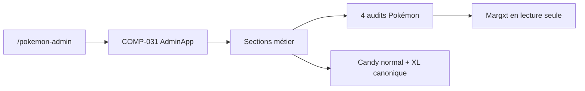

# DOC-011 — Vue d’ensemble du Dashboard

## 1. Périmètre vérifié

Référence du Dashboard Admin, de ses pages, sections, composants, services et dépendances réellement présents.

Le contenu a été rapproché du code le 31 juillet 2026. Les builds, caches, archives et rapports historiques ne servent pas de preuve runtime lorsqu’un fichier source actif existe.

## 2. Inventaire du code

| Élément | Constat vérifié |
| --- | --- |
| Pages et sections | inventoriées depuis les routes et `admin-app.jsx` actifs |
| Audits Pokémon | 4 pages indépendantes sous Qualité & supervision |
| Méthodes API Dashboard | BFF authentifiés et handlers privés |
| Composants React | inventoriés depuis `src/components/admin` |
| Contexte racine | CTX-001, ThemeProvider de next-themes |
| Services Dashboard | SERVICE-001 à SERVICE-005 |

## 3. Implémentation observée

- Le RootLayout monte Providers, puis le layout du groupe dashboard vérifie la session et rend AdminAppFrame.
- PokemonAdminStudio rend AdminApp et ses sections d’administration Pokémon.
- Le design exécuté utilise les thèmes dark et light, huit palettes et les primitives Badge, Button, Card, Input, Textarea et Modal.
- Le Dashboard lit PokemonGo-Data via un voisin ou .data, PokemonGo-API via ses handlers serveur, les assets via GitHub raw et ses données privées via MongoDB Dashboard.

## 4. Relations et dépendances

| Source | Relation | Cible |
| --- | --- | --- |
| PAGE-006 | rend | COMP-049 puis COMP-031 |
| Centre de contrôle | compare en lecture seule | quatre sources Margxt |
| Candies / Fiche / PvP | consomment | `assets.candy.xlImage` |
| Dashboard | consomme | PokemonGo-API-, PokemonGo-Data, PokemonGo-Assets-API et MongoDB |

## 5. Diagramme vérifié

## 6. Références documentaires

### Documents Foundation

- [DOC-006](./DOC-006-architecture-overview.md)
- [DOC-010](./DOC-010-design-system-overview.md)
- [DOC-012](./DOC-012-api-overview.md)
- [DOC-013](./DOC-013-data-overview.md)

### Registres actuels

- [Registre pages](../Reports/Audits/audit-documentation/registries/pages.json)
- [Registre components](../Reports/Audits/audit-documentation/registries/components.json)
- [Registre contexts](../Reports/Audits/audit-documentation/registries/contexts.json)
- [Registre services](../Reports/Audits/audit-documentation/registries/services.json)
- [Registre dependencies](../Reports/Audits/audit-documentation/registries/dependencies.json)

### Fiches spécialisées présentes

- `DATASET-020` — référence historique retirée avec la fonctionnalité associée.
- `WORKFLOW-016` — référence historique retirée avec la fonctionnalité associée.

L’ancienne collection personnelle, ses pages et ses routes ont été retirées du produit le 30 juillet 2026. Les éventuelles collections MongoDB historiques ne constituent plus une fonctionnalité active.

## 7. Informations absentes du code

- Aucune page Settings autonome n’est présente.
- Aucune section Éditeur autonome n’est présente.
- Aucune fiche Markdown unitaire n’est présente pour PAGE-001 à PAGE-048 ni COMP-001 à COMP-136.

## 8. Fichiers sources

- `Dashboard Admin/src/app`
- `Dashboard Admin/src/components/admin`
- `Dashboard Admin/src/data/dashboard.ts`
- `Dashboard Admin/src/proxy.ts`
