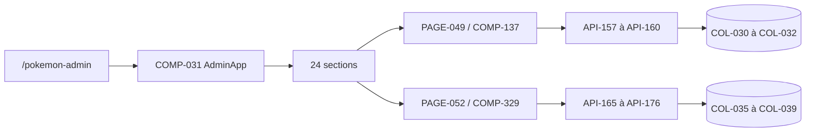

# DOC-011 — Vue d’ensemble du Dashboard

## 1. Périmètre vérifié

Référence du Dashboard Admin, de ses pages, sections, composants, services et dépendances réellement présents.

Le contenu décrit l’état du code au 26 juillet 2026. Les builds, caches, archives et rapports historiques ne servent pas de preuve runtime lorsqu’un fichier source actif existe.

## 2. Inventaire du code

| Élément | Constat vérifié |
| --- | --- |
| Pages routées Dashboard | 20 fichiers page.tsx |
| Sections Admin Pokémon | 24 identifiants dans admin-app.jsx |
| Méthodes API Dashboard | 38 exports GET/POST/PUT/PATCH/DELETE |
| Composants React enregistrés | COMP-001 à COMP-137 sur les trois interfaces |
| Contexte racine | CTX-001, ThemeProvider de next-themes |
| Services Dashboard | SERVICE-001 à SERVICE-005 |

## 3. Implémentation observée

- Le RootLayout monte Providers, puis le layout du groupe dashboard vérifie la session et rend AdminAppFrame.
- La navigation principale contient 18 destinations visibles réparties en cinq groupes; la page Account existe hors navGroups.
- PokemonAdminStudio rend AdminApp. AdminApp contient les 24 sections overview, pokedex, candies, backgrounds, collections, my-collection, assets, catalogs, raids, max-battles, rocket, pvp-rankings, eggs, research, events, shiny, checks, sources, compare, todo, logs, rules, bulk et export.
- La section PAGE-049 charge COMP-137 avec next/dynamic. Elle appelle SERVICE-005 et les routes API-157 à API-160.
- PAGE-052 charge COMP-329 avec `next/dynamic`. La navigation interne est COMP-331 ; le détail utilise COMP-330. Toutes les lectures passent par le BFF de session puis API-165 à API-176 avec le secret serveur.
- Le design exécuté utilise les thèmes dark et light, huit palettes et neuf familles partagées : Badge, Button, Card, Field, Input, Textarea, Modal, Select et Checkbox.
- La consolidation structurelle impose la chaîne tokens → primitives → composants partagés → composants métier → pages. Les candidats génériques compatibles consomment la couche inférieure ; les contrôles riches et palettes Pokémon/Events restent métier.
- `npm run test:design-system` agrège les contrats de famille et le garde-fou global. Il refuse notamment les Select/Checkbox natifs, les anciennes props ErrorState et les façades Field non composées sans figer le nombre de routes ou de consommateurs.
- Geist Sans et Geist Mono sont auto-hébergées par `geist@1.7.2` et chargées dans le RootLayout. Quinze rôles `type-*` portent la hiérarchie générique; les primitives partagées possèdent leurs rôles et les styles Mono/métier restent distincts.
- Le Motion System fournit trois durations, trois easings, des constantes Framer et une politique reduced-motion CSS/Framer globale. Les 69 sites UI génériques et 99 sites reduced-motion éligibles sont couverts; progressions, DnD et motion Pokémon restent spécialisés.
- Le Responsive System utilise les breakpoints Tailwind `sm` à `2xl` sans branchement JavaScript de rendu. Sous `lg`, le shell fournit un drawer borné au viewport avec Escape, piège et restitution du focus; les surfaces plein écran utilisent `dvh` et les contenus larges gardent un scroll local. Les 20 routes sont validées en 375×812, 768×1024 et 1440×1000 dans les deux thèmes.
- Le spacing générique réutilise l’échelle Tailwind. Button/contrôles, Card/Panel/State System et Modal/dialog consomment respectivement les rôles radius `control`, `surface` et `overlay`; cinq niveaux d’élévation `surface`, `raised`, `strong`, `overlay` et `floating` séparent la profondeur UI des glows métier.
- Le Dashboard lit PokemonGo-Data via un voisin ou .data, PokemonGo-API via ses handlers serveur, les assets via GitHub raw et ses données privées via MongoDB Dashboard.

## 4. Relations et dépendances

| Source | Relation | Cible |
| --- | --- | --- |
| PAGE-006 | rend | COMP-049 puis COMP-031 |
| PAGE-049 | rend | COMP-137 |
| COMP-137 | appelle | SERVICE-005 |
| Dashboard | consomme | PokemonGo-API-, PokemonGo-Data, PokemonGo-Assets-API et MongoDB |

## 5. Diagramme vérifié

## 6. Références documentaires

### Documents Foundation

- [DOC-006](./DOC-006-architecture-overview.md)
- [DOC-010](./DOC-010-design-system-overview.md)
- [DOC-012](./DOC-012-api-overview.md)
- [DOC-013](./DOC-013-data-overview.md)

### Registres actuels

- [Registre pages](../Reports/Audits/audit-documentation/registries/pages.json)
- [Registre components](../Reports/Audits/audit-documentation/registries/components.json)
- [Registre contexts](../Reports/Audits/audit-documentation/registries/contexts.json)
- [Registre services](../Reports/Audits/audit-documentation/registries/services.json)
- [Registre dependencies](../Reports/Audits/audit-documentation/registries/dependencies.json)

### Fiches spécialisées présentes

- [PAGE-049](<../Tome 2 — Dashboard Admin/PAGE-049-ma-collection-pokemon-go.md>)
- [COMP-137](<../Tome 3 — Design System/Components/COMP-137-trainer-pokemon-collection-panel.md>)
- [API-157](<../Tome 7 — API/API-157-get-trainer-pokemon.md>)
- [API-158](<../Tome 7 — API/API-158-post-trainer-pokemon-import.md>)
- [API-159](<../Tome 7 — API/API-159-get-trainer-pokemon-imports.md>)
- [API-160](<../Tome 7 — API/API-160-post-trainer-pokemon-rollback.md>)
- [COL-030](<../Tome 8 — MongoDB/COL-030-trainer-pokemon-owners.md>)
- [COL-031](<../Tome 8 — MongoDB/COL-031-trainer-pokemon-snapshots.md>)
- [COL-032](<../Tome 8 — MongoDB/COL-032-trainer-pokemon-entries.md>)
- [DATASET-020](<../Tome 6 — Datasets/DATASET-020-collection-personnelle-pokemon-go.md>)
- [WORKFLOW-016](<../Tome 18 - Workflow/WORKFLOW-016-import-collection-pokemon-go.md>)
- [PAGE-052](<../Tome 2 — Dashboard Admin/PAGE-052-game-master-explorer.md>)
- [COMP-329](<../Tome 3 — Design System/Components/COMP-329-game-master-explorer-panel.md>)
- [COMP-330](<../Tome 3 — Design System/Components/COMP-330-game-master-json-viewer.md>)
- [COMP-331](<../Tome 3 — Design System/Components/COMP-331-admin-pokemon-navigation-responsive.md>)

Les identifiants non listés dans les fiches spécialisées ci-dessus renvoient uniquement aux registres JSON.

## 7. Informations absentes du code

- Aucune page Settings autonome n’est présente.
- Aucune section Éditeur autonome n’est présente.
- Aucune fiche Markdown unitaire n’est présente pour PAGE-001 à PAGE-048 ni COMP-001 à COMP-136.

## 8. Fichiers sources

- `Dashboard Admin/src/app`
- `Dashboard Admin/src/components/admin`
- `Dashboard Admin/src/components/ui`
- `Dashboard Admin/src/app/globals.css`
- `Dashboard Admin/src/data/dashboard.ts`
- `Dashboard Admin/src/proxy.ts`
