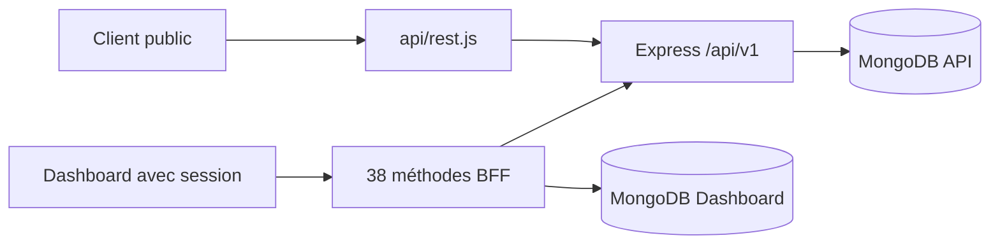

# DOC-012 — Architecture de l’API

## 1. Périmètre vérifié

Référence des surfaces Next.js, Express et Dashboard BFF, des 160 routes enregistrées et de leurs protections.

Le contenu décrit l’état du code au 13 juillet 2026. Les builds, caches, archives et rapports historiques ne servent pas de preuve runtime lorsqu’un fichier source actif existe.

## 2. Inventaire du code

| Élément | Constat vérifié |
| --- | --- |
| Routes PokemonGo-API- | API-001 à API-122 |
| Routes Dashboard | API-123 à API-160 |
| Entrées publiques | 92 |
| Entrées privées | 67 |
| Entrée interne bloquée | API-007 |
| Documentation | /api-docs.json, /api-docs, /swagger |

## 3. Implémentation observée

- PokemonGo-API- sert quatre pages App Router, trois fonctions Vercel et une application Express montée sous api/rest.js.
- Express applique requestId, Helmet, CORS, compression, Morgan, rate limiting, cache GET, middleware read-only, routes et middleware d’erreur.
- Les routes statiques lisent les modèles Mongoose et exposent pagination, recherche, projections ou catalogues selon leur module.
- Le routeur current dessert raids, eggs, max-battles, rocket, research, shiny et pvp-rankings. Il impose no-store; les mutations import et regenerate exigent x-api-admin-secret.
- Les routes API-157 à API-160 sont privées au Dashboard, vérifient getSession et isolent les données avec session.email.
- OpenAPI n’inclut ni les routes Shiny privées ni les routes trainer-pokemon du Dashboard.

## 4. Relations et dépendances

| Source | Relation | Cible |
| --- | --- | --- |
| Vercel | redirige /api/v1, docs et health vers | api/rest.js |
| api/rest.js | encapsule | Express src/app.js |
| Routes Express | lisent | MongoDB |
| Dashboard BFF | relaie avec secret serveur | mutations PokemonGo-API |

## 5. Diagramme vérifié

## 6. Références documentaires

### Documents Foundation

- [DOC-006](./DOC-006-architecture-overview.md)
- [DOC-011](./DOC-011-dashboard-overview.md)
- [DOC-017](./DOC-017-mongodb-overview.md)
- [DOC-019](./DOC-019-authentication.md)
- [DOC-020](./DOC-020-security.md)

### Registres actuels

- [Registre api](../../../../audit-documentation/registries/api-routes.json)
- [Registre datasets](../../../../audit-documentation/registries/datasets.json)
- [Registre mongo](../../../../audit-documentation/registries/mongodb-collections.json)
- [Registre dependencies](../../../../audit-documentation/registries/dependencies.json)

### Fiches spécialisées présentes

- [API-157](<../Post-audit 2026-07-13/API-157-get-trainer-pokemon.md>)
- [API-158](<../Post-audit 2026-07-13/API-158-post-trainer-pokemon-import.md>)
- [API-159](<../Post-audit 2026-07-13/API-159-get-trainer-pokemon-imports.md>)
- [API-160](<../Post-audit 2026-07-13/API-160-post-trainer-pokemon-rollback.md>)

Les identifiants non listés dans les fiches spécialisées ci-dessus renvoient uniquement aux registres JSON.

## 7. Informations absentes du code

- Aucune version OpenAPI alignée automatiquement sur package.json n’est présente.
- Aucune fiche Markdown unitaire n’est présente pour API-001 à API-156.
- Aucune politique de compatibilité entre les 160 contrats n’est codée.

## 8. Fichiers sources

- `PokemonGo-API-/src/app.js`
- `PokemonGo-API-/src/routes`
- `PokemonGo-API-/src/current-datasets/router.js`
- `PokemonGo-API-/api`
- `Dashboard Admin/src/app/api`
