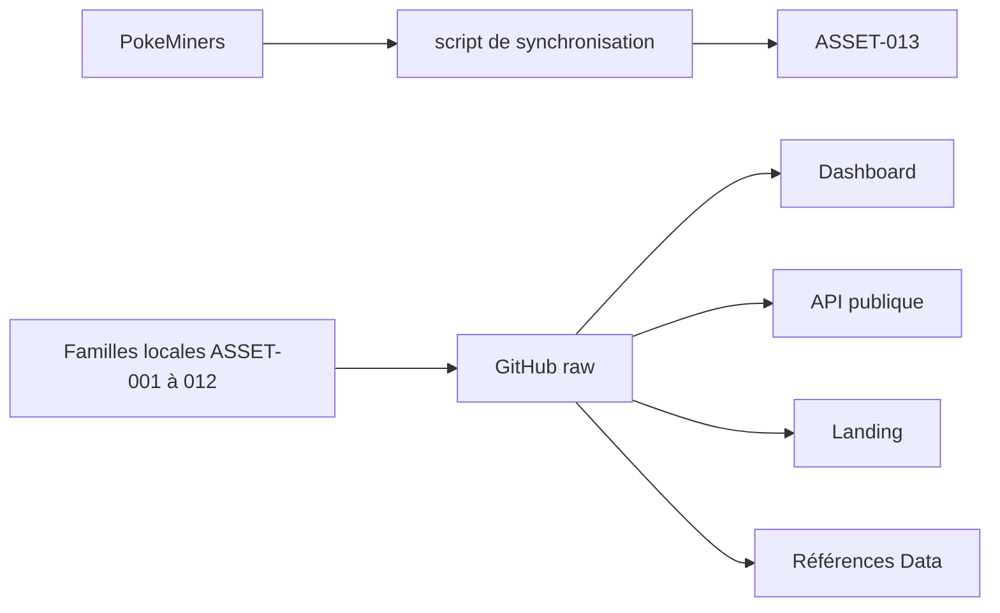

# DOC-014 — Architecture des assets

## 1. Périmètre vérifié

Référence des 17 familles d’assets, de leur stockage et de leurs consommateurs réels.

Le contenu décrit l’état du code au 13 juillet 2026. Les builds, caches, archives et rapports historiques ne servent pas de preuve runtime lorsqu’un fichier source actif existe.

## 2. Inventaire du code

| Élément | Constat vérifié |
| --- | --- |
| ASSET-001 à ASSET-004 | LocationCards, MegaPortraits, Pokémon GO, Pokémon HOME HD |
| ASSET-005 à ASSET-008 | Stickers, TypeBackgrounds, Types, candy |
| ASSET-009 à ASSET-012 | divers, items, pokemonShuffle, weather |
| ASSET-013 à ASSET-014 | miroir et cache PokeMiners |
| ASSET-015 à ASSET-017 | public Dashboard, asset API local, références JSON Data |
| Fichiers Git suivis du dépôt Assets | 22 634 |

## 3. Implémentation observée

- Les consommateurs publics chargent les médias depuis raw.githubusercontent.com sur la branche main.
- PokemonGo-Data stocke des références d’assets dans pokemon-assets et dans les fiches Pokémon.
- Le script sync-pokeminers-pogo-assets télécharge une archive, extrait un cache puis remplace le miroir PokeMiners-pogo_assets.
- Les index candy/index.json, pokemonShuffle/index.json et weather/index.json décrivent trois familles.
- Dashboard Admin autorise raw.githubusercontent.com et avatars.githubusercontent.com dans next/image; la Landing autorise raw.githubusercontent.com et pokemon-go-api.vercel.app.
- Le Dashboard combine next/image et des balises img; les composants Pokémon utilisent aussi des URL raw codées dans uiAssets et admin-app.jsx.

## 4. Relations et dépendances

| Source | Relation | Cible |
| --- | --- | --- |
| PokeMiners | alimente | ASSET-013 |
| PokemonGo-Assets-API | alimente | Dashboard, API, Landing et Data |
| PokemonGo-Data/pokemon-assets | référence | fichiers médias publiés |

## 5. Diagramme vérifié

## 6. Références documentaires

### Documents Foundation

- [DOC-005](./DOC-005-repositories.md)
- [DOC-006](./DOC-006-architecture-overview.md)
- [DOC-011](./DOC-011-dashboard-overview.md)
- [DOC-013](./DOC-013-data-overview.md)

### Registres actuels

- [Registre assets](../../../../audit-documentation/registries/assets.json)
- [Registre dependencies](../../../../audit-documentation/registries/dependencies.json)

### Fiches spécialisées présentes

- [COMP-137](<../Post-audit 2026-07-13/COMP-137-trainer-pokemon-collection-panel.md>)
- [DATASET-020](<../Post-audit 2026-07-13/DATASET-020-collection-personnelle-pokemon-go.md>)

## 7. Informations absentes du code

- Aucune version de package n’est présente dans PokemonGo-Assets-API.
- Aucune licence de dépôt n’est présente.
- Aucune fiche Markdown ASSET-* unitaire n’est présente.
- Aucun workflow CI de validation des fichiers et liens raw n’est présent.

## 8. Fichiers sources

- `PokemonGo-Assets-API`
- `PokemonGo-Assets-API/scripts/sync-pokeminers-pogo-assets.js`
- `Dashboard Admin/next.config.ts`
- `Landing-Page-PogoApi/next.config.mjs`
