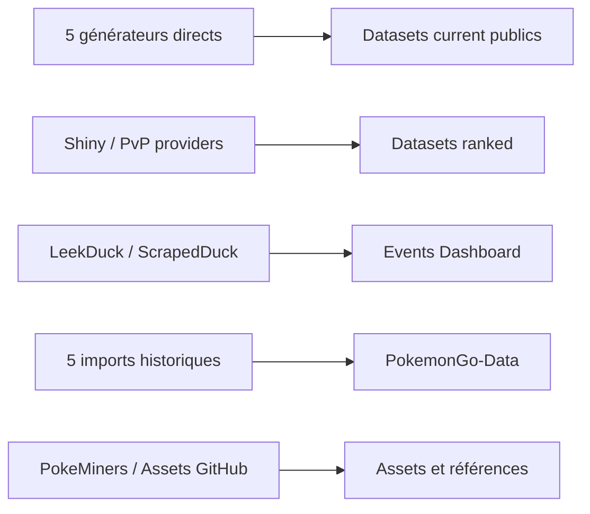

# DOC-015 — Vue d’ensemble des providers

## 1. Périmètre vérifié

Référence des 18 sources et adaptateurs recensés dans les générateurs, scrapers et imports.

Le contenu décrit l’état du code au 13 juillet 2026. Les builds, caches, archives et rapports historiques ne servent pas de preuve runtime lorsqu’un fichier source actif existe.

## 2. Inventaire du code

| Élément | Constat vérifié |
| --- | --- |
| PROVIDER-001 à 005 | LeekDuck raids, eggs, rocket, research; Snacknap max battles |
| PROVIDER-006 à 008 | Snacknap Shiny, fixture Shiny, PvPoke |
| PROVIDER-009 à 010 | LeekDuck Events et ScrapedDuck |
| PROVIDER-011 à 013 | PokeMiners game_masters, pogo_assets et Margxt |
| PROVIDER-014 à 018 | pogoapi.net, PokeAPI, Bulbapedia, Serebii et dépôt Assets GitHub |
| Contrat formel dataset-provider | Shiny et PvP Rankings |

## 3. Implémentation observée

- Les générateurs raids, eggs, max-battles, rocket et research intègrent directement fetch, parsing, normalisation et enrichissement.
- Le contrat scripts/lib/dataset-provider.js est utilisé par les providers Shiny et PvP.
- Le provider fixture Shiny sert aux tests et au mode fixture du générateur.
- Le scraper Events combine feed et pages LeekDuck avec des références ScrapedDuck, limite la concurrence et poursuit après certains échecs de détail.
- Les scripts import de PokemonGo-API ont un mode lecture/dry-run et des variantes :write déclarées dans package.json.
- Les providers assets PokeMiners et PokemonGo-Assets-API publient des fichiers ou références, pas des réponses JSON runtime via un serveur Assets dédié.

## 4. Relations et dépendances

| Source | Relation | Cible |
| --- | --- | --- |
| PROVIDER-001 à 005 | produisent | DATASET-012 à 016 |
| PROVIDER-006 | produit | DATASET-017 |
| PROVIDER-008 | produit | DATASET-018 |
| PROVIDER-009 et 010 | alimentent | collection events |

## 5. Diagramme vérifié

## 6. Références documentaires

### Documents Foundation

- [DOC-013](./DOC-013-data-overview.md)
- [DOC-016](./DOC-016-dataset-overview.md)
- [DOC-027](./DOC-027-error-handling.md)
- [DOC-028](./DOC-028-logging.md)

### Registres actuels

- [Registre providers](../../../../audit-documentation/registries/providers.json)
- [Registre datasets](../../../../audit-documentation/registries/datasets.json)
- [Registre dependencies](../../../../audit-documentation/registries/dependencies.json)

### Fiches spécialisées présentes

Aucune fiche spécialisée liée n’est présente.

## 7. Informations absentes du code

- Aucune interface commune de timeout et retry ne couvre les 18 providers.
- Les licences et conditions d’utilisation ne sont pas codées pour les sources externes.
- Aucune fiche Markdown PROVIDER-* unitaire n’est présente.

## 8. Fichiers sources

- `PokemonGo-Data/scripts/generateCurrentRaids.js`
- `PokemonGo-Data/scripts/providers`
- `Dashboard Admin/src/lib/leekduck-events-scraper.ts`
- `PokemonGo-API-/scripts/import`
- `PokemonGo-Assets-API/scripts/sync-pokeminers-pogo-assets.js`
