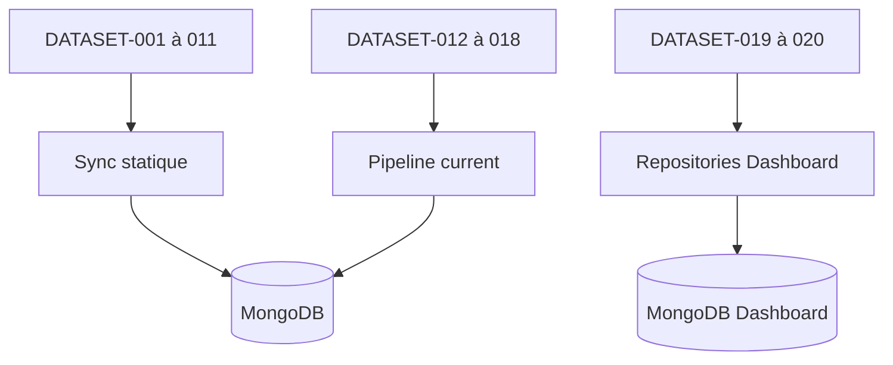

# DOC-016 — Vue d’ensemble des datasets

## 1. Périmètre vérifié

Référence des 20 datasets, de leur visibilité, stockage, pipeline et source runtime.

Le contenu décrit l’état du code au 13 juillet 2026. Les builds, caches, archives et rapports historiques ne servent pas de preuve runtime lorsqu’un fichier source actif existe.

## 2. Inventaire du code

| Élément | Constat vérifié |
| --- | --- |
| DATASET-001 à 011 | Référentiels Pokémon, formes, assets, moves, types, weather, generations, items, rocket texts, stickers et candy |
| DATASET-012 à 016 | Raids, eggs, max battles, Rocket et Research publics |
| DATASET-017 | Shiny Tracker privé |
| DATASET-018 | PvP Rankings public |
| DATASET-019 | Source Watch privé admin |
| DATASET-020 | Collection Pokémon du dresseur privée |

## 3. Implémentation observée

- DATASET-001 à 011 partent de fichiers versionnés PokemonGo-Data et alimentent les collections statiques ou des réponses dérivées.
- DATASET-012 à 016 lisent uniquement MongoDB au runtime; leurs JSON locaux ne servent pas de fallback runtime.
- DATASET-017 utilise shiny_rankings et shiny_snapshots, exige le secret API et reste absent d’OpenAPI.
- DATASET-018 utilise pvprankings, un document current compressé et des routes publiques.
- DATASET-019 stocke la configuration dans source-watch/sources.json et l’historique dans dashboard_store.
- DATASET-020 ne conserve aucun export utilisateur dans Git; son snapshot actif dans MongoDB Dashboard est la source de lecture.

## 4. Relations et dépendances

| Source | Relation | Cible |
| --- | --- | --- |
| DATASET-001 à 011 | proviennent de | PokemonGo-Data |
| DATASET-012 à 018 | sont servis par | PokemonGo-API |
| DATASET-019 à 020 | sont servis par | Dashboard Admin |

## 5. Diagramme vérifié

## 6. Références documentaires

### Documents Foundation

- [DOC-013](./DOC-013-data-overview.md)
- [DOC-015](./DOC-015-provider-overview.md)
- [DOC-017](./DOC-017-mongodb-overview.md)
- [DOC-033](./DOC-033-public-private-datasets.md)

### Registres actuels

- [Registre datasets](../../../../audit-documentation/registries/datasets.json)
- [Registre providers](../../../../audit-documentation/registries/providers.json)
- [Registre api](../../../../audit-documentation/registries/api-routes.json)
- [Registre mongo](../../../../audit-documentation/registries/mongodb-collections.json)
- [Registre dependencies](../../../../audit-documentation/registries/dependencies.json)

### Fiches spécialisées présentes

- [DATASET-020](<../Post-audit 2026-07-13/DATASET-020-collection-personnelle-pokemon-go.md>)
- [WORKFLOW-016](<../Post-audit 2026-07-13/WORKFLOW-016-import-collection-pokemon-go.md>)

## 7. Informations absentes du code

- Aucune fiche Markdown unitaire n’est présente pour DATASET-001 à DATASET-019.
- Aucune version globale ne couvre les 20 datasets.
- Aucune fréquence de régénération n’est codée sous forme de cron.

## 8. Fichiers sources

- `PokemonGo-Data/package.json`
- `PokemonGo-API-/src/current-datasets`
- `Dashboard Admin/src/lib/learning`
- `Dashboard Admin/src/lib/trainer-pokemon`
