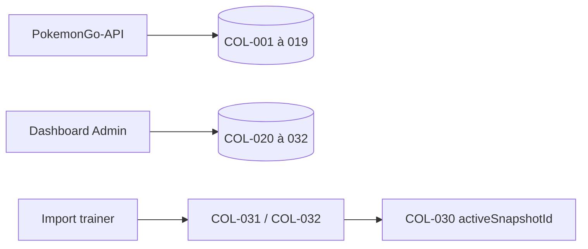

# DOC-017 — Vue d’ensemble MongoDB

## 1. Périmètre vérifié

Référence des 32 collections, des deux bases logiques et des index déclarés dans le code.

Le contenu décrit l’état du code au 13 juillet 2026. Les builds, caches, archives et rapports historiques ne servent pas de preuve runtime lorsqu’un fichier source actif existe.

## 2. Inventaire du code

| Élément | Constat vérifié |
| --- | --- |
| COL-001 à 019 | Base MONGODB_URI de PokemonGo-API |
| COL-020 à 029 | Base DASHBOARD_MONGODB_DB du Dashboard |
| COL-030 | trainer_pokemon_owners |
| COL-031 | trainer_pokemon_snapshots |
| COL-032 | trainer_pokemon_entries |
| COL-035 à COL-039 | Game Master state, templates, snapshots, diffs et comparaison locale |
| TTL déclarés | 0 |

## 3. Implémentation observée

- Les collections API sont eggs, generations, globalstats, items, maxbattles, moves, pokemons, pokemonAssets, pvp_rankings, raids, researches, regions, rockets, rocket_texts, shiny_rankings, shiny_snapshots, syncruns, types et weathers.
- Les collections Dashboard existantes sont dashboard_store, dashboard_api_metrics, dashboard_backlog, events et les six collections learning.
- trainer_pokemon_owners porte un index unique owner et les pointeurs activeSnapshotId et previousSnapshotId.
- trainer_pokemon_snapshots indexe owner/importedAt et owner/status/importedAt.
- trainer_pokemon_entries possède neuf index, dont l’unicité owner+snapshotId+sourceId et les accès par numéro, nom, CP, IV, états, genre, alignement, forme et costume.
- Les modèles Mongoose désactivent versionKey sur les modèles observés; le versionnement métier repose sur timestamps, hash, snapshots ou historique applicatif.
- COL-035 porte le pointeur Game Master actif. COL-036 à COL-039 sont écrites en staging avant cette bascule ; la rétention est illimitée par défaut.

## 4. Relations et dépendances

| Source | Relation | Cible |
| --- | --- | --- |
| Sync statique | écrit | COL-002 à 004, 006 à 008, 012, 014, 018 à 019 |
| Current pipeline | écrit | COL-001, 005, 009 à 011, 013, 015 à 016 |
| Trainer repository | écrit | COL-030 à COL-032 |
| Game Master pipeline | écrit | COL-035 à COL-039 |

## 5. Diagramme vérifié

## 6. Références documentaires

### Documents Foundation

- [DOC-012](./DOC-012-api-overview.md)
- [DOC-013](./DOC-013-data-overview.md)
- [DOC-016](./DOC-016-dataset-overview.md)
- [DOC-018](./DOC-018-cache-overview.md)

### Registres actuels

- [Registre mongo](../../../../audit-documentation/registries/mongodb-collections.json)
- [Registre datasets](../../../../audit-documentation/registries/datasets.json)
- [Registre dependencies](../../../../audit-documentation/registries/dependencies.json)

### Fiches spécialisées présentes

- [COL-030](<../Post-audit 2026-07-13/COL-030-trainer-pokemon-owners.md>)
- [COL-031](<../Post-audit 2026-07-13/COL-031-trainer-pokemon-snapshots.md>)
- [COL-032](<../Post-audit 2026-07-13/COL-032-trainer-pokemon-entries.md>)
- [COL-035 à COL-039](<../Post-audit 2026-07-15/COL-035-game-master-states.md>)

## 7. Informations absentes du code

- Aucun TTL n’est déclaré dans les 32 entrées du registre.
- Aucun validateur MongoDB côté serveur n’est codé pour les collections Dashboard.
- Aucune fiche Markdown unitaire n’est présente pour COL-001 à COL-029.
- La configuration réseau et les sauvegardes Atlas ne sont pas présentes dans le code.

## 8. Fichiers sources

- `PokemonGo-API-/src/models`
- `PokemonGo-API-/src/sync`
- `Dashboard Admin/src/lib/dashboard-store.ts`
- `Dashboard Admin/src/lib/learning/repository.ts`
- `Dashboard Admin/src/lib/trainer-pokemon/repository.ts`
