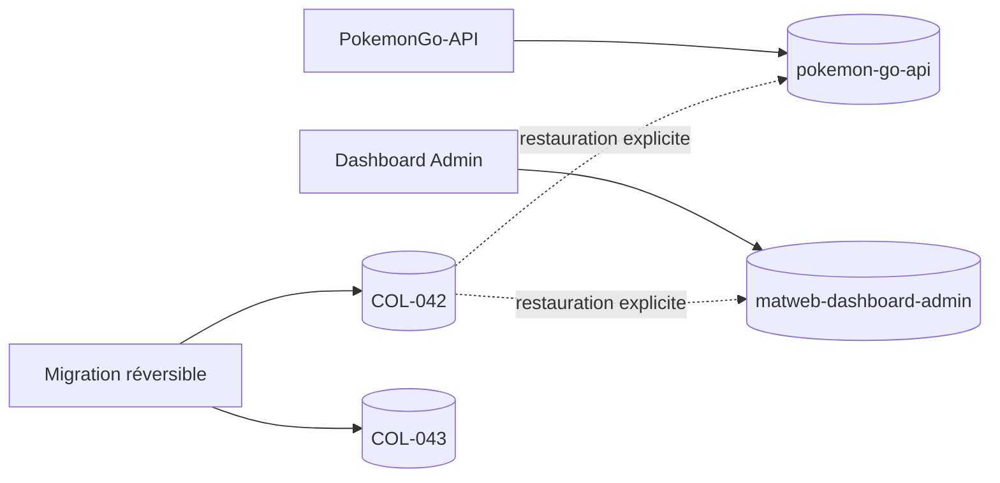

# DOC-017 — Vue d’ensemble MongoDB

## 1. Périmètre

La plateforme sépare la base API `pokemon-go-api` de la base privée Dashboard `matweb-dashboard-admin`. Les collections runtime alimentent l’API, les datasets courants, Identity Manager, les événements, le Dashboard et Learning.

## 2. Collections retirées

Les collections `trainer_pokemon_entries`, `trainer_pokemon_snapshots` et `trainer_pokemon_owners` ont été vidées le 31 juillet 2026 après sauvegarde. Elles n’ont plus de route, provider, permission, cache ou consommateur actif.

## 3. Archives de migration

- COL-042 `migration_retired_features_archive` conserve les documents originaux et leurs empreintes ;
- COL-043 `migration_manifests` conserve le résultat et l’état de restauration ;
- ces deux collections sont historiques/techniques et sont exclues de tout workflow Identity Manager.

## 4. Relations

```mermaid
flowchart LR
  API["PokemonGo-API"] --> API_DB[("pokemon-go-api")]
  DASH["Dashboard Admin"] --> DASH_DB[("matweb-dashboard-admin")]
  MIG["Migration réversible"] --> ARCH[("COL-042")]
  MIG --> MAN[("COL-043")]
  ARCH -. restauration explicite .-> API_DB
  ARCH -. restauration explicite .-> DASH_DB
```

## 5. Invariants

- aucune suppression matérielle avant sauvegarde vérifiée ;
- aucune archive historique affichée comme tâche active ;
- aucun provider ne peut être créé depuis une valeur seulement présente en base ;
- aucune donnée d’audit externe n’écrit directement les fiches Pokémon.
