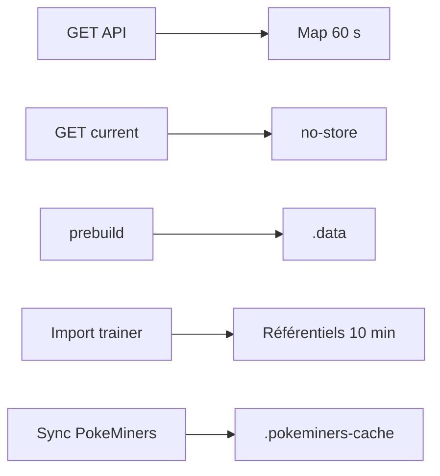

# DOC-018 — Cache applicatif

## 1. Périmètre vérifié

Référence des caches mémoire, HTTP, build, assets et référentiels réellement implémentés.

Le contenu décrit l’état du code au 13 juillet 2026. Les builds, caches, archives et rapports historiques ne servent pas de preuve runtime lorsqu’un fichier source actif existe.

## 2. Inventaire du code

| Élément | Constat vérifié |
| --- | --- |
| Cache Express | Map mémoire, TTL 60 s, maximum 5 000 entrées |
| Bypass current | no-store et X-Cache BYPASS |
| Events public | max-age=60, stale-while-revalidate=300 |
| Référentiels trainer | Promise mémoire, TTL 10 minutes |
| Snapshot Data | .data/PokemonGo-Data |
| Cache Assets | .pokeminers-cache |

## 3. Implémentation observée

- Le cache Express ne stocke que les GET 2xx sans no-store et expose HIT, MISS ou BYPASS dans X-Cache.
- fresh=true contourne le cache. clearCache efface tout; invalidateDatasetCache efface les préfixes des cinq current publics historiques.
- Le routeur current impose Cache-Control no-store, Pragma no-cache et Expires 0.
- Le Dashboard envoie private, no-store sur ses routes privées et sur les réponses trainer-pokemon.
- fetchTrainerPokemonReferences regroupe Pokémon, moves et types dans une Promise partagée pendant dix minutes; une erreur remet la Promise et le timestamp à zéro.
- ensure-data crée un clone ou snapshot dérivé dans .data; le script de PokeMiners utilise un cache de téléchargement et d’extraction.

## 4. Relations et dépendances

| Source | Relation | Cible |
| --- | --- | --- |
| GET statique | passe par | cache Express |
| GET current | bypass | cache Express |
| Import trainer | lit | cache de référentiels 10 minutes |
| Build | lit | .data snapshot |

## 5. Diagramme vérifié

## 6. Références documentaires

### Documents Foundation

- [DOC-012](./DOC-012-api-overview.md)
- [DOC-017](./DOC-017-mongodb-overview.md)
- [DOC-022](./DOC-022-performance.md)
- [DOC-032](./DOC-032-local-cache.md)

### Registres actuels

- [Registre api](../../../../audit-documentation/registries/api-routes.json)
- [Registre datasets](../../../../audit-documentation/registries/datasets.json)
- [Registre assets](../../../../audit-documentation/registries/assets.json)

### Fiches spécialisées présentes

Aucune fiche spécialisée liée n’est présente.

## 7. Informations absentes du code

- Aucun cache distribué n’est présent.
- Aucune métrique de hit ratio n’est présente.
- Aucune limite de poids du cache Express n’est présente.
- La revalidation CDN effective du déploiement n’est pas présente dans le code.

## 8. Fichiers sources

- `PokemonGo-API-/src/lib/cache.js`
- `PokemonGo-API-/src/current-datasets/router.js`
- `Dashboard Admin/scripts/data/ensure-data.js`
- `Dashboard Admin/src/lib/trainer-pokemon/references.ts`
- `PokemonGo-Assets-API/.pokeminers-cache`
