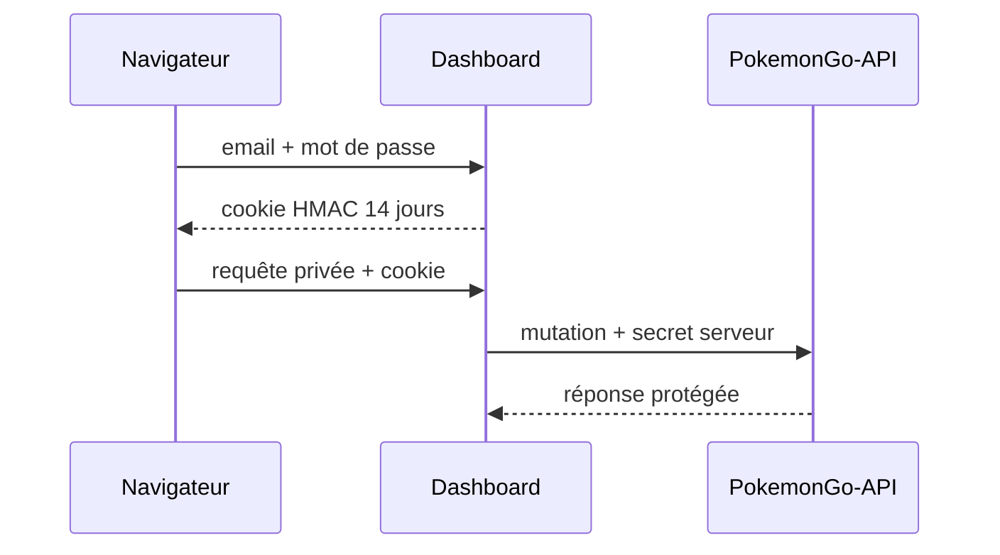

# DOC-019 — Authentification

## 1. Périmètre vérifié

Référence de la session Dashboard, du secret administrateur API et des contrôles par route.

Le contenu décrit l’état du code au 13 juillet 2026. Les builds, caches, archives et rapports historiques ne servent pas de preuve runtime lorsqu’un fichier source actif existe.

## 2. Inventaire du code

| Élément | Constat vérifié |
| --- | --- |
| Compte Dashboard | ADMIN_EMAIL et ADMIN_PASSWORD |
| Jeton | payload JSON base64url signé HMAC-SHA256 |
| Cookie | matweb_dashboard_session, HttpOnly, SameSite=Lax |
| Durée | 14 jours |
| Rôle | admin |
| Secret API | x-api-admin-secret comparé en temps constant |

## 3. Implémentation observée

- POST /api/session applique rateLimit, assertSameOrigin, validateCredentials et safeInternalPath, puis écrit le cookie et répond par une redirection 303.
- En production, ADMIN_EMAIL, ADMIN_PASSWORD et SESSION_SECRET sont tous obligatoires; leur absence refuse la connexion.
- Le proxy protège les pages hors chemins publics. Les préfixes dashboard-store, pokemon-admin, trainer-pokemon, backlog, admin/events et learning passent jusqu’aux contrôles getSession de leurs handlers.
- Les quatre routes trainer-pokemon vérifient la session et le rôle admin; le repository utilise session.email comme owner.
- PokemonGo-API autorise les lectures publiques, protège Shiny et les mutations avec API_ADMIN_SECRET et refuse les mutations legacy read-only.
- Le Dashboard ajoute POKEMON_API_ADMIN_SECRET côté serveur lorsqu’il relaie une mutation autorisée vers PokemonGo-API.

## 4. Relations et dépendances

| Source | Relation | Cible |
| --- | --- | --- |
| Navigateur | présente | cookie Dashboard |
| Handlers Dashboard | vérifient | getSession |
| Dashboard BFF | présente | x-api-admin-secret |
| PokemonGo-API | autorise | route publique ou secret valide |

## 5. Diagramme vérifié

## 6. Références documentaires

### Documents Foundation

- [DOC-011](./DOC-011-dashboard-overview.md)
- [DOC-012](./DOC-012-api-overview.md)
- [DOC-020](./DOC-020-security.md)
- [DOC-033](./DOC-033-public-private-datasets.md)

### Registres actuels

- [Registre api](../../../../audit-documentation/registries/api-routes.json)
- [Registre pages](../../../../audit-documentation/registries/pages.json)
- [Registre dependencies](../../../../audit-documentation/registries/dependencies.json)

### Fiches spécialisées présentes

- [PAGE-049](<../Post-audit 2026-07-13/PAGE-049-ma-collection-pokemon-go.md>)
- [API-157](<../Post-audit 2026-07-13/API-157-get-trainer-pokemon.md>)
- [API-158](<../Post-audit 2026-07-13/API-158-post-trainer-pokemon-import.md>)
- [API-159](<../Post-audit 2026-07-13/API-159-get-trainer-pokemon-imports.md>)
- [API-160](<../Post-audit 2026-07-13/API-160-post-trainer-pokemon-rollback.md>)

## 7. Informations absentes du code

- Aucun MFA n’est présent.
- Aucun store de révocation de session n’est présent.
- Aucun rôle distinct d’admin n’est présent.
- Aucun hash de mot de passe applicatif n’est présent.

## 8. Fichiers sources

- `Dashboard Admin/src/lib/auth.ts`
- `Dashboard Admin/src/lib/session-token.ts`
- `Dashboard Admin/src/proxy.ts`
- `PokemonGo-API-/src/lib/admin-auth.js`
- `PokemonGo-API-/src/middleware/read-only.js`
