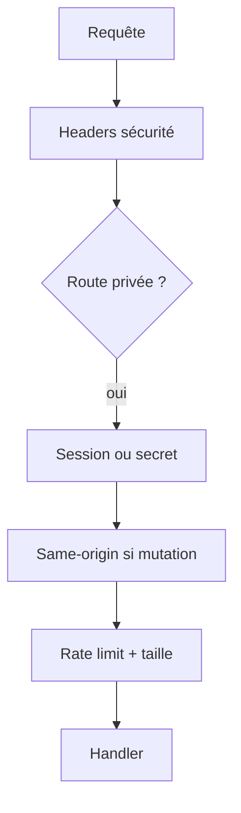

# DOC-020 — Sécurité

## 1. Périmètre vérifié

Référence des protections HTTP, origine, payload, rate limits, secrets et frontières public/privé.

Le contenu décrit l’état du code au 13 juillet 2026. Les builds, caches, archives et rapports historiques ne servent pas de preuve runtime lorsqu’un fichier source actif existe.

## 2. Inventaire du code

| Élément | Constat vérifié |
| --- | --- |
| Headers Dashboard | CSP, COOP, Referrer-Policy, nosniff, DENY, Permissions-Policy |
| Headers API | Next security headers et Helmet |
| Origine mutations | assertSameOrigin |
| Rate limit Dashboard | Map mémoire par IP et label |
| Rate limit API | express-rate-limit |
| Taille trainer import | 12 000 000 octets et 20 000 entrées |

## 3. Implémentation observée

- safeInternalPath refuse les chemins externes, les doubles slashs et les backslashes.
- assertSameOrigin compare l’origine du header Origin avec l’origine de request.url pour POST, PUT, PATCH et DELETE.
- La CSP Dashboard autorise unsafe-inline et unsafe-eval dans script-src; la CSP API ajoute unsafe-eval uniquement en développement.
- PokemonGo-API applique CORS_ORIGINS, Helmet, compression, limite JSON et rate limit global.
- Le proxy PokemonGo-API du Dashboard limite les chemins aux routes système, à une allowlist admin ou aux chemins OpenAPI résolus.
- trainerPokemonServerError masque les messages 5xx et conserve codes et issues de validation pour les erreurs contrôlées.

## 4. Relations et dépendances

| Source | Relation | Cible |
| --- | --- | --- |
| Proxy Dashboard | protège | pages privées |
| Handlers privés | appliquent | session, origine et rate limit |
| API read-only | bloque | mutations non admin |
| Secret API | protège | Shiny et mutations current |

## 5. Diagramme vérifié

## 6. Références documentaires

### Documents Foundation

- [DOC-012](./DOC-012-api-overview.md)
- [DOC-019](./DOC-019-authentication.md)
- [DOC-027](./DOC-027-error-handling.md)
- [DOC-033](./DOC-033-public-private-datasets.md)

### Registres actuels

- [Registre api](../../../../audit-documentation/registries/api-routes.json)
- [Registre datasets](../../../../audit-documentation/registries/datasets.json)
- [Registre mongo](../../../../audit-documentation/registries/mongodb-collections.json)

### Fiches spécialisées présentes

- [API-157](<../Post-audit 2026-07-13/API-157-get-trainer-pokemon.md>)
- [API-158](<../Post-audit 2026-07-13/API-158-post-trainer-pokemon-import.md>)
- [API-159](<../Post-audit 2026-07-13/API-159-get-trainer-pokemon-imports.md>)
- [API-160](<../Post-audit 2026-07-13/API-160-post-trainer-pokemon-rollback.md>)
- [WORKFLOW-016](<../Post-audit 2026-07-13/WORKFLOW-016-import-collection-pokemon-go.md>)

## 7. Informations absentes du code

- Aucun WAF n’est configuré dans le code local.
- Aucun scan SAST ou DAST n’est configuré.
- Aucune rotation de secrets n’est codée.
- Les règles réseau Atlas ne sont pas présentes.

## 8. Fichiers sources

- `Dashboard Admin/src/lib/security.ts`
- `Dashboard Admin/src/proxy.ts`
- `PokemonGo-API-/src/app.js`
- `PokemonGo-API-/next.config.mjs`
- `PokemonGo-API-/src/lib/admin-auth.js`
